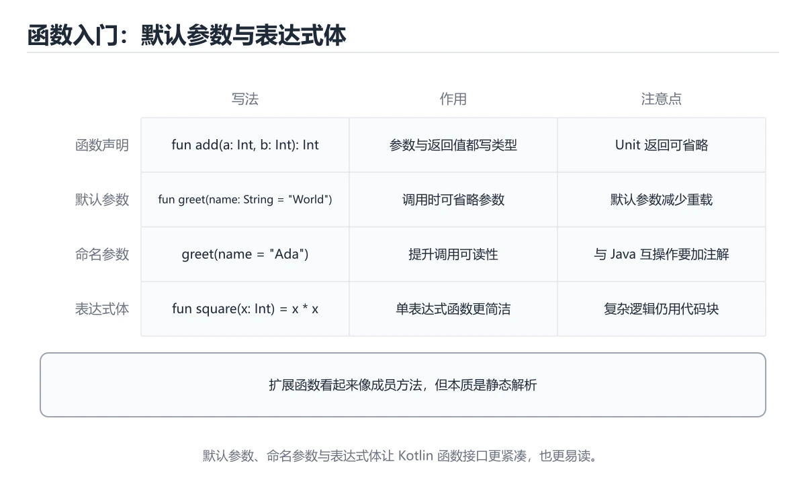
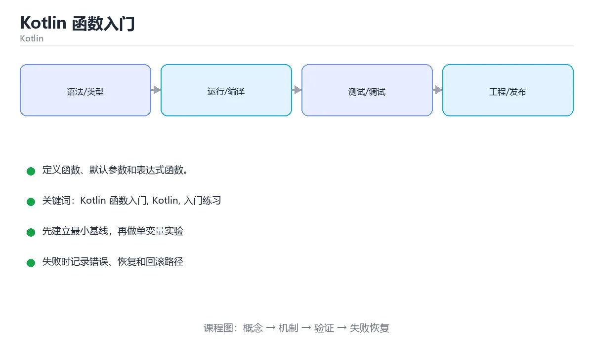

# Kotlin 函数入门

> 内容更新时间：2026-10-06





## 学习目标

- 先认识Kotlin 函数入门需要的工具、输入和输出。
- 按步骤运行最小示例，并记录结果与错误。
- 用一个边界输入验证自己是否真正掌握。

## 前置知识

- 会进行基本的文件或命令行操作。
- 不需要预先掌握「Kotlin」的高级知识。

## 一句话入门

定义函数、默认参数和表达式函数。

## 最小示例

```kotlin
fun square(n: Int) = n * n

fun main() {
    println("square(7)=${square(7)}")
}
```

## 预期输出

```text
square(7)=49
```

## 常见错误

- 直接访问可空变量，编译期要求先做空值处理。
- 复制命令时遗漏空格、引号或必要参数。

## 动手练习

1. 原样运行最小示例，保存命令和输出。
2. 把数字 2 改成 10，预测并验证新结果。
3. 制造一个错误输入，写出错误信息和修复方法。

## 本课小结

- 入门阶段先保证能运行、能观察、能解释，再追求复杂功能。
- 每次只改一个变量，记录预测与实际结果。
- 遇到错误先看第一条错误信息，再回到最小示例。

## 代码实验：把示例跑成证据

### 实验一：建立基线

```kotlin
fun square(n: Int) = n * n

fun main() {
    println("square(7)=${square(7)}")
}
```

### 实验二：只改一个输入

沿用「Kotlin 函数入门」的最小示例做一次单变量实验：

| 实验 | 改动 | 预测 | 实际 | 结论 |
| --- | --- | --- | --- | --- |
| 基线 | 保持「Kotlin 函数入门」示例原样 |  |  |  |
| 边界 | 把Kotlin 函数入门换成空值或极值 |  |  |  |
| 失败 | 给Kotlin传入非法输入 |  |  |  |

做完后用一句话写出「Kotlin 函数入门」的结论：输入怎么变，结果才怎么变。

### 实验三：制造一个可控错误

把输入改成空值、极值或类型不匹配的形式，记录程序抛出的第一条错误、发生位置和恢复方式。

| 实验 | 改动 | 预测 | 实际 | 结论 |
| --- | --- | --- | --- | --- |
| 基线 | 保持原样 |  |  |  |
| 边界 |  |  |  |  |
| 失败 |  |  |  |  |

### 实验四：用三句话复述

1. 输入是什么，哪些输入属于合法范围，哪些属于边界或非法范围？
2. 程序按什么顺序处理输入，在哪一步产生了状态变化或副作用？
3. 输出如何验证，失败时第一条可观察证据是什么？

## Kotlin 基础机制速览

### JVM、Android 与工具链

Kotlin 主要编译成 JVM 字节码，也可以编译成 JavaScript 或原生代码。Android 开发常用 Gradle 构建，Kotlin 与 Java 可以互操作：Kotlin 调用 Java 时要注意平台类型可能为空，Java 调用 Kotlin 时要注意默认参数、扩展函数和顶层函数的生成方式。理解编译目标和互操作边界，能解释很多“本地能跑、发布变慢或崩溃”的问题。

### val/var、类型与空安全

`val` 是只读引用，`var` 是可重新赋值的引用；只读引用指向的对象内容仍可能可变。Kotlin 区分可空类型 `T?` 和非空类型 `T`，编译器要求使用安全调用 `?.`、Elvis 运算符 `?:`、非空断言 `!!` 或智能转换处理空值。`lateinit` 适合生命周期保证会初始化的 var，`by lazy` 适合第一次访问时初始化；两者都不能滥用。

### 函数、表达式与数据类

Kotlin 函数是表达式，单表达式函数可以省略花括号和 return。默认参数、命名参数、扩展函数和顶层函数减少工具类的数量。`data class` 自动生成 equals、hashCode、toString 和 copy，适合值对象；`sealed class` 和 sealed interface 表达有限的互斥状态，配合 when 可以做穷尽检查。高阶函数和 lambda 让集合操作更简洁，但要注意内联与分配成本。

### 集合、泛型与作用域函数

`List`、`Set`、`Map` 默认只读接口，`MutableList` 等提供修改操作。集合操作 `map`、`filter`、`groupBy`、`associate` 返回新集合，序列 Sequence 适合大数据惰性处理。泛型通过 `out` 和 `in` 表达协变与逆变，类型投影处理更复杂的使用位置。`let`、`run`、`with`、`apply`、`also` 的作用域和返回值不同，应根据“访问对象、配置对象还是返回结果”选择。

### 协程、异常与测试

协程用 suspend 函数表达可暂停的异步计算，CoroutineScope 决定生命周期，Dispatcher 决定运行线程，Job 支持取消和结构化并发。不要使用 GlobalScope 泄漏任务，异常传播和取消需要按层级处理。Kotlin 没有受检异常，资源应使用 `use` 自动关闭。测试要覆盖空值、集合边界、协程取消和线程切换，不能只验证 happy path。

## 实践任务

本节围绕Kotlin 函数入门安排 3 个可交付任务，每个任务都要求留下可以复查的记录。

### 任务 1：用自己的话画出结构

不看书，用一张图说清「Kotlin 函数入门」的结构，画完再对照骨架：

- 主干：一句话入门 → 最小示例 → 预期输出 → 常见错误
- 连接线：在每条边上标出输入、输出与失败路径。
- 自检：能否用一句话说明Kotlin 函数入门与Kotlin的关系？

### 任务 2：做一次对比实验

**验收标准**：表格里两个方案的结论不能完全一样；写下“在什么条件下应该换方案”。

### 任务 3：迁移到自己的场景

**验收标准**：至少有一个可复现的命令、代码片段或数据样例；结论能被别人独立检查。

## 故障现场

### 现场 1：本课的 Kotlin 函数入门 常规用例通过，但边界用例失败

把这条结论放回「Kotlin 函数入门」的完整流程里展开：

- 正文依据：症状：在本课的练习或生产场景里出现“本课的 Kotlin 结果在两次运行之间不一致”。
- 落地检查：把「现场 1：本课的 Kotlin 函数入门 常规用例通过，但边界用例失败」改写成一条可执行的核对项，逐条验证输入、超时与失败路径。

### 现场 2：本课的 Kotlin 结果在两次运行之间不一致

**症状**：在本课的练习或生产场景里出现“本课的 Kotlin 结果在两次运行之间不一致”。

**复现**：准备一组最小输入，只保留触发“本课的 Kotlin 结果在两次运行之间不一致”的必要条件，连续运行两次确认结果稳定。

**定位**：围绕“Kotlin 依赖了当前版本、执行顺序或共享状态，单次运行无法暴露差异”检查调用链、输入数据和环境配置，先验证假设再改代码。

**预防**：把“本课的 Kotlin 结果在两次运行之间不一致”写成一条自动化用例，并在本课的验收清单里保留对应检查项。

### 现场 3：本课的验证只在开发机通过

**症状**：在本课的练习或生产场景里出现“本课的验证只在开发机通过”。

## 版本与时效

- Kotlin 2.x 以 K2 编译器为核心，语言版本与 JVM 目标独立配置
- 升级前检查注解处理、协程库、Compose 编译器与 Gradle 插件矩阵
- 显式 API 模式与多平台源集是团队协作时的重点
- 官方说明：https://kotlinlang.org/docs/releases.html

### 升级检查清单

- 先固定当前版本，跑通全部示例与测验，再升级工具链。
- 只改一个版本变量，记录编译、测试、性能与产物体积的变化。
- 重点回归默认值、弃用警告、序列化格式、并发语义和错误信息。
- 升级完成后更新本课的“最后复核 / 下次复核”日期与版本说明。

## 本课复习清单

离开本课前，逐项确认：

- [ ] 不看解析，能说出「fun square(n: Int) = n * n 这种写法称为？」的判断依据。
- [ ] 不看解析，能说出「Kotlin 函数的默认参数有什么好处？」的判断依据。
- [ ] 不看解析，能说出的判断依据。
- [ ] 不看解析，能说出「示例运行后输出的内容是什么？」的判断依据。
- [ ] 不看解析，能说出「填空：Kotlin 函数入门术语速查中，表示的判断依据。
- [ ] 至少运行一次本课示例，记录输入、输出和一个边界情况。
- [ ] 把本课最容易混淆的两个概念写成一句话对照。

| 复盘项 | 记录 |
| --- | --- |
| 已经能独立解释的考点 |  |
| 仍然说不清的概念 |  |
| 下一步验证动作 |  |

## 逐节复习与自检

下面按正文顺序回顾每一节，并给出一个自检问题；说不清的地方回到原章节补课。

### 最小示例

```kotlin
fun square(n: Int) = n * n

fun main() {
    println("square(7)=${square(7)}")
}
```

自检：这一节与相邻主题的边界在哪里？

### 预期输出

```text
square(7)=49
```

### 常见错误

自检：把这一节讲给没学过的人，最需要强调哪一点？

### 动手练习

自检：如果去掉这一节里的一个前提，结论会怎样变化？

### 语言专项实践：Kotlin 函数入门

围绕「Kotlin 函数入门、Kotlin、入门练习」说明变量生命周期、资源释放、并发模型和错误传播。语言语法只是入口，真正决定行为的是运行时、标准库和平台约束。

自检：用自己的话复述这一节，并举一个反例。

## 术语速查

把「Kotlin 函数入门」里反复出现的术语集中放在一起。复习时先遮住右列，尝试用自己的话解释，再回到正文核对。

| 术语 | 本课语境 |
| --- | --- |
| `Kotlin` | 把「现场 1：本课的 Kotlin 函数入门 常规用例通过，但边界用例失败」改写成一条可执行的核对项，逐条验证输入、超时与失败路径。 |
| `入门练习` | “Kotlin 函数入门”中的 Kotlin 函数入门、Kotlin、入门练习，下列哪两项是本课强调的实践判断。 |

## 考点精讲

### 考点 1：代码补全·Kotlin 函数入门

- **题目**：这段 Kotlin 代码是「Kotlin 函数入门」的示例片段，下面哪一项描述与它一致？
- **判断依据**：在「Kotlin 函数入门」里，题干的正确项是这段代码把主要逻辑封装在函数或方法里，需要被调用才会执行，在「Kotlin 函数入门」里封装边界决定Kotlin 函数入门从哪一步开始生效。这段代码出自「Kotlin 函数入门」的正文示例，围绕Kotlin 函数入门、Kotlin、入门练习展开；把输入或边界换成空值、极值或失败情况后，结论要以「Kotlin 函数入门」的实际运行结果为准。“Kotlin”与术语表相呼应，只有符合Kotlin 函数入门、Kotlin、入门练习约束的“这段代码把主要逻辑封装在函数或方法里”才是正文支持的结论。

### 考点 2：多选辨析·Kotlin 函数入门

- **题目**：围绕“Kotlin 函数入门”中的 Kotlin 函数入门、Kotlin、入门练习，下列哪两项是本课强调的实践判断？
- **判断依据**：题干的正确项是学习 Kotlin 函数入门 时要同时说明输入、输出和失败路径，不能只看正常流程；在「Kotlin 函数入门」里，验证 Kotlin 时要固定版本并覆盖边界输入，结论才可复现。回到「Kotlin 函数入门」的正文示例，用“围绕Kotlin 函数入门中的 Ko”走一遍Kotlin 函数入门、Kotlin、入门练习的完整流程，能复现的结论才可以保留。

### 考点 3：概念判断·Kotlin 函数入门

- **题目**：字符串模板 println("square(7)=${square(7)}") 中的 ${} 起什么作用？
- **判断依据**：在「Kotlin 函数入门」里，在字符串中求值表达式并把结果插入文本。字符串模板用 $ 插入变量，用 ${} 插入更复杂的表达式，编译器会把它转换成对应的 toString 与拼接逻辑。在「Kotlin 函数入门」里判断这道题，要把Kotlin 函数入门、Kotlin、入门练习的条件、过程与失败路径逐项对齐，换成“字符串模板 println("squ”这个场景，只有满足前提的结论才成立。

### 考点 4：概念判断·Kotlin 函数入门

- **题目**：示例运行后输出的内容是什么？
- **判断依据**：在「Kotlin 函数入门」里，结论应落在「square(7)=49，函数返回参数平方并插入模板」。square 是表达式函数，接收 Int 参数并返回 n n，调用 square(7) 得到 49，字符串模板再把它拼进文本，因此输出 square(7)=49。在「Kotlin 函数入门」里，这道题要求区分概念与边界，「square(7)=49，函数返回参数平方并插入模板」只有在题干给出的前提下才成立，而「square(7)=7，函数原样返回传入参数」、「square(7)=14，函数把参数翻倍后返回」缺少同一组条件。

### 考点 5：填空·____

- **题目**：填空：在「Kotlin 函数入门」的术语速查里，「`____` 是只读引用，`var` 是可重新赋值的引用；只读引用指向的对象内容仍可能可变。Kotlin 区分可空类型 `T?` 和非空类型 `T`，编译器要求使用安全调用 `?.`、Elvis 运算符 `?:`、非空断言 `!!` 或智能转」描述的是哪个术语？
- **判断依据**：题干的正确项是val。回到「Kotlin 函数入门」的正文示例，用“填空”走一遍Kotlin 函数入门、Kotlin、入门练习的完整流程，能复现的结论才可以保留。在「Kotlin 函数入门」里判断这道题，要把Kotlin 函数入门、Kotlin、入门练习的条件、过程与失败路径逐项对齐，换成“在Kotlin”这个场景，只有满足前提的结论才成立。

## English Overview

**Title:** Kotlin Functions

**Summary:** Define functions with defaults and expressions.

**Category:** Kotlin
**Level:** 入门
**Key terms:** Kotlin 函数入门, Kotlin, 入门练习

## 内容元数据

- 内容版本：v2.0
- 最后更新：2026-10-06
- 学习阶段：基础
- 适用环境：Kotlin 2.x / Android SDK
- 内容来源：内置结构化课程与工程实践整理
- 相关主题：Kotlin 函数入门、Kotlin、入门练习
- 质量版本：P0 测验标准 + P1 覆盖扩展 + P2 体验补全

## 语言专项实践：Kotlin 函数入门

### 一、工具链

| 阶段 | 推荐工具 | 验收标准 |
| --- | --- | --- |
| 编译构建 | kotlinc / Gradle | 命令可复现且错误能被定位 |
| 测试 | JUnit + coroutines-test | 命令可复现且错误能被定位 |
| 静态检查 | detekt / ktlint | 命令可复现且错误能被定位 |
| 发布 | R8/ProGuard + App Bundle | 命令可复现且错误能被定位 |

### 二、运行时与内存模型

「Kotlin 函数入门」的「二、运行时与内存模型」一节补全如下：

- 定位：这一节说明二、运行时与内存模型在「Kotlin 函数入门」知识体系里的位置。
- 要点：复现：准备一组最小输入，只保留触发“本课的 Kotlin 结果在两次运行之间不一致”的必要条件，连续运行两次确认结果稳定。
- 自检：能否用一个最小例子解释二、运行时与内存模型？

### 三、测试策略

- 单元测试覆盖核心规则和边界。
- 集成测试覆盖文件、网络、数据库或平台 API。
- 失败测试覆盖超时、取消、异常和资源耗尽。
- 性能测试记录基线，避免只凭感觉优化。

### 四、发布检查

- [ ] 版本和依赖锁定，构建可复现。
- [ ] 产物经过签名、校验和最小权限配置。
- [ ] 日志不泄露密钥和个人信息。
- [ ] 有升级、回滚和故障恢复说明。

## 参考资料与复核

- 最后复核：2026-10-04
- 下次复核：2027-04-04
- 复核范围：版本兼容、API 行为、安全建议与工程实践
- 来源性质：官方文档、标准或权威教材；正文为离线教学重组

| 参考资料 | 本课用途 |
| --- | --- |
| [Kotlin 基础语法](https://kotlinlang.org/docs/basic-syntax.html) | 语法、类型与函数 |
| [Kotlin 协程](https://kotlinlang.org/docs/coroutines-guide.html) | 结构化并发与异步流 |
| [Kotlin 测试](https://kotlinlang.org/docs/testing.html) | 单元测试与断言 |

> 「Kotlin 函数入门」的链接用于离线阅读后的延伸核对；App 不会自动联网。

## 复习与迁移

复习目标：把「Kotlin 函数入门」的判断标准放回可复现的例子里。先自己作答，再对照依据；如果结论正确但理由不完整，回到正文补足前提。

### 概念复述

- 用一句话说明「Kotlin 函数入门」解决什么问题：定义函数、默认参数和表达式函数。
- 写出Kotlin 函数入门、Kotlin、入门练习之间的关系，并各举一个例子。
- 说出本课最容易混淆的两个概念，以及区分它们的判据。

### 正文逐节复核

- **Kotlin 基础机制速览**：Kotlin 主要编译成 JVM 字节码，也可以编译成 JavaScript 或原生代码。
- **实践任务**：本节围绕Kotlin 函数入门安排 3 个可交付任务，每个任务都要求留下可以复查的记录。
- **逐节复习与自检**：围绕「Kotlin 函数入门、Kotlin、入门练习」说明变量生命周期、资源释放、并发模型和错误传播。

### 测验回顾

1. 这段 Kotlin 代码是「Kotlin 函数入门」的示例片段，下面哪一项描述与它一致？
   - 依据：在「Kotlin 函数入门」里，题干的正确项是这段代码把主要逻辑封装在函数或方法里，需要被调用才会执行，在「Kotlin 函数入门」里封装边界决定Kotlin 函数入门从哪一步开始生效。这段代码出自「Kotlin 函数入门」的正文示例，围绕Kotlin 函数入门、Kotlin、入门练习展开；把输入或边界换成空值、极值或失败情况后，结论要以「Kotlin 函数入门」的实际运行结果为准。“Kotlin”与术语表相呼应，只有符合Kotlin 函数入门、Kotlin、入门练习约束的“这段代码把主要逻辑封装在函数或方法里”才是正文支持的结论。
2. 围绕“Kotlin 函数入门”中的 Kotlin 函数入门、Kotlin、入门练习，下列哪两项是本课强调的实践判断？
   - 依据：题干的正确项是学习 Kotlin 函数入门 时要同时说明输入、输出和失败路径，不能只看正常流程；在「Kotlin 函数入门」里，验证 Kotlin 时要固定版本并覆盖边界输入，结论才可复现。回到「Kotlin 函数入门」的正文示例，用“围绕Kotlin 函数入门中的 Ko”走一遍Kotlin 函数入门、Kotlin、入门练习的完整流程，能复现的结论才可以保留。
3. 字符串模板 println("square(7)=${square(7)}") 中的 ${} 起什么作用？
   - 依据：在「Kotlin 函数入门」里，在字符串中求值表达式并把结果插入文本。字符串模板用 $ 插入变量，用 ${} 插入更复杂的表达式，编译器会把它转换成对应的 toString 与拼接逻辑。在「Kotlin 函数入门」里判断这道题，要把Kotlin 函数入门、Kotlin、入门练习的条件、过程与失败路径逐项对齐，换成“字符串模板 println("squ”这个场景，只有满足前提的结论才成立。
4. 示例运行后输出的内容是什么？
   - 依据：在「Kotlin 函数入门」里，结论应落在「square(7)=49，函数返回参数平方并插入模板」。square 是表达式函数，接收 Int 参数并返回 n n，调用 square(7) 得到 49，字符串模板再把它拼进文本，因此输出 square(7)=49。在「Kotlin 函数入门」里，这道题要求区分概念与边界，「square(7)=49，函数返回参数平方并插入模板」只有在题干给出的前提下才成立，而「square(7)=7，函数原样返回传入参数」、「square(7)=14，函数把参数翻倍后返回」缺少同一组条件。
5. 填空：在「Kotlin 函数入门」的术语速查里，「`____` 是只读引用，`var` 是可重新赋值的引用；只读引用指向的对象内容仍可能可变。Kotlin 区分可空类型 `T?` 和非空类型 `T`，编译器要求使用安全调用 `?.`、Elvis 运算符 `?:`、非空断言 `!!` 或智能转」描述的是哪个术语？
   - 依据：题干的正确项是val。回到「Kotlin 函数入门」的正文示例，用“填空”走一遍Kotlin 函数入门、Kotlin、入门练习的完整流程，能复现的结论才可以保留。在「Kotlin 函数入门」里判断这道题，要把Kotlin 函数入门、Kotlin、入门练习的条件、过程与失败路径逐项对齐，换成“在Kotlin”这个场景，只有满足前提的结论才成立。

### 迁移练习

把「Kotlin 函数入门」的结论迁移到相邻主题，每次迁移都写清预测与证据：

1. 换输入：用Kotlin 函数入门处理一组你自己的数据，对比教材示例的结果差异。
2. 换失败条件：制造一个Kotlin相关的错误，说明如何从错误信息定位根因。
3. 换规模：把数据量或并发度提高一个数量级，说明「Kotlin 函数入门」的结论是否仍成立。

## 工程化精练：决策、失败与验证

这一章把「Kotlin 函数入门」从“看懂”推进到“能判断、能验证、能排错”。所有判断都围绕Kotlin 函数入门、Kotlin与入门练习展开，并与前文的示例、测验和失败现场互相对照。

### 一、Kotlin 函数入门 的判断算法

| 步骤 | 要回答的问题 | 判断依据 | 记录什么 |
| --- | --- | --- | --- |
| 1. 定目标 | 「Kotlin 函数入门」这一步要解决什么问题？ | 把Kotlin 函数入门的目标写成一句可验证的结论 | 输入、约束、成功标准 |
| 2. 找边界 | Kotlin在什么条件下失效？ | 先列空值、极值、重复和失败路径 | 反例与触发条件 |
| 3. 跑基线 | 原始示例的真实输出是什么？ | 命令、版本和环境必须可复现 | 命令、输出、耗时 |
| 4. 只改一处 | 把入门练习换成另一种取值会怎样？ | 预测写在运行之前 | 预测与实际的差异 |
| 5. 回写结论 | 结论能否被他人复现？ | 把判断写成清单或测试 | 结论、证据、遗留问题 |

这张表的用法不是从上到下浏览，而是每次只填一行：先用「Kotlin 函数入门」前文的示例验证第 3 行，再故意破坏一个条件验证第 2 行。当你能在不看解析的情况下说出Kotlin 函数入门的判断依据，才算真正掌握本课。

- 先从Kotlin 函数入门入手：把它写成“输入是什么、输出是什么、哪一步最容易出错”。如果这三句话中有一句说不清，说明对「Kotlin 函数入门」的理解还停留在术语层面，需要回到正文的最小示例重新观察一次。

- 再把Kotlin当成对照实验的变量：固定其他条件，只改变它的取值，记录输出是否变化。结论“变”或“不变”都要写出理由，并说明这个理由能否被他人独立复现。

- 针对入门练习做一次失败演练：故意给出空值、极值或错误类型，观察「Kotlin 函数入门」的报错位置和处理方式。错误信息只是入口，真正要定位的是哪一层假设被破坏。

- 把「Kotlin 函数入门」的结论压缩成一条可执行清单：先检查输入，再检查版本与环境，然后跑最小用例，最后才扩大规模。顺序颠倒会让排错范围成倍增加。

- 如果结论依赖时间或规模，就把数据量提高一个数量级再跑一次。在「Kotlin 函数入门」里，小样本成立不代表大样本成立，复杂度、资源占用和失败率都要重新记录。

- 如果结论依赖并发或共享状态，就固定输入并连续运行多次。结果不一致时，优先怀疑「Kotlin 函数入门」中Kotlin 函数入门相关步骤的隐藏状态，而不是先改代码。

- 把「Kotlin 函数入门」的判断写成测试：一个正常用例、一个边界用例、一个失败用例。测试通过只是起点，还要确认失败用例确实以预期方式失败。

- 把本课与相邻主题连起来：Kotlin 函数入门解决的是“怎么做”，Kotlin回答“什么时候不适用”。两者都答得出来，迁移才算完成。

> 第 2 轮复核「Kotlin 函数入门」：把上面的结论逐条改写为可验证的问题，并记录仍不确定的部分。

- 先从Kotlin 函数入门入手：把它写成“输入是什么、输出是什么、哪一步最容易出错”。如果这三句话中有一句说不清，说明对「Kotlin 函数入门」的理解还停留在术语层面，需要回到正文的最小示例重新观察一次。

- 再把Kotlin当成对照实验的变量：固定其他条件，只改变它的取值，记录输出是否变化。结论“变”或“不变”都要写出理由，并说明这个理由能否被他人独立复现。

- 针对入门练习做一次失败演练：故意给出空值、极值或错误类型，观察「Kotlin 函数入门」的报错位置和处理方式。错误信息只是入口，真正要定位的是哪一层假设被破坏。

- 把「Kotlin 函数入门」的结论压缩成一条可执行清单：先检查输入，再检查版本与环境，然后跑最小用例，最后才扩大规模。顺序颠倒会让排错范围成倍增加。

- 如果结论依赖时间或规模，就把数据量提高一个数量级再跑一次。在「Kotlin 函数入门」里，小样本成立不代表大样本成立，复杂度、资源占用和失败率都要重新记录。

- 如果结论依赖并发或共享状态，就固定输入并连续运行多次。结果不一致时，优先怀疑「Kotlin 函数入门」中Kotlin 函数入门相关步骤的隐藏状态，而不是先改代码。

- 把「Kotlin 函数入门」的判断写成测试：一个正常用例、一个边界用例、一个失败用例。测试通过只是起点，还要确认失败用例确实以预期方式失败。

- 把本课与相邻主题连起来：Kotlin 函数入门解决的是“怎么做”，Kotlin回答“什么时候不适用”。两者都答得出来，迁移才算完成。

> 第 3 轮复核「Kotlin 函数入门」：把上面的结论逐条改写为可验证的问题，并记录仍不确定的部分。

- 先从Kotlin 函数入门入手：把它写成“输入是什么、输出是什么、哪一步最容易出错”。如果这三句话中有一句说不清，说明对「Kotlin 函数入门」的理解还停留在术语层面，需要回到正文的最小示例重新观察一次。

- 再把Kotlin当成对照实验的变量：固定其他条件，只改变它的取值，记录输出是否变化。结论“变”或“不变”都要写出理由，并说明这个理由能否被他人独立复现。

- 针对入门练习做一次失败演练：故意给出空值、极值或错误类型，观察「Kotlin 函数入门」的报错位置和处理方式。错误信息只是入口，真正要定位的是哪一层假设被破坏。

- 把「Kotlin 函数入门」的结论压缩成一条可执行清单：先检查输入，再检查版本与环境，然后跑最小用例，最后才扩大规模。顺序颠倒会让排错范围成倍增加。

- 如果结论依赖时间或规模，就把数据量提高一个数量级再跑一次。在「Kotlin 函数入门」里，小样本成立不代表大样本成立，复杂度、资源占用和失败率都要重新记录。

- 如果结论依赖并发或共享状态，就固定输入并连续运行多次。结果不一致时，优先怀疑「Kotlin 函数入门」中Kotlin 函数入门相关步骤的隐藏状态，而不是先改代码。

- 把「Kotlin 函数入门」的判断写成测试：一个正常用例、一个边界用例、一个失败用例。测试通过只是起点，还要确认失败用例确实以预期方式失败。

- 把本课与相邻主题连起来：Kotlin 函数入门解决的是“怎么做”，Kotlin回答“什么时候不适用”。两者都答得出来，迁移才算完成。

> 第 4 轮复核「Kotlin 函数入门」：把上面的结论逐条改写为可验证的问题，并记录仍不确定的部分。

- 先从Kotlin 函数入门入手：把它写成“输入是什么、输出是什么、哪一步最容易出错”。如果这三句话中有一句说不清，说明对「Kotlin 函数入门」的理解还停留在术语层面，需要回到正文的最小示例重新观察一次。

- 再把Kotlin当成对照实验的变量：固定其他条件，只改变它的取值，记录输出是否变化。结论“变”或“不变”都要写出理由，并说明这个理由能否被他人独立复现。

- 针对入门练习做一次失败演练：故意给出空值、极值或错误类型，观察「Kotlin 函数入门」的报错位置和处理方式。错误信息只是入口，真正要定位的是哪一层假设被破坏。

- 把「Kotlin 函数入门」的结论压缩成一条可执行清单：先检查输入，再检查版本与环境，然后跑最小用例，最后才扩大规模。顺序颠倒会让排错范围成倍增加。

- 如果结论依赖时间或规模，就把数据量提高一个数量级再跑一次。在「Kotlin 函数入门」里，小样本成立不代表大样本成立，复杂度、资源占用和失败率都要重新记录。

- 如果结论依赖并发或共享状态，就固定输入并连续运行多次。结果不一致时，优先怀疑「Kotlin 函数入门」中Kotlin 函数入门相关步骤的隐藏状态，而不是先改代码。

- 把「Kotlin 函数入门」的判断写成测试：一个正常用例、一个边界用例、一个失败用例。测试通过只是起点，还要确认失败用例确实以预期方式失败。

- 把本课与相邻主题连起来：Kotlin 函数入门解决的是“怎么做”，Kotlin回答“什么时候不适用”。两者都答得出来，迁移才算完成。

> 第 5 轮复核「Kotlin 函数入门」：把上面的结论逐条改写为可验证的问题，并记录仍不确定的部分。

- 先从Kotlin 函数入门入手：把它写成“输入是什么、输出是什么、哪一步最容易出错”。如果这三句话中有一句说不清，说明对「Kotlin 函数入门」的理解还停留在术语层面，需要回到正文的最小示例重新观察一次。

### 二、Kotlin 函数入门 的机制拆解与自测

把本课考点还原成可回答的问题，再逐题写出依据：

**问题 1**：这段 Kotlin 代码是「Kotlin 函数入门」的示例片段，下面哪一项描述与它一致？

- 关联术语：Kotlin 函数入门
- 判断依据：回到「Kotlin 函数入门」正文对应小节，先用最小示例验证再下结论。
- 追问：如果把Kotlin 函数入门的条件换成边界值，这个结论是否仍然成立？

**问题 2**：围绕“Kotlin 函数入门”中的 Kotlin 函数入门、Kotlin、入门练习，下列哪两项是本课强调的实践判断？

- 关联术语：Kotlin
- 判断依据：学习 Kotlin 函数入门 时要同时说明输入、输出和失败路径，不能只看正常流程
- 追问：如果把Kotlin的条件换成边界值，这个结论是否仍然成立？

**问题 3**：字符串模板 println("square(7)=${square(7)}") 中的 ${} 起什么作用？

- 关联术语：入门练习
- 判断依据：在字符串中求值表达式并把结果插入文本
- 追问：如果把入门练习的条件换成边界值，这个结论是否仍然成立？

**问题 4**：示例运行后输出的内容是什么？

- 关联术语：Kotlin 函数入门
- 判断依据：square(7)=49，函数返回参数平方并插入模板
- 追问：如果把Kotlin 函数入门的条件换成边界值，这个结论是否仍然成立？

**问题 5**：填空：在「Kotlin 函数入门」的术语速查里，「`____` 是只读引用，`var` 是可重新赋值的引用；只读引用指向的对象内容仍可能可变。Kotlin 区分可空类型 `T?` 和非空类型 `T`，编译器要求使用安全调用 `?.`、Elvis 运算符 `?:`、非空断言 `!!` 或智能转」描述的是哪个术语？

- 关联术语：Kotlin
- 判断依据：回到「Kotlin 函数入门」正文对应小节，先用最小示例验证再下结论。
- 追问：如果把Kotlin的条件换成边界值，这个结论是否仍然成立？

### 三、失败模式与修复顺序

| 失败信号 | 常见根因 | 先做什么 | 修复后如何确认 |
| --- | --- | --- | --- |
| 「Kotlin 函数入门」中 Kotlin 函数入门 相关步骤报错 | 输入、版本或前置条件与示例不一致 | 保留第一条错误信息，回到最小输入 | 用学习 Kotlin 函数入门 时要同时说明输入、输出和失败路径，不能只看正常流程复跑，确认输出可复现 |
| 「Kotlin 函数入门」中 Kotlin 相关步骤报错 | 输入、版本或前置条件与示例不一致 | 保留第一条错误信息，回到最小输入 | 用在字符串中求值表达式并把结果插入文本复跑，确认输出可复现 |
| 「Kotlin 函数入门」中 入门练习 相关步骤报错 | 输入、版本或前置条件与示例不一致 | 保留第一条错误信息，回到最小输入 | 用square(7)=49，函数返回参数平方并插入模板复跑，确认输出可复现 |
| 结果在两次运行之间不一致 | 隐藏状态、并发或环境差异 | 固定版本与输入，记录随机因素 | 连续运行三次得到同一结论 |
| 单次结果正确但规模一大就失效 | 只测了正常路径，没有覆盖边界 | 把数据量或并发度提高一个数量级 | 记录边界值、耗时与失败率 |

排错顺序固定为：先复现，再缩小输入，然后只改一个条件，最后把结论写成回归用例。对「Kotlin 函数入门」来说，任何不能复现的“修好了”都不算完成。

### 四、离开本课前的验证清单

| 检查项 | 通过标准 | 证据 |
| --- | --- | --- |
| 能复述 | 用三句话说明「Kotlin 函数入门」解决什么问题、边界在哪 | 不看解析写出的结论 |
| 能运行 | 最小示例在本机跑通 | 命令、输出与版本 |
| 能改条件 | 只改一个输入并解释差异 | 预测与实际的对照 |
| 能排错 | 至少制造并修复一个失败 | 错误信息与修复步骤 |
| 能迁移 | 把Kotlin 函数入门、Kotlin、入门练习用到新场景 | 一个自选练习的结论 |

完成标准：能不看解析说清「Kotlin 函数入门」全部自测题的依据，并且至少有一条Kotlin 函数入门相关的结论经过真实运行验证。如果某一步只停留在“感觉懂了”，就把它写成下一轮针对「Kotlin 函数入门」的最小验证任务。

### 五、把结论写成可检查的证据

学习「Kotlin 函数入门」时，最容易出现的情况是“听过、看懂了，但换一个输入就说不清”。下面把Kotlin 函数入门与Kotlin放进一条可检查的证据链：每一句结论都要能回答“从哪里来、在什么条件下成立、失败时怎么发现”。

| 证据类型 | 本课要求 | 不合格的表现 |
| --- | --- | --- |
| 概念证据 | 用一句话说明Kotlin 函数入门的定义与适用场景 | 只背术语，说不出它解决什么问题 |
| 运行证据 | 能复现「Kotlin 函数入门」的最小示例 | 输出与记录对不上，或换机器就不一致 |
| 对照证据 | 只改一个条件，说明差异来自哪里 | 一次改多个变量，无法归因 |
| 失败证据 | 故意制造错误并记录恢复步骤 | 只测正常路径，失败时靠猜 |
| 迁移证据 | 把Kotlin用到自选场景 | 换一个例子就完全套不上 |

举例：学习 Kotlin 函数入门 时要同时说明输入、输出和失败路径，不能只看正常流程。把这个结论代回「Kotlin 函数入门」的正文，找出它对应的输入、处理步骤与输出；再换掉其中一个条件，观察结论是否仍然成立。能完成这一步，才说明这条知识已经从“记忆”变成“可用的判断”。

最后留一个自检问题：如果只能保留三条笔记，你会写下哪三句？把答案限定为「Kotlin 函数入门」中的可验证结论，并给每条结论配一个反例。这三句加上对应反例，就是本课最值得带入后续课程的复习材料。
