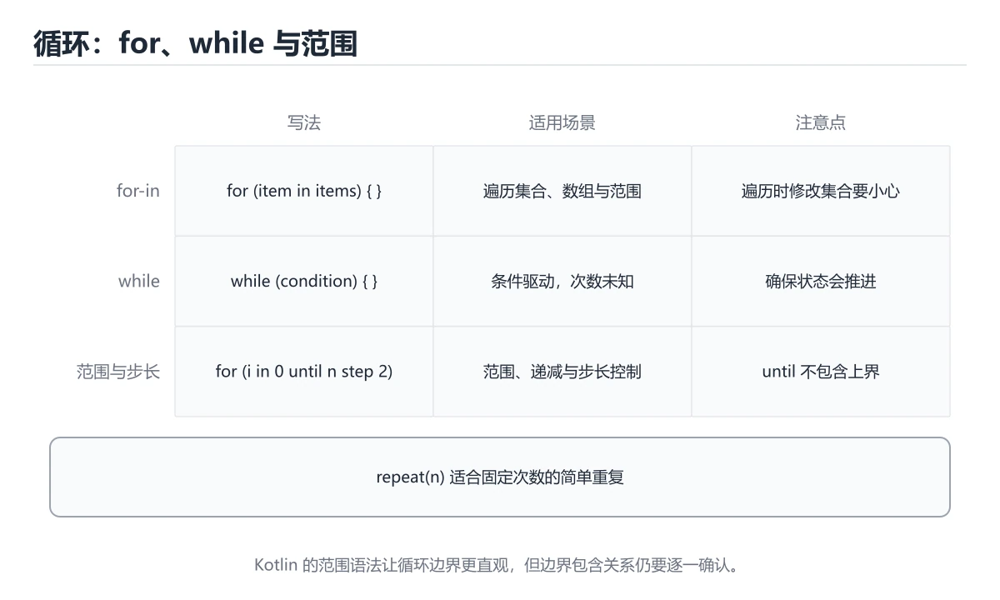
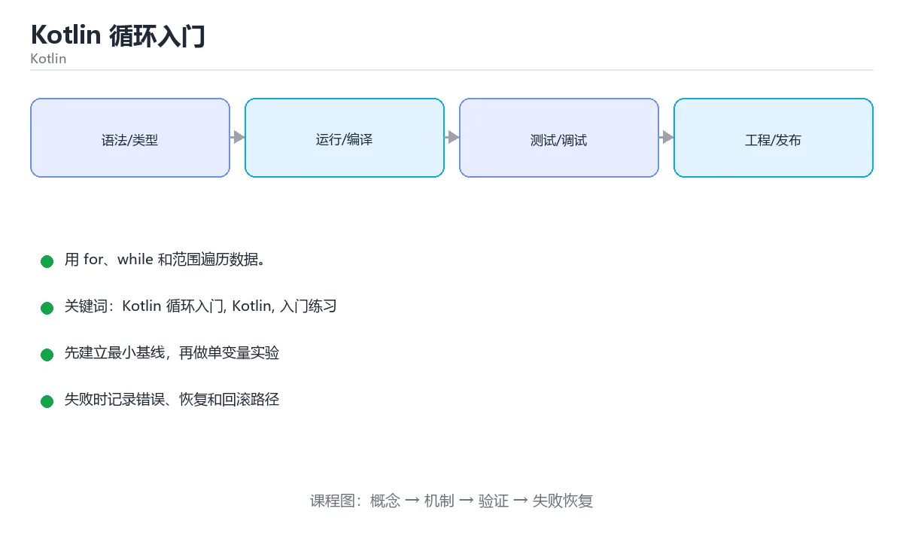

# Kotlin 循环入门

> 内容更新时间：2026-10-06 · 学习阶段：入门 · 预计用时：40 分钟





## 本节知识框架

**课程定位**：所属分类 `kotlin`（Kotlin），课程主题 `Kotlin 循环入门`，学习阶段 入门，建议用时 55 分钟。

本课主线：用 for、while 和范围遍历数据。

**学完本课应当能够**
- 说清 `for 与区间` 与 `until、downTo、step` 的含义与区别，并各举一个正例和一个反例。
- 用本课示例验证 `while 循环` 的行为，记录输入、输出与失败条件。
- 遇到「循环里修改集合」这类问题时，能说出触发条件与修复顺序。

### 从概念到验证的学习链条

1. `for 与区间`：先掌握 for (i in 1..5) 按区间逐个取值，是最常用的计数循环，再用它解释 `until、downTo、step` 为什么会出现。
2. `until、downTo、step`：先掌握 分别表示左闭右开、倒序和步长，用来控制区间遍历方式，再用它解释 `while 循环` 为什么会出现。
3. `while 循环`：先掌握 条件为真时反复执行，适合次数不确定的场景，再用它解释 `break 与 continue` 为什么会出现。
4. `break 与 continue`：先掌握 break 结束整个循环，continue 跳过本轮剩余语句，再用它解释 `遍历集合` 为什么会出现。
5. `遍历集合`：先掌握 for (item in list) 直接取元素，需要下标时用 withIndex()，再用它解释 `函数` 为什么会出现。
6. `函数`：先掌握 Kotlin 函数是表达式，单表达式函数可以省略花括号和 return，再用它解释 本课示例的观察结果 为什么会出现。

**先修与衔接**：本课是「Kotlin」分类的第 4 课。先修内容：《Kotlin 条件判断》。《Kotlin 条件判断》里的 `if 表达式`、`when` 是本课的前提。相关或后续课程：《Kotlin 函数入门》。

### 完成判据

- **定义关**：不看正文也能说明 `for 与区间` 是 for (i in 1..5) 按区间逐个取值，是最常用的计数循环，并指出一个反例。
- **机制关**：能按“输入 → 转换 → 输出 → 验证”复述 `Kotlin 循环入门`，而不是只背结论。
- **示例关**：能运行或推演 `Kotlin 循环入门` 的 `kotlin` 示例，并说明一个真实出现的标识符或字面量。
- **证据关**：能指出 `Kotlin 循环入门` 示例里的 调用了 `main()`，并说明它支持或反驳了本课的哪一条结论。
- **排错关**：能复现 循环里修改集合，记录现象并按 先收集待改元素，循环结束后统一处理 修复。
- **迁移关**：能把 `Kotlin 循环入门`、`Kotlin`、`入门练习` 放进一个与 `Kotlin 循环入门` 不同的项目场景，并保持输入与验证条件可追踪。
- **复盘关**：学完 `Kotlin 循环入门` 后，用一句话写下仍然不确定的结论，并列出下一次验证需要的输入、环境和成功判据。

### 复习清单

- [ ] 能不看正文复述本课核心术语，并指出一个边界或反例。
- [ ] 能运行或推演本课示例，记录输入、输出与失败现象。
- [ ] 能完成一次自测，并把错题对照错误表定位原因。

## 核心概念定义

| 术语 | 操作性定义 | 常见边界与风险 |
| --- | --- | --- |
| for 与区间 | for (i in 1..5) 按区间逐个取值，是最常用的计数循环。 | 只在「for (i in 1..5) 按区间逐个取值，是最常用的计数循环」这一前提下成立，换输入或换环境要重新验证。 |
| until、downTo、step | 分别表示左闭右开、倒序和步长，用来控制区间遍历方式。 | 只在「分别表示左闭右开、倒序和步长，用来控制区间遍历方式」这一前提下成立，换输入或换环境要重新验证。 |
| while 循环 | 条件为真时反复执行，适合次数不确定的场景。 | 只在「条件为真时反复执行，适合次数不确定的场景」这一前提下成立，换输入或换环境要重新验证。 |
| break 与 continue | break 结束整个循环，continue 跳过本轮剩余语句。 | 只在「break 结束整个循环，continue 跳过本轮剩余语句」这一前提下成立，换输入或换环境要重新验证。 |
| 遍历集合 | for (item in list) 直接取元素，需要下标时用 withIndex()。 | 只在「for (item in list) 直接取元素，需要下标时用 withIndex()」这一前提下成立，换输入或换环境要重新验证。 |
| 函数 | Kotlin 函数是表达式，单表达式函数可以省略花括号和 return | 只在「Kotlin 函数是表达式，单表达式函数可以省略花括号和 return」这一前提下成立，换输入或换环境要重新验证。 |

## 原理与运行机制

### 机制总览

**教材衔接：一句话入门**

用 for、while 和范围遍历数据。

**教材衔接：Kotlin 基础机制速览**

### JVM、Android 与工具链

Kotlin 主要编译成 JVM 字节码，也可以编译成 JavaScript 或原生代码。Android 开发常用 Gradle 构建，Kotlin 与 Java 可以互操作：Kotlin 调用 Java 时要注意平台类型可能为空，Java 调用 Kotlin 时要注意默认参数、扩展函数和顶层函数的生成方式。理解编译目标和互操作边界，能解释很多“本地能跑、发布变慢或崩溃”的问题。

### val/var、类型与空安全

`val` 是只读引用，`var` 是可重新赋值的引用；只读引用指向的对象内容仍可能可变。Kotlin 区分可空类型 `T?` 和非空类型 `T`，编译器要求使用安全调用 `?.`、Elvis 运算符 `?:`、非空断言 `!!` 或智能转换处理空值。`lateinit` 适合生命周期保证会初始化的 var，`by lazy` 适合第一次访问时初始化；两者都不能滥用。

### 函数、表达式与数据类

Kotlin 函数是表达式，单表达式函数可以省略花括号和 return。默认参数、命名参数、扩展函数和顶层函数减少工具类的数量。`data class` 自动生成 equals、hashCode、toString 和 copy，适合值对象；`sealed class` 和 sealed interface 表达有限的互斥状态，配合 when 可以做穷尽检查。高阶函数和 lambda 让集合操作更简洁，但要注意内联与分配成本。

### 集合、泛型与作用域函数

`List`、`Set`、`Map` 默认只读接口，`MutableList` 等提供修改操作。集合操作 `map`、`filter`、`groupBy`、`associate` 返回新集合，序列 Sequence 适合大数据惰性处理。泛型通过 `out` 和 `in` 表达协变与逆变，类型投影处理更复杂的使用位置。`let`、`run`、`with`、`apply`、`also` 的作用域和返回值不同，应根据“访问对象、配置对象还是返回结果”选择。

### 协程、异常与测试

协程用 suspend 函数表达可暂停的异步计算，CoroutineScope 决定生命周期，Dispatcher 决定运行线程，Job 支持取消和结构化并发。不要使用 GlobalScope 泄漏任务，异常传播和取消需要按层级处理。Kotlin 没有受检异常，资源应使用 `use` 自动关闭。测试要覆盖空值、集合边界、协程取消和线程切换，不能只验证 happy path。

**教材衔接：版本与时效**

- 版本提示：Kotlin 循环入门 的行为在最近几个大版本里有过调整，升级「Kotlin 循环入门」前先用 total 复现当前输出，再对照官方发布说明逐条核对。
- 升级「Kotlin 循环入门」涉及的依赖前，先用 total 复现当前行为，再逐项核对版本说明与破坏性变更。
- 显式 API 模式与多平台源集是团队协作时的重点
- 官方说明：https://kotlinlang.org/docs/releases.html

### 升级检查清单

- 先固定当前版本，跑通全部示例与测验，再升级工具链。
- 升级时只动一个依赖版本，用 total 记录构建与运行结果。
- 先回归 Kotlin 循环入门 与 Kotlin 的默认行为和错误信息，再扩大测试范围。
- 升级后把 total 的实测版本写进「内容元数据」，再更新复核日期。

**教材衔接：语言专项实践：Kotlin 循环入门**

### 一、工具链

| 阶段 | 推荐工具 | 验收标准 |
| --- | --- | --- |
| 编译构建 | kotlinc / Gradle | 命令可复现且错误能被定位 |
| 测试 | JUnit + coroutines-test | 命令可复现且错误能被定位 |
| 静态检查 | detekt / ktlint | 命令可复现且错误能被定位 |
| 发布 | R8/ProGuard + App Bundle | 命令可复现且错误能被定位 |

### 二、运行时与内存模型

「Kotlin 循环入门」的「二、运行时与内存模型」一节补全如下：

- 定位：这一节说明二、运行时与内存模型在「Kotlin 循环入门」知识体系里的位置。
- 检查点：固定版本与输入重跑《Kotlin 循环入门》，记录两次差异并定位不稳定条件。
- 自检：能否用一个最小例子解释二、运行时与内存模型？


### 机制拆解：每一步的输入、动作与输出

#### 1. `for 与区间`
- 输入：`Kotlin 循环入门`；本步把 for (i in 1..5) 按区间逐个取值，是最常用的计数循环 当作判断规则。
- 动作：围绕 `for 与区间` 保留中间状态，并记录它与 `until、downTo、step` 的对应关系。
- 输出：`until、downTo、step`，它可以被下一段代码、测试或记录继续使用。
- `for 与区间` 的失败条件：只在「for (i in 1..5) 按区间逐个取值，是最常用的计数循环」这一前提下成立，换输入或换环境要重新验证。

#### 2. `until、downTo、step`
- 输入：`for 与区间`；本步把 分别表示左闭右开、倒序和步长，用来控制区间遍历方式 当作判断规则。
- 动作：围绕 `until、downTo、step` 保留中间状态，并记录它与 `while 循环` 的对应关系。
- 输出：`while 循环`，它可以被下一段代码、测试或记录继续使用。
- `until、downTo、step` 的失败条件：只在「分别表示左闭右开、倒序和步长，用来控制区间遍历方式」这一前提下成立，换输入或换环境要重新验证。

#### 3. `while 循环`
- 输入：`until、downTo、step`；本步把 条件为真时反复执行，适合次数不确定的场景 当作判断规则。
- 动作：围绕 `while 循环` 保留中间状态，并记录它与 `break 与 continue` 的对应关系。
- 输出：`break 与 continue`，它可以被下一段代码、测试或记录继续使用。
- `while 循环` 的失败条件：只在「条件为真时反复执行，适合次数不确定的场景」这一前提下成立，换输入或换环境要重新验证。

#### 4. `break 与 continue`
- 输入：`while 循环`；本步把 break 结束整个循环，continue 跳过本轮剩余语句 当作判断规则。
- 动作：围绕 `break 与 continue` 保留中间状态，并记录它与 `遍历集合` 的对应关系。
- 输出：`遍历集合`，它可以被下一段代码、测试或记录继续使用。
- `break 与 continue` 的失败条件：只在「break 结束整个循环，continue 跳过本轮剩余语句」这一前提下成立，换输入或换环境要重新验证。

#### 5. `遍历集合`
- 输入：`break 与 continue`；本步把 for (item in list) 直接取元素，需要下标时用 withIndex() 当作判断规则。
- 动作：围绕 `遍历集合` 保留中间状态，并记录它与 `函数` 的对应关系。
- 输出：`函数`，它可以被下一段代码、测试或记录继续使用。
- `遍历集合` 的失败条件：只在「for (item in list) 直接取元素，需要下标时用 withIndex()」这一前提下成立，换输入或换环境要重新验证。

#### 6. `函数`
- 输入：`遍历集合`；本步把 Kotlin 函数是表达式，单表达式函数可以省略花括号和 return 当作判断规则。
- 动作：围绕 `函数` 保留中间状态，并记录它与 `main` 的对应关系。
- 输出：`main`，它可以被下一段代码、测试或记录继续使用。
- `函数` 的失败条件：只在「Kotlin 函数是表达式，单表达式函数可以省略花括号和 return」这一前提下成立，换输入或换环境要重新验证。

### 示例中的可观察事实

1. 调用了 `main()`；它对应的课程主题是 `Kotlin 循环入门`。
2. 调用了 `println()`；它对应的课程主题是 `Kotlin 循环入门`。
3. 出现字面量 `total=$total`；它对应的课程主题是 `Kotlin 循环入门`。

### 复现实验记录

- 环境：`Kotlin 循环入门` 使用 `kotlin` 示例，固定 `Kotlin 循环入门`、`Kotlin`、`入门练习` 作为第一组条件。
- 首轮输入：先确认 调用了 `main()`，预测 `for 与区间` 会怎样变化。
- 基线观察：记录命令、输入、输出和错误原文，不用截图代替可复制的文本。
- 单变量修改：只改变 `Kotlin 循环入门`，观察 `函数` 是否仍满足定义。
- 失败注入：复现 循环里修改集合，确认现象是 抛出并发修改异常。
- 记录结论：把“修改前、修改后、预期变化、实际变化”写成四列表，这样复盘 `Kotlin 循环入门` 时才能区分概念错误与实现错误。

## 典型应用场景

**课程内置实验入口**：`sandbox:kotlin`，用于动手验证《Kotlin 循环入门》的机制；实验结论不替代概念定义与复杂度分析。

**教材衔接：代码实验：把示例跑成证据**

### 实验一：建立基线

```kotlin
fun main() {
    var total = 0
    for (i in 1..5) {
        total += i
    }
    println("total=$total")
}
```

### 实验二：只改一个输入

沿用「Kotlin 循环入门」的最小示例做一次单变量实验：

做完后用一句话写出「Kotlin 循环入门」的结论：输入怎么变，结果才怎么变。

### 实验三：制造一个可控错误

把 Kotlin 循环入门 相关的那一行改成边界值（空、极值或类型不符），记录第一条错误信息、发生位置和恢复方式。

### 实验四：用三句话复述

1. Kotlin 循环入门 的输入是什么，哪些取值合法，哪些属于边界或非法范围？
2. Kotlin 循环入门 按什么顺序处理输入，在哪一步产生了状态变化或副作用？
3. 输出如何验证，失败时第一条可观察证据是什么？

- **循环里修改集合**：典型现象是抛出并发修改异常；正确做法是先收集待改元素，循环结束后统一处理。
- **区间边界写错**：典型现象是多遍历或少遍历一次；正确做法是明确区间开闭，使用半开区间与递减区间表达意图。
- **对可迭代结构强行用下标**：典型现象是越界或性能下降；正确做法是直接遍历元素，需要下标时使用带索引的遍历。

### 最小验证场景

- 准备：保留 `kotlin` 示例的原始输入，先记录 `Kotlin 循环入门` 的基线输出和完整运行命令。
- 观察：先核对 调用了 `main()`，再改变一个与 `for 与区间` 相关的条件。
- 判定：新结果与 `Kotlin 循环入门` 的基线不同不等于错误；只有当差异破坏了 `for 与区间` 的定义或错误表中的约束，才判定为失败。

### 选择与边界

- 使用 `for 与区间` 时，先满足它的定义：for (i in 1..5) 按区间逐个取值，是最常用的计数循环；只在「for (i in 1..5) 按区间逐个取值，是最常用的计数循环」这一前提下成立，换输入或换环境要重新验证。
- 使用 `until、downTo、step` 时，先满足它的定义：分别表示左闭右开、倒序和步长，用来控制区间遍历方式；只在「分别表示左闭右开、倒序和步长，用来控制区间遍历方式」这一前提下成立，换输入或换环境要重新验证。
- 使用 `while 循环` 时，先满足它的定义：条件为真时反复执行，适合次数不确定的场景；只在「条件为真时反复执行，适合次数不确定的场景」这一前提下成立，换输入或换环境要重新验证。
- 使用 `break 与 continue` 时，先满足它的定义：break 结束整个循环，continue 跳过本轮剩余语句；只在「break 结束整个循环，continue 跳过本轮剩余语句」这一前提下成立，换输入或换环境要重新验证。
- 使用 `遍历集合` 时，先满足它的定义：for (item in list) 直接取元素，需要下标时用 withIndex()；只在「for (item in list) 直接取元素，需要下标时用 withIndex()」这一前提下成立，换输入或换环境要重新验证。

## 代码/协议/SQL 示例

### 最小可验证示例

**教材衔接：最小示例**

**教材衔接：预期输出**

```text
total=15
```

**教材衔接：零基础通俗讲：Kotlin 循环**

### 一句话说清它是什么

for 用区间或集合遍历，while 按条件重复；Kotlin 的范围表达式 `1..5` 表示闭区间，包含两端。

### 用生活比喻理解

区间表达式像点名册上的起止编号，`1..5` 表示从 1 号到 5 号全部点到；写成 until 5 就是不含 5 号，名字虽像，点到的人却少一个。

### 完整可运行代码

```kotlin
fun main() {
    var total = 0

    for (i in 1..5) {
        total += i
        println("加入 $i 后累计 $total")
    }

    while (total < 20) {
        total += 5
    }

    println("最终结果：$total")
}
```

### 逐行拆开看

- `var total = 0` 声明可变累加器。
- `for (i in 1..5)` 依次取 1 到 5，闭区间包含两端。
- `total += i` 把当前数字累加进去。
- 循环体里的 println 用字符串模板嵌入两个变量。
- `while (total < 20)` 每轮开始前判断条件。
- 循环外的 println 只执行一次。

### 把程序跑一遍

- for 结束后 total 是 15。
- while 第一轮把 15 加到 20。
- 再次判断条件不成立，循环结束。
- 输出「最终结果：20」；如果写成 `1 until 5`，total 会变成 10。

### 新手最容易踩的坑

- 混淆闭区间和 until：前者含终点，后者不含，是最常见的差一错误。
- 用 downTo 时写反区间：需要从大到小遍历要用 downTo，而不是倒着写。
- 在 for 里修改迭代变量：Kotlin 的循环变量是只读的，改不了。
- 忘记 var：循环里修改 total 会编译失败。
- 在循环条件里做副作用：条件每轮求值，副作用会重复发生。

### 动手练一练

- 把区间改成 `1 until 5`，比较和 `1..5` 的结果差异。
- 增加 `step 2` 让循环隔一个数走一次。
- 用 downTo 从 5 累加到 1，观察结果是否相同。

### 本课速查卡

把下面八行抄进自己的笔记，复习时只看这一页就能回忆整课：

| 复习项 | 本课要点 |
| --- | --- |
| 核心结论 | for 用区间或集合遍历，while 按条件重复；Kotlin 的范围表达式 `1..5` 表示闭区间，包含两端。 |
| 最少要写的代码 | `fun main() {` |
| 正确做法 | for 结束后 total 是 15。 |
| 最常见的错误 | 混淆闭区间和 until：前者含终点，后者不含，是最常见的差一错误。 |
| 出错先查什么 | 先读第一条报错信息，再回到最小示例只改一个地方 |
| 怎么确认学会了 | 把区间改成 `1 until 5`，比较和 `1..5` 的结果差异。 |
| 和别的知识点的关系 | 本课打下的语法与思维方式会被后面每一课反复用到 |
| 接下来做什么 | 合上教程，凭记忆把上面的最小代码重写一遍再运行 |

**运行方式**：运行 `Kotlin 循环入门` 的示例时，用 `kotlinc` 编译或用 Gradle 任务运行；注意 JVM 目标版本。

### 示例精读：先找证据，再改一个条件

1. 调用了 `main()`；它出现在 `Kotlin 循环入门` 的示例中，阅读时先确认它前后各发生了什么。
2. 调用了 `println()`；它出现在 `Kotlin 循环入门` 的示例中，阅读时先确认它前后各发生了什么。
3. 出现字面量 `total=$total`；它出现在 `Kotlin 循环入门` 的示例中，阅读时先确认它前后各发生了什么。
- 在 `Kotlin 循环入门` 中与 `for 与区间` 对照：示例必须能支持 for (i in 1..5) 按区间逐个取值，是最常用的计数循环，否则说明这一段还缺少实现或验证步骤。
- 在 `Kotlin 循环入门` 中与 `until、downTo、step` 对照：示例必须能支持 分别表示左闭右开、倒序和步长，用来控制区间遍历方式，否则说明这一段还缺少实现或验证步骤。
- 在 `Kotlin 循环入门` 中与 `while 循环` 对照：示例必须能支持 条件为真时反复执行，适合次数不确定的场景，否则说明这一段还缺少实现或验证步骤。
- 在 `Kotlin 循环入门` 中与 `break 与 continue` 对照：示例必须能支持 break 结束整个循环，continue 跳过本轮剩余语句，否则说明这一段还缺少实现或验证步骤。

## 时间/空间复杂度或性能分析

**性能关注点（Kotlin 循环入门）**：JVM 与协程调度影响开销：记录吞吐、延迟与调度器线程占用。

**本课特有开销（Kotlin 循环入门 · Kotlin 循环入门）**：小文件看元数据开销，大文件看吞吐，两者要分别测量。

**测量方法**：以 `Kotlin 循环入门` 的 `Kotlin 循环入门` 场景为对象，固定输入跑一遍记录基线，再把规模或并发度提高一个数量级复测；两次结果的差值与波动范围才是结论依据。

### 需要控制的变量与记录项

- `Kotlin 循环入门` 的 `Kotlin 循环入门`：固定它的版本、输入范围和资源上限，分别记录速度、内存与失败率的变化。
- `Kotlin 循环入门` 的 `Kotlin`：固定它的版本、输入范围和资源上限，分别记录速度、内存与失败率的变化。
- `Kotlin 循环入门` 的 `入门练习`：固定它的版本、输入范围和资源上限，分别记录速度、内存与失败率的变化。
- `Kotlin 循环入门` 中 `for 与区间` 的边界：只在「for (i in 1..5) 按区间逐个取值，是最常用的计数循环」这一前提下成立，换输入或换环境要重新验证。达到边界时不要外推，必须重新测量。
- `Kotlin 循环入门` 中 `until、downTo、step` 的边界：只在「分别表示左闭右开、倒序和步长，用来控制区间遍历方式」这一前提下成立，换输入或换环境要重新验证。达到边界时不要外推，必须重新测量。
- `Kotlin 循环入门` 中 `while 循环` 的边界：只在「条件为真时反复执行，适合次数不确定的场景」这一前提下成立，换输入或换环境要重新验证。达到边界时不要外推，必须重新测量。
- `Kotlin 循环入门` 中 `break 与 continue` 的边界：只在「break 结束整个循环，continue 跳过本轮剩余语句」这一前提下成立，换输入或换环境要重新验证。达到边界时不要外推，必须重新测量。
- `Kotlin 循环入门` 中 `遍历集合` 的边界：只在「for (item in list) 直接取元素，需要下标时用 withIndex()」这一前提下成立，换输入或换环境要重新验证。达到边界时不要外推，必须重新测量。
- `Kotlin 循环入门` 的代码证据：先验证 调用了 `main()`，再记录该路径的输入规模与耗时；只看代码行数不能推出复杂度。

## 常见误区与易错点

| 容易写错的做法 | 实际现象 | 原因与正确做法 |
| --- | --- | --- |
| 循环里修改集合 | 抛出并发修改异常。 | 先收集待改元素，循环结束后统一处理。 |
| 区间边界写错 | 多遍历或少遍历一次。 | 明确区间开闭，使用半开区间与递减区间表达意图。 |
| 对可迭代结构强行用下标 | 越界或性能下降。 | 直接遍历元素，需要下标时使用带索引的遍历。 |

### 现场 1：循环里修改集合

**症状**：抛出并发修改异常。

**根因与修复**：先收集待改元素，循环结束后统一处理。

**自检**：在本课示例里复现「循环里修改集合」，改成先收集待改元素，循环结束后统一处理后重跑；如果症状消失且失败路径按预期变化，说明定位正确。

### 现场 2：区间边界写错

**症状**：多遍历或少遍历一次。

**根因与修复**：明确区间开闭，使用半开区间与递减区间表达意图。

**自检**：在本课示例里复现「区间边界写错」，改成明确区间开闭，使用半开区间与递减区间表达意图后重跑；如果症状消失且失败路径按预期变化，说明定位正确。

### 现场 3：对可迭代结构强行用下标

**症状**：越界或性能下降。

**根因与修复**：直接遍历元素，需要下标时使用带索引的遍历。

**自检**：在本课示例里复现「对可迭代结构强行用下标」，改成直接遍历元素，需要下标时使用带索引的遍历后重跑；如果症状消失且失败路径按预期变化，说明定位正确。

## 与其他知识点的关系

**教材衔接：复习与迁移**

### 概念复述

- 用一句话说明「Kotlin 循环入门」解决什么问题：用 for、while 和范围遍历数据。
- 写出Kotlin 循环入门、Kotlin、入门练习之间的关系，并各举一个例子。
- 说出本课最容易混淆的两个概念，以及区分它们的判据。

### 正文逐节复核

- **Kotlin 基础机制速览**：Kotlin 主要编译成 JVM 字节码，也可以编译成 JavaScript 或原生代码。
- **实践任务**：本节围绕Kotlin 循环入门安排 3 个可交付任务，每个任务都要求留下可以复查的记录。
- **逐节复习与自检**：围绕「Kotlin 循环入门、Kotlin、入门练习」说明变量生命周期、资源释放、并发模型和错误传播。


### 迁移练习

把「Kotlin 循环入门」的结论迁移到相邻主题，每次迁移都写清预测与证据：

- **先修**：`Kotlin 条件判断`。本课默认这些内容已经掌握。
- **相关或后续**：`Kotlin 函数入门`。本课术语会在这些课程里继续使用。
- **术语归属**：`for 与区间`、`until、downTo、step`、`while 循环` 的定义以本课「核心概念定义」为准，换到其他课程时先确认定义是否被改写。
- 同一分类的《Kotlin 第一个程序》也涉及 `Kotlin`；两课衔接时先确认这个术语的定义是否一致。
- 同一分类的《Kotlin 变量与空值》也涉及 `Kotlin`；两课衔接时先确认这个术语的定义是否一致。

### 先修与后续术语接口

- `Kotlin 条件判断`：共享术语 `函数`，共同关键词 `Kotlin`、`入门练习`。
- `Kotlin 函数入门`：共享术语 `函数`，共同关键词 `Kotlin`、`入门练习`。

### 容易混淆的相邻概念

- `for 与区间` 与 `until、downTo、step`：前者强调 for (i in 1..5) 按区间逐个取值，是最常用的计数循环；后者强调 分别表示左闭右开、倒序和步长，用来控制区间遍历方式。判断时分别检查两条定义的适用范围，不要只看名称相似就互换。
- `until、downTo、step` 与 `while 循环`：前者强调 分别表示左闭右开、倒序和步长，用来控制区间遍历方式；后者强调 条件为真时反复执行，适合次数不确定的场景。判断时分别检查两条定义的适用范围，不要只看名称相似就互换。
- `while 循环` 与 `break 与 continue`：前者强调 条件为真时反复执行，适合次数不确定的场景；后者强调 break 结束整个循环，continue 跳过本轮剩余语句。判断时分别检查两条定义的适用范围，不要只看名称相似就互换。
- `break 与 continue` 与 `遍历集合`：前者强调 break 结束整个循环，continue 跳过本轮剩余语句；后者强调 for (item in list) 直接取元素，需要下标时用 withIndex()。判断时分别检查两条定义的适用范围，不要只看名称相似就互换。
- `遍历集合` 与 `函数`：前者强调 for (item in list) 直接取元素，需要下标时用 withIndex()；后者强调 Kotlin 函数是表达式，单表达式函数可以省略花括号和 return。判断时分别检查两条定义的适用范围，不要只看名称相似就互换。

## 自测题与参考答案

> 先独立作答，再对照参考答案；答案都能在本课正文、术语表或错误表里找到依据。

### 自测 1（概念复述）

不看正文，写出 `for 与区间` 的操作性定义，并说明它与 `until、downTo、step` 的区别。

**参考答案**：for (i in 1..5) 按区间逐个取值，是最常用的计数循环。

`until、downTo、step` 的定位是：分别表示左闭右开、倒序和步长，用来控制区间遍历方式；两者的差别要从适用对象与失败模式上说明。

### 自测 2（排错）

本课错误表记录了「循环里修改集合」这类做法。请写出它会出现的现象、根因，以及修复顺序。

**参考答案**：现象是抛出并发修改异常；正确做法是先收集待改元素，循环结束后统一处理。修复时先复现现象并保留证据，再改动一处假设重跑，确认现象消失。

### 自测 3（动手验证）

运行本课的 `kotlin` 示例，把其中的 `"total=$total"` 换成一个边界值后重新运行，记录输出与错误信息。

**参考答案**：正常输入下 `kotlin` 示例应当复现正文给出的结果；把 `"total=$total"` 换成边界值后，如果结果改变或报错，先核对它是否满足 `Kotlin 循环入门` 中`for 与区间` 的适用范围，再检查错误表里是否有同类现象。

### 自测 4（代码阅读）

阅读本课开头的 `kotlin` 示例，说明它体现了`for 与区间` 的哪一条性质，并指出改动哪个输入会让这条性质不再成立。

**参考答案**：`for 与区间` 的定义是 for (i in 1..5) 按区间逐个取值，是最常用的计数循环，示例正是在实现这条定义。改动与 `for 与区间` 有关的一个输入后，如果结果不再符合 `Kotlin 循环入门` 的正文描述，就说明该性质只在当前前提成立。

### 自测 5（迁移）

把 `Kotlin 循环入门` 的方法迁移到自己的项目：围绕 `for 与区间` 写出一个与错误表同类的风险点，并说明触发条件和检验方式。

**参考答案**：例如「对可迭代结构强行用下标」，它会导致越界或性能下降；检验方式是按直接遍历元素，需要下标时使用带索引的遍历改一处再复现，确认现象消失且没有引入新的失败分支。

### 自测 6（对比）

用一个表格对比 `for 与区间` 与 `until、downTo、step`：各写一行适用场景、一行失败表现。

**参考答案**：`for 与区间` 的定义是for (i in 1..5) 按区间逐个取值，是最常用的计数循环；`until、downTo、step` 的定义是分别表示左闭右开、倒序和步长，用来控制区间遍历方式。两者的失败表现分别对应本课错误表里与本术语相关的行。

### 自测 7（排错顺序）

面对「循环里修改集合」引发的问题，请把“复现 抛出并发修改异常 → 保留证据 → 先收集待改元素，循环结束后统一处理 → 回归验证”四步写成可执行的检查清单。

**参考答案**：第一步按抛出并发修改异常复现；第二步记录输入、版本与完整报错；第三步按先收集待改元素，循环结束后统一处理只改一处；第四步重跑并确认失败路径也按预期变化。

### 自测 8（边界判断）

针对 `函数`，分别写出“可以使用”的条件和“结论不再成立”的条件。

**参考答案**：只在「Kotlin 函数是表达式，单表达式函数可以省略花括号和 return」这一前提下成立，换输入或换环境要重新验证。 同时要把 `函数` 的定义 Kotlin 函数是表达式，单表达式函数可以省略花括号和 return 与实际输入逐项对照。

### 自测 9（机制重建）

不看正文，按输入、转换、输出、验证四段重建 `for 与区间` → `until、downTo、step` → `while 循环` → `break 与 continue` 的作用链。

**参考答案**：起点是 `for 与区间` 的定义 for (i in 1..5) 按区间逐个取值，是最常用的计数循环；中间每一步都保留可观察状态；终点由 `函数` 检查，失败时回到错误表定位第一个偏离定义的步骤。

### 自测 10（综合排错）

在 `Kotlin 循环入门` 中，现象是 越界或性能下降。请围绕 对可迭代结构强行用下标 写出最小复现、关键证据、修复动作和回归验证，并说明为什么不能只凭一次运行下结论。

**参考答案**：先复现 对可迭代结构强行用下标，记录输入与完整错误；再按 直接遍历元素，需要下标时使用带索引的遍历 只改一处。回归时同时跑正常路径和边界路径，只有两次结果都可解释，才把修复视为完成。

### 自测 11（一分钟复述）

用每分钟约 200 字的速度复述 `Kotlin 循环入门`：先给主问题，再按顺序说出 `for 与区间`、`until、downTo、step`、`while 循环`、`break 与 continue`，最后给一个失败案例。

**自评标准**：主问题必须对应 用 for、while 和范围遍历数据；每个术语都要能接上一句定义或边界；失败案例必须写成可观察现象，不能用“可能有风险”代替证据。

## 术语速查

| 术语 | 一句话说明 |
| --- | --- |
| `for 与区间` | for (i in 1..5) 按区间逐个取值，是最常用的计数循环。 |
| `until、downTo、step` | 分别表示左闭右开、倒序和步长，用来控制区间遍历方式。 |
| `while 循环` | 条件为真时反复执行，适合次数不确定的场景。 |
| `break 与 continue` | break 结束整个循环，continue 跳过本轮剩余语句。 |
| `遍历集合` | for (item in list) 直接取元素，需要下标时用 withIndex()。 |
| `函数` | Kotlin 函数是表达式，单表达式函数可以省略花括号和 return。 |

**术语关系**：`for 与区间`（for (i in 1..5) 按区间逐个取值） → `until、downTo、step`（分别表示左闭右开、倒序和步长） → `while 循环`（条件为真时反复执行） → `break 与 continue`（break 结束整个循环）。

## 考点精讲

`Kotlin 循环入门` 的题库有 5 道题，下面逐题给出题干、正确项与判断依据：先自己作答，再核对正确项，最后回到正文对应小节复核。

### 考点 1：第 1 题

- **题目**：代码语言为 `kotlin`，选自 `Kotlin 循环入门` 的 `for 与区间` 部分。课程问题为用 for、while 和范围遍历数据。哪一项描述与代码一致？
- **正确项**：出现字面量 `total=$total`
- **判断依据**：这道题落在术语 `for 与区间` 上：for (i in 1..5) 按区间逐个取值，是最常用的计数循环。复习时把 `for 与区间` 的定义、适用边界和一个反例一起说清楚，再回到「核心概念定义」核对原文。

### 考点 2：第 2 题

- **题目**：围绕“Kotlin 循环入门”中的 Kotlin 循环入门、Kotlin、入门练习，下列哪两项是本课强调的实践判断？
- **正确项**：学习 Kotlin 循环入门 时要同时说明输入、输出和失败路径，不能只看正常流程；验证 Kotlin 时要固定版本并覆盖边界输入，结论才可复现
- **判断依据**：这道题检验本课主问题：用 for、while 和范围遍历数据。复习时先复述本课主问题，再举一个会让结论失效的输入。

### 考点 3：第 3 题

- **题目**：在 Kotlin 的循环里，break 与 continue 的作用是？
- **正确项**：break 结束当前循环，continue 跳过本轮剩余代码
- **判断依据**：这道题落在术语 `break 与 continue` 上：break 结束整个循环，continue 跳过本轮剩余语句。复习时把 `break 与 continue` 的定义、适用边界和一个反例一起说清楚，再回到「核心概念定义」核对原文。

### 考点 4：第 4 题

- **题目**：Kotlin 的 while 与 do-while 的差别是什么？
- **正确项**：while 先判断后执行，do-while 至少执行一次
- **判断依据**：这道题检验本课主问题：用 for、while 和范围遍历数据。复习时先复述本课主问题，再举一个会让结论失效的输入。

### 考点 5：第 5 题

- **题目**：填空：补齐下面这段术语说明中的空缺。课程 `用 for、while 和范围遍历数据。`，这段说明是：`____`：for (i in 1..5) 按区间逐个取值，是最常用的计数循环。空缺处应填哪个术语？
- **正确项**：for 与区间
- **判断依据**：这道题落在术语 `for 与区间` 上：for (i in 1..5) 按区间逐个取值，是最常用的计数循环。复习时把 `for 与区间` 的定义、适用边界和一个反例一起说清楚，再回到「核心概念定义」核对原文。

### 考点 6：`for 与区间`

- **要点**：for (i in 1..5) 按区间逐个取值，是最常用的计数循环。
- **for 与区间 的边界**：只在「for (i in 1..5) 按区间逐个取值，是最常用的计数循环」这一前提下成立，换输入或换环境要重新验证。

### 考点 7：`until、downTo、step`

- **要点**：分别表示左闭右开、倒序和步长，用来控制区间遍历方式。
- **until、downTo、step 的边界**：只在「分别表示左闭右开、倒序和步长，用来控制区间遍历方式」这一前提下成立，换输入或换环境要重新验证。

### 考点 8：`while 循环`

- **要点**：条件为真时反复执行，适合次数不确定的场景。
- **while 循环 的边界**：只在「条件为真时反复执行，适合次数不确定的场景」这一前提下成立，换输入或换环境要重新验证。

### 考点 9：`break 与 continue`

- **要点**：break 结束整个循环，continue 跳过本轮剩余语句。
- **break 与 continue 的边界**：只在「break 结束整个循环，continue 跳过本轮剩余语句」这一前提下成立，换输入或换环境要重新验证。

### 考点 10：`遍历集合`

- **要点**：for (item in list) 直接取元素，需要下标时用 withIndex()。
- **遍历集合 的边界**：只在「for (item in list) 直接取元素，需要下标时用 withIndex()」这一前提下成立，换输入或换环境要重新验证。

### 考点 11：`函数`

- **要点**：Kotlin 函数是表达式，单表达式函数可以省略花括号和 return
- **函数 的边界**：只在「Kotlin 函数是表达式，单表达式函数可以省略花括号和 return」这一前提下成立，换输入或换环境要重新验证。

### 考点 12：排错——循环里修改集合

- **现象**：抛出并发修改异常。
- **处理**：先收集待改元素，循环结束后统一处理。

### 考点 13：排错——区间边界写错

- **现象**：多遍历或少遍历一次。
- **处理**：明确区间开闭，使用半开区间与递减区间表达意图。

### 考点 14：综合辨析——`for 与区间` 与 `函数`

- **辨析点**：`for 与区间` 的定义是 for (i in 1..5) 按区间逐个取值，是最常用的计数循环；`函数` 的定义是 Kotlin 函数是表达式，单表达式函数可以省略花括号和 return。
- **答题要求**：面对 `Kotlin 循环入门` 的题目，先判断描述的是 `for 与区间` 还是 `函数`，再归到对应定义，最后写出一个会让该定义失效的边界输入。

### 考点 15：排错评分点

- **现象分**：能写出 抛出并发修改异常，而不是只写“程序有错”。
- **证据分**：保留触发 循环里修改集合 的输入、版本和错误原文。
- **修复分**：按 先收集待改元素，循环结束后统一处理 只改一处，并同时回归正常路径与边界路径。

## 内容元数据

- 内容版本：v2.0
- 最后更新：2026-10-06
- 学习阶段：入门
- 适用环境：Kotlin 2.x / Android SDK；本课聚焦 Kotlin 循环入门。
- 内容来源：内置结构化课程与工程实践整理
- 相关主题：Kotlin 循环入门、Kotlin、入门练习
- 质量版本：P0 测验标准 + P1 覆盖扩展 + P2 体验补全

## 参考资料与复核

- 最后复核：2026-10-04
- 下次复核：2026-11-10
- 复核范围：版本兼容、API 行为、安全建议与工程实践
- 来源性质：官方文档、标准或权威教材；本课核对关键词：Kotlin 循环入门、Kotlin、入门练习。

| 参考资料 | 本课用途 |
| --- | --- |
| [Android Kotlin](https://developer.android.com/kotlin) | Android 官方 Kotlin 实践 |
| [Kotlin Java 互操作](https://kotlinlang.org/docs/java-interop.html) | Java 调用与类型映射 |
| [Kotlin 基础语法](https://kotlinlang.org/docs/basic-syntax.html) | 语法、类型与函数 |

| [本课术语索引：Kotlin 循环入门](#核心概念定义) | 按本课输入、术语边界和错误表现逐项核对 |
> 「Kotlin 循环入门」的链接用于离线阅读后的延伸核对；App 不会自动联网。