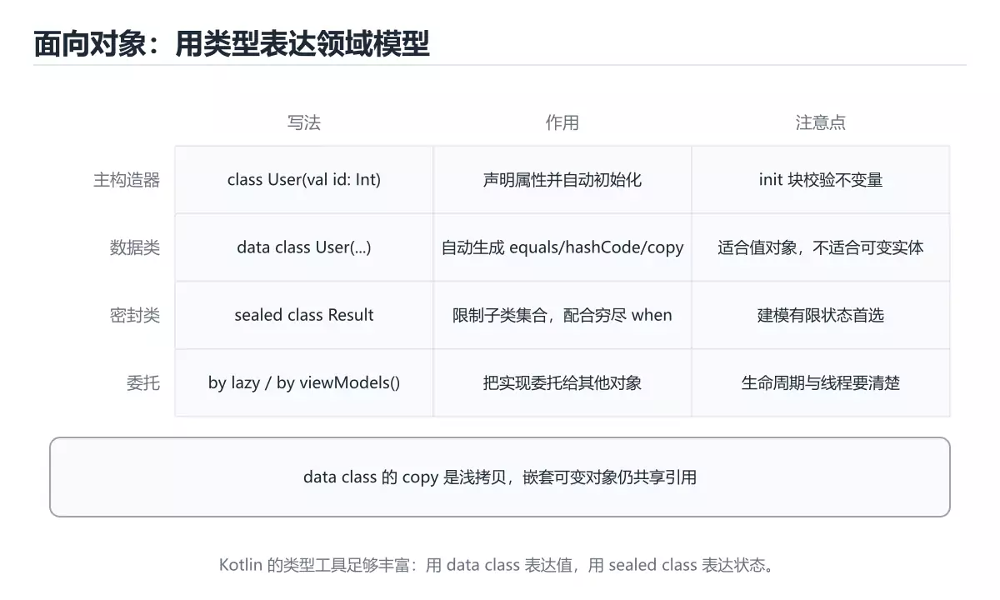
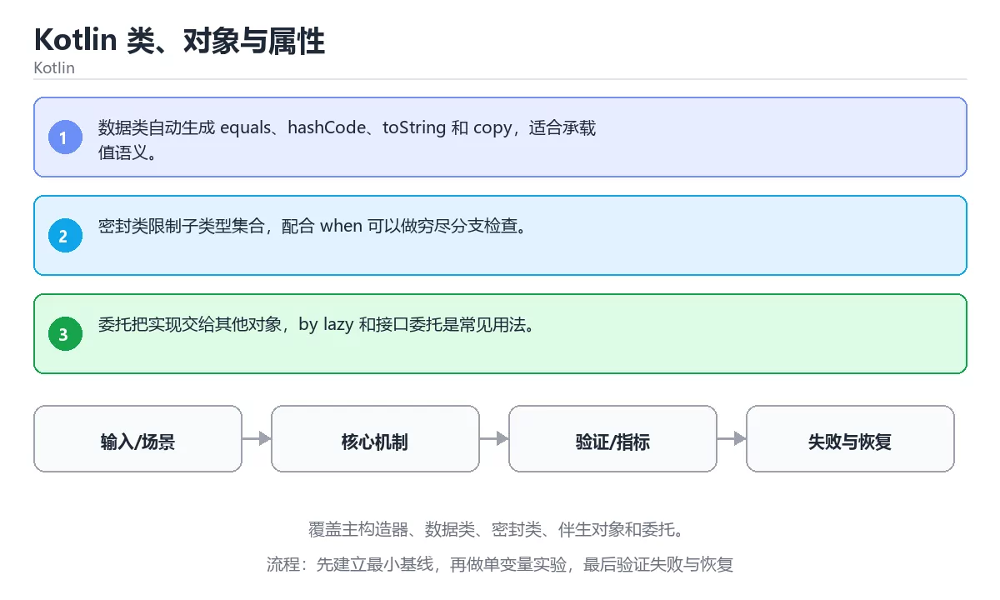

# Kotlin 类、对象与属性





> 内容更新时间：2026-10-06 · 学习阶段：进阶 · 预计用时：35 分钟

## 本节知识框架

**课程定位**：所属分类 `kotlin`（Kotlin），课程主题 `Kotlin 类、对象与属性`，学习阶段 进阶，建议用时 45 分钟。

本课主线：覆盖主构造器、数据类、密封类、伴生对象和委托。

**学完本课应当能够**
- 说清 `类` 与 `数据类` 的含义与区别，并各举一个正例和一个反例。
- 用本课示例验证 `密封类` 的行为，记录输入、输出与失败条件。
- 遇到「数据类与普通类混用」这类问题时，能说出触发条件与修复顺序。

### 从概念到验证的学习链条

1. `类`：先掌握 定义对象状态与行为的类型模板，支持封装、继承和多态，再用它解释 `数据类` 为什么会出现。
2. `数据类`：先掌握 主要用于承载数据并自动提供相等、复制或打印能力的类型，再用它解释 `密封类` 为什么会出现。
3. `密封类`：先掌握 sealed class 限定子类只能定义在同模块内，配合 when 可做穷尽分支检查，再用它解释 `委托` 为什么会出现。
4. `委托`：先掌握 二、运行时与内存模型：围绕「类、数据类、密封类、委托」说明变量生命周期、资源释放、并发模型和错误传播，再用它解释 本课示例的观察结果 为什么会出现。

**先修与衔接**：本课是「Kotlin」分类的第 8 课。先修内容：《Kotlin 函数、Lambda 与扩展》。《Kotlin 函数、Lambda 与扩展》里的 `函数`、`Lambda` 是本课的前提。相关或后续课程：《Kotlin 集合、序列与函数式操作》。

### 完成判据

- **定义关**：不看正文也能说明 `类` 是 定义对象状态与行为的类型模板，支持封装、继承和多态，并指出一个反例。
- **机制关**：能按“输入 → 转换 → 输出 → 验证”复述 `Kotlin 类、对象与属性`，而不是只背结论。
- **示例关**：能运行或推演 `Kotlin 类、对象与属性` 的 `text` 示例，并说明一个真实出现的标识符或字面量。
- **证据关**：能指出 `Kotlin 类、对象与属性` 示例里的 调用了 `Counter()`，并说明它支持或反驳了本课的哪一条结论。
- **排错关**：能复现 数据类与普通类混用，记录现象并按 值对象用数据类，需要唯一标识的用普通类 修复。
- **迁移关**：能把 `类`、`数据类`、`密封类`、`委托` 放进一个与 `Kotlin 类、对象与属性` 不同的项目场景，并保持输入与验证条件可追踪。
- **复盘关**：学完 `Kotlin 类、对象与属性` 后，用一句话写下仍然不确定的结论，并列出下一次验证需要的输入、环境和成功判据。

### 复习清单

- [ ] 能不看正文复述本课核心术语，并指出一个边界或反例。
- [ ] 能运行或推演本课示例，记录输入、输出与失败现象。
- [ ] 能完成一次自测，并把错题对照错误表定位原因。

## 核心概念定义

| 术语 | 操作性定义 | 常见边界与风险 |
| --- | --- | --- |
| 类 | 定义对象状态与行为的类型模板，支持封装、继承和多态。 | 静态检查只在编译期成立，运行期输入仍需校验。 |
| 数据类 | 主要用于承载数据并自动提供相等、复制或打印能力的类型。 | 易错：相等性与复制语义混乱；正确做法是值对象用数据类，需要唯一标识的用普通类。 |
| 密封类 | sealed class 限定子类只能定义在同模块内，配合 when 可做穷尽分支检查。 | 只在「sealed class 限定子类只能定义在同模块内，配合 when 可做穷尽分支检查」这一前提下成立，换输入或换环境要重新验证。 |
| 委托 | 二、运行时与内存模型：围绕「类、数据类、密封类、委托」说明变量生命周期、资源释放、并发模型和错误传播。 | 共享状态与调度顺序会改变结论，单线程或串行测试通过不等于并发下成立。 |
| 编译构建 | kotlinc / Gradle | 只在「kotlinc / Gradle」这一前提下成立，换输入或换环境要重新验证。 |
| 测试 | JUnit + coroutines-test | 只在「JUnit + coroutines-test」这一前提下成立，换输入或换环境要重新验证。 |
| 静态检查 | detekt / ktlint | 只在「detekt / ktlint」这一前提下成立，换输入或换环境要重新验证。 |
| 发布 | R8/ProGuard + App Bundle | 只在「R8/ProGuard + App Bundle」这一前提下成立，换输入或换环境要重新验证。 |
| 输入与前提是否满足 | 日志、输入样例、测试或指标 | 只在「日志、输入样例、测试或指标」这一前提下成立，换输入或换环境要重新验证。 |
| 核心步骤是否产生了预期中间结果 | 日志、输入样例、测试或指标 | 只在「日志、输入样例、测试或指标」这一前提下成立，换输入或换环境要重新验证。 |
| 失败路径是否可观测、可恢复 | 日志、输入样例、测试或指标 | 只在「日志、输入样例、测试或指标」这一前提下成立，换输入或换环境要重新验证。 |
| 资源、权限与成本是否在预算内 | 日志、输入样例、测试或指标 | 只在「日志、输入样例、测试或指标」这一前提下成立，换输入或换环境要重新验证。 |

## 原理与运行机制

### 机制总览

| 阶段 | 关注对象 | 失败时应检查 |
| --- | --- | --- |
| 输入 | 类 | 类型、范围、编码、版本或前置状态是否满足定义。 |
| 处理 | 数据类 | 顺序、可见性、锁、路由、事务或调度规则是否被破坏。 |
| 输出 | 密封类 | 结果是否可复现，错误是否被正确传播而不是被吞掉。 |

**教材衔接：核心知识**

### 1. 数据类自动生成 equals、hashCode、toString 和 copy，适合承载值语义。

- 关键做法：先用 toString 建立 类 的基线，再逐步加入边界与失败条件。
- 验证标准：类 的结果可复现、错误可解释、失败能恢复。

### 2. 密封类限制子类型集合，配合 when 可以做穷尽分支检查。

把这条结论放回「Kotlin 类、对象与属性」的完整流程里展开：

- 正文依据：能用自己的话解释：数据类自动生成 equals、hashCode、toString 和 copy，适合承载值语义。
- 落地检查：把「2. 密封类限制子类型集合，配合 when 可以做穷尽分支检查。」改写成一条可执行的核对项，逐条验证输入、超时与失败路径。

### 3. 委托把实现交给其他对象，by lazy 和接口委托是常见用法。

把这条结论放回「Kotlin 类、对象与属性」的完整流程里展开：

- 正文依据：能用自己的话解释：密封类限制子类型集合，配合 when 可以做穷尽分支检查。
- 落地检查：把「3. 委托把实现交给其他对象，by lazy 和接口委托是常见用法。」改写成一条可执行的核对项，逐条验证输入、超时与失败路径。

**教材衔接：关键流程**

**教材衔接：实践路径**

**教材衔接：版本与时效**

- 版本提示：类 的行为在最近几个大版本里有过调整，升级「Kotlin 类、对象与属性」前先用 toString 复现当前输出，再对照官方发布说明逐条核对。
- 升级前确认 类 的兼容范围，把不可回退的改动单独拆成一次提交。
- 显式 API 模式与多平台源集是团队协作时的重点
- 官方说明：https://kotlinlang.org/docs/releases.html

### 升级检查清单

- 先固定当前版本，跑通全部示例与测验，再升级工具链。
- 升级时只动一个依赖版本，用 toString 记录构建与运行结果。
- 回归范围锁定 toString 的默认行为，并确认弃用警告是否出现在构建输出里。
- 升级后把 toString 的实测版本写进「内容元数据」，再更新复核日期。

**教材衔接：验证步骤**

### 机制拆解：每一步的输入、动作与输出

#### 1. `类`
- 输入：`类`；本步把 定义对象状态与行为的类型模板，支持封装、继承和多态 当作判断规则。
- 动作：围绕 `类` 保留中间状态，并记录它与 `数据类` 的对应关系。
- 输出：`数据类`，它可以被下一段代码、测试或记录继续使用。
- `类` 的失败条件：当数据类与普通类混用时，会出现相等性与复制语义混乱。

#### 2. `数据类`
- 输入：`类`；本步把 主要用于承载数据并自动提供相等、复制或打印能力的类型 当作判断规则。
- 动作：围绕 `数据类` 保留中间状态，并记录它与 `密封类` 的对应关系。
- 输出：`密封类`，它可以被下一段代码、测试或记录继续使用。
- `数据类` 的失败条件：当数据类与普通类混用时，会出现相等性与复制语义混乱。

#### 3. `密封类`
- 输入：`数据类`；本步把 sealed class 限定子类只能定义在同模块内，配合 when 可做穷尽分支检查 当作判断规则。
- 动作：围绕 `密封类` 保留中间状态，并记录它与 `委托` 的对应关系。
- 输出：`委托`，它可以被下一段代码、测试或记录继续使用。
- `密封类` 的失败条件：只在「sealed class 限定子类只能定义在同模块内，配合 when 可做穷尽分支检查」这一前提下成立，换输入或换环境要重新验证。

#### 4. `委托`
- 输入：`密封类`；本步把 二、运行时与内存模型：围绕「类、数据类、密封类、委托」说明变量生命周期、资源释放、并发模型和错误传播 当作判断规则。
- 动作：围绕 `委托` 保留中间状态，并记录它与 `Counter` 的对应关系。
- 输出：`Counter`，它可以被下一段代码、测试或记录继续使用。
- `委托` 的失败条件：共享状态与调度顺序会改变结论，单线程或串行测试通过不等于并发下成立。

### 示例中的可观察事实

1. 调用了 `Counter()`；它对应的课程主题是 `Kotlin 类、对象与属性`。
2. 调用了 `increment()`；它对应的课程主题是 `Kotlin 类、对象与属性`。
3. 调用了 `toString()`；它对应的课程主题是 `Kotlin 类、对象与属性`。
4. 调用了 `main()`；它对应的课程主题是 `Kotlin 类、对象与属性`。
5. 调用了 `repeat()`；它对应的课程主题是 `Kotlin 类、对象与属性`。
6. 调用了 `println()`；它对应的课程主题是 `Kotlin 类、对象与属性`。
7. 出现字面量 `counter=$value`；它对应的课程主题是 `Kotlin 类、对象与属性`。

### 复现实验记录

- 环境：`Kotlin 类、对象与属性` 使用 `text` 示例，固定 `类`、`数据类`、`密封类`、`委托` 作为第一组条件。
- 首轮输入：先确认 调用了 `Counter()`，预测 `类` 会怎样变化。
- 基线观察：记录命令、输入、输出和错误原文，不用截图代替可复制的文本。
- 单变量修改：只改变 `类`，观察 `委托` 是否仍满足定义。
- 失败注入：复现 数据类与普通类混用，确认现象是 相等性与复制语义混乱。
- 记录结论：把“修改前、修改后、预期变化、实际变化”写成四列表，这样复盘 `Kotlin 类、对象与属性` 时才能区分概念错误与实现错误。

## 典型应用场景

| 场景 | 典型输入或前提 | 期望产物 |
| --- | --- | --- |
| 学习验证 | 使用本课最小示例和 类、数据类 | 能复现正文结论，并解释每一步。 |
| 工程落地 | 把「Kotlin 类、对象与属性」放入真实模块或服务边界 | 输出可观测、失败可定位、参数可配置。 |
| 故障排查 | 只改一个版本、规模、输入或依赖条件 | 能区分概念错误、实现错误和环境差异。 |

**课程内置实验入口**：`sandbox:kotlin`，用于动手验证《Kotlin 类、对象与属性》的机制；实验结论不替代概念定义与复杂度分析。

- **数据类与普通类混用**：典型现象是相等性与复制语义混乱；正确做法是值对象用数据类，需要唯一标识的用普通类。
- **对外暴露可变集合**：典型现象是外部修改破坏封装；正确做法是对外暴露只读视图。
- **忽略属性初始化顺序**：典型现象是初始化时读到未赋值属性；正确做法是调整声明顺序或改用延迟初始化。

### 最小验证场景

- 准备：保留 `text` 示例的原始输入，先记录 `Kotlin 类、对象与属性` 的基线输出和完整运行命令。
- 观察：先核对 调用了 `Counter()`，再改变一个与 `类` 相关的条件。
- 判定：新结果与 `Kotlin 类、对象与属性` 的基线不同不等于错误；只有当差异破坏了 `类` 的定义或错误表中的约束，才判定为失败。

### 选择与边界

- 使用 `类` 时，先满足它的定义：定义对象状态与行为的类型模板，支持封装、继承和多态；静态检查只在编译期成立，运行期输入仍需校验。
- 使用 `数据类` 时，先满足它的定义：主要用于承载数据并自动提供相等、复制或打印能力的类型；易错：相等性与复制语义混乱；正确做法是值对象用数据类，需要唯一标识的用普通类。
- 使用 `密封类` 时，先满足它的定义：sealed class 限定子类只能定义在同模块内，配合 when 可做穷尽分支检查；只在「sealed class 限定子类只能定义在同模块内，配合 when 可做穷尽分支检查」这一前提下成立，换输入或换环境要重新验证。
- 使用 `委托` 时，先满足它的定义：二、运行时与内存模型：围绕「类、数据类、密封类、委托」说明变量生命周期、资源释放、并发模型和错误传播；共享状态与调度顺序会改变结论，单线程或串行测试通过不等于并发下成立。

## 代码/协议/SQL 示例

### 最小可验证示例

**教材衔接：最小可运行示例**

下面示例用于验证 类 的最小输入、处理和输出。先原样运行，再只修改一个值：

```kotlin
class Counter(private var value: Int = 0) {
    fun increment() {
        value++
    }

    override fun toString() = "counter=$value"
}

fun main() {
    val counter = Counter()
    repeat(3) { counter.increment() }
    println(counter)
}
```

**教材衔接：预期输出**

```text
counter=3
```

### 示例精读：先找证据，再改一个条件

1. 调用了 `Counter()`；它出现在 `Kotlin 类、对象与属性` 的示例中，阅读时先确认它前后各发生了什么。
2. 调用了 `increment()`；它出现在 `Kotlin 类、对象与属性` 的示例中，阅读时先确认它前后各发生了什么。
3. 调用了 `toString()`；它出现在 `Kotlin 类、对象与属性` 的示例中，阅读时先确认它前后各发生了什么。
4. 调用了 `main()`；它出现在 `Kotlin 类、对象与属性` 的示例中，阅读时先确认它前后各发生了什么。
5. 调用了 `repeat()`；它出现在 `Kotlin 类、对象与属性` 的示例中，阅读时先确认它前后各发生了什么。
6. 调用了 `println()`；它出现在 `Kotlin 类、对象与属性` 的示例中，阅读时先确认它前后各发生了什么。
7. 出现字面量 `counter=$value`；它出现在 `Kotlin 类、对象与属性` 的示例中，阅读时先确认它前后各发生了什么。
- 在 `Kotlin 类、对象与属性` 中与 `类` 对照：示例必须能支持 定义对象状态与行为的类型模板，支持封装、继承和多态，否则说明这一段还缺少实现或验证步骤。
- 在 `Kotlin 类、对象与属性` 中与 `数据类` 对照：示例必须能支持 主要用于承载数据并自动提供相等、复制或打印能力的类型，否则说明这一段还缺少实现或验证步骤。
- 在 `Kotlin 类、对象与属性` 中与 `密封类` 对照：示例必须能支持 sealed class 限定子类只能定义在同模块内，配合 when 可做穷尽分支检查，否则说明这一段还缺少实现或验证步骤。
- 在 `Kotlin 类、对象与属性` 中与 `委托` 对照：示例必须能支持 二、运行时与内存模型：围绕「类、数据类、密封类、委托」说明变量生命周期、资源释放、并发模型和错误传播，否则说明这一段还缺少实现或验证步骤。

## 时间/空间复杂度或性能分析

**性能关注点（Kotlin 类、对象与属性）**：JVM 与协程调度影响开销：记录吞吐、延迟与调度器线程占用。

**本课特有开销（Kotlin 类、对象与属性 · 类）**：并发度提高后要观察是否出现拐点：延迟上升而吞吐不增，说明瓶颈已转移。

**测量方法**：以 `Kotlin 类、对象与属性` 的 `类` 场景为对象，固定输入跑一遍记录基线，再把规模或并发度提高一个数量级复测；两次结果的差值与波动范围才是结论依据。

### 需要控制的变量与记录项

- `Kotlin 类、对象与属性` 的 `类`：固定它的版本、输入范围和资源上限，分别记录速度、内存与失败率的变化。
- `Kotlin 类、对象与属性` 的 `数据类`：固定它的版本、输入范围和资源上限，分别记录速度、内存与失败率的变化。
- `Kotlin 类、对象与属性` 的 `密封类`：固定它的版本、输入范围和资源上限，分别记录速度、内存与失败率的变化。
- `Kotlin 类、对象与属性` 的 `委托`：固定它的版本、输入范围和资源上限，分别记录速度、内存与失败率的变化。
- `Kotlin 类、对象与属性` 中 `类` 的边界：静态检查只在编译期成立，运行期输入仍需校验。达到边界时不要外推，必须重新测量。
- `Kotlin 类、对象与属性` 中 `数据类` 的边界：易错：相等性与复制语义混乱；正确做法是值对象用数据类，需要唯一标识的用普通类。达到边界时不要外推，必须重新测量。
- `Kotlin 类、对象与属性` 中 `密封类` 的边界：只在「sealed class 限定子类只能定义在同模块内，配合 when 可做穷尽分支检查」这一前提下成立，换输入或换环境要重新验证。达到边界时不要外推，必须重新测量。
- `Kotlin 类、对象与属性` 中 `委托` 的边界：共享状态与调度顺序会改变结论，单线程或串行测试通过不等于并发下成立。达到边界时不要外推，必须重新测量。
- `Kotlin 类、对象与属性` 的代码证据：先验证 调用了 `Counter()`，再记录该路径的输入规模与耗时；只看代码行数不能推出复杂度。

## 常见误区与易错点

| 容易写错的做法 | 实际现象 | 原因与正确做法 |
| --- | --- | --- |
| 数据类与普通类混用 | 相等性与复制语义混乱。 | 值对象用数据类，需要唯一标识的用普通类。 |
| 对外暴露可变集合 | 外部修改破坏封装。 | 对外暴露只读视图。 |
| 忽略属性初始化顺序 | 初始化时读到未赋值属性。 | 调整声明顺序或改用延迟初始化。 |

### 现场 1：数据类与普通类混用

**症状**：相等性与复制语义混乱。

**根因与修复**：值对象用数据类，需要唯一标识的用普通类。

**自检**：在本课示例里复现「数据类与普通类混用」，改成值对象用数据类，需要唯一标识的用普通类后重跑；如果症状消失且失败路径按预期变化，说明定位正确。

### 现场 2：对外暴露可变集合

**症状**：外部修改破坏封装。

**根因与修复**：对外暴露只读视图。

**自检**：在本课示例里复现「对外暴露可变集合」，改成对外暴露只读视图后重跑；如果症状消失且失败路径按预期变化，说明定位正确。

### 现场 3：忽略属性初始化顺序

**症状**：初始化时读到未赋值属性。

**根因与修复**：调整声明顺序或改用延迟初始化。

**自检**：在本课示例里复现「忽略属性初始化顺序」，改成调整声明顺序或改用延迟初始化后重跑；如果症状消失且失败路径按预期变化，说明定位正确。

## 与其他知识点的关系

**教材衔接：复习与迁移**

### 概念复述

- 用一句话说明「Kotlin 类、对象与属性」解决什么问题：覆盖主构造器、数据类、密封类、伴生对象和委托。
- 写出类、数据类、密封类之间的关系，并各举一个例子。
- 说出本课最容易混淆的两个概念，以及区分它们的判据。

### 正文逐节复核

- **语言专项实践：Kotlin 类、对象与属性**：围绕「类、数据类、密封类、委托」说明变量生命周期、资源释放、并发模型和错误传播。
- **实践任务**：本节围绕Kotlin 类、对象与属性安排 3 个可交付任务，每个任务都要求留下可以复查的记录。
- **零基础精讲：把Kotlin 类、对象与属性真正讲透**：本课的摘要可以当作一张地图：覆盖主构造器、数据类、密封类、伴生对象和委托。


### 迁移练习

1. 换输入：用类处理一组你自己的数据，对比教材示例的结果差异。
2. 换失败条件：制造一个数据类相关的错误，说明如何从错误信息定位根因。
3. 换规模：把数据量或并发度提高一个数量级，说明「Kotlin 类、对象与属性」的结论是否仍成立。

- **先修**：`Kotlin 函数、Lambda 与扩展`。本课默认这些内容已经掌握。
- **相关或后续**：`Kotlin 集合、序列与函数式操作`。本课术语会在这些课程里继续使用。
- **术语归属**：`类`、`数据类`、`密封类` 的定义以本课「核心概念定义」为准，换到其他课程时先确认定义是否被改写。

### 先修与后续术语接口

- `Kotlin 函数、Lambda 与扩展`：两者通过本分类的学习顺序衔接，阅读时重点比较各自的输入与失败条件。
- `Kotlin 集合、序列与函数式操作`：两者通过本分类的学习顺序衔接，阅读时重点比较各自的输入与失败条件。

### 容易混淆的相邻概念

- `类` 与 `数据类`：前者强调 定义对象状态与行为的类型模板，支持封装、继承和多态；后者强调 主要用于承载数据并自动提供相等、复制或打印能力的类型。判断时分别检查两条定义的适用范围，不要只看名称相似就互换。
- `数据类` 与 `密封类`：前者强调 主要用于承载数据并自动提供相等、复制或打印能力的类型；后者强调 sealed class 限定子类只能定义在同模块内，配合 when 可做穷尽分支检查。判断时分别检查两条定义的适用范围，不要只看名称相似就互换。
- `密封类` 与 `委托`：前者强调 sealed class 限定子类只能定义在同模块内，配合 when 可做穷尽分支检查；后者强调 二、运行时与内存模型：围绕「类、数据类、密封类、委托」说明变量生命周期、资源释放、并发模型和错误传播。判断时分别检查两条定义的适用范围，不要只看名称相似就互换。

## 自测题与参考答案

> 先独立作答，再对照参考答案；答案都能在本课正文、术语表或错误表里找到依据。

### 自测 1（概念复述）

不看正文，写出 `类` 的操作性定义，并说明它与 `数据类` 的区别。

**参考答案**：定义对象状态与行为的类型模板，支持封装、继承和多态。

`数据类` 的定位是：主要用于承载数据并自动提供相等、复制或打印能力的类型；两者的差别要从适用对象与失败模式上说明。

### 自测 2（排错）

本课错误表记录了「数据类与普通类混用」这类做法。请写出它会出现的现象、根因，以及修复顺序。

**参考答案**：现象是相等性与复制语义混乱；正确做法是值对象用数据类，需要唯一标识的用普通类。修复时先复现现象并保留证据，再改动一处假设重跑，确认现象消失。

### 自测 3（动手验证）

运行本课的 `text` 示例，改动其中一个输入后重新运行，记录输出与错误信息。

**参考答案**：正常输入下 `text` 示例应当复现正文给出的结果；改动输入后，如果结果改变或报错，先核对它是否满足 `Kotlin 类、对象与属性` 中`类` 的适用范围，再检查错误表里是否有同类现象。

### 自测 4（代码阅读）

阅读本课开头的 `text` 示例，说明它体现了`类` 的哪一条性质，并指出改动哪个输入会让这条性质不再成立。

**参考答案**：`类` 的定义是 定义对象状态与行为的类型模板，支持封装、继承和多态，示例正是在实现这条定义。改动与 `类` 有关的一个输入后，如果结果不再符合 `Kotlin 类、对象与属性` 的正文描述，就说明该性质只在当前前提成立。

### 自测 5（迁移）

把 `Kotlin 类、对象与属性` 的方法迁移到自己的项目：围绕 `类` 写出一个与错误表同类的风险点，并说明触发条件和检验方式。

**参考答案**：例如「忽略属性初始化顺序」，它会导致初始化时读到未赋值属性；检验方式是按调整声明顺序或改用延迟初始化改一处再复现，确认现象消失且没有引入新的失败分支。

### 自测 6（对比）

用一个表格对比 `类` 与 `数据类`：各写一行适用场景、一行失败表现。

**参考答案**：`类` 的定义是定义对象状态与行为的类型模板，支持封装、继承和多态；`数据类` 的定义是主要用于承载数据并自动提供相等、复制或打印能力的类型。两者的失败表现分别对应本课错误表里与本术语相关的行。

### 自测 7（排错顺序）

面对「数据类与普通类混用」引发的问题，请把“复现 相等性与复制语义混乱 → 保留证据 → 值对象用数据类，需要唯一标识的用普通类 → 回归验证”四步写成可执行的检查清单。

**参考答案**：第一步按相等性与复制语义混乱复现；第二步记录输入、版本与完整报错；第三步按值对象用数据类，需要唯一标识的用普通类只改一处；第四步重跑并确认失败路径也按预期变化。

### 自测 8（边界判断）

针对 `委托`，分别写出“可以使用”的条件和“结论不再成立”的条件。

**参考答案**：共享状态与调度顺序会改变结论，单线程或串行测试通过不等于并发下成立。 同时要把 `委托` 的定义 二、运行时与内存模型：围绕「类、数据类、密封类、委托」说明变量生命周期、资源释放、并发模型和错误传播 与实际输入逐项对照。

### 自测 9（机制重建）

不看正文，按输入、转换、输出、验证四段重建 `类` → `数据类` → `密封类` → `委托` 的作用链。

**参考答案**：起点是 `类` 的定义 定义对象状态与行为的类型模板，支持封装、继承和多态；中间每一步都保留可观察状态；终点由 `委托` 检查，失败时回到错误表定位第一个偏离定义的步骤。

### 自测 10（综合排错）

在 `Kotlin 类、对象与属性` 中，现象是 初始化时读到未赋值属性。请围绕 忽略属性初始化顺序 写出最小复现、关键证据、修复动作和回归验证，并说明为什么不能只凭一次运行下结论。

**参考答案**：先复现 忽略属性初始化顺序，记录输入与完整错误；再按 调整声明顺序或改用延迟初始化 只改一处。回归时同时跑正常路径和边界路径，只有两次结果都可解释，才把修复视为完成。

### 自测 11（一分钟复述）

用每分钟约 200 字的速度复述 `Kotlin 类、对象与属性`：先给主问题，再按顺序说出 `类`、`数据类`、`密封类`、`委托`，最后给一个失败案例。

**自评标准**：主问题必须对应 覆盖主构造器、数据类、密封类、伴生对象和委托；每个术语都要能接上一句定义或边界；失败案例必须写成可观察现象，不能用“可能有风险”代替证据。

## 术语速查

| 术语 | 一句话说明 |
| --- | --- |
| `类` | 定义对象状态与行为的类型模板，支持封装、继承和多态。 |
| `数据类` | 主要用于承载数据并自动提供相等、复制或打印能力的类型。 |
| `密封类` | sealed class 限定子类只能定义在同模块内，配合 when 可做穷尽分支检查。 |
| `委托` | 二、运行时与内存模型：围绕「类、数据类、密封类、委托」说明变量生命周期、资源释放、并发模型和错误传播。 |

**术语关系**：`类`（定义对象状态与行为的类型模板） → `数据类`（主要用于承载数据并自动提供相等、复制或打印能力的类型） → `密封类`（sealed class 限定子类只能定义在同模块内） → `委托`（二、运行时与内存模型：围绕「类、数据类、密封类、委托」说明变量生命周期、资源释放、并发模型和错误传播）。

## 考点精讲

`Kotlin 类、对象与属性` 的题库有 6 道题，下面逐题给出题干、正确项与判断依据：先自己作答，再核对正确项，最后回到正文对应小节复核。

### 考点 1：第 1 题

- **题目**：围绕“Kotlin 类、对象与属性”中的 类、数据类、密封类，下列哪两项是本课强调的实践判断？
- **正确项**：学习 类 时要同时说明输入、输出和失败路径，不能只看正常流程；验证 数据类 时要固定版本并覆盖边界输入，结论才可复现
- **判断依据**：这道题落在术语 `类` 上：定义对象状态与行为的类型模板，支持封装、继承和多态。复习时把 `类` 的定义、适用边界和一个反例一起说清楚，再回到「核心概念定义」核对原文。

### 考点 2：第 2 题

- **题目**：在 `Kotlin 类、对象与属性` 里，与 `类` 有关的说法中，哪一项最符合覆盖主构造器、数据类、密封类、伴生对象和委托。？
- **正确项**：密封类限制子类型集合，配合 when 可以做穷尽分支检查。
- **判断依据**：这道题落在术语 `类` 上：定义对象状态与行为的类型模板，支持封装、继承和多态。复习时把 `类` 的定义、适用边界和一个反例一起说清楚，再回到「核心概念定义」核对原文。

### 考点 3：第 3 题

- **题目**：在 `Kotlin 类、对象与属性` 里，与 `类` 有关的说法中，哪一项最符合覆盖主构造器、数据类、密封类、伴生对象和委托。？（Kotlin 类、对象与属性·Kotlin 第 3 题）
- **正确项**：委托把实现交给其他对象，by lazy 和接口委托是常见用法。
- **判断依据**：这道题落在术语 `类` 上：定义对象状态与行为的类型模板，支持封装、继承和多态。复习时把 `类` 的定义、适用边界和一个反例一起说清楚，再回到「核心概念定义」核对原文。

### 考点 4：第 4 题

- **题目**：代码语言为 `kotlin`，选自 `Kotlin 类、对象与属性` 的 `类` 部分。课程问题为覆盖主构造器、数据类、密封类、伴生对象和委托。哪一项描述与代码一致？
- **正确项**：出现字面量 `counter=$value`
- **判断依据**：这道题落在术语 `类` 上：定义对象状态与行为的类型模板，支持封装、继承和多态。复习时把 `类` 的定义、适用边界和一个反例一起说清楚，再回到「核心概念定义」核对原文。

### 考点 5：第 5 题

- **题目**：填空：补齐下面这段术语说明中的空缺。课程 `覆盖主构造器、数据类、密封类、伴生对象和委托。`，这段说明是：二、运行时与内存模型：围绕「类、数据类、密封类、`____`」说明变量生命周期、资源释放、并发模型和错误传播。空缺处应填哪个术语？
- **正确项**：委托
- **判断依据**：这道题落在术语 `类` 上：定义对象状态与行为的类型模板，支持封装、继承和多态。复习时把 `类` 的定义、适用边界和一个反例一起说清楚，再回到「核心概念定义」核对原文。

### 考点 6：第 6 题

- **题目**：下面几项都与 `类` 有关，请按 `Kotlin 类、对象与属性` 的正文顺序排列；该课主线是覆盖主构造器、数据类、密封类、伴生对象和委托。
- **正确项**：核心知识 → 关键流程 → 实践路径 → 常见误区
- **判断依据**：这道题落在术语 `类` 上：定义对象状态与行为的类型模板，支持封装、继承和多态。复习时把 `类` 的定义、适用边界和一个反例一起说清楚，再回到「核心概念定义」核对原文。

### 考点 7：`类`

- **要点**：定义对象状态与行为的类型模板，支持封装、继承和多态。
- **类 的边界**：静态检查只在编译期成立，运行期输入仍需校验。

### 考点 8：`数据类`

- **要点**：主要用于承载数据并自动提供相等、复制或打印能力的类型。
- **数据类 的边界**：易错：相等性与复制语义混乱；正确做法是值对象用数据类，需要唯一标识的用普通类。

### 考点 9：`密封类`

- **要点**：sealed class 限定子类只能定义在同模块内，配合 when 可做穷尽分支检查。
- **密封类 的边界**：只在「sealed class 限定子类只能定义在同模块内，配合 when 可做穷尽分支检查」这一前提下成立，换输入或换环境要重新验证。

### 考点 10：`委托`

- **要点**：二、运行时与内存模型：围绕「类、数据类、密封类、委托」说明变量生命周期、资源释放、并发模型和错误传播。
- **委托 的边界**：共享状态与调度顺序会改变结论，单线程或串行测试通过不等于并发下成立。

### 考点 11：排错——数据类与普通类混用

- **现象**：相等性与复制语义混乱。
- **处理**：值对象用数据类，需要唯一标识的用普通类。

### 考点 12：排错——对外暴露可变集合

- **现象**：外部修改破坏封装。
- **处理**：对外暴露只读视图。

### 考点 13：综合辨析——`类` 与 `委托`

- **辨析点**：`类` 的定义是 定义对象状态与行为的类型模板，支持封装、继承和多态；`委托` 的定义是 二、运行时与内存模型：围绕「类、数据类、密封类、委托」说明变量生命周期、资源释放、并发模型和错误传播。
- **答题要求**：面对 `Kotlin 类、对象与属性` 的题目，先判断描述的是 `类` 还是 `委托`，再归到对应定义，最后写出一个会让该定义失效的边界输入。

### 考点 14：排错评分点

- **现象分**：能写出 相等性与复制语义混乱，而不是只写“程序有错”。
- **证据分**：保留触发 数据类与普通类混用 的输入、版本和错误原文。
- **修复分**：按 值对象用数据类，需要唯一标识的用普通类 只改一处，并同时回归正常路径与边界路径。

## 内容元数据

- 内容版本：v2.0
- 最后更新：2026-10-06
- 学习阶段：进阶
- 适用环境：Kotlin 2.x / Android SDK；本课聚焦 类。
- 内容来源：内置结构化课程与工程实践整理
- 相关主题：类、数据类、密封类、委托
- 质量版本：P0 测验标准 + P1 覆盖扩展 + P2 体验补全

## 参考资料与复核

- 最后复核：2026-10-04
- 下次复核：2026-11-10
- 复核范围：版本兼容、API 行为、安全建议与工程实践
- 来源性质：官方文档、标准或权威教材；本课核对关键词：类、数据类、密封类、委托。

| 参考资料 | 本课用途 |
| --- | --- |
| [Android Kotlin](https://developer.android.com/kotlin) | Android 官方 Kotlin 实践 |
| [Android 架构指南](https://developer.android.com/topic/architecture) | 分层、状态与生命周期 |
| [Kotlin Java 互操作](https://kotlinlang.org/docs/java-interop.html) | Java 调用与类型映射 |

| [本课术语索引：Kotlin 类、对象与属性](#核心概念定义) | 按本课输入、术语边界和错误表现逐项核对 |
> 「Kotlin 类、对象与属性」的链接用于离线阅读后的延伸核对；App 不会自动联网。