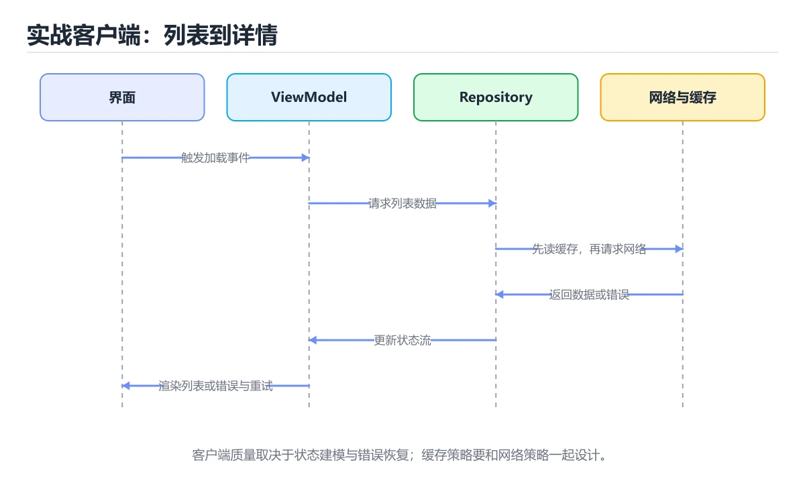
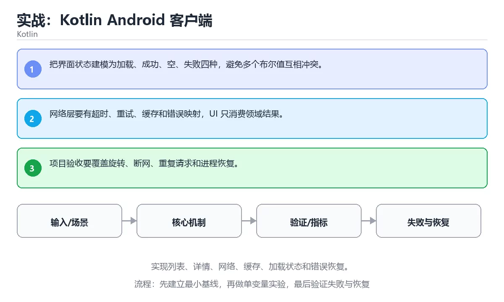

# 实战：Kotlin Android 客户端





> 内容更新时间：2026-10-06 · 学习阶段：高级 · 预计用时：60 分钟

## 本节知识框架

**课程定位**：所属分类 `kotlin`（Kotlin），课程主题 `实战：Kotlin Android 客户端`，学习阶段 高级，建议用时 65 分钟。

本课主线：实现列表、详情、网络、缓存、加载状态和错误恢复。

**学完本课应当能够**
- 说清 `Android 项目` 与 `网络` 的含义与区别，并各举一个正例和一个反例。
- 用本课示例验证 `缓存` 的行为，记录输入、输出与失败条件。
- 遇到「界面与数据逻辑混在一起」这类问题时，能说出触发条件与修复顺序。

### 从概念到验证的学习链条

1. `Android 项目`：先掌握 包含清单、资源、Gradle 构建和 Kotlin 或 Java 源码的 Android 应用工程，再用它解释 `网络` 为什么会出现。
2. `网络`：先掌握 多个设备通过协议交换数据并共享资源的连接体系，再用它解释 `缓存` 为什么会出现。
3. `缓存`：先掌握 把昂贵结果暂存起来复用；要点是键设计、过期策略与并发下的失效处理，再用它解释 `状态` 为什么会出现。
4. `状态`：先掌握 系统在某一时刻保存的数据与条件，变化时会驱动界面或流程更新，再用它解释 本课示例的观察结果 为什么会出现。

**先修与衔接**：本课是「Kotlin」分类的第 13 课。先修内容：《Kotlin 测试与协程测试》。《Kotlin 测试与协程测试》里的 `JUnit`、`协程测试` 是本课的前提。相关或后续课程：《Kotlin 第一个程序》、《实战：SwiftUI iOS 客户端》。

### 完成判据

- **定义关**：不看正文也能说明 `Android 项目` 是 包含清单、资源、Gradle 构建和 Kotlin 或 Java 源码的 Android 应用工程，并指出一个反例。
- **机制关**：能按“输入 → 转换 → 输出 → 验证”复述 `实战：Kotlin Android 客户端`，而不是只背结论。
- **示例关**：能运行或推演 `实战：Kotlin Android 客户端` 的 `text` 示例，并说明一个真实出现的标识符或字面量。
- **证据关**：能从 `实战：Kotlin Android 客户端` 的示例写出一个输入、处理、输出三元组，并说明它支持或反驳了本课的哪一条结论。
- **排错关**：能复现 界面与数据逻辑混在一起，记录现象并按 分层实现，由视图模型暴露界面状态 修复。
- **迁移关**：能把 `Android 项目`、`网络`、`缓存`、`状态` 放进一个与 `实战：Kotlin Android 客户端` 不同的项目场景，并保持输入与验证条件可追踪。
- **复盘关**：学完 `实战：Kotlin Android 客户端` 后，用一句话写下仍然不确定的结论，并列出下一次验证需要的输入、环境和成功判据。

### 复习清单

- [ ] 能不看正文复述本课核心术语，并指出一个边界或反例。
- [ ] 能运行或推演本课示例，记录输入、输出与失败现象。
- [ ] 能完成一次自测，并把错题对照错误表定位原因。

## 核心概念定义

| 术语 | 操作性定义 | 常见边界与风险 |
| --- | --- | --- |
| Android 项目 | 包含清单、资源、Gradle 构建和 Kotlin 或 Java 源码的 Android 应用工程。 | 只在「包含清单、资源、Gradle 构建和 Kotlin 或 Java 源码的 Android 应用工程」这一前提下成立，换输入或换环境要重新验证。 |
| 网络 | 多个设备通过协议交换数据并共享资源的连接体系。 | 易错：断网时页面一片空白；正确做法是明确加载中、空数据与错误三种状态。 |
| 缓存 | 把昂贵结果暂存起来复用；要点是键设计、过期策略与并发下的失效处理。 | 共享状态与调度顺序会改变结论，单线程或串行测试通过不等于并发下成立。 |
| 状态 | 系统在某一时刻保存的数据与条件，变化时会驱动界面或流程更新。 | 易错：无法测试也难以复用；正确做法是分层实现，由视图模型暴露界面状态。 |

## 原理与运行机制

### 机制总览

1. **建立输入**：把「Android 项目」按本课定义整理成可观察、可重复的输入条件。
2. **执行转换**：围绕「网络」执行本课的核心步骤；每一步都记录中间状态，避免只看最终输出。
3. **产生输出**：得到「缓存」后，用正文示例或协议/SQL 结果核对输出是否符合预期。
4. **改变一个条件**：只替换一个边界条件或环境参数，观察「实战：Kotlin Android 客户端」的结论是否仍然成立。

| 阶段 | 关注对象 | 失败时应检查 |
| --- | --- | --- |
| 输入 | Android 项目 | 类型、范围、编码、版本或前置状态是否满足定义。 |
| 处理 | 网络 | 顺序、可见性、锁、路由、事务或调度规则是否被破坏。 |
| 输出 | 缓存 | 结果是否可复现，错误是否被正确传播而不是被吞掉。 |

**教材衔接：核心知识**

### 1. 把界面状态建模为加载、成功、空、失败四种，避免多个布尔值互相冲突。

- 关键做法：先用 validation_error 建立 Android 项目 的基线，再逐步加入边界与失败条件。
- 验证标准：网络 的异常路径有明确错误信息与恢复动作。

### 2. 网络层要有超时、重试、缓存和错误映射，UI 只消费领域结果。

把这条结论放回「实战：Kotlin Android 客户端」的完整流程里展开：

- 正文依据：能用自己的话解释：把界面状态建模为加载、成功、空、失败四种，避免多个布尔值互相冲突。
- 落地检查：把「2. 网络层要有超时、重试、缓存和错误映射，UI 只消费领域结果。」改写成一条可执行的核对项，逐条验证输入、超时与失败路径。

### 3. 项目验收要覆盖旋转、断网、重复请求和进程恢复。

把这条结论放回「实战：Kotlin Android 客户端」的完整流程里展开：

- 正文依据：能用自己的话解释：网络层要有超时、重试、缓存和错误映射，UI 只消费领域结果。
- 落地检查：把「3. 项目验收要覆盖旋转、断网、重复请求和进程恢复。」改写成一条可执行的核对项，逐条验证输入、超时与失败路径。

**教材衔接：关键流程**

**教材衔接：实践路径**

**教材衔接：版本与时效**

- 版本提示：Android 项目 的行为在最近几个大版本里有过调整，升级「实战：Kotlin Android 客户端」前先用 validation_error 复现当前输出，再对照官方发布说明逐条核对。
- 升级前先用 validation_error 建立基线：记录版本、命令和输出，升级后只比较这些可观察量。
- 显式 API 模式与多平台源集是团队协作时的重点
- 官方说明：https://kotlinlang.org/docs/releases.html

### 升级检查清单

- 先固定当前版本，跑通全部示例与测验，再升级工具链。
- 一次只改一个版本条件，把 Android 项目 相关的差异单独记成一条结论。
- 先回归 Android 项目 与 网络 的默认行为和错误信息，再扩大测试范围。
- 升级完成后更新本课「最后复核 / 下次复核」日期，并记录 Android 项目 的版本变化。

**教材衔接：验证步骤**

**教材衔接：交付评审：评分表、决策记录与证据链**


### 二、需要写下来的决策（ADR）

| 决策点 | 本课给出的做法 | 备选方案 | 代价与回滚 |
| --- | --- | --- | --- |
| 二、运行时与内存模型 | 围绕「Android 项目、网络、缓存、状态」说明变量生命周期、资源释放、并发模型和错误传播。 | 不做「二、运行时与内存模型」，沿用最朴素的实现（需要额外补一次对照实验） | 若「二、运行时与内存模型」出问题，回到上一版本并按本课验收场景重跑 |
| 架构与数据流 | 用户/输入 → 接口或命令 → 领域逻辑 → 存储/外部依赖 → 输出与监控 | 不做「架构与数据流」，沿用最朴素的实现（需要额外补一次对照实验） | 若「架构与数据流」出问题，回到上一版本并按本课验收场景重跑 |

### 三、「实战：Kotlin Android 客户端」的交付证据链

本课未给出可执行命令，用下面的最小证据集代替：


### 五、评审记录模板

| 记录项 | 填写要求 |
| --- | --- |
| 项目标识 | `kotlin_project` |
| 本次范围 | 说明这一轮交付了「实战：Kotlin Android 客户端」的哪些部分 |
| 未完成项 | 列出与 Android 项目 相关但本轮未做的内容 |
| 证据位置 | 指向 evidence/ 目录下的具体文件 |
| 风险与回滚 | 写清剩余风险、回滚步骤和验证方式 |
| 结论 | 通过 / 有条件通过 / 不通过，三者选一 |

### 机制拆解：每一步的输入、动作与输出

#### 1. `Android 项目`
- 输入：`Android 项目`；本步把 包含清单、资源、Gradle 构建和 Kotlin 或 Java 源码的 Android 应用工程 当作判断规则。
- 动作：围绕 `Android 项目` 保留中间状态，并记录它与 `网络` 的对应关系。
- 输出：`网络`，它可以被下一段代码、测试或记录继续使用。
- `Android 项目` 的失败条件：只在「包含清单、资源、Gradle 构建和 Kotlin 或 Java 源码的 Android 应用工程」这一前提下成立，换输入或换环境要重新验证。

#### 2. `网络`
- 输入：`Android 项目`；本步把 多个设备通过协议交换数据并共享资源的连接体系 当作判断规则。
- 动作：围绕 `网络` 保留中间状态，并记录它与 `缓存` 的对应关系。
- 输出：`缓存`，它可以被下一段代码、测试或记录继续使用。
- `网络` 的失败条件：当网络请求不处理错误与空态时，会出现断网时页面一片空白。

#### 3. `缓存`
- 输入：`网络`；本步把 把昂贵结果暂存起来复用；要点是键设计、过期策略与并发下的失效处理 当作判断规则。
- 动作：围绕 `缓存` 保留中间状态，并记录它与 `状态` 的对应关系。
- 输出：`状态`，它可以被下一段代码、测试或记录继续使用。
- `缓存` 的失败条件：共享状态与调度顺序会改变结论，单线程或串行测试通过不等于并发下成立。

#### 4. `状态`
- 输入：`缓存`；本步把 系统在某一时刻保存的数据与条件，变化时会驱动界面或流程更新 当作判断规则。
- 动作：围绕 `状态` 保留中间状态，并记录它与 `本课示例的最终结果` 的对应关系。
- 输出：`本课示例的最终结果`，它可以被下一段代码、测试或记录继续使用。
- `状态` 的失败条件：当界面与数据逻辑混在一起时，会出现无法测试也难以复用。

### 复现实验记录

- 环境：`实战：Kotlin Android 客户端` 使用 `text` 示例，固定 `Android 项目`、`网络`、`缓存`、`状态` 作为第一组条件。
- 首轮输入：从示例中的第一个输入开始，预测 `Android 项目` 会怎样变化。
- 基线观察：记录命令、输入、输出和错误原文，不用截图代替可复制的文本。
- 单变量修改：只改变 `Android 项目`，观察 `状态` 是否仍满足定义。
- 失败注入：复现 界面与数据逻辑混在一起，确认现象是 无法测试也难以复用。
- 记录结论：把“修改前、修改后、预期变化、实际变化”写成四列表，这样复盘 `实战：Kotlin Android 客户端` 时才能区分概念错误与实现错误。

## 典型应用场景

**课程内置实验入口**：`sandbox:kotlin`，用于动手验证《实战：Kotlin Android 客户端》的机制；实验结论不替代概念定义与复杂度分析。

**教材衔接：语言专项实践：实战：Kotlin Android 客户端**

### 一、工具链

| 阶段 | 推荐工具 | 验收标准 |
| --- | --- | --- |
| 编译构建 | kotlinc / Gradle | 命令可复现且错误能被定位 |
| 测试 | JUnit + coroutines-test | 命令可复现且错误能被定位 |
| 静态检查 | detekt / ktlint | 命令可复现且错误能被定位 |
| 发布 | R8/ProGuard + App Bundle | 命令可复现且错误能被定位 |


### 三、测试策略

- 单元测试覆盖核心规则和边界。
- 集成测试覆盖文件、网络、数据库或平台 API。
- 失败测试覆盖超时、取消、异常和资源耗尽。
- 性能测试记录基线，避免只凭感觉优化。

### 四、发布检查

**教材衔接：项目专属规格：实战：Kotlin Android 客户端**

### 核心场景

实现列表、详情、网络、缓存、加载状态和错误恢复。 项目目标是把「Android 项目、网络、缓存、状态」落实为可运行、可测试、可回滚的交付物。


### 最小数据模型

| 对象 | 关键字段 | 约束 |
| --- | --- | --- |
| 输入实体 | Android 项目、时间、来源 | 必填校验、长度限制、幂等键 |
| 任务实体 | 状态、优先级、创建时间 | 状态迁移合法、不可重复执行 |
| 结果实体 | 输出、错误码、耗时 | 可序列化、错误可解释 |
| 审计记录 | 操作者、动作、结果、时间 | 不可篡改、可查询、脱敏 |

### 验收场景

1. 正常路径：最小输入得到预期输出，并留下日志与指标。
2. 边界路径：Android 项目 的空值、最大值、重复数据和超长内容都得到明确处理。
3. 失败路径：依赖超时或不可用时能快速失败、重试或降级。
4. 幂等路径：同一请求执行两次不会产生重复副作用。
5. 回滚路径：撤掉 validation_error 的变更后，数据与资源都回到变更前的状态。

**教材衔接：项目交付物**

### 建议仓库结构

```text
app/src/main/
app/src/test/
build.gradle.kts
README.md
```

### 测试矩阵

| 层级 | 覆盖内容 | 最低数量 | 通过标准 |
| --- | --- | ---: | --- |
| 单元测试 | 领域规则、边界和错误分类 | 8 | 正常、边界、失败路径全部通过 |
| 集成测试 | 数据库、网络、文件或平台边界 | 3 | 使用真实边界且可重复运行 |
| 端到端测试 | 核心用户路径 | 1 | 从输入到输出完整跑通 |
| 手动验收 | 文档中列出的 5 个场景 | 5 | 有命令、输出和结论记录 |

### 验收数据

```json
{
  "project": "kotlin_project",
  "scenario": "Android 项目的正常路径",
  "input": {"case": "normal", "value": "validation_error"},
  "expected": {"ok": true, "checks": ["Android 项目可复现", "网络有记录"]},
  "failure_case": {"case": "网络越界或缺失", "error": "validation_error"},
  "idempotency_key": "kotlin_project-001"
}
```

### 复盘模板

- **界面与数据逻辑混在一起**：典型现象是无法测试也难以复用；正确做法是分层实现，由视图模型暴露界面状态。
- **网络请求不处理错误与空态**：典型现象是断网时页面一片空白；正确做法是明确加载中、空数据与错误三种状态。
- **忽略生命周期与线程切换**：典型现象是回调更新已销毁的界面；正确做法是在生命周期作用域内收集数据。

### 最小验证场景

- 准备：保留 `text` 示例的原始输入，先记录 `实战：Kotlin Android 客户端` 的基线输出和完整运行命令。
- 判定：新结果与 `实战：Kotlin Android 客户端` 的基线不同不等于错误；只有当差异破坏了 `Android 项目` 的定义或错误表中的约束，才判定为失败。

### 选择与边界

- 使用 `Android 项目` 时，先满足它的定义：包含清单、资源、Gradle 构建和 Kotlin 或 Java 源码的 Android 应用工程；只在「包含清单、资源、Gradle 构建和 Kotlin 或 Java 源码的 Android 应用工程」这一前提下成立，换输入或换环境要重新验证。
- 使用 `网络` 时，先满足它的定义：多个设备通过协议交换数据并共享资源的连接体系；易错：断网时页面一片空白；正确做法是明确加载中、空数据与错误三种状态。
- 使用 `缓存` 时，先满足它的定义：把昂贵结果暂存起来复用；要点是键设计、过期策略与并发下的失效处理；共享状态与调度顺序会改变结论，单线程或串行测试通过不等于并发下成立。
- 使用 `状态` 时，先满足它的定义：系统在某一时刻保存的数据与条件，变化时会驱动界面或流程更新；易错：无法测试也难以复用；正确做法是分层实现，由视图模型暴露界面状态。

## 代码/协议/SQL 示例

### 最小可验证示例

**教材衔接：验证命令与预期输出**

先让 validation_error 的结果可复现，再谈扩展。下表给出最低验证集：

### 验收证据

- [ ] 保存依赖安装和启动命令的完整输出。
- [ ] 测试覆盖 网络 的核心规则，并包含一次可预期的失败。
- [ ] 连续两次触发 网络，检查数据与计数是否被重复累加。
- [ ] 记录一次失败状态码、错误日志和恢复步骤。
- [ ] 写清 validation_error 的运行前提、启动命令与失败回退方式。

### 回归与回滚

1. 先在可丢弃的目录或临时库里跑 Android 项目，避免污染真实数据。
2. 修改一处逻辑后重跑全部验证命令，确认没有回归。
3. 若失败，回滚到上一个可运行版本并保留失败日志。
4. 定位原因后补一条自动化测试，再重新执行发布流程。
5. 把教训写入项目复盘或本课笔记，形成下一次的检查项。

**教材衔接：最小可运行示例**

下面示例用于验证 Android 项目 的最小输入、处理和输出。先原样运行，再只修改一个值：

```kotlin
data class Task(val title: String, val done: Boolean = false)

fun main() {
    val tasks = listOf(Task("读一节教程"), Task("跑一个示例", done = true))
    println(tasks.count { it.done })
}
```

**教材衔接：预期输出**

```text
1
```

### 示例精读：先找证据，再改一个条件

- 在 `实战：Kotlin Android 客户端` 中与 `Android 项目` 对照：示例必须能支持 包含清单、资源、Gradle 构建和 Kotlin 或 Java 源码的 Android 应用工程，否则说明这一段还缺少实现或验证步骤。
- 在 `实战：Kotlin Android 客户端` 中与 `网络` 对照：示例必须能支持 多个设备通过协议交换数据并共享资源的连接体系，否则说明这一段还缺少实现或验证步骤。
- 在 `实战：Kotlin Android 客户端` 中与 `缓存` 对照：示例必须能支持 把昂贵结果暂存起来复用；要点是键设计、过期策略与并发下的失效处理，否则说明这一段还缺少实现或验证步骤。
- 在 `实战：Kotlin Android 客户端` 中与 `状态` 对照：示例必须能支持 系统在某一时刻保存的数据与条件，变化时会驱动界面或流程更新，否则说明这一段还缺少实现或验证步骤。
- `实战：Kotlin Android 客户端` 的示例没有抽取到函数调用或字面量；按行记录输入、控制流和输出，避免只背代码外形。

## 时间/空间复杂度或性能分析

**性能关注点（实战：Kotlin Android 客户端）**：JVM 与协程调度影响开销：记录吞吐、延迟与调度器线程占用。

**本课特有开销（实战：Kotlin Android 客户端 · Android 项目）**：缓存命中率比缓存实现本身更关键，先记录命中率与失效策略再谈优化。

**测量方法**：以 `实战：Kotlin Android 客户端` 的 `Android 项目` 场景为对象，固定输入跑一遍记录基线，再把规模或并发度提高一个数量级复测；两次结果的差值与波动范围才是结论依据。

### 需要控制的变量与记录项

- `实战：Kotlin Android 客户端` 的 `Android 项目`：固定它的版本、输入范围和资源上限，分别记录速度、内存与失败率的变化。
- `实战：Kotlin Android 客户端` 的 `网络`：固定它的版本、输入范围和资源上限，分别记录速度、内存与失败率的变化。
- `实战：Kotlin Android 客户端` 的 `缓存`：固定它的版本、输入范围和资源上限，分别记录速度、内存与失败率的变化。
- `实战：Kotlin Android 客户端` 的 `状态`：固定它的版本、输入范围和资源上限，分别记录速度、内存与失败率的变化。
- `实战：Kotlin Android 客户端` 中 `Android 项目` 的边界：只在「包含清单、资源、Gradle 构建和 Kotlin 或 Java 源码的 Android 应用工程」这一前提下成立，换输入或换环境要重新验证。达到边界时不要外推，必须重新测量。
- `实战：Kotlin Android 客户端` 中 `网络` 的边界：易错：断网时页面一片空白；正确做法是明确加载中、空数据与错误三种状态。达到边界时不要外推，必须重新测量。
- `实战：Kotlin Android 客户端` 中 `缓存` 的边界：共享状态与调度顺序会改变结论，单线程或串行测试通过不等于并发下成立。达到边界时不要外推，必须重新测量。
- `实战：Kotlin Android 客户端` 中 `状态` 的边界：易错：无法测试也难以复用；正确做法是分层实现，由视图模型暴露界面状态。达到边界时不要外推，必须重新测量。

## 常见误区与易错点

| 容易写错的做法 | 实际现象 | 原因与正确做法 |
| --- | --- | --- |
| 界面与数据逻辑混在一起 | 无法测试也难以复用。 | 分层实现，由视图模型暴露界面状态。 |
| 网络请求不处理错误与空态 | 断网时页面一片空白。 | 明确加载中、空数据与错误三种状态。 |
| 忽略生命周期与线程切换 | 回调更新已销毁的界面。 | 在生命周期作用域内收集数据。 |

### 现场 1：界面与数据逻辑混在一起

**症状**：无法测试也难以复用。

**根因与修复**：分层实现，由视图模型暴露界面状态。

**自检**：在本课示例里复现「界面与数据逻辑混在一起」，改成分层实现，由视图模型暴露界面状态后重跑；如果症状消失且失败路径按预期变化，说明定位正确。

### 现场 2：网络请求不处理错误与空态

**症状**：断网时页面一片空白。

**根因与修复**：明确加载中、空数据与错误三种状态。

**自检**：在本课示例里复现「网络请求不处理错误与空态」，改成明确加载中、空数据与错误三种状态后重跑；如果症状消失且失败路径按预期变化，说明定位正确。

### 现场 3：忽略生命周期与线程切换

**症状**：回调更新已销毁的界面。

**根因与修复**：在生命周期作用域内收集数据。

**自检**：在本课示例里复现「忽略生命周期与线程切换」，改成在生命周期作用域内收集数据后重跑；如果症状消失且失败路径按预期变化，说明定位正确。

## 与其他知识点的关系

**教材衔接：复习与迁移**

### 概念复述

- 用一句话说明「实战：Kotlin Android 客户端」解决什么问题：实现列表、详情、网络、缓存、加载状态和错误恢复。
- 写出Android 项目、网络、缓存之间的关系，并各举一个例子。
- 说出本课最容易混淆的两个概念，以及区分它们的判据。

### 正文逐节复核

- **语言专项实践：实战：Kotlin Android 客户端**：围绕「Android 项目、网络、缓存、状态」说明变量生命周期、资源释放、并发模型和错误传播。
- **项目专属规格：实战：Kotlin Android 客户端**：实现列表、详情、网络、缓存、加载状态和错误恢复。


### 迁移练习

- **先修**：`Kotlin 测试与协程测试`。本课默认这些内容已经掌握。
- **相关或后续**：`Kotlin 第一个程序`、`实战：SwiftUI iOS 客户端`。本课术语会在这些课程里继续使用。
- **术语归属**：`Android 项目`、`网络`、`缓存` 的定义以本课「核心概念定义」为准，换到其他课程时先确认定义是否被改写。

### 先修与后续术语接口

- `Kotlin 第一个程序`：两者通过本分类的学习顺序衔接，阅读时重点比较各自的输入与失败条件。
- `Kotlin 测试与协程测试`：两者通过本分类的学习顺序衔接，阅读时重点比较各自的输入与失败条件。
- `实战：SwiftUI iOS 客户端`：共享术语 `网络`，共同关键词 `网络`、`缓存`。

### 容易混淆的相邻概念

- `Android 项目` 与 `网络`：前者强调 包含清单、资源、Gradle 构建和 Kotlin 或 Java 源码的 Android 应用工程；后者强调 多个设备通过协议交换数据并共享资源的连接体系。判断时分别检查两条定义的适用范围，不要只看名称相似就互换。
- `网络` 与 `缓存`：前者强调 多个设备通过协议交换数据并共享资源的连接体系；后者强调 把昂贵结果暂存起来复用；要点是键设计、过期策略与并发下的失效处理。判断时分别检查两条定义的适用范围，不要只看名称相似就互换。
- `缓存` 与 `状态`：前者强调 把昂贵结果暂存起来复用；要点是键设计、过期策略与并发下的失效处理；后者强调 系统在某一时刻保存的数据与条件，变化时会驱动界面或流程更新。判断时分别检查两条定义的适用范围，不要只看名称相似就互换。

## 自测题与参考答案

> 先独立作答，再对照参考答案；答案都能在本课正文、术语表或错误表里找到依据。

### 自测 1（概念复述）

不看正文，写出 `Android 项目` 的操作性定义，并说明它与 `网络` 的区别。

**参考答案**：包含清单、资源、Gradle 构建和 Kotlin 或 Java 源码的 Android 应用工程。

`网络` 的定位是：多个设备通过协议交换数据并共享资源的连接体系；两者的差别要从适用对象与失败模式上说明。

### 自测 2（排错）

本课错误表记录了「界面与数据逻辑混在一起」这类做法。请写出它会出现的现象、根因，以及修复顺序。

**参考答案**：现象是无法测试也难以复用；正确做法是分层实现，由视图模型暴露界面状态。修复时先复现现象并保留证据，再改动一处假设重跑，确认现象消失。

### 自测 3（动手验证）

运行本课的 `text` 示例，改动其中一个输入后重新运行，记录输出与错误信息。

**参考答案**：正常输入下 `text` 示例应当复现正文给出的结果；改动输入后，如果结果改变或报错，先核对它是否满足 `实战：Kotlin Android 客户端` 中`Android 项目` 的适用范围，再检查错误表里是否有同类现象。

### 自测 4（代码阅读）

阅读本课开头的 `text` 示例，说明它体现了`Android 项目` 的哪一条性质，并指出改动哪个输入会让这条性质不再成立。

**参考答案**：`Android 项目` 的定义是 包含清单、资源、Gradle 构建和 Kotlin 或 Java 源码的 Android 应用工程，示例正是在实现这条定义。改动与 `Android 项目` 有关的一个输入后，如果结果不再符合 `实战：Kotlin Android 客户端` 的正文描述，就说明该性质只在当前前提成立。

### 自测 5（迁移）

把 `实战：Kotlin Android 客户端` 的方法迁移到自己的项目：围绕 `Android 项目` 写出一个与错误表同类的风险点，并说明触发条件和检验方式。

**参考答案**：例如「忽略生命周期与线程切换」，它会导致回调更新已销毁的界面；检验方式是按在生命周期作用域内收集数据改一处再复现，确认现象消失且没有引入新的失败分支。

### 自测 6（对比）

用一个表格对比 `Android 项目` 与 `网络`：各写一行适用场景、一行失败表现。

**参考答案**：`Android 项目` 的定义是包含清单、资源、Gradle 构建和 Kotlin 或 Java 源码的 Android 应用工程；`网络` 的定义是多个设备通过协议交换数据并共享资源的连接体系。两者的失败表现分别对应本课错误表里与本术语相关的行。

### 自测 7（排错顺序）

面对「界面与数据逻辑混在一起」引发的问题，请把“复现 无法测试也难以复用 → 保留证据 → 分层实现，由视图模型暴露界面状态 → 回归验证”四步写成可执行的检查清单。

**参考答案**：第一步按无法测试也难以复用复现；第二步记录输入、版本与完整报错；第三步按分层实现，由视图模型暴露界面状态只改一处；第四步重跑并确认失败路径也按预期变化。

### 自测 8（边界判断）

针对 `状态`，分别写出“可以使用”的条件和“结论不再成立”的条件。

**参考答案**：易错：无法测试也难以复用；正确做法是分层实现，由视图模型暴露界面状态。 同时要把 `状态` 的定义 系统在某一时刻保存的数据与条件，变化时会驱动界面或流程更新 与实际输入逐项对照。

### 自测 9（机制重建）

不看正文，按输入、转换、输出、验证四段重建 `Android 项目` → `网络` → `缓存` → `状态` 的作用链。

**参考答案**：起点是 `Android 项目` 的定义 包含清单、资源、Gradle 构建和 Kotlin 或 Java 源码的 Android 应用工程；中间每一步都保留可观察状态；终点由 `状态` 检查，失败时回到错误表定位第一个偏离定义的步骤。

### 自测 10（综合排错）

在 `实战：Kotlin Android 客户端` 中，现象是 回调更新已销毁的界面。请围绕 忽略生命周期与线程切换 写出最小复现、关键证据、修复动作和回归验证，并说明为什么不能只凭一次运行下结论。

**参考答案**：先复现 忽略生命周期与线程切换，记录输入与完整错误；再按 在生命周期作用域内收集数据 只改一处。回归时同时跑正常路径和边界路径，只有两次结果都可解释，才把修复视为完成。

### 自测 11（一分钟复述）

用每分钟约 200 字的速度复述 `实战：Kotlin Android 客户端`：先给主问题，再按顺序说出 `Android 项目`、`网络`、`缓存`、`状态`，最后给一个失败案例。

**自评标准**：主问题必须对应 实现列表、详情、网络、缓存、加载状态和错误恢复；每个术语都要能接上一句定义或边界；失败案例必须写成可观察现象，不能用“可能有风险”代替证据。

## 术语速查

| 术语 | 一句话说明 |
| --- | --- |
| `Android 项目` | 包含清单、资源、Gradle 构建和 Kotlin 或 Java 源码的 Android 应用工程。 |
| `网络` | 多个设备通过协议交换数据并共享资源的连接体系。 |
| `缓存` | 把昂贵结果暂存起来复用；要点是键设计、过期策略与并发下的失效处理。 |
| `状态` | 系统在某一时刻保存的数据与条件，变化时会驱动界面或流程更新。 |

**术语关系**：`Android 项目`（包含清单、资源、Gradle 构建和 Kotlin 或 Java 源码的 Android 应用工程） → `网络`（多个设备通过协议交换数据并共享资源的连接体系） → `缓存`（把昂贵结果暂存起来复用） → `状态`（系统在某一时刻保存的数据与条件）。

## 考点精讲

`实战：Kotlin Android 客户端` 的题库有 5 道题，下面逐题给出题干、正确项与判断依据：先自己作答，再核对正确项，最后回到正文对应小节复核。

### 考点 1：第 1 题

- **题目**：`实战：Kotlin Android 客户端` 的示例代码用于验证 `Android 项目`，其背景是实现列表、详情、网络、缓存、加载状态和错误恢复。代码的真实内容是下面哪一项？
- **正确项**：这段示例用于说明本课术语 `Android 项目` 的行为
- **判断依据**：这道题落在术语 `Android 项目` 上：包含清单、资源、Gradle 构建和 Kotlin 或 Java 源码的 Android 应用工程。复习时把 `Android 项目` 的定义、适用边界和一个反例一起说清楚，再回到「核心概念定义」核对原文。

### 考点 2：第 2 题

- **题目**：在 `实战：Kotlin Android 客户端` 里，与 `Android 项目` 有关的说法中，哪一项最符合实现列表、详情、网络、缓存、加载状态和错误恢复。？
- **正确项**：网络层要有超时、重试、缓存和错误映射，UI 只消费领域结果。
- **判断依据**：这道题落在术语 `Android 项目` 上：包含清单、资源、Gradle 构建和 Kotlin 或 Java 源码的 Android 应用工程。复习时把 `Android 项目` 的定义、适用边界和一个反例一起说清楚，再回到「核心概念定义」核对原文。

### 考点 3：第 3 题

- **题目**：在 `实战：Kotlin Android 客户端` 里，与 `Android 项目` 有关的说法中，哪一项最符合实现列表、详情、网络、缓存、加载状态和错误恢复。？（实战：Kotlin Android 客户端·Kotlin 第 3 题）
- **正确项**：项目验收要覆盖旋转、断网、重复请求和进程恢复。
- **判断依据**：这道题落在术语 `Android 项目` 上：包含清单、资源、Gradle 构建和 Kotlin 或 Java 源码的 Android 应用工程。复习时把 `Android 项目` 的定义、适用边界和一个反例一起说清楚，再回到「核心概念定义」核对原文。

### 考点 4：第 4 题

- **题目**：围绕“实战：Kotlin Android 客户端”中的 Android 项目、网络、缓存，下列哪两项是本课强调的实践判断？
- **正确项**：验证 网络 时要固定版本并覆盖边界输入，结论才可复现；学习 Android 项目 时要同时说明输入、输出和失败路径，不能只看正常流程
- **判断依据**：这道题落在术语 `Android 项目` 上：包含清单、资源、Gradle 构建和 Kotlin 或 Java 源码的 Android 应用工程。复习时把 `Android 项目` 的定义、适用边界和一个反例一起说清楚，再回到「核心概念定义」核对原文。

### 考点 5：第 5 题

- **题目**：填空：补齐下面这段术语说明中的空缺。课程 `实现列表、详情、网络、缓存、加载状态和错误恢复。`，这段说明是：`____`：包含清单、资源、Gradle 构建和 Kotlin 或 Java 源码的 Android 应用工程。空缺处应填哪个术语？
- **正确项**：Android 项目
- **判断依据**：这道题落在术语 `Android 项目` 上：包含清单、资源、Gradle 构建和 Kotlin 或 Java 源码的 Android 应用工程。复习时把 `Android 项目` 的定义、适用边界和一个反例一起说清楚，再回到「核心概念定义」核对原文。

### 考点 6：`Android 项目`

- **要点**：包含清单、资源、Gradle 构建和 Kotlin 或 Java 源码的 Android 应用工程。
- **Android 项目 的边界**：只在「包含清单、资源、Gradle 构建和 Kotlin 或 Java 源码的 Android 应用工程」这一前提下成立，换输入或换环境要重新验证。

### 考点 7：`网络`

- **要点**：多个设备通过协议交换数据并共享资源的连接体系。
- **网络 的边界**：易错：断网时页面一片空白；正确做法是明确加载中、空数据与错误三种状态。

### 考点 8：`缓存`

- **要点**：把昂贵结果暂存起来复用；要点是键设计、过期策略与并发下的失效处理。
- **缓存 的边界**：共享状态与调度顺序会改变结论，单线程或串行测试通过不等于并发下成立。

### 考点 9：`状态`

- **要点**：系统在某一时刻保存的数据与条件，变化时会驱动界面或流程更新。
- **状态 的边界**：易错：无法测试也难以复用；正确做法是分层实现，由视图模型暴露界面状态。

### 考点 10：排错——界面与数据逻辑混在一起

- **现象**：无法测试也难以复用。
- **处理**：分层实现，由视图模型暴露界面状态。

### 考点 11：排错——网络请求不处理错误与空态

- **现象**：断网时页面一片空白。
- **处理**：明确加载中、空数据与错误三种状态。

### 考点 12：综合辨析——`Android 项目` 与 `状态`

- **辨析点**：`Android 项目` 的定义是 包含清单、资源、Gradle 构建和 Kotlin 或 Java 源码的 Android 应用工程；`状态` 的定义是 系统在某一时刻保存的数据与条件，变化时会驱动界面或流程更新。
- **答题要求**：面对 `实战：Kotlin Android 客户端` 的题目，先判断描述的是 `Android 项目` 还是 `状态`，再归到对应定义，最后写出一个会让该定义失效的边界输入。

### 考点 13：排错评分点

- **现象分**：能写出 无法测试也难以复用，而不是只写“程序有错”。
- **证据分**：保留触发 界面与数据逻辑混在一起 的输入、版本和错误原文。
- **修复分**：按 分层实现，由视图模型暴露界面状态 只改一处，并同时回归正常路径与边界路径。

## 内容元数据

- 内容版本：v2.0
- 最后更新：2026-10-06
- 学习阶段：高级
- 适用环境：Kotlin 2.x / Android SDK；本课聚焦 Android 项目。
- 内容来源：内置结构化课程与工程实践整理
- 相关主题：Android 项目、网络、缓存、状态
- 质量版本：P0 测验标准 + P1 覆盖扩展 + P2 体验补全

## 参考资料与复核

- 最后复核：2026-10-04
- 下次复核：2026-11-10
- 复核范围：版本兼容、API 行为、安全建议与工程实践
- 来源性质：官方文档、标准或权威教材；本课核对关键词：Android 项目、网络、缓存、状态。

| 参考资料 | 本课用途 |
| --- | --- |
| [Android 架构指南](https://developer.android.com/topic/architecture) | 分层、状态与生命周期 |
| [Kotlin 基础语法](https://kotlinlang.org/docs/basic-syntax.html) | 语法、类型与函数 |
| [Kotlin 测试](https://kotlinlang.org/docs/testing.html) | 单元测试与断言 |

| [本课术语索引：实战：Kotlin Android 客户端](#核心概念定义) | 按本课输入、术语边界和错误表现逐项核对 |
> 「实战：Kotlin Android 客户端」的链接用于离线阅读后的延伸核对；App 不会自动联网。