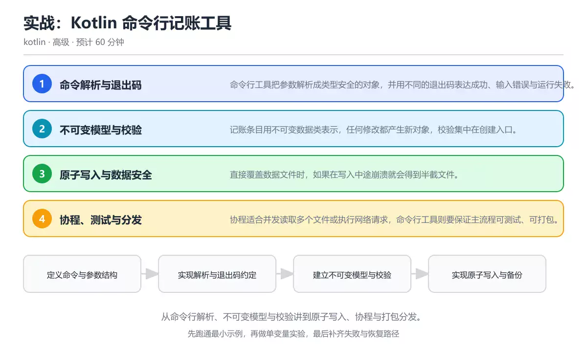
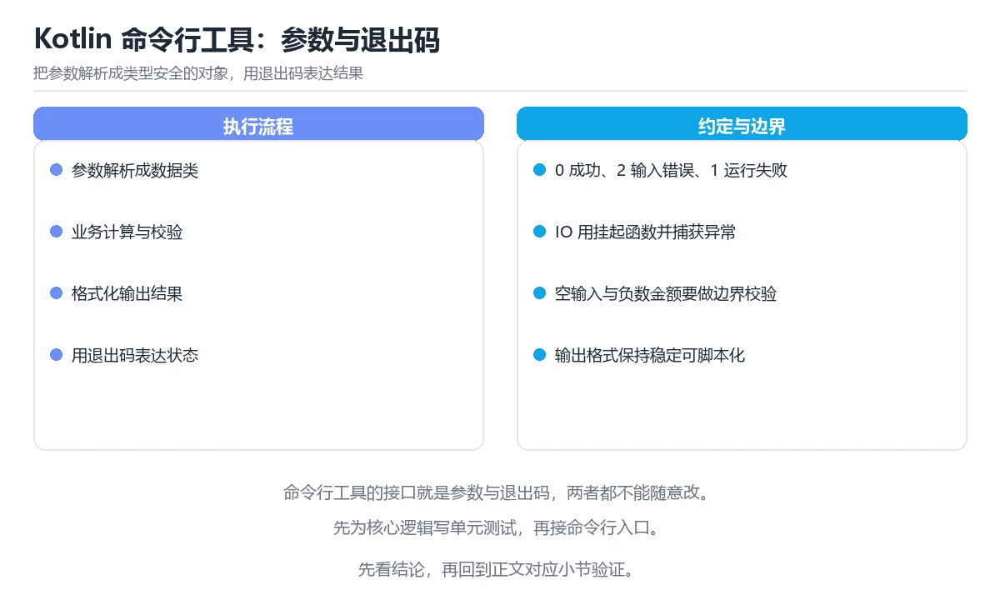

# 实战：Kotlin 命令行记账工具

> 内容更新时间：2026-10-06 · 学习阶段：高级 · 预计用时：60 分钟

分类：kotlin。关键词：Kotlin、命令行、协程、序列化、测试。从命令行解析、不可变模型与校验讲到原子写入、协程与打包分发。

学习建议：先通读《实战：Kotlin 命令行记账工具》的核心知识与关键流程，再运行可运行练习并完成测验；遇到不确定的结论，回到「故障现场」按症状、根因、修复、验证四步核对。



## 学习目标

- 能把命令行输入解析成类型安全的参数对象并给出明确退出码。
- 能用不可变模型与密封结果类型表达成功与失败。
- 能用临时文件加原子替换保证数据文件在异常时不损坏。

## 前置知识

- 熟悉 Kotlin 的可空类型、数据类与密封类。
- 了解 Kotlin 协程的基本用法。
- 知道文件读写与异常处理的基本方式。

## 核心知识

### 1. 命令解析与退出码

命令行工具把参数解析成类型安全的对象，并用不同的退出码表达成功、输入错误与运行失败。

解析阶段负责把字符串转成数字、日期等类型并校验范围，失败时输出用法提示并返回约定退出码。

在实战：Kotlin 命令行记账工具里可以这样验证：分别传入合法参数、错误类型与缺失参数，观察退出码与提示信息是否一致。

边界：把解析与业务逻辑混在一起会让错误信息难以定位，也让单元测试必须构造完整命令行。

工程视角：解析结果用密封类型区分成功与用法错误，业务层只接收已校验的模型。

### 2. 不可变模型与校验

记账条目用不可变数据类表示，任何修改都产生新对象，校验集中在创建入口。

构造函数或工厂函数负责检查金额精度、日期顺序与分类合法性，非法输入直接返回失败而不是留下半成品对象。

在实战：Kotlin 命令行记账工具里可以这样验证：尝试创建金额为负、日期格式错误的条目，确认都在创建阶段被拒绝。

边界：把校验分散到各个使用点会漏掉路径，尤其是从文件反序列化时最容易绕过校验。

工程视角：反序列化后统一走同一套校验函数，避免出现只有内存对象合法、文件对象非法的差异。

### 3. 原子写入与数据安全

直接覆盖数据文件时，如果在写入中途崩溃就会得到半截文件。

先把新内容写进同目录的临时文件并刷新，再用重命名替换目标文件，重命名在多数文件系统上是原子操作。

在实战：Kotlin 命令行记账工具里可以这样验证：在写入过程中强制结束进程，检查数据文件是否仍是上一份完整内容。

边界：临时文件与目标文件不在同一分区时重命名会退化为复制，原子性不再成立。

工程视角：保留一份备份并记录格式版本号，升级时先读版本再决定迁移路径。

### 4. 协程、测试与分发

协程适合并发读取多个文件或执行网络请求，命令行工具则要保证主流程可测试、可打包。

用结构化并发把多个任务放进同一作用域，任一失败可取消其余任务；测试用可注入的协程调度器与临时目录保证可重复。

在实战：Kotlin 命令行记账工具里可以这样验证：并发读取多个月的账单文件并汇总，统计串行与并发的耗时差异。

边界：在全局作用域里启动协程会让异常被吞掉，测试也会因为后台任务未结束而不稳定。

工程视角：把调度器与文件路径作为依赖注入，发布时打包成可执行分发包并写明运行环境要求。

## 关键流程

```text
定义命令与参数结构 → 实现解析与退出码约定 → 建立不可变模型与校验 → 实现原子写入与备份 → 补测试并打包分发
```

1. 定义命令与参数结构
2. 实现解析与退出码约定
3. 建立不可变模型与校验
4. 实现原子写入与备份
5. 补测试并打包分发

## 动手练习

1. 实现 add、list 与 summary 三个子命令，并约定各自的退出码。
2. 人为在写入中途终止进程，验证原子替换后数据文件仍然完整可读。
3. 并发读取多个账单文件做汇总，比较串行与并发的耗时与错误处理差异。

验收标准：换一个人按记录重跑能得到同一结论。

## 常见错误与排查

> 说明：本表由《实战：Kotlin 命令行记账工具》的核心知识整理（2026-10-06），人工复核进度见 docs/content_review_batches.md。

| 易错点 | 容易踩的做法 | 正确结论 |
| --- | --- | --- |
| 直接覆盖数据文件 | 用截断方式写入原文件，崩溃后只剩半截内容 | 先写同目录临时文件，再用原子替换覆盖目标文件 |
| 金额使用浮点数 | 用 Double 累加金额导致分位误差 | 统一以最小货币单位整数或高精度小数存储 |
| 全局作用域里启动协程 | 用非结构化并发启动后台任务，异常被吞掉 | 在受控作用域内并发，失败时取消同组任务并向上报告 |

## 可运行练习

### 任务 1：先跑通，再解释

```kotlin
import java.nio.file.Files
import java.nio.file.Path
import java.nio.file.StandardCopyOption

sealed interface ParseResult {
    data class Ok(val amountCents: Long, val category: String) : ParseResult
    data class Failure(val message: String) : ParseResult
}

fun parseAmount(raw: String?): ParseResult {
    val text = raw?.trim().orEmpty()
    if (text.isEmpty()) return ParseResult.Failure("缺少金额参数")
    val cents = text.toBigDecimalOrNull()?.movePointRight(2)?.toLong()
        ?: return ParseResult.Failure("金额必须是数字")
    if (cents <= 0) return ParseResult.Failure("金额必须大于 0")
    return ParseResult.Ok(cents, "default")
}

fun writeAtomically(target: Path, content: String) {
    val dir = target.toAbsolutePath().parent
    val temp = Files.createTempFile(dir, "ledger", ".tmp")
    Files.writeString(temp, content)
    Files.move(temp, target, StandardCopyOption.REPLACE_EXISTING, StandardCopyOption.ATOMIC_MOVE)
}

fun main(args: Array<String>) {
    when (val result = parseAmount(args.firstOrNull())) {
        is ParseResult.Failure -> {
            System.err.println(result.message)
            kotlin.system.exitProcess(2)
        }
        is ParseResult.Ok -> println("记录成功：${result.amountCents} 分")
    }
}
```

示例用密封接口把解析成功与失败分开，金额统一转成分避免浮点误差；写入时先在同目录创建临时文件再原子移动，保证中途失败不会破坏已有账本。

### 任务 2：只改一个条件

复制上面的示例，只改一个输入或参数再跑一次；先写下预测，再和真实输出对照，并说明差异来自实战：Kotlin 命令行记账工具的哪条机制。

### 任务 3：迁移到自己的数据

把《实战：Kotlin 命令行记账工具》里的示例换成你自己的一小段数据或场景，保持结构不变；如果换不动，说明还有哪条前提没有理解，回到核心知识对应小节。

## 项目专属规格

### 交付目标

从命令行解析、不可变模型与校验讲到原子写入、协程与打包分发。

### 里程碑

1. 定义命令与参数结构
2. 实现解析与退出码约定
3. 建立不可变模型与校验
4. 实现原子写入与备份
5. 补测试并打包分发

### 输入与约束

- 输入：实现 add、list 与 summary 三个子命令，并约定各自的退出码。
- 约束：把解析与业务逻辑混在一起会让错误信息难以定位，也让单元测试必须构造完整命令行。
- 失败预算：先写同目录临时文件，再用原子替换覆盖目标文件

### 验收场景

1. 正常路径：跑通「可运行练习」里的最小示例并保存输出。
2. 边界路径：分别传入合法参数、错误类型与缺失参数，观察退出码与提示信息是否一致。
3. 失败路径：出现「用截断方式写入原文件，崩溃后只剩半截内容」时按上面的失败预算恢复。

## 项目交付物

- 可运行代码：包含kotlin源文件、依赖说明与启动入口。
- README：环境版本、启动命令、目录结构与已知限制。
- 测试记录：覆盖 Kotlin 与 命令行 的正常、边界与失败路径，附命令与输出。
- 复盘记录：记录 Kotlin 与 命令行 的对比结论，并给出下一步验证动作。

### 交付验收清单

- [ ] 能把命令行输入解析成类型安全的参数对象并给出明确退出码。
- [ ] 能用不可变模型与密封结果类型表达成功与失败。
- [ ] 能用临时文件加原子替换保证数据文件在异常时不损坏。

## 验证命令与预期输出

| 步骤 | 命令 | 预期输出 |
| --- | --- | --- |
| 准备环境 | 按 README 安装依赖 | 依赖安装完成且没有版本冲突 |
| 运行示例 | 运行「可运行练习」中的入口 | 传入 12.50 时输出「记录成功：1250 分」并返回 0；传入空值或负数时输出提示并返回退出码 2；写入过程中中断进程后，原数据文件仍保持完整。 |
| 边界输入 | 替换一个输入后重跑 | 结果仍能被正文机制解释 |
| 失败演练 | 按「故障现场」制造一次失败 | 能定位根因并恢复到正常输出 |

### 验收证据

- [ ] 保存一次成功运行的完整输出。
- [ ] 保存一次边界输入的输出与解释。
- [ ] 记录一次失败现象、根因与修复动作。

> 项目目标：实战：Kotlin 命令行记账工具 的每一步都要能复现，做不到复现就先缩小范围。

## 故障现场

### 现场 1：直接覆盖数据文件

**症状**：在《实战：Kotlin 命令行记账工具》的复现场景中，用截断方式写入原文件，崩溃后只剩半截内容。

**根因**：当出现“直接覆盖数据文件”时，执行路径已经绕过了《实战：Kotlin 命令行记账工具》的关键约束，最终以“用截断方式写入原文件，崩溃后只剩半截内容”暴露出来；修复前必须先确认约束在哪里失效。

**修复**：针对《实战：Kotlin 命令行记账工具》的问题，先写同目录临时文件，再用原子替换覆盖目标文件。

**验证**：保留《实战：Kotlin 命令行记账工具》里触发“用截断方式写入原文件，崩溃后只剩半截内容”的输入、版本和日志，按“先写同目录临时文件，再用原子替换覆盖目标文件”完成修改后原样重放；只有失败现象消失且相邻场景仍可解释，才保留改动。

### 现场 2：金额使用浮点数

**症状**：在《实战：Kotlin 命令行记账工具》的复现场景中，用 Double 累加金额导致分位误差。

**根因**：“用 Double 累加金额导致分位误差”只是表层结果。向上追溯会落到“金额使用浮点数”这一步，因为它省略了《实战：Kotlin 命令行记账工具》的约束，使实现行为和预期模型发生了偏离。

**修复**：针对《实战：Kotlin 命令行记账工具》的问题，统一以最小货币单位整数或高精度小数存储。

**验证**：先在《实战：Kotlin 命令行记账工具》中记录“金额使用浮点数”留下的失败证据，再执行“统一以最小货币单位整数或高精度小数存储”并重放；确认错误路径变为明确结果，且修复没有掩盖同类故障。

### 现场 3：全局作用域里启动协程

**症状**：在《实战：Kotlin 命令行记账工具》的复现场景中，用非结构化并发启动后台任务，异常被吞掉。

**根因**：触发点是把“全局作用域里启动协程”当成安全做法。它没有满足《实战：Kotlin 命令行记账工具》要求的前提，因此先表现为“用非结构化并发启动后台任务，异常被吞掉”；排查时先完整复现这一段，再核对输入、配置与依赖。

**修复**：针对《实战：Kotlin 命令行记账工具》的问题，在受控作用域内并发，失败时取消同组任务并向上报告。

**验证**：保留《实战：Kotlin 命令行记账工具》里触发“用非结构化并发启动后台任务，异常被吞掉”的输入、版本和日志，按“在受控作用域内并发，失败时取消同组任务并向上报告”完成修改后原样重放；只有失败现象消失且相邻场景仍可解释，才保留改动。

## 本课复习清单

离开本课前，逐项确认：

- [ ] 能说明退出码约定与脚本自动化的关系。
- [ ] 能写出原子写入的完整步骤并解释每一步的必要性。
- [ ] 能指出校验应该集中在哪个位置。
- [ ] 至少运行一次 StandardCopyOption 的示例，记录输入、输出和 Kotlin 的边界情况。
- [ ] 把本课最容易混淆的两个概念写成一句话对照。

| 复盘项 | 记录 |
| --- | --- |
| 已经能独立解释的考点 |  |
| 仍然说不清的概念 |  |
| 下一步验证动作 |  |

## 复习与自测

### 核心知识

遮住正文回答：实战：Kotlin 命令行记账工具解决什么问题、依赖哪些前提、失败时先看哪个信号？三问都能答清楚，再进入下一节。

### 动手练习

把《实战：Kotlin 命令行记账工具》里「只改一个条件」的练习再做一遍，这次先写预测再运行；预测和结果不一致的地方，就是需要回读的章节。

### 最小可运行示例

```kotlin
import java.nio.file.Files
import java.nio.file.Path
import java.nio.file.StandardCopyOption

sealed interface ParseResult {
    data class Ok(val amountCents: Long, val category: String) : ParseResult
    data class Failure(val message: String) : ParseResult
}

fun parseAmount(raw: String?): ParseResult {
    val text = raw?.trim().orEmpty()
    if (text.isEmpty()) return ParseResult.Failure("缺少金额参数")
    val cents = text.toBigDecimalOrNull()?.movePointRight(2)?.toLong()
        ?: return ParseResult.Failure("金额必须是数字")
    if (cents <= 0) return ParseResult.Failure("金额必须大于 0")
    return ParseResult.Ok(cents, "default")
}

fun writeAtomically(target: Path, content: String) {
    val dir = target.toAbsolutePath().parent
    val temp = Files.createTempFile(dir, "ledger", ".tmp")
    Files.writeString(temp, content)
    Files.move(temp, target, StandardCopyOption.REPLACE_EXISTING, StandardCopyOption.ATOMIC_MOVE)
}

fun main(args: Array<String>) {
    when (val result = parseAmount(args.firstOrNull())) {
        is ParseResult.Failure -> {
            System.err.println(result.message)
            kotlin.system.exitProcess(2)
        }
        is ParseResult.Ok -> println("记录成功：${result.amountCents} 分")
    }
}
```

### 预期输出

```text
传入 12.50 时输出「记录成功：1250 分」并返回 0；传入空值或负数时输出提示并返回退出码 2；写入过程中中断进程后，原数据文件仍保持完整。
```

### 验证步骤

1. 确认输入数据与运行环境和示例一致。
2. 运行示例，记录输出与耗时等可观测指标。
3. 换一个边界输入重跑，确认结论仍然成立。
4. 把两次结果写成一句话结论，注明前提与局限。

## 术语速查

先遮住右列，尝试用自己的话解释，再回到正文核对。

| 术语 | 一句话说明 |
| --- | --- |
| `密封接口` | 限制实现集合的类型，便于用穷尽分支表达结果。 |
| `退出码` | 进程返回给调用方的整数状态，用于区分成功与不同失败类型。 |
| `原子替换` | 通过重命名让文件内容整体切换、避免中间状态的写入方式。 |
| `结构化并发` | 让子任务的生命周期受父作用域约束的并发模型。 |
| `不可变数据` | 创建后不再改变，修改会生成新实例的数据结构。 |

## 考点精讲

### 考点 1：命令行工具用不同退出码的意义是什么？

题型：概念判断。题干：命令行工具用不同退出码的意义是什么？

判断要点：让脚本能区分成功与不同失败类型。退出码是命令行工具与调用脚本之间的契约：0 表示成功，非 0 分别表示用法错误、输入非法或运行失败，自动化流程据此决定重试、告警还是直接中止。 正确选项「让脚本能区分成功与不同失败类型」对应《实战：Kotlin 命令行记账工具》的要点「命令解析与退出码」：命令行工具把参数解析成类型安全的对象，并用不同的退出码表达成功、输入错误与运行失败。判断「命令解析与退出码」时先确认前提是否成立，再回到《实战：Kotlin 命令行记账工具》的示例核对一次；把别的语言或框架的默认做法直接搬到命令解析与退出码上，往往会在本课的边界条件里失效。

### 考点 2：金额为什么更适合以最小单位整数存储？

题型：概念判断。题干：金额为什么更适合以最小单位整数存储？

判断要点：避免浮点数累加带来的精度误差。二进制浮点无法精确表示多数十进制小数，多次累加后会出现分位误差；以分或更高精度的小数类型存储可以让账目在任何一次汇总后都保持精确。 正确选项「避免浮点数累加带来的精度误差」对应《实战：Kotlin 命令行记账工具》的要点「不可变模型与校验」：记账条目用不可变数据类表示，任何修改都产生新对象，校验集中在创建入口。判断「不可变模型与校验」时先确认前提是否成立，再回到《实战：Kotlin 命令行记账工具》的示例核对一次；借鉴相邻主题的经验之前，先核对不可变模型与校验的前提是否成立。

### 考点 3：以下哪些做法能提高数据文件的安全性？（多

题型：多选辨析。题干：以下哪些做法能提高数据文件的安全性？（多选）

判断要点：写入同目录临时文件后原子替换；保留一份备份并记录格式版本；反序列化后统一走同一套校验。原子替换保证中途失败不影响原文件，备份与版本号让升级和回滚有依据，统一校验能防止文件里的非法数据绕过检查；先清空原文件再写入会让崩溃直接造成数据丢失。 正确选项「写入同目录临时文件后原子替换；保留一份备份并记录格式版本；反序列化后统一走同一套校验」对应《实战：Kotlin 命令行记账工具》的要点「原子写入与数据安全」：直接覆盖数据文件时，如果在写入中途崩溃就会得到半截文件。判断「原子写入与数据安全」时先确认前提是否成立，再回到《实战：Kotlin 命令行记账工具》的示例核对一次；记住原子写入与数据安全的结论之外还要记住适用条件，换一个输入往往就不成立了。

### 考点 4：请按一次记账写入的合理顺序排列步骤。

题型：顺序排列。题干：请按一次记账写入的合理顺序排列步骤。

判断要点：把临时文件原子替换为目标文件。顺序是先解析校验、再写临时文件、然后原子替换、最后重新加载验证；省略最后的回读验证，格式错误可能要等到下一次启动才被发现。 正确选项「解析参数并校验；把新内容写入临时文件；把临时文件原子替换为目标文件；重新加载文件确认结果可读」对应《实战：Kotlin 命令行记账工具》的要点「协程、测试与分发」：协程适合并发读取多个文件或执行网络请求，命令行工具则要保证主流程可测试、可打包。判断「协程、测试与分发」时先确认前提是否成立，再回到《实战：Kotlin 命令行记账工具》的示例核对一次；干扰项常常是相邻主题里成立的结论，只有按协程、测试与分发的输入与约束判断才能排除。

### 考点 5：阅读这段 Kotlin 代码，下面哪项判

题型：代码阅读。题干：阅读这段 Kotlin 代码，下面哪项判断是正确的？

判断要点：解析失败返回密封类型，写入通过临时文件加原子替换完成。这段 Kotlin 代码用密封类型表达解析结果，调用方必须显式处理失败分支；写入路径先落到同目录临时文件再原子替换，避免中途崩溃留下半截数据文件。 正确选项「解析失败返回密封类型，写入通过临时文件加原子替换完成」对应《实战：Kotlin 命令行记账工具》的要点「命令解析与退出码」：命令行工具把参数解析成类型安全的对象，并用不同的退出码表达成功、输入错误与运行失败。判断「命令解析与退出码」时先确认前提是否成立，再回到《实战：Kotlin 命令行记账工具》的示例核对一次；把命令解析与退出码的做法换到别的约束下未必成立，先确认边界再决定答案。

## English Overview

Hands-on Kotlin CLI Ledger

A Kotlin CLI tool parses arguments into typed values, reports failures through exit codes and sealed results, and keeps domain models immutable with validation at the creation boundary. Persist data by writing a temporary file and moving it into place atomically, keep money in minor units, and use structured concurrency so failures cancel sibling tasks instead of leaking background work.



## 本课小结

- 实战：Kotlin 命令行记账工具围绕Kotlin、命令行、协程展开，先建立基线再讨论优化。
- 命令行工具把参数解析成类型安全的对象，并用不同的退出码表达成功、输入错误与运行失败。
- 排查 命令行 时保留原始错误信息，不要先改代码。

## 内容元数据

- 内容版本：v2.0
- 最后更新：2026-10-06
- 学习阶段：高级

| 字段 | 值 |
| --- | --- |
| 课程 ID | `kotlin_project_cli_ledger` |
| 所属分类 | `kotlin` |
| 难度 | 高级 |
| 预计用时 | 60 分钟 |
| 关键词 | Kotlin、命令行、协程、序列化、测试 |
| 配图 | `images/lesson_kotlin_project_cli_ledger.webp` |
| 参考资料 | 3 条 |
| 内容更新时间 | 2026-10-06 |

## 参考资料与复核

- 最后复核：2026-10-04
- 下次复核：2026-11-24
- 复核范围：版本兼容、API 行为与工程实践

下面列出的资料用于核对本课结论，复习时可以对照阅读：
- [Kotlin 官方文档：协程](https://kotlinlang.org/docs/coroutines-overview.html)
- [Kotlin 官方文档：命令行编译器](https://kotlinlang.org/docs/command-line.html)
- [Java 文档：Files 与原子移动](https://docs.oracle.com/en/java/javase/21/docs/api/java.base/java/nio/file/Files.html)

> 复核提示：《实战：Kotlin 命令行记账工具》的结论如与资料冲突，以资料中的规范文本为准，并在笔记里记录差异与日期。

## 复习与迁移

### 概念复述

不看正文，把实战：Kotlin 命令行记账工具讲给一个没学过的同事：先讲它解决什么问题，再讲一个最小例子，最后说明一个不适用场景。

### 测验回顾

回到《实战：Kotlin 命令行记账工具》测验，只重做答错或犹豫的题；对每道题写一句「我为什么改选这个答案」，写不出理由就回到对应小节。

### 迁移练习

把《实战：Kotlin 命令行记账工具》的方法用到一个你自己的真实场景：说明输入、约束与验证方式，并列出仍然不确定、需要下一次实验回答的问题。

<!-- p1-project-review:start -->
## 交付评审：评分表、决策记录与证据链

「实战：Kotlin 命令行记账工具」的验收不能只看功能能不能跑通。下面把正文里的交付物、验证命令和关键设计点整理成一张评审表，按表逐项留下证据即可。

### 一、「实战：Kotlin 命令行记账工具」的交付物评分表

| 交付物 | 权重 | 合格线 | 需要的证据 |
| --- | ---: | --- | --- |
| 可运行代码：包含kotlin源文件、依赖说明与启动入口。 | 25% | 能在干净环境复现，且失败路径有明确处理 | 命令与输出、对应测试、一次失败与恢复记录 |
| README：环境版本、启动命令、目录结构与已知限制。 | 25% | 能在干净环境复现，且失败路径有明确处理 | 命令与输出、对应测试、一次失败与恢复记录 |
| 测试记录：正常、边界与失败路径各至少一条，附命令与输出。 | 25% | 能在干净环境复现，且失败路径有明确处理 | 命令与输出、对应测试、一次失败与恢复记录 |
| 复盘记录：本次实现推翻了哪个假设，下一步验证动作是什么。 | 25% | 能在干净环境复现，且失败路径有明确处理 | 命令与输出、对应测试、一次失败与恢复记录 |

「实战：Kotlin 命令行记账工具」的评分先看证据再打分：任意一项只要拿不出可复现的命令或测试，该项按 0 分计，不允许用「基本完成」代替。

### 二、需要写下来的决策（ADR）

| 决策点 | 本课给出的做法 | 备选方案 | 代价与回滚 |
| --- | --- | --- | --- |
| 2. 不可变模型与校验 | 记账条目用不可变数据类表示，任何修改都产生新对象，校验集中在创建入口。 | 不做「2. 不可变模型与校验」，沿用最朴素的实现（需要额外补一次对照实验） | 若「2. 不可变模型与校验」出问题，回到上一版本并按本课验收场景重跑 |
| 里程碑 | 1. 定义命令与参数结构 | 不做「里程碑」，沿用最朴素的实现（需要额外补一次对照实验） | 若「里程碑」出问题，回到上一版本并按本课验收场景重跑 |

ADR 不需要长：每个决策三行就够——选了什么、放弃了什么、出问题怎么退。评审时只检查这三行是否和「实战：Kotlin 命令行记账工具」的实际代码一致。

### 三、「实战：Kotlin 命令行记账工具」的交付证据链

本课未给出可执行命令，用下面的最小证据集代替：

1. 一条从零开始的环境准备命令。
2. 一条跑通核心链路的命令及其完整输出。
3. 一条触发失败的命令，以及恢复后的验证结果。

把「实战：Kotlin 命令行记账工具」的上表整理成一个 evidence/ 目录：每条命令一个文件，文件名带日期，内容包含版本、命令与输出。评审时直接按目录核对，不再口头确认。

### 四、「实战：Kotlin 命令行记账工具」的验收指标

| 指标 | 目标值 | 测量方式 | 不达标时的动作 |
| --- | --- | --- | --- |
| 失败路径：出现「用截断方式写入原文件，崩溃后只剩半截内容」时按上面的失败预算恢复。 | 用本课正文给出的阈值，没有就写实测基线 | 固定环境重复三次取中位数 | 回到对应小节定位，先修原因再重测 |

指标必须能用一条命令或一次操作测出来；写不出测量方式的指标，在「实战：Kotlin 命令行记账工具」的评审里一律视为未定义。

### 五、评审记录模板

| 记录项 | 填写要求 |
| --- | --- |
| 项目标识 | `kotlin_project_cli_ledger` |
| 本次范围 | 说明这一轮交付了「实战：Kotlin 命令行记账工具」的哪些部分 |
| 未完成项 | 列出与 Kotlin 相关但本轮未做的内容 |
| 证据位置 | 指向 evidence/ 目录下的具体文件 |
| 风险与回滚 | 写清剩余风险、回滚步骤和验证方式 |
| 结论 | 通过 / 有条件通过 / 不通过，三者选一 |

「实战：Kotlin 命令行记账工具」评审结束后把这张表填完并归档；下一轮迭代直接读上一次的「未完成项」与「风险与回滚」，避免重复讨论同一个问题。
<!-- p1-project-review:end -->
