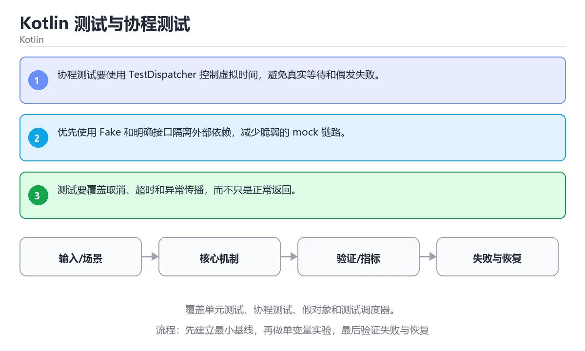

# Kotlin 测试与协程测试




> 内容更新时间：2026-10-06 · 学习阶段：高级 · 预计用时：35 分钟

## 学习目标

- 能用自己的话解释：协程测试要使用 TestDispatcher 控制虚拟时间，避免真实等待和偶发失败。
- 能用自己的话解释：优先使用 Fake 和明确接口隔离外部依赖，减少脆弱的 mock 链路。
- 能用自己的话解释：测试要覆盖取消、超时和异常传播，而不只是正常返回。
- 能把本课知识放回「Kotlin」，并完成练习与测验。

## 前置知识

- 已完成本分类的基础课程，能独立运行 JUnit 的最小示例。
- 本课关键词：JUnit、协程测试、Fake、调度器。
- 遇到不熟悉的术语先记录问题，完成练习后再回读。

## 核心知识

### 1. 协程测试要使用 TestDispatcher 控制虚拟时间，避免真实等待和偶发失败。

- 关键做法：基线只保留 协程测试 必需的部分，其余条件一次加一个。
- 验证标准：协程测试 的异常路径有明确错误信息与恢复动作。

### 2. 优先使用 Fake 和明确接口隔离外部依赖，减少脆弱的 mock 链路。

把这条结论放回「Kotlin 测试与协程测试」的完整流程里展开：

- 正文依据：能用自己的话解释：协程测试要使用 TestDispatcher 控制虚拟时间，避免真实等待和偶发失败。
- 落地检查：把「2. 优先使用 Fake 和明确接口隔离外部依赖，减少脆弱的 mock 链路。」改写成一条可执行的核对项，逐条验证输入、超时与失败路径。

### 3. 测试要覆盖取消、超时和异常传播，而不只是正常返回。

把这条结论放回「Kotlin 测试与协程测试」的完整流程里展开：

- 正文依据：能用自己的话解释：优先使用 Fake 和明确接口隔离外部依赖，减少脆弱的 mock 链路。
- 落地检查：把「3. 测试要覆盖取消、超时和异常传播，而不只是正常返回。」改写成一条可执行的核对项，逐条验证输入、超时与失败路径。

## 关键流程

```text
输入 → 校验 → 核心处理 → 验证 → 记录指标 → 失败恢复
```

## 实践路径

1. 用一句话复述本课要解决的问题。
2. 跑通正文中的最小示例并记录基线。
3. 只改变一个输入或参数，预测并验证结果。
4. 补一个失败路径，记录错误、恢复和指标。
5. 把结论写成可复现的笔记或测试。

## 常见错误与排查

> 说明：本表由《Kotlin 测试与协程测试》的核心知识整理（2026-10-07），人工复核进度见 docs/content_review_batches.md。

| 易错点 | 容易踩的做法 | 正确结论 |
| --- | --- | --- |
| 测试协程不使用测试调度器 | 结果不稳定且耗时 | 用测试调度器控制执行顺序与虚拟时间 |
| 只测正常路径 | 异常分支没有覆盖 | 覆盖失败、超时与空数据 |
| 测试依赖真实网络与时间 | 测试慢且不稳定 | 用假实现与虚拟时间替换外部依赖 |

## 动手练习

1. 合上教程，用 3～5 句话解释Kotlin 测试与协程测试。
2. 从正文选一个例子，改变一个条件并预测结果。
3. 设计一个失败场景，写出止损与恢复步骤。

**验收标准**：留下输入、命令、输出、差异和下一步问题。

## 本课小结

- 本课围绕 JUnit、协程测试、Fake、调度器 展开，复习时重点核对它们的输入、输出和失败路径。
- 把还不确定的 square 行为写成一条可执行验证，再进入下一课。


## 语言专项实践：Kotlin 测试与协程测试

### 一、工具链

| 阶段 | 推荐工具 | 验收标准 |
| --- | --- | --- |
| 编译构建 | kotlinc / Gradle | 命令可复现且错误能被定位 |
| 测试 | JUnit + coroutines-test | 命令可复现且错误能被定位 |
| 静态检查 | detekt / ktlint | 命令可复现且错误能被定位 |
| 发布 | R8/ProGuard + App Bundle | 命令可复现且错误能被定位 |

### 二、运行时与内存模型

围绕「JUnit、协程测试、Fake、调度器」说明变量生命周期、资源释放、并发模型和错误传播。语言语法只是入口，真正决定行为的是运行时、标准库和平台约束。

### 三、测试策略

- 单元测试覆盖核心规则和边界。
- 集成测试覆盖文件、网络、数据库或平台 API。
- 失败测试覆盖超时、取消、异常和资源耗尽。
- 性能测试记录基线，避免只凭感觉优化。

### 四、发布检查

- [ ] 版本和依赖锁定，构建可复现。
- [ ] 产物经过签名、校验和最小权限配置。
- [ ] 日志不泄露密钥和个人信息。
- [ ] 有升级、回滚和故障恢复说明。

## 可运行练习

本节围绕Kotlin 测试与协程测试安排 3 个可交付任务，每个任务都要求留下可以复查的记录。

### 任务 1：用自己的话画出结构

不看书，用一张图说清「Kotlin 测试与协程测试」的结构，画完再对照骨架：

- 主干：JUnit 的核心知识 → 关键流程 → 实践路径 → 常见误区
- 连接线：在每条边上标出输入、输出与失败路径。
- 自检：能否用一句话说明JUnit与协程测试的关系？

### 任务 2：做一次对比实验

**验收标准**：对照表两列都要有证据（命令、输出或数据），并注明JUnit与协程测试哪一个才是决定性变量。

### 任务 3：迁移到自己的场景

**验收标准**：结论要能追溯到「核心知识」的具体段落，并说明它和 协程测试 的边界。

## 故障现场

### 现场 1：测试协程不使用测试调度器

**症状**：在《Kotlin 测试与协程测试》的复现场景中，结果不稳定且耗时。

**根因**：触发点是把“测试协程不使用测试调度器”当成安全做法。它没有满足《Kotlin 测试与协程测试》要求的前提，因此先表现为“结果不稳定且耗时”；排查时先完整复现这一段，再核对输入、配置与依赖。

**修复**：针对《Kotlin 测试与协程测试》的问题，用测试调度器控制执行顺序与虚拟时间。

**验证**：保留《Kotlin 测试与协程测试》里触发“结果不稳定且耗时”的输入、版本和日志，按“用测试调度器控制执行顺序与虚拟时间”完成修改后原样重放；只有失败现象消失且相邻场景仍可解释，才保留改动。

### 现场 2：只测正常路径

**症状**：在《Kotlin 测试与协程测试》的复现场景中，异常分支没有覆盖。

**根因**：当出现“只测正常路径”时，执行路径已经绕过了《Kotlin 测试与协程测试》的关键约束，最终以“异常分支没有覆盖”暴露出来；修复前必须先确认约束在哪里失效。

**修复**：针对《Kotlin 测试与协程测试》的问题，覆盖失败、超时与空数据。

**验证**：保留《Kotlin 测试与协程测试》里触发“异常分支没有覆盖”的输入、版本和日志，按“覆盖失败、超时与空数据”完成修改后原样重放；只有失败现象消失且相邻场景仍可解释，才保留改动。

### 现场 3：测试依赖真实网络与时间

**症状**：在《Kotlin 测试与协程测试》的复现场景中，测试慢且不稳定。

**根因**：触发点是把“测试依赖真实网络与时间”当成安全做法。它没有满足《Kotlin 测试与协程测试》要求的前提，因此先表现为“测试慢且不稳定”；排查时先完整复现这一段，再核对输入、配置与依赖。

**修复**：针对《Kotlin 测试与协程测试》的问题，用假实现与虚拟时间替换外部依赖。

**验证**：保留《Kotlin 测试与协程测试》里触发“测试慢且不稳定”的输入、版本和日志，按“用假实现与虚拟时间替换外部依赖”完成修改后原样重放；只有失败现象消失且相邻场景仍可解释，才保留改动。

## 版本与时效

- 版本提示：JUnit 的行为在最近几个大版本里有过调整，升级「Kotlin 测试与协程测试」前先用 square 复现当前输出，再对照官方发布说明逐条核对。
- 升级「Kotlin 测试与协程测试」涉及的依赖前，先用 square 复现当前行为，再逐项核对版本说明与破坏性变更。
- 显式 API 模式与多平台源集是团队协作时的重点
- 官方说明：https://kotlinlang.org/docs/releases.html

### 升级检查清单

- 先固定当前版本，跑通全部示例与测验，再升级工具链。
- 一次只改一个版本条件，把 JUnit 相关的差异单独记成一条结论。
- 先回归 JUnit 与 协程测试 的默认行为和错误信息，再扩大测试范围。
- 升级完成后记录 JUnit 的新旧版本差异，并据此调整下次复核时间。

## 本课复习清单


离开本课前，逐项确认：

- [ ] 不看解析，能说出「关于「协程测试要使用 TestDispatcher 控制虚拟时间，避免真实等待和偶发失败。」，下列说法正确的是？」的判断依据。
- [ ] 不看解析，能说出「关于「优先使用 Fake 和明确接口隔离外部依赖，减少脆弱的 mock 链路。」，下列说法正确的是？」的判断依据。
- [ ] 不看解析，能说出「这段 Kotlin 代码是「Kotlin 测试与协程测试」的示例片段，下面哪一项描述与它一致？」的判断依据。
- [ ] 至少运行一次《Kotlin 测试与协程测试》的示例，记录输入、输出和一个边界情况。
- [ ] 把本课最容易混淆的两个概念写成一句话对照。

| 复盘项 | 记录 |
| --- | --- |
| 已经能独立解释的考点 |  |
| 仍然说不清的概念 |  |
| 下一步验证动作 |  |

## 复习与自测

逐节自检：能说清 JUnit 的输入、输出与失败路径才算通过，否则回到原文。

### 核心知识

自检：这一节与相邻主题的边界在哪里？

### 动手练习

自检：如果去掉这一节里的一个前提，结论会怎样变化？

### 语言专项实践：Kotlin 测试与协程测试

自检：用自己的话复述这一节，并举一个反例。

### 最小可运行示例

```kotlin
fun square(n: Int) = n * n

fun main() {
    check(square(7) == 49) { "square(7) 应该是 49" }
    println("test passed")
}
```

自检：把这一节讲给没学过的人，最需要强调哪一点？

### 预期输出

```text
test passed
```

### 验证步骤

制造一次错误输入，记录错误信息与修复方式。

## 术语速查

| 术语 | 一句话说明 |
| --- | --- |
| `JUnit` | Java 常用的单元测试框架，用注解声明测试、断言和生命周期。 |
| `协程测试` | 用测试调度器控制协程时间与并发，验证挂起、取消和异常路径。 |
| `Fake` | 按“Kotlin 测试与协程测试”中 JUnit、协程测试、Fake 的实践顺序，把四个步骤排成从准备到复盘的合理顺序。 |
| `调度器` | 二、运行时与内存模型：围绕「JUnit、协程测试、Fake、调度器」说明变量生命周期、资源释放、并发模型和错误传播。 |
| `协程` | 可挂起和恢复的轻量执行单元，由运行时或语言调度 |

## 深度拓展与实战

这一节把「Kotlin 测试与协程测试」正文里的定义、代码和失败模式串成一条可操作的复习路线。

### 机制拆解

- **1. 协程测试要使用 TestDispatcher 控制虚拟时间，避免真实等待和偶发失败。**：在「Kotlin 测试与协程测试」里，「1. 协程测试要使用 TestDispatcher 控制虚拟时间，避免真实等待和偶发失败。」这一步要先写清输入与预期，再记录实际结果和差异；结果不符时回到对应小节核对前提。
- **2. 优先使用 Fake 和明确接口隔离外部依赖，减少脆弱的 mock 链路。**：在「Kotlin 测试与协程测试」里，「2. 优先使用 Fake 和明确接口隔离外部依赖，减少脆弱的 mock 链路。」这一步要先写清输入与预期，再记录实际结果和差异；结果不符时回到对应小节核对前提。
- **3. 测试要覆盖取消、超时和异常传播，而不只是正常返回。**：在「Kotlin 测试与协程测试」里，「3. 测试要覆盖取消、超时和异常传播，而不只是正常返回。」这一步要先写清输入与预期，再记录实际结果和差异；结果不符时回到对应小节核对前提。
- 一、工具链：JUnit 的阶段、推荐工具与验收标准
- **二、运行时与内存模型**：围绕「JUnit、协程测试、Fake、调度器」说明变量生命周期、资源释放、并发模型和错误传播

### 边界条件与常见反例

「Kotlin 测试与协程测试」的边界不只包括最大最小值，还要覆盖空、重复和失败：

| 条件 | 常见反例 | 处理方式 |
| --- | --- | --- |
| 空输入 | JUnit 没有任何取值 | 先判空，给出明确错误而不是继续执行 |
| 边界值 | 协程测试 取最小或最大 | 用最小值、最大值和越界值各跑一次 |
| 重复执行 | 同一输入被执行两次 | 保证结果可重复，必要时加锁或去重 |
| 失败路径 | JUnit 相关步骤报错 | 保留原始错误，确认回滚或重试行为 |

### 工程检查表

- [ ] 能否用自己的话说明Kotlin 测试与协程测试解决什么问题，以及它不负责什么？
- [ ] 能否指出 square 最小示例的输入、输出和一条失败路径？
- [ ] 能否解释本课关键词在真实项目中的边界与取舍？
- [ ] 能否把 JUnit 的方法迁移到相近问题，并说明需要改哪一步？

### 迁移练习

1. 保持正文示例不变，写出它的输入、处理步骤和预期输出。
2. 只改变 JUnit 的一个条件，预测结果并说明依据；再运行或手算验证。
3. 结合JUnit、协程测试、Fake、调度器，写出一个真实项目中的使用场景。
4. 写下一个反例，说明它在什么条件下会使朴素做法失效。

<!-- p0-depth-v2:start -->

## 零基础精讲：把Kotlin 测试与协程测试真正讲透

### 先建立一个直觉

本课的摘要可以当作一张地图：覆盖单元测试、协程测试、假对象和测试调度器。

### 逐步拆解

1. 澄清输入与目标。先写清「Kotlin 测试与协程测试」要解决的问题、合法输入范围和成功标准，再进入后续步骤。
2. 描述处理过程。把「JUnit、协程测试、Fake、调度器」映射到具体步骤，每步都要求能单独验证。
3. 定义输出。把 square 的返回值、日志和失败信号都写清楚，缺一项都不算完整。
4. 先预测JUnit会怎样失败，再实际触发一次；差异部分就是本课最需要补的前提。
5. 把「核心知识」里的最小示例抄成 square 一行的输入，先手算结果再执行，确认两者一致。

### 把正文串成一条执行链

- **三、测试策略**：- 单元测试覆盖核心规则和边界

### 从测验反推易错点

**检查点 1：关于「协程测试要使用 TestDispatcher 控制虚拟时间，避免真实等待和偶发失败。」，下列说法正确的是？**

- 参考判断：协程测试要使用 TestDispatcher 控制虚拟时间，避免真实等待和偶发失败。
- 自问：如果去掉题干里的一个限定词，结论还成立吗？

**检查点 2：关于「优先使用 Fake 和明确接口隔离外部依赖，减少脆弱的 mock 链路。」，下列说法正确的是？**

- 参考判断：优先使用 Fake 和明确接口隔离外部依赖，减少脆弱的 mock 链路。

**检查点 3：关于「测试要覆盖取消、超时和异常传播，而不只是正常返回。」，下列说法正确的是？**

- 参考判断：测试要覆盖取消、超时和异常传播，而不只是正常返回。

**检查点 4：本课的核心学习目标是什么？**

- 参考判断：覆盖单元测试、协程测试、假对象和测试调度器。

**检查点 5：以下哪些术语与Kotlin 测试与协程测试直接相关？（多选）**

- 参考判断：JUnit、协程测试

### 工程排错顺序

| 先查什么 | 要得到的证据 | 判断标准 |
| --- | --- | --- |
| 输入与前提是否满足 | 日志、输入样例、测试或指标 | 能复现并解释，才算定位 |
| 核心步骤是否产生了预期中间结果 | 日志、输入样例、测试或指标 | 能复现并解释，才算定位 |
| 失败路径是否可观测、可恢复 | 日志、输入样例、测试或指标 | 能复现并解释，才算定位 |
| 资源、权限与成本是否在预算内 | 日志、输入样例、测试或指标 | 能复现并解释，才算定位 |

### 变式训练

1. 先用一个单文件示例验证 square，确认正确性后再引入框架或分布式组件。
2. 把 JUnit 的输入规模扩大十倍，记录时间、内存和失败路径，找出第一个瓶颈。
3. 制造一次 JUnit 相关的依赖超时或错误输入，要求错误可解释且不留半完成状态。
5. 故意跳过 协程测试 的检查再运行，比较与正常流程的差异，并说明这个检查挡住的到底是哪一类失败。
6. 把 JUnit 的方案切换到低资源设备，重新评估默认参数、超时和降级策略。

### 本课自测

- [ ] 能用一句话解释「JUnit」在本课中的角色与边界。
- [ ] 能举出一个正常例子和一个失败例子。
- [ ] 能说出最小验证步骤，以及需要记录的证据。
- [ ] 能用一句话解释「协程测试」在本课中的角色与边界。
- [ ] 能用一句话解释「Fake」在本课中的角色与边界。
- [ ] 能用一句话解释「调度器」在本课中的角色与边界。

### 迁移案例库

换一个 协程测试 约束重做一次，确认结论在新条件下是否仍然成立。

#### 迁移案例 1：围绕「JUnit」做一次小实验

**目标**：在不改变课程主体的前提下，验证Kotlin 测试与协程测试中的一个关键判断。

**步骤**：
1. 复述当前方案对「JUnit」的假设，写成一句可证伪的话。
2. 设计一个正常输入和一个边界输入，分别预测输出。
3. 运行或逐步演算，记录实际输出、耗时和失败信息。
4. 只调整一个参数，比较前后差异并解释原因。
5. 补充一条测试或复习卡，确保下次能更快复现。

**验收**：迁移过程要留下 square 的可运行记录，并说明协程测试在新场景下是否仍然成立。

#### 迁移案例 2：围绕「协程测试」做一次小实验

**步骤**：
1. 复述当前方案对「协程测试」的假设，写成一句可证伪的话。

#### 迁移案例 3：围绕「Fake」做一次小实验

**步骤**：
1. 复述当前方案对「Fake」的假设，写成一句可证伪的话。

#### 迁移案例 4：围绕「调度器」做一次小实验

**步骤**：
1. 复述当前方案对「调度器」的假设，写成一句可证伪的话。

#### 迁移案例 5：围绕「JUnit」做一次小实验

**步骤**：

#### 迁移案例 6：围绕「协程测试」做一次小实验

**步骤**：

#### 迁移案例 7：围绕「Fake」做一次小实验

**步骤**：

#### 迁移案例 8：围绕「调度器」做一次小实验

**步骤**：

#### 迁移案例 9：围绕「JUnit」做一次小实验

**步骤**：

#### 迁移案例 10：围绕「协程测试」做一次小实验

**步骤**：

#### 迁移案例 11：围绕「Fake」做一次小实验

**步骤**：

#### 迁移案例 12：围绕「调度器」做一次小实验

**步骤**：

#### 迁移案例 13：围绕「JUnit」做一次小实验

**步骤**：

#### 迁移案例 14：围绕「协程测试」做一次小实验

**步骤**：

#### 迁移案例 15：围绕「Fake」做一次小实验

**步骤**：

#### 迁移案例 16：围绕「调度器」做一次小实验

**步骤**：

<!-- p0-depth-v2:end -->

## 考点精讲

### 考点 1：概念判断·JUnit

- **题目**：关于「协程测试要使用 TestDispatcher 控制虚拟时间，避免真实等待和偶发失败。」，下列说法正确的是？
- **判断依据**：在「Kotlin 测试与协程测试」里，协程测试要使用 TestDispatcher 控制虚拟时间，避免真实等待和偶发失败。「Kotlin 测试与协程测试」要求先交代JUnit、协程测试、Fake的前提再下结论，所以“协程测试要使用 TestDispatch”只在题干“协程测试要使用 TestDispatcher 控制虚拟时间”给定的条件下成立。

### 考点 2：概念判断·JUnit

- **题目**：关于「优先使用 Fake 和明确接口隔离外部依赖，减少脆弱的 mock 链路。」，下列说法正确的是？
- **判断依据**：在「Kotlin 测试与协程测试」里，优先使用 Fake 和明确接口隔离外部依赖，减少脆弱的 mock 链路。这道题的关键在「Kotlin 测试与协程测试」的JUnit、协程测试、Fake：先确认题干“关于优先使用 Fake 和明确接口隔”问的是哪一步，再排除偷换前提的选项。把“优先使用 Fake 和明确接口隔离外部依”代回「Kotlin 测试与协程测试」里“优先使用 Fake 和明确接口隔离外部依赖”的例子核对，条件一旦改变，结论就要用JUnit、协程测试、Fake重新推导。

### 考点 3：代码补全·JUnit

- **题目**：这段 Kotlin 代码是「Kotlin 测试与协程测试」的示例片段，下面哪一项描述与它一致？
- **判断依据**：在「Kotlin 测试与协程测试」里，这段代码把主要逻辑封装在函数或方法里，需要被调用才会执行。这段代码出自「Kotlin 测试与协程测试」的正文示例，围绕JUnit、协程测试、Fake展开；把输入或边界换成空值、极值或失败情况后，结论要以「Kotlin 测试与协程测试」的实际运行结果为准。

### 考点 4：顺序排列·JUnit

- **题目**：按“Kotlin 测试与协程测试”中 JUnit、协程测试、Fake 的实践顺序，把四个步骤排成从准备到复盘的合理顺序。
- **判断依据**：题干的正确项是固定版本与证据，把“Kotlin 测试与协程测试”的结论写成可复现记录。在「Kotlin 测试与协程测试」里，在本课的练习里，顺序应当是：先明确 JUnit 的输入、输出与约束 → 写出最小示例并核对 协程测试 的基线结果 → 只改一个变量，记录边界与失败路径的变化 → 固定版本与证据，把本课的结论写成可复现记录。这个顺序把 JUnit 的输入、输出和约束放在最前面，在Kotlin 测试与协程测试里避免概念没对齐就开始调参。第二步用 协程测试 建立可核对的基线，在Kotlin 测试与协程测试里第三步才允许改变一个变量并观察失败路径。

### 考点 5：多选辨析·JUnit

- **题目**：以下哪些术语与「Kotlin 测试与协程测试」直接相关？（多选）
- **判断依据**：回到「Kotlin 测试与协程测试」的正文示例，用“以下哪些术语与Kotlin 测试与协”走一遍JUnit、协程测试、Fake的完整流程，能复现的结论才可以保留。回到JUnit、协程测试、Fake本身再看一遍：只有“JUnit”与题干“以下哪些术语与Kotlin”的前提一致，结论才成立。

## English Overview

**Title:** Kotlin Testing and Coroutine Tests

**Summary:** Cover unit tests, coroutine tests, fakes and test dispatchers.

**Category:** Kotlin
**Level:** 高级
**Key terms:** JUnit, 协程测试, Fake, 调度器

## 内容元数据

- 内容版本：v2.0
- 最后更新：2026-10-06
- 学习阶段：高级
- 适用环境：Kotlin 2.x / Android SDK；本课聚焦 JUnit。
- 内容来源：内置结构化课程与工程实践整理
- 相关主题：JUnit、协程测试、Fake、调度器
- 质量版本：P0 测验标准 + P1 覆盖扩展 + P2 体验补全

## 最小可运行示例

先用下面的示例确认 JUnit 的基线，再只改一个与 协程测试 相关的值：

```kotlin
fun square(n: Int) = n * n

fun main() {
    check(square(7) == 49) { "square(7) 应该是 49" }
    println("test passed")
}
```

## 预期输出

```text
test passed
```

## 验证步骤

1. 记录运行环境、命令和真实输出。
2. 修改一个输入，先写预测再运行。
4. 把结论写回本课笔记或测试用例。

## 参考资料与复核

- 最后复核：2026-10-04
- 下次复核：2026-11-10
- 复核范围：版本兼容、API 行为、安全建议与工程实践
- 来源性质：官方文档、标准或权威教材；正文为离线教学重组

| 参考资料 | 本课用途 |
| --- | --- |
| [Kotlin 测试](https://kotlinlang.org/docs/testing.html) | 单元测试与断言 |
| [Android Kotlin](https://developer.android.com/kotlin) | Android 官方 Kotlin 实践 |
| [Kotlin 基础语法](https://kotlinlang.org/docs/basic-syntax.html) | 语法、类型与函数 |

> 「Kotlin 测试与协程测试」的链接用于离线阅读后的延伸核对；App 不会自动联网。

## 复习与迁移

复习目标：把「Kotlin 测试与协程测试」的判断标准放回可复现的例子里。先自己作答，再对照依据；如果结论正确但理由不完整，回到正文补足前提。

### 概念复述

- 用一句话说明「Kotlin 测试与协程测试」解决什么问题：覆盖单元测试、协程测试、假对象和测试调度器。
- 写出JUnit、协程测试、Fake之间的关系，并各举一个例子。
- 说出本课最容易混淆的两个概念，以及区分它们的判据。

### 正文逐节复核

- **语言专项实践：Kotlin 测试与协程测试**：围绕「JUnit、协程测试、Fake、调度器」说明变量生命周期、资源释放、并发模型和错误传播。
- **实践任务**：本节围绕Kotlin 测试与协程测试安排 3 个可交付任务，每个任务都要求留下可以复查的记录。
- **零基础精讲：把Kotlin 测试与协程测试真正讲透**：本课的摘要可以当作一张地图：覆盖单元测试、协程测试、假对象和测试调度器。

### 测验回顾

1. 关于「协程测试要使用 TestDispatcher 控制虚拟时间，避免真实等待和偶发失败。」，下列说法正确的是？
   - 依据：在「Kotlin 测试与协程测试」里，协程测试要使用 TestDispatcher 控制虚拟时间，避免真实等待和偶发失败。「Kotlin 测试与协程测试」要求先交代JUnit、协程测试、Fake的前提再下结论，所以“协程测试要使用 TestDispatch”只在题干“协程测试要使用 TestDispatcher 控制虚拟时间”给定的条件下成立。
2. 关于「优先使用 Fake 和明确接口隔离外部依赖，减少脆弱的 mock 链路。」，下列说法正确的是？
   - 依据：在「Kotlin 测试与协程测试」里，优先使用 Fake 和明确接口隔离外部依赖，减少脆弱的 mock 链路。这道题的关键在「Kotlin 测试与协程测试」的JUnit、协程测试、Fake：先确认题干“关于优先使用 Fake 和明确接口隔”问的是哪一步，再排除偷换前提的选项。把“优先使用 Fake 和明确接口隔离外部依”代回「Kotlin 测试与协程测试」里“优先使用 Fake 和明确接口隔离外部依赖”的例子核对，条件一旦改变，结论就要用JUnit、协程测试、Fake重新推导。
3. 这段 Kotlin 代码是「Kotlin 测试与协程测试」的示例片段，下面哪一项描述与它一致？
   - 依据：在「Kotlin 测试与协程测试」里，这段代码把主要逻辑封装在函数或方法里，需要被调用才会执行。这段代码出自「Kotlin 测试与协程测试」的正文示例，围绕JUnit、协程测试、Fake展开；把输入或边界换成空值、极值或失败情况后，结论要以「Kotlin 测试与协程测试」的实际运行结果为准。
4. 按“Kotlin 测试与协程测试”中 JUnit、协程测试、Fake 的实践顺序，把四个步骤排成从准备到复盘的合理顺序。
   - 依据：题干的正确项是固定版本与证据，把“Kotlin 测试与协程测试”的结论写成可复现记录。在「Kotlin 测试与协程测试」里，在本课的练习里，顺序应当是：先明确 JUnit 的输入、输出与约束 → 写出最小示例并核对 协程测试 的基线结果 → 只改一个变量，记录边界与失败路径的变化 → 固定版本与证据，把本课的结论写成可复现记录。这个顺序把 JUnit 的输入、输出和约束放在最前面，在Kotlin 测试与协程测试里避免概念没对齐就开始调参。第二步用 协程测试 建立可核对的基线，在Kotlin 测试与协程测试里第三步才允许改变一个变量并观察失败路径。
5. 以下哪些术语与「Kotlin 测试与协程测试」直接相关？（多选）
   - 依据：回到「Kotlin 测试与协程测试」的正文示例，用“以下哪些术语与Kotlin 测试与协”走一遍JUnit、协程测试、Fake的完整流程，能复现的结论才可以保留。回到JUnit、协程测试、Fake本身再看一遍：只有“JUnit”与题干“以下哪些术语与Kotlin”的前提一致，结论才成立。

### 迁移练习

把「Kotlin 测试与协程测试」的结论迁移到相邻主题，每次迁移都写清预测与证据：

1. 换输入：用JUnit处理一组你自己的数据，对比教材示例的结果差异。
2. 换失败条件：制造一个协程测试相关的错误，说明如何从错误信息定位根因。
3. 换规模：把数据量或并发度提高一个数量级，说明「Kotlin 测试与协程测试」的结论是否仍成立。

