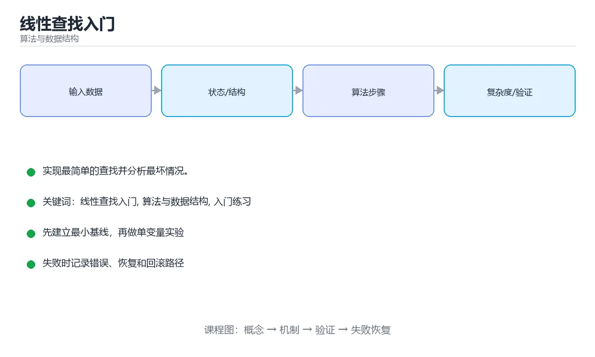

# 线性查找入门



> 内容更新时间：2026-10-03 · 学习阶段：入门 · 预计用时：15 分钟

## 学习目标

- 先认识「线性查找入门」需要的工具、输入和输出。
- 按步骤运行最小示例，并记录结果与错误。
- 用一个边界输入验证自己是否真正掌握。

## 前置知识

- 会进行基本的文件或命令行操作。
- 不需要预先掌握「算法与数据结构」的高级知识。

## 一句话入门

实现最简单的查找并分析最坏情况。

## 最小示例

```python
def linear_search(values, target):
    for index, value in enumerate(values):
        if value == target:
            return index
    return -1

print(linear_search([5, 3, 8], 8))
print(linear_search([5, 3, 8], 7))
```

## 预期输出

```text
2
-1
```

## 常见错误

- 输入或环境与示例不一致，导致结果不符合预期。
- 复制命令时遗漏空格、引号或必要参数。

## 动手练习

1. 原样运行最小示例，保存命令和输出。
2. 把数字 2 改成 10，预测并验证新结果。
3. 制造一个错误输入，写出错误信息和修复方法。

## 本课小结

- 入门阶段先保证能运行、能观察、能解释，再追求复杂功能。
- 每次只改一个变量，记录预测与实际结果。
- 遇到错误先看第一条错误信息，再回到最小示例。


## 线性查找的循环不变量

线性查找从头到尾逐个比较，直到找到目标或检查完所有元素。它的正确性可以用循环不变量描述：每轮开始时，目标一定不在已经检查过的前缀里；循环结束时，要么在当前位置找到目标，要么整个数组都已检查且目标不存在。这个不变量把“代码看起来对”变成可证明的推理，也能帮助定位边界错误，例如循环条件是 `<` 还是 `<=`、返回的是下标还是元素、重复元素要返回第一个还是任意一个。

复杂度分析要区分最好、最坏和平均情况。目标是第一个元素时只需一次比较，最好情况是 O(1)；目标不存在或位于末尾时要检查 n 个元素，最坏情况是 O(n)；在均匀随机且目标存在的假设下，平均比较次数约为 (n+1)/2，仍是 O(n)。空间复杂度是 O(1)，因为只需要保存下标和目标值。复杂度描述增长趋势，不代表小数组上一定比复杂算法慢。

查找结果通常有两种返回约定：返回下标，找不到时返回 -1；或者返回布尔值，只回答是否存在。两种接口都合理，但必须在文档和测试中写清楚。如果把 -1 当成合法下标，调用方就会读到最后一个元素，这是典型的“接口约定不清”错误。

## 边界与替代方案

空数组、单元素数组、目标在头部、目标在尾部、目标不存在、数组中存在重复目标，都是线性查找必须覆盖的边界。对重复元素，要先定义业务语义：返回第一个匹配项可用于去重或稳定选择，返回任意匹配项则可提高早期退出速度。若数据已经排序，二分查找可以把 O(n) 降到 O(log n)；若数据量大且查询频繁，哈希表或索引能以额外空间换取 O(1) 左右的平均查询。

但不要因为“有更快的算法”就跳过线性查找。数据量很小、数据经常变化、只需要一次查询或数据无法排序时，线性扫描反而更简单、缓存更友好，也更容易证明正确。工程选择要同时看数据规模、查询频率、排序成本和维护复杂度，而不是只看复杂度的渐近符号。

验证时可以写一个对照函数：对每个测试数组，分别用线性查找和内置查找计算结果，再比较下标与是否找到。随机生成数组能扩大覆盖，但边界数组必须手写。最后记录每次比较次数，用实际数据验证理论复杂度，而不是只复述结论。

## 代码实验：把示例跑成证据

这一节不引入新语法，而是把「线性查找入门」的最小示例变成可以复现、可以对照的实验。每次只改变一个条件，先写预测，再运行，最后解释差异。

### 实验一：建立基线

```python
def linear_search(values, target):
    for index, value in enumerate(values):
        if value == target:
            return index
    return -1

print(linear_search([5, 3, 8], 8))
print(linear_search([5, 3, 8], 7))
```

先原样运行上面的代码，记录命令、完整输出和退出状态。然后把输出与正文的预期输出逐字对照，不要用“看起来差不多”代替核对；空格、大小写、换行和错误流向都可能暴露环境差异。

### 实验二：只改一个输入

从代码中选一个会影响结果的字面量、参数或输入，把它替换成边界值：数值可尝试 0、1、最大值和最小值，字符串可尝试空串和超长文本，集合可尝试空集合、单元素和重复元素。先写出预测，再运行并记录实际结果。

### 实验三：制造一个可控错误

把复合语句末尾的冒号删掉，或者把字符串直接参与数值运算。先记录解释器报出的第一行错误和行号，再修复并重跑基线。

| 实验 | 改动 | 预测 | 实际 | 结论 |
| --- | --- | --- | --- | --- |
| 基线 | 保持原样 |  |  |  |
| 边界 |  |  |  |  |
| 失败 |  |  |  |  |

### 实验四：用三句话复述

1. 输入是什么，哪些输入属于合法范围，哪些属于边界或非法范围？
2. 程序按什么顺序处理输入，在哪一步产生了状态变化或副作用？
3. 输出如何验证，失败时第一条可观察证据是什么？

## 考点精讲：把测验题还原成判断过程

本课有 4 个判断点。先自己作答，再看「判断依据」；如果结论正确但理由不完整，回到正文对应章节补足概念。

### 考点 1：在长度为 n 的列表中做线性查找，最坏情况需要比较多少次？

- **正确判断**：n 次，目标可能在最后一个位置或根本不存在
- **判断依据**：线性查找从第一个元素开始逐个比较，最坏情况下要检查完全部 n 个元素才能确认不存在，因此时间复杂度是 O(n)。它不要求数据有序，也不需要额外空间。若数据已排序或需要频繁查找，二分查找与哈希表能把复杂度降到更低，但各自对数据形态与内存占用提出了额外要求。
- **迁移检查**：把题干里的一个条件换成边界值，原来的结论还成立吗？写出判断过程。

### 考点 2：查找函数在目标值不存在时返回 -1，这种做法意味着？

- **正确判断**：调用方需要区分「未找到」与合法下标 0
- **判断依据**：下标从 0 开始，因此 -1 不会被合法位置占用，可以安全地表示「未找到」；调用方必须显式判断返回值再使用，直接当作下标访问会取到最后一个元素并造成隐蔽缺陷。另一种做法是返回 None 或抛出异常，选择哪种约定要在接口文档中写清楚，并在代码评审时保持一致。
- **迁移检查**：如果给某个错误选项去掉一个限定词，它会不会变成正确？说明理由。

### 考点 3：线性查找与二分查找相比，主要优势是？

- **正确判断**：不要求数据有序，也不依赖随机访问
- **判断依据**：线性查找只要求能依次访问元素，因此对无序列表、链表与流式数据都适用；二分查找必须保证有序并支持快速定位中点。数据量很小或只查找一次时，线性查找的简单与低开销反而更合适。选择算法时要同时考虑数据规模、数据结构的访问方式与长期维护成本，而不是只看复杂度符号。
- **迁移检查**：遮住选项，只根据定义复述一次答案，再回来看哪个选项与复述一致。

### 考点 4：示例两次调用的输出分别是什么？

- **正确判断**：先输出 2，再输出 -1，分别表示找到与未找到
- **判断依据**：第一个列表中 8 位于下标 2，函数返回 2；第二个列表不含 7，循环结束返回 -1。示例用两次调用同时展示了命中与未命中两种路径。阅读查找代码时，要分别确认命中时的返回值与循环结束后的兜底返回，两者缺一都会造成逻辑错误，测试时也应对这两条路径分别覆盖。
- **迁移检查**：遮住选项，只根据定义复述一次答案，再回来看哪个选项与复述一致。

## 本课复习清单

离开本课前，逐项确认：

- [ ] 不看解析，能说出「在长度为 n 的列表中做线性查找，最坏情况需要比较多少次？」的判断依据。
- [ ] 不看解析，能说出「查找函数在目标值不存在时返回 -1，这种做法意味着？」的判断依据。
- [ ] 不看解析，能说出「线性查找与二分查找相比，主要优势是？」的判断依据。
- [ ] 不看解析，能说出「示例两次调用的输出分别是什么？」的判断依据。
- [ ] 至少运行一次本课示例，记录输入、输出和一个边界情况。
- [ ] 把本课最容易混淆的两个概念写成一句话对照。

| 复盘项 | 记录 |
| --- | --- |
| 已经能独立解释的考点 |  |
| 仍然说不清的概念 |  |
| 下一步验证动作 |  |

## 逐节复习与自检

下面按正文顺序回顾每一节，并给出一个自检问题；说不清的地方回到原章节补课。

### 最小示例

```python
def linear_search(values, target):
    for index, value in enumerate(values):
        if value == target:
            return index
    return -1

print(linear_search([5, 3, 8], 8))
print(linear_search([5, 3, 8], 7))
```

自检：这一节与相邻主题的边界在哪里？

### 预期输出

```text
2
-1
```

自检：这一节与相邻主题的边界在哪里？

### 常见错误

输入或环境与示例不一致，导致结果不符合预期。

自检：把这一节讲给没学过的人，最需要强调哪一点？

### 动手练习

把数字 2 改成 10，预测并验证新结果。制造一个错误输入，写出错误信息和修复方法。

自检：如果去掉这一节里的一个前提，结论会怎样变化？

### 线性查找的循环不变量

线性查找从头到尾逐个比较，直到找到目标或检查完所有元素。它的正确性可以用循环不变量描述：每轮开始时，目标一定不在已经检查过的前缀里；循环结束时，要么在当前位置找到目标，要么整个数组都已检查且目标不存在。

自检：这一节最常见的失败方式是什么？第一条可观察证据是什么？

### 边界与替代方案

空数组、单元素数组、目标在头部、目标在尾部、目标不存在、数组中存在重复目标，都是线性查找必须覆盖的边界。对重复元素，要先定义业务语义：返回第一个匹配项可用于去重或稳定选择，返回任意匹配项则可提高早期退出速度。

自检：这一节与相邻主题的边界在哪里？

## 术语速查

| 术语 | 本课语境 |
| --- | --- |
| `还是` | 线性查找从头到尾逐个比较，直到找到目标或检查完所有元素。它的正确性可以用循环不变量描述：每轮开始时，目标一定不在已经检查过的前缀里；循环结束时，要么在当前位置找到目标，要么整个数组都已检查且目标不存在。这个不变量把“代码看起来对”变成可证明… |

## 易错点回顾

下面把本课最容易判断错的地方集中成一张清单，复习时先自己回答，再对照解析补全理由。

- **在长度为 n 的列表中做线性查找，最坏情况需要比较多少次？**：线性查找从第一个元素开始逐个比较，最坏情况下要检查完全部 n 个元素才能确认不存在，因此时间复杂度是 O(n)。
- **查找函数在目标值不存在时返回 -1，这种做法意味着？**：下标从 0 开始，因此 -1 不会被合法位置占用，可以安全地表示「未找到」。
- **线性查找与二分查找相比，主要优势是？**：线性查找只要求能依次访问元素，因此对无序列表、链表与流式数据都适用。
- **示例两次调用的输出分别是什么？**：第一个列表中 8 位于下标 2，函数返回 2。

## English Overview

**Title:** Linear Search Basics

**Summary:** Implement simple search and analyze worst case.

**Category:** Algorithms  
**Level:** 入门  
**Key terms:** 线性查找入门, 算法与数据结构, 入门练习

> The full tutorial is written in Chinese. This bilingual overview helps English readers identify the topic, scope and key terms before studying the detailed examples.

## 内容元数据

- 内容版本：v2.0
- 最后更新：2026-10-03
- 学习阶段：入门
- 适用环境：任意主流语言（伪代码与复杂度为主）
- 内容来源：内置结构化课程与工程实践整理
- 相关主题：线性查找入门、算法与数据结构、入门练习
- 质量版本：P0 测验标准 + P1 覆盖扩展 + P2 体验补全


## 参考资料与复核

- 最后复核：2026-10-04
- 下次复核：2027-04-04
- 复核范围：版本兼容、API 行为、安全建议与工程实践
- 来源性质：官方文档与标准；本课正文为离线教学重组，不复制原文

| 参考资料 | 本课用途 |
| --- | --- |
| [CP-Algorithms](https://cp-algorithms.com/) | 算法实现与复杂度 |
| [MIT OpenCourseWare 6.006](https://ocw.mit.edu/courses/6-006-introduction-to-algorithms-spring-2020/) | 算法设计与分析 |

> 本课主题：实现最简单的查找并分析最坏情况。

> App 完全离线展示文字链接，不会自动联网；需要延伸阅读时可复制链接到浏览器。
