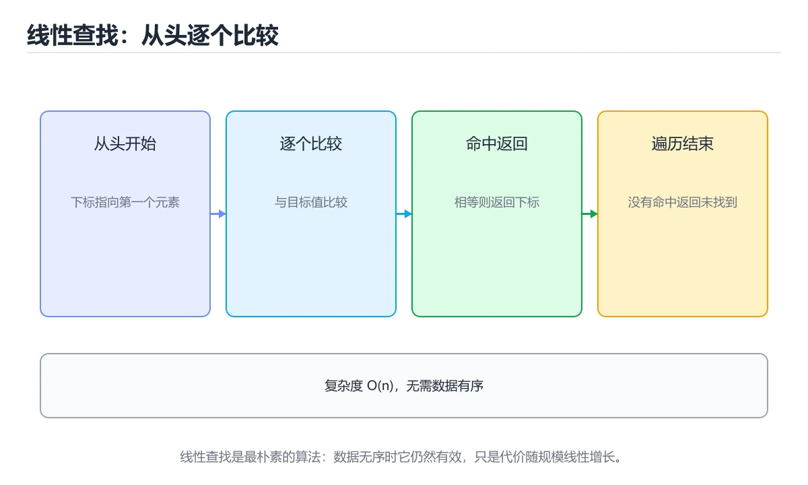

# 线性查找入门




> 内容更新时间：2026-10-03 · 学习阶段：入门 · 预计用时：15 分钟

## 学习目标

- 先认识「线性查找入门」需要的工具、输入和输出。
- 按步骤运行最小示例，并记录结果与错误。
- 用一个边界输入验证自己是否真正掌握。

## 前置知识

- 会进行基本的文件或命令行操作。
- 不需要预先掌握「算法与数据结构」的高级知识。

## 一句话入门

实现最简单的查找并分析最坏情况。

## 最小示例

```python
def linear_search(values, target):
    for index, value in enumerate(values):
        if value == target:
            return index
    return -1

print(linear_search([5, 3, 8], 8))
print(linear_search([5, 3, 8], 7))
```

## 预期输出

```text
2
-1
```

## 常见错误

- 输入或环境与示例不一致，导致结果不符合预期。
- 复制命令时遗漏空格、引号或必要参数。

## 动手练习

1. 原样运行最小示例，保存命令和输出。
2. 把数字 2 改成 10，预测并验证新结果。
3. 制造一个错误输入，写出错误信息和修复方法。

## 本课小结

- 入门阶段先保证能运行、能观察、能解释，再追求复杂功能。
- 每次只改一个变量，记录预测与实际结果。
- 遇到错误先看第一条错误信息，再回到最小示例。


## 线性查找的循环不变量

线性查找从头到尾逐个比较，直到找到目标或检查完所有元素。它的正确性可以用循环不变量描述：每轮开始时，目标一定不在已经检查过的前缀里；循环结束时，要么在当前位置找到目标，要么整个数组都已检查且目标不存在。这个不变量把“代码看起来对”变成可证明的推理，也能帮助定位边界错误，例如循环条件是 `<` 还是 `<=`、返回的是下标还是元素、重复元素要返回第一个还是任意一个。

复杂度分析要区分最好、最坏和平均情况。目标是第一个元素时只需一次比较，最好情况是 O(1)；目标不存在或位于末尾时要检查 n 个元素，最坏情况是 O(n)；在均匀随机且目标存在的假设下，平均比较次数约为 (n+1)/2，仍是 O(n)。空间复杂度是 O(1)，因为只需要保存下标和目标值。复杂度描述增长趋势，不代表小数组上一定比复杂算法慢。

查找结果通常有两种返回约定：返回下标，找不到时返回 -1；或者返回布尔值，只回答是否存在。两种接口都合理，但必须在文档和测试中写清楚。如果把 -1 当成合法下标，调用方就会读到最后一个元素，这是典型的“接口约定不清”错误。

## 边界与替代方案

空数组、单元素数组、目标在头部、目标在尾部、目标不存在、数组中存在重复目标，都是线性查找必须覆盖的边界。对重复元素，要先定义业务语义：返回第一个匹配项可用于去重或稳定选择，返回任意匹配项则可提高早期退出速度。若数据已经排序，二分查找可以把 O(n) 降到 O(log n)；若数据量大且查询频繁，哈希表或索引能以额外空间换取 O(1) 左右的平均查询。

但不要因为“有更快的算法”就跳过线性查找。数据量很小、数据经常变化、只需要一次查询或数据无法排序时，线性扫描反而更简单、缓存更友好，也更容易证明正确。工程选择要同时看数据规模、查询频率、排序成本和维护复杂度，而不是只看复杂度的渐近符号。

验证时可以写一个对照函数：对每个测试数组，分别用线性查找和内置查找计算结果，再比较下标与是否找到。随机生成数组能扩大覆盖，但边界数组必须手写。最后记录每次比较次数，用实际数据验证理论复杂度，而不是只复述结论。

## 代码实验：把示例跑成证据

这一节不引入新语法，而是把「线性查找入门」的最小示例变成可以复现、可以对照的实验。每次只改变一个条件，先写预测，再运行，最后解释差异。

### 实验一：建立基线

```python
def linear_search(values, target):
    for index, value in enumerate(values):
        if value == target:
            return index
    return -1

print(linear_search([5, 3, 8], 8))
print(linear_search([5, 3, 8], 7))
```

先原样运行上面的代码，记录命令、完整输出和退出状态。然后把输出与正文的预期输出逐字对照，不要用“看起来差不多”代替核对；空格、大小写、换行和错误流向都可能暴露环境差异。

### 实验二：只改一个输入

从代码中选一个会影响结果的字面量、参数或输入，把它替换成边界值：数值可尝试 0、1、最大值和最小值，字符串可尝试空串和超长文本，集合可尝试空集合、单元素和重复元素。先写出预测，再运行并记录实际结果。

### 实验三：制造一个可控错误

把复合语句末尾的冒号删掉，或者把字符串直接参与数值运算。先记录解释器报出的第一行错误和行号，再修复并重跑基线。

| 实验 | 改动 | 预测 | 实际 | 结论 |
| --- | --- | --- | --- | --- |
| 基线 | 保持原样 |  |  |  |
| 边界 |  |  |  |  |
| 失败 |  |  |  |  |

### 实验四：用三句话复述

1. 输入是什么，哪些输入属于合法范围，哪些属于边界或非法范围？
2. 程序按什么顺序处理输入，在哪一步产生了状态变化或副作用？
3. 输出如何验证，失败时第一条可观察证据是什么？

## 可运行练习

下面 3 个任务围绕“线性查找入门”展开，代码可以直接粘贴到 App 的离线沙箱里运行；如果示例会读取标准输入，请按代码注释在沙箱的 stdin 区域填入同样格式的数据。

### 任务 1：先跑通，再解释

```python
def linear_search(values, target):
    for index, value in enumerate(values):
        if value == target:
            return index
    return -1

print(linear_search([5, 3, 8], 8))
print(linear_search([5, 3, 8], 7))
```

**预期输出**：运行后会输出与“线性查找入门”相关的关键结果；请重点核对输出行数、最后一个数值和异常提示。

**验收标准**：代码能正常运行；逐行解释每个变量的值如何变化，并指出哪一行决定了最终结果。

### 任务 2：只改一个条件

复制上面的代码，只修改一个输入、边界或参数（例如空值、最大值、循环次数、过滤条件），先写出你的预测，再实际运行。

**验收标准**：留下“原结果 → 改动 → 预测 → 实际结果 → 差异原因”五步记录；如果预测错误，要写出修正后的心智模型。

### 任务 3：迁移到自己的数据

用同一套思路处理一组你自己的数据或场景，保持输出格式与任务 1 一致。

**验收标准**：代码不少于 10 行，至少包含 1 个边界检查；把代码和运行结果保存到笔记或片段库。


## 故障现场

这一节把“线性查找入门”最常见的失败方式还原成现场记录，练习时按“症状 → 复现 → 定位 → 修复 → 预防”的顺序排查。

### 现场 1：“线性查找入门”的 线性查找入门 常规用例通过，但边界用例失败

**症状**：在“线性查找入门”的练习或生产场景里出现““线性查找入门”的 线性查找入门 常规用例通过，但边界用例失败”。

**复现**：准备一组最小输入，只保留触发““线性查找入门”的 线性查找入门 常规用例通过，但边界用例失败”的必要条件，连续运行两次确认结果稳定。

**定位**：围绕“线性查找入门 的前置条件与取值边界没有写进代码，默认值掩盖了空值和极值”检查调用链、输入数据和环境配置，先验证假设再改代码。

**修复**：为“线性查找入门”补一条空值或极值用例，把前置条件写成断言，并让失败信息直接指出是哪个输入越界

**预防**：把““线性查找入门”的 线性查找入门 常规用例通过，但边界用例失败”写成一条自动化用例，并在“线性查找入门”的验收清单里保留对应检查项。


### 现场 2：“线性查找入门”的 算法与数据结构 结果在两次运行之间不一致

**症状**：在“线性查找入门”的练习或生产场景里出现““线性查找入门”的 算法与数据结构 结果在两次运行之间不一致”。

**复现**：准备一组最小输入，只保留触发““线性查找入门”的 算法与数据结构 结果在两次运行之间不一致”的必要条件，连续运行两次确认结果稳定。

**定位**：围绕“算法与数据结构 依赖了当前版本、执行顺序或共享状态，单次运行无法暴露差异”检查调用链、输入数据和环境配置，先验证假设再改代码。

**修复**：固定“线性查找入门”使用的版本与随机种子，记录两次运行的完整输入和输出，再逐项消除非确定性来源

**预防**：把““线性查找入门”的 算法与数据结构 结果在两次运行之间不一致”写成一条自动化用例，并在“线性查找入门”的验收清单里保留对应检查项。


### 现场 3：小数据规模结果正确，扩大输入后超时或内存溢出

**症状**：在“线性查找入门”的练习或生产场景里出现“小数据规模结果正确，扩大输入后超时或内存溢出”。

**复现**：准备一组最小输入，只保留触发“小数据规模结果正确，扩大输入后超时或内存溢出”的必要条件，连续运行两次确认结果稳定。

**定位**：围绕“线性查找入门 的时间或空间复杂度在边界条件下失控，算法与数据结构 的常数开销也被低估”检查调用链、输入数据和环境配置，先验证假设再改代码。

**修复**：为“线性查找入门”记录输入规模与运行时间的对照表，先用更小的样本验证复杂度，再优化热点循环

**预防**：把“小数据规模结果正确，扩大输入后超时或内存溢出”写成一条自动化用例，并在“线性查找入门”的验收清单里保留对应检查项。


## 考点精讲：把测验题还原成判断过程

本课有 5 个判断点。先自己作答，再看「判断依据」；如果结论正确但理由不完整，回到正文对应章节补足概念。

### 考点 1：在长度为 n 的列表中做线性查找，最坏情况需要比较多少次？

- **正确判断**：n 次，目标可能在最后一个位置或根本不存在
- **判断依据**：正确答案是「n 次，目标可能在最后一个位置或根本不存在」，本课在「线性查找的循环不变量」中说明：目标不存在或位于末尾时要检查 n 个元素，最坏情况是 O(n)。线性查找从第一个元素开始逐个比较，最坏情况下要检查完全部 n 个元素才能确认不存在，因此时间复杂度是 O(n)。本课还在「边界与替代方案」中说明：空数组、单元素数组、目标在头部、目标在尾部、目标不存在、数组中存在重复目标，都是线性查找必须覆盖的边界。
- **迁移检查**：把题干里的一个条件换成边界值，原来的结论还成立吗？写出判断过程。

### 考点 2：查找函数在目标值不存在时返回 -1，这种做法意味着？

- **正确判断**：调用方需要区分「未找到」与合法下标 0
- **判断依据**：正确答案是「调用方需要区分「未找到」与合法下标 0」，本课在「线性查找的循环不变量」中说明：如果把 -1 当成合法下标，调用方就会读到最后一个元素，这是典型的“接口约定不清”错误。下标从 0 开始，因此 -1 不会被合法位置占用，可以安全地表示「未找到」。本课还在「边界与替代方案」中说明：空数组、单元素数组、目标在头部、目标在尾部、目标不存在、数组中存在重复目标，都是线性查找必须覆盖的边界。本课还在「边界与替代方案」中说明：验证时可以写一个对照函数：对每个测试数组，分别用线性查找和内置查找计算结果，再比较下标与是否找到。
- **迁移检查**：如果给某个错误选项去掉一个限定词，它会不会变成正确？说明理由。

### 考点 3：线性查找与二分查找相比，主要优势是？

- **正确判断**：不要求数据有序，也不依赖随机访问
- **判断依据**：正确答案是「不要求数据有序，也不依赖随机访问」，本课在「边界与替代方案」中说明：但不要因为“有更快的算法”就跳过线性查找。线性查找只要求能依次访问元素，因此对无序列表、链表与流式数据都适用。本课还在「线性查找的循环不变量」中说明：线性查找从头到尾逐个比较，直到找到目标或检查完所有元素。本课还在「边界与替代方案」中说明：若数据已经排序，二分查找可以把 O(n) 降到 O(log n)。
- **迁移检查**：遮住选项，只根据定义复述一次答案，再回来看哪个选项与复述一致。

### 考点 4：示例两次调用的输出分别是什么？

- **正确判断**：先输出 2，再输出 -1，分别表示找到与未找到
- **判断依据**：正确答案是「先输出 2，再输出 -1，分别表示找到与未找到」，本课在「边界与替代方案」中说明：验证时可以写一个对照函数：对每个测试数组，分别用线性查找和内置查找计算结果，再比较下标与是否找到。第一个列表中 8 位于下标 2，函数返回 2。本课还在「线性查找的循环不变量」中说明：线性查找从头到尾逐个比较，直到找到目标或检查完所有元素。本课还在「线性查找的循环不变量」中说明：这个不变量把“代码看起来对”变成可证明的推理，也能帮助定位边界错误，例如循环条件是 < 还是 <=、返回的是下标还是元素、重复元素要返回第一个还是任意一个。
- **迁移检查**：遮住选项，只根据定义复述一次答案，再回来看哪个选项与复述一致。

### 考点 5：填空：「线性查找入门」术语速查中，表示「____：线性查找从头到尾逐个比较，直到找到目标或检查完所有元素。它的正确性可以用循环不变量描述：每轮开始时，目标一定不在已经检查过的前缀里；循环结束时，要么在当前位置找到目标，要么整个数组都已检查且目标不存在。这个不变量把“代码看起来对”变成可证明…」的术语是什么？

- **正确判断**：还是
- **判断依据**：正确答案是「还是」，本课在「线性查找的循环不变量」中说明：循环结束时，要么在当前位置找到目标，要么整个数组都已检查且目标不存在。它的正确性可以用循环不变量描述：每轮开始时，目标一定不在已经检查过的前缀里。本课还在「线性查找的循环不变量」中说明：这个不变量把“代码看起来对”变成可证明的推理，也能帮助定位边界错误，例如循环条件是 < 还是 <=、返回的是下标还是元素、重复元素要返回第一个还是任意一个。
- **迁移检查**：如果填成相近的另一个函数或关键字，程序会在哪一步出错？

### 补充考点 1：阅读「线性查找入门」的代码片段，下面哪项判断是正确的？

- **正确判断**：n 次，目标可能在最后一个位置或根本不存在
- **判断依据**：正确答案是「n 次，目标可能在最后一个位置或根本不存在」。这段代码来自「线性查找入门」的示例，判断时先看输入与输出，再检查条件、循环和边界。正确答案是「n 次，目标可能在最后一个位置或根本不存在」，本课在「线性查找的循环不变量」中说明：目标不存在或位于末尾时要检查 n 个元素，最坏情况是 O(n)。线性查找从第一个元素开始逐个比较，最坏情…在「线性查找入门」中，如果只改一个条件，输出通常会随之改变，因此不能脱离代码前提作答。

### 补充自测（1 题）

1. 围绕“线性查找入门”中的 线性查找入门、算法与数据结构、入门练习，下列哪两项是本课强调的实践判断？

这些题按“先定位概念、再排除边界错误、最后核对答案”的顺序作答；每题解析都给出了判断依据。


## 本课复习清单

离开本课前，逐项确认：

- [ ] 不看解析，能说出「在长度为 n 的列表中做线性查找，最坏情况需要比较多少次？」的判断依据。
- [ ] 不看解析，能说出「查找函数在目标值不存在时返回 -1，这种做法意味着？」的判断依据。
- [ ] 不看解析，能说出「线性查找与二分查找相比，主要优势是？」的判断依据。
- [ ] 不看解析，能说出「示例两次调用的输出分别是什么？」的判断依据。
- [ ] 不看解析，能说出「填空：「线性查找入门」术语速查中，表示「____：线性查找从头到尾逐个比较，直到…」的判断依据。
- [ ] 至少运行一次本课示例，记录输入、输出和一个边界情况。
- [ ] 把本课最容易混淆的两个概念写成一句话对照。

| 复盘项 | 记录 |
| --- | --- |
| 已经能独立解释的考点 |  |
| 仍然说不清的概念 |  |
| 下一步验证动作 |  |

## 逐节复习与自检

下面按正文顺序回顾每一节，并给出一个自检问题；说不清的地方回到原章节补课。

### 最小示例

```python
def linear_search(values, target):
    for index, value in enumerate(values):
        if value == target:
            return index
    return -1

print(linear_search([5, 3, 8], 8))
print(linear_search([5, 3, 8], 7))
```

自检：这一节与相邻主题的边界在哪里？

### 预期输出

```text
2
-1
```

自检：这一节与相邻主题的边界在哪里？

### 常见错误

输入或环境与示例不一致，导致结果不符合预期。

自检：把这一节讲给没学过的人，最需要强调哪一点？

### 动手练习

把数字 2 改成 10，预测并验证新结果。制造一个错误输入，写出错误信息和修复方法。

自检：如果去掉这一节里的一个前提，结论会怎样变化？

### 线性查找的循环不变量

线性查找从头到尾逐个比较，直到找到目标或检查完所有元素。它的正确性可以用循环不变量描述：每轮开始时，目标一定不在已经检查过的前缀里；循环结束时，要么在当前位置找到目标，要么整个数组都已检查且目标不存在。

自检：这一节最常见的失败方式是什么？第一条可观察证据是什么？

### 边界与替代方案

空数组、单元素数组、目标在头部、目标在尾部、目标不存在、数组中存在重复目标，都是线性查找必须覆盖的边界。对重复元素，要先定义业务语义：返回第一个匹配项可用于去重或稳定选择，返回任意匹配项则可提高早期退出速度。

自检：这一节与相邻主题的边界在哪里？

## 术语速查

把本课反复出现的术语集中放在一起。复习时先遮住右列，尝试用自己的话解释，再回到正文核对。

| 术语 | 本课语境 |
| --- | --- |
| `还是` | 线性查找从头到尾逐个比较，直到找到目标或检查完所有元素。它的正确性可以用循环不变量描述：每轮开始时，目标一定不在已经检查过的前缀里；循环结束时，要么在当前位置找到目标，要么整个数组都已检查且目标不存在。这个不变量把“代码… |
| `线性查找入门` | 本课围绕该主题展开，结合正文与代码示例理解它的适用边界。 |
| `算法与数据结构` | 本课围绕该主题展开，结合正文与代码示例理解它的适用边界。 |
| `入门练习` | 本课围绕该主题展开，结合正文与代码示例理解它的适用边界。 |

## 面试问答与自测

下面把本课考点换成面试追问。先口述自己的答案，
再对照参考回答检查是否遗漏了前提、边界或失败路径。

### 追问 1：在长度为 n 的列表中做线性查找，最坏情况需要比较多少次？

**参考回答**：正确答案是「n 次，目标可能在最后一个位置或根本不存在」，本课在「线性查找的循环不变量」中说明：目标不存在或位于末尾时要检查 n 个元素，最坏情况是 O(n)。线性查找从第一个元素开始逐个比较，最坏情况下要检查完全部 n 个元素才能确认不存在，因此时间复杂度是 O(n)。本课还在「边界与替代方案」中说明：空数组、单元素数组、目标在头部、目标在尾部、目标不存在、数组中存在重复目标，都是线性查找必须覆盖的边界。

### 追问 2：查找函数在目标值不存在时返回 -1，这种做法意味着？

**参考回答**：正确答案是「调用方需要区分「未找到」与合法下标 0」，本课在「线性查找的循环不变量」中说明：如果把 -1 当成合法下标，调用方就会读到最后一个元素，这是典型的“接口约定不清”错误。下标从 0 开始，因此 -1 不会被合法位置占用，可以安全地表示「未找到」。本课还在「边界与替代方案」中说明：空数组、单元素数组、目标在头部、目标在尾部、目标不存在、数组中存在重复目标，都是线性查找必须覆盖的边界。本课还在「边界与替代方案」中说明：验证时可以写一个对照函数：对每个测试数组，分别用线性查找和内置查找计算结果，再比较下标与是否找到。

### 追问 3：线性查找与二分查找相比，主要优势是？

**参考回答**：正确答案是「不要求数据有序，也不依赖随机访问」，本课在「边界与替代方案」中说明：但不要因为“有更快的算法”就跳过线性查找。线性查找只要求能依次访问元素，因此对无序列表、链表与流式数据都适用。本课还在「线性查找的循环不变量」中说明：线性查找从头到尾逐个比较，直到找到目标或检查完所有元素。本课还在「边界与替代方案」中说明：若数据已经排序，二分查找可以把 O(n) 降到 O(log n)。

### 追问 4：示例两次调用的输出分别是什么？

**参考回答**：正确答案是「先输出 2，再输出 -1，分别表示找到与未找到」，本课在「边界与替代方案」中说明：验证时可以写一个对照函数：对每个测试数组，分别用线性查找和内置查找计算结果，再比较下标与是否找到。第一个列表中 8 位于下标 2，函数返回 2。本课还在「线性查找的循环不变量」中说明：线性查找从头到尾逐个比较，直到找到目标或检查完所有元素。本课还在「线性查找的循环不变量」中说明：这个不变量把“代码看起来对”变成可证明的推理，也能帮助定位边界错误，例如循环条件是 < 还是 <=、返回的是下标还是元素、重复元素要返回第一个还是任意一个。

### 追问 5：填空：「线性查找入门」术语速查中，表示「____：线性查找从头到尾逐个比较，直到找到目标或检查完所有元素。它的正确性可以用循环不变量描述：每轮开始时，目标一定不在已经检查过的前缀里；循环结束时，要么在当前位置找到目标，要么整个数组都已检查且目标不存在。这个不变量把“代码看起来对”变成可证明…」的术语是什么？

**参考回答**：正确答案是「还是」，本课在「线性查找的循环不变量」中说明：循环结束时，要么在当前位置找到目标，要么整个数组都已检查且目标不存在。它的正确性可以用循环不变量描述：每轮开始时，目标一定不在已经检查过的前缀里。本课还在「线性查找的循环不变量」中说明：这个不变量把“代码看起来对”变成可证明的推理，也能帮助定位边界错误，例如循环条件是 < 还是 <=、返回的是下标还是元素、重复元素要返回第一个还是任意一个。

<!-- p0-depth-v2:start -->
## 零基础精讲：把「线性查找入门」真正讲透

### 先建立一个直觉

把算法看成一张可复核的路线图：输入规模决定走哪条路，每一步都要说明为什么不会漏解、为什么最终会停下来，以及代价如何增长。

本课的摘要可以当作一张地图：实现最简单的查找并分析最坏情况。

阅读时不要只记结论，先问三个问题：它解决什么问题？依赖哪些前提？在什么条件下会失效？

### 逐步拆解

1. 识别输入。先写清数据类型、取值范围、空值策略，以及输入来自用户、文件还是另一个服务。
2. 描述处理过程。把「线性查找入门、算法与数据结构、入门练习」映射到具体步骤，每步都要求能单独验证。
3. 定义输出。输出不仅包括正常结果，还包括错误码、日志、指标和资源释放状态。
4. 找出一条失败路径。让错误尽早暴露，并说明重试、降级、回滚或人工处理的边界。
5. 用一个小例子贯穿全过程。先手算或预测结果，再运行代码或实验，最后解释差异。

### 把正文串成一条执行链

- **实验一：建立基线**：先原样运行上面的代码，记录命令、完整输出和退出状态
- **实验二：只改一个输入**：从代码中选一个会影响结果的字面量、参数或输入，把它替换成边界值：数值可尝试 0、1、最大值和最小值，字符串可尝试空串和超长文本，集合可尝试空集合、单元素和重复元素
- **实验三：制造一个可控错误**：实验三：制造一个可控错误
- **实验四：用三句话复述**：1. 输入是什么，哪些输入属于合法范围，哪些属于边界或非法范围
- **考点 1：在长度为 n 的列表中做线性查找，最坏情况需要比较多少次？**：考点 1：在长度为 n 的列表中做线性查找，最坏情况需要比较多少次
- **考点 2：查找函数在目标值不存在时返回 -1，这种做法意味着？**：考点 2：查找函数在目标值不存在时返回 -1，这种做法意味着

### 从测验反推易错点

**检查点 1：在长度为 n 的列表中做线性查找，最坏情况需要比较多少次？**

- 参考判断：n 次，目标可能在最后一个位置或根本不存在
- 解析：正确答案是「n 次，目标可能在最后一个位置或根本不存在」，本课在「线性查找的循环不变量」中说明：目标不存在或位于末尾时要检查 n 个元素，最坏情况是 O(n)。线性查找从第一个元素开始逐个比较，最坏情况下要检查完全部 n 个元素才能确认不存在，因此时间复杂度是 O(n)。本课还在「边界与替代方案」中说明：空数组、单元素数组、目标在头部、目标在尾部、目标不存在、数组中存在重复目标，都是线性查找必须覆盖的边界。
- 自问：如果去掉题干里的一个限定词，结论还成立吗？

**检查点 2：查找函数在目标值不存在时返回 -1，这种做法意味着？**

- 参考判断：调用方需要区分「未找到」与合法下标 0
- 解析：正确答案是「调用方需要区分「未找到」与合法下标 0」，本课在「线性查找的循环不变量」中说明：如果把 -1 当成合法下标，调用方就会读到最后一个元素，这是典型的“接口约定不清”错误。下标从 0 开始，因此 -1 不会被合法位置占用，可以安全地表示「未找到」。本课还在「边界与替代方案」中说明：空数组、单元素数组、目标在头部、目标在尾部、目标不存在、数组中存在重复目标，都是线性查找必须覆盖的边界。本课还在「边界与替代方案」中说明：验证时可以写一个对照函数：对每个测试数组，分别用线性查找和内置查找计算结果，再比较下标与是否找到。
- 自问：如果去掉题干里的一个限定词，结论还成立吗？

**检查点 3：线性查找与二分查找相比，主要优势是？**

- 参考判断：不要求数据有序，也不依赖随机访问
- 解析：正确答案是「不要求数据有序，也不依赖随机访问」，本课在「边界与替代方案」中说明：但不要因为“有更快的算法”就跳过线性查找。线性查找只要求能依次访问元素，因此对无序列表、链表与流式数据都适用。本课还在「线性查找的循环不变量」中说明：线性查找从头到尾逐个比较，直到找到目标或检查完所有元素。本课还在「边界与替代方案」中说明：若数据已经排序，二分查找可以把 O(n) 降到 O(log n)。
- 自问：如果去掉题干里的一个限定词，结论还成立吗？

**检查点 4：示例两次调用的输出分别是什么？**

- 参考判断：先输出 2，再输出 -1，分别表示找到与未找到
- 解析：正确答案是「先输出 2，再输出 -1，分别表示找到与未找到」，本课在「边界与替代方案」中说明：验证时可以写一个对照函数：对每个测试数组，分别用线性查找和内置查找计算结果，再比较下标与是否找到。第一个列表中 8 位于下标 2，函数返回 2。本课还在「线性查找的循环不变量」中说明：线性查找从头到尾逐个比较，直到找到目标或检查完所有元素。本课还在「线性查找的循环不变量」中说明：这个不变量把“代码看起来对”变成可证明的推理，也能帮助定位边界错误，例如循环条件是 < 还是 <=、返回的是下标还是元素、重复元素要返回第一个还是任意一个。
- 自问：如果去掉题干里的一个限定词，结论还成立吗？

**检查点 5：填空：「线性查找入门」术语速查中，表示「____：线性查找从头到尾逐个比较，直到找到目标或检查完所有元素。它…**

- 参考判断：还是
- 解析：正确答案是「还是」，本课在「线性查找的循环不变量」中说明：循环结束时，要么在当前位置找到目标，要么整个数组都已检查且目标不存在。它的正确性可以用循环不变量描述：每轮开始时，目标一定不在已经检查过的前缀里。本课还在「线性查找的循环不变量」中说明：这个不变量把“代码看起来对”变成可证明的推理，也能帮助定位边界错误，例如循环条件是 < 还是 <=、返回的是下标还是元素、重复元素要返回第一个还是任意一个。
- 自问：如果去掉题干里的一个限定词，结论还成立吗？

### 工程排错顺序

| 先查什么 | 要得到的证据 | 判断标准 |
| --- | --- | --- |
| 问题规模与最坏情况是什么？ | 日志、输入样例、测试或指标 | 能复现并解释，才算定位 |
| 循环是否一定收缩并到达终止条件？ | 日志、输入样例、测试或指标 | 能复现并解释，才算定位 |
| 边界、重复元素和空输入是否覆盖？ | 日志、输入样例、测试或指标 | 能复现并解释，才算定位 |
| 时间与空间复杂度是否经过实测？ | 日志、输入样例、测试或指标 | 能复现并解释，才算定位 |

排查顺序应遵循「先复现、再缩小范围、再验证假设、最后修改」。不要同时改多个变量，否则即使问题消失，也无法知道真正原因。

### 变式训练

1. 把它放进一个只有单机、没有额外依赖的小项目，先保证正确，再考虑扩展。
2. 把输入规模扩大十倍，记录时间、内存和失败路径，找出第一个真正瓶颈。
3. 制造一次依赖超时或错误输入，要求系统给出可解释错误并且不留下半完成状态。
4. 让另一个同学只读接口说明和测试用例，复现你的结论；无法复现的部分继续补文档或测试。
5. 删掉一个看似必要的步骤，观察哪个测试或指标先失败，用证据说明它为什么必要。
6. 把方案切换到低资源设备，重新评估默认参数、超时和降级策略。

每道变式都写下：预测、实际结果、差异、下一步。没有留下证据的练习，很难迁移到真实项目。

### 本课自测

- [ ] 能用一句话解释「线性查找入门」在本课中的角色与边界。
- [ ] 能举出一个正常例子和一个失败例子。
- [ ] 能说出最小验证步骤，以及需要记录的证据。
- [ ] 能用一句话解释「算法与数据结构」在本课中的角色与边界。
- [ ] 能举出一个正常例子和一个失败例子。
- [ ] 能说出最小验证步骤，以及需要记录的证据。
- [ ] 能用一句话解释「入门练习」在本课中的角色与边界。
- [ ] 能举出一个正常例子和一个失败例子。
- [ ] 能说出最小验证步骤，以及需要记录的证据。
- [ ] 能用一句话解释「线性查找入门」在本课中的角色与边界。
- [ ] 能举出一个正常例子和一个失败例子。
- [ ] 能说出最小验证步骤，以及需要记录的证据。
- [ ] 能用一句话解释「算法与数据结构」在本课中的角色与边界。
- [ ] 能举出一个正常例子和一个失败例子。
- [ ] 能说出最小验证步骤，以及需要记录的证据。

### 迁移案例库

下面用不同约束重复同一套方法。每完成一轮，都把结论写进笔记，并只改变一个变量。

#### 迁移案例 1：围绕「线性查找入门」做一次小实验

**目标**：在不改变课程主体的前提下，验证「线性查找入门」中的一个关键判断。

**步骤**：
1. 复述当前方案对「线性查找入门」的假设，写成一句可证伪的话。
2. 设计一个正常输入和一个边界输入，分别预测输出。
3. 运行或逐步演算，记录实际输出、耗时和失败信息。
4. 只调整一个参数，比较前后差异并解释原因。
5. 补充一条测试或复习卡，确保下次能更快复现。

**验收**：结论有证据、差异可解释、失败可恢复；如果做不到，说明还需要缩小问题范围。

#### 迁移案例 2：围绕「算法与数据结构」做一次小实验

**目标**：在不改变课程主体的前提下，验证「线性查找入门」中的一个关键判断。

**步骤**：
1. 复述当前方案对「算法与数据结构」的假设，写成一句可证伪的话。
2. 设计一个正常输入和一个边界输入，分别预测输出。
3. 运行或逐步演算，记录实际输出、耗时和失败信息。
4. 只调整一个参数，比较前后差异并解释原因。
5. 补充一条测试或复习卡，确保下次能更快复现。

**验收**：结论有证据、差异可解释、失败可恢复；如果做不到，说明还需要缩小问题范围。

#### 迁移案例 3：围绕「入门练习」做一次小实验

**目标**：在不改变课程主体的前提下，验证「线性查找入门」中的一个关键判断。

**步骤**：
1. 复述当前方案对「入门练习」的假设，写成一句可证伪的话。
2. 设计一个正常输入和一个边界输入，分别预测输出。
3. 运行或逐步演算，记录实际输出、耗时和失败信息。
4. 只调整一个参数，比较前后差异并解释原因。
5. 补充一条测试或复习卡，确保下次能更快复现。

**验收**：结论有证据、差异可解释、失败可恢复；如果做不到，说明还需要缩小问题范围。

#### 迁移案例 4：围绕「线性查找入门」做一次小实验

**目标**：在不改变课程主体的前提下，验证「线性查找入门」中的一个关键判断。

**步骤**：
1. 复述当前方案对「线性查找入门」的假设，写成一句可证伪的话。
2. 设计一个正常输入和一个边界输入，分别预测输出。
3. 运行或逐步演算，记录实际输出、耗时和失败信息。
4. 只调整一个参数，比较前后差异并解释原因。
5. 补充一条测试或复习卡，确保下次能更快复现。

**验收**：结论有证据、差异可解释、失败可恢复；如果做不到，说明还需要缩小问题范围。

#### 迁移案例 5：围绕「算法与数据结构」做一次小实验

**目标**：在不改变课程主体的前提下，验证「线性查找入门」中的一个关键判断。

**步骤**：
1. 复述当前方案对「算法与数据结构」的假设，写成一句可证伪的话。
2. 设计一个正常输入和一个边界输入，分别预测输出。
3. 运行或逐步演算，记录实际输出、耗时和失败信息。
4. 只调整一个参数，比较前后差异并解释原因。
5. 补充一条测试或复习卡，确保下次能更快复现。

**验收**：结论有证据、差异可解释、失败可恢复；如果做不到，说明还需要缩小问题范围。

#### 迁移案例 6：围绕「入门练习」做一次小实验

**目标**：在不改变课程主体的前提下，验证「线性查找入门」中的一个关键判断。

**步骤**：
1. 复述当前方案对「入门练习」的假设，写成一句可证伪的话。
2. 设计一个正常输入和一个边界输入，分别预测输出。
3. 运行或逐步演算，记录实际输出、耗时和失败信息。
4. 只调整一个参数，比较前后差异并解释原因。
5. 补充一条测试或复习卡，确保下次能更快复现。

**验收**：结论有证据、差异可解释、失败可恢复；如果做不到，说明还需要缩小问题范围。

#### 迁移案例 7：围绕「线性查找入门」做一次小实验

**目标**：在不改变课程主体的前提下，验证「线性查找入门」中的一个关键判断。

**步骤**：
1. 复述当前方案对「线性查找入门」的假设，写成一句可证伪的话。
2. 设计一个正常输入和一个边界输入，分别预测输出。
3. 运行或逐步演算，记录实际输出、耗时和失败信息。
4. 只调整一个参数，比较前后差异并解释原因。
5. 补充一条测试或复习卡，确保下次能更快复现。

**验收**：结论有证据、差异可解释、失败可恢复；如果做不到，说明还需要缩小问题范围。

#### 迁移案例 8：围绕「算法与数据结构」做一次小实验

**目标**：在不改变课程主体的前提下，验证「线性查找入门」中的一个关键判断。

**步骤**：
1. 复述当前方案对「算法与数据结构」的假设，写成一句可证伪的话。
2. 设计一个正常输入和一个边界输入，分别预测输出。
3. 运行或逐步演算，记录实际输出、耗时和失败信息。
4. 只调整一个参数，比较前后差异并解释原因。
5. 补充一条测试或复习卡，确保下次能更快复现。

**验收**：结论有证据、差异可解释、失败可恢复；如果做不到，说明还需要缩小问题范围。

#### 迁移案例 9：围绕「入门练习」做一次小实验

**目标**：在不改变课程主体的前提下，验证「线性查找入门」中的一个关键判断。

**步骤**：
1. 复述当前方案对「入门练习」的假设，写成一句可证伪的话。
2. 设计一个正常输入和一个边界输入，分别预测输出。
3. 运行或逐步演算，记录实际输出、耗时和失败信息。
4. 只调整一个参数，比较前后差异并解释原因。
5. 补充一条测试或复习卡，确保下次能更快复现。

**验收**：结论有证据、差异可解释、失败可恢复；如果做不到，说明还需要缩小问题范围。

#### 迁移案例 10：围绕「线性查找入门」做一次小实验

**目标**：在不改变课程主体的前提下，验证「线性查找入门」中的一个关键判断。

**步骤**：
1. 复述当前方案对「线性查找入门」的假设，写成一句可证伪的话。
2. 设计一个正常输入和一个边界输入，分别预测输出。
3. 运行或逐步演算，记录实际输出、耗时和失败信息。
4. 只调整一个参数，比较前后差异并解释原因。
5. 补充一条测试或复习卡，确保下次能更快复现。

**验收**：结论有证据、差异可解释、失败可恢复；如果做不到，说明还需要缩小问题范围。

#### 迁移案例 11：围绕「算法与数据结构」做一次小实验

**目标**：在不改变课程主体的前提下，验证「线性查找入门」中的一个关键判断。

**步骤**：
1. 复述当前方案对「算法与数据结构」的假设，写成一句可证伪的话。
2. 设计一个正常输入和一个边界输入，分别预测输出。
3. 运行或逐步演算，记录实际输出、耗时和失败信息。
4. 只调整一个参数，比较前后差异并解释原因。
5. 补充一条测试或复习卡，确保下次能更快复现。

**验收**：结论有证据、差异可解释、失败可恢复；如果做不到，说明还需要缩小问题范围。

#### 迁移案例 12：围绕「入门练习」做一次小实验

**目标**：在不改变课程主体的前提下，验证「线性查找入门」中的一个关键判断。

**步骤**：
1. 复述当前方案对「入门练习」的假设，写成一句可证伪的话。
2. 设计一个正常输入和一个边界输入，分别预测输出。
3. 运行或逐步演算，记录实际输出、耗时和失败信息。
4. 只调整一个参数，比较前后差异并解释原因。
5. 补充一条测试或复习卡，确保下次能更快复现。

**验收**：结论有证据、差异可解释、失败可恢复；如果做不到，说明还需要缩小问题范围。

#### 迁移案例 13：围绕「线性查找入门」做一次小实验

**目标**：在不改变课程主体的前提下，验证「线性查找入门」中的一个关键判断。

**步骤**：
1. 复述当前方案对「线性查找入门」的假设，写成一句可证伪的话。
2. 设计一个正常输入和一个边界输入，分别预测输出。
3. 运行或逐步演算，记录实际输出、耗时和失败信息。
4. 只调整一个参数，比较前后差异并解释原因。
5. 补充一条测试或复习卡，确保下次能更快复现。

**验收**：结论有证据、差异可解释、失败可恢复；如果做不到，说明还需要缩小问题范围。

#### 迁移案例 14：围绕「算法与数据结构」做一次小实验

**目标**：在不改变课程主体的前提下，验证「线性查找入门」中的一个关键判断。

**步骤**：
1. 复述当前方案对「算法与数据结构」的假设，写成一句可证伪的话。
2. 设计一个正常输入和一个边界输入，分别预测输出。
3. 运行或逐步演算，记录实际输出、耗时和失败信息。
4. 只调整一个参数，比较前后差异并解释原因。
5. 补充一条测试或复习卡，确保下次能更快复现。

**验收**：结论有证据、差异可解释、失败可恢复；如果做不到，说明还需要缩小问题范围。

#### 迁移案例 15：围绕「入门练习」做一次小实验

**目标**：在不改变课程主体的前提下，验证「线性查找入门」中的一个关键判断。

**步骤**：
1. 复述当前方案对「入门练习」的假设，写成一句可证伪的话。
2. 设计一个正常输入和一个边界输入，分别预测输出。
3. 运行或逐步演算，记录实际输出、耗时和失败信息。
4. 只调整一个参数，比较前后差异并解释原因。
5. 补充一条测试或复习卡，确保下次能更快复现。

**验收**：结论有证据、差异可解释、失败可恢复；如果做不到，说明还需要缩小问题范围。

#### 迁移案例 16：围绕「线性查找入门」做一次小实验

**目标**：在不改变课程主体的前提下，验证「线性查找入门」中的一个关键判断。

**步骤**：
1. 复述当前方案对「线性查找入门」的假设，写成一句可证伪的话。
2. 设计一个正常输入和一个边界输入，分别预测输出。
3. 运行或逐步演算，记录实际输出、耗时和失败信息。
4. 只调整一个参数，比较前后差异并解释原因。
5. 补充一条测试或复习卡，确保下次能更快复现。

**验收**：结论有证据、差异可解释、失败可恢复；如果做不到，说明还需要缩小问题范围。

<!-- p0-depth-v2:end -->

## English Overview

**Title:** Linear Search Basics

**Summary:** Implement simple search and analyze worst case.

**Category:** Algorithms  
**Level:** 入门  
**Key terms:** 线性查找入门, 算法与数据结构, 入门练习

> The full tutorial is written in Chinese. This bilingual overview helps English readers identify the topic, scope and key terms before studying the detailed examples.

## 内容元数据

- 内容版本：v2.0
- 最后更新：2026-10-03
- 学习阶段：入门
- 适用环境：任意主流语言（伪代码与复杂度为主）
- 内容来源：内置结构化课程与工程实践整理
- 相关主题：线性查找入门、算法与数据结构、入门练习
- 质量版本：P0 测验标准 + P1 覆盖扩展 + P2 体验补全


## 参考资料与复核

- 最后复核：2026-10-04
- 下次复核：2027-04-04
- 复核范围：版本兼容、API 行为、安全建议与工程实践
- 来源性质：官方文档与标准；本课正文为离线教学重组，不复制原文

| 参考资料 | 本课用途 |
| --- | --- |
| [CP-Algorithms](https://cp-algorithms.com/) | 算法实现与复杂度 |
| [MIT OpenCourseWare 6.006](https://ocw.mit.edu/courses/6-006-introduction-to-algorithms-spring-2020/) | 算法设计与分析 |

> 本课主题：实现最简单的查找并分析最坏情况。

> App 完全离线展示文字链接，不会自动联网；需要延伸阅读时可复制链接到浏览器。
