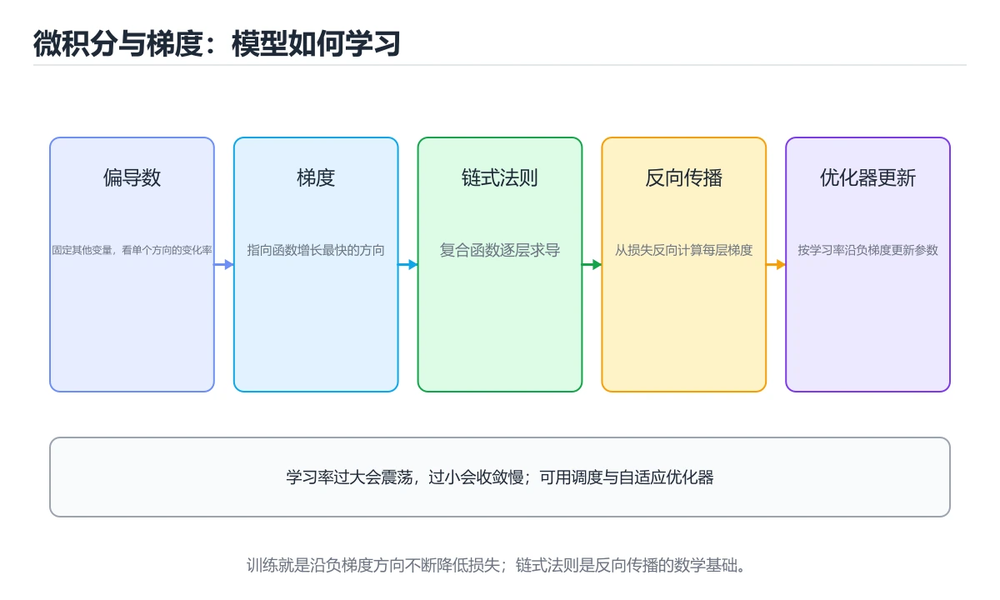
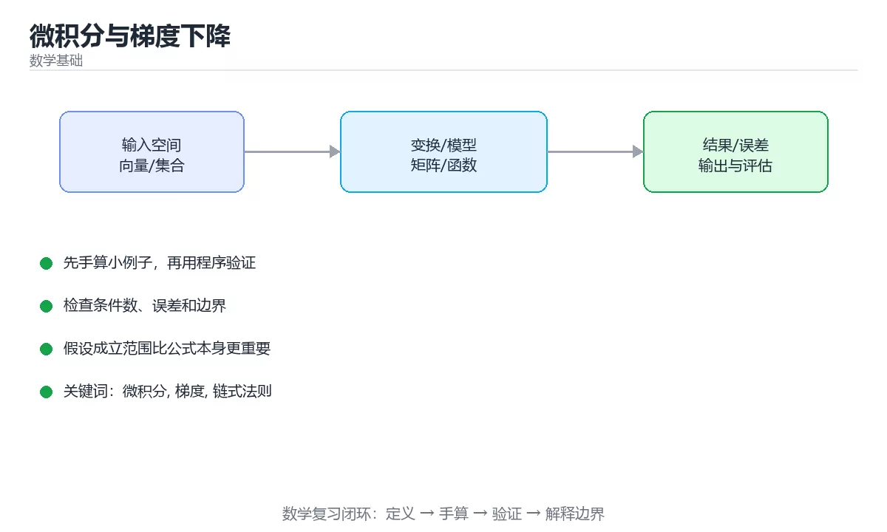

# 微积分与梯度下降





> 内容更新时间：2026-10-06 · 学习阶段：基础 · 预计用时：40 分钟

## 本节知识框架

**课程定位**：所属分类 `math`（数学基础），课程主题 `微积分与梯度下降`，学习阶段 基础，建议用时 40 分钟。

本课主线：偏导与梯度、链式法则与反向传播、优化器与学习率。

**学完本课应当能够**
- 说清 `微积分` 与 `梯度` 的含义与区别，并各举一个正例和一个反例。
- 用本课示例验证 `链式法则` 的行为，记录输入、输出与失败条件。
- 遇到「损失震荡或发散」这类问题时，能说出触发条件与修复顺序。

### 从概念到验证的学习链条

1. `微积分`：先掌握 研究变化率、累积量和极限的数学分支，再用它解释 `梯度` 为什么会出现。
2. `梯度`：先掌握 梯度是所有偏导组成的向量，指向函数上升最快的方向，因此负梯度就是下降最快的方向，再用它解释 `链式法则` 为什么会出现。
3. `链式法则`：先掌握 复合函数求导用链式法则：dy/dx = dy/du · du/dx，再用它解释 `反向传播` 为什么会出现。
4. `反向传播`：先掌握 从损失出发按链式法则反向计算各层参数梯度的训练算法，再用它解释 `学习率` 为什么会出现。
5. `学习率`：先掌握 训练时每次按梯度更新参数的步长，过大会震荡，过小会收敛缓慢，再用它解释 本课示例的观察结果 为什么会出现。

**先修与衔接**：本课是「数学基础」分类的第 4 课。先修内容：《特征值、SVD 与降维》。《特征值、SVD 与降维》里的 `条件数`、`特征值` 是本课的前提。相关或后续课程：《概率统计与假设检验》。

### 完成判据

- **定义关**：不看正文也能说明 `微积分` 是 研究变化率、累积量和极限的数学分支，并指出一个反例。
- **机制关**：能按“输入 → 转换 → 输出 → 验证”复述 `微积分与梯度下降`，而不是只背结论。
- **示例关**：能运行或推演 `微积分与梯度下降` 的 `python` 示例，并说明一个真实出现的标识符或字面量。
- **证据关**：能指出 `微积分与梯度下降` 示例里的 调用了 `numerical_gradient()`，并说明它支持或反驳了本课的哪一条结论。
- **排错关**：能复现 损失震荡或发散，记录现象并按 降低学习率或加 warmup 修复。
- **迁移关**：能把 `微积分`、`梯度`、`链式法则`、`反向传播` 放进一个与 `微积分与梯度下降` 不同的项目场景，并保持输入与验证条件可追踪。
- **复盘关**：学完 `微积分与梯度下降` 后，用一句话写下仍然不确定的结论，并列出下一次验证需要的输入、环境和成功判据。

### 复习清单

- [ ] 能不看正文复述本课核心术语，并指出一个边界或反例。
- [ ] 能运行或推演本课示例，记录输入、输出与失败现象。
- [ ] 能完成一次自测，并把错题对照错误表定位原因。

## 核心概念定义

| 术语 | 操作性定义 | 常见边界与风险 |
| --- | --- | --- |
| 微积分 | 研究变化率、累积量和极限的数学分支。 | 只在「研究变化率、累积量和极限的数学分支」这一前提下成立，换输入或换环境要重新验证。 |
| 梯度 | 梯度是所有偏导组成的向量，指向函数上升最快的方向，因此负梯度就是下降最快的方向。 | 易错：深网络或长序列；正确做法是梯度裁剪、归一化。 |
| 链式法则 | 复合函数求导用链式法则：dy/dx = dy/du · du/dx。 | 只在「复合函数求导用链式法则：dy/dx = dy/du · du/dx」这一前提下成立，换输入或换环境要重新验证。 |
| 反向传播 | 从损失出发按链式法则反向计算各层参数梯度的训练算法。 | 易错：反向传播实现有错却不自知；正确做法是用数值梯度对比解析梯度。 |
| 学习率 | 训练时每次按梯度更新参数的步长，过大会震荡，过小会收敛缓慢 | 易错：学习率过大；正确做法是降低学习率或加 warmup。 |

## 原理与运行机制

### 机制总览

**教材衔接：导数与偏导**

导数描述函数在一点的变化率（切线斜率）；多元函数对某个变量求偏导时把其他变量视为常数。**梯度**是所有偏导组成的向量，指向函数上升最快的方向，因此负梯度就是下降最快的方向。

**教材衔接：链式法则与反向传播**

复合函数求导用链式法则：`dy/dx = dy/du · du/dx`。神经网络是多层复合函数，反向传播就是链式法则在计算图上的系统应用：从损失出发逐层向前求导，复用中间结果，把复杂度从指数级降到线性。

**教材衔接：梯度下降家族**

| 方法 | 特点 |
| --- | --- |
| 批量梯度下降 | 用全部样本算梯度，稳定但慢 |
| 随机梯度下降 SGD | 单样本更新，快但震荡 |
| 小批量 | 实际常用，兼顾速度与稳定 |
| Momentum | 累积动量，越过平缓区与局部震荡 |
| RMSProp / Adam | 自适应学习率，Adam 是默认首选 |

学习率是**最重要的超参数**：过大会发散（损失变 NaN），过小收敛慢。

**教材衔接：为什么工程上关心这些**

调参、诊断不收敛、理解正则化（L2 是给损失加权重平方惩罚）都依赖这套语言；即使只调 API，看懂 loss 曲线与学习率策略也能显著提高成功率。

**教材衔接：梯度下降手算与损失函数导数**

**一步更新**：设损失 f(w) = w²，梯度 f'(w) = 2w，学习率 η = 0.1，初始 w = 1。

| 轮次 | w | 梯度 2w | 更新后 w |
| --- | --- | --- | --- |
| 第 1 轮 | 1.0 | 2.0 | 1.0 − 0.1×2.0 = 0.8 |
| 第 2 轮 | 0.8 | 1.6 | 0.8 − 0.16 = 0.64 |
| 第 3 轮 | 0.64 | 1.28 | 0.512 |

可看出越接近最优点步长越小（梯度变小），自然收敛。若 η = 1.1，则 w 会来回震荡并逐渐发散——这就是学习率过大的直观表现。

**常见损失的导数**（都只需记住形式，框架会自动求导）：

| 损失 | 用途 | 对预测值的导数 |
| --- | --- | --- |
| 均方误差 MSE | 回归 | 2(ŷ − y)/n |
| 交叉熵 | 分类 | ŷ − y（配合 softmax 时非常简洁） |
| 绝对值误差 MAE | 抗离群点的回归 | sign(ŷ − y) |

**工程对应**：优化器看到的正是这些梯度，所以损失函数选错会导致梯度行为异常（例如分类用 MSE 会梯度消失）。调试时打印前若干步的 loss 与梯度范数，比盲目调参更快定位问题。

**教材衔接：导数与梯度速查**

| 概念 | 含义 | 用途 |
| --- | --- | --- |
| 导数 | 函数变化率 | 一维优化 |
| 偏导数 | 对单个变量求导 | 多元函数 |
| 梯度 | 偏导组成的向量 | 上升最快方向 |
| 方向导数 | 某方向的变化率 | 最速下降方向为负梯度 |
| 二阶导 / Hessian | 曲率信息 | 判断极值与收敛速度 |
| 链式法则 | 复合函数求导 | 反向传播基础 |
| 雅可比矩阵 | 向量值函数的一阶导 | 向量反向传播 |

更新规则：`θ ← θ - η ∇L(θ)`，其中 η 是学习率。

**教材衔接：学习率与收敛速查**

| 现象 | 可能原因 | 处理 |
| --- | --- | --- |
| 损失震荡或发散 | 学习率过大 | 降低学习率或加 warmup |
| 收敛极慢 | 学习率过小 | 提高学习率或换自适应优化器 |
| 后期来回跳 | 没有衰减 | 加余弦或阶梯衰减 |
| 训练初期不稳 | 初始更新过大 | 加 warmup |
| 梯度爆炸 | 深网络或长序列 | 梯度裁剪、归一化 |
| 梯度消失 | 深层链式乘积衰减 | 残差连接、合理初始化 |
| 过拟合 | 训练损失持续降但验证升 | 正则、早停、加数据 |

**教材衔接：深入补充：微积分与梯度下降 的取舍与边界**

### 一、把概念放回真实约束

| 概念 | 直觉解释 | 公式或定义 | 工程用途 |
| --- | --- | --- | --- |
| 微积分 | 用可计算的方式描述变化 | 见正文公式 | 建模与估算 |
| 梯度 | 描述不确定性或约束 | 见正文推导 | 校验与决策 |
| 近似 | 用可控误差换速度 | 误差上界 | 大规模计算 |


### 机制拆解：每一步的输入、动作与输出

#### 1. `微积分`
- 输入：`微积分`；本步把 研究变化率、累积量和极限的数学分支 当作判断规则。
- 动作：围绕 `微积分` 保留中间状态，并记录它与 `梯度` 的对应关系。
- 输出：`梯度`，它可以被下一段代码、测试或记录继续使用。
- `微积分` 的失败条件：只在「研究变化率、累积量和极限的数学分支」这一前提下成立，换输入或换环境要重新验证。

#### 2. `梯度`
- 输入：`微积分`；本步把 梯度是所有偏导组成的向量，指向函数上升最快的方向，因此负梯度就是下降最快的方向 当作判断规则。
- 动作：围绕 `梯度` 保留中间状态，并记录它与 `链式法则` 的对应关系。
- 输出：`链式法则`，它可以被下一段代码、测试或记录继续使用。
- `梯度` 的失败条件：当梯度爆炸时，会出现深网络或长序列。

#### 3. `链式法则`
- 输入：`梯度`；本步把 复合函数求导用链式法则：dy/dx = dy/du · du/dx 当作判断规则。
- 动作：围绕 `链式法则` 保留中间状态，并记录它与 `反向传播` 的对应关系。
- 输出：`反向传播`，它可以被下一段代码、测试或记录继续使用。
- `链式法则` 的失败条件：只在「复合函数求导用链式法则：dy/dx = dy/du · du/dx」这一前提下成立，换输入或换环境要重新验证。

#### 4. `反向传播`
- 输入：`链式法则`；本步把 从损失出发按链式法则反向计算各层参数梯度的训练算法 当作判断规则。
- 动作：围绕 `反向传播` 保留中间状态，并记录它与 `学习率` 的对应关系。
- 输出：`学习率`，它可以被下一段代码、测试或记录继续使用。
- `反向传播` 的失败条件：当不做梯度校验时，会出现反向传播实现有错却不自知。

#### 5. `学习率`
- 输入：`反向传播`；本步把 训练时每次按梯度更新参数的步长，过大会震荡，过小会收敛缓慢 当作判断规则。
- 动作：围绕 `学习率` 保留中间状态，并记录它与 `numerical_gradient` 的对应关系。
- 输出：`numerical_gradient`，它可以被下一段代码、测试或记录继续使用。
- `学习率` 的失败条件：当损失震荡或发散时，会出现学习率过大。

### 示例中的可观察事实

1. 调用了 `numerical_gradient()`；它对应的课程主题是 `微积分与梯度下降`。
2. 调用了 `range()`；它对应的课程主题是 `微积分与梯度下降`。
3. 调用了 `len()`；它对应的课程主题是 `微积分与梯度下降`。
4. 调用了 `list()`；它对应的课程主题是 `微积分与梯度下降`。
5. 调用了 `append()`；它对应的课程主题是 `微积分与梯度下降`。
6. 调用了 `round()`；它对应的课程主题是 `微积分与梯度下降`。
7. 调用了 `gradient_descent()`；它对应的课程主题是 `微积分与梯度下降`。
8. 调用了 `grad_f()`；它对应的课程主题是 `微积分与梯度下降`。

### 复现实验记录

- 环境：`微积分与梯度下降` 使用 `python` 示例，固定 `微积分`、`梯度`、`链式法则`、`反向传播` 作为第一组条件。
- 首轮输入：先确认 调用了 `numerical_gradient()`，预测 `微积分` 会怎样变化。
- 基线观察：记录命令、输入、输出和错误原文，不用截图代替可复制的文本。
- 单变量修改：只改变 `微积分`，观察 `学习率` 是否仍满足定义。
- 失败注入：复现 损失震荡或发散，确认现象是 学习率过大。
- 记录结论：把“修改前、修改后、预期变化、实际变化”写成四列表，这样复盘 `微积分与梯度下降` 时才能区分概念错误与实现错误。

## 典型应用场景

- **损失震荡或发散**：典型现象是学习率过大；正确做法是降低学习率或加 warmup。
- **收敛极慢**：典型现象是学习率过小；正确做法是提高学习率或换自适应优化器。
- **后期来回跳**：典型现象是没有衰减；正确做法是加余弦或阶梯衰减。
- **训练初期不稳**：典型现象是初始更新过大；正确做法是加 warmup。

### 最小验证场景

- 准备：保留 `python` 示例的原始输入，先记录 `微积分与梯度下降` 的基线输出和完整运行命令。
- 观察：先核对 调用了 `numerical_gradient()`，再改变一个与 `微积分` 相关的条件。
- 判定：新结果与 `微积分与梯度下降` 的基线不同不等于错误；只有当差异破坏了 `微积分` 的定义或错误表中的约束，才判定为失败。

### 选择与边界

- 使用 `微积分` 时，先满足它的定义：研究变化率、累积量和极限的数学分支；只在「研究变化率、累积量和极限的数学分支」这一前提下成立，换输入或换环境要重新验证。
- 使用 `梯度` 时，先满足它的定义：梯度是所有偏导组成的向量，指向函数上升最快的方向，因此负梯度就是下降最快的方向；易错：深网络或长序列；正确做法是梯度裁剪、归一化。
- 使用 `链式法则` 时，先满足它的定义：复合函数求导用链式法则：dy/dx = dy/du · du/dx；只在「复合函数求导用链式法则：dy/dx = dy/du · du/dx」这一前提下成立，换输入或换环境要重新验证。
- 使用 `反向传播` 时，先满足它的定义：从损失出发按链式法则反向计算各层参数梯度的训练算法；易错：反向传播实现有错却不自知；正确做法是用数值梯度对比解析梯度。
- 使用 `学习率` 时，先满足它的定义：训练时每次按梯度更新参数的步长，过大会震荡，过小会收敛缓慢；易错：学习率过大；正确做法是降低学习率或加 warmup。

## 代码/协议/SQL 示例

**教材衔接：优化器速查**

| 优化器 | 核心思想 | 特点 |
| --- | --- | --- |
| 批量梯度下降 | 用全部样本算梯度 | 稳定但慢 |
| 随机梯度下降 | 单样本更新 | 抖动大、可能逃离局部极小 |
| 小批量 SGD | 折中方案 | 实践默认 |
| Momentum | 累积历史梯度 | 加速并抑制震荡 |
| RMSProp | 梯度平方的滑动平均 | 自适应步长 |
| Adam | 一阶与二阶矩估计 | 收敛快、常用 |
| AdamW | 解耦权重衰减 | 大模型训练常用 |

```python
import math
from typing import Callable

def numerical_gradient(f: Callable, point: list, eps: float = 1e-6) -> list:
    """数值梯度：用小扰动近似偏导，用于校验解析梯度。"""
    grad = []
    for index in range(len(point)):
        forward, backward = list(point), list(point)
        forward[index] += eps
        backward[index] -= eps
        grad.append((f(forward) - f(backward)) / (2 * eps))
    return [round(value, 6) for value in grad]

def gradient_descent(f, grad_f, start: list, lr: float = 0.1, steps: int = 100):
    """梯度下降：记录损失曲线并返回最优点。"""
    point = list(start)
    history = []
    for _ in range(steps):
        gradient = grad_f(point)
        point = [p - lr * g for p, g in zip(point, gradient)]
        history.append(round(f(point), 8))
    return point, history

def sgd_momentum(grad_f, start: list, lr: float = 0.1, momentum: float = 0.9, steps: int = 50):
    """带动量的小批量更新：累积历史梯度减少震荡。"""
    point, velocity = list(start), [0.0] * len(start)
    for _ in range(steps):
        gradient = grad_f(point)
        velocity = [momentum * v - lr * g for v, g in zip(velocity, gradient)]
        point = [p + v for p, v in zip(point, velocity)]
    return [round(value, 6) for value in point]

def adam_step(param, grad, m, v, t, lr=0.001, beta1=0.9, beta2=0.999, eps=1e-8):
    """Adam 单步更新：含偏差校正。"""
    m = beta1 * m + (1 - beta1) * grad
    v = beta2 * v + (1 - beta2) * grad * grad
    m_hat = m / (1 - beta1 ** t)
    v_hat = v / (1 - beta2 ** t)
    return param - lr * m_hat / (math.sqrt(v_hat) + eps), m, v

f = lambda p: (p[0] - 3) ** 2 + (p[1] + 1) ** 2
grad_f = lambda p: [2 * (p[0] - 3), 2 * (p[1] + 1)]
print(numerical_gradient(f, [0.0, 0.0]))
point, history = gradient_descent(f, grad_f, [0.0, 0.0])
print([round(v, 4) for v in point], history[0], history[-1])
```

**教材衔接：反向传播的链式展开示例**

以两层网络为例（输入 x → 隐藏层 h = ReLU(W₁x) → 输出 ŷ = W₂h → 损失 L = (ŷ−y)²）：

| 步骤 | 计算 | 复用价值 |
| --- | --- | --- |
| 前向 | 依次算出 h、ŷ、L 并保存中间结果 | 中间结果供反向复用 |
| 输出层梯度 | ∂L/∂ŷ = 2(ŷ−y) | 直接得到 |
| 第二层权重梯度 | ∂L/∂W₂ = ∂L/∂ŷ · hᵀ | 一次矩阵乘 |
| 传到隐藏层 | ∂L/∂h = W₂ᵀ · ∂L/∂ŷ | 复用上一层结果 |
| 第一层权重梯度 | ∂L/∂W₁ = (∂L/∂h ⊙ ReLU′) · xᵀ | 逐层往前 |

关键洞察：**每一层的梯度都由"后一层的梯度 × 本层的局部导数"得到**，因此一次前向 + 一次反向即可算出所有参数的梯度，复杂度与参数数量成正比——这就是深度网络能训练的根本原因。

**学习率调度实战**：预热（前 5% 步数从 0 线性升到目标值，避免初期震荡）→ 余弦退火（后期平滑降到接近 0，帮助收敛）是当前主流组合；若损失在后期震荡不降，先降学习率再考虑换优化器。

**运行方式**：运行 `微积分与梯度下降` 的示例时，保存为 `.py` 文件后用 `python 文件名.py` 运行；第三方依赖先在虚拟环境里安装。

### 示例精读：先找证据，再改一个条件

1. 调用了 `numerical_gradient()`；它出现在 `微积分与梯度下降` 的示例中，阅读时先确认它前后各发生了什么。
2. 调用了 `range()`；它出现在 `微积分与梯度下降` 的示例中，阅读时先确认它前后各发生了什么。
3. 调用了 `len()`；它出现在 `微积分与梯度下降` 的示例中，阅读时先确认它前后各发生了什么。
4. 调用了 `list()`；它出现在 `微积分与梯度下降` 的示例中，阅读时先确认它前后各发生了什么。
5. 调用了 `append()`；它出现在 `微积分与梯度下降` 的示例中，阅读时先确认它前后各发生了什么。
6. 调用了 `round()`；它出现在 `微积分与梯度下降` 的示例中，阅读时先确认它前后各发生了什么。
7. 调用了 `gradient_descent()`；它出现在 `微积分与梯度下降` 的示例中，阅读时先确认它前后各发生了什么。
8. 调用了 `grad_f()`；它出现在 `微积分与梯度下降` 的示例中，阅读时先确认它前后各发生了什么。
- 在 `微积分与梯度下降` 中与 `微积分` 对照：示例必须能支持 研究变化率、累积量和极限的数学分支，否则说明这一段还缺少实现或验证步骤。
- 在 `微积分与梯度下降` 中与 `梯度` 对照：示例必须能支持 梯度是所有偏导组成的向量，指向函数上升最快的方向，因此负梯度就是下降最快的方向，否则说明这一段还缺少实现或验证步骤。
- 在 `微积分与梯度下降` 中与 `链式法则` 对照：示例必须能支持 复合函数求导用链式法则：dy/dx = dy/du · du/dx，否则说明这一段还缺少实现或验证步骤。
- 在 `微积分与梯度下降` 中与 `反向传播` 对照：示例必须能支持 从损失出发按链式法则反向计算各层参数梯度的训练算法，否则说明这一段还缺少实现或验证步骤。

## 时间/空间复杂度或性能分析

**性能关注点（微积分与梯度下降）**：计算规模决定可行性：记录时间复杂度与数值误差，注意浮点累积误差。

**测量方法**：以 `微积分与梯度下降` 的 `微积分` 场景为对象，固定输入跑一遍记录基线，再把规模或并发度提高一个数量级复测；两次结果的差值与波动范围才是结论依据。

### 需要控制的变量与记录项

- `微积分与梯度下降` 的 `微积分`：固定它的版本、输入范围和资源上限，分别记录速度、内存与失败率的变化。
- `微积分与梯度下降` 的 `梯度`：固定它的版本、输入范围和资源上限，分别记录速度、内存与失败率的变化。
- `微积分与梯度下降` 的 `链式法则`：固定它的版本、输入范围和资源上限，分别记录速度、内存与失败率的变化。
- `微积分与梯度下降` 的 `反向传播`：固定它的版本、输入范围和资源上限，分别记录速度、内存与失败率的变化。
- `微积分与梯度下降` 的 `Adam`：固定它的版本、输入范围和资源上限，分别记录速度、内存与失败率的变化。
- `微积分与梯度下降` 中 `微积分` 的边界：只在「研究变化率、累积量和极限的数学分支」这一前提下成立，换输入或换环境要重新验证。达到边界时不要外推，必须重新测量。
- `微积分与梯度下降` 中 `梯度` 的边界：易错：深网络或长序列；正确做法是梯度裁剪、归一化。达到边界时不要外推，必须重新测量。
- `微积分与梯度下降` 中 `链式法则` 的边界：只在「复合函数求导用链式法则：dy/dx = dy/du · du/dx」这一前提下成立，换输入或换环境要重新验证。达到边界时不要外推，必须重新测量。
- `微积分与梯度下降` 中 `反向传播` 的边界：易错：反向传播实现有错却不自知；正确做法是用数值梯度对比解析梯度。达到边界时不要外推，必须重新测量。
- `微积分与梯度下降` 中 `学习率` 的边界：易错：学习率过大；正确做法是降低学习率或加 warmup。达到边界时不要外推，必须重新测量。
- `微积分与梯度下降` 的代码证据：先验证 调用了 `numerical_gradient()`，再记录该路径的输入规模与耗时；只看代码行数不能推出复杂度。

## 常见误区与易错点

| 容易写错的做法 | 实际现象 | 原因与正确做法 |
| --- | --- | --- |
| 损失震荡或发散 | 学习率过大 | 降低学习率或加 warmup |
| 收敛极慢 | 学习率过小 | 提高学习率或换自适应优化器 |
| 后期来回跳 | 没有衰减 | 加余弦或阶梯衰减 |
| 训练初期不稳 | 初始更新过大 | 加 warmup |
| 梯度爆炸 | 深网络或长序列 | 梯度裁剪、归一化 |
| 梯度消失 | 深层链式乘积衰减 | 残差连接、合理初始化 |
| 过拟合 | 训练损失持续降但验证升 | 正则、早停、加数据 |
| 用梯度方向做上升 | 损失越来越大。 | 更新用负梯度。 |
| 学习率一次调很大 | 损失 NaN。 | 从小值开始并观察曲线。 |
| 不做梯度校验 | 反向传播实现有错却不自知。 | 用数值梯度对比解析梯度。 |

### 现场 1：损失震荡或发散

**症状**：学习率过大。

**根因与修复**：降低学习率或加 warmup。

**自检**：在本课示例里复现「损失震荡或发散」，改成降低学习率或加 warmup后重跑；如果症状消失且失败路径按预期变化，说明定位正确。

### 现场 2：收敛极慢

**症状**：学习率过小。

**根因与修复**：提高学习率或换自适应优化器。

**自检**：在本课示例里复现「收敛极慢」，改成提高学习率或换自适应优化器后重跑；如果症状消失且失败路径按预期变化，说明定位正确。

### 现场 3：后期来回跳

**症状**：没有衰减。

**根因与修复**：加余弦或阶梯衰减。

**自检**：在本课示例里复现「后期来回跳」，改成加余弦或阶梯衰减后重跑；如果症状消失且失败路径按预期变化，说明定位正确。

### 现场 4：训练初期不稳

**症状**：初始更新过大。

**根因与修复**：加 warmup。

**自检**：在本课示例里复现「训练初期不稳」，改成加 warmup后重跑；如果症状消失且失败路径按预期变化，说明定位正确。

### 现场 5：梯度爆炸

**症状**：深网络或长序列。

**根因与修复**：梯度裁剪、归一化。

**自检**：在本课示例里复现「梯度爆炸」，改成梯度裁剪、归一化后重跑；如果症状消失且失败路径按预期变化，说明定位正确。

### 现场 6：梯度消失

**症状**：深层链式乘积衰减。

**根因与修复**：残差连接、合理初始化。

**自检**：在本课示例里复现「梯度消失」，改成残差连接、合理初始化后重跑；如果症状消失且失败路径按预期变化，说明定位正确。

### 现场 7：过拟合

**症状**：训练损失持续降但验证升。

**根因与修复**：正则、早停、加数据。

**自检**：在本课示例里复现「过拟合」，改成正则、早停、加数据后重跑；如果症状消失且失败路径按预期变化，说明定位正确。

### 现场 8：用梯度方向做上升

**症状**：损失越来越大。

**根因与修复**：更新用负梯度。

**自检**：在本课示例里复现「用梯度方向做上升」，改成更新用负梯度后重跑；如果症状消失且失败路径按预期变化，说明定位正确。

### 现场 9：学习率一次调很大

**症状**：损失 NaN。

**根因与修复**：从小值开始并观察曲线。

**自检**：在本课示例里复现「学习率一次调很大」，改成从小值开始并观察曲线后重跑；如果症状消失且失败路径按预期变化，说明定位正确。

## 与其他知识点的关系

- **先修**：`特征值、SVD 与降维`。本课默认这些内容已经掌握。
- **相关或后续**：`概率统计与假设检验`。本课术语会在这些课程里继续使用。
- **术语归属**：`微积分`、`梯度`、`链式法则` 的定义以本课「核心概念定义」为准，换到其他课程时先确认定义是否被改写。

### 先修与后续术语接口

- `特征值、SVD 与降维`：两者通过本分类的学习顺序衔接，阅读时重点比较各自的输入与失败条件。
- `概率统计与假设检验`：两者通过本分类的学习顺序衔接，阅读时重点比较各自的输入与失败条件。

### 容易混淆的相邻概念

- `微积分` 与 `梯度`：前者强调 研究变化率、累积量和极限的数学分支；后者强调 梯度是所有偏导组成的向量，指向函数上升最快的方向，因此负梯度就是下降最快的方向。判断时分别检查两条定义的适用范围，不要只看名称相似就互换。
- `梯度` 与 `链式法则`：前者强调 梯度是所有偏导组成的向量，指向函数上升最快的方向，因此负梯度就是下降最快的方向；后者强调 复合函数求导用链式法则：dy/dx = dy/du · du/dx。判断时分别检查两条定义的适用范围，不要只看名称相似就互换。
- `链式法则` 与 `反向传播`：前者强调 复合函数求导用链式法则：dy/dx = dy/du · du/dx；后者强调 从损失出发按链式法则反向计算各层参数梯度的训练算法。判断时分别检查两条定义的适用范围，不要只看名称相似就互换。
- `反向传播` 与 `学习率`：前者强调 从损失出发按链式法则反向计算各层参数梯度的训练算法；后者强调 训练时每次按梯度更新参数的步长，过大会震荡，过小会收敛缓慢。判断时分别检查两条定义的适用范围，不要只看名称相似就互换。

## 自测题与参考答案

> 先独立作答，再对照参考答案；答案都能在本课正文、术语表或错误表里找到依据。

### 自测 1（概念复述）

不看正文，写出 `微积分` 的操作性定义，并说明它与 `梯度` 的区别。

**参考答案**：研究变化率、累积量和极限的数学分支。

`梯度` 的定位是：梯度是所有偏导组成的向量，指向函数上升最快的方向，因此负梯度就是下降最快的方向；两者的差别要从适用对象与失败模式上说明。

### 自测 2（排错）

本课错误表记录了「损失震荡或发散」这类做法。请写出它会出现的现象、根因，以及修复顺序。

**参考答案**：现象是学习率过大；正确做法是降低学习率或加 warmup。修复时先复现现象并保留证据，再改动一处假设重跑，确认现象消失。

### 自测 3（动手验证）

运行本课的 `python` 示例，把其中的 `"数值梯度：用小扰动近似偏导，用于校验解析梯度。"` 换成一个边界值后重新运行，记录输出与错误信息。

**参考答案**：正常输入下 `python` 示例应当复现正文给出的结果；把 `"数值梯度：用小扰动近似偏导，用于校验解析梯度。"` 换成边界值后，如果结果改变或报错，先核对它是否满足 `微积分与梯度下降` 中`微积分` 的适用范围，再检查错误表里是否有同类现象。

### 自测 4（代码阅读）

阅读本课开头的 `python` 示例，说明它体现了`微积分` 的哪一条性质，并指出改动哪个输入会让这条性质不再成立。

**参考答案**：`微积分` 的定义是 研究变化率、累积量和极限的数学分支，示例正是在实现这条定义。改动与 `微积分` 有关的一个输入后，如果结果不再符合 `微积分与梯度下降` 的正文描述，就说明该性质只在当前前提成立。

### 自测 5（迁移）

把 `微积分与梯度下降` 的方法迁移到自己的项目：围绕 `微积分` 写出一个与错误表同类的风险点，并说明触发条件和检验方式。

**参考答案**：例如「不做梯度校验」，它会导致反向传播实现有错却不自知；检验方式是按用数值梯度对比解析梯度改一处再复现，确认现象消失且没有引入新的失败分支。

### 自测 6（对比）

用一个表格对比 `微积分` 与 `梯度`：各写一行适用场景、一行失败表现。

**参考答案**：`微积分` 的定义是研究变化率、累积量和极限的数学分支；`梯度` 的定义是梯度是所有偏导组成的向量，指向函数上升最快的方向，因此负梯度就是下降最快的方向。两者的失败表现分别对应本课错误表里与本术语相关的行。

### 自测 7（排错顺序）

面对「损失震荡或发散」引发的问题，请把“复现 学习率过大 → 保留证据 → 降低学习率或加 warmup → 回归验证”四步写成可执行的检查清单。

**参考答案**：第一步按学习率过大复现；第二步记录输入、版本与完整报错；第三步按降低学习率或加 warmup只改一处；第四步重跑并确认失败路径也按预期变化。

### 自测 8（边界判断）

针对 `学习率`，分别写出“可以使用”的条件和“结论不再成立”的条件。

**参考答案**：易错：学习率过大；正确做法是降低学习率或加 warmup。 同时要把 `学习率` 的定义 训练时每次按梯度更新参数的步长，过大会震荡，过小会收敛缓慢 与实际输入逐项对照。

### 自测 9（机制重建）

不看正文，按输入、转换、输出、验证四段重建 `微积分` → `梯度` → `链式法则` → `反向传播` 的作用链。

**参考答案**：起点是 `微积分` 的定义 研究变化率、累积量和极限的数学分支；中间每一步都保留可观察状态；终点由 `学习率` 检查，失败时回到错误表定位第一个偏离定义的步骤。

### 自测 10（综合排错）

在 `微积分与梯度下降` 中，现象是 反向传播实现有错却不自知。请围绕 不做梯度校验 写出最小复现、关键证据、修复动作和回归验证，并说明为什么不能只凭一次运行下结论。

**参考答案**：先复现 不做梯度校验，记录输入与完整错误；再按 用数值梯度对比解析梯度 只改一处。回归时同时跑正常路径和边界路径，只有两次结果都可解释，才把修复视为完成。

### 自测 11（一分钟复述）

用每分钟约 200 字的速度复述 `微积分与梯度下降`：先给主问题，再按顺序说出 `微积分`、`梯度`、`链式法则`、`反向传播`，最后给一个失败案例。

**自评标准**：主问题必须对应 偏导与梯度、链式法则与反向传播、优化器与学习率；每个术语都要能接上一句定义或边界；失败案例必须写成可观察现象，不能用“可能有风险”代替证据。

## 术语速查

| 术语 | 一句话说明 |
| --- | --- |
| `微积分` | 研究变化率、累积量和极限的数学分支。 |
| `梯度` | 梯度是所有偏导组成的向量，指向函数上升最快的方向，因此负梯度就是下降最快的方向。 |
| `链式法则` | 复合函数求导用链式法则：dy/dx = dy/du · du/dx。 |
| `反向传播` | 从损失出发按链式法则反向计算各层参数梯度的训练算法。 |
| `学习率` | 训练时每次按梯度更新参数的步长，过大会震荡，过小会收敛缓慢。 |

**术语关系**：`微积分`（研究变化率、累积量和极限的数学分支） → `梯度`（梯度是所有偏导组成的向量） → `链式法则`（复合函数求导用链式法则：dy/dx = dy/du · du/dx） → `反向传播`（从损失出发按链式法则反向计算各层参数梯度的训练算法）。

## 考点精讲

`微积分与梯度下降` 的题库有 6 道题，下面逐题给出题干、正确项与判断依据：先自己作答，再核对正确项，最后回到正文对应小节复核。

### 考点 1：第 1 题

- **题目**：围绕“微积分与梯度下降”中的 微积分、梯度、链式法则，下列哪两项是本课强调的实践判断？
- **正确项**：学习 微积分 时要同时说明输入、输出和失败路径，不能只看正常流程；验证 梯度 时要固定版本并覆盖边界输入，结论才可复现
- **判断依据**：这道题落在术语 `微积分` 上：研究变化率、累积量和极限的数学分支。复习时把 `微积分` 的定义、适用边界和一个反例一起说清楚，再回到「核心概念定义」核对原文。

### 考点 2：第 2 题

- **题目**：阅读数值梯度实现，下面哪项判断是正确的？
- **正确项**：用中心差分近似偏导，常用来校验解析梯度，步长过大或过小都会带来误差
- **判断依据**：这道题落在术语 `梯度` 上：梯度是所有偏导组成的向量，指向函数上升最快的方向，因此负梯度就是下降最快的方向。复习时把 `梯度` 的定义、适用边界和一个反例一起说清楚，再回到「核心概念定义」核对原文。

### 考点 3：第 3 题

- **题目**：学习率过大会导致？
- **正确项**：损失震荡甚至发散出现 NaN
- **判断依据**：这道题落在术语 `学习率` 上：训练时每次按梯度更新参数的步长，过大会震荡，过小会收敛缓慢。复习时把 `学习率` 的定义、适用边界和一个反例一起说清楚，再回到「核心概念定义」核对原文。

### 考点 4：第 4 题

- **题目**：小批量随机梯度下降（mini-batch SGD）相比全量梯度下降的特点是？
- **正确项**：用一个小批量估计梯度，单步更快
- **判断依据**：这道题落在术语 `梯度` 上：梯度是所有偏导组成的向量，指向函数上升最快的方向，因此负梯度就是下降最快的方向。复习时把 `梯度` 的定义、适用边界和一个反例一起说清楚，再回到「核心概念定义」核对原文。

### 考点 5：第 5 题

- **题目**：Adam 优化器相比朴素 SGD 的改进是？
- **正确项**：用梯度的一阶与二阶矩估计自适应调整每个参数的步长
- **判断依据**：这道题落在术语 `梯度` 上：梯度是所有偏导组成的向量，指向函数上升最快的方向，因此负梯度就是下降最快的方向。复习时把 `梯度` 的定义、适用边界和一个反例一起说清楚，再回到「核心概念定义」核对原文。

### 考点 6：第 6 题

- **题目**：下面几项都与 `微积分` 有关，请按 `微积分与梯度下降` 的正文顺序排列；该课主线是偏导与梯度、链式法则与反向传播、优化器与学习率。
- **正确项**：导数与偏导 → 链式法则与反向传播 → 梯度下降家族 → 常见问题与对策
- **判断依据**：这道题落在术语 `微积分` 上：研究变化率、累积量和极限的数学分支。复习时把 `微积分` 的定义、适用边界和一个反例一起说清楚，再回到「核心概念定义」核对原文。

### 考点 7：`微积分`

- **要点**：研究变化率、累积量和极限的数学分支。
- **微积分 的边界**：只在「研究变化率、累积量和极限的数学分支」这一前提下成立，换输入或换环境要重新验证。

### 考点 8：`梯度`

- **要点**：梯度是所有偏导组成的向量，指向函数上升最快的方向，因此负梯度就是下降最快的方向。
- **梯度 的边界**：易错：深网络或长序列；正确做法是梯度裁剪、归一化。

### 考点 9：`链式法则`

- **要点**：复合函数求导用链式法则：dy/dx = dy/du · du/dx。
- **链式法则 的边界**：只在「复合函数求导用链式法则：dy/dx = dy/du · du/dx」这一前提下成立，换输入或换环境要重新验证。

### 考点 10：`反向传播`

- **要点**：从损失出发按链式法则反向计算各层参数梯度的训练算法。
- **反向传播 的边界**：易错：反向传播实现有错却不自知；正确做法是用数值梯度对比解析梯度。

### 考点 11：`学习率`

- **要点**：训练时每次按梯度更新参数的步长，过大会震荡，过小会收敛缓慢
- **学习率 的边界**：易错：学习率过大；正确做法是降低学习率或加 warmup。

### 考点 12：排错——损失震荡或发散

- **现象**：学习率过大。
- **处理**：降低学习率或加 warmup。

### 考点 13：排错——收敛极慢

- **现象**：学习率过小。
- **处理**：提高学习率或换自适应优化器。

### 考点 14：综合辨析——`微积分` 与 `学习率`

- **辨析点**：`微积分` 的定义是 研究变化率、累积量和极限的数学分支；`学习率` 的定义是 训练时每次按梯度更新参数的步长，过大会震荡，过小会收敛缓慢。
- **答题要求**：面对 `微积分与梯度下降` 的题目，先判断描述的是 `微积分` 还是 `学习率`，再归到对应定义，最后写出一个会让该定义失效的边界输入。

### 考点 15：排错评分点

- **现象分**：能写出 学习率过大，而不是只写“程序有错”。
- **证据分**：保留触发 损失震荡或发散 的输入、版本和错误原文。
- **修复分**：按 降低学习率或加 warmup 只改一处，并同时回归正常路径与边界路径。

## 内容元数据

- 内容版本：v2.0
- 最后更新：2026-10-06
- 学习阶段：基础
- 适用环境：线性代数、概率统计与优化基础；本课聚焦 微积分。
- 内容来源：内置结构化课程与工程实践整理
- 相关主题：微积分、梯度、链式法则、反向传播、Adam
- 质量版本：P0 测验标准 + P1 覆盖扩展 + P2 体验补全

## 参考资料与复核

- 最后复核：2026-10-04
- 下次复核：2027-09-24
- 复核范围：版本兼容、API 行为、安全建议与工程实践
- 来源性质：官方文档、标准或权威教材；本课核对关键词：微积分、梯度、链式法则、反向传播、Adam。

| 参考资料 | 本课用途 |
| --- | --- |
| [OpenStax 微积分](https://openstax.org/details/books/calculus-volume-1) | 极限、导数与积分 |
| [Khan Academy 数学](https://www.khanacademy.org/math) | 从基础算术到高等数学 |
| [MIT 线性代数](https://ocw.mit.edu/courses/18-06-linear-algebra-spring-2010/) | 向量、矩阵与线性变换 |

| [本课术语索引：微积分与梯度下降](#核心概念定义) | 按本课输入、术语边界和错误表现逐项核对 |
> 「微积分与梯度下降」的链接用于离线阅读后的延伸核对；App 不会自动联网。