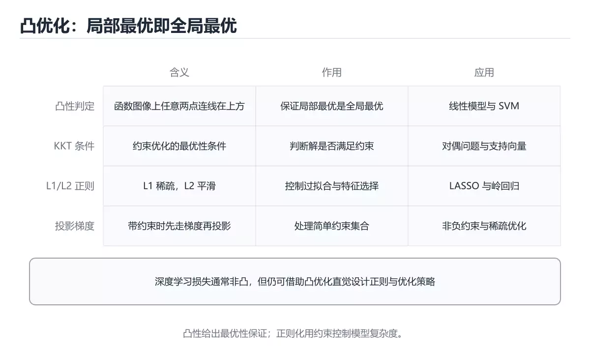
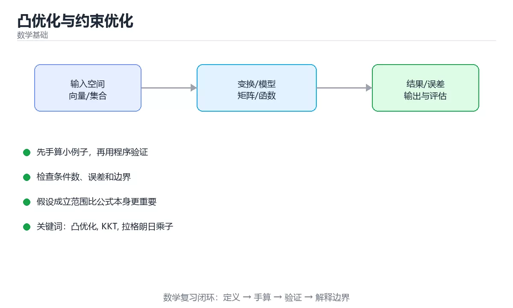

# 凸优化与约束优化





> 内容更新时间：2026-10-06 · 学习阶段：高级 · 预计用时：40 分钟

## 本节知识框架

**课程定位**：所属分类 `math`（数学基础），课程主题 `凸优化与约束优化`，学习阶段 高级，建议用时 40 分钟。

本课主线：凸性判定、KKT 条件、L1/L2 正则与投影梯度、软阈值。

**学完本课应当能够**
- 说清 `凸集与凸函数` 与 `梯度下降` 的含义与区别，并各举一个正例和一个反例。
- 用本课示例验证 `学习率` 的行为，记录输入、输出与失败条件。
- 遇到「认为梯度下降一定收敛到全局最优」这类问题时，能说出触发条件与修复顺序。

### 从概念到验证的学习链条

1. `凸集与凸函数`：先掌握 凸集：集合内任意两点连线仍在集合内，再用它解释 `梯度下降` 为什么会出现。
2. `梯度下降`：先掌握 沿负梯度方向逐步逼近极小值，每次前进的步长由学习率控制，再用它解释 `学习率` 为什么会出现。
3. `学习率`：先掌握 每次更新的步长系数，太大来回震荡不收敛，太小则收敛过慢，再用它解释 `KKT 条件` 为什么会出现。
4. `KKT 条件`：先掌握 带约束优化问题取得最优解的必要条件，用乘子把约束并进目标函数，再用它解释 本课示例的观察结果 为什么会出现。

**先修与衔接**：本课是「数学基础」分类的第 8 课。先修内容：《信息论：熵与交叉熵》。《信息论：熵与交叉熵》里的 `信息论`、`熵` 是本课的前提。相关或后续课程：《图论与组合数学》。

### 完成判据

- **定义关**：不看正文也能说明 `凸集与凸函数` 是 凸集：集合内任意两点连线仍在集合内，并指出一个反例。
- **机制关**：能按“输入 → 转换 → 输出 → 验证”复述 `凸优化与约束优化`，而不是只背结论。
- **示例关**：能运行或推演 `凸优化与约束优化` 的 `python` 示例，并说明一个真实出现的标识符或字面量。
- **证据关**：能指出 `凸优化与约束优化` 示例里的 调用了 `is_convex_1d()`，并说明它支持或反驳了本课的哪一条结论。
- **排错关**：能复现 认为梯度下降一定收敛到全局最优，记录现象并按 非凸需多次重启或更好的初始化 修复。
- **迁移关**：能把 `凸优化`、`KKT`、`拉格朗日乘子`、`L1正则` 放进一个与 `凸优化与约束优化` 不同的项目场景，并保持输入与验证条件可追踪。
- **复盘关**：学完 `凸优化与约束优化` 后，用一句话写下仍然不确定的结论，并列出下一次验证需要的输入、环境和成功判据。

### 复习清单

- [ ] 能不看正文复述本课核心术语，并指出一个边界或反例。
- [ ] 能运行或推演本课示例，记录输入、输出与失败现象。
- [ ] 能完成一次自测，并把错题对照错误表定位原因。

## 核心概念定义

| 术语 | 操作性定义 | 常见边界与风险 |
| --- | --- | --- |
| 凸集与凸函数 | 凸集：集合内任意两点连线仍在集合内。 | 只在「凸集：集合内任意两点连线仍在集合内」这一前提下成立，换输入或换环境要重新验证。 |
| 梯度下降 | 沿负梯度方向逐步逼近极小值，每次前进的步长由学习率控制。 | 易错：非凸场景停在差的局部极小；正确做法是非凸需多次重启或更好的初始化。 |
| 学习率 | 每次更新的步长系数，太大来回震荡不收敛，太小则收敛过慢。 | 易错：损失振荡甚至 NaN；正确做法是降学习率或做线搜索。 |
| KKT 条件 | 带约束优化问题取得最优解的必要条件，用乘子把约束并进目标函数。 | 易错：只得到必要条件；正确做法是凸问题才是充要条件。 |

## 原理与运行机制

### 机制总览

**教材衔接：为什么需要它**

「梯度下降能收敛」这件事不是无条件的：凸性保证局部最优就是全局最优。理解凸性、约束与正则化，能解释很多工程现象——例如为什么 L2 让权重变小却不归零，而 L1 会产生稀疏解。

**教材衔接：凸性速查**

| 概念 | 定义 | 判定方法 |
| --- | --- | --- |
| 凸集 | 集合内任意两点连线仍在集合内 | 几何判断 |
| 凸函数 | `f(θx+(1-θ)y) ≤ θf(x)+(1-θ)f(y)` | 二阶导非负（一维）；Hessian 半正定 |
| 严格凸 | 不等式严格成立 | 解唯一 |
| 非凸 | 存在多个局部极小 | 依赖初始化与多次重启 |

重要结论：

- 凸问题的局部最优就是全局最优。
- 常见凸函数：线性函数、平方函数、L2 范数、L1 范数、负熵、指数函数。
- 常见非凸：神经网络损失、矩阵分解、聚类目标。

**教材衔接：常见解法速查**

| 方法 | 适用 | 特点 |
| --- | --- | --- |
| 梯度下降 | 可导无约束 | 简单，需要调学习率 |
| 牛顿法 | 二阶可导 | 收敛快，但 Hessian 代价高 |
| 拟牛顿（L-BFGS） | 中大规模平滑问题 | 近似二阶信息，常用 |
| 近端梯度（ISTA/FISTA） | 含 L1 的正则问题 | 用软阈值处理非光滑项 |
| 内点法 | 凸约束优化 | 精度高、规模受限 |
| SMO | SVM 对偶问题 | 分解为小规模子问题 |
| 坐标下降 | 可分结构 | 每次只优化一个坐标 |

### 机制拆解：每一步的输入、动作与输出

#### 1. `凸集与凸函数`
- 输入：`凸优化`；本步把 凸集：集合内任意两点连线仍在集合内 当作判断规则。
- 动作：围绕 `凸集与凸函数` 保留中间状态，并记录它与 `梯度下降` 的对应关系。
- 输出：`梯度下降`，它可以被下一段代码、测试或记录继续使用。
- `凸集与凸函数` 的失败条件：只在「凸集：集合内任意两点连线仍在集合内」这一前提下成立，换输入或换环境要重新验证。

#### 2. `梯度下降`
- 输入：`凸集与凸函数`；本步把 沿负梯度方向逐步逼近极小值，每次前进的步长由学习率控制 当作判断规则。
- 动作：围绕 `梯度下降` 保留中间状态，并记录它与 `学习率` 的对应关系。
- 输出：`学习率`，它可以被下一段代码、测试或记录继续使用。
- `梯度下降` 的失败条件：当认为梯度下降一定收敛到全局最优时，会出现非凸场景停在差的局部极小。

#### 3. `学习率`
- 输入：`梯度下降`；本步把 每次更新的步长系数，太大来回震荡不收敛，太小则收敛过慢 当作判断规则。
- 动作：围绕 `学习率` 保留中间状态，并记录它与 `KKT 条件` 的对应关系。
- 输出：`KKT 条件`，它可以被下一段代码、测试或记录继续使用。
- `学习率` 的失败条件：当学习率过大导致发散时，会出现损失振荡甚至 NaN。

#### 4. `KKT 条件`
- 输入：`学习率`；本步把 带约束优化问题取得最优解的必要条件，用乘子把约束并进目标函数 当作判断规则。
- 动作：围绕 `KKT 条件` 保留中间状态，并记录它与 `is_convex_1d` 的对应关系。
- 输出：`is_convex_1d`，它可以被下一段代码、测试或记录继续使用。
- `KKT 条件` 的失败条件：当用 KKT 条件处理非凸问题时，会出现只得到必要条件。

### 示例中的可观察事实

1. 调用了 `is_convex_1d()`；它对应的课程主题是 `凸优化与约束优化`。
2. 调用了 `range()`；它对应的课程主题是 `凸优化与约束优化`。
3. 调用了 `min()`；它对应的课程主题是 `凸优化与约束优化`。
4. 调用了 `projected_gradient_descent()`；它对应的课程主题是 `凸优化与约束优化`。
5. 调用了 `grad_f()`；它对应的课程主题是 `凸优化与约束优化`。
6. 调用了 `max()`；它对应的课程主题是 `凸优化与约束优化`。
7. 调用了 `round()`；它对应的课程主题是 `凸优化与约束优化`。
8. 调用了 `soft_threshold()`；它对应的课程主题是 `凸优化与约束优化`。

### 复现实验记录

- 环境：`凸优化与约束优化` 使用 `python` 示例，固定 `凸优化`、`KKT`、`拉格朗日乘子`、`L1正则` 作为第一组条件。
- 首轮输入：先确认 调用了 `is_convex_1d()`，预测 `凸集与凸函数` 会怎样变化。
- 基线观察：记录命令、输入、输出和错误原文，不用截图代替可复制的文本。
- 单变量修改：只改变 `凸优化`，观察 `KKT 条件` 是否仍满足定义。
- 失败注入：复现 认为梯度下降一定收敛到全局最优，确认现象是 非凸场景停在差的局部极小。
- 记录结论：把“修改前、修改后、预期变化、实际变化”写成四列表，这样复盘 `凸优化与约束优化` 时才能区分概念错误与实现错误。

## 典型应用场景

- **认为梯度下降一定收敛到全局最优**：典型现象是非凸场景停在差的局部极小；正确做法是非凸需多次重启或更好的初始化。
- **把非凸问题当凸问题求「唯一解」**：典型现象是结论不成立；正确做法是先验证凸性再下结论。
- **用 L1 期望权重平滑变小**：典型现象是权重直接归零导致稀疏；正确做法是稀疏用 L1，平滑用 L2。
- **忽略特征量纲**：典型现象是正则项对大尺度特征惩罚过重；正确做法是先标准化再正则。

### 最小验证场景

- 准备：保留 `python` 示例的原始输入，先记录 `凸优化与约束优化` 的基线输出和完整运行命令。
- 观察：先核对 调用了 `is_convex_1d()`，再改变一个与 `凸集与凸函数` 相关的条件。
- 判定：新结果与 `凸优化与约束优化` 的基线不同不等于错误；只有当差异破坏了 `凸集与凸函数` 的定义或错误表中的约束，才判定为失败。

### 选择与边界

- 使用 `凸集与凸函数` 时，先满足它的定义：凸集：集合内任意两点连线仍在集合内；只在「凸集：集合内任意两点连线仍在集合内」这一前提下成立，换输入或换环境要重新验证。
- 使用 `梯度下降` 时，先满足它的定义：沿负梯度方向逐步逼近极小值，每次前进的步长由学习率控制；易错：非凸场景停在差的局部极小；正确做法是非凸需多次重启或更好的初始化。
- 使用 `学习率` 时，先满足它的定义：每次更新的步长系数，太大来回震荡不收敛，太小则收敛过慢；易错：损失振荡甚至 NaN；正确做法是降学习率或做线搜索。
- 使用 `KKT 条件` 时，先满足它的定义：带约束优化问题取得最优解的必要条件，用乘子把约束并进目标函数；易错：只得到必要条件；正确做法是凸问题才是充要条件。

## 代码/协议/SQL 示例

**教材衔接：约束与正则化速查**

| 形式 | 数学表达 | 作用 |
| --- | --- | --- |
| 无约束 | `min f(θ)` | 直接梯度下降 |
| 等式约束 | `g(θ)=0` | 拉格朗日乘子法 |
| 不等式约束 | `h(θ)≤0` | KKT 条件 |
| L2 正则（岭） | `λ‖θ‖²` | 抑制大权重，解平滑但不稀疏 |
| L1 正则（套索） | `λ‖θ‖₁` | 产生稀疏解，可做特征选择 |
| 弹性网 | L1 + L2 | 兼顾稀疏与稳定 |

```python
import math

def is_convex_1d(f, low: float, high: float, samples: int = 200) -> bool:
    """一维凸性数值判定：检查中点函数值是否不超过两端平均。"""
    step = (high - low) / samples
    for i in range(samples + 1):
        x1, x3 = low + i * step, low + min(i + 2, samples) * step
        x2 = (x1 + x3) / 2
        if f(x2) > (f(x1) + f(x3)) / 2 + 1e-9:
            return False
    return True

def projected_gradient_descent(f, grad_f, start: float, lr: float = 0.1,
                               steps: int = 100, lower: float = 0.0,
                               upper: float = 1.0) -> float:
    """投影梯度法：每步更新后投影回可行区间。"""
    x = start
    for _ in range(steps):
        x = x - lr * grad_f(x)
        x = min(upper, max(lower, x))     # 投影到 [lower, upper]
    return round(x, 6)

def soft_threshold(value: float, threshold: float) -> float:
    """软阈值算子：L1 正则（近端梯度）产生稀疏解的核心操作。"""
    if value > threshold:
        return value - threshold
    if value < -threshold:
        return value + threshold
    return 0.0

print(is_convex_1d(lambda x: x ** 2, -5, 5), is_convex_1d(math.sin, -5, 5))
print(projected_gradient_descent(lambda x: (x - 1.5) ** 2, lambda x: 2 * (x - 1.5), start=0.0))
print([soft_threshold(v, 0.5) for v in (-1.0, -0.2, 0.3, 2.0)])
```

**教材衔接：补充：凸性判定、KKT 与正则化的几何含义**

### 凸集与凸函数

```text
凸集：集合内任意两点连线仍在集合内
  · 圆、正方形、半空间是凸的
  · 月牙形、环状不是凸的

凸函数：函数图像上任意两点连线在图像上方
  f(θx + (1-θ)y) ≤ θf(x) + (1-θ)f(y)，θ ∈ [0,1]

直观：碗形是凸的，山谷形（多个凹陷）不是
```

| 判定手段 | 说明 |
| --- | --- |
| 二阶导 ≥ 0（一元） | 导数单调不减，曲线向上弯 |
| 海森矩阵半正定（多元） | 任意方向的二阶导都非负 |
| 凸函数之和仍凸 | 便于组合出新的凸问题 |
| 仿射变换保持凸性 | 线性约束下仍是凸问题 |

### 为什么凸性如此重要

```text
凸问题的三大好处
  ① 任何局部最优都是全局最优——不会卡在「假谷底」
  ② 最优解集合本身是凸集，解唯一或形成一个连续区间
  ③ 有成熟且高效的多项式时间算法（内点法、切平面法）

非凸问题的现实
  · 深度学习的目标函数几乎都是非凸的
  · 实践中靠随机初始化、动量、Adam 等「逃离坏点」
  · 只能追求「足够好的局部最优」，而非保证全局最优
```

### 拉格朗日乘子与 KKT 的直觉

```text
问题：在约束 g(x) ≤ 0 下最小化 f(x)

拉格朗日函数：L(x, λ) = f(x) + λ·g(x)，λ ≥ 0

直观理解
  · λ 是「违反约束的代价」
  · λ = 0 说明约束没有起作用（内部解）
  · λ > 0 说明解被约束卡在边界上

KKT 条件（凸问题下是充要条件）
  ① 梯度为零：∇f + λ∇g = 0（无改进方向）
  ② 可行性：g(x) ≤ 0
  ③ 对偶可行性：λ ≥ 0
  ④ 互补松弛：λ·g(x) = 0（要么约束不起作用，要么乘子为零）
```

### L1 与 L2 正则化的几何解释

```text
目标：min 损失(w) + λ·正则项(w)

L2（岭回归）                L1（Lasso）
  ┌─────────┐                ┌─────────┐
  │   圆形   │                │  菱形    │
  └─────────┘                └─────────┘
  等高线与圆相切             等高线与顶点相切
  → 权重整体变小              → 部分权重恰好为 0
  → 缓解共线性                → 产生稀疏解，可做特征选择
```

| 正则化 | 几何形状 | 效果 | 适用 |
| --- | --- | --- | --- |
| L2 | 圆形 | 权重平滑收缩 | 特征都相关、共线性强 |
| L1 | 菱形（有尖角） | 权重稀疏（部分为 0） | 需要特征选择 |
| Elastic Net | 两者组合 | 兼顾稀疏与稳定 | 特征多且相关 |

### 梯度下降的收敛条件

```text
更新式：w ← w - η·∇f(w)

影响收敛的三件事
  ① 学习率 η：过大震荡甚至发散，过小收敛慢
  ② 条件数：不同方向曲率差异大时，等高线被拉长，收敛变慢
  ③ 平滑性：梯度变化剧烈时，需要更小的步长

经验做法
  · 先用小学习率跑通，再逐步放大
  · 用动量或自适应方法（Adam）缓解条件数问题
  · 画出损失曲线：震荡说明 η 太大，平坦说明太小
```

### 四种常见约束与处理方式

| 约束类型 | 例子 | 处理方式 |
| --- | --- | --- |
| 等式约束 | 权重之和 = 1 | 拉格朗日乘子、重参数化（softmax） |
| 不等式约束 | 权重 ≥ 0 | KKT、投影梯度 |
| 箱型约束 | 0 ≤ w ≤ 1 | 投影或裁剪 |
| 组合约束 | 权重和为 1 且非负 | 单纯形投影 |

### 自查清单

- [ ] 能用二阶导或海森矩阵判断凸性
- [ ] 能解释为什么凸问题没有「坏局部最优」
- [ ] 能说出 KKT 四个条件的含义
- [ ] 能画出 L1/L2 的几何图形并解释稀疏性
- [ ] 知道学习率、条件数、平滑性如何影响收敛

**运行方式**：运行 `凸优化与约束优化` 的示例时，保存为 `.py` 文件后用 `python 文件名.py` 运行；第三方依赖先在虚拟环境里安装。

### 示例精读：先找证据，再改一个条件

1. 调用了 `is_convex_1d()`；它出现在 `凸优化与约束优化` 的示例中，阅读时先确认它前后各发生了什么。
2. 调用了 `range()`；它出现在 `凸优化与约束优化` 的示例中，阅读时先确认它前后各发生了什么。
3. 调用了 `min()`；它出现在 `凸优化与约束优化` 的示例中，阅读时先确认它前后各发生了什么。
4. 调用了 `projected_gradient_descent()`；它出现在 `凸优化与约束优化` 的示例中，阅读时先确认它前后各发生了什么。
5. 调用了 `grad_f()`；它出现在 `凸优化与约束优化` 的示例中，阅读时先确认它前后各发生了什么。
6. 调用了 `max()`；它出现在 `凸优化与约束优化` 的示例中，阅读时先确认它前后各发生了什么。
7. 调用了 `round()`；它出现在 `凸优化与约束优化` 的示例中，阅读时先确认它前后各发生了什么。
8. 调用了 `soft_threshold()`；它出现在 `凸优化与约束优化` 的示例中，阅读时先确认它前后各发生了什么。
- 在 `凸优化与约束优化` 中与 `凸集与凸函数` 对照：示例必须能支持 凸集：集合内任意两点连线仍在集合内，否则说明这一段还缺少实现或验证步骤。
- 在 `凸优化与约束优化` 中与 `梯度下降` 对照：示例必须能支持 沿负梯度方向逐步逼近极小值，每次前进的步长由学习率控制，否则说明这一段还缺少实现或验证步骤。
- 在 `凸优化与约束优化` 中与 `学习率` 对照：示例必须能支持 每次更新的步长系数，太大来回震荡不收敛，太小则收敛过慢，否则说明这一段还缺少实现或验证步骤。
- 在 `凸优化与约束优化` 中与 `KKT 条件` 对照：示例必须能支持 带约束优化问题取得最优解的必要条件，用乘子把约束并进目标函数，否则说明这一段还缺少实现或验证步骤。

## 时间/空间复杂度或性能分析

**性能关注点（凸优化与约束优化）**：计算规模决定可行性：记录时间复杂度与数值误差，注意浮点累积误差。

**本课特有开销（凸优化与约束优化 · 凸优化）**：回溯会让正则表达式在特定输入上急剧变慢，必须用最坏输入做基准。

**测量方法**：以 `凸优化与约束优化` 的 `凸优化` 场景为对象，固定输入跑一遍记录基线，再把规模或并发度提高一个数量级复测；两次结果的差值与波动范围才是结论依据。

### 需要控制的变量与记录项

- `凸优化与约束优化` 的 `凸优化`：固定它的版本、输入范围和资源上限，分别记录速度、内存与失败率的变化。
- `凸优化与约束优化` 的 `KKT`：固定它的版本、输入范围和资源上限，分别记录速度、内存与失败率的变化。
- `凸优化与约束优化` 的 `拉格朗日乘子`：固定它的版本、输入范围和资源上限，分别记录速度、内存与失败率的变化。
- `凸优化与约束优化` 的 `L1正则`：固定它的版本、输入范围和资源上限，分别记录速度、内存与失败率的变化。
- `凸优化与约束优化` 的 `投影梯度`：固定它的版本、输入范围和资源上限，分别记录速度、内存与失败率的变化。
- `凸优化与约束优化` 中 `凸集与凸函数` 的边界：只在「凸集：集合内任意两点连线仍在集合内」这一前提下成立，换输入或换环境要重新验证。达到边界时不要外推，必须重新测量。
- `凸优化与约束优化` 中 `梯度下降` 的边界：易错：非凸场景停在差的局部极小；正确做法是非凸需多次重启或更好的初始化。达到边界时不要外推，必须重新测量。
- `凸优化与约束优化` 中 `学习率` 的边界：易错：损失振荡甚至 NaN；正确做法是降学习率或做线搜索。达到边界时不要外推，必须重新测量。
- `凸优化与约束优化` 中 `KKT 条件` 的边界：易错：只得到必要条件；正确做法是凸问题才是充要条件。达到边界时不要外推，必须重新测量。
- `凸优化与约束优化` 的代码证据：先验证 调用了 `is_convex_1d()`，再记录该路径的输入规模与耗时；只看代码行数不能推出复杂度。

## 常见误区与易错点

| 容易写错的做法 | 实际现象 | 原因与正确做法 |
| --- | --- | --- |
| 认为梯度下降一定收敛到全局最优 | 非凸场景停在差的局部极小 | 非凸需多次重启或更好的初始化 |
| 把非凸问题当凸问题求「唯一解」 | 结论不成立 | 先验证凸性再下结论 |
| 用 L1 期望权重平滑变小 | 权重直接归零导致稀疏 | 稀疏用 L1，平滑用 L2 |
| 忽略特征量纲 | 正则项对大尺度特征惩罚过重 | 先标准化再正则 |
| 学习率过大导致发散 | 损失振荡甚至 NaN | 降学习率或做线搜索 |
| 约束优化忘记投影 | 解越界到不可行域 | 每步做投影或加罚项 |
| 用 KKT 条件处理非凸问题 | 只得到必要条件 | 凸问题才是充要条件 |
| 忽视数值精度 | 迭代不收敛 | 合理收敛阈值与缩放 |

### 现场 1：认为梯度下降一定收敛到全局最优

**症状**：非凸场景停在差的局部极小。

**根因与修复**：非凸需多次重启或更好的初始化。

**自检**：在本课示例里复现「认为梯度下降一定收敛到全局最优」，改成非凸需多次重启或更好的初始化后重跑；如果症状消失且失败路径按预期变化，说明定位正确。

### 现场 2：把非凸问题当凸问题求「唯一解」

**症状**：结论不成立。

**根因与修复**：先验证凸性再下结论。

**自检**：在本课示例里复现「把非凸问题当凸问题求「唯一解」」，改成先验证凸性再下结论后重跑；如果症状消失且失败路径按预期变化，说明定位正确。

### 现场 3：用 L1 期望权重平滑变小

**症状**：权重直接归零导致稀疏。

**根因与修复**：稀疏用 L1，平滑用 L2。

**自检**：在本课示例里复现「用 L1 期望权重平滑变小」，改成稀疏用 L1，平滑用 L2后重跑；如果症状消失且失败路径按预期变化，说明定位正确。

### 现场 4：忽略特征量纲

**症状**：正则项对大尺度特征惩罚过重。

**根因与修复**：先标准化再正则。

**自检**：在本课示例里复现「忽略特征量纲」，改成先标准化再正则后重跑；如果症状消失且失败路径按预期变化，说明定位正确。

### 现场 5：学习率过大导致发散

**症状**：损失振荡甚至 NaN。

**根因与修复**：降学习率或做线搜索。

**自检**：在本课示例里复现「学习率过大导致发散」，改成降学习率或做线搜索后重跑；如果症状消失且失败路径按预期变化，说明定位正确。

### 现场 6：约束优化忘记投影

**症状**：解越界到不可行域。

**根因与修复**：每步做投影或加罚项。

**自检**：在本课示例里复现「约束优化忘记投影」，改成每步做投影或加罚项后重跑；如果症状消失且失败路径按预期变化，说明定位正确。

### 现场 7：用 KKT 条件处理非凸问题

**症状**：只得到必要条件。

**根因与修复**：凸问题才是充要条件。

**自检**：在本课示例里复现「用 KKT 条件处理非凸问题」，改成凸问题才是充要条件后重跑；如果症状消失且失败路径按预期变化，说明定位正确。

### 现场 8：忽视数值精度

**症状**：迭代不收敛。

**根因与修复**：合理收敛阈值与缩放。

**自检**：在本课示例里复现「忽视数值精度」，改成合理收敛阈值与缩放后重跑；如果症状消失且失败路径按预期变化，说明定位正确。

## 与其他知识点的关系

- **先修**：`信息论：熵与交叉熵`。本课默认这些内容已经掌握。
- **相关或后续**：`图论与组合数学`。本课术语会在这些课程里继续使用。
- **术语归属**：`凸集与凸函数`、`梯度下降`、`学习率` 的定义以本课「核心概念定义」为准，换到其他课程时先确认定义是否被改写。

### 先修与后续术语接口

- `信息论：熵与交叉熵`：两者通过本分类的学习顺序衔接，阅读时重点比较各自的输入与失败条件。
- `图论与组合数学`：两者通过本分类的学习顺序衔接，阅读时重点比较各自的输入与失败条件。

### 容易混淆的相邻概念

- `凸集与凸函数` 与 `梯度下降`：前者强调 凸集：集合内任意两点连线仍在集合内；后者强调 沿负梯度方向逐步逼近极小值，每次前进的步长由学习率控制。判断时分别检查两条定义的适用范围，不要只看名称相似就互换。
- `梯度下降` 与 `学习率`：前者强调 沿负梯度方向逐步逼近极小值，每次前进的步长由学习率控制；后者强调 每次更新的步长系数，太大来回震荡不收敛，太小则收敛过慢。判断时分别检查两条定义的适用范围，不要只看名称相似就互换。
- `学习率` 与 `KKT 条件`：前者强调 每次更新的步长系数，太大来回震荡不收敛，太小则收敛过慢；后者强调 带约束优化问题取得最优解的必要条件，用乘子把约束并进目标函数。判断时分别检查两条定义的适用范围，不要只看名称相似就互换。

## 自测题与参考答案

> 先独立作答，再对照参考答案；答案都能在本课正文、术语表或错误表里找到依据。

### 自测 1（概念复述）

不看正文，写出 `凸集与凸函数` 的操作性定义，并说明它与 `梯度下降` 的区别。

**参考答案**：凸集：集合内任意两点连线仍在集合内。

`梯度下降` 的定位是：沿负梯度方向逐步逼近极小值，每次前进的步长由学习率控制；两者的差别要从适用对象与失败模式上说明。

### 自测 2（排错）

本课错误表记录了「认为梯度下降一定收敛到全局最优」这类做法。请写出它会出现的现象、根因，以及修复顺序。

**参考答案**：现象是非凸场景停在差的局部极小；正确做法是非凸需多次重启或更好的初始化。修复时先复现现象并保留证据，再改动一处假设重跑，确认现象消失。

### 自测 3（动手验证）

运行本课的 `python` 示例，把其中的 `"一维凸性数值判定：检查中点函数值是否不超过两端平均。"` 换成一个边界值后重新运行，记录输出与错误信息。

**参考答案**：正常输入下 `python` 示例应当复现正文给出的结果；把 `"一维凸性数值判定：检查中点函数值是否不超过两端平均。"` 换成边界值后，如果结果改变或报错，先核对它是否满足 `凸优化与约束优化` 中`凸集与凸函数` 的适用范围，再检查错误表里是否有同类现象。

### 自测 4（代码阅读）

阅读本课开头的 `python` 示例，说明它体现了`凸集与凸函数` 的哪一条性质，并指出改动哪个输入会让这条性质不再成立。

**参考答案**：`凸集与凸函数` 的定义是 凸集：集合内任意两点连线仍在集合内，示例正是在实现这条定义。改动与 `凸集与凸函数` 有关的一个输入后，如果结果不再符合 `凸优化与约束优化` 的正文描述，就说明该性质只在当前前提成立。

### 自测 5（迁移）

把 `凸优化与约束优化` 的方法迁移到自己的项目：围绕 `凸集与凸函数` 写出一个与错误表同类的风险点，并说明触发条件和检验方式。

**参考答案**：例如「忽视数值精度」，它会导致迭代不收敛；检验方式是按合理收敛阈值与缩放改一处再复现，确认现象消失且没有引入新的失败分支。

### 自测 6（对比）

用一个表格对比 `凸集与凸函数` 与 `梯度下降`：各写一行适用场景、一行失败表现。

**参考答案**：`凸集与凸函数` 的定义是凸集：集合内任意两点连线仍在集合内；`梯度下降` 的定义是沿负梯度方向逐步逼近极小值，每次前进的步长由学习率控制。两者的失败表现分别对应本课错误表里与本术语相关的行。

### 自测 7（排错顺序）

面对「认为梯度下降一定收敛到全局最优」引发的问题，请把“复现 非凸场景停在差的局部极小 → 保留证据 → 非凸需多次重启或更好的初始化 → 回归验证”四步写成可执行的检查清单。

**参考答案**：第一步按非凸场景停在差的局部极小复现；第二步记录输入、版本与完整报错；第三步按非凸需多次重启或更好的初始化只改一处；第四步重跑并确认失败路径也按预期变化。

### 自测 8（边界判断）

针对 `KKT 条件`，分别写出“可以使用”的条件和“结论不再成立”的条件。

**参考答案**：易错：只得到必要条件；正确做法是凸问题才是充要条件。 同时要把 `KKT 条件` 的定义 带约束优化问题取得最优解的必要条件，用乘子把约束并进目标函数 与实际输入逐项对照。

### 自测 9（机制重建）

不看正文，按输入、转换、输出、验证四段重建 `凸集与凸函数` → `梯度下降` → `学习率` → `KKT 条件` 的作用链。

**参考答案**：起点是 `凸集与凸函数` 的定义 凸集：集合内任意两点连线仍在集合内；中间每一步都保留可观察状态；终点由 `KKT 条件` 检查，失败时回到错误表定位第一个偏离定义的步骤。

### 自测 10（综合排错）

在 `凸优化与约束优化` 中，现象是 迭代不收敛。请围绕 忽视数值精度 写出最小复现、关键证据、修复动作和回归验证，并说明为什么不能只凭一次运行下结论。

**参考答案**：先复现 忽视数值精度，记录输入与完整错误；再按 合理收敛阈值与缩放 只改一处。回归时同时跑正常路径和边界路径，只有两次结果都可解释，才把修复视为完成。

### 自测 11（一分钟复述）

用每分钟约 200 字的速度复述 `凸优化与约束优化`：先给主问题，再按顺序说出 `凸集与凸函数`、`梯度下降`、`学习率`、`KKT 条件`，最后给一个失败案例。

**自评标准**：主问题必须对应 凸性判定、KKT 条件、L1/L2 正则与投影梯度、软阈值；每个术语都要能接上一句定义或边界；失败案例必须写成可观察现象，不能用“可能有风险”代替证据。

## 术语速查

| 术语 | 一句话说明 |
| --- | --- |
| `凸集与凸函数` | 凸集：集合内任意两点连线仍在集合内。 |
| `梯度下降` | 沿负梯度方向逐步逼近极小值，每次前进的步长由学习率控制。 |
| `学习率` | 每次更新的步长系数，太大来回震荡不收敛，太小则收敛过慢。 |
| `KKT 条件` | 带约束优化问题取得最优解的必要条件，用乘子把约束并进目标函数。 |

**术语关系**：`凸集与凸函数`（凸集：集合内任意两点连线仍在集合内） → `梯度下降`（沿负梯度方向逐步逼近极小值） → `学习率`（每次更新的步长系数） → `KKT 条件`（带约束优化问题取得最优解的必要条件）。

## 考点精讲

`凸优化与约束优化` 的题库有 6 道题，下面逐题给出题干、正确项与判断依据：先自己作答，再核对正确项，最后回到正文对应小节复核。

### 考点 1：第 1 题

- **题目**：围绕“凸优化与约束优化”中的 凸优化、KKT、拉格朗日乘子，下列哪两项是本课强调的实践判断？
- **正确项**：学习 凸优化 时要同时说明输入、输出和失败路径，不能只看正常流程；验证 KKT 时要固定版本并覆盖边界输入，结论才可复现
- **判断依据**：这道题检验本课主问题：凸性判定、KKT 条件、L1/L2 正则与投影梯度、软阈值。复习时先复述本课主问题，再举一个会让结论失效的输入。

### 考点 2：第 2 题

- **题目**：按“凸优化与约束优化”中 凸优化、KKT、拉格朗日乘子 的实践顺序，把四个步骤排成从准备到复盘的合理顺序。
- **正确项**：先明确 凸优化 的输入、输出与约束 → 写出最小示例并核对 KKT 的基线结果 → 只改一个变量，记录边界与失败路径的变化 → 固定版本与证据，把“凸优化与约束优化”的结论写成可复现记录
- **判断依据**：这道题检验本课主问题：凸性判定、KKT 条件、L1/L2 正则与投影梯度、软阈值。复习时先复述本课主问题，再举一个会让结论失效的输入。

### 考点 3：第 3 题

- **题目**：处理「最小化 f(x) 且 x 必须落在区间 [0,1] 内」这类约束，最简单的做法是？
- **正确项**：每步更新后把 x 投影回 [0,1]
- **判断依据**：这道题检验本课主问题：凸性判定、KKT 条件、L1/L2 正则与投影梯度、软阈值。复习时先复述本课主问题，再举一个会让结论失效的输入。

### 考点 4：第 4 题

- **题目**：关于 KKT 条件，说法正确的是？
- **正确项**：在凸问题中它是解的最优性充要条件
- **判断依据**：这道题落在术语 `KKT 条件` 上：带约束优化问题取得最优解的必要条件，用乘子把约束并进目标函数。复习时把 `KKT 条件` 的定义、适用边界和一个反例一起说清楚，再回到「核心概念定义」核对原文。

### 考点 5：第 5 题

- **题目**：使用 L1 或 L2 正则前，通常必须先做什么？
- **正确项**：给所有特征做标准化
- **判断依据**：这道题检验本课主问题：凸性判定、KKT 条件、L1/L2 正则与投影梯度、软阈值。复习时先复述本课主问题，再举一个会让结论失效的输入。

### 考点 6：第 6 题

- **题目**：`凸优化与约束优化` 的示例代码服务于“凸性判定、KKT 条件、L1/L2 正则与投影梯度、软阈值。”。哪一条判断是正确的？
- **正确项**：局部最优就是全局最优
- **判断依据**：这道题落在术语 `KKT 条件` 上：带约束优化问题取得最优解的必要条件，用乘子把约束并进目标函数。复习时把 `KKT 条件` 的定义、适用边界和一个反例一起说清楚，再回到「核心概念定义」核对原文。

### 考点 7：`凸集与凸函数`

- **要点**：凸集：集合内任意两点连线仍在集合内。
- **凸集与凸函数 的边界**：只在「凸集：集合内任意两点连线仍在集合内」这一前提下成立，换输入或换环境要重新验证。

### 考点 8：`梯度下降`

- **要点**：沿负梯度方向逐步逼近极小值，每次前进的步长由学习率控制。
- **梯度下降 的边界**：易错：非凸场景停在差的局部极小；正确做法是非凸需多次重启或更好的初始化。

### 考点 9：`学习率`

- **要点**：每次更新的步长系数，太大来回震荡不收敛，太小则收敛过慢。
- **学习率 的边界**：易错：损失振荡甚至 NaN；正确做法是降学习率或做线搜索。

### 考点 10：`KKT 条件`

- **要点**：带约束优化问题取得最优解的必要条件，用乘子把约束并进目标函数。
- **KKT 条件 的边界**：易错：只得到必要条件；正确做法是凸问题才是充要条件。

### 考点 11：排错——认为梯度下降一定收敛到全局最优

- **现象**：非凸场景停在差的局部极小。
- **处理**：非凸需多次重启或更好的初始化。

### 考点 12：排错——把非凸问题当凸问题求「唯一解」

- **现象**：结论不成立。
- **处理**：先验证凸性再下结论。

### 考点 13：综合辨析——`凸集与凸函数` 与 `KKT 条件`

- **辨析点**：`凸集与凸函数` 的定义是 凸集：集合内任意两点连线仍在集合内；`KKT 条件` 的定义是 带约束优化问题取得最优解的必要条件，用乘子把约束并进目标函数。
- **答题要求**：面对 `凸优化与约束优化` 的题目，先判断描述的是 `凸集与凸函数` 还是 `KKT 条件`，再归到对应定义，最后写出一个会让该定义失效的边界输入。

### 考点 14：排错评分点

- **现象分**：能写出 非凸场景停在差的局部极小，而不是只写“程序有错”。
- **证据分**：保留触发 认为梯度下降一定收敛到全局最优 的输入、版本和错误原文。
- **修复分**：按 非凸需多次重启或更好的初始化 只改一处，并同时回归正常路径与边界路径。

## 内容元数据

- 内容版本：v2.0
- 最后更新：2026-10-06
- 学习阶段：高级
- 适用环境：线性代数、概率统计与优化基础
；本课聚焦 凸优化。
- 内容来源：内置结构化课程与工程实践整理
- 相关主题：凸优化、KKT、拉格朗日乘子、L1正则、投影梯度、近端梯度
- 质量版本：P0 测验标准 + P1 覆盖扩展 + P2 体验补全

## 参考资料与复核

- 最后复核：2026-10-04
- 下次复核：2027-09-24
- 复核范围：版本兼容、API 行为、安全建议与工程实践
- 来源性质：官方文档、标准或权威教材；本课核对关键词：凸优化、KKT、拉格朗日乘子、L1正则、投影梯度、近端梯度。

| 参考资料 | 本课用途 |
| --- | --- |
| [NIST DLMF](https://dlmf.nist.gov/) | 数学函数与公式参考 |
| [OpenStax 概率统计](https://openstax.org/details/books/introductory-statistics) | 概率、分布与统计推断 |
| [Wolfram MathWorld](https://mathworld.wolfram.com/) | 数学概念与公式查询 |

| [本课术语索引：凸优化与约束优化](#核心概念定义) | 按本课输入、术语边界和错误表现逐项核对 |
> 「凸优化与约束优化」的链接用于离线阅读后的延伸核对；App 不会自动联网。