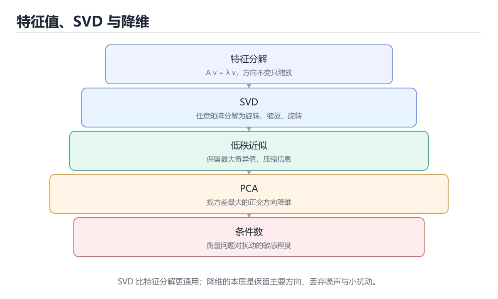
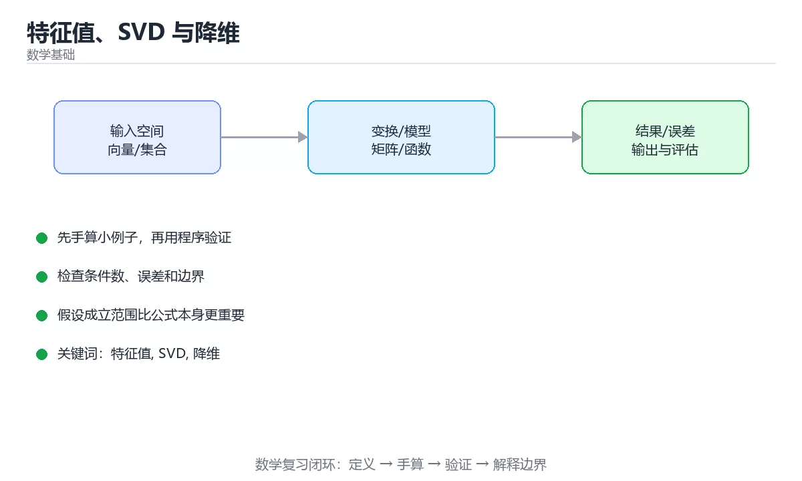

# 特征值、SVD 与降维





> 内容更新时间：2026-10-06 · 学习阶段：入门 · 预计用时：30 分钟

## 学习目标

- 能用自己的话解释特征值、SVD 与降维解决了什么问题，而不是只背术语。
- 能说清 「特征值」、「SVD」、「降维」、「PCA」 之间的关系，并分别举出一个例子。
- 能把 特征值 放回「特征值、SVD 与降维」的知识体系，说明它和 SVD 的边界。
- 能完成本课练习，并用验收标准检查自己的结果。

> 一句话摘要：特征分解、SVD 低秩近似、PCA 与条件数。

## 前置知识

- 先完成上一课《线性代数：向量与矩阵》；如果已经掌握，可以直接用本课练习自测。
- 本课阶段：入门。只需要基本计算机操作，不要求编程经验。
- 开始前先复习：特征值、SVD、降维。
- 如果 特征值与特征向量 这一步看不懂，先记录具体卡点，再用 explained_variance_ratio 复现一遍。

## 特征值与特征向量

对方阵 A，若存在非零向量 v 与标量 λ 满足 `Av = λv`，则 λ 是特征值、v 是特征向量：**A 作用在 v 上只改变长度不改变方向**。特征值反映变换在各自方向上的伸缩倍率。

用途：主成分分析（PCA）、振动分析、PageRank（转移矩阵的主特征向量）、马尔可夫链稳态分布。

## 矩阵分解速览

| 分解 | 形式 | 用途 |
| --- | --- | --- |
| 特征分解 | A = QΛQ⁻¹（对称阵可正交对角化） | PCA、谱分析 |
| SVD | A = UΣVᵀ | 降维、压缩、推荐系统 |
| QR | A = QR | 最小二乘数值求解 |
| Cholesky | A = LLᵀ（对称正定） | 高效解线性方程组 |

SVD 对任意矩阵都存在，是数值上最可靠的分解。

## SVD 与降维

奇异值按从大到小排列，前 k 个奇异值通常携带绝大部分能量。保留前 k 项即得到**最优低秩近似**（Eckart–Young 定理），这是：

1. 图像压缩（保留前 k 个奇异值重建）；
2. 推荐系统（隐语义模型）；
3. 词嵌入降维与去噪；
4. LoRA 微调（低秩假设）的共同数学基础。

## 与 PCA 的关系

PCA 就是「先中心化，再做 SVD（或协方差矩阵的特征分解）」，取前 k 个主成分作为新坐标轴。它用更少的维度保留尽可能多的方差，注意：**降维前必须标准化**，否则量纲大的特征会主导结果。

## 数值直觉

条件数 = 最大奇异值 / 最小奇异值，衡量问题对扰动有多敏感；条件数很大时（病态矩阵）求解不稳定，需要正则化或改用 QR/SVD 求解。梯度爆炸与消失，本质也与权重矩阵的奇异值分布相关。

## 特征值手算与 SVD 应用数字

**2×2 手算**：对 A = [[2,1],[1,2]]，解 det(A − λI) = (2−λ)² − 1 = 0，得 λ = 3 与 λ = 1；对应特征向量分别为 [1,1] 与 [1,−1]。含义：A 在 45° 方向把向量拉长 3 倍，在 −45° 方向保持长度不变。

**SVD 降维的具体数字**：对一张 1000×1000 的灰度图做 SVD，奇异值通常前 5% 就占据了 90% 以上的能量；只保留前 50 个奇异值即可把存储量从 10⁶ 个数值降到约 50×(1000+1000) = 10⁵，压缩约 10 倍，而视觉上仍可辨认。保留多少取决于可接受的质量损失。

**推荐系统**：用户-物品评分矩阵极度稀疏，SVD 把用户与物品映射到低维隐空间，预测缺失评分的做法就是矩阵补全。实际工程常用其变体（隐语义模型、ALS），核心思想仍是低秩假设。

**条件数的直觉**：条件数 = 最大奇异值 / 最小奇异值。条件数为 1 表示各方向同等敏感（良态）；条件数达 10⁶ 说明数据在某个方向几乎塌缩，求解结果对噪声极敏感——这也解释了为什么特征高度相关时线性回归系数会剧烈波动（可加正则化缓解）。

## PCA 五步实操与常见误用

| 步骤 | 操作 | 注意 |
| --- | --- | --- |
| 1 中心化 | 每个特征减去均值 | 必须做，否则第一主成分会被均值方向主导 |
| 2 标准化 | 除以标准差（可选但常必要） | 量纲不同时必须做 |
| 3 求协方差矩阵 | 计算特征间协方差 | 对称矩阵，可特征分解 |
| 4 取特征向量 | 按特征值从大到小排序，取前 k 个 | k 由累计方差贡献率决定（常见 85%~95%） |
| 5 投影 | 原始数据乘以前 k 个特征向量 | 得到降维后的新坐标 |

**常见误用**：① 不做标准化导致量纲大的特征主导；② 用 PCA 做特征选择后解释性丢失（新维度是线性组合，不再有业务含义）；③ 在训练集上拟合 PCA 后直接对测试集用同一变换——必须先划分再拟合，否则数据泄漏；④ 把 PCA 当作万能降维，非线性结构应改用 t-SNE/UMAP（仅用于可视化，不用于建模特征）。

## 本课小结

特征值描述「方向上的伸缩」，SVD 把任意矩阵拆成「旋转-缩放-旋转」；**用前 k 个奇异值做低秩近似**是降维、压缩与推荐的统一工具。

## 特征分解与 SVD 速查

| 概念 | 定义 | 说明 |
| --- | --- | --- |
| 特征值 λ | `Av = λv` 中的 λ | 表示该方向上的伸缩倍率 |
| 特征向量 v | 被 A 作用后方向不变 | 只被拉伸或压缩 |
| 特征分解 | `A = Q Λ Q⁻¹` | 需要可对角化 |
| 对称矩阵 | `A = Aᵀ`，特征值实数、特征向量正交 | 应用最广 |
| 奇异值 σ | `AᵀA` 特征值的平方根 | 非负，按大小排列 |
| SVD | `A = U Σ Vᵀ` | 任意矩阵都成立 |
| 低秩近似 | 保留前 k 个奇异值 | Eckart-Young 最优 |
| 条件数 | 最大与最小奇异值之比 | 衡量病态程度 |

## 降维速查

| 方法 | 原理 | 特点 |
| --- | --- | --- |
| PCA | 对中心化数据做 SVD | 线性、无监督、最大方差 |
| 截断 SVD | 直接保留前 k 个奇异值 | 稀疏矩阵友好 |
| NMF | 非负矩阵分解 | 结果可解释（如词主题） |
| t-SNE / UMAP | 非线性降维 | 可视化好，不保留全局距离 |

```python
import math

Matrix = list

def power_iteration(matrix: Matrix, iterations: int = 500, tol: float = 1e-9):
    """幂迭代：求主特征值与主特征向量（适合较大稀疏矩阵）。"""
    n = len(matrix)
    vector = [1.0 / math.sqrt(n)] * n
    eigenvalue = 0.0
    for _ in range(iterations):
        product = [sum(matrix[i][j] * vector[j] for j in range(n)) for i in range(n)]
        norm = math.sqrt(sum(value * value for value in product))
        if norm == 0:
            return 0.0, [0.0] * n
        new_vector = [value / norm for value in product]
        new_eigenvalue = sum(new_vector[i] * product[i] for i in range(n))
        if abs(new_eigenvalue - eigenvalue) < tol:
            vector, eigenvalue = new_vector, new_eigenvalue
            break
        vector, eigenvalue = new_vector, new_eigenvalue
    return round(eigenvalue, 6), [round(value, 6) for value in vector]

def condition_number(singular_values: list) -> float:
    """条件数：最大与最小奇异值之比，越大越病态。"""
    smallest = min(singular_values)
    if smallest == 0:
        return float("inf")
    return round(max(singular_values) / smallest, 4)

def explained_variance_ratio(singular_values: list, k: int) -> float:
    """前 k 个奇异值解释的方差占比。"""
    total = sum(value * value for value in singular_values)
    if total == 0:
        return 0.0
    kept = sum(value * value for value in singular_values[:k])
    return round(kept / total, 4)

def low_rank_error(singular_values: list, k: int) -> float:
    """截断到前 k 个后的误差（Frobenius 范数意义下）。"""
    return round(math.sqrt(sum(value * value for value in singular_values[k:])), 6)

print(power_iteration([[2, 1], [1, 2]]))
print(condition_number([10, 5, 0.1]), explained_variance_ratio([10, 5, 0.1], 2))
```

## 应用速查

| 场景 | 用法 |
| --- | --- |
| PCA 降维 | 中心化后 SVD，取前 k 个主成分 |
| 图像压缩 | 保留少量奇异值重构近似图 |
| 推荐系统 | 用户-物品矩阵低秩分解 |
| 潜在语义分析 | 词-文档矩阵 SVD |
| LoRA 微调 | 用低秩矩阵近似权重更新 |
| 主成分可视化 | 取前两个主成分作图 |
| 数值稳定性诊断 | 用条件数判断是否病态 |

## 常见错误与排查

| 容易踩的做法 | 实际现象 | 原因与正确做法 |
| --- | --- | --- |
| PCA 前不标准化 | 量纲大的特征主导 | 先标准化（z-score） |
| 用 SVD 前不中心化 | 结果受均值影响 | PCA 必须先中心化 |
| 认为所有矩阵都可特征分解 | 分解失败 | 非对称矩阵可能不可对角化，用 SVD |
| 奇异值取负数 | 概念错误 | 奇异值非负 |
| 用条件数判断是否可逆 | 误判 | 条件数衡量病态程度，可逆性看奇异值是否为 0 |
| 随便选 k 值 | 信息损失或降维不足 | 看解释方差比例或肘部法 |
| 用 t-SNE 距离解释全局结构 | 结论错误 | 它只保留局部邻域结构 |
| 浮点误差当作真实小奇异值 | 秩判断错误 | 设阈值或用相对判定 |
| 对稀疏大矩阵直接求全 SVD | 内存与时间爆炸 | 用截断 SVD 或随机化算法 |
| 忽略数值缩放 | 条件数恶化 | 归一化与正则化 |

## 复习与自测

- [ ] 能解释特征值与特征向量的几何意义。
- [ ] 知道 SVD 适用于任意矩阵且奇异值非负。
- [ ] 会计算解释方差比例并据此选择 k。
- [ ] 理解条件数与病态问题的关系。
- [ ] 知道 PCA 需要先中心化与标准化。

## 动手练习

> 本课练习重点：围绕「特征值、SVD、降维」完成复述、实验和交付，每个结果都要能被别人检查。

先写出 SVD 的假设，再验证其中一步是否成立。

### 练习 1：建立心智模型（10 分钟）

合上教程，用 3～5 句话回答：

1. 特征值、SVD 与降维解决了什么问题？
2. 如果没有它，会出现什么具体后果？
3. 它和「SVD」是什么关系？

验收标准：说明 特征值 与 SVD 的分工，并写出一个失效场景。

### 练习 2：做一次可控实验（20 分钟）

从正文中选一个最小示例，完成以下操作：

1. 先预测修改一个参数、输入或步骤后的结果。
2. 再实际执行或逐步推演，记录真实结果。
3. 如果结果与预测不同，写出差异原因。

**验收标准**：围绕「特征值与特征向量」小节做一次五步记录，原例取自 explained_variance_ratio，改动只允许动一处特征值，原因要能指回正文的判断依据。

### 练习 3：交付一个小结果（30 分钟）

把 explained_variance_ratio 的过程手算一遍，用程序核对每一步。

任务要求：

- 结果必须能被别人检查，不能只写“我已经理解了”。
- 至少覆盖「特征值」和「SVD」两个关键词。
- 写出 1 个仍然不确定的问题，以及下一步如何验证。

> 提示：时间有限时优先做练习 1 和练习 2；练习 3 可以拆成两次完成。

## 可运行练习

### 任务 1：先跑通，再解释

```python
import math

Matrix = list

def power_iteration(matrix: Matrix, iterations: int = 500, tol: float = 1e-9):
    """幂迭代：求主特征值与主特征向量（适合较大稀疏矩阵）。"""
    n = len(matrix)
    vector = [1.0 / math.sqrt(n)] * n
    eigenvalue = 0.0
    for _ in range(iterations):
        product = [sum(matrix[i][j] * vector[j] for j in range(n)) for i in range(n)]
        norm = math.sqrt(sum(value * value for value in product))
        if norm == 0:
            return 0.0, [0.0] * n
        new_vector = [value / norm for value in product]
        new_eigenvalue = sum(new_vector[i] * product[i] for i in range(n))
        if abs(new_eigenvalue - eigenvalue) < tol:
            vector, eigenvalue = new_vector, new_eigenvalue
            break
        vector, eigenvalue = new_vector, new_eigenvalue
    return round(eigenvalue, 6), [round(value, 6) for value in vector]

def condition_number(singular_values: list) -> float:
    """条件数：最大与最小奇异值之比，越大越病态。"""
    smallest = min(singular_values)
    if smallest == 0:
        return float("inf")
    return round(max(singular_values) / smallest, 4)

def explained_variance_ratio(singular_values: list, k: int) -> float:
    """前 k 个奇异值解释的方差占比。"""
    total = sum(value * value for value in singular_values)
    if total == 0:
        return 0.0
    kept = sum(value * value for value in singular_values[:k])
    return round(kept / total, 4)

def low_rank_error(singular_values: list, k: int) -> float:
    """截断到前 k 个后的误差（Frobenius 范数意义下）。"""
    return round(math.sqrt(sum(value * value for value in singular_values[k:])), 6)

print(power_iteration([[2, 1], [1, 2]]))
print(condition_number([10, 5, 0.1]), explained_variance_ratio([10, 5, 0.1], 2))
```

### 任务 2：只改一个条件

把「特征值、SVD 与降维」的最小示例复制一份，只改一个条件再跑一次：

- 改动点：只调整 explained_variance_ratio 的一个参数，其余条件一律不动。
- 预测：先写下「特征值、SVD 与降维」在改动后的输出或错误信息，再运行。
- 记录：对照改动前后的结果，指出差异出在哪一步。
- 验收：换回原条件能复现原结果，改动只影响特征值。

### 任务 3：迁移到自己的数据

用同一套思路处理一组你自己的 特征值 数据，保持输出格式与任务 1 一致。

## 故障现场

### 现场 1：PCA 前不标准化

**症状**：在《特征值、SVD 与降维》的复现场景中，量纲大的特征主导。

**根因**：“量纲大的特征主导”只是表层结果。向上追溯会落到“PCA 前不标准化”这一步，因为它省略了《特征值、SVD 与降维》的约束，使实现行为和预期模型发生了偏离。

**修复**：针对《特征值、SVD 与降维》的问题，先标准化（z-score）。

**验证**：在《特征值、SVD 与降维》中按“先标准化（z-score）”调整后，从“PCA 前不标准化”的触发条件重放同一条路径，确认“量纲大的特征主导”不再出现，并补一个相邻边界用例检查没有引入新问题。

### 现场 2：用 SVD 前不中心化

**症状**：在《特征值、SVD 与降维》的复现场景中，结果受均值影响。

**根因**：当出现“用 SVD 前不中心化”时，执行路径已经绕过了《特征值、SVD 与降维》的关键约束，最终以“结果受均值影响”暴露出来；修复前必须先确认约束在哪里失效。

**修复**：针对《特征值、SVD 与降维》的问题，PCA 必须先中心化。

**验证**：保留《特征值、SVD 与降维》里触发“结果受均值影响”的输入、版本和日志，按“PCA 必须先中心化”完成修改后原样重放；只有失败现象消失且相邻场景仍可解释，才保留改动。

### 现场 3：随便选 k 值

**症状**：在《特征值、SVD 与降维》的复现场景中，信息损失或降维不足。

**根因**：“信息损失或降维不足”只是表层结果。向上追溯会落到“随便选 k 值”这一步，因为它省略了《特征值、SVD 与降维》的约束，使实现行为和预期模型发生了偏离。

**修复**：针对《特征值、SVD 与降维》的问题，看解释方差比例或肘部法。

**验证**：先在《特征值、SVD 与降维》中记录“随便选 k 值”留下的失败证据，再执行“看解释方差比例或肘部法”并重放；确认错误路径变为明确结果，且修复没有掩盖同类故障。

## 深入补充：特征值、SVD 与降维 的取舍与边界

### 一、把概念放回真实约束

学习特征值、SVD 与降维时，最容易只记住结论而忽略前提。先写出三个约束：数据规模、时间预算、可接受的失败方式；再判断 特征值 与 SVD 在这些约束下是否仍然成立。只要约束改变，原来的最优解就可能变成错误解。

| 概念 | 直觉解释 | 公式或定义 | 工程用途 |
| --- | --- | --- | --- |
| 特征值 | 用可计算的方式描述变化 | 见正文公式 | 建模与估算 |
| SVD | 描述不确定性或约束 | 见正文推导 | 校验与决策 |
| 近似 | 用可控误差换速度 | 误差上界 | 大规模计算 |

### 二、三个容易混淆的边界

1. 澄清输入与目标。先写清「特征值、SVD 与降维」要解决的问题、合法输入范围和成功标准，再进入后续步骤。
2. **把“平均值”当成“全部”**：特征值 的指标好看，不代表尾部请求、冷启动或失败重试也好看。
3. **把“当前版本”当成“永久行为”**：SVD 依赖的默认值、API 或性能特征都可能随版本变化，需要固定版本并保留回归用例。

### 三、一个生产场景

假设团队要在真实系统里使用特征值、SVD 与降维：第一周先做小流量验证，记录 特征值 的基线与异常；第二周扩大输入规模，观察 SVD 是否成为瓶颈；第三周再做故障演练，主动注入超时、重复请求和依赖不可用，确认系统能降级、能重试、能恢复。每一步都要留下指标、日志和结论，而不是只留下“感觉更快了”。

### 四、自测清单

- 能否用一句话说出特征值、SVD 与降维解决的核心问题与不适用场景？
- 能否画出 特征值 的数据流或状态变化，并标出失败路径？
- 把 explained_variance_ratio 的输入推到边界，说明本课哪一条结论会先失效。
- 能否写出一条可复现的验证命令，让别人独立得到相同结论？

## 本课复习清单

离开本课前，逐项确认：

- [ ] 不看解析，能说出「特征向量 v 满足 Av = λv，其几何含义是？」的判断依据。
- [ ] 不看解析，能说出「SVD 保留前 k 个奇异值得到的近似是？」的判断依据。
- [ ] 不看解析，能说出「做 PCA 之前必须先？」的判断依据。
- [ ] 不看解析，能说出「SVD 中奇异值与什么有关？」的判断依据。
- [ ] 不看解析，能说出「条件数很大意味着什么？」的判断依据。
- [ ] 至少运行一次 explained_variance_ratio 的示例，记录输入、输出和 特征值 的边界情况。
- [ ] 把本课最容易混淆的两个概念写成一句话对照。

| 复盘项 | 记录 |
| --- | --- |
| 已经能独立解释的考点 |  |
| 仍然说不清的概念 |  |
| 下一步验证动作 |  |

## 术语速查

| 术语 | 一句话说明 |
| --- | --- |
| `条件数` | 条件数 = 最大奇异值 / 最小奇异值，衡量问题对扰动有多敏感。 |
| `特征值` | 特征方程 Av = λv 里的 λ，表示矩阵在该特征方向上只缩放不旋转的比例。 |
| `奇异值分解` | 把任意矩阵拆成旋转、缩放、旋转三步，奇异值刻画各方向的重要程度。 |
| `主成分分析` | 先把数据中心化再做 SVD 取前几个主方向来降维，常用于可视化与去噪。 |

## 考点精讲

### 考点 1：顺序排列·特征值

- **题目**：按“特征值、SVD 与降维”中 特征值、SVD、降维 的实践顺序，把四个步骤排成从准备到复盘的合理顺序。
- **判断依据**：在「特征值、SVD 与降维」里，在本课的练习里，顺序应当是：先明确 特征值 的输入、输出与约束 → 写出最小示例并核对 SVD 的基线结果 → 只改一个变量，记录边界与失败路径的变化 → 固定版本与证据，把本课的结论写成可复现记录。这个顺序把 特征值 的输入、输出和约束放在最前面，在特征值、SVD 与降维里避免概念没对齐就开始调参。第二步用 SVD 建立可核对的基线，在特征值、SVD 与降维里第三步才允许改变一个变量并观察失败路径。

### 考点 2：概念判断·特征值

- **题目**：SVD 保留前 k 个奇异值得到的近似是？
- **判断依据**：这是 Eckart–Young 定理，也是图像压缩与推荐的数学基础。作答时，先用特征值建立输入与输出的基线，再把最优低秩近似代入边界条件核对，结论才能复现。这道题的关键在「特征值、SVD 与降维」的特征值、SVD、降维：先确认题干“SVD 保留前 k 个奇异值得到的近”问的是哪一步，再排除偷换前提的选项。

### 考点 3：概念判断·特征值

- **题目**：做 PCA 之前必须先？
- **判断依据**：作答时，先用特征值建立输入与输出的基线，再把归一化或标准化代入边界条件核对，结论才能复现。这道题的关键在「特征值、SVD 与降维」的特征值、SVD、降维：先确认题干“做 PCA 之前必须先”问的是哪一步，再排除偷换前提的选项。把“归一化或标准化”代回「特征值、SVD 与降维」里“做 PCA 之前必须先”的例子核对，条件一旦改变，结论就要用特征值、SVD、降维重新推导。

### 考点 4：代码阅读·幂迭代

- **题目**：阅读幂迭代实现，下面哪项判断是正确的？
- **正确判断**：每轮用矩阵乘向量并归一化，向量会收敛到绝对值最大特征值对应的特征向量
- **判断依据**：正确判断是每轮用矩阵乘向量并归一化，向量会收敛到绝对值最大特征值对应的特征向量。特征值、奇异值分解与降维的关系要从定义出发：幂迭代靠反复乘矩阵放大主特征方向，归一化既防止数值溢出，也让收敛判断有统一尺度，主特征值可由瑞利商估计。要求出全部特征值要用 QR 迭代或 Lanczos，非方阵与低秩近似用奇异值分解，PCA 正是对中心化数据做奇异值分解或协方差矩阵的特征分解。

### 考点 5：概念判断·特征值

- **题目**：条件数很大意味着什么？
- **判断依据**：在「特征值、SVD 与降维」里，问题病态：输入的微小扰动会引起解的大幅变化。求解病态系统可借助正则化（如岭回归）或改用更稳定的分解方法。这道题的关键在「特征值、SVD 与降维」的特征值、SVD、降维：先确认题干“条件数很大意味着什么”问的是哪一步，再排除偷换前提的选项。把“问题病态：输入的微小扰动会引起解的大幅变”代回「特征值、SVD 与降维」里“条件数很大意味着什么”的例子核对，条件一旦改变，结论就要用特征值、SVD、降维重新推导。

### 考点 6：多选辨析·特征值

- **题目**：关于「特征值、SVD 与降维」，下列哪些说法是正确的？（多选）
- **判断依据**：特征分解、SVD 低秩近似、PCA 与条件数。在「特征值、SVD 与降维」里，最优低秩近似是否完整覆盖题干的输入、输出和失败路径，并排除方向不变，只按 λ 伸缩、被旋转 90 度这类相邻概念。「特征值、SVD 与降维」要求先交代特征值、SVD、降维的前提再下结论，所以“方向不变，只按 λ 伸缩”只在题干“特征值、SVD 与降维”给定的条件下成立。

## English Overview

**Title:** Eigenvalues, SVD & Dimensionality

**Summary:** Eigen decomposition, SVD, PCA and conditioning.

**Category:** Mathematics
**Level:** 入门
**Key terms:** 特征值, SVD, 降维, PCA, 条件数

## 内容元数据

- 内容版本：v2.0
- 最后更新：2026-10-06
- 学习阶段：入门
- 适用环境：线性代数、概率统计与优化基础
；本课聚焦 特征值。
- 内容来源：内置结构化课程与工程实践整理
- 相关主题：特征值、SVD、降维、PCA、条件数
- 质量版本：P0 测验标准 + P1 覆盖扩展 + P2 体验补全

## 参考资料与复核

- 最后复核：2026-10-04
- 下次复核：2027-09-17
- 复核范围：版本兼容、API 行为、安全建议与工程实践
- 来源性质：官方文档、标准或权威教材；正文为离线教学重组

| 参考资料 | 本课用途 |
| --- | --- |
| [NIST DLMF](https://dlmf.nist.gov/) | 数学函数与公式参考 |
| [OEIS 数列百科](https://oeis.org/) | 整数序列与组合关系 |
| [OpenStax 微积分](https://openstax.org/details/books/calculus-volume-1) | 极限、导数与积分 |

> 「特征值、SVD 与降维」的链接用于离线阅读后的延伸核对；App 不会自动联网。
