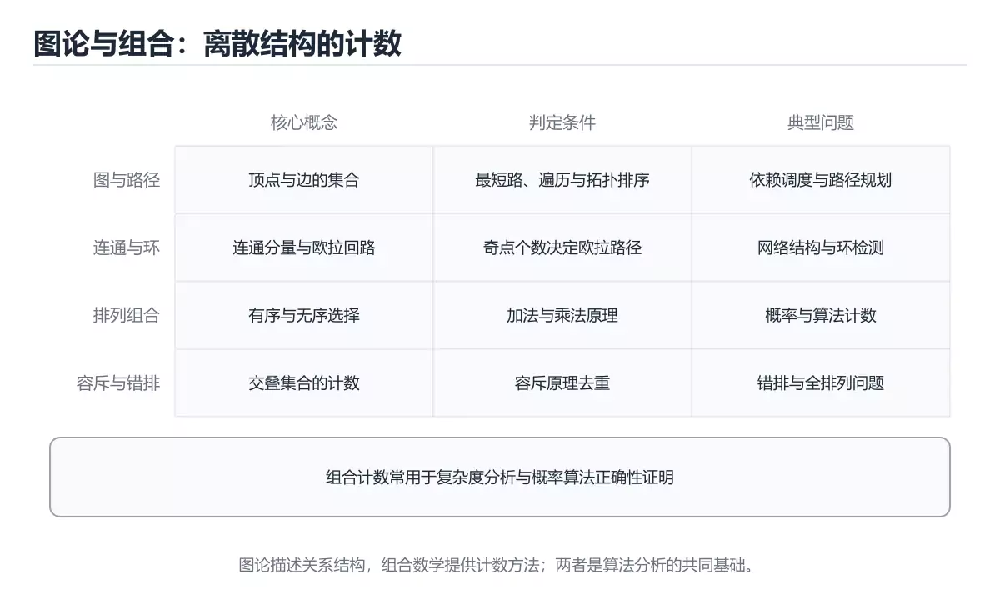
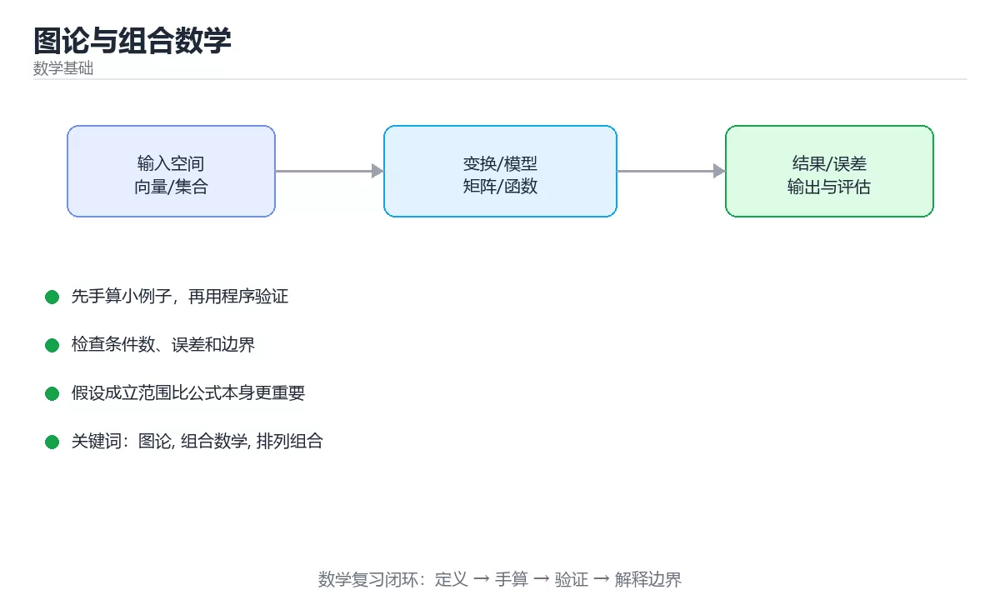

# 图论与组合数学

> 内容更新时间：2026-10-06 · 学习阶段：进阶 · 预计用时：40 分钟





## 本节知识框架

**课程定位**：所属分类 `math`（数学基础），课程主题 `图论与组合数学`，学习阶段 进阶，建议用时 35 分钟。

本课主线：图论判定条件、经典图算法与排列组合、容斥、错排计数。

**学完本课应当能够**
- 说清 `拓扑排序` 与 `欧拉路径` 的含义与区别，并各举一个正例和一个反例。
- 用本课示例验证 `并查集` 的行为，记录输入、输出与失败条件。
- 遇到「把有向关系当无向图」这类问题时，能说出触发条件与修复顺序。

### 从概念到验证的学习链条

1. `拓扑排序`：先掌握 把有向无环图排成线性顺序，使所有边都从前指向后，再用它解释 `欧拉路径` 为什么会出现。
2. `欧拉路径`：先掌握 恰好经过每条边一次的路径，存在与否同奇度顶点的个数直接相关，再用它解释 `并查集` 为什么会出现。
3. `并查集`：先掌握 维护元素所属集合的结构，带路径压缩与按秩合并后接近常数时间，再用它解释 `连通分量` 为什么会出现。
4. `连通分量`：先掌握 无向图里互相可达的极大顶点集合，可以用 DFS、BFS 或并查集求出，再用它解释 本课示例的观察结果 为什么会出现。

**先修与衔接**：本课是「数学基础」分类的第 7 课。相关或后续课程：《数值线性代数》。

### 完成判据

- **定义关**：不看正文也能说明 `拓扑排序` 是 把有向无环图排成线性顺序，使所有边都从前指向后，并指出一个反例。
- **机制关**：能按“输入 → 转换 → 输出 → 验证”复述 `图论与组合数学`，而不是只背结论。
- **示例关**：能运行或推演 `图论与组合数学` 的 `python` 示例，并说明一个真实出现的标识符或字面量。
- **证据关**：能指出 `图论与组合数学` 示例里的 调用了 `count_paths()`，并说明它支持或反驳了本课的哪一条结论。
- **排错关**：能复现 把有向关系当无向图，记录现象并按 先明确边的方向和语义 修复。
- **迁移关**：能把 `图论`、`组合数学`、`排列组合`、`容斥原理` 放进一个与 `图论与组合数学` 不同的项目场景，并保持输入与验证条件可追踪。
- **复盘关**：学完 `图论与组合数学` 后，用一句话写下仍然不确定的结论，并列出下一次验证需要的输入、环境和成功判据。

### 复习清单

- [ ] 能不看正文复述本课核心术语，并指出一个边界或反例。
- [ ] 能运行或推演本课示例，记录输入、输出与失败现象。
- [ ] 能完成一次自测，并把错题对照错误表定位原因。

## 核心概念定义

| 术语 | 操作性定义 | 常见边界与风险 |
| --- | --- | --- |
| 拓扑排序 | 把有向无环图排成线性顺序，使所有边都从前指向后。 | 只在「把有向无环图排成线性顺序，使所有边都从前指向后」这一前提下成立，换输入或换环境要重新验证。 |
| 欧拉路径 | 恰好经过每条边一次的路径，存在与否同奇度顶点的个数直接相关。 | 只在「恰好经过每条边一次的路径，存在与否同奇度顶点的个数直接相关」这一前提下成立，换输入或换环境要重新验证。 |
| 并查集 | 维护元素所属集合的结构，带路径压缩与按秩合并后接近常数时间。 | 易错：结论错误；正确做法是有向图用 SCC 或可达性搜索。 |
| 连通分量 | 无向图里互相可达的极大顶点集合，可以用 DFS、BFS 或并查集求出。 | 只在「无向图里互相可达的极大顶点集合，可以用 DFS、BFS 或并查集求出」这一前提下成立，换输入或换环境要重新验证。 |
| 无向图与有向图 | 边是否有方向 | 只在「边是否有方向」这一前提下成立，换输入或换环境要重新验证。 |
| 度 | 与该点相连的边数 | 只在「与该点相连的边数」这一前提下成立，换输入或换环境要重新验证。 |
| 路径与回路 | 顶点序列与首尾相连 | 只在「顶点序列与首尾相连」这一前提下成立，换输入或换环境要重新验证。 |
| 连通分量 | 互相可达的极大点集 | 只在「互相可达的极大点集」这一前提下成立，换输入或换环境要重新验证。 |
| 树 | 连通无环图，边数 = 点数 - 1 | 只在「连通无环图，边数 = 点数 - 1」这一前提下成立，换输入或换环境要重新验证。 |
| 二分图 | 顶点可分成两组内部无边 | 只在「顶点可分成两组内部无边」这一前提下成立，换输入或换环境要重新验证。 |
| DAG | 有向无环图 | 只在「有向无环图」这一前提下成立，换输入或换环境要重新验证。 |
| 平面图 | 可画在平面且边不交叉 | 只在「可画在平面且边不交叉」这一前提下成立，换输入或换环境要重新验证。 |

## 原理与运行机制

### 机制总览

**教材衔接：为什么需要它**

依赖解析、任务调度、社交关系、编译器优化，本质都是图论问题；而复杂度分析、概率方法、算法计数，靠的是组合数学。这一节把「建模成图」和「数得清楚」两件事讲透。

**教材衔接：经典判定速查**

| 问题 | 判定条件 | 算法 |
| --- | --- | --- |
| 是否存在欧拉回路 | 所有顶点度数为偶数且连通 | Hierholzer |
| 是否存在欧拉路径 | 恰有 0 或 2 个奇度顶点 | 同上 |
| 二分图判定 | 可二染色 | BFS 染色 O(V+E) |
| 是否含环（无向） | 并查集合并失败或 DFS 回边 | 并查集 O(E α) |
| 是否含环（有向） | 拓扑排序输出不足 V 个点 | Kahn 算法 |
| 最小生成树 | 连通无向图 | Kruskal / Prim |

**教材衔接：建模思路**

| 现实问题 | 图模型 | 常用算法 |
| --- | --- | --- |
| 任务依赖与编译顺序 | DAG | 拓扑排序 |
| 最短路线规划 | 带权有向图 | Dijkstra / A* |
| 网络连通与割点 | 无向图 | Tarjan |
| 好友推荐 | 无向图 | 共同邻居 |
| 课程与人员分配 | 二分图 | 匈牙利 / 最大流 |
| 代码依赖与循环引用 | 有向图 | 环检测 |
| 状态机可达性 | 有向图 | BFS/DFS |

### 机制拆解：每一步的输入、动作与输出

#### 1. `拓扑排序`
- 输入：`图论`；本步把 把有向无环图排成线性顺序，使所有边都从前指向后 当作判断规则。
- 动作：围绕 `拓扑排序` 保留中间状态，并记录它与 `欧拉路径` 的对应关系。
- 输出：`欧拉路径`，它可以被下一段代码、测试或记录继续使用。
- `拓扑排序` 的失败条件：只在「把有向无环图排成线性顺序，使所有边都从前指向后」这一前提下成立，换输入或换环境要重新验证。

#### 2. `欧拉路径`
- 输入：`拓扑排序`；本步把 恰好经过每条边一次的路径，存在与否同奇度顶点的个数直接相关 当作判断规则。
- 动作：围绕 `欧拉路径` 保留中间状态，并记录它与 `并查集` 的对应关系。
- 输出：`并查集`，它可以被下一段代码、测试或记录继续使用。
- `欧拉路径` 的失败条件：只在「恰好经过每条边一次的路径，存在与否同奇度顶点的个数直接相关」这一前提下成立，换输入或换环境要重新验证。

#### 3. `并查集`
- 输入：`欧拉路径`；本步把 维护元素所属集合的结构，带路径压缩与按秩合并后接近常数时间 当作判断规则。
- 动作：围绕 `并查集` 保留中间状态，并记录它与 `连通分量` 的对应关系。
- 输出：`连通分量`，它可以被下一段代码、测试或记录继续使用。
- `并查集` 的失败条件：当有向图用并查集判连通时，会出现结论错误。

#### 4. `连通分量`
- 输入：`并查集`；本步把 无向图里互相可达的极大顶点集合，可以用 DFS、BFS 或并查集求出 当作判断规则。
- 动作：围绕 `连通分量` 保留中间状态，并记录它与 `count_paths` 的对应关系。
- 输出：`count_paths`，它可以被下一段代码、测试或记录继续使用。
- `连通分量` 的失败条件：只在「无向图里互相可达的极大顶点集合，可以用 DFS、BFS 或并查集求出」这一前提下成立，换输入或换环境要重新验证。

### 示例中的可观察事实

1. 调用了 `count_paths()`；它对应的课程主题是 `图论与组合数学`。
2. 调用了 `frozenset()`；它对应的课程主题是 `图论与组合数学`。
3. 调用了 `range()`；它对应的课程主题是 `图论与组合数学`。
4. 调用了 `derangements()`；它对应的课程主题是 `图论与组合数学`。
5. 调用了 `binomial_mod()`；它对应的课程主题是 `图论与组合数学`。
6. 调用了 `min()`；它对应的课程主题是 `图论与组合数学`。
7. 调用了 `print()`；它对应的课程主题是 `图论与组合数学`。
8. 调用了 `comb()`；它对应的课程主题是 `图论与组合数学`。

### 复现实验记录

- 环境：`图论与组合数学` 使用 `python` 示例，固定 `图论`、`组合数学`、`排列组合`、`容斥原理` 作为第一组条件。
- 首轮输入：先确认 调用了 `count_paths()`，预测 `拓扑排序` 会怎样变化。
- 基线观察：记录命令、输入、输出和错误原文，不用截图代替可复制的文本。
- 单变量修改：只改变 `图论`，观察 `连通分量` 是否仍满足定义。
- 失败注入：复现 把有向关系当无向图，确认现象是 路径和可达性错误。
- 记录结论：把“修改前、修改后、预期变化、实际变化”写成四列表，这样复盘 `图论与组合数学` 时才能区分概念错误与实现错误。

## 典型应用场景

- **把有向关系当无向图**：典型现象是路径和可达性错误；正确做法是先明确边的方向和语义。
- **计数时重复计算同一对象**：典型现象是结果偏大；正确做法是使用集合划分或容斥避免重叠。
- **忽略图不一定连通**：典型现象是算法只处理一个分量；正确做法是遍历所有分量并考虑孤立点。
- **把 NP 完全问题硬求最优**：典型现象是规模稍大就超时；正确做法是改用近似、启发式或限制规模。

### 最小验证场景

- 准备：保留 `python` 示例的原始输入，先记录 `图论与组合数学` 的基线输出和完整运行命令。
- 观察：先核对 调用了 `count_paths()`，再改变一个与 `拓扑排序` 相关的条件。
- 判定：新结果与 `图论与组合数学` 的基线不同不等于错误；只有当差异破坏了 `拓扑排序` 的定义或错误表中的约束，才判定为失败。

### 选择与边界

- 使用 `拓扑排序` 时，先满足它的定义：把有向无环图排成线性顺序，使所有边都从前指向后；只在「把有向无环图排成线性顺序，使所有边都从前指向后」这一前提下成立，换输入或换环境要重新验证。
- 使用 `欧拉路径` 时，先满足它的定义：恰好经过每条边一次的路径，存在与否同奇度顶点的个数直接相关；只在「恰好经过每条边一次的路径，存在与否同奇度顶点的个数直接相关」这一前提下成立，换输入或换环境要重新验证。
- 使用 `并查集` 时，先满足它的定义：维护元素所属集合的结构，带路径压缩与按秩合并后接近常数时间；易错：结论错误；正确做法是有向图用 SCC 或可达性搜索。
- 使用 `连通分量` 时，先满足它的定义：无向图里互相可达的极大顶点集合，可以用 DFS、BFS 或并查集求出；只在「无向图里互相可达的极大顶点集合，可以用 DFS、BFS 或并查集求出」这一前提下成立，换输入或换环境要重新验证。

## 代码/协议/SQL 示例

**教材衔接：组合数学速查**

| 计数对象 | 公式 | 例子 |
| --- | --- | --- |
| 排列 | `P(n,k) = n!/(n-k)!` | 5 人排 3 个位置 = 60 |
| 组合 | `C(n,k) = n!/(k!(n-k)!)` | 从 5 人选 3 人 = 10 |
| 可重复排列 | `n^k` | 4 位密码（0-9）= 10⁴ |
| 可重复组合 | `C(n+k-1, k)` | 3 种水果取 5 个的方案数 |
| 圆排列 | `(n-1)!` | 圆桌就座 |
| 错排 | `D(n) = n! Σ(-1)^k/k!` | 全放错的信封数 |
| 容斥 | `\|A∪B\| = \|A\|+\|B\|-\|A∩B\|` | 计算并集大小 |

计数技巧：分类相加、分步相乘、正难则反（用总数减不合法）、容斥处理重叠、对称性简化、递推建模。

```python
from itertools import combinations, permutations
from math import comb, factorial

def count_paths(grid_size: int, blocked: set = frozenset()) -> int:
    """网格路径计数（只能向右或向下），带障碍时用动态规划。"""
    n = grid_size
    dp = [[0] * n for _ in range(n)]
    for r in range(n):
        for c in range(n):
            if (r, c) in blocked:
                continue
            if r == 0 and c == 0:
                dp[r][c] = 1
            else:
                from_top = dp[r - 1][c] if r > 0 else 0
                from_left = dp[r][c - 1] if c > 0 else 0
                dp[r][c] = from_top + from_left
    return dp[-1][-1]

def derangements(n: int) -> int:
    """错排数：递推 D(n) = (n-1)(D(n-1) + D(n-2))。"""
    if n == 0:
        return 1
    if n == 1:
        return 0
    prev2, prev1 = 1, 0
    for k in range(2, n + 1):
        prev2, prev1 = prev1, (k - 1) * (prev1 + prev2)
    return prev1

def binomial_mod(n: int, k: int, mod: int) -> int:
    """组合数取模：乘法递推避免阶乘溢出。"""
    k = min(k, n - k)
    result = 1
    for i in range(1, k + 1):
        result = result * (n - k + i) // i
    return result % mod

print(comb(5, 3), len(list(permutations(range(5), 3))))
print(count_paths(3), count_paths(3, {(1, 1)}))
print(derangements(4), binomial_mod(100, 50, 10 ** 9 + 7))
```

**教材衔接：深入补充：图论与组合数学**

前面已经建立了基本概念。这一节换一个角度，把图论与组合数学放进真实工程里，
重点回答三件事：binomial_mod 解决什么问题、依赖哪些前提、在什么条件下失效。

### 一、核心模型

图论研究顶点与边的关系，组合数学研究离散对象的计数、排列与结构；两者一起为算法复杂度、网络分析、概率计数和调度问题提供语言。

```text
把问题抽象为对象与关系 → 选择图模型 → 定义不变量 → 计数或构造 → 证明边界 → 设计算法
```

### 二、关键机制拆解

1. 无向图、有向图、加权图和二分图分别表达不同关系，建模错误会比算法错误更致命。
2. 度、路径、连通分量、环、树和生成树是最基础的结构概念，树是连通且无环的图。
3. 握手引理说明所有顶点度数之和等于边数的两倍，奇度顶点个数必为偶数。
4. 排列关注顺序，组合关注选择；加法原理、乘法原理、容斥和鸽巢原理是计数基础。
5. 二项式系数、递推关系和生成函数能把复杂计数转成可计算形式。
6. 图着色、匹配、覆盖和流问题是组合优化的经典模型，常用于调度和资源分配。
7. NP 完全问题提醒我们：找不到多项式算法时，要考虑近似、参数化或约束规模。

### 三、对照表：抓住容易混淆的边界

| 维度 | 一侧 | 另一侧 |
| --- | --- | --- |
| 排列 | 顺序不同算不同结果 | n!/(n-k)! 类计数 |
| 组合 | 只关心选了哪些元素 | n choose k 类计数 |
| 树 | 连通且无环 | 边数等于顶点数减一 |
| 一般图 | 可能含环和多个连通分量 | 需要遍历、最短路或匹配算法 |

### 四、工作示例

安排 5 个人参加 3 个会议，每人只能去一个会议且每个会议至少 1 人。可以先把问题转换为集合划分，再用组合计数或生成函数求方案数；若增加容量限制，则转换为带约束的匹配或流模型。

### 五、常见误区与失效边界

| 错误做法或假设 | 后果 | 正确做法 |
| --- | --- | --- |
| 把有向关系当无向图 | 路径和可达性错误 | 先明确边的方向和语义 |
| 计数时重复计算同一对象 | 结果偏大 | 使用集合划分或容斥避免重叠 |
| 忽略图不一定连通 | 算法只处理一个分量 | 遍历所有分量并考虑孤立点 |
| 把 NP 完全问题硬求最优 | 规模稍大就超时 | 改用近似、启发式或限制规模 |

### 六、场景推演

设计任务调度：任务依赖构成有向无环图，需要在有限机器上排期。先做拓扑排序判断是否有环，再按关键路径确定最短工期，最后用贪心或整数规划处理资源约束。

### 七、自测问答

**Q1：树和一般图的关键区别是什么？**

树连通且无环，任意两点之间有唯一简单路径。

**Q2：排列和组合的核心区别是什么？**

排列关心顺序，组合只关心选择了哪些元素。

**Q3：为什么奇度顶点个数必为偶数？**

所有度数之和等于边数两倍，是偶数，因此奇度顶点必须成对出现。

**Q4：遇到 NP 完全问题应该怎么办？**

根据规模选择近似、参数化、启发式或重新定义问题。

### 八、小项目：把知识变成可检查的产出

为一个小型课程安排系统建模：学生、课程、时间和教室构成二分或多部图；先画出依赖图，再计算一个可行排期，并用组合计数求出不考虑冲突时的理论方案数。

### 九、适用边界

图论和组合数学提供建模与证明工具，不直接给出工程实现。实际系统还要处理输入噪声、规模、并发和约束变化，因此模型必须可验证、可回退。

### 十、完成检查清单

- [ ] 能把文字问题抽象成图模型
- [ ] 能使用握手引理和基本计数原理
- [ ] 能区分排列、组合与划分
- [ ] 能判断问题是否可能 NP 完全
- [ ] 能用图算法解决一个调度问题

### 十一、复习顺序

1. 不看资料讲清「图论与组合数学」的核心模型，并各举一个正例和反例。
2. 再对照表逐行解释容易混淆的概念，每个概念补一个反例。
3. 跟着工作示例做一遍，改变一个条件并预测结果。
4. 用自测问答检查理解，错题回到对应小节重新阅读。
5. 最后完成 图论 的小项目，把结果、失败记录和复查清单整理成可提交产物。

> 复习不是重读一遍，而是离开原文重新产出：复述、改写、验证、复盘。

**运行方式**：运行 `图论与组合数学` 的示例时，保存为 `.py` 文件后用 `python 文件名.py` 运行；第三方依赖先在虚拟环境里安装。

### 示例精读：先找证据，再改一个条件

1. 调用了 `count_paths()`；它出现在 `图论与组合数学` 的示例中，阅读时先确认它前后各发生了什么。
2. 调用了 `frozenset()`；它出现在 `图论与组合数学` 的示例中，阅读时先确认它前后各发生了什么。
3. 调用了 `range()`；它出现在 `图论与组合数学` 的示例中，阅读时先确认它前后各发生了什么。
4. 调用了 `derangements()`；它出现在 `图论与组合数学` 的示例中，阅读时先确认它前后各发生了什么。
5. 调用了 `binomial_mod()`；它出现在 `图论与组合数学` 的示例中，阅读时先确认它前后各发生了什么。
6. 调用了 `min()`；它出现在 `图论与组合数学` 的示例中，阅读时先确认它前后各发生了什么。
7. 调用了 `print()`；它出现在 `图论与组合数学` 的示例中，阅读时先确认它前后各发生了什么。
8. 调用了 `comb()`；它出现在 `图论与组合数学` 的示例中，阅读时先确认它前后各发生了什么。
- 在 `图论与组合数学` 中与 `拓扑排序` 对照：示例必须能支持 把有向无环图排成线性顺序，使所有边都从前指向后，否则说明这一段还缺少实现或验证步骤。
- 在 `图论与组合数学` 中与 `欧拉路径` 对照：示例必须能支持 恰好经过每条边一次的路径，存在与否同奇度顶点的个数直接相关，否则说明这一段还缺少实现或验证步骤。
- 在 `图论与组合数学` 中与 `并查集` 对照：示例必须能支持 维护元素所属集合的结构，带路径压缩与按秩合并后接近常数时间，否则说明这一段还缺少实现或验证步骤。
- 在 `图论与组合数学` 中与 `连通分量` 对照：示例必须能支持 无向图里互相可达的极大顶点集合，可以用 DFS、BFS 或并查集求出，否则说明这一段还缺少实现或验证步骤。

## 时间/空间复杂度或性能分析

**复杂度证据**：本课正文出现 `O(V+E)`、`O(E α)` 等量级表达式；使用前要同时确认输入规模、最好/平均/最坏情况以及常数项来源。

**测量方法**：以 `图论与组合数学` 的 `图论` 场景为对象，固定输入跑一遍记录基线，再把规模或并发度提高一个数量级复测；两次结果的差值与波动范围才是结论依据。

### 需要控制的变量与记录项

- `图论与组合数学` 的 `图论`：固定它的版本、输入范围和资源上限，分别记录速度、内存与失败率的变化。
- `图论与组合数学` 的 `组合数学`：固定它的版本、输入范围和资源上限，分别记录速度、内存与失败率的变化。
- `图论与组合数学` 的 `排列组合`：固定它的版本、输入范围和资源上限，分别记录速度、内存与失败率的变化。
- `图论与组合数学` 的 `容斥原理`：固定它的版本、输入范围和资源上限，分别记录速度、内存与失败率的变化。
- `图论与组合数学` 的 `拓扑排序`：固定它的版本、输入范围和资源上限，分别记录速度、内存与失败率的变化。
- `图论与组合数学` 中 `拓扑排序` 的边界：只在「把有向无环图排成线性顺序，使所有边都从前指向后」这一前提下成立，换输入或换环境要重新验证。达到边界时不要外推，必须重新测量。
- `图论与组合数学` 中 `欧拉路径` 的边界：只在「恰好经过每条边一次的路径，存在与否同奇度顶点的个数直接相关」这一前提下成立，换输入或换环境要重新验证。达到边界时不要外推，必须重新测量。
- `图论与组合数学` 中 `并查集` 的边界：易错：结论错误；正确做法是有向图用 SCC 或可达性搜索。达到边界时不要外推，必须重新测量。
- `图论与组合数学` 中 `连通分量` 的边界：只在「无向图里互相可达的极大顶点集合，可以用 DFS、BFS 或并查集求出」这一前提下成立，换输入或换环境要重新验证。达到边界时不要外推，必须重新测量。
- `图论与组合数学` 的代码证据：先验证 调用了 `count_paths()`，再记录该路径的输入规模与耗时；只看代码行数不能推出复杂度。

## 常见误区与易错点

| 容易写错的做法 | 实际现象 | 原因与正确做法 |
| --- | --- | --- |
| 把有向关系当无向图 | 路径和可达性错误 | 先明确边的方向和语义 |
| 计数时重复计算同一对象 | 结果偏大 | 使用集合划分或容斥避免重叠 |
| 忽略图不一定连通 | 算法只处理一个分量 | 遍历所有分量并考虑孤立点 |
| 把 NP 完全问题硬求最优 | 规模稍大就超时 | 改用近似、启发式或限制规模 |
| 组合数直接用阶乘相除 | 大数溢出或极慢 | 用乘法递推或取模运算 |
| 混淆排列与组合 | 结果差 k! 倍 | 先判断顺序是否重要 |
| 有向图用并查集判连通 | 结论错误 | 有向图用 SCC 或可达性搜索 |
| 判断欧拉路只看度数 | 忽略了连通性 | 度数条件加连通性检查 |
| 用 DFS 判断深图 | 栈溢出 | 改迭代或增大栈 |
| 忘记处理孤立点 | 遍历漏点 | 从每个未访问点启动 |
| 计数时重复统计 | 结果偏大 | 用容斥或明确分区 |
| 忽略对称性导致重复解 | 组合爆炸 | 排序后去重或固定枚举顺序 |
| 用浮点算组合数 | 精度丢失 | 整数运算 |
| 认为 NP 难问题无解 | 放弃优化 | 用小规模精确解 + 大规模启发式 |

### 现场 1：把有向关系当无向图

**症状**：路径和可达性错误。

**根因与修复**：先明确边的方向和语义。

**自检**：在本课示例里复现「把有向关系当无向图」，改成先明确边的方向和语义后重跑；如果症状消失且失败路径按预期变化，说明定位正确。

### 现场 2：计数时重复计算同一对象

**症状**：结果偏大。

**根因与修复**：使用集合划分或容斥避免重叠。

**自检**：在本课示例里复现「计数时重复计算同一对象」，改成使用集合划分或容斥避免重叠后重跑；如果症状消失且失败路径按预期变化，说明定位正确。

### 现场 3：忽略图不一定连通

**症状**：算法只处理一个分量。

**根因与修复**：遍历所有分量并考虑孤立点。

**自检**：在本课示例里复现「忽略图不一定连通」，改成遍历所有分量并考虑孤立点后重跑；如果症状消失且失败路径按预期变化，说明定位正确。

### 现场 4：把 NP 完全问题硬求最优

**症状**：规模稍大就超时。

**根因与修复**：改用近似、启发式或限制规模。

**自检**：在本课示例里复现「把 NP 完全问题硬求最优」，改成改用近似、启发式或限制规模后重跑；如果症状消失且失败路径按预期变化，说明定位正确。

### 现场 5：组合数直接用阶乘相除

**症状**：大数溢出或极慢。

**根因与修复**：用乘法递推或取模运算。

**自检**：在本课示例里复现「组合数直接用阶乘相除」，改成用乘法递推或取模运算后重跑；如果症状消失且失败路径按预期变化，说明定位正确。

### 现场 6：混淆排列与组合

**症状**：结果差 k! 倍。

**根因与修复**：先判断顺序是否重要。

**自检**：在本课示例里复现「混淆排列与组合」，改成先判断顺序是否重要后重跑；如果症状消失且失败路径按预期变化，说明定位正确。

### 现场 7：有向图用并查集判连通

**症状**：结论错误。

**根因与修复**：有向图用 SCC 或可达性搜索。

**自检**：在本课示例里复现「有向图用并查集判连通」，改成有向图用 SCC 或可达性搜索后重跑；如果症状消失且失败路径按预期变化，说明定位正确。

### 现场 8：判断欧拉路只看度数

**症状**：忽略了连通性。

**根因与修复**：度数条件加连通性检查。

**自检**：在本课示例里复现「判断欧拉路只看度数」，改成度数条件加连通性检查后重跑；如果症状消失且失败路径按预期变化，说明定位正确。

### 现场 9：用 DFS 判断深图

**症状**：栈溢出。

**根因与修复**：改迭代或增大栈。

**自检**：在本课示例里复现「用 DFS 判断深图」，改成改迭代或增大栈后重跑；如果症状消失且失败路径按预期变化，说明定位正确。

## 与其他知识点的关系

- **相关或后续**：`数值线性代数`。本课术语会在这些课程里继续使用。
- **术语归属**：`拓扑排序`、`欧拉路径`、`并查集` 的定义以本课「核心概念定义」为准，换到其他课程时先确认定义是否被改写。

### 先修与后续术语接口

- `数值线性代数`：两者通过本分类的学习顺序衔接，阅读时重点比较各自的输入与失败条件。

### 容易混淆的相邻概念

- `拓扑排序` 与 `欧拉路径`：前者强调 把有向无环图排成线性顺序，使所有边都从前指向后；后者强调 恰好经过每条边一次的路径，存在与否同奇度顶点的个数直接相关。判断时分别检查两条定义的适用范围，不要只看名称相似就互换。
- `欧拉路径` 与 `并查集`：前者强调 恰好经过每条边一次的路径，存在与否同奇度顶点的个数直接相关；后者强调 维护元素所属集合的结构，带路径压缩与按秩合并后接近常数时间。判断时分别检查两条定义的适用范围，不要只看名称相似就互换。
- `并查集` 与 `连通分量`：前者强调 维护元素所属集合的结构，带路径压缩与按秩合并后接近常数时间；后者强调 无向图里互相可达的极大顶点集合，可以用 DFS、BFS 或并查集求出。判断时分别检查两条定义的适用范围，不要只看名称相似就互换。

## 自测题与参考答案

> 先独立作答，再对照参考答案；答案都能在本课正文、术语表或错误表里找到依据。

### 自测 1（概念复述）

不看正文，写出 `拓扑排序` 的操作性定义，并说明它与 `欧拉路径` 的区别。

**参考答案**：把有向无环图排成线性顺序，使所有边都从前指向后。

`欧拉路径` 的定位是：恰好经过每条边一次的路径，存在与否同奇度顶点的个数直接相关；两者的差别要从适用对象与失败模式上说明。

### 自测 2（排错）

本课错误表记录了「把有向关系当无向图」这类做法。请写出它会出现的现象、根因，以及修复顺序。

**参考答案**：现象是路径和可达性错误；正确做法是先明确边的方向和语义。修复时先复现现象并保留证据，再改动一处假设重跑，确认现象消失。

### 自测 3（动手验证）

运行本课的 `python` 示例，把其中的 `"网格路径计数（只能向右或向下），带障碍时用动态规划。"` 换成一个边界值后重新运行，记录输出与错误信息。

**参考答案**：正常输入下 `python` 示例应当复现正文给出的结果；把 `"网格路径计数（只能向右或向下），带障碍时用动态规划。"` 换成边界值后，如果结果改变或报错，先核对它是否满足 `图论与组合数学` 中`拓扑排序` 的适用范围，再检查错误表里是否有同类现象。

### 自测 4（代码阅读）

阅读本课开头的 `python` 示例，说明它体现了`拓扑排序` 的哪一条性质，并指出改动哪个输入会让这条性质不再成立。

**参考答案**：`拓扑排序` 的定义是 把有向无环图排成线性顺序，使所有边都从前指向后，示例正是在实现这条定义。改动与 `拓扑排序` 有关的一个输入后，如果结果不再符合 `图论与组合数学` 的正文描述，就说明该性质只在当前前提成立。

### 自测 5（迁移）

把 `图论与组合数学` 的方法迁移到自己的项目：围绕 `拓扑排序` 写出一个与错误表同类的风险点，并说明触发条件和检验方式。

**参考答案**：例如「认为 NP 难问题无解」，它会导致放弃优化；检验方式是按用小规模精确解 + 大规模启发式改一处再复现，确认现象消失且没有引入新的失败分支。

### 自测 6（对比）

用一个表格对比 `拓扑排序` 与 `欧拉路径`：各写一行适用场景、一行失败表现。

**参考答案**：`拓扑排序` 的定义是把有向无环图排成线性顺序，使所有边都从前指向后；`欧拉路径` 的定义是恰好经过每条边一次的路径，存在与否同奇度顶点的个数直接相关。两者的失败表现分别对应本课错误表里与本术语相关的行。

### 自测 7（排错顺序）

面对「把有向关系当无向图」引发的问题，请把“复现 路径和可达性错误 → 保留证据 → 先明确边的方向和语义 → 回归验证”四步写成可执行的检查清单。

**参考答案**：第一步按路径和可达性错误复现；第二步记录输入、版本与完整报错；第三步按先明确边的方向和语义只改一处；第四步重跑并确认失败路径也按预期变化。

### 自测 8（边界判断）

针对 `连通分量`，分别写出“可以使用”的条件和“结论不再成立”的条件。

**参考答案**：只在「无向图里互相可达的极大顶点集合，可以用 DFS、BFS 或并查集求出」这一前提下成立，换输入或换环境要重新验证。 同时要把 `连通分量` 的定义 无向图里互相可达的极大顶点集合，可以用 DFS、BFS 或并查集求出 与实际输入逐项对照。

### 自测 9（机制重建）

不看正文，按输入、转换、输出、验证四段重建 `拓扑排序` → `欧拉路径` → `并查集` → `连通分量` 的作用链。

**参考答案**：起点是 `拓扑排序` 的定义 把有向无环图排成线性顺序，使所有边都从前指向后；中间每一步都保留可观察状态；终点由 `连通分量` 检查，失败时回到错误表定位第一个偏离定义的步骤。

### 自测 10（综合排错）

在 `图论与组合数学` 中，现象是 放弃优化。请围绕 认为 NP 难问题无解 写出最小复现、关键证据、修复动作和回归验证，并说明为什么不能只凭一次运行下结论。

**参考答案**：先复现 认为 NP 难问题无解，记录输入与完整错误；再按 用小规模精确解 + 大规模启发式 只改一处。回归时同时跑正常路径和边界路径，只有两次结果都可解释，才把修复视为完成。

### 自测 11（一分钟复述）

用每分钟约 200 字的速度复述 `图论与组合数学`：先给主问题，再按顺序说出 `拓扑排序`、`欧拉路径`、`并查集`、`连通分量`，最后给一个失败案例。

**自评标准**：主问题必须对应 图论判定条件、经典图算法与排列组合、容斥、错排计数；每个术语都要能接上一句定义或边界；失败案例必须写成可观察现象，不能用“可能有风险”代替证据。

## 术语速查

| 术语 | 一句话说明 |
| --- | --- |
| `拓扑排序` | 把有向无环图排成线性顺序，使所有边都从前指向后。 |
| `欧拉路径` | 恰好经过每条边一次的路径，存在与否同奇度顶点的个数直接相关。 |
| `并查集` | 维护元素所属集合的结构，带路径压缩与按秩合并后接近常数时间。 |
| `连通分量` | 无向图里互相可达的极大顶点集合，可以用 DFS、BFS 或并查集求出。 |

**术语关系**：`拓扑排序`（把有向无环图排成线性顺序） → `欧拉路径`（恰好经过每条边一次的路径） → `并查集`（维护元素所属集合的结构） → `连通分量`（无向图里互相可达的极大顶点集合）。

## 考点精讲

`图论与组合数学` 的题库有 6 道题，下面逐题给出题干、正确项与判断依据：先自己作答，再核对正确项，最后回到正文对应小节复核。

### 考点 1：第 1 题

- **题目**：围绕“图论与组合数学”中的 图论、组合数学、排列组合，下列哪两项是本课强调的实践判断？
- **正确项**：学习 图论 时要同时说明输入、输出和失败路径，不能只看正常流程；验证 组合数学 时要固定版本并覆盖边界输入，结论才可复现
- **判断依据**：这道题检验本课主问题：图论判定条件、经典图算法与排列组合、容斥、错排计数。复习时先复述本课主问题，再举一个会让结论失效的输入。

### 考点 2：第 2 题

- **题目**：按“图论与组合数学”中 图论、组合数学、排列组合 的实践顺序，把四个步骤排成从准备到复盘的合理顺序。
- **正确项**：先明确 图论 的输入、输出与约束 → 写出最小示例并核对 组合数学 的基线结果 → 只改一个变量，记录边界与失败路径的变化 → 固定版本与证据，把“图论与组合数学”的结论写成可复现记录
- **判断依据**：这道题检验本课主问题：图论判定条件、经典图算法与排列组合、容斥、错排计数。复习时先复述本课主问题，再举一个会让结论失效的输入。

### 考点 3：第 3 题

- **题目**：从 5 个人中选 3 人组成小组（不考虑顺序），共有多少种选法？
- **正确项**：10
- **判断依据**：这道题检验本课主问题：图论判定条件、经典图算法与排列组合、容斥、错排计数。复习时先复述本课主问题，再举一个会让结论失效的输入。

### 考点 4：第 4 题

- **题目**：计算多个集合并集的大小时，正确工具是？
- **正确项**：容斥原理：交替加减交集项
- **判断依据**：这道题检验本课主问题：图论判定条件、经典图算法与排列组合、容斥、错排计数。复习时先复述本课主问题，再举一个会让结论失效的输入。

### 考点 5：第 5 题

- **题目**：用组合数公式计算 C(100,50) 时，为什么推荐乘法递推而不是阶乘相除？
- **正确项**：因为阶乘会迅速超出整数范围并带来巨大的中间值
- **判断依据**：这道题检验本课主问题：图论判定条件、经典图算法与排列组合、容斥、错排计数。复习时先复述本课主问题，再举一个会让结论失效的输入。

### 考点 6：第 6 题

- **题目**：`图论与组合数学` 的示例代码服务于“图论判定条件、经典图算法与排列组合、容斥、错排计数。”。哪一条判断是正确的？
- **正确项**：所有顶点度数为偶数且图连通（孤立点除外）
- **判断依据**：这道题检验本课主问题：图论判定条件、经典图算法与排列组合、容斥、错排计数。复习时先复述本课主问题，再举一个会让结论失效的输入。

### 考点 7：`拓扑排序`

- **要点**：把有向无环图排成线性顺序，使所有边都从前指向后。
- **拓扑排序 的边界**：只在「把有向无环图排成线性顺序，使所有边都从前指向后」这一前提下成立，换输入或换环境要重新验证。

### 考点 8：`欧拉路径`

- **要点**：恰好经过每条边一次的路径，存在与否同奇度顶点的个数直接相关。
- **欧拉路径 的边界**：只在「恰好经过每条边一次的路径，存在与否同奇度顶点的个数直接相关」这一前提下成立，换输入或换环境要重新验证。

### 考点 9：`并查集`

- **要点**：维护元素所属集合的结构，带路径压缩与按秩合并后接近常数时间。
- **并查集 的边界**：易错：结论错误；正确做法是有向图用 SCC 或可达性搜索。

### 考点 10：`连通分量`

- **要点**：无向图里互相可达的极大顶点集合，可以用 DFS、BFS 或并查集求出。
- **连通分量 的边界**：只在「无向图里互相可达的极大顶点集合，可以用 DFS、BFS 或并查集求出」这一前提下成立，换输入或换环境要重新验证。

### 考点 11：排错——把有向关系当无向图

- **现象**：路径和可达性错误。
- **处理**：先明确边的方向和语义。

### 考点 12：排错——计数时重复计算同一对象

- **现象**：结果偏大。
- **处理**：使用集合划分或容斥避免重叠。

### 考点 13：综合辨析——`拓扑排序` 与 `连通分量`

- **辨析点**：`拓扑排序` 的定义是 把有向无环图排成线性顺序，使所有边都从前指向后；`连通分量` 的定义是 无向图里互相可达的极大顶点集合，可以用 DFS、BFS 或并查集求出。
- **答题要求**：面对 `图论与组合数学` 的题目，先判断描述的是 `拓扑排序` 还是 `连通分量`，再归到对应定义，最后写出一个会让该定义失效的边界输入。

### 考点 14：排错评分点

- **现象分**：能写出 路径和可达性错误，而不是只写“程序有错”。
- **证据分**：保留触发 把有向关系当无向图 的输入、版本和错误原文。
- **修复分**：按 先明确边的方向和语义 只改一处，并同时回归正常路径与边界路径。

## 内容元数据

- 内容版本：v2.0
- 最后更新：2026-10-06
- 学习阶段：进阶
- 适用环境：线性代数、概率统计与优化基础
；本课聚焦 图论。
- 内容来源：内置结构化课程与工程实践整理
- 相关主题：图论、组合数学、排列组合、容斥原理、拓扑排序、二分图
- 质量版本：P0 测验标准 + P1 覆盖扩展 + P2 体验补全

## 参考资料与复核

- 最后复核：2026-10-04
- 下次复核：2027-09-24
- 复核范围：版本兼容、API 行为、安全建议与工程实践
- 来源性质：官方文档、标准或权威教材；本课核对关键词：图论、组合数学、排列组合、容斥原理、拓扑排序、二分图。

| 参考资料 | 本课用途 |
| --- | --- |
| [MIT 离散数学](https://ocw.mit.edu/courses/6-042j-mathematics-for-computer-science-fall-2010/) | 逻辑、证明与离散结构 |
| [OEIS 数列百科](https://oeis.org/) | 整数序列与组合关系 |
| [NIST 数字图书馆](https://www.nist.gov/pml) | 计量、数值与科学数据 |

| [本课术语索引：图论与组合数学](#核心概念定义) | 按本课输入、术语边界和错误表现逐项核对 |
> 「图论与组合数学」的链接用于离线阅读后的延伸核对；App 不会自动联网。