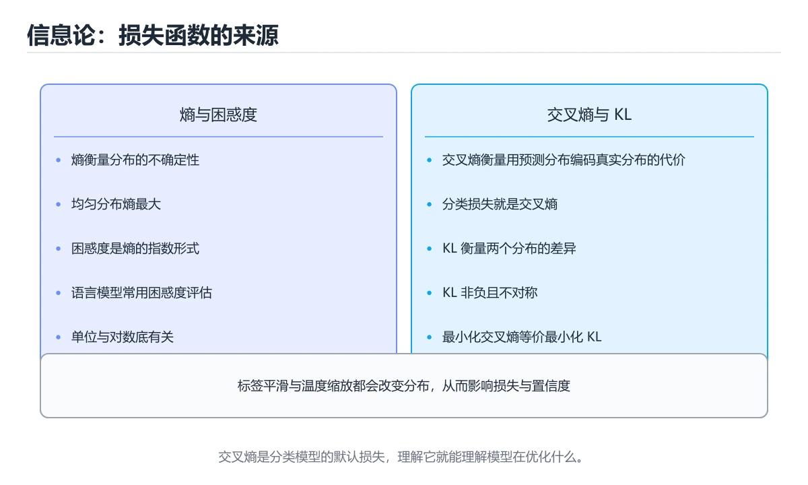
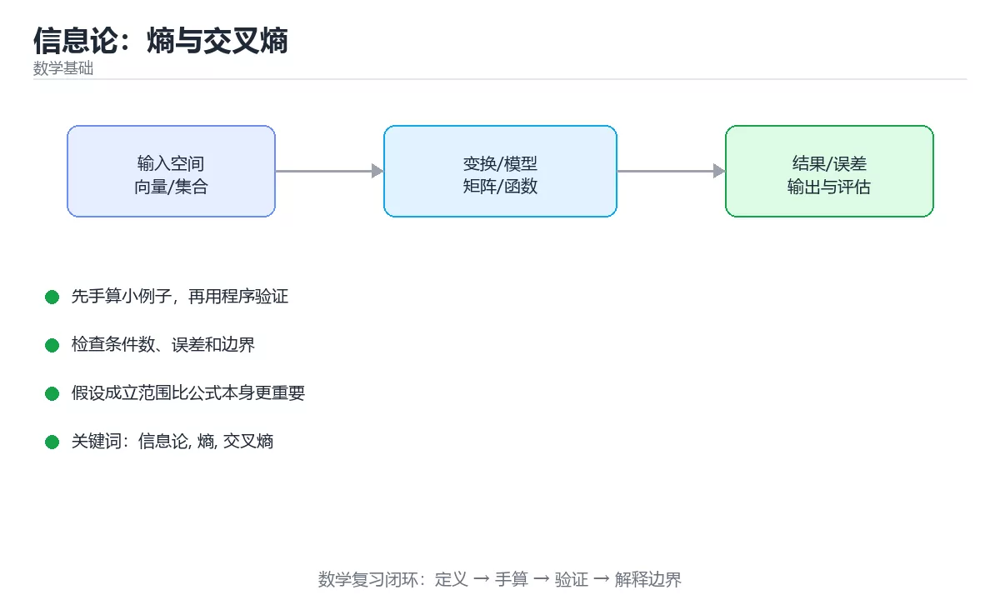

# 信息论：熵与交叉熵

> 内容更新时间：2026-10-06 · 学习阶段：进阶 · 预计用时：35 分钟





## 学习目标

- 能用自己的话解释信息论：熵与交叉熵解决了什么问题，而不是只背术语。
- 能说清 「信息论」、「熵」、「交叉熵」、「KL散度」 之间的关系，并分别举出一个例子。
- 能把 信息论 放回「信息论：熵与交叉熵」的知识体系，说明它和 熵 的边界。
- 能完成本课练习，并用验收标准检查自己的结果。

> 一句话摘要：熵、交叉熵、KL 散度与困惑度，以及它们与损失函数的关系。

## 前置知识

- 先完成上一课《概率统计与假设检验》；如果已经掌握，可以直接用本课练习自测。
- 本课阶段：进阶。建议先完成「概率统计与假设检验」，或确认自己能独立跑通正文里的 ValueError 示例。
- 开始前先复习：信息论、熵、交叉熵。
- 如果 为什么需要它 这一步看不懂，先记录具体卡点，再用 ValueError 复现一遍。

## 为什么需要它

分类模型的损失函数、语言模型的困惑度、特征选择与压缩，背后都是信息论里的几个量。理解它们，才能看懂「为什么交叉熵是分类的默认损失」。

## 核心概念速查

| 概念 | 公式 | 含义 |
| --- | --- | --- |
| 信息量 | `-log p` | 概率越小，事件信息量越大 |
| 熵 H(X) | `-Σ p log p` | 分布的不确定度（底数为 2 时单位是 bit） |
| 联合熵 | `-Σ p(x,y) log p(x,y)` | 两个变量一起的不确定度 |
| 条件熵 | `H(X\|Y)` | 已知 Y 后 X 剩余的不确定度 |
| 互信息 | `I(X;Y) = H(X) - H(X\|Y)` | 两个变量共享的信息量 |
| 交叉熵 | `H(p,q) = -Σ p log q` | 用分布 q 编码真实分布 p 的平均代价 |
| KL 散度 | `D(p‖q) = H(p,q) - H(p)` | 用 q 近似 p 的额外代价，非负且不对称 |
| 困惑度 | `2^H` 或 `exp(交叉熵)` | 语言模型常用，越低越好 |

关键恒等式：`交叉熵 = 熵 + KL 散度`。训练时真实分布 p 固定，所以最小化交叉熵等价于最小化 KL 散度。

```python
import math

def entropy(probabilities: list) -> float:
    """香农熵：分布越均匀，熵越大。"""
    return -sum(p * math.log2(p) for p in probabilities if p > 0)

def cross_entropy(p: list, q: list) -> float:
    """交叉熵：p 是真实分布，q 是预测分布。"""
    if len(p) != len(q):
        raise ValueError("分布长度不一致")
    return -sum(pi * math.log2(qi) for pi, qi in zip(p, q) if pi > 0 and qi > 0)

def kl_divergence(p: list, q: list) -> float:
    """KL 散度：非负，且与参数顺序有关。"""
    return cross_entropy(p, q) - entropy(p)

def one_hot_cross_entropy(correct_index: int, probs: list) -> float:
    """分类任务的实际形式：只保留正确类别的 -log q。"""
    return -math.log(probs[correct_index])

uniform = [0.25, 0.25, 0.25, 0.25]
peaked = [0.97, 0.01, 0.01, 0.01]
print(round(entropy(uniform), 4), round(entropy(peaked), 4))
print(round(kl_divergence([0.7, 0.3], [0.5, 0.5]), 4))
print(round(one_hot_cross_entropy(0, [0.9, 0.05, 0.03, 0.02]), 4))
```

## 从熵到损失函数

| 场景 | 使用的量 | 说明 |
| --- | --- | --- |
| 多分类训练 | 交叉熵损失 | 等价于最大似然估计 |
| 知识蒸馏 | KL 散度 | 让学生分布逼近教师分布 |
| 语言模型评估 | 困惑度 | 交叉熵的指数 |
| 特征选择 | 互信息 | 与标签共享信息越多越有用 |
| 决策树分裂 | 信息增益 | 分裂前后熵的下降 |
| 变分推断 | ELBO 中的 KL 项 | 约束近似后验 |

## 与最大似然的关系

```text
交叉熵损失 L = -Σ log q(正确类别)
对数似然   LL = Σ log q(正确类别)
因此 L = -LL / N
```

这说明两件事：分类任务为什么用交叉熵而不是 MSE，以及标签平滑（把 1 变成 0.9）为什么能缓解过拟合。

## 常见错误与排查

| 容易踩的做法 | 实际现象 | 原因与正确做法 |
| --- | --- | --- |
| 把 KL 散度当距离 | 计算「距离」结果不对称 | KL 不是度量，需要对称时用 JS 散度 |
| 交叉熵里用预测分布当真值 | 损失含义混乱 | 第一个参数必须是真实分布 |
| 概率为 0 时直接取对数 | 得到 inf | 加极小值或使用 log-softmax |
| 用 MSE 做多分类损失 | 收敛慢、梯度小 | 改用交叉熵 |
| 混淆熵与困惑度 | 数量级判断错误 | 困惑度是熵的指数 |
| 对数底数不统一 | bit 与 nat 混用出错 | 明确底数：2 为 bit，e 为 nat |
| 认为熵越大越好 | 结论错误 | 熵只表示不确定度，好坏取决于场景 |
| 互信息不归一化 | 偏向高基数特征 | 用归一化互信息或做校正 |

## 复习与自测

- [ ] 能写出熵、交叉熵与 KL 散度的公式。
- [ ] 记得「交叉熵 = 熵 + KL 散度」。
- [ ] 能解释分类为何使用交叉熵损失。
- [ ] 知道 KL 散度非负且不对称。
- [ ] 会用 log-softmax 等技巧避免数值溢出。

## 补充：熵、交叉熵与互信息的计算与用途

### 熵：不确定性的度量

```text
信息熵 H(X) = -Σ p(x) · log₂ p(x)

直观理解：平均而言，描述一个结果最少需要多少比特
  公平硬币：H = -(0.5·log₂0.5 + 0.5·log₂0.5) = 1 bit
  必然事件：H = -1·log₂1 = 0 bit（毫无不确定性）
  八面骰子：H = log₂8 = 3 bit

结论：分布越均匀，熵越大；越确定，熵越小
```

```python
from math import log2

def entropy(probs: list[float]) -> float:
    return -sum(p * log2(p) for p in probs if p > 0)

print(entropy([0.5, 0.5]))          # 1.0
print(entropy([0.9, 0.1]))          # 约 0.469
print(entropy([1.0, 0.0]))          # 0.0
```

### 交叉熵：衡量两个分布有多不同

```text
交叉熵 H(p, q) = -Σ p(x) · log₂ q(x)

  p 是真实分布，q 是模型预测分布
  · q 越接近 p，交叉熵越小
  · 当 q = p 时，交叉熵等于熵（这是理论下界）

它正是分类任务最常用的损失函数：
  模型对正确答案给出 0.9 的概率 → 损失很小
  模型对正确答案给出 0.1 的概率 → 损失很大
```

```python
def cross_entropy(p: list[float], q: list[float]) -> float:
    return -sum(pi * log2(qi) for pi, qi in zip(p, q) if pi > 0)

print(cross_entropy([1, 0], [0.9, 0.1]))   # 约 0.152
print(cross_entropy([1, 0], [0.1, 0.9]))   # 约 3.32（预测错，损失大）
```

### KL 散度：两个分布的距离（非对称）

```text
KL(p ‖ q) = H(p, q) - H(p)
          = 交叉熵 - 熵

性质：
  · 恒 ≥ 0，当且仅当 p = q 时为 0
  · 不对称：KL(p‖q) ≠ KL(q‖p)
  · 因此它衡量的是「用 q 近似 p 的额外代价」
```

| 概念 | 公式 | 用途 |
| --- | --- | --- |
| 熵 | `-Σ p log p` | 描述数据本身的混乱程度 |
| 交叉熵 | `-Σ p log q` | 分类损失函数 |
| KL 散度 | `H(p,q) - H(p)` | 分布差异、正则化、蒸馏 |

### 互信息：两个变量「共享」多少信息

```text
I(X; Y) = H(X) - H(X | Y) = H(X) + H(Y) - H(X, Y)

含义：知道 Y 之后，X 的不确定性减少多少
  · 完全独立 → 0
  · 完全相关 → 等于各自的熵

用途：
  · 特征选择：挑与标签互信息高的特征
  · 词与类别关联度分析
  · 聚类质量评估（与标签的互信息）
```

```python
from collections import Counter
from math import log2

def mutual_information(pairs: list[tuple[str, str]]) -> float:
    n = len(pairs)
    xy = Counter(pairs)
    x = Counter(a for a, _ in pairs)
    y = Counter(b for _, b in pairs)
    mi = 0.0
    for (a, b), c in xy.items():
        p_xy = c / n
        p_x = x[a] / n
        p_y = y[b] / n
        mi += p_xy * log2(p_xy / (p_x * p_y))
    return mi
```

### 在机器学习与工程中的四个落点

| 场景 | 用到的概念 | 说明 |
| --- | --- | --- |
| 分类损失 | 交叉熵 | 模型输出概率与真实标签的差距 |
| 知识蒸馏 | KL 散度 | 让学生模型贴近教师模型的输出分布 |
| 特征选择 | 互信息 | 挑与目标相关性最强的特征 |
| 压缩与编码 | 熵 | 熵决定理论最短平均编码长度（霍夫曼编码） |

```text
一个常见误解
  「交叉熵越小越好」只在同一份数据上比较模型时才成立；
  不同数据集之间比较损失值没有意义，因为熵底不同。
```

### 自查清单

- [ ] 能写出熵、交叉熵、KL 散度的公式与关系
- [ ] 能解释为什么交叉熵是分类任务的常用损失
- [ ] 知道 KL 散度不对称，不能当成距离度量
- [ ] 能用互信息做一次特征筛选
- [ ] 知道熵给出了压缩的理论下界

## 动手练习

> 本课练习重点：围绕「信息论、熵、交叉熵」完成复述、实验和交付，每个结果都要能被别人检查。

先手算 信息论 的 3 步小例子，再画图或用程序验证，最后说明假设与误差。

### 练习 1：建立心智模型（10 分钟）

合上教程，用 3～5 句话回答：

1. 信息论：熵与交叉熵解决了什么问题？
2. 如果没有它，会出现什么具体后果？
3. 它和「熵」是什么关系？

验收标准：用自己的话解释 信息论，并给出一个它不成立的反例。

### 练习 2：做一次可控实验（20 分钟）

从正文中选一个最小示例，完成以下操作：

1. 先预测修改一个参数、输入或步骤后的结果。
2. 再实际执行或逐步推演，记录真实结果。
3. 如果结果与预测不同，写出差异原因。

**验收标准**：五步记录要写进笔记——原例是 ValueError，改动落在信息论上，结论必须能被他人在同一环境里复现。

### 练习 3：交付一个小结果（30 分钟）

把 ValueError 的过程手算一遍，用程序核对每一步。

任务要求：

- 结果必须能被别人检查，不能只写“我已经理解了”。
- 至少覆盖「信息论」和「熵」两个关键词。
- 写出 1 个仍然不确定的问题，以及下一步如何验证。

> 提示：时间有限时优先做练习 1 和练习 2；练习 3 可以拆成两次完成。

## 本课小结

- 核心问题：信息论：熵与交叉熵不是孤立术语，而是在「数学基础」中解决一类具体问题。
- 关键关系：先分清「信息论」与「熵」的职责，再理解「交叉熵」的适用边界。
- 判断标准：能解释 信息论 的正常场景、边界条件和失败场景，才算真正掌握。
- 下一步：把 ValueError 的实验结论记成三句话，然后进入测验。

## 可运行练习

### 任务 1：先跑通，再解释

```python
from math import log2

def entropy(probs: list[float]) -> float:
    return -sum(p * log2(p) for p in probs if p > 0)

print(entropy([0.5, 0.5]))          # 1.0
print(entropy([0.9, 0.1]))          # 约 0.469
print(entropy([1.0, 0.0]))          # 0.0
```

### 任务 2：只改一个条件

把「信息论：熵与交叉熵」的最小示例复制一份，只改一个条件再跑一次：

- 改动点：只把 信息论 的输入换成空值、极值或错误输入，其余保持不变。
- 预测：先写下「信息论：熵与交叉熵」在改动后的输出或错误信息，再运行。
- 记录：对照改动前后的结果，指出差异出在哪一步。
- 验收：换回原条件能复现原结果，改动只影响信息论。

### 任务 3：迁移到自己的数据

换一个 熵 场景重做一次，确认结论不是只对示例数据成立。

## 故障现场

### 现场 1：把 KL 散度当距离

**症状**：在《信息论：熵与交叉熵》的复现场景中，计算「距离」结果不对称。

**根因**：触发点是把“把 KL 散度当距离”当成安全做法。它没有满足《信息论：熵与交叉熵》要求的前提，因此先表现为“计算「距离」结果不对称”；排查时先完整复现这一段，再核对输入、配置与依赖。

**修复**：针对《信息论：熵与交叉熵》的问题，KL 不是度量，需要对称时用 JS 散度。

**验证**：在《信息论：熵与交叉熵》中按“KL 不是度量，需要对称时用 JS 散度”调整后，从“把 KL 散度当距离”的触发条件重放同一条路径，确认“计算「距离」结果不对称”不再出现，并补一个相邻边界用例检查没有引入新问题。

### 现场 2：交叉熵里用预测分布当真值

**症状**：在《信息论：熵与交叉熵》的复现场景中，损失含义混乱。

**根因**：当出现“交叉熵里用预测分布当真值”时，执行路径已经绕过了《信息论：熵与交叉熵》的关键约束，最终以“损失含义混乱”暴露出来；修复前必须先确认约束在哪里失效。

**修复**：针对《信息论：熵与交叉熵》的问题，第一个参数必须是真实分布。

**验证**：先在《信息论：熵与交叉熵》中记录“交叉熵里用预测分布当真值”留下的失败证据，再执行“第一个参数必须是真实分布”并重放；确认错误路径变为明确结果，且修复没有掩盖同类故障。

### 现场 3：概率为 0 时直接取对数

**症状**：在《信息论：熵与交叉熵》的复现场景中，得到 inf。

**根因**：当出现“概率为 0 时直接取对数”时，执行路径已经绕过了《信息论：熵与交叉熵》的关键约束，最终以“得到 inf”暴露出来；修复前必须先确认约束在哪里失效。

**修复**：针对《信息论：熵与交叉熵》的问题，加极小值或使用 log-softmax。

**验证**：先在《信息论：熵与交叉熵》中记录“概率为 0 时直接取对数”留下的失败证据，再执行“加极小值或使用 log-softmax”并重放；确认错误路径变为明确结果，且修复没有掩盖同类故障。

## 深入补充：信息论：熵与交叉熵 的取舍与边界

### 一、把概念放回真实约束

学习信息论：熵与交叉熵时，最容易只记住结论而忽略前提。先写出三个约束：数据规模、时间预算、可接受的失败方式；再判断 信息论 与 熵 在这些约束下是否仍然成立。只要约束改变，原来的最优解就可能变成错误解。

| 概念 | 直觉解释 | 公式或定义 | 工程用途 |
| --- | --- | --- | --- |
| 信息论 | 用可计算的方式描述变化 | 见正文公式 | 建模与估算 |
| 熵 | 描述不确定性或约束 | 见正文推导 | 校验与决策 |
| 近似 | 用可控误差换速度 | 误差上界 | 大规模计算 |

### 二、三个容易混淆的边界

1. 澄清输入与目标。先写清「信息论：熵与交叉熵」要解决的问题、合法输入范围和成功标准，再进入后续步骤。
2. **把“平均值”当成“全部”**：信息论 的指标好看，不代表尾部请求、冷启动或失败重试也好看。
3. **把“当前版本”当成“永久行为”**：熵 依赖的默认值、API 或性能特征都可能随版本变化，需要固定版本并保留回归用例。

### 三、一个生产场景

假设团队要在真实系统里使用信息论：熵与交叉熵：第一周先做小流量验证，记录 信息论 的基线与异常；第二周扩大输入规模，观察 熵 是否成为瓶颈；第三周再做故障演练，主动注入超时、重复请求和依赖不可用，确认系统能降级、能重试、能恢复。每一步都要留下指标、日志和结论，而不是只留下“感觉更快了”。

### 四、自测清单

- 能否用一句话说出信息论：熵与交叉熵解决的核心问题与不适用场景？
- 能否画出 信息论 的数据流或状态变化，并标出失败路径？
- 把 ValueError 的输入推到边界，说明本课哪一条结论会先失效。
- 能否写出一条可复现的验证命令，让别人独立得到相同结论？

## 本课复习清单

离开本课前，逐项确认：

- [ ] 不看解析，能说出「关于交叉熵、熵与 KL 散度的关系，正确的是？」的判断依据。
- [ ] 不看解析，能说出「分类任务为什么普遍使用交叉熵而不是 MSE？」的判断依据。
- [ ] 不看解析，能说出「关于 KL 散度，说法正确的是？」的判断依据。
- [ ] 不看解析，能说出「语言模型报告中困惑度（perplexity）为 20，意味着什么？」的判断依据。
- [ ] 不看解析，能说出「计算交叉熵时若某个预测概率为 0，会出现什么？」的判断依据。
- [ ] 用 信息论 构造一个正常输入和一个边界输入，分别记录输出与判断依据。
- [ ] 把本课最容易混淆的两个概念写成一句话对照。

| 复盘项 | 记录 |
| --- | --- |
| 已经能独立解释的考点 |  |
| 仍然说不清的概念 |  |
| 下一步验证动作 |  |

## 术语速查

| 术语 | 一句话说明 |
| --- | --- |
| `信息论` | 信息论：熵与交叉熵解决了什么问题，而不是只背术语。 |
| `熵` | 关键恒等式：交叉熵 = 熵 + KL 散度。 |
| `交叉熵` | 用预测分布去编码真实分布所需的代价，是分类任务最常用的损失函数。 |
| `KL 散度` | 衡量两个分布差异的度量，恒非负且不对称，最小化它与最小化交叉熵等价。 |

## 考点精讲

### 考点 1：多选辨析·信息论

- **题目**：围绕“信息论：熵与交叉熵”中的 信息论、熵、交叉熵，下列哪两项是本课强调的实践判断？
- **判断依据**：本课把信息论：熵与交叉熵拆成概念、示例与故障现场三部分，因此判断 信息论 时必须同时交代输入、输出和失败路径，这使“学习 信息论 时要同时说明输入、输出和失败路径，不能只看正常流程”成立。在信息论：熵与交叉熵里，判断 熵 时要固定版本与边界输入，所以“验证 熵 时要固定版本并覆盖边界输入，结论才可复现”才可复现。

### 考点 2：概念判断·信息论

- **题目**：分类任务为什么普遍使用交叉熵而不是 MSE？
- **判断依据**：在「信息论：熵与交叉熵」里，作答时，先用信息论建立输入与输出的基线，再把交叉熵等价于最大似然代入边界条件核对，结论才能复现。“分类任务为什么普遍使用交叉熵而不是”与「信息论：熵与交叉熵」的术语表相呼应，只有符合信息论、熵、交叉熵约束的“交叉熵等价于最大似然”才是正文支持的结论。

### 考点 3：代码补全·信息论

- **题目**：下面这段 Python 代码摘自「信息论：熵与交叉熵」的正文示例。关于这段代码，下面哪一项说法与实际内容相符？
- **判断依据**：题干的正确项是这段代码包含循环结构，同一段逻辑会被重复执行，在「信息论：熵与交叉熵」里循环次数与信息论的输入规模直接相关。这段代码出自「信息论：熵与交叉熵」的正文示例，围绕信息论、熵、交叉熵展开；把输入或边界换成空值、极值或失败情况后，结论要以「信息论：熵与交叉熵」的实际运行结果为准。在「信息论：熵与交叉熵」里判断这道题，要把信息论、熵、交叉熵的条件、过程与失败路径逐项对齐，换成“下面这段 Python 代码摘自信息”这个场景，只有满足前提的结论才成立。

### 考点 4：概念判断·信息论

- **题目**：语言模型报告中困惑度（perplexity）为 20，意味着什么？
- **判断依据**：在「信息论：熵与交叉熵」里，结论应落在「模型平均在约 20 个等概率候选之间犹豫」。困惑度是交叉熵的指数，可理解为模型在每一步「等效候选数」，越低越好。在「信息论：熵与交叉熵」里，这道题要求区分概念与边界，「模型平均在约 20 个等概率候选之间犹豫」只有在题干给出的前提下才成立，而「模型准确率是 20%，但这会引入新的复杂度」、「模型有 20 层」缺少同一组条件。

### 考点 5：概念判断·信息论

- **题目**：计算交叉熵时若某个预测概率为 0，会出现什么？
- **判断依据**：在「信息论：熵与交叉熵」里，结果变成正无穷。log(0) 为负无穷，交叉熵会变成 inf，因此工程上要加极小值或用 log-softmax 做数值稳定。在「信息论：熵与交叉熵」里判断这道题，要把信息论、熵、交叉熵的条件、过程与失败路径逐项对齐，换成“计算交叉熵时若某个预测概率为 0”这个场景，只有满足前提的结论才成立。

### 考点 6：顺序排列·信息论

- **题目**：按照「信息论：熵与交叉熵」从概念到实践的讲解顺序排列下列主题。
- **判断依据**：在「信息论：熵与交叉熵」里，正确的执行顺序是「为什么需要它」 → 「核心概念速查」 → 「从熵到损失函数」 → 「与最大似然的关系」。在「信息论：熵与交叉熵」里，在本课中，正确顺序是：1. 为什么需要它 → 2. 核心概念速查 → 3. 从熵到损失函数 → 4. 与最大似然的关系。

## English Overview

**Title:** Information Theory

**Summary:** Entropy, cross-entropy, KL divergence and perplexity.

**Category:** Mathematics
**Level:** 进阶
**Key terms:** 信息论, 熵, 交叉熵, KL散度, 困惑度, 互信息

## 内容元数据

- 内容版本：v2.0
- 最后更新：2026-10-06
- 学习阶段：进阶
- 适用环境：线性代数、概率统计与优化基础
；本课聚焦 信息论。
- 内容来源：内置结构化课程与工程实践整理
- 相关主题：信息论、熵、交叉熵、KL散度、困惑度、互信息
- 质量版本：P0 测验标准 + P1 覆盖扩展 + P2 体验补全

## 参考资料与复核

- 最后复核：2026-10-04
- 下次复核：2027-09-17
- 复核范围：版本兼容、API 行为、安全建议与工程实践
- 来源性质：官方文档、标准或权威教材；正文为离线教学重组

| 参考资料 | 本课用途 |
| --- | --- |
| [NIST DLMF](https://dlmf.nist.gov/) | 数学函数与公式参考 |
| [MIT 线性代数](https://ocw.mit.edu/courses/18-06-linear-algebra-spring-2010/) | 向量、矩阵与线性变换 |
| [NIST 数字图书馆](https://www.nist.gov/pml) | 计量、数值与科学数据 |

> 「信息论：熵与交叉熵」的链接用于离线阅读后的延伸核对；App 不会自动联网。
