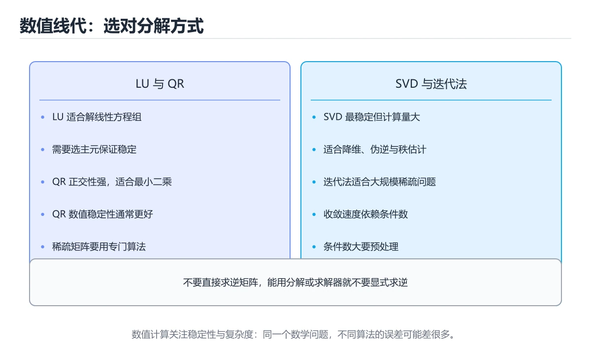

# 数值线性代数




> 内容更新时间：2026-10-06 · 学习阶段：高级 · 预计用时：40 分钟

## 本节知识框架

**课程定位**：所属分类 `math`（数学基础），课程主题 `数值线性代数`，学习阶段 高级，建议用时 35 分钟。

本课主线：LU/QR/SVD 选型、条件数与稳定性、迭代法与最小二乘。

**学完本课应当能够**
- 说清 `数值稳定` 与 `选主元` 的含义与区别，并各举一个正例和一个反例。
- 用本课示例验证 `条件数` 的行为，记录输入、输出与失败条件。
- 遇到「直接求逆」这类问题时，能说出触发条件与修复顺序。

### 从概念到验证的学习链条

1. `数值稳定`：先掌握 算法对输入扰动与浮点误差不敏感，否则误差会随步骤被放大到结果不可用，再用它解释 `选主元` 为什么会出现。
2. `选主元`：先掌握 高斯消元时挑绝对值最大的元素当枢轴，避免除以极小数放大误差，再用它解释 `条件数` 为什么会出现。
3. `条件数`：先掌握 最大奇异值与最小奇异值之比，衡量问题本身对扰动有多敏感，再用它解释 `迭代法` 为什么会出现。
4. `迭代法`：先掌握 从初值出发逐步逼近解，比如共轭梯度，适合大规模稀疏矩阵，再用它解释 本课示例的观察结果 为什么会出现。

**先修与衔接**：本课是「数学基础」分类的第 9 课。先修内容：《图论与组合数学》。《图论与组合数学》里的 `拓扑排序`、`欧拉路径` 是本课的前提。相关或后续课程：《集合与函数入门》。

### 完成判据

- **定义关**：不看正文也能说明 `数值稳定` 是 算法对输入扰动与浮点误差不敏感，否则误差会随步骤被放大到结果不可用，并指出一个反例。
- **机制关**：能按“输入 → 转换 → 输出 → 验证”复述 `数值线性代数`，而不是只背结论。
- **示例关**：能运行或推演 `数值线性代数` 的 `python` 示例，并说明一个真实出现的标识符或字面量。
- **证据关**：能指出 `数值线性代数` 示例里的 调用了 `lu_solve()`，并说明它支持或反驳了本课的哪一条结论。
- **排错关**：能复现 直接求逆，记录现象并按 使用分解和求解器 修复。
- **迁移关**：能把 `数值线性代数`、`LU分解`、`QR分解`、`SVD` 放进一个与 `数值线性代数` 不同的项目场景，并保持输入与验证条件可追踪。
- **复盘关**：学完 `数值线性代数` 后，用一句话写下仍然不确定的结论，并列出下一次验证需要的输入、环境和成功判据。

### 复习清单

- [ ] 能不看正文复述本课核心术语，并指出一个边界或反例。
- [ ] 能运行或推演本课示例，记录输入、输出与失败现象。
- [ ] 能完成一次自测，并把错题对照错误表定位原因。

## 核心概念定义

| 术语 | 操作性定义 | 常见边界与风险 |
| --- | --- | --- |
| 数值稳定 | 算法对输入扰动与浮点误差不敏感，否则误差会随步骤被放大到结果不可用。 | 只在「算法对输入扰动与浮点误差不敏感，否则误差会随步骤被放大到结果不可用」这一前提下成立，换输入或换环境要重新验证。 |
| 选主元 | 高斯消元时挑绝对值最大的元素当枢轴，避免除以极小数放大误差。 | 易错：除以极小值导致爆炸；正确做法是部分主元选取。 |
| 条件数 | 最大奇异值与最小奇异值之比，衡量问题本身对扰动有多敏感。 | 易错：结果不可信；正确做法是检查条件数并考虑正则化。 |
| 迭代法 | 从初值出发逐步逼近解，比如共轭梯度，适合大规模稀疏矩阵。 | 易错：内存和计算爆炸；正确做法是使用稀疏格式和迭代法。 |

## 原理与运行机制

### 机制总览

**教材衔接：为什么需要它**

同样的数学问题，不同的算法在计算机上结果差别巨大：有的稳定，有的会把误差放大几百倍。这一节讲清「怎么算才准、才快」——解方程、最小二乘、特征值与稀疏矩阵。

**教材衔接：常见分解速查**

| 分解 | 形式 | 用途 | 复杂度 |
| --- | --- | --- | --- |
| LU | `A = LU` | 解一般线性方程组 | O(n³) |
| Cholesky | `A = LLᵀ` | 对称正定矩阵（更快更稳） | 约 n³/3 |
| QR | `A = QR` | 最小二乘、正交化 | O(mn²) |
| 特征分解 | `A = QΛQ⁻¹` | 对称矩阵分析 | O(n³) |
| SVD | `A = UΣVᵀ` | 降维、伪逆、秩判定 | O(mn²) |
| 迭代法 | 逐步逼近 | 大型稀疏矩阵 | 取决于条件数 |

**教材衔接：最小二乘速查**

| 做法 | 形式 | 注意事项 |
| --- | --- | --- |
| 正规方程 | `x = (AᵀA)⁻¹Aᵀb` | 条件数平方放大，不推荐 |
| QR 分解 | 解 `Rx = Qᵀb` | 稳定，工程首选 |
| SVD | 用伪逆 | 最稳，可处理秩亏 |
| 加正则（岭） | `(AᵀA + λI)x = Aᵀb` | 处理病态与共线性 |

过拟合与数值稳定在这里是同一个问题的两面：特征高度相关（共线）时 `AᵀA` 接近奇异，加 L2 正则同时改善条件数与泛化。

### 机制拆解：每一步的输入、动作与输出

#### 1. `数值稳定`
- 输入：`数值线性代数`；本步把 算法对输入扰动与浮点误差不敏感，否则误差会随步骤被放大到结果不可用 当作判断规则。
- 动作：围绕 `数值稳定` 保留中间状态，并记录它与 `选主元` 的对应关系。
- 输出：`选主元`，它可以被下一段代码、测试或记录继续使用。
- `数值稳定` 的失败条件：只在「算法对输入扰动与浮点误差不敏感，否则误差会随步骤被放大到结果不可用」这一前提下成立，换输入或换环境要重新验证。

#### 2. `选主元`
- 输入：`数值稳定`；本步把 高斯消元时挑绝对值最大的元素当枢轴，避免除以极小数放大误差 当作判断规则。
- 动作：围绕 `选主元` 保留中间状态，并记录它与 `条件数` 的对应关系。
- 输出：`条件数`，它可以被下一段代码、测试或记录继续使用。
- `选主元` 的失败条件：当高斯消元不选主元时，会出现除以极小值导致爆炸。

#### 3. `条件数`
- 输入：`选主元`；本步把 最大奇异值与最小奇异值之比，衡量问题本身对扰动有多敏感 当作判断规则。
- 动作：围绕 `条件数` 保留中间状态，并记录它与 `迭代法` 的对应关系。
- 输出：`迭代法`，它可以被下一段代码、测试或记录继续使用。
- `条件数` 的失败条件：当忽略条件数时，会出现结果不可信。

#### 4. `迭代法`
- 输入：`条件数`；本步把 从初值出发逐步逼近解，比如共轭梯度，适合大规模稀疏矩阵 当作判断规则。
- 动作：围绕 `迭代法` 保留中间状态，并记录它与 `lu_solve` 的对应关系。
- 输出：`lu_solve`，它可以被下一段代码、测试或记录继续使用。
- `迭代法` 的失败条件：当把稀疏矩阵当稠密处理时，会出现内存和计算爆炸。

### 示例中的可观察事实

1. 调用了 `lu_solve()`；它对应的课程主题是 `数值线性代数`。
2. 调用了 `len()`；它对应的课程主题是 `数值线性代数`。
3. 调用了 `enumerate()`；它对应的课程主题是 `数值线性代数`。
4. 调用了 `range()`；它对应的课程主题是 `数值线性代数`。
5. 调用了 `max()`；它对应的课程主题是 `数值线性代数`。
6. 调用了 `abs()`；它对应的课程主题是 `数值线性代数`。
7. 调用了 `ValueError()`；它对应的课程主题是 `数值线性代数`。
8. 调用了 `sum()`；它对应的课程主题是 `数值线性代数`。

### 复现实验记录

- 环境：`数值线性代数` 使用 `python` 示例，固定 `数值线性代数`、`LU分解`、`QR分解`、`SVD` 作为第一组条件。
- 首轮输入：先确认 调用了 `lu_solve()`，预测 `数值稳定` 会怎样变化。
- 基线观察：记录命令、输入、输出和错误原文，不用截图代替可复制的文本。
- 单变量修改：只改变 `数值线性代数`，观察 `迭代法` 是否仍满足定义。
- 失败注入：复现 直接求逆，确认现象是 数值不稳定且慢。
- 记录结论：把“修改前、修改后、预期变化、实际变化”写成四列表，这样复盘 `数值线性代数` 时才能区分概念错误与实现错误。

## 典型应用场景

- **直接求逆**：典型现象是数值不稳定且慢；正确做法是使用分解和求解器。
- **忽略条件数**：典型现象是结果不可信；正确做法是检查条件数并考虑正则化。
- **把稀疏矩阵当稠密处理**：典型现象是内存和计算爆炸；正确做法是使用稀疏格式和迭代法。
- **只看训练损失**：典型现象是过拟合或数值错误被掩盖；正确做法是检查残差、验证集和收敛曲线。

### 最小验证场景

- 准备：保留 `python` 示例的原始输入，先记录 `数值线性代数` 的基线输出和完整运行命令。
- 观察：先核对 调用了 `lu_solve()`，再改变一个与 `数值稳定` 相关的条件。
- 判定：新结果与 `数值线性代数` 的基线不同不等于错误；只有当差异破坏了 `数值稳定` 的定义或错误表中的约束，才判定为失败。

### 选择与边界

- 使用 `数值稳定` 时，先满足它的定义：算法对输入扰动与浮点误差不敏感，否则误差会随步骤被放大到结果不可用；只在「算法对输入扰动与浮点误差不敏感，否则误差会随步骤被放大到结果不可用」这一前提下成立，换输入或换环境要重新验证。
- 使用 `选主元` 时，先满足它的定义：高斯消元时挑绝对值最大的元素当枢轴，避免除以极小数放大误差；易错：除以极小值导致爆炸；正确做法是部分主元选取。
- 使用 `条件数` 时，先满足它的定义：最大奇异值与最小奇异值之比，衡量问题本身对扰动有多敏感；易错：结果不可信；正确做法是检查条件数并考虑正则化。
- 使用 `迭代法` 时，先满足它的定义：从初值出发逐步逼近解，比如共轭梯度，适合大规模稀疏矩阵；易错：内存和计算爆炸；正确做法是使用稀疏格式和迭代法。

## 代码/协议/SQL 示例

**教材衔接：稳定性速查**

| 概念 | 含义 | 说明 |
| --- | --- | --- |
| 病态 | 条件数大 | 输入小扰动导致解大变 |
| 条件数 | `σ_max / σ_min` | 10⁶ 以上要警惕 |
| 数值稳定 | 误差不放大 | 用正交变换（QR、SVD）更稳 |
| 主元选取 | 选最大元素做基准 | 高斯消元必须选主元 |
| 残差 | `b - Ax` | 残差小不代表解准确 |
| 迭代收敛 | 谱半径小于 1 | 否则迭代发散 |

经验法则：**能用正交变换就别用显式求逆；能解方程就别算逆矩阵。**

```python
import math

Matrix = list
Vector = list

def lu_solve(a: Matrix, b: Vector) -> Vector:
    """带部分主元的高斯消元：稳定地解 Ax = b。"""
    n = len(a)
    m = [row[:] + [b[i]] for i, row in enumerate(a)]
    for col in range(n):
        pivot = max(range(col, n), key=lambda r: abs(m[r][col]))
        if abs(m[pivot][col]) < 1e-12:
            raise ValueError("矩阵奇异或接近奇异")
        m[col], m[pivot] = m[pivot], m[col]
        for r in range(col + 1, n):
            factor = m[r][col] / m[col][col]
            for c in range(col, n + 1):
                m[r][c] -= factor * m[col][c]
    x = [0.0] * n
    for r in range(n - 1, -1, -1):
        total = m[r][n] - sum(m[r][c] * x[c] for c in range(r + 1, n))
        x[r] = total / m[r][r]
    return [round(value, 6) for value in x]

def residual(a: Matrix, x: Vector, b: Vector) -> float:
    """残差范数：衡量 Ax 与 b 的差距。"""
    n = len(b)
    return round(math.sqrt(sum((sum(a[i][j] * x[j] for j in range(n)) - b[i]) ** 2
                               for i in range(n))), 9)

def power_spectral_radius(a: Matrix, iterations: int = 200) -> float:
    """幂迭代估算谱半径，判断迭代法是否收敛。"""
    n = len(a)
    x = [1.0] * n
    for _ in range(iterations):
        y = [sum(a[i][j] * x[j] for j in range(n)) for i in range(n)]
        norm = math.sqrt(sum(v * v for v in y)) or 1.0
        x = [v / norm for v in y]
    ax = [sum(a[i][j] * x[j] for j in range(n)) for i in range(n)]
    return round(math.sqrt(sum(v * v for v in ax)), 6)

def jacobi_iteration(a: Matrix, b: Vector, steps: int = 50) -> Vector:
    """雅可比迭代：适合对角占优的稀疏矩阵。"""
    n = len(b)
    x = [0.0] * n
    for _ in range(steps):
        new_x = x[:]
        for i in range(n):
            s = sum(a[i][j] * x[j] for j in range(n) if j != i)
            new_x[i] = (b[i] - s) / a[i][i]
        x = new_x
    return [round(v, 6) for v in x]

A = [[4.0, 1.0], [1.0, 3.0]]
b = [1.0, 2.0]
solution = lu_solve(A, b)
print(solution, residual(A, solution, b))
print(power_spectral_radius([[0.0, 0.5], [0.5, 0.0]]))
print(jacobi_iteration(A, b))
```

**教材衔接：深入补充：数值线性代数**

前面已经建立了基本概念。这一节换一个角度，把数值线性代数放进真实工程里，
重点回答三件事：ValueError 解决什么问题、依赖哪些前提、在什么条件下失效。

### 一、核心模型

数值线性代数研究在有限精度下求解矩阵问题，核心包括矩阵分解、条件数、稳定性、迭代法和稀疏结构；它在机器学习、图形学、仿真和优化中无处不在。

```text
建立矩阵模型 → 检查稀疏性与条件数 → 选择分解/迭代方法 → 数值求解 → 误差评估 → 优化与验证
```

### 二、关键机制拆解

1. 浮点运算有舍入误差，直接求逆通常不稳定，应使用 LU、QR、Cholesky 等分解。
2. 条件数衡量输入扰动对解的影响，条件数大时即使算法稳定，结果也可能不可信。
3. 高斯消元需要选主元，避免除以极小值放大误差。
4. 最小二乘常通过 QR 或 SVD 求解，正规方程会放大条件数。
5. 稀疏矩阵应使用稀疏存储和迭代法，避免把零元素也存下来并做稠密运算。
6. 幂迭代和 Lanczos 方法可用于求最大特征值或奇异值。
7. 数值结果必须用残差、条件数和迭代收敛指标验证，不能只看代码是否运行。

### 三、对照表：抓住容易混淆的边界

| 维度 | 一侧 | 另一侧 |
| --- | --- | --- |
| 直接法 | 分解后一次求解 | 稳定但大规模开销高 |
| 迭代法 | 逐步逼近解 | 适合稀疏大规模问题 |
| LU 分解 | 适合一般方阵 | 需要选主元保证稳定 |
| SVD | 最稳定但计算量大 | 适合最小二乘和降维 |

### 四、工作示例

拟合直线时用 QR 分解求解最小二乘，而不是直接计算正规方程 `A^T A`。后者会把条件数平方，数据稍差就导致结果严重失真。

### 五、常见误区与失效边界

| 错误做法或假设 | 后果 | 正确做法 |
| --- | --- | --- |
| 直接求逆 | 数值不稳定且慢 | 使用分解和求解器 |
| 忽略条件数 | 结果不可信 | 检查条件数并考虑正则化 |
| 把稀疏矩阵当稠密处理 | 内存和计算爆炸 | 使用稀疏格式和迭代法 |
| 只看训练损失 | 过拟合或数值错误被掩盖 | 检查残差、验证集和收敛曲线 |

### 六、场景推演

线性回归结果对输入微小变化极其敏感。检查发现特征高度相关，条件数很大。解决方案是正则化、特征选择或使用 SVD，并报告条件数和残差。

### 七、自测问答

**Q1：为什么不应直接求逆？**

求逆不稳定且计算量大，分解求解更可靠。

**Q2：条件数说明什么？**

输入扰动对解的影响程度，条件数越大结果越敏感。

**Q3：最小二乘为什么推荐 QR？**

QR 比正规方程更稳定，不会平方条件数。

**Q4：稀疏矩阵如何处理？**

使用稀疏存储和迭代法，避免稠密化。

### 八、小项目：把知识变成可检查的产出

用三种方法求解同一最小二乘问题：正规方程、QR、SVD；加入噪声和高度相关特征，比较残差、条件数和耗时，写出稳定性结论。

### 九、适用边界

数值线性代数提供稳定求解方法，但不能修复错误模型和偏差数据。工程中还要结合正则化、特征工程和误差评估。

### 十、完成检查清单

- [ ] 能解释浮点误差和条件数
- [ ] 能选择 LU、QR、SVD 和 Cholesky
- [ ] 能使用稀疏与迭代方法
- [ ] 能验证残差和收敛
- [ ] 能处理病态最小二乘问题

### 十一、复习顺序

1. 合上教程复述 数值线性代数，确认能说出它解决的三个问题。
2. 再对照表逐行解释容易混淆的概念，每个概念补一个反例。
3. 跟着工作示例做一遍，改变一个条件并预测结果。
4. 用自测问答检查理解，错题回到对应小节重新阅读。
5. 用 ValueError 做一个最小交付，附上运行命令与失败样例。

> 复习不是重读一遍，而是离开原文重新产出：复述、改写、验证、复盘。

**运行方式**：运行 `数值线性代数` 的示例时，保存为 `.py` 文件后用 `python 文件名.py` 运行；第三方依赖先在虚拟环境里安装。

### 示例精读：先找证据，再改一个条件

1. 调用了 `lu_solve()`；它出现在 `数值线性代数` 的示例中，阅读时先确认它前后各发生了什么。
2. 调用了 `len()`；它出现在 `数值线性代数` 的示例中，阅读时先确认它前后各发生了什么。
3. 调用了 `enumerate()`；它出现在 `数值线性代数` 的示例中，阅读时先确认它前后各发生了什么。
4. 调用了 `range()`；它出现在 `数值线性代数` 的示例中，阅读时先确认它前后各发生了什么。
5. 调用了 `max()`；它出现在 `数值线性代数` 的示例中，阅读时先确认它前后各发生了什么。
6. 调用了 `abs()`；它出现在 `数值线性代数` 的示例中，阅读时先确认它前后各发生了什么。
7. 调用了 `ValueError()`；它出现在 `数值线性代数` 的示例中，阅读时先确认它前后各发生了什么。
8. 调用了 `sum()`；它出现在 `数值线性代数` 的示例中，阅读时先确认它前后各发生了什么。
- 在 `数值线性代数` 中与 `数值稳定` 对照：示例必须能支持 算法对输入扰动与浮点误差不敏感，否则误差会随步骤被放大到结果不可用，否则说明这一段还缺少实现或验证步骤。
- 在 `数值线性代数` 中与 `选主元` 对照：示例必须能支持 高斯消元时挑绝对值最大的元素当枢轴，避免除以极小数放大误差，否则说明这一段还缺少实现或验证步骤。
- 在 `数值线性代数` 中与 `条件数` 对照：示例必须能支持 最大奇异值与最小奇异值之比，衡量问题本身对扰动有多敏感，否则说明这一段还缺少实现或验证步骤。
- 在 `数值线性代数` 中与 `迭代法` 对照：示例必须能支持 从初值出发逐步逼近解，比如共轭梯度，适合大规模稀疏矩阵，否则说明这一段还缺少实现或验证步骤。

## 时间/空间复杂度或性能分析

**复杂度证据**：本课正文出现 `O(n³)`、`O(mn²)` 等量级表达式；使用前要同时确认输入规模、最好/平均/最坏情况以及常数项来源。

**测量方法**：以 `数值线性代数` 的 `数值线性代数` 场景为对象，固定输入跑一遍记录基线，再把规模或并发度提高一个数量级复测；两次结果的差值与波动范围才是结论依据。

### 需要控制的变量与记录项

- `数值线性代数` 的 `数值线性代数`：固定它的版本、输入范围和资源上限，分别记录速度、内存与失败率的变化。
- `数值线性代数` 的 `LU分解`：固定它的版本、输入范围和资源上限，分别记录速度、内存与失败率的变化。
- `数值线性代数` 的 `QR分解`：固定它的版本、输入范围和资源上限，分别记录速度、内存与失败率的变化。
- `数值线性代数` 的 `SVD`：固定它的版本、输入范围和资源上限，分别记录速度、内存与失败率的变化。
- `数值线性代数` 的 `条件数`：固定它的版本、输入范围和资源上限，分别记录速度、内存与失败率的变化。
- `数值线性代数` 中 `数值稳定` 的边界：只在「算法对输入扰动与浮点误差不敏感，否则误差会随步骤被放大到结果不可用」这一前提下成立，换输入或换环境要重新验证。达到边界时不要外推，必须重新测量。
- `数值线性代数` 中 `选主元` 的边界：易错：除以极小值导致爆炸；正确做法是部分主元选取。达到边界时不要外推，必须重新测量。
- `数值线性代数` 中 `条件数` 的边界：易错：结果不可信；正确做法是检查条件数并考虑正则化。达到边界时不要外推，必须重新测量。
- `数值线性代数` 中 `迭代法` 的边界：易错：内存和计算爆炸；正确做法是使用稀疏格式和迭代法。达到边界时不要外推，必须重新测量。
- `数值线性代数` 的代码证据：先验证 调用了 `lu_solve()`，再记录该路径的输入规模与耗时；只看代码行数不能推出复杂度。

## 常见误区与易错点

| 容易写错的做法 | 实际现象 | 原因与正确做法 |
| --- | --- | --- |
| 直接求逆 | 数值不稳定且慢 | 使用分解和求解器 |
| 忽略条件数 | 结果不可信 | 检查条件数并考虑正则化 |
| 把稀疏矩阵当稠密处理 | 内存和计算爆炸 | 使用稀疏格式和迭代法 |
| 只看训练损失 | 过拟合或数值错误被掩盖 | 检查残差、验证集和收敛曲线 |
| 显式求逆再相乘 | 误差大且慢 | 用分解直接解方程 |
| 用正规方程求最小二乘 | 条件数被平方，结果失真 | 改用 QR 或 SVD |
| 高斯消元不选主元 | 除以极小值导致爆炸 | 部分主元选取 |
| 只看残差判断解正确 | 病态问题残差小但误差大 | 同时估计条件数 |
| 对大稀疏矩阵做稠密分解 | 内存爆炸 | 用迭代法（CG、GMRES） |
| 迭代法不检查收敛 | 结果未收敛也当解 | 检查谱半径与迭代次数 |
| 用浮点判断矩阵奇异 | 阈值不当 | 用 SVD 与相对阈值 |
| 忽略数据尺度差异 | 条件数恶化 | 先归一化再求解 |

### 现场 1：直接求逆

**症状**：数值不稳定且慢。

**根因与修复**：使用分解和求解器。

**自检**：在本课示例里复现「直接求逆」，改成使用分解和求解器后重跑；如果症状消失且失败路径按预期变化，说明定位正确。

### 现场 2：忽略条件数

**症状**：结果不可信。

**根因与修复**：检查条件数并考虑正则化。

**自检**：在本课示例里复现「忽略条件数」，改成检查条件数并考虑正则化后重跑；如果症状消失且失败路径按预期变化，说明定位正确。

### 现场 3：把稀疏矩阵当稠密处理

**症状**：内存和计算爆炸。

**根因与修复**：使用稀疏格式和迭代法。

**自检**：在本课示例里复现「把稀疏矩阵当稠密处理」，改成使用稀疏格式和迭代法后重跑；如果症状消失且失败路径按预期变化，说明定位正确。

### 现场 4：只看训练损失

**症状**：过拟合或数值错误被掩盖。

**根因与修复**：检查残差、验证集和收敛曲线。

**自检**：在本课示例里复现「只看训练损失」，改成检查残差、验证集和收敛曲线后重跑；如果症状消失且失败路径按预期变化，说明定位正确。

### 现场 5：显式求逆再相乘

**症状**：误差大且慢。

**根因与修复**：用分解直接解方程。

**自检**：在本课示例里复现「显式求逆再相乘」，改成用分解直接解方程后重跑；如果症状消失且失败路径按预期变化，说明定位正确。

### 现场 6：用正规方程求最小二乘

**症状**：条件数被平方，结果失真。

**根因与修复**：改用 QR 或 SVD。

**自检**：在本课示例里复现「用正规方程求最小二乘」，改成改用 QR 或 SVD后重跑；如果症状消失且失败路径按预期变化，说明定位正确。

### 现场 7：高斯消元不选主元

**症状**：除以极小值导致爆炸。

**根因与修复**：部分主元选取。

**自检**：在本课示例里复现「高斯消元不选主元」，改成部分主元选取后重跑；如果症状消失且失败路径按预期变化，说明定位正确。

### 现场 8：只看残差判断解正确

**症状**：病态问题残差小但误差大。

**根因与修复**：同时估计条件数。

**自检**：在本课示例里复现「只看残差判断解正确」，改成同时估计条件数后重跑；如果症状消失且失败路径按预期变化，说明定位正确。

### 现场 9：对大稀疏矩阵做稠密分解

**症状**：内存爆炸。

**根因与修复**：用迭代法（CG、GMRES）。

**自检**：在本课示例里复现「对大稀疏矩阵做稠密分解」，改成用迭代法（CG、GMRES）后重跑；如果症状消失且失败路径按预期变化，说明定位正确。

## 与其他知识点的关系

| 关系 | 课程 | 为什么 |
| --- | --- | --- |
| 先修 | 《图论与组合数学》 | 本课会直接使用它的概念或操作前提。 |
| 关联 | 《集合与函数入门》 | 用于横向比较或把本课结论迁移到相邻主题。 |
| 前置顺序 | 《凸优化与约束优化》 | 同分类中安排在本课之前，建议先完成其自测。 |

- **先修**：`图论与组合数学`。本课默认这些内容已经掌握。
- **相关或后续**：`集合与函数入门`。本课术语会在这些课程里继续使用。
- **术语归属**：`数值稳定`、`选主元`、`条件数` 的定义以本课「核心概念定义」为准，换到其他课程时先确认定义是否被改写。
- 同一分类的《特征值、SVD 与降维》也涉及 `SVD`；两课衔接时先确认这个术语的定义是否一致。

### 先修与后续术语接口

- `集合与函数入门`：两者通过本分类的学习顺序衔接，阅读时重点比较各自的输入与失败条件。
- `图论与组合数学`：两者通过本分类的学习顺序衔接，阅读时重点比较各自的输入与失败条件。

### 容易混淆的相邻概念

- `数值稳定` 与 `选主元`：前者强调 算法对输入扰动与浮点误差不敏感，否则误差会随步骤被放大到结果不可用；后者强调 高斯消元时挑绝对值最大的元素当枢轴，避免除以极小数放大误差。判断时分别检查两条定义的适用范围，不要只看名称相似就互换。
- `选主元` 与 `条件数`：前者强调 高斯消元时挑绝对值最大的元素当枢轴，避免除以极小数放大误差；后者强调 最大奇异值与最小奇异值之比，衡量问题本身对扰动有多敏感。判断时分别检查两条定义的适用范围，不要只看名称相似就互换。
- `条件数` 与 `迭代法`：前者强调 最大奇异值与最小奇异值之比，衡量问题本身对扰动有多敏感；后者强调 从初值出发逐步逼近解，比如共轭梯度，适合大规模稀疏矩阵。判断时分别检查两条定义的适用范围，不要只看名称相似就互换。

## 自测题与参考答案

> 先独立作答，再对照参考答案；答案都能在本课正文、术语表或错误表里找到依据。

### 自测 1（概念复述）

不看正文，写出 `数值稳定` 的操作性定义，并说明它与 `选主元` 的区别。

**参考答案**：算法对输入扰动与浮点误差不敏感，否则误差会随步骤被放大到结果不可用。

`选主元` 的定位是：高斯消元时挑绝对值最大的元素当枢轴，避免除以极小数放大误差；两者的差别要从适用对象与失败模式上说明。

### 自测 2（排错）

本课错误表记录了「直接求逆」这类做法。请写出它会出现的现象、根因，以及修复顺序。

**参考答案**：现象是数值不稳定且慢；正确做法是使用分解和求解器。修复时先复现现象并保留证据，再改动一处假设重跑，确认现象消失。

### 自测 3（动手验证）

运行本课的 `python` 示例，把其中的 `"带部分主元的高斯消元：稳定地解 Ax = b。"` 换成一个边界值后重新运行，记录输出与错误信息。

**参考答案**：正常输入下 `python` 示例应当复现正文给出的结果；把 `"带部分主元的高斯消元：稳定地解 Ax = b。"` 换成边界值后，如果结果改变或报错，先核对它是否满足 `数值线性代数` 中`数值稳定` 的适用范围，再检查错误表里是否有同类现象。

### 自测 4（代码阅读）

阅读本课开头的 `python` 示例，说明它体现了`数值稳定` 的哪一条性质，并指出改动哪个输入会让这条性质不再成立。

**参考答案**：`数值稳定` 的定义是 算法对输入扰动与浮点误差不敏感，否则误差会随步骤被放大到结果不可用，示例正是在实现这条定义。改动与 `数值稳定` 有关的一个输入后，如果结果不再符合 `数值线性代数` 的正文描述，就说明该性质只在当前前提成立。

### 自测 5（迁移）

把 `数值线性代数` 的方法迁移到自己的项目：围绕 `数值稳定` 写出一个与错误表同类的风险点，并说明触发条件和检验方式。

**参考答案**：例如「忽略数据尺度差异」，它会导致条件数恶化；检验方式是按先归一化再求解改一处再复现，确认现象消失且没有引入新的失败分支。

### 自测 6（对比）

用一个表格对比 `数值稳定` 与 `选主元`：各写一行适用场景、一行失败表现。

**参考答案**：`数值稳定` 的定义是算法对输入扰动与浮点误差不敏感，否则误差会随步骤被放大到结果不可用；`选主元` 的定义是高斯消元时挑绝对值最大的元素当枢轴，避免除以极小数放大误差。两者的失败表现分别对应本课错误表里与本术语相关的行。

### 自测 7（排错顺序）

面对「直接求逆」引发的问题，请把“复现 数值不稳定且慢 → 保留证据 → 使用分解和求解器 → 回归验证”四步写成可执行的检查清单。

**参考答案**：第一步按数值不稳定且慢复现；第二步记录输入、版本与完整报错；第三步按使用分解和求解器只改一处；第四步重跑并确认失败路径也按预期变化。

### 自测 8（边界判断）

针对 `迭代法`，分别写出“可以使用”的条件和“结论不再成立”的条件。

**参考答案**：易错：内存和计算爆炸；正确做法是使用稀疏格式和迭代法。 同时要把 `迭代法` 的定义 从初值出发逐步逼近解，比如共轭梯度，适合大规模稀疏矩阵 与实际输入逐项对照。

### 自测 9（机制重建）

不看正文，按输入、转换、输出、验证四段重建 `数值稳定` → `选主元` → `条件数` → `迭代法` 的作用链。

**参考答案**：起点是 `数值稳定` 的定义 算法对输入扰动与浮点误差不敏感，否则误差会随步骤被放大到结果不可用；中间每一步都保留可观察状态；终点由 `迭代法` 检查，失败时回到错误表定位第一个偏离定义的步骤。

### 自测 10（综合排错）

在 `数值线性代数` 中，现象是 条件数恶化。请围绕 忽略数据尺度差异 写出最小复现、关键证据、修复动作和回归验证，并说明为什么不能只凭一次运行下结论。

**参考答案**：先复现 忽略数据尺度差异，记录输入与完整错误；再按 先归一化再求解 只改一处。回归时同时跑正常路径和边界路径，只有两次结果都可解释，才把修复视为完成。

### 自测 11（一分钟复述）

用每分钟约 200 字的速度复述 `数值线性代数`：先给主问题，再按顺序说出 `数值稳定`、`选主元`、`条件数`、`迭代法`，最后给一个失败案例。

**自评标准**：主问题必须对应 LU/QR/SVD 选型、条件数与稳定性、迭代法与最小二乘；每个术语都要能接上一句定义或边界；失败案例必须写成可观察现象，不能用“可能有风险”代替证据。

## 术语速查

| 术语 | 一句话说明 |
| --- | --- |
| `数值稳定` | 算法对输入扰动与浮点误差不敏感，否则误差会随步骤被放大到结果不可用。 |
| `选主元` | 高斯消元时挑绝对值最大的元素当枢轴，避免除以极小数放大误差。 |
| `条件数` | 最大奇异值与最小奇异值之比，衡量问题本身对扰动有多敏感。 |
| `迭代法` | 从初值出发逐步逼近解，比如共轭梯度，适合大规模稀疏矩阵。 |

**术语关系**：`数值稳定`（算法对输入扰动与浮点误差不敏感） → `选主元`（高斯消元时挑绝对值最大的元素当枢轴） → `条件数`（最大奇异值与最小奇异值之比） → `迭代法`（从初值出发逐步逼近解）。

## 考点精讲

`数值线性代数` 的题库有 6 道题，下面逐题给出题干、正确项与判断依据：先自己作答，再核对正确项，最后回到正文对应小节复核。

### 考点 1：第 1 题

- **题目**：求解线性方程组 Ax = b 时，为什么不推荐先算 A 的逆矩阵？
- **正确项**：因为求逆更慢且会放大数值误差
- **判断依据**：这道题检验本课主问题：LU/QR/SVD 选型、条件数与稳定性、迭代法与最小二乘。复习时先复述本课主问题，再举一个会让结论失效的输入。

### 考点 2：第 2 题

- **题目**：按“数值线性代数”中 数值线性代数、LU分解、QR分解 的实践顺序，把四个步骤排成从准备到复盘的合理顺序。
- **正确项**：先明确 数值线性代数 的输入、输出与约束 → 写出最小示例并核对 LU分解 的基线结果 → 只改一个变量，记录边界与失败路径的变化 → 固定版本与证据，把“数值线性代数”的结论写成可复现记录
- **判断依据**：这道题检验本课主问题：LU/QR/SVD 选型、条件数与稳定性、迭代法与最小二乘。复习时先复述本课主问题，再举一个会让结论失效的输入。

### 考点 3：第 3 题

- **题目**：矩阵条件数为 10⁸ 说明？
- **正确项**：问题病态
- **判断依据**：这道题落在术语 `条件数` 上：最大奇异值与最小奇异值之比，衡量问题本身对扰动有多敏感。复习时把 `条件数` 的定义、适用边界和一个反例一起说清楚，再回到「核心概念定义」核对原文。

### 考点 4：第 4 题

- **题目**：对超大规模的稀疏矩阵求解，通常优先选择？
- **正确项**：迭代法
- **判断依据**：这道题落在术语 `迭代法` 上：从初值出发逐步逼近解，比如共轭梯度，适合大规模稀疏矩阵。复习时把 `迭代法` 的定义、适用边界和一个反例一起说清楚，再回到「核心概念定义」核对原文。

### 考点 5：第 5 题

- **题目**：围绕“数值线性代数”中的 数值线性代数、LU分解、QR分解，下列哪两项是本课强调的实践判断？
- **正确项**：验证 LU分解 时要固定版本并覆盖边界输入，结论才可复现；学习 数值线性代数 时要同时说明输入、输出和失败路径，不能只看正常流程
- **判断依据**：这道题检验本课主问题：LU/QR/SVD 选型、条件数与稳定性、迭代法与最小二乘。复习时先复述本课主问题，再举一个会让结论失效的输入。

### 考点 6：第 6 题

- **题目**：`数值线性代数` 的示例代码服务于“LU/QR/SVD 选型、条件数与稳定性、迭代法与最小二乘。”。哪一条判断是正确的？
- **正确项**：因为求逆更慢且会放大数值误差
- **判断依据**：这道题落在术语 `条件数` 上：最大奇异值与最小奇异值之比，衡量问题本身对扰动有多敏感。复习时把 `条件数` 的定义、适用边界和一个反例一起说清楚，再回到「核心概念定义」核对原文。

### 考点 7：`数值稳定`

- **要点**：算法对输入扰动与浮点误差不敏感，否则误差会随步骤被放大到结果不可用。
- **数值稳定 的边界**：只在「算法对输入扰动与浮点误差不敏感，否则误差会随步骤被放大到结果不可用」这一前提下成立，换输入或换环境要重新验证。

### 考点 8：`选主元`

- **要点**：高斯消元时挑绝对值最大的元素当枢轴，避免除以极小数放大误差。
- **选主元 的边界**：易错：除以极小值导致爆炸；正确做法是部分主元选取。

### 考点 9：`条件数`

- **要点**：最大奇异值与最小奇异值之比，衡量问题本身对扰动有多敏感。
- **条件数 的边界**：易错：结果不可信；正确做法是检查条件数并考虑正则化。

### 考点 10：`迭代法`

- **要点**：从初值出发逐步逼近解，比如共轭梯度，适合大规模稀疏矩阵。
- **迭代法 的边界**：易错：内存和计算爆炸；正确做法是使用稀疏格式和迭代法。

### 考点 11：排错——直接求逆

- **现象**：数值不稳定且慢。
- **处理**：使用分解和求解器。

### 考点 12：排错——忽略条件数

- **现象**：结果不可信。
- **处理**：检查条件数并考虑正则化。

### 考点 13：综合辨析——`数值稳定` 与 `迭代法`

- **辨析点**：`数值稳定` 的定义是 算法对输入扰动与浮点误差不敏感，否则误差会随步骤被放大到结果不可用；`迭代法` 的定义是 从初值出发逐步逼近解，比如共轭梯度，适合大规模稀疏矩阵。
- **答题要求**：面对 `数值线性代数` 的题目，先判断描述的是 `数值稳定` 还是 `迭代法`，再归到对应定义，最后写出一个会让该定义失效的边界输入。

### 考点 14：排错评分点

- **现象分**：能写出 数值不稳定且慢，而不是只写“程序有错”。
- **证据分**：保留触发 直接求逆 的输入、版本和错误原文。
- **修复分**：按 使用分解和求解器 只改一处，并同时回归正常路径与边界路径。

## 内容元数据

- 内容版本：v2.0
- 最后更新：2026-10-06
- 学习阶段：高级
- 适用环境：线性代数、概率统计与优化基础
；本课聚焦 数值线性代数。
- 内容来源：内置结构化课程与工程实践整理
- 相关主题：数值线性代数、LU分解、QR分解、SVD、条件数、迭代法
- 质量版本：P0 测验标准 + P1 覆盖扩展 + P2 体验补全

## 参考资料与复核

- 最后复核：2026-10-04
- 下次复核：2027-09-24
- 复核范围：版本兼容、API 行为、安全建议与工程实践
- 来源性质：官方文档、标准或权威教材；本课核对关键词：数值线性代数、LU分解、QR分解、SVD、条件数、迭代法。

| 参考资料 | 本课用途 |
| --- | --- |
| [Khan Academy 数学](https://www.khanacademy.org/math) | 从基础算术到高等数学 |
| [NIST DLMF](https://dlmf.nist.gov/) | 数学函数与公式参考 |
| [Wolfram MathWorld](https://mathworld.wolfram.com/) | 数学概念与公式查询 |

| [本课术语索引：数值线性代数](#核心概念定义) | 按本课输入、术语边界和错误表现逐项核对 |
> 「数值线性代数」的链接用于离线阅读后的延伸核对；App 不会自动联网。