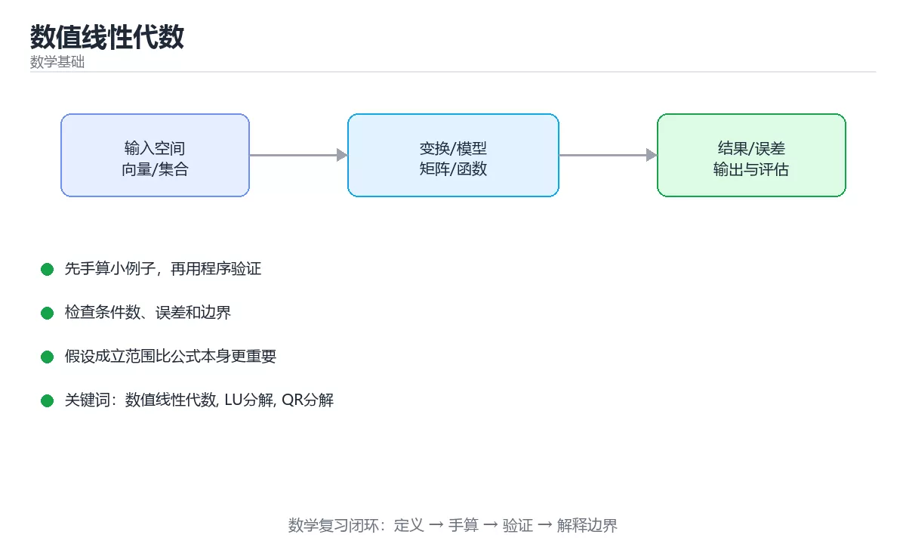

# 数值线性代数



> 内容更新时间：2026-10-03 · 学习阶段：高级 · 预计用时：18 分钟

## 学习目标

- 能用自己的话解释「数值线性代数」解决了什么问题，而不是只背术语。
- 能说清 「数值线性代数」、「LU分解」、「QR分解」、「SVD」 之间的关系，并分别举出一个例子。
- 能把本课知识放回「数学基础」的知识体系，说明它和相邻主题的边界。
- 能完成本课练习，并用验收标准检查自己的结果。

> 一句话摘要：LU/QR/SVD 选型、条件数与稳定性、迭代法与最小二乘。

## 前置知识

- 先完成上一课《图论与组合数学》；如果已经掌握，可以直接用本课练习自测。
- 本课阶段：高级。建议具备同一方向的完整基础，能阅读较长的代码、配置或系统设计说明。
- 开始前先复习：数值线性代数、LU分解、QR分解。
- 如果某一步看不懂，先记录具体卡点，完成练习后再回头读一遍。


## 为什么需要它

同样的数学问题，不同的算法在计算机上结果差别巨大：有的稳定，有的会把误差放大几百倍。这一节讲清「怎么算才准、才快」——解方程、最小二乘、特征值与稀疏矩阵。

## 常见分解速查

| 分解 | 形式 | 用途 | 复杂度 |
| --- | --- | --- | --- |
| LU | `A = LU` | 解一般线性方程组 | O(n³) |
| Cholesky | `A = LLᵀ` | 对称正定矩阵（更快更稳） | 约 n³/3 |
| QR | `A = QR` | 最小二乘、正交化 | O(mn²) |
| 特征分解 | `A = QΛQ⁻¹` | 对称矩阵分析 | O(n³) |
| SVD | `A = UΣVᵀ` | 降维、伪逆、秩判定 | O(mn²) |
| 迭代法 | 逐步逼近 | 大型稀疏矩阵 | 取决于条件数 |

## 稳定性速查

| 概念 | 含义 | 说明 |
| --- | --- | --- |
| 病态 | 条件数大 | 输入小扰动导致解大变 |
| 条件数 | `σ_max / σ_min` | 10⁶ 以上要警惕 |
| 数值稳定 | 误差不放大 | 用正交变换（QR、SVD）更稳 |
| 主元选取 | 选最大元素做基准 | 高斯消元必须选主元 |
| 残差 | `b - Ax` | 残差小不代表解准确 |
| 迭代收敛 | 谱半径小于 1 | 否则迭代发散 |

经验法则：**能用正交变换就别用显式求逆；能解方程就别算逆矩阵。**

```python
import math

Matrix = list
Vector = list

def lu_solve(a: Matrix, b: Vector) -> Vector:
    """带部分主元的高斯消元：稳定地解 Ax = b。"""
    n = len(a)
    m = [row[:] + [b[i]] for i, row in enumerate(a)]
    for col in range(n):
        pivot = max(range(col, n), key=lambda r: abs(m[r][col]))
        if abs(m[pivot][col]) < 1e-12:
            raise ValueError("矩阵奇异或接近奇异")
        m[col], m[pivot] = m[pivot], m[col]
        for r in range(col + 1, n):
            factor = m[r][col] / m[col][col]
            for c in range(col, n + 1):
                m[r][c] -= factor * m[col][c]
    x = [0.0] * n
    for r in range(n - 1, -1, -1):
        total = m[r][n] - sum(m[r][c] * x[c] for c in range(r + 1, n))
        x[r] = total / m[r][r]
    return [round(value, 6) for value in x]

def residual(a: Matrix, x: Vector, b: Vector) -> float:
    """残差范数：衡量 Ax 与 b 的差距。"""
    n = len(b)
    return round(math.sqrt(sum((sum(a[i][j] * x[j] for j in range(n)) - b[i]) ** 2
                               for i in range(n))), 9)

def power_spectral_radius(a: Matrix, iterations: int = 200) -> float:
    """幂迭代估算谱半径，判断迭代法是否收敛。"""
    n = len(a)
    x = [1.0] * n
    for _ in range(iterations):
        y = [sum(a[i][j] * x[j] for j in range(n)) for i in range(n)]
        norm = math.sqrt(sum(v * v for v in y)) or 1.0
        x = [v / norm for v in y]
    ax = [sum(a[i][j] * x[j] for j in range(n)) for i in range(n)]
    return round(math.sqrt(sum(v * v for v in ax)), 6)

def jacobi_iteration(a: Matrix, b: Vector, steps: int = 50) -> Vector:
    """雅可比迭代：适合对角占优的稀疏矩阵。"""
    n = len(b)
    x = [0.0] * n
    for _ in range(steps):
        new_x = x[:]
        for i in range(n):
            s = sum(a[i][j] * x[j] for j in range(n) if j != i)
            new_x[i] = (b[i] - s) / a[i][i]
        x = new_x
    return [round(v, 6) for v in x]

A = [[4.0, 1.0], [1.0, 3.0]]
b = [1.0, 2.0]
solution = lu_solve(A, b)
print(solution, residual(A, solution, b))
print(power_spectral_radius([[0.0, 0.5], [0.5, 0.0]]))
print(jacobi_iteration(A, b))
```

## 最小二乘速查

| 做法 | 形式 | 注意事项 |
| --- | --- | --- |
| 正规方程 | `x = (AᵀA)⁻¹Aᵀb` | 条件数平方放大，不推荐 |
| QR 分解 | 解 `Rx = Qᵀb` | 稳定，工程首选 |
| SVD | 用伪逆 | 最稳，可处理秩亏 |
| 加正则（岭） | `(AᵀA + λI)x = Aᵀb` | 处理病态与共线性 |

过拟合与数值稳定在这里是同一个问题的两面：特征高度相关（共线）时 `AᵀA` 接近奇异，加 L2 正则同时改善条件数与泛化。

## 常见错误对照表

| 容易踩的做法 | 实际现象 | 原因与正确做法 |
| --- | --- | --- |
| 显式求逆再相乘 | 误差大且慢 | 用分解直接解方程 |
| 用正规方程求最小二乘 | 条件数被平方，结果失真 | 改用 QR 或 SVD |
| 高斯消元不选主元 | 除以极小值导致爆炸 | 部分主元选取 |
| 只看残差判断解正确 | 病态问题残差小但误差大 | 同时估计条件数 |
| 对大稀疏矩阵做稠密分解 | 内存爆炸 | 用迭代法（CG、GMRES） |
| 迭代法不检查收敛 | 结果未收敛也当解 | 检查谱半径与迭代次数 |
| 用浮点判断矩阵奇异 | 阈值不当 | 用 SVD 与相对阈值 |
| 忽略数据尺度差异 | 条件数恶化 | 先归一化再求解 |

## 自测清单

- [ ] 能说出 LU、QR、Cholesky 与 SVD 的适用场景。
- [ ] 知道为什么不应显式计算逆矩阵。
- [ ] 会判断条件数与病态问题。
- [ ] 大稀疏矩阵优先选择迭代法。
- [ ] 最小二乘优先用 QR 或 SVD 而不是正规方程。

## 动手练习

<!-- practice-diversified:v1 -->

> 本课练习重点：围绕「数值线性代数、LU分解、QR分解」完成复述、实验和交付，每个结果都要能被别人检查。

先手算 3 步小例子，再画图或用程序验证，最后说明假设与误差。

### 练习 1：建立心智模型（10 分钟）

合上教程，用 3～5 句话回答：

1. 「数值线性代数」解决了什么问题？
2. 如果没有它，会出现什么具体后果？
3. 它和「LU分解」是什么关系？

**验收标准**：至少出现一个本课关键词，并写出一个反例、边界条件或失效场景。

### 练习 2：做一次可控实验（20 分钟）

从正文中选一个最小示例，完成以下操作：

1. 先预测修改一个参数、输入或步骤后的结果。
2. 再实际执行或逐步推演，记录真实结果。
3. 如果结果与预测不同，写出差异原因。

**验收标准**：留下「原例 → 改动 → 预测 → 结果 → 原因」五步记录。

### 练习 3：交付一个小结果（30 分钟）

先手算一个 3～4 步的小例子，再用 Python 或计算器验证结果。

任务要求：

- 结果必须能被别人检查，不能只写“我已经理解了”。
- 至少覆盖「数值线性代数」和「LU分解」两个关键词。
- 写出 1 个仍然不确定的问题，以及下一步如何验证。

> 提示：时间有限时优先做练习 1 和练习 2；练习 3 可以拆成两次完成。

## 本课小结

- 核心问题：「数值线性代数」不是孤立术语，而是在「数学基础」中解决一类具体问题。
- 关键关系：先分清「数值线性代数」与「LU分解」的职责，再理解「QR分解」的适用边界。
- 判断标准：能解释正常场景、边界条件和失败场景，才算真正掌握。
- 下一步：完成练习后，用自己的话写下 3 条要点，再去做本课测验。

<!-- scaffold:v1 -->

<!-- deep-dive:v1 -->

## 深入补充：数值线性代数

前面已经建立了基本概念。这一节换一个角度，把「数值线性代数」放进真实工程里，
重点回答三件事：它为什么存在、内部如何运转、什么时候会失效。

### 一、核心模型

数值线性代数研究在有限精度下求解矩阵问题，核心包括矩阵分解、条件数、稳定性、迭代法和稀疏结构；它在机器学习、图形学、仿真和优化中无处不在。

```text
建立矩阵模型 → 检查稀疏性与条件数 → 选择分解/迭代方法 → 数值求解 → 误差评估 → 优化与验证
```

### 二、关键机制拆解

1. 浮点运算有舍入误差，直接求逆通常不稳定，应使用 LU、QR、Cholesky 等分解。
2. 条件数衡量输入扰动对解的影响，条件数大时即使算法稳定，结果也可能不可信。
3. 高斯消元需要选主元，避免除以极小值放大误差。
4. 最小二乘常通过 QR 或 SVD 求解，正规方程会放大条件数。
5. 稀疏矩阵应使用稀疏存储和迭代法，避免把零元素也存下来并做稠密运算。
6. 幂迭代和 Lanczos 方法可用于求最大特征值或奇异值。
7. 数值结果必须用残差、条件数和迭代收敛指标验证，不能只看代码是否运行。

### 三、对照表：抓住容易混淆的边界

| 维度 | 一侧 | 另一侧 |
| --- | --- | --- |
| 直接法 | 分解后一次求解 | 稳定但大规模开销高 |
| 迭代法 | 逐步逼近解 | 适合稀疏大规模问题 |
| LU 分解 | 适合一般方阵 | 需要选主元保证稳定 |
| SVD | 最稳定但计算量大 | 适合最小二乘和降维 |

### 四、工作示例

拟合直线时用 QR 分解求解最小二乘，而不是直接计算正规方程 `A^T A`。后者会把条件数平方，数据稍差就导致结果严重失真。

### 五、常见误区与失效边界

| 错误做法或假设 | 后果 | 正确做法 |
| --- | --- | --- |
| 直接求逆 | 数值不稳定且慢 | 使用分解和求解器 |
| 忽略条件数 | 结果不可信 | 检查条件数并考虑正则化 |
| 把稀疏矩阵当稠密处理 | 内存和计算爆炸 | 使用稀疏格式和迭代法 |
| 只看训练损失 | 过拟合或数值错误被掩盖 | 检查残差、验证集和收敛曲线 |

### 六、场景推演

线性回归结果对输入微小变化极其敏感。检查发现特征高度相关，条件数很大。解决方案是正则化、特征选择或使用 SVD，并报告条件数和残差。

### 七、自测问答

**Q1：为什么不应直接求逆？**

求逆不稳定且计算量大，分解求解更可靠。

**Q2：条件数说明什么？**

输入扰动对解的影响程度，条件数越大结果越敏感。

**Q3：最小二乘为什么推荐 QR？**

QR 比正规方程更稳定，不会平方条件数。

**Q4：稀疏矩阵如何处理？**

使用稀疏存储和迭代法，避免稠密化。

### 八、小项目：把知识变成可检查的产出

用三种方法求解同一最小二乘问题：正规方程、QR、SVD；加入噪声和高度相关特征，比较残差、条件数和耗时，写出稳定性结论。

### 九、适用边界

数值线性代数提供稳定求解方法，但不能修复错误模型和偏差数据。工程中还要结合正则化、特征工程和误差评估。

### 十、完成检查清单

- [ ] 能解释浮点误差和条件数
- [ ] 能选择 LU、QR、SVD 和 Cholesky
- [ ] 能使用稀疏与迭代方法
- [ ] 能验证残差和收敛
- [ ] 能处理病态最小二乘问题

### 十一、复习顺序

1. 先不看资料复述“核心模型”，确认能说出它解决的三个问题。
2. 再对照表逐行解释容易混淆的概念，每个概念补一个反例。
3. 跟着工作示例做一遍，改变一个条件并预测结果。
4. 用自测问答检查理解，错题回到对应小节重新阅读。
5. 最后完成小项目，把结果、失败记录和复查清单整理成一份可提交产物。

> 复习不是重读一遍，而是离开原文重新产出：复述、改写、验证、复盘。

<!-- p2-enrichment:v1 -->

## English Overview

**Title:** Numerical Linear Algebra

**Summary:** Matrix factorizations, conditioning, iterative solvers and least squares.

**Category:** Mathematics  
**Level:** 高级  
**Key terms:** 数值线性代数, LU分解, QR分解, SVD, 条件数, 迭代法

> The full tutorial is written in Chinese. This bilingual overview helps English readers identify the topic, scope and key terms before studying the detailed examples.

## 内容元数据

- 内容版本：v2.0
- 最后更新：2026-10-03
- 学习阶段：高级
- 适用环境：线性代数、概率统计与优化基础
- 内容来源：内置结构化课程与工程实践整理
- 相关主题：数值线性代数、LU分解、QR分解、SVD、条件数、迭代法
- 质量版本：P0 测验标准 + P1 覆盖扩展 + P2 体验补全

<!-- p2-references:v1 -->

## 参考资料与复核

- 最后复核：2026-10-04
- 下次复核：2027-04-04
- 复核范围：版本兼容、API 行为、安全建议与工程实践
- 来源性质：官方文档与标准；本课正文为离线教学重组，不复制原文

| 参考资料 | 本课用途 |
| --- | --- |
| [MIT Linear Algebra](https://ocw.mit.edu/courses/18-06-linear-algebra-spring-2010/) | 线性代数基础 |
| [NIST DLMF](https://dlmf.nist.gov/) | 数学函数与公式参考 |

> 本课主题：LU/QR/SVD 选型、条件数与稳定性、迭代法与最小二乘。

> App 完全离线展示文字链接，不会自动联网；需要延伸阅读时可复制链接到浏览器。

