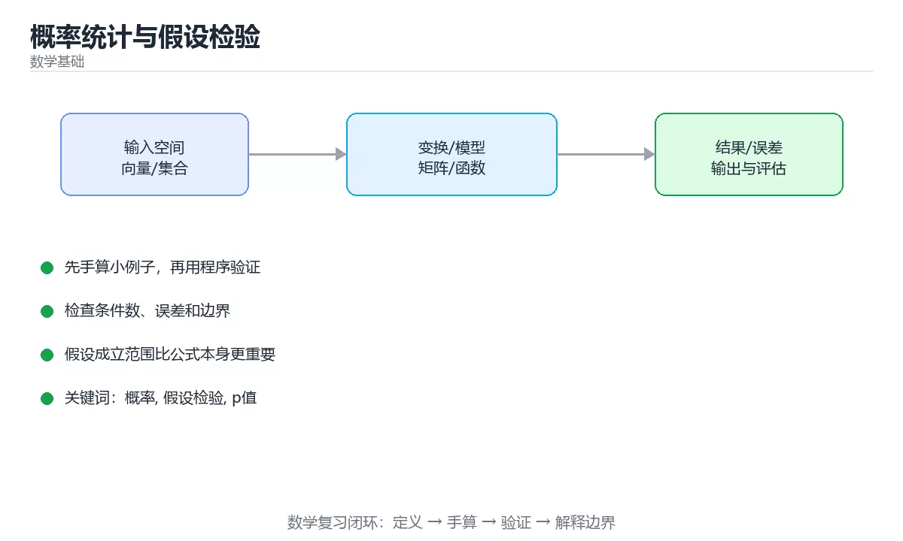

# 本课主题

> 内容更新时间：2026-10-03




## 学习目标

- 能用自己的话解释本课主题解决了什么问题，而不是只背术语。
- 能说清 「概率」、「假设检验」、「p值」、「置信区间」 之间的关系，并分别举出一个例子。
- 能把本课知识放回「数学基础」的知识体系，说明它和相邻主题的边界。
- 能完成本课练习，并用验收标准检查自己的结果。

> 一句话摘要：置信区间、样本量估算、p 值与 A/B 实验决策流程。

## 前置知识

- 先完成上一课《微积分与梯度下降》；如果已经掌握，可以直接用本课练习自测。
- 本课阶段：进阶。建议先掌握同一分类的基础课程，并能独立运行正文中的最小示例。
- 开始前先复习：概率、假设检验、p值。
- 如果某一步看不懂，先记录具体卡点，完成练习后再回头读一遍。

## 为什么需要它

做 A/B 实验、看线上指标、评估模型效果时，「涨了 3%」到底是真实提升还是随机波动，需要用统计判断。这一节把最常用的概念串成一条可操作的链路：分布 → 抽样 → 估计 → 检验 → 决策。

## 核心分布速查

| 分布 | 描述什么 | 期望 | 方差 |
| --- | --- | --- | --- |
| 伯努利 | 一次成败 | p | p(1-p) |
| 二项 | n 次试验成功次数 | np | np(1-p) |
| 泊松 | 单位时间事件数 | λ | λ |
| 指数 | 事件间隔时间 | 1/λ | 1/λ² |
| 正态 | 大量独立因素叠加 | μ | σ² |

## 抽样与估计

- 中心极限定理：独立同分布样本的均值近似正态，这是置信区间与检验的基础。
- 标准误：`SE = σ / √n`，样本量翻 4 倍，误差才减半。
- 置信区间：95% 置信区间约等于「均值 ± 1.96 × SE」。
- 样本量与效果量：能检测的最小提升越小，需要的样本量越大（约为 1/效果量² 量级）。

```python
import math
import random
from statistics import mean, stdev

def confidence_interval(samples: list, z: float = 1.96) -> tuple:
    """均值与 95% 置信区间（大样本近似）。"""
    n = len(samples)
    if n < 2:
        raise ValueError("样本量不足")
    avg = mean(samples)
    se = stdev(samples) / math.sqrt(n)
    return round(avg - z * se, 4), round(avg + z * se, 4)

def required_sample_size(baseline: float, min_effect: float, power: float = 0.8) -> int:
    """粗略估算每组样本量：效果越小，需要的样本越多。"""
    z_alpha = 1.96
    z_beta = 0.84 if power == 0.8 else 1.28
    p1 = baseline
    p2 = baseline + min_effect
    pooled = (p1 + p2) / 2
    numerator = (z_alpha * math.sqrt(2 * pooled * (1 - pooled))
                 + z_beta * math.sqrt(p1 * (1 - p1) + p2 * (1 - p2))) ** 2
    return math.ceil(numerator / (min_effect ** 2))

random.seed(7)
samples = [random.gauss(100, 15) for _ in range(500)]
print(confidence_interval(samples))
print(required_sample_size(baseline=0.10, min_effect=0.01))
```

## 假设检验速查

| 概念 | 含义 | 常见误解 |
| --- | --- | --- |
| 原假设 H0 | 默认「无差异」 | 不是「要被推翻的坏假设」 |
| p 值 | H0 成立时观察到当前或更极端结果的概率 | 不等于「H0 为真的概率」 |
| 显著性水平 α | 允许的假阳性率（常用 0.05） | 不是效果大小 |
| 第一类错误 | 实际无差异却判有差异 | 由 α 控制 |
| 第二类错误 | 实际有差异却判无差异 | 由样本量与效果量决定 |
| 统计功效 | 正确检出真实差异的概率（常用 0.8） | 功效不足会漏掉真效果 |

多重比较：同时跑 20 个指标，即使全是噪声，也大约会有 1 个「显著」。要用 Bonferroni 或 FDR 校正。

```python
def z_test_two_proportions(c1: int, n1: int, c2: int, n2: int) -> dict:
    """两比例 z 检验：A/B 实验最常用的近似检验。"""
    p1, p2 = c1 / n1, c2 / n2
    p_pool = (c1 + c2) / (n1 + n2)
    se = math.sqrt(p_pool * (1 - p_pool) * (1 / n1 + 1 / n2))
    if se == 0:
        return {"lift": 0.0, "z": 0.0, "significant": False}
    z = (p1 - p2) / se
    return {
        "lift": round((p1 - p2) / p2, 4),
        "z": round(z, 3),
        "significant": abs(z) > 1.96,
    }

print(z_test_two_proportions(c1=1200, n1=10000, c2=1100, n2=10000))
```

## A/B 实验流程

1. 先定指标与最小可检测效果（MDE），再算样本量。
2. 随机分流要均匀，避免同一用户跨组（用用户 ID 哈希分流）。
3. 跑满预设周期（覆盖完整周周期），不要中途偷看结果就停止。
4. 看主指标加护栏指标（性能、错误率、投诉率）。
5. 结论要报告置信区间与效果量，而不是只报「显著」。

## 常见错误对照表

| 容易踩的做法 | 实际现象 | 原因与正确做法 |
| --- | --- | --- |
| 把 p 值当「H0 为真的概率」 | 结论表述错误 | p 值是 H0 成立时出现当前结果的概率 |
| 只看显著性不看效果量 | 上线后收益微乎其微 | 同时报告提升幅度与置信区间 |
| 样本不足就下结论 | 结论随机波动 | 先算样本量再实验 |
| 中途偷看并提前停止 | 假阳性率飙升 | 固定周期与停止规则 |
| 多指标不做校正 | 必然出现「显著」 | Bonferroni 或 FDR 校正 |
| 用平均值掩盖长尾 | 体验判断错误 | 看 P95/P99 与分布 |
| 忽略护栏指标 | 转化涨了但崩溃率上升 | 主指标与护栏指标一起看 |
| 分流不均匀 | 组间本来就有差异 | 做 AA 检验与分流比例校验 |

## 自测清单

- [ ] 能说出标准误与样本量的关系。
- [ ] 知道 p 值不等于「原假设为真的概率」。
- [ ] 会按最小可检测效果估算所需样本量。
- [ ] 做多重比较时使用校正方法。
- [ ] A/B 结论包含效果量与置信区间，并检查护栏指标。

## 动手练习

> 本课练习重点：围绕「概率、假设检验、p值」完成复述、实验和交付，每个结果都要能被别人检查。

先手算 3 步小例子，再画图或用程序验证，最后说明假设与误差。

### 练习 1：建立心智模型（10 分钟）

合上教程，用 3～5 句话回答：

1. 本课主题解决了什么问题？
2. 如果没有它，会出现什么具体后果？
3. 它和「假设检验」是什么关系？

**验收标准**：至少出现一个本课关键词，并写出一个反例、边界条件或失效场景。

### 练习 2：做一次可控实验（20 分钟）

从正文中选一个最小示例，完成以下操作：

1. 先预测修改一个参数、输入或步骤后的结果。
2. 再实际执行或逐步推演，记录真实结果。
3. 如果结果与预测不同，写出差异原因。

**验收标准**：留下「原例 → 改动 → 预测 → 结果 → 原因」五步记录。

### 练习 3：交付一个小结果（30 分钟）

先手算一个 3～4 步的小例子，再用 Python 或计算器验证结果。

任务要求：

- 结果必须能被别人检查，不能只写“我已经理解了”。
- 至少覆盖「概率」和「假设检验」两个关键词。
- 写出 1 个仍然不确定的问题，以及下一步如何验证。

> 提示：时间有限时优先做练习 1 和练习 2；练习 3 可以拆成两次完成。

## 本课小结

- 核心问题：本课主题不是孤立术语，而是在「数学基础」中解决一类具体问题。
- 关键关系：先分清「概率」与「假设检验」的职责，再理解「p值」的适用边界。
- 判断标准：能解释正常场景、边界条件和失败场景，才算真正掌握。
- 下一步：完成练习后，用自己的话写下 3 条要点，再去做本课测验。

## 深入补充：本课主题

前面已经建立了基本概念。这一节换一个角度，把本课主题放进真实工程里，
重点回答三件事：它为什么存在、内部如何运转、什么时候会失效。

### 一、核心模型

假设检验把“数据看起来不同”转成可计算的概率判断：先定义原假设与备择假设，再选择统计量、显著性水平和检验方法，最后结合效应量与置信区间做决策。

```text
提出假设 → 选择检验 → 计算统计量 → 得到 p 值/置信区间 → 对照显著性水平 → 判断统计显著 → 结合业务判断实际意义
```

### 二、关键机制拆解

1. 原假设通常表示没有效应或没有差异，备择假设表示研究者希望发现的差异。
2. 第一类错误是把无差异判成有差异，第二类错误是把真实差异漏掉；降低一类错误通常会增加另一类错误。
3. p 值表示在原假设成立时，观察到当前或更极端数据的概率，不是原假设为真的概率。
4. 置信区间给出效应范围，比只报告 p 值更能说明结果是否具有实际意义。
5. 样本量不足会让真实差异难以被检出，样本量过大则可能把微小差异判成显著。
6. 多重比较会放大假阳性，必须使用 Bonferroni、FDR 等方法校正。
7. 统计显著不等于业务重要，最终决策还要考虑成本、风险和收益。

### 三、对照表：抓住容易混淆的边界

| 维度 | 一侧 | 另一侧 |
| --- | --- | --- |
| 统计显著 | 数据与原假设不一致的程度较高 | 不代表效应大或业务价值高 |
| 实际显著 | 效应大小足以影响决策 | 需要结合成本和领域标准 |
| 第一类错误 | 把无差异判成有差异 | 通常用显著性水平控制 |
| 第二类错误 | 漏掉真实存在的差异 | 受样本量和效应大小影响 |

### 四、工作示例

比较两种页面转化率：A 组 1000 次点击转化 100 次，B 组 1000 次转化 120 次。计算比例差与置信区间后，若区间包含 0，不能宣布 B 更好；若区间整体大于 0，还要评估提升 2 个百分点是否值得改版成本。

### 五、常见误区与失效边界

| 错误做法或假设 | 后果 | 正确做法 |
| --- | --- | --- |
| 多次偷看数据直到显著 | 假阳性率大幅升高 | 预先确定样本量和停止规则 |
| 只报告 p 值 | 读者不知道效应大小 | 同时报告置信区间和原始指标 |
| 忽略样本代表性 | 结论无法推广到总体 | 检查抽样方法和分流是否随机 |
| 把不显著当成没有差异 | 可能只是样本不足 | 结合检验功效和最小可检测效应 |

### 六、场景推演

实验平台显示某策略 p=0.04，但业务方发现提升只有 0.1%。正确流程是：确认实验未中途偷看；检查置信区间和最小可检测效应；评估 0.1% 提升是否能覆盖开发和维护成本；最后决定上线、继续实验或放弃。

### 七、自测问答

**Q1：p 值等于原假设为真的概率吗？**

不等于，它是在原假设成立时数据出现当前或更极端结果的概率。

**Q2：为什么不显著不能证明没有差异？**

可能是样本量太小或功效不足，真实差异没有被检测出来。

**Q3：多重比较为什么危险？**

同时检验很多假设时，至少出现一个假阳性的概率会快速上升。

**Q4：统计显著后还要看什么？**

还要看效应大小、置信区间、成本和业务收益。

### 八、小项目：把知识变成可检查的产出

设计一个 A/B 实验：写出原假设、主指标、样本量估算、停止规则和分析计划；用模拟数据跑一次检验，报告 p 值、置信区间、效应量和最终业务建议。

### 九、适用边界

假设检验只能处理随机性和抽样误差，不能修复有偏样本、错误分流或指标定义问题。实验设计错误时，后续统计再复杂也无法得到可信结论。

### 十、完成检查清单

- [ ] 能写出原假设与备择假设
- [ ] 能正确解释 p 值
- [ ] 能区分统计显著和实际显著
- [ ] 能说明样本量与检验功效的关系
- [ ] 能设计一次可复现的 A/B 实验

### 十一、复习顺序

1. 先不看资料复述“核心模型”，确认能说出它解决的三个问题。
2. 再对照表逐行解释容易混淆的概念，每个概念补一个反例。
3. 跟着工作示例做一遍，改变一个条件并预测结果。
4. 用自测问答检查理解，错题回到对应小节重新阅读。
5. 最后完成小项目，把结果、失败记录和复查清单整理成一份可提交产物。

> 复习不是重读一遍，而是离开原文重新产出：复述、改写、验证、复盘。

## 可运行练习

### 任务 1：先跑通，再解释

```python
def z_test_two_proportions(c1: int, n1: int, c2: int, n2: int) -> dict:
    """两比例 z 检验：A/B 实验最常用的近似检验。"""
    p1, p2 = c1 / n1, c2 / n2
    p_pool = (c1 + c2) / (n1 + n2)
    se = math.sqrt(p_pool * (1 - p_pool) * (1 / n1 + 1 / n2))
    if se == 0:
        return {"lift": 0.0, "z": 0.0, "significant": False}
    z = (p1 - p2) / se
    return {
        "lift": round((p1 - p2) / p2, 4),
        "z": round(z, 3),
        "significant": abs(z) > 1.96,
    }

print(z_test_two_proportions(c1=1200, n1=10000, c2=1100, n2=10000))
```

### 任务 2：只改一个条件

### 任务 3：迁移到自己的数据

用同一套思路处理一组你自己的数据或场景，保持输出格式与任务 1 一致。

## 故障现场

### 现场 1：本课的 概率 常规用例通过，但边界用例失败

**症状**：在本课的练习或生产场景里出现“本课的 概率 常规用例通过，但边界用例失败”。

**复现**：准备一组最小输入，只保留触发“本课的 概率 常规用例通过，但边界用例失败”的必要条件，连续运行两次确认结果稳定。

**定位**：围绕“概率 的前置条件与取值边界没有写进代码，默认值掩盖了空值和极值”检查调用链、输入数据和环境配置，先验证假设再改代码。

**预防**：把“本课的 概率 常规用例通过，但边界用例失败”写成一条自动化用例，并在本课的验收清单里保留对应检查项。

### 现场 2：本课的 假设检验 结果在两次运行之间不一致

**症状**：在本课的练习或生产场景里出现“本课的 假设检验 结果在两次运行之间不一致”。

**复现**：准备一组最小输入，只保留触发“本课的 假设检验 结果在两次运行之间不一致”的必要条件，连续运行两次确认结果稳定。

**定位**：围绕“假设检验 依赖了当前版本、执行顺序或共享状态，单次运行无法暴露差异”检查调用链、输入数据和环境配置，先验证假设再改代码。

**预防**：把“本课的 假设检验 结果在两次运行之间不一致”写成一条自动化用例，并在本课的验收清单里保留对应检查项。

### 现场 3：本课的验证只在开发机通过

**症状**：在本课的练习或生产场景里出现“本课的验证只在开发机通过”。

**定位**：围绕“环境版本、配置和输入规模与目标环境不同，概率 缺少可重复的验证记录”检查调用链、输入数据和环境配置，先验证假设再改代码。

## 本课复习清单

离开本课前，逐项确认：

- [ ] 不看解析，能说出「标准误 SE = σ/√n 的含义是？」的判断依据。
- [ ] 不看解析，能说出「关于 p 值，下面说法正确的是？」的判断依据。
- [ ] 不看解析，能说出「某实验同时观察 20 个指标且不做任何校正，最可能出现什么？」的判断依据。
- [ ] 不看解析，能说出「想让实验能检测出更小的效果（例如从 1% 降到 0.5%），需要怎么做？」的判断依据。
- [ ] 不看解析，能说出「A/B 实验跑到一半发现主指标已显著，正确做法是？」的判断依据。
- [ ] 不看解析，能说出「把本课主题中「A/B 实验流程」的步骤调整为正确顺序。」的判断依据。
- [ ] 至少运行一次本课示例，记录输入、输出和一个边界情况。
- [ ] 把本课最容易混淆的两个概念写成一句话对照。

| 复盘项 | 记录 |
| --- | --- |
| 已经能独立解释的考点 |  |
| 仍然说不清的概念 |  |
| 下一步验证动作 |  |

## 术语速查

| 术语 | 本课语境 |
| --- | --- |
| `SE = σ / √n` | 标准误：`SE = σ / √n`，样本量翻 4 倍，误差才减半。 |
| `概率` | 本课围绕该主题展开，结合正文与代码示例理解它的适用边界。 |
| `假设检验` | 本课围绕该主题展开，结合正文与代码示例理解它的适用边界。 |
| `p值` | 本课围绕该主题展开，结合正文与代码示例理解它的适用边界。 |
| `置信区间` | 本课围绕该主题展开，结合正文与代码示例理解它的适用边界。 |
| `AB测试` | 本课围绕该主题展开，结合正文与代码示例理解它的适用边界。 |
| `样本量` | 本课围绕该主题展开，结合正文与代码示例理解它的适用边界。 |

## 考点精讲

### 考点 1：围绕“概率统计与假设检验”中的 概率、假设检验、p值，下列哪两项是本课强调的实践判断？

- **判断依据**：正确答案包括「学习 概率 时要同时说明输入、输出和失败路径，不能只看正常流程」、「验证 假设检验 时要固定版本并覆盖边界输入，结论才可复现」。正确答案是学习 概率 时要同时说明输入、输出和失败路径。本课把本课主题拆成概念、示例与故障现场三部分，因此判断 概率 时必须同时交代输入、输出和失败路径，这使“学习 概率 时要同时说明输入、输出和失败路径，不能只看正常流程”成立。在本课主题里，判断 假设检验 时要固定版本与边界输入，所以“验证 假设检验 时要固定版本并覆盖边界输入，结论才可复现”才可复现。

### 考点 2：下面这段 Python 代码复现了“概率统计与假设检验”中 概率、假设检验、p值 相关的一个常见故障，哪一项最准确地解释了问题？

- **判断依据**：结合概率、假设检验来看，本题应选「默认参数 bucket=[] 只在定义时创建一次，两次调用共享同一个列表」。本题应选默认参数 bucket=[] 只在定义时创建一次，两次调用共享同一个列表（mathprobabilitystats 第 2 题）。结合概率、假设检验来看，本题应选默认参数 bucket=[] 只在定义时创建一次。

### 考点 3：某实验同时观察 20 个指标且不做任何校正，最可能出现什么？

- **判断依据**：符合题干条件的是「假阳性率会明显上升」。α=0.05 时跑 20 个独立检验，至少一个假阳性的概率约为 1-0.95²⁰ ≈ 64%，所以必须做 Bonferroni 或 FDR 校正。正确的判断需要逐项核对定义、版本和适用条件（mathprobabilitystats 第 3 题）。

### 考点 4：想让实验能检测出更小的效果（例如从 1% 降到 0.5%），需要怎么做？

- **判断依据**：结论应落在「大幅增加样本量」。所需样本量约与效果量平方成反比，效果减半意味着样本量约需增加 4 倍。这道题要求区分概念与边界，「大幅增加样本量」只有在题干给出的前提下才成立，而「提高显著性水平 α 到 0.2」、「改用单侧检验即可」缺少同一组条件。

### 考点 5：A/B 实验跑到一半发现主指标已显著，正确做法是？

- **判断依据**：正确答案是「先看护栏指标是否恶化再决定」。中途偷看并提前停止会显著抬高假阳性率。判断这类题时，要把「先看护栏指标是否恶化再决定」放回题干限定的对象、输入和边界，「把两组数据合并重新计算」、「延长实验到两倍时长即可」 等说法虽然包含相关术语，但范围或前提与本题不一致。

### 考点 6：把「概率统计与假设检验」中「A/B 实验流程」的步骤调整为正确顺序。

- **判断依据**：正确的执行顺序是「先定指标与最小可检测效果（MDE），再算样本量」 → 「随机分流要均匀，避免同一用户跨组（用用户 ID 哈希分流）」 → 「跑满预设周期（覆盖完整周周期），不要中途偷看结果就停止」 → 「看主指标加护栏指标（性能、错误率、投诉率）」。

## English Overview

**Title:** Probability & Hypothesis Testing

**Summary:** Confidence intervals, sample size, p-values and A/B decisions.

**Category:** Mathematics
**Level:** 进阶
**Key terms:** 概率, 假设检验, p值, 置信区间, AB测试, 样本量

## 内容元数据

- 内容版本：v2.0
- 最后更新：2026-10-03
- 学习阶段：进阶
- 适用环境：线性代数、概率统计与优化基础
- 内容来源：内置结构化课程与工程实践整理
- 相关主题：概率、假设检验、p值、置信区间、AB测试、样本量
- 质量版本：P0 测验标准 + P1 覆盖扩展 + P2 体验补全


## 参考资料与复核

- 最后复核：2026-10-04
- 下次复核：2027-04-04
- 复核范围：版本兼容、API 行为、安全建议与工程实践
- 来源性质：官方文档、标准或权威教材；正文为离线教学重组

| 参考资料 | 本课用途 |
| --- | --- |
| [OpenStax 概率统计](https://openstax.org/details/books/introductory-statistics) | 概率、分布与统计推断 |
| [Khan Academy 数学](https://www.khanacademy.org/math) | 从基础算术到高等数学 |
| [MIT 离散数学](https://ocw.mit.edu/courses/6-042j-mathematics-for-computer-science-fall-2010/) | 逻辑、证明与离散结构 |

> 「概率统计与假设检验」的链接用于离线阅读后的延伸核对；App 不会自动联网。
