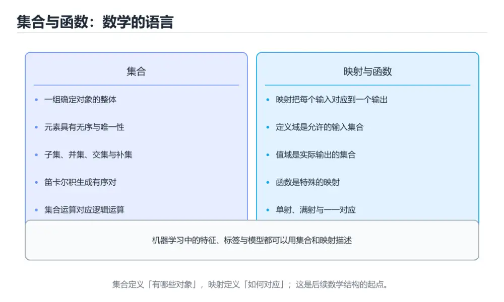

# 集合与函数入门

> 内容更新时间：2026-10-06 · 学习阶段：基础 · 预计用时：40 分钟




## 本节知识框架

**课程定位**：所属分类 `math`（数学基础），课程主题 `集合与函数入门`，学习阶段 基础，建议用时 45 分钟。

本课主线：理解集合、映射、定义域和值域。

**学完本课应当能够**
- 说清 `集合` 与 `属于与包含` 的含义与区别，并各举一个正例和一个反例。
- 用本课示例验证 `函数与映射` 的行为，记录输入、输出与失败条件。
- 遇到「混淆属于与包含」这类问题时，能说出触发条件与修复顺序。

### 从概念到验证的学习链条

1. `集合`：先掌握 把确定对象看成一个整体的数学结构，元素之间不重复、无顺序，再用它解释 `属于与包含` 为什么会出现。
2. `属于与包含`：先掌握 ∈ 表示元素属于集合，⊆ 表示一个集合完全包含在另一个集合里，再用它解释 `函数与映射` 为什么会出现。
3. `函数与映射`：先掌握 把每个输入对应到唯一输出的规则，再用它解释 `定义域与值域` 为什么会出现。
4. `定义域与值域`：先掌握 定义域是所有合法输入，值域是所有实际取到的输出，再用它解释 `单射与满射` 为什么会出现。
5. `单射与满射`：先掌握 单射保证不同输入得到不同输出，满射保证每个目标值都被取到，再用它解释 `德摩根律` 为什么会出现。
6. `德摩根律`：先掌握 德摩根律指出：并集的补等于补集的交，再用它解释 本课示例的观察结果 为什么会出现。

**先修与衔接**：本课是「数学基础」分类的第 3 课。当前没有登记显式先修或后续课程；课程主线是理解集合、映射、定义域和值域。学完后按 `math` 分类顺序继续。

### 完成判据

- **定义关**：不看正文也能说明 `集合` 是 把确定对象看成一个整体的数学结构，元素之间不重复、无顺序，并指出一个反例。
- **机制关**：能按“输入 → 转换 → 输出 → 验证”复述 `集合与函数入门`，而不是只背结论。
- **示例关**：能运行或推演 `集合与函数入门` 的 `python` 示例，并说明一个真实出现的标识符或字面量。
- **证据关**：能指出 `集合与函数入门` 示例里的 调用了 `print()`，并说明它支持或反驳了本课的哪一条结论。
- **排错关**：能复现 混淆属于与包含，记录现象并按 属于判断元素，包含判断集合之间的关系 修复。
- **迁移关**：能把 `集合与函数入门`、`数学基础`、`入门练习` 放进一个与 `集合与函数入门` 不同的项目场景，并保持输入与验证条件可追踪。
- **复盘关**：学完 `集合与函数入门` 后，用一句话写下仍然不确定的结论，并列出下一次验证需要的输入、环境和成功判据。

### 复习清单

- [ ] 能不看正文复述本课核心术语，并指出一个边界或反例。
- [ ] 能运行或推演本课示例，记录输入、输出与失败现象。
- [ ] 能完成一次自测，并把错题对照错误表定位原因。

## 核心概念定义

| 术语 | 操作性定义 | 常见边界与风险 |
| --- | --- | --- |
| 集合 | 把确定对象看成一个整体的数学结构，元素之间不重复、无顺序。 | 易错：元素与集合关系判断写错；正确做法是属于判断元素，包含判断集合之间的关系。 |
| 属于与包含 | ∈ 表示元素属于集合，⊆ 表示一个集合完全包含在另一个集合里。 | 易错：元素与集合关系判断写错；正确做法是属于判断元素，包含判断集合之间的关系。 |
| 函数与映射 | 把每个输入对应到唯一输出的规则。 | 只在「把每个输入对应到唯一输出的规则」这一前提下成立，换输入或换环境要重新验证。 |
| 定义域与值域 | 定义域是所有合法输入，值域是所有实际取到的输出。 | 易错：求值与复合函数出错；正确做法是先写清定义域、值域与对应规则，再计算。 |
| 单射与满射 | 单射保证不同输入得到不同输出，满射保证每个目标值都被取到。 | 易错：逆函数不存在的场景仍在使用；正确做法是先验证单射与满射，再讨论逆函数。 |
| 德摩根律 | 德摩根律指出：并集的补等于补集的交 | 只在「德摩根律指出：并集的补等于补集的交」这一前提下成立，换输入或换环境要重新验证。 |

## 原理与运行机制

### 机制总览

**教材衔接：一句话入门**

理解集合、映射、定义域和值域。

**教材衔接：深入理解：集合与函数入门**

### 集合运算与德摩根律

交集、并集、差集、对称差构成集合的基本运算。德摩根律指出：并集的补等于补集的交，
交集的补等于补集的并。它在程序里对应布尔条件化简：`not (a or b)` 等价于
`not a and not b`。写查询或权限判断时，先明确论域（全集）与补集范围，再化简条件，
可以避免遗漏边界情况。

### 映射、单射、满射与双射

函数是集合之间的映射：每个输入最多对应一个输出。单射要求不同输入映射到不同输出，
满射要求值域中的每个元素都被覆盖，双射同时满足两者，因此存在逆函数。哈希函数
通常不是单射（存在碰撞），加密函数在密钥固定时接近双射。判断一个函数能否反解，
本质上是在判断它属于哪一类映射。

### 复合、逆与代码中的对应

复合函数先应用内层再应用外层，顺序不能交换；逆函数把输出还原成输入，但只有在
双射且定义域合适时才存在。写代码时，参数校验是在划定定义域，返回值范围是值域，
可逆的编解码必须保证往返一致（round-trip）。把数学定义与类型、断言、测试用例
对应起来，抽象概念就会变成可以验证的工程约束。

<!-- p0-depth-v2:start -->

**教材衔接：深入补充：集合与函数入门 的取舍与边界**

### 一、把概念放回真实约束

| 概念 | 直觉解释 | 公式或定义 | 工程用途 |
| --- | --- | --- | --- |
| 集合与函数入门 | 用可计算的方式描述变化 | 见正文公式 | 建模与估算 |
| 数学基础 | 描述不确定性或约束 | 见正文推导 | 校验与决策 |
| 近似 | 用可控误差换速度 | 误差上界 | 大规模计算 |


### 四、自测清单

**教材衔接：零基础精讲：把集合与函数入门真正讲透**

### 先建立一个直觉

把数学工具看成一套精确语言：先定义对象与前提，再推导关系，最后用例子和反例检查结论的适用范围。
落到本课，「集合与函数入门」关心的是 集合与函数入门 与 数学基础 的配合，也就是说这条直觉要在 集合与函数是描述关系的语言 里被具体验证。

本课的摘要可以当作一张地图：理解集合、映射、定义域和值域。

### 逐步拆解

1. 澄清输入与目标。先写清「集合与函数入门」要解决的问题、合法输入范围和成功标准，再进入后续步骤。
2. 描述处理过程。把「集合与函数入门、数学基础、入门练习」映射到具体步骤，每步都要求能单独验证。
3. 定义输出。集合与函数入门 的输出不仅包括正常结果，还包括错误码、日志和资源释放状态。
4. 关掉一个看似必要的检查（数学基础相关），观察哪个测试或指标先失败，用证据说明它为什么不能省。
5. 用同一个集合与函数入门输入跑两遍：一遍按正文步骤，一遍故意跳过一步，比较输出并解释为什么必须按顺序执行。

### 把正文串成一条执行链

- **实验一：建立基线**：先原样运行 sorted 所在的示例，记录版本、命令、完整输出与退出状态。
- **实验三：制造一个可控错误**：在「集合与函数入门」里，「实验三：制造一个可控错误」这一步要先写清输入与预期，再记录实际结果和差异；结果不符时回到对应小节核对前提。
- **集合运算与德摩根律**：交集、并集、差集、对称差构成集合的基本运算
- **映射、单射、满射与双射**：函数是集合之间的映射：每个输入最多对应一个输出

### 从测验反推易错点

**检查点 1：集合运算中，A & B 与 A | B 分别表示什么？**

- 参考判断：交集：同时属于两个集合的元素
- 自问：如果去掉题干里的一个限定词，结论还成立吗？

**检查点 2：函数的定义域与值域分别指什么？**

- 参考判断：定义域是允许输入的集合，值域是实际输出的集合

**检查点 3：集合运算示例运行后输出什么？**

- 参考判断：[3] [1, 2, 3, 4]，先输出交集再输出并集

**检查点 4：集合与列表在数据特性上的主要区别是？**

- 参考判断：集合不保存重复元素且无序，列表保留顺序并允许重复

- 参考判断：(g ∘ f)(x)


### 变式训练

1. 先用一个单文件示例验证 sorted，确认正确性后再引入框架或分布式组件。
2. 把 sorted 的数据量提高一个数量级，观察延迟与内存的变化拐点。
3. 把 数学基础 换成失败输入，记录错误信息与恢复动作。
5. 减少一个输入字段后重跑 sorted，记录失败信息出现在哪一层，据此判断这个字段是必填还是可推导。
6. 把 集合与函数入门 的方案切换到低资源设备，重新评估默认参数、超时和降级策略。

### 本课自测

- [ ] 能用一句话解释集合与函数入门在本课中的角色与边界。
- [ ] 能举出一个正常例子和一个失败例子。
- [ ] 能说出最小验证步骤，以及需要记录的证据。
- [ ] 能用一句话解释「数学基础」在本课中的角色与边界。
- [ ] 能说明 sorted 负责什么、不负责什么。

### 迁移案例库

围绕 sorted 重复同一套方法，每完成一轮就把差异写进笔记。

#### 迁移案例 1：围绕集合与函数入门做一次小实验

**目标**：在不改变课程主体的前提下，验证集合与函数入门中的一个关键判断。

**步骤**：
1. 复述当前方案对本课的假设，写成一句可证伪的话。
2. 设计一个正常输入和一个边界输入，分别预测输出。
3. 运行或逐步演算，记录实际输出、耗时和失败信息。
4. 只调整一个参数，比较前后差异并解释原因。
5. 补充一条测试或复习卡，确保下次能更快复现。

**验收**：集合与函数入门 的正常、边界、失败三条路径都要有结论；失败路径要写清恢复动作与「集合与函数入门」里仍然存在的剩余风险。

#### 迁移案例 2：围绕「数学基础」做一次小实验

**步骤**：
1. 复述当前方案对「数学基础」的假设，写成一句可证伪的话。

#### 迁移案例 3：围绕「入门练习」做一次小实验

**步骤**：
1. 写出 数学基础 在新场景下必须成立的一个前提。

#### 迁移案例 4：围绕集合与函数入门做一次小实验

**步骤**：

#### 迁移案例 5：围绕「数学基础」做一次小实验

**步骤**：

#### 迁移案例 6：围绕「入门练习」做一次小实验

**步骤**：

#### 迁移案例 7：围绕集合与函数入门做一次小实验

**步骤**：

#### 迁移案例 8：围绕「数学基础」做一次小实验

**步骤**：

#### 迁移案例 9：围绕「入门练习」做一次小实验

**步骤**：

#### 迁移案例 10：围绕集合与函数入门做一次小实验

**步骤**：

#### 迁移案例 11：围绕「数学基础」做一次小实验

**步骤**：

#### 迁移案例 12：围绕「入门练习」做一次小实验

**步骤**：

#### 迁移案例 13：围绕集合与函数入门做一次小实验

**步骤**：

#### 迁移案例 14：围绕「数学基础」做一次小实验

**步骤**：

#### 迁移案例 15：围绕「入门练习」做一次小实验

**步骤**：

#### 迁移案例 16：围绕集合与函数入门做一次小实验

**步骤**：

<!-- p0-depth-v2:end -->

### 机制拆解：每一步的输入、动作与输出

#### 1. `集合`
- 输入：`集合与函数入门`；本步把 把确定对象看成一个整体的数学结构，元素之间不重复、无顺序 当作判断规则。
- 动作：围绕 `集合` 保留中间状态，并记录它与 `属于与包含` 的对应关系。
- 输出：`属于与包含`，它可以被下一段代码、测试或记录继续使用。
- `集合` 的失败条件：当混淆属于与包含时，会出现元素与集合关系判断写错。

#### 2. `属于与包含`
- 输入：`集合`；本步把 ∈ 表示元素属于集合，⊆ 表示一个集合完全包含在另一个集合里 当作判断规则。
- 动作：围绕 `属于与包含` 保留中间状态，并记录它与 `函数与映射` 的对应关系。
- 输出：`函数与映射`，它可以被下一段代码、测试或记录继续使用。
- `属于与包含` 的失败条件：当混淆属于与包含时，会出现元素与集合关系判断写错。

#### 3. `函数与映射`
- 输入：`属于与包含`；本步把 把每个输入对应到唯一输出的规则 当作判断规则。
- 动作：围绕 `函数与映射` 保留中间状态，并记录它与 `定义域与值域` 的对应关系。
- 输出：`定义域与值域`，它可以被下一段代码、测试或记录继续使用。
- `函数与映射` 的失败条件：只在「把每个输入对应到唯一输出的规则」这一前提下成立，换输入或换环境要重新验证。

#### 4. `定义域与值域`
- 输入：`函数与映射`；本步把 定义域是所有合法输入，值域是所有实际取到的输出 当作判断规则。
- 动作：围绕 `定义域与值域` 保留中间状态，并记录它与 `单射与满射` 的对应关系。
- 输出：`单射与满射`，它可以被下一段代码、测试或记录继续使用。
- `定义域与值域` 的失败条件：当忽略定义域与值域时，会出现求值与复合函数出错。

#### 5. `单射与满射`
- 输入：`定义域与值域`；本步把 单射保证不同输入得到不同输出，满射保证每个目标值都被取到 当作判断规则。
- 动作：围绕 `单射与满射` 保留中间状态，并记录它与 `德摩根律` 的对应关系。
- 输出：`德摩根律`，它可以被下一段代码、测试或记录继续使用。
- `单射与满射` 的失败条件：当默认函数一定可逆时，会出现逆函数不存在的场景仍在使用。

#### 6. `德摩根律`
- 输入：`单射与满射`；本步把 德摩根律指出：并集的补等于补集的交 当作判断规则。
- 动作：围绕 `德摩根律` 保留中间状态，并记录它与 `print` 的对应关系。
- 输出：`print`，它可以被下一段代码、测试或记录继续使用。
- `德摩根律` 的失败条件：只在「德摩根律指出：并集的补等于补集的交」这一前提下成立，换输入或换环境要重新验证。

### 示例中的可观察事实

1. 调用了 `print()`；它对应的课程主题是 `集合与函数入门`。
2. 调用了 `sorted()`；它对应的课程主题是 `集合与函数入门`。

### 复现实验记录

- 环境：`集合与函数入门` 使用 `python` 示例，固定 `集合与函数入门`、`数学基础`、`入门练习` 作为第一组条件。
- 首轮输入：先确认 调用了 `print()`，预测 `集合` 会怎样变化。
- 基线观察：记录命令、输入、输出和错误原文，不用截图代替可复制的文本。
- 单变量修改：只改变 `集合与函数入门`，观察 `德摩根律` 是否仍满足定义。
- 失败注入：复现 混淆属于与包含，确认现象是 元素与集合关系判断写错。
- 记录结论：把“修改前、修改后、预期变化、实际变化”写成四列表，这样复盘 `集合与函数入门` 时才能区分概念错误与实现错误。

## 典型应用场景

**教材衔接：代码实验：把示例跑成证据**

### 实验一：建立基线

```python
A = {1, 2, 3}
B = {3, 4}
print(sorted(A & B), sorted(A | B))
```

### 实验二：只改一个输入

沿用「集合与函数入门」的最小示例做一次单变量实验：

做完后用一句话写出「集合与函数入门」的结论：输入怎么变，结果才怎么变。

### 实验三：制造一个可控错误

删掉 数学基础 相关的一处必要写法，观察错误在哪一层出现，再恢复代码确认基线仍然可运行。

### 实验四：用三句话复述

1. 在「集合与函数入门」里，sorted 接受哪些输入，非法输入应该在哪里被挡住？
2. 在 集合与函数是描述关系的语言 里，数学基础 的状态是在什么条件下被改变的？
3. 输出如何验证，失败时第一条可观察证据是什么？

- **混淆属于与包含**：典型现象是元素与集合关系判断写错；正确做法是属于判断元素，包含判断集合之间的关系。
- **忽略定义域与值域**：典型现象是求值与复合函数出错；正确做法是先写清定义域、值域与对应规则，再计算。
- **默认函数一定可逆**：典型现象是逆函数不存在的场景仍在使用；正确做法是先验证单射与满射，再讨论逆函数。

### 最小验证场景

- 准备：保留 `python` 示例的原始输入，先记录 `集合与函数入门` 的基线输出和完整运行命令。
- 观察：先核对 调用了 `print()`，再改变一个与 `集合` 相关的条件。
- 判定：新结果与 `集合与函数入门` 的基线不同不等于错误；只有当差异破坏了 `集合` 的定义或错误表中的约束，才判定为失败。

### 选择与边界

- 使用 `集合` 时，先满足它的定义：把确定对象看成一个整体的数学结构，元素之间不重复、无顺序；易错：元素与集合关系判断写错；正确做法是属于判断元素，包含判断集合之间的关系。
- 使用 `属于与包含` 时，先满足它的定义：∈ 表示元素属于集合，⊆ 表示一个集合完全包含在另一个集合里；易错：元素与集合关系判断写错；正确做法是属于判断元素，包含判断集合之间的关系。
- 使用 `函数与映射` 时，先满足它的定义：把每个输入对应到唯一输出的规则；只在「把每个输入对应到唯一输出的规则」这一前提下成立，换输入或换环境要重新验证。
- 使用 `定义域与值域` 时，先满足它的定义：定义域是所有合法输入，值域是所有实际取到的输出；易错：求值与复合函数出错；正确做法是先写清定义域、值域与对应规则，再计算。
- 使用 `单射与满射` 时，先满足它的定义：单射保证不同输入得到不同输出，满射保证每个目标值都被取到；易错：逆函数不存在的场景仍在使用；正确做法是先验证单射与满射，再讨论逆函数。

## 代码/协议/SQL 示例

**教材衔接：最小示例**

```python
A = {1, 2, 3}
B = {3, 4}
print(sorted(A & B), sorted(A | B))
```

**教材衔接：预期输出**

```text
[3] [1, 2, 3, 4]
```

**运行方式**：运行 `集合与函数入门` 的示例时，保存为 `.py` 文件后用 `python 文件名.py` 运行；第三方依赖先在虚拟环境里安装。

### 示例精读：先找证据，再改一个条件

1. 调用了 `print()`；它出现在 `集合与函数入门` 的示例中，阅读时先确认它前后各发生了什么。
2. 调用了 `sorted()`；它出现在 `集合与函数入门` 的示例中，阅读时先确认它前后各发生了什么。
- 在 `集合与函数入门` 中与 `集合` 对照：示例必须能支持 把确定对象看成一个整体的数学结构，元素之间不重复、无顺序，否则说明这一段还缺少实现或验证步骤。
- 在 `集合与函数入门` 中与 `属于与包含` 对照：示例必须能支持 ∈ 表示元素属于集合，⊆ 表示一个集合完全包含在另一个集合里，否则说明这一段还缺少实现或验证步骤。
- 在 `集合与函数入门` 中与 `函数与映射` 对照：示例必须能支持 把每个输入对应到唯一输出的规则，否则说明这一段还缺少实现或验证步骤。
- 在 `集合与函数入门` 中与 `定义域与值域` 对照：示例必须能支持 定义域是所有合法输入，值域是所有实际取到的输出，否则说明这一段还缺少实现或验证步骤。

## 时间/空间复杂度或性能分析

**复杂度证据**：本课正文出现 `O(1)` 等量级表达式；使用前要同时确认输入规模、最好/平均/最坏情况以及常数项来源。

**测量方法**：以 `集合与函数入门` 的 `集合与函数入门` 场景为对象，固定输入跑一遍记录基线，再把规模或并发度提高一个数量级复测；两次结果的差值与波动范围才是结论依据。

### 需要控制的变量与记录项

- `集合与函数入门` 的 `集合与函数入门`：固定它的版本、输入范围和资源上限，分别记录速度、内存与失败率的变化。
- `集合与函数入门` 的 `数学基础`：固定它的版本、输入范围和资源上限，分别记录速度、内存与失败率的变化。
- `集合与函数入门` 的 `入门练习`：固定它的版本、输入范围和资源上限，分别记录速度、内存与失败率的变化。
- `集合与函数入门` 中 `集合` 的边界：易错：元素与集合关系判断写错；正确做法是属于判断元素，包含判断集合之间的关系。达到边界时不要外推，必须重新测量。
- `集合与函数入门` 中 `属于与包含` 的边界：易错：元素与集合关系判断写错；正确做法是属于判断元素，包含判断集合之间的关系。达到边界时不要外推，必须重新测量。
- `集合与函数入门` 中 `函数与映射` 的边界：只在「把每个输入对应到唯一输出的规则」这一前提下成立，换输入或换环境要重新验证。达到边界时不要外推，必须重新测量。
- `集合与函数入门` 中 `定义域与值域` 的边界：易错：求值与复合函数出错；正确做法是先写清定义域、值域与对应规则，再计算。达到边界时不要外推，必须重新测量。
- `集合与函数入门` 中 `单射与满射` 的边界：易错：逆函数不存在的场景仍在使用；正确做法是先验证单射与满射，再讨论逆函数。达到边界时不要外推，必须重新测量。
- `集合与函数入门` 的代码证据：先验证 调用了 `print()`，再记录该路径的输入规模与耗时；只看代码行数不能推出复杂度。

## 常见误区与易错点

| 容易写错的做法 | 实际现象 | 原因与正确做法 |
| --- | --- | --- |
| 混淆属于与包含 | 元素与集合关系判断写错。 | 属于判断元素，包含判断集合之间的关系。 |
| 忽略定义域与值域 | 求值与复合函数出错。 | 先写清定义域、值域与对应规则，再计算。 |
| 默认函数一定可逆 | 逆函数不存在的场景仍在使用。 | 先验证单射与满射，再讨论逆函数。 |

### 现场 1：混淆属于与包含

**症状**：元素与集合关系判断写错。

**根因与修复**：属于判断元素，包含判断集合之间的关系。

**自检**：在本课示例里复现「混淆属于与包含」，改成属于判断元素，包含判断集合之间的关系后重跑；如果症状消失且失败路径按预期变化，说明定位正确。

### 现场 2：忽略定义域与值域

**症状**：求值与复合函数出错。

**根因与修复**：先写清定义域、值域与对应规则，再计算。

**自检**：在本课示例里复现「忽略定义域与值域」，改成先写清定义域、值域与对应规则，再计算后重跑；如果症状消失且失败路径按预期变化，说明定位正确。

### 现场 3：默认函数一定可逆

**症状**：逆函数不存在的场景仍在使用。

**根因与修复**：先验证单射与满射，再讨论逆函数。

**自检**：在本课示例里复现「默认函数一定可逆」，改成先验证单射与满射，再讨论逆函数后重跑；如果症状消失且失败路径按预期变化，说明定位正确。

## 与其他知识点的关系

**教材衔接：集合与函数是描述关系的语言**

集合是一组无序、互不重复的元素，元素可以是数字、字符串、对象，甚至其他集合。集合之间的关系包括子集、真子集、交集、并集、差集和补集。笛卡尔积把两个集合的元素组合成有序对，关系就是笛卡尔积的一个子集。数据库中的表、图中的边、状态机的转移，都可以用集合和关系来描述；先把对象抽象成集合，再定义关系，能避免把业务规则直接埋进代码。

函数是一种特殊关系：对定义域中的每个输入，恰好对应一个输出。定义域是所有允许输入的集合，陪域是输出所在的集合，值域是实际出现的输出集合。函数不要求不同输入对应不同输出，也不要求每个陪域元素都被取到。比如“把字符串映射成它的长度”是函数；“把一个学生映射成他选的所有课程”通常不是函数，因为一个学生可能对应多门课程，更适合用关系或多值映射描述。

单射要求不同输入得到不同输出，满射要求值域等于陪域，双射同时满足两者，因此可以定义逆函数。逆函数的意义是把输出还原成输入，常见于编码、加密和坐标变换。复合函数把两个步骤串起来，`(g ∘ f)(x)` 表示先算 f 再算 g；分析复合函数时要先确认 f 的输出落在 g 的定义域内，否则表达式没有定义。

**教材衔接：复习与迁移**

### 概念复述

- 用一句话说明「集合与函数入门」解决什么问题：理解集合、映射、定义域和值域。
- 写出集合与函数入门、数学基础、入门练习之间的关系，并各举一个例子。
- 说出本课最容易混淆的两个概念，以及区分它们的判据。

### 正文逐节复核

- **深入补充：集合与函数入门 的取舍与边界**：学习集合与函数入门时，最容易只记住结论而忽略前提。


### 迁移练习

把「集合与函数入门」的结论迁移到相邻主题，每次迁移都写清预测与证据：

- **术语归属**：`集合`、`属于与包含`、`函数与映射` 的定义以本课「核心概念定义」为准，换到其他课程时先确认定义是否被改写。

### 容易混淆的相邻概念

- `集合` 与 `属于与包含`：前者强调 把确定对象看成一个整体的数学结构，元素之间不重复、无顺序；后者强调 ∈ 表示元素属于集合，⊆ 表示一个集合完全包含在另一个集合里。判断时分别检查两条定义的适用范围，不要只看名称相似就互换。
- `属于与包含` 与 `函数与映射`：前者强调 ∈ 表示元素属于集合，⊆ 表示一个集合完全包含在另一个集合里；后者强调 把每个输入对应到唯一输出的规则。判断时分别检查两条定义的适用范围，不要只看名称相似就互换。
- `函数与映射` 与 `定义域与值域`：前者强调 把每个输入对应到唯一输出的规则；后者强调 定义域是所有合法输入，值域是所有实际取到的输出。判断时分别检查两条定义的适用范围，不要只看名称相似就互换。
- `定义域与值域` 与 `单射与满射`：前者强调 定义域是所有合法输入，值域是所有实际取到的输出；后者强调 单射保证不同输入得到不同输出，满射保证每个目标值都被取到。判断时分别检查两条定义的适用范围，不要只看名称相似就互换。
- `单射与满射` 与 `德摩根律`：前者强调 单射保证不同输入得到不同输出，满射保证每个目标值都被取到；后者强调 德摩根律指出：并集的补等于补集的交。判断时分别检查两条定义的适用范围，不要只看名称相似就互换。

## 自测题与参考答案

> 先独立作答，再对照参考答案；答案都能在本课正文、术语表或错误表里找到依据。

### 自测 1（概念复述）

不看正文，写出 `集合` 的操作性定义，并说明它与 `属于与包含` 的区别。

**参考答案**：把确定对象看成一个整体的数学结构，元素之间不重复、无顺序。

`属于与包含` 的定位是：∈ 表示元素属于集合，⊆ 表示一个集合完全包含在另一个集合里；两者的差别要从适用对象与失败模式上说明。

### 自测 2（排错）

本课错误表记录了「混淆属于与包含」这类做法。请写出它会出现的现象、根因，以及修复顺序。

**参考答案**：现象是元素与集合关系判断写错；正确做法是属于判断元素，包含判断集合之间的关系。修复时先复现现象并保留证据，再改动一处假设重跑，确认现象消失。

### 自测 3（动手验证）

运行本课的 `python` 示例，把其中的 `1` 换成一个边界值后重新运行，记录输出与错误信息。

**参考答案**：正常输入下 `python` 示例应当复现正文给出的结果；把 `1` 换成边界值后，如果结果改变或报错，先核对它是否满足 `集合与函数入门` 中`集合` 的适用范围，再检查错误表里是否有同类现象。

### 自测 4（代码阅读）

阅读本课开头的 `python` 示例，说明它体现了`集合` 的哪一条性质，并指出改动哪个输入会让这条性质不再成立。

**参考答案**：`集合` 的定义是 把确定对象看成一个整体的数学结构，元素之间不重复、无顺序，示例正是在实现这条定义。改动与 `集合` 有关的一个输入后，如果结果不再符合 `集合与函数入门` 的正文描述，就说明该性质只在当前前提成立。

### 自测 5（迁移）

把 `集合与函数入门` 的方法迁移到自己的项目：围绕 `集合` 写出一个与错误表同类的风险点，并说明触发条件和检验方式。

**参考答案**：例如「默认函数一定可逆」，它会导致逆函数不存在的场景仍在使用；检验方式是按先验证单射与满射，再讨论逆函数改一处再复现，确认现象消失且没有引入新的失败分支。

### 自测 6（对比）

用一个表格对比 `集合` 与 `属于与包含`：各写一行适用场景、一行失败表现。

**参考答案**：`集合` 的定义是把确定对象看成一个整体的数学结构，元素之间不重复、无顺序；`属于与包含` 的定义是∈ 表示元素属于集合，⊆ 表示一个集合完全包含在另一个集合里。两者的失败表现分别对应本课错误表里与本术语相关的行。

### 自测 7（排错顺序）

面对「混淆属于与包含」引发的问题，请把“复现 元素与集合关系判断写错 → 保留证据 → 属于判断元素，包含判断集合之间的关系 → 回归验证”四步写成可执行的检查清单。

**参考答案**：第一步按元素与集合关系判断写错复现；第二步记录输入、版本与完整报错；第三步按属于判断元素，包含判断集合之间的关系只改一处；第四步重跑并确认失败路径也按预期变化。

### 自测 8（边界判断）

针对 `德摩根律`，分别写出“可以使用”的条件和“结论不再成立”的条件。

**参考答案**：只在「德摩根律指出：并集的补等于补集的交」这一前提下成立，换输入或换环境要重新验证。 同时要把 `德摩根律` 的定义 德摩根律指出：并集的补等于补集的交 与实际输入逐项对照。

### 自测 9（机制重建）

不看正文，按输入、转换、输出、验证四段重建 `集合` → `属于与包含` → `函数与映射` → `定义域与值域` 的作用链。

**参考答案**：起点是 `集合` 的定义 把确定对象看成一个整体的数学结构，元素之间不重复、无顺序；中间每一步都保留可观察状态；终点由 `德摩根律` 检查，失败时回到错误表定位第一个偏离定义的步骤。

### 自测 10（综合排错）

在 `集合与函数入门` 中，现象是 逆函数不存在的场景仍在使用。请围绕 默认函数一定可逆 写出最小复现、关键证据、修复动作和回归验证，并说明为什么不能只凭一次运行下结论。

**参考答案**：先复现 默认函数一定可逆，记录输入与完整错误；再按 先验证单射与满射，再讨论逆函数 只改一处。回归时同时跑正常路径和边界路径，只有两次结果都可解释，才把修复视为完成。

### 自测 11（一分钟复述）

用每分钟约 200 字的速度复述 `集合与函数入门`：先给主问题，再按顺序说出 `集合`、`属于与包含`、`函数与映射`、`定义域与值域`，最后给一个失败案例。

**自评标准**：主问题必须对应 理解集合、映射、定义域和值域；每个术语都要能接上一句定义或边界；失败案例必须写成可观察现象，不能用“可能有风险”代替证据。

## 术语速查

| 术语 | 一句话说明 |
| --- | --- |
| `集合` | 把确定对象看成一个整体的数学结构，元素之间不重复、无顺序。 |
| `属于与包含` | ∈ 表示元素属于集合，⊆ 表示一个集合完全包含在另一个集合里。 |
| `函数与映射` | 把每个输入对应到唯一输出的规则。 |
| `定义域与值域` | 定义域是所有合法输入，值域是所有实际取到的输出。 |
| `单射与满射` | 单射保证不同输入得到不同输出，满射保证每个目标值都被取到。 |
| `德摩根律` | 德摩根律指出：并集的补等于补集的交。 |

**术语关系**：`集合`（把确定对象看成一个整体的数学结构） → `属于与包含`（∈ 表示元素属于集合） → `函数与映射`（把每个输入对应到唯一输出的规则） → `定义域与值域`（定义域是所有合法输入）。

## 考点精讲

`集合与函数入门` 的题库有 6 道题，下面逐题给出题干、正确项与判断依据：先自己作答，再核对正确项，最后回到正文对应小节复核。

### 考点 1：第 1 题

- **题目**：`集合与函数入门` 的示例代码用于验证 `集合`，其背景是理解集合、映射、定义域和值域。代码的真实内容是下面哪一项？
- **正确项**：调用了 `sorted()`
- **判断依据**：这道题落在术语 `集合` 上：把确定对象看成一个整体的数学结构，元素之间不重复、无顺序。复习时把 `集合` 的定义、适用边界和一个反例一起说清楚，再回到「核心概念定义」核对原文。

### 考点 2：第 2 题

- **题目**：函数的定义域与值域分别指什么？
- **正确项**：定义域是允许输入的集合
- **判断依据**：这道题落在术语 `集合` 上：把确定对象看成一个整体的数学结构，元素之间不重复、无顺序。复习时把 `集合` 的定义、适用边界和一个反例一起说清楚，再回到「核心概念定义」核对原文。

### 考点 3：第 3 题

- **题目**：集合运算示例运行后输出什么？
- **正确项**：[3] [1, 2, 3, 4]，先输出交集再输出并集
- **判断依据**：这道题落在术语 `集合` 上：把确定对象看成一个整体的数学结构，元素之间不重复、无顺序。复习时把 `集合` 的定义、适用边界和一个反例一起说清楚，再回到「核心概念定义」核对原文。

### 考点 4：第 4 题

- **题目**：集合与列表在数据特性上的主要区别是？
- **正确项**：集合不保存重复元素且无序
- **判断依据**：这道题落在术语 `集合` 上：把确定对象看成一个整体的数学结构，元素之间不重复、无顺序。复习时把 `集合` 的定义、适用边界和一个反例一起说清楚，再回到「核心概念定义」核对原文。

### 考点 5：第 5 题

- **题目**：填空：补齐下面这段术语说明中的空缺。课程 `理解集合、映射、定义域和值域。`，这段说明是：`____`指出：并集的补等于补集的交。空缺处应填哪个术语？
- **正确项**：德摩根律
- **判断依据**：这道题落在术语 `集合` 上：把确定对象看成一个整体的数学结构，元素之间不重复、无顺序。复习时把 `集合` 的定义、适用边界和一个反例一起说清楚，再回到「核心概念定义」核对原文。

### 考点 6：第 6 题

- **题目**：关于 `集合`，下列哪些说法与 `集合与函数入门` 的正文一致？判断时以理解集合、映射、定义域和值域。为主线。（多选）
- **正确项**：交集：同时属于两个集合的元素；定义域是允许输入的集合，值域是实际输出的集合
- **判断依据**：这道题落在术语 `集合` 上：把确定对象看成一个整体的数学结构，元素之间不重复、无顺序。复习时把 `集合` 的定义、适用边界和一个反例一起说清楚，再回到「核心概念定义」核对原文。

### 考点 7：`集合`

- **要点**：把确定对象看成一个整体的数学结构，元素之间不重复、无顺序。
- **集合 的边界**：易错：元素与集合关系判断写错；正确做法是属于判断元素，包含判断集合之间的关系。

### 考点 8：`属于与包含`

- **要点**：∈ 表示元素属于集合，⊆ 表示一个集合完全包含在另一个集合里。
- **属于与包含 的边界**：易错：元素与集合关系判断写错；正确做法是属于判断元素，包含判断集合之间的关系。

### 考点 9：`函数与映射`

- **要点**：把每个输入对应到唯一输出的规则。
- **函数与映射 的边界**：只在「把每个输入对应到唯一输出的规则」这一前提下成立，换输入或换环境要重新验证。

### 考点 10：`定义域与值域`

- **要点**：定义域是所有合法输入，值域是所有实际取到的输出。
- **定义域与值域 的边界**：易错：求值与复合函数出错；正确做法是先写清定义域、值域与对应规则，再计算。

### 考点 11：`单射与满射`

- **要点**：单射保证不同输入得到不同输出，满射保证每个目标值都被取到。
- **单射与满射 的边界**：易错：逆函数不存在的场景仍在使用；正确做法是先验证单射与满射，再讨论逆函数。

### 考点 12：`德摩根律`

- **要点**：德摩根律指出：并集的补等于补集的交
- **德摩根律 的边界**：只在「德摩根律指出：并集的补等于补集的交」这一前提下成立，换输入或换环境要重新验证。

### 考点 13：排错——混淆属于与包含

- **现象**：元素与集合关系判断写错。
- **处理**：属于判断元素，包含判断集合之间的关系。

### 考点 14：排错——忽略定义域与值域

- **现象**：求值与复合函数出错。
- **处理**：先写清定义域、值域与对应规则，再计算。

### 考点 15：综合辨析——`集合` 与 `德摩根律`

- **辨析点**：`集合` 的定义是 把确定对象看成一个整体的数学结构，元素之间不重复、无顺序；`德摩根律` 的定义是 德摩根律指出：并集的补等于补集的交。
- **答题要求**：面对 `集合与函数入门` 的题目，先判断描述的是 `集合` 还是 `德摩根律`，再归到对应定义，最后写出一个会让该定义失效的边界输入。

### 考点 16：排错评分点

- **现象分**：能写出 元素与集合关系判断写错，而不是只写“程序有错”。
- **证据分**：保留触发 混淆属于与包含 的输入、版本和错误原文。
- **修复分**：按 属于判断元素，包含判断集合之间的关系 只改一处，并同时回归正常路径与边界路径。

## 内容元数据

- 内容版本：v2.0
- 最后更新：2026-10-06
- 学习阶段：基础
- 适用环境：线性代数、概率统计与优化基础
；本课聚焦 集合与函数入门。
- 内容来源：内置结构化课程与工程实践整理
- 相关主题：集合与函数入门、数学基础、入门练习
- 质量版本：P0 测验标准 + P1 覆盖扩展 + P2 体验补全

## 参考资料与复核

- 最后复核：2026-10-04
- 下次复核：2027-09-24
- 复核范围：版本兼容、API 行为、安全建议与工程实践
- 来源性质：官方文档、标准或权威教材；本课核对关键词：集合与函数入门、数学基础、入门练习。

| 参考资料 | 本课用途 |
| --- | --- |
| [NIST DLMF](https://dlmf.nist.gov/) | 数学函数与公式参考 |
| [MIT 线性代数](https://ocw.mit.edu/courses/18-06-linear-algebra-spring-2010/) | 向量、矩阵与线性变换 |
| [OEIS 数列百科](https://oeis.org/) | 整数序列与组合关系 |

| [本课术语索引：集合与函数入门](#核心概念定义) | 按本课输入、术语边界和错误表现逐项核对 |
> 「集合与函数入门」的链接用于离线阅读后的延伸核对；App 不会自动联网。