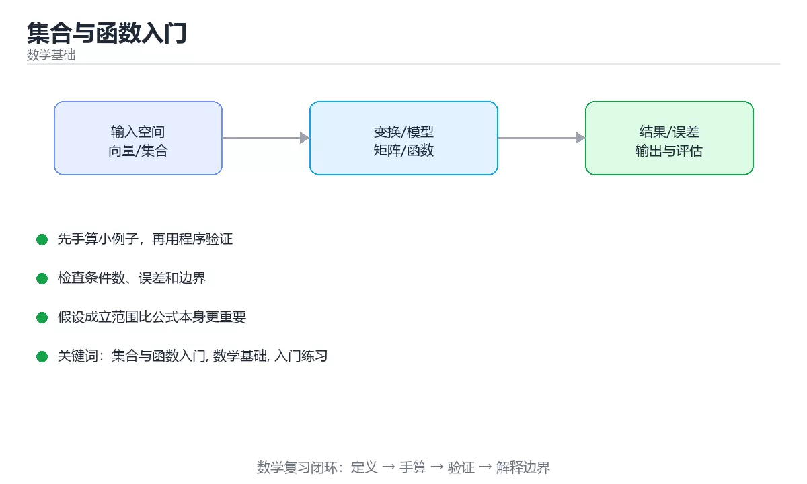

# 集合与函数入门



> 内容更新时间：2026-10-03 · 学习阶段：入门 · 预计用时：15 分钟

## 学习目标

- 先认识「集合与函数入门」需要的工具、输入和输出。
- 按步骤运行最小示例，并记录结果与错误。
- 用一个边界输入验证自己是否真正掌握。

## 前置知识

- 会进行基本的文件或命令行操作。
- 不需要预先掌握「数学基础」的高级知识。

## 一句话入门

理解集合、映射、定义域和值域。

## 最小示例

```python
A = {1, 2, 3}
B = {3, 4}
print(sorted(A & B), sorted(A | B))
```

## 预期输出

```text
[3] [1, 2, 3, 4]
```

## 常见错误

- 输入或环境与示例不一致，导致结果不符合预期。
- 复制命令时遗漏空格、引号或必要参数。

## 动手练习

1. 原样运行最小示例，保存命令和输出。
2. 把数字 2 改成 10，预测并验证新结果。
3. 制造一个错误输入，写出错误信息和修复方法。

## 本课小结

- 入门阶段先保证能运行、能观察、能解释，再追求复杂功能。
- 每次只改一个变量，记录预测与实际结果。
- 遇到错误先看第一条错误信息，再回到最小示例。


## 集合与函数是描述关系的语言

集合是一组无序、互不重复的元素，元素可以是数字、字符串、对象，甚至其他集合。集合之间的关系包括子集、真子集、交集、并集、差集和补集。笛卡尔积把两个集合的元素组合成有序对，关系就是笛卡尔积的一个子集。数据库中的表、图中的边、状态机的转移，都可以用集合和关系来描述；先把对象抽象成集合，再定义关系，能避免把业务规则直接埋进代码。

函数是一种特殊关系：对定义域中的每个输入，恰好对应一个输出。定义域是所有允许输入的集合，陪域是输出所在的集合，值域是实际出现的输出集合。函数不要求不同输入对应不同输出，也不要求每个陪域元素都被取到。比如“把字符串映射成它的长度”是函数；“把一个学生映射成他选的所有课程”通常不是函数，因为一个学生可能对应多门课程，更适合用关系或多值映射描述。

单射要求不同输入得到不同输出，满射要求值域等于陪域，双射同时满足两者，因此可以定义逆函数。逆函数的意义是把输出还原成输入，常见于编码、加密和坐标变换。复合函数把两个步骤串起来，`(g ∘ f)(x)` 表示先算 f 再算 g；分析复合函数时要先确认 f 的输出落在 g 的定义域内，否则表达式没有定义。

## 定义域、值域与可逆性

写代码时，定义域就是参数允许的取值集合，值域就是函数可能返回的结果集合。很多 bug 来自定义域没有校验：除数可能为 0、数组下标可能越界、字符串可能为空、浮点数可能是 NaN。把定义域写进类型、断言或测试，比在注释里写一句“参数必须合法”可靠得多。对于部分函数，要明确非法输入是抛异常、返回空值还是使用默认值，调用方才能正确处理。

集合还提供了计数和去重的工具。两个有限集合的并集大小满足容斥原理：`|A ∪ B| = |A| + |B| - |A ∩ B|`。哈希集合能在平均 O(1) 时间内判断元素是否存在，适合去重和成员检查；但哈希集合不保持顺序，遍历顺序也不能依赖。需要有序遍历时，应使用树结构或先排序。

验证数学概念是否真正理解，可以用一个小例子走完全程：取集合 A 和 B，列出所有子集、并集、交集和笛卡尔积；再定义一个从 A 到 B 的函数，判断它是否单射、满射、可逆。把这些结果写成表格，比只背定义更容易发现边界。

## 代码实验：把示例跑成证据

这一节不引入新语法，而是把「集合与函数入门」的最小示例变成可以复现、可以对照的实验。每次只改变一个条件，先写预测，再运行，最后解释差异。

### 实验一：建立基线

```python
A = {1, 2, 3}
B = {3, 4}
print(sorted(A & B), sorted(A | B))
```

先原样运行上面的代码，记录命令、完整输出和退出状态。然后把输出与正文的预期输出逐字对照，不要用“看起来差不多”代替核对；空格、大小写、换行和错误流向都可能暴露环境差异。

### 实验二：只改一个输入

从代码中选一个会影响结果的字面量、参数或输入，把它替换成边界值：数值可尝试 0、1、最大值和最小值，字符串可尝试空串和超长文本，集合可尝试空集合、单元素和重复元素。先写出预测，再运行并记录实际结果。

### 实验三：制造一个可控错误

把复合语句末尾的冒号删掉，或者把字符串直接参与数值运算。先记录解释器报出的第一行错误和行号，再修复并重跑基线。

| 实验 | 改动 | 预测 | 实际 | 结论 |
| --- | --- | --- | --- | --- |
| 基线 | 保持原样 |  |  |  |
| 边界 |  |  |  |  |
| 失败 |  |  |  |  |

### 实验四：用三句话复述

1. 输入是什么，哪些输入属于合法范围，哪些属于边界或非法范围？
2. 程序按什么顺序处理输入，在哪一步产生了状态变化或副作用？
3. 输出如何验证，失败时第一条可观察证据是什么？

## 深入理解：集合与函数入门

### 集合运算与德摩根律

交集、并集、差集、对称差构成集合的基本运算。德摩根律指出：并集的补等于补集的交，
交集的补等于补集的并。它在程序里对应布尔条件化简：`not (a or b)` 等价于
`not a and not b`。写查询或权限判断时，先明确论域（全集）与补集范围，再化简条件，
可以避免遗漏边界情况。

### 映射、单射、满射与双射

函数是集合之间的映射：每个输入最多对应一个输出。单射要求不同输入映射到不同输出，
满射要求值域中的每个元素都被覆盖，双射同时满足两者，因此存在逆函数。哈希函数
通常不是单射（存在碰撞），加密函数在密钥固定时接近双射。判断一个函数能否反解，
本质上是在判断它属于哪一类映射。

### 复合、逆与代码中的对应

复合函数先应用内层再应用外层，顺序不能交换；逆函数把输出还原成输入，但只有在
双射且定义域合适时才存在。写代码时，参数校验是在划定定义域，返回值范围是值域，
可逆的编解码必须保证往返一致（round-trip）。把数学定义与类型、断言、测试用例
对应起来，抽象概念就会变成可以验证的工程约束。

## 考点精讲：把测验题还原成判断过程

本课有 5 个判断点。先自己作答，再看「判断依据」；如果结论正确但理由不完整，回到正文对应章节补足概念。

### 考点 1：集合运算中，A & B 与 A | B 分别表示什么？

- **正确判断**：交集：同时属于两个集合的元素
- **判断依据**：正确答案是「交集：同时属于两个集合的元素」，本课在「集合与函数是描述关系的语言」中说明：笛卡尔积把两个集合的元素组合成有序对，关系就是笛卡尔积的一个子集。& 求交集，只保留同时属于两个集合的元素。本课还在「深入理解：集合与函数入门」中说明：交集、并集、差集、对称差构成集合的基本运算。本课还在「定义域、值域与可逆性」中说明：两个有限集合的并集大小满足容斥原理：|A ∪ B| = |A| + |B| - |A ∩ B|。
- **迁移检查**：把题干里的一个条件换成边界值，原来的结论还成立吗？写出判断过程。

### 考点 2：函数的定义域与值域分别指什么？

- **正确判断**：定义域是允许输入的集合，值域是实际输出的集合
- **判断依据**：正确答案是「定义域是允许输入的集合，值域是实际输出的集合」，本课在「集合与函数是描述关系的语言」中说明：定义域是所有允许输入的集合，陪域是输出所在的集合，值域是实际出现的输出集合。定义域描述函数接受哪些输入，值域描述函数实际会产生哪些输出。本课还在「集合与函数是描述关系的语言」中说明：分析复合函数时要先确认 f 的输出落在 g 的定义域内，否则表达式没有定义。本课还在「定义域、值域与可逆性」中说明：写代码时，定义域就是参数允许的取值集合，值域就是函数可能返回的结果集合。
- **迁移检查**：把题干里的一个条件换成边界值，原来的结论还成立吗？写出判断过程。

### 考点 3：集合运算示例运行后输出什么？

- **正确判断**：[3] [1, 2, 3, 4]，先输出交集再输出并集
- **判断依据**：正确答案是「[3] [1, 2, 3, 4]，先输出交集再输出并集」，本课在「集合与函数是描述关系的语言」中说明：笛卡尔积把两个集合的元素组合成有序对，关系就是笛卡尔积的一个子集。A 与 B 的共同元素是 3，所以交集为 [3]。本课还在「定义域、值域与可逆性」中说明：但哈希集合不保持顺序，遍历顺序也不能依赖。本课还在「定义域、值域与可逆性」中说明：验证数学概念是否真正理解，可以用一个小例子走完全程：取集合 A 和 B，列出所有子集、并集、交集和笛卡尔积。
- **迁移检查**：如果给某个错误选项去掉一个限定词，它会不会变成正确？说明理由。

### 考点 4：集合与列表在数据特性上的主要区别是？

- **正确判断**：集合不保存重复元素且无序，列表保留顺序并允许重复
- **判断依据**：正确答案是「集合不保存重复元素且无序，列表保留顺序并允许重复」，本课在「集合与函数是描述关系的语言」中说明：集合是一组无序、互不重复的元素，元素可以是数字、字符串、对象，甚至其他集合。集合的核心语义是「是否属于」，因此自动去重且不保证顺序，成员判断平均是常数时间。本课还在「定义域、值域与可逆性」中说明：但哈希集合不保持顺序，遍历顺序也不能依赖。本课还在「深入理解：集合与函数入门」中说明：满射要求值域中的每个元素都被覆盖，双射同时满足两者，因此存在逆函数。
- **迁移检查**：遮住选项，只根据定义复述一次答案，再回来看哪个选项与复述一致。

### 考点 5：填空：「集合与函数入门」术语速查中，表示「单射要求不同输入得到不同输出，满射要求值域等于陪域，双射同时满足两者，因此可以定义逆函数。逆函数的意义是把输出还原成输入，常见于编码、加密和坐标变换。复合函数把两个步骤串起来，`____` 表示先算 f 再算 g；分析复合函数时…」的术语是什么？

- **正确判断**：(g ∘ f)(x)
- **判断依据**：正确答案是「(g ∘ f)(x)」，本课在「集合与函数是描述关系的语言」中说明：单射要求不同输入得到不同输出，满射要求值域等于陪域，双射同时满足两者，因此可以定义逆函数。本课还在「集合与函数是描述关系的语言」中说明：逆函数的意义是把输出还原成输入，常见于编码、加密和坐标变换。本课还在「集合与函数是描述关系的语言」中说明：复合函数把两个步骤串起来，(g ∘ f)(x) 表示先算 f 再算 g。
- **迁移检查**：不看题干，用自己的话补全这句话，再与标准答案对照。

## 本课复习清单

离开本课前，逐项确认：

- [ ] 不看解析，能说出「集合运算中，A & B 与 A | B 分别表示什么？」的判断依据。
- [ ] 不看解析，能说出「函数的定义域与值域分别指什么？」的判断依据。
- [ ] 不看解析，能说出「集合运算示例运行后输出什么？」的判断依据。
- [ ] 不看解析，能说出「集合与列表在数据特性上的主要区别是？」的判断依据。
- [ ] 不看解析，能说出「填空：「集合与函数入门」术语速查中，表示「单射要求不同输入得到不同输出，满射要求…」的判断依据。
- [ ] 至少运行一次本课示例，记录输入、输出和一个边界情况。
- [ ] 把本课最容易混淆的两个概念写成一句话对照。

| 复盘项 | 记录 |
| --- | --- |
| 已经能独立解释的考点 |  |
| 仍然说不清的概念 |  |
| 下一步验证动作 |  |

## 逐节复习与自检

下面按正文顺序回顾每一节，并给出一个自检问题；说不清的地方回到原章节补课。

### 最小示例

```python
A = {1, 2, 3}
B = {3, 4}
print(sorted(A & B), sorted(A | B))
```

自检：这一节与相邻主题的边界在哪里？

### 预期输出

```text
[3] [1, 2, 3, 4]
```

自检：这一节与相邻主题的边界在哪里？

### 常见错误

输入或环境与示例不一致，导致结果不符合预期。

自检：把这一节讲给没学过的人，最需要强调哪一点？

### 动手练习

把数字 2 改成 10，预测并验证新结果。制造一个错误输入，写出错误信息和修复方法。

自检：如果去掉这一节里的一个前提，结论会怎样变化？

### 集合与函数是描述关系的语言

集合是一组无序、互不重复的元素，元素可以是数字、字符串、对象，甚至其他集合。集合之间的关系包括子集、真子集、交集、并集、差集和补集。

自检：这一节与相邻主题的边界在哪里？

### 定义域、值域与可逆性

写代码时，定义域就是参数允许的取值集合，值域就是函数可能返回的结果集合。很多 bug 来自定义域没有校验：除数可能为 0、数组下标可能越界、字符串可能为空、浮点数可能是 NaN。

自检：如果去掉这一节里的一个前提，结论会怎样变化？

### 深入理解：集合与函数入门

交集、并集、差集、对称差构成集合的基本运算。它在程序里对应布尔条件化简：`not (a or b)` 等价于。

自检：这一节的关键输入与输出分别是什么？

## English Overview

**Title:** Sets and Functions Basics

**Summary:** Learn sets, mappings, domains and ranges.

**Category:** Mathematics  
**Level:** 基础  
**Key terms:** 集合与函数入门, 数学基础, 入门练习

> The full tutorial is written in Chinese. This bilingual overview helps English readers identify the topic, scope and key terms before studying the detailed examples.

## 内容元数据

- 内容版本：v2.0
- 最后更新：2026-10-03
- 学习阶段：基础
- 适用环境：线性代数、概率统计与优化基础
- 内容来源：内置结构化课程与工程实践整理
- 相关主题：集合与函数入门、数学基础、入门练习
- 质量版本：P0 测验标准 + P1 覆盖扩展 + P2 体验补全


## 参考资料与复核

- 最后复核：2026-10-04
- 下次复核：2027-04-04
- 复核范围：版本兼容、API 行为、安全建议与工程实践
- 来源性质：官方文档与标准；本课正文为离线教学重组，不复制原文

| 参考资料 | 本课用途 |
| --- | --- |
| [MIT Linear Algebra](https://ocw.mit.edu/courses/18-06-linear-algebra-spring-2010/) | 线性代数基础 |
| [NIST DLMF](https://dlmf.nist.gov/) | 数学函数与公式参考 |

> 本课主题：理解集合、映射、定义域和值域。

> App 完全离线展示文字链接，不会自动联网；需要延伸阅读时可复制链接到浏览器。
