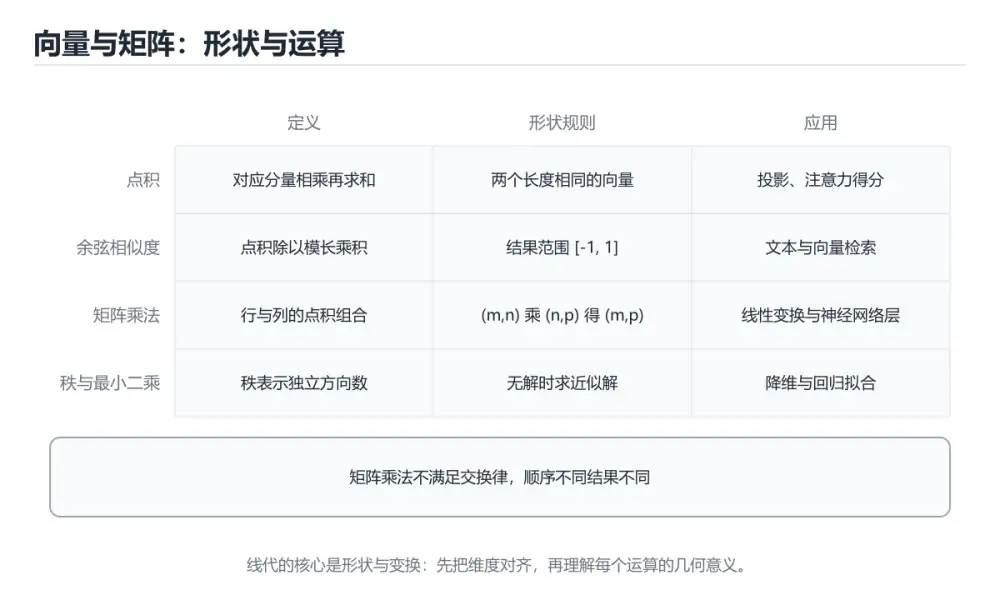
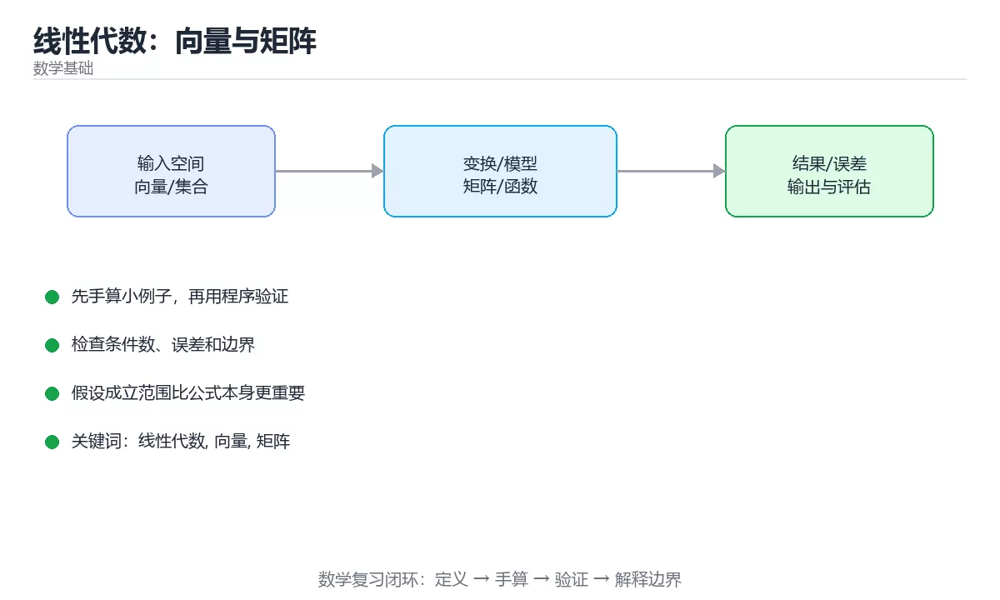

# 线性代数：向量与矩阵





> 内容更新时间：2026-10-06 · 学习阶段：入门 · 预计用时：40 分钟

## 本节知识框架

**课程定位**：所属分类为「数学基础」，课程主题为「线性代数：向量与矩阵」，学习阶段为「入门」，建议用时 40 分钟。

**本课要解决的主问题**：点积与余弦相似度、矩阵乘法形状规则、秩与最小二乘。

| 学习层次 | 要回答的问题 | 完成判据 |
| --- | --- | --- |
| 概念层 | 「线性代数：向量与矩阵」有哪些必须区分的对象与术语？ | 能用自己的话定义核心术语，并各举一个正例和一个反例。 |
| 机制层 | 这些对象按什么顺序发生作用，输入如何变成输出？ | 能画出或写出机制步骤，并说明每一步的失败条件。 |
| 应用层 | 什么场景适合使用「线性代数：向量与矩阵」，什么场景不适合？ | 能给出一个真实场景、一个最小示例和一个边界案例。 |
| 性能层 | 时间、空间、吞吐或延迟受哪些量影响？ | 能说出复杂度或性能瓶颈的证据来源；没有证据时明确写“材料未提供”。 |
| 复习层 | 怎样确认自己不是只记住了结论？ | 能独立完成本课自测，并把错误定位到概念、机制、示例或边界。 |

### 阅读路线

1. 先读「核心概念定义」，建立「线性代数」等对象的精确定义。
2. 再读「原理与运行机制」，把定义串成可重复的过程。
3. 用「代码/协议/SQL 示例」验证过程，并只改一个条件观察结果变化。
4. 最后检查性能、易错点、知识关系与自测题，形成可复习的证据链。

**前置知识**：没有硬性先修课；仍建议先具备本分类的基础阅读与操作能力。

**学习位置**：本课是当前分类的第一课，建议从本页开始建立术语表。

**后续衔接**：下一课《特征值、SVD 与降维》会继续使用本课术语，学完后建议立即完成一次自测。

**教材衔接：学习目标**

- 能用自己的话解释线性代数：向量与矩阵解决了什么问题，而不是只背术语。
- 能说清 「线性代数」、「向量」、「矩阵」、「余弦相似度」 之间的关系，并分别举出一个例子。
- 能把 线性代数 放回「线性代数：向量与矩阵」的知识体系，说明它和 向量 的边界。
- 能完成本课练习，并用验收标准检查自己的结果。

> 一句话摘要：点积与余弦相似度、矩阵乘法形状规则、秩与最小二乘。

**教材衔接：前置知识**

- 能独立打开与保存文件即可；向量 会在正文中从零解释。
- 本课阶段：入门。只需要基本计算机操作，不要求编程经验。
- 开始前先复习：线性代数、向量、矩阵。
- 看不懂就直接缩小例子：只保留 线性代数 相关的两行输入，跑通后再加回其余部分。

**教材衔接：本课小结**

线性代数的两个核心对象：**向量表示数据与方向，矩阵表示变换与批量计算**；掌握点积、矩阵乘法形状规则与秩的含义，就能读懂大多数 AI 与图形学公式。

## 核心概念定义

> 在阅读《线性代数：向量与矩阵》时，术语第一次出现先给操作性定义，再给边界；正文说法与这里冲突时，以定义和可复现示例为准。

| 术语 | 操作性定义 | 本课中的边界 |
| --- | --- | --- |
| 线性代数 | 线性代数：向量与矩阵解决了什么问题，而不是只背术语。 | 仅在「线性代数：向量与矩阵」明确给出的输入、版本与资源条件下成立。 |
| 向量 | 向量是有序数值数组，可表示点的坐标、特征（年龄、）、词嵌入或图像的展平表示。常用运算。 | 仅在「线性代数：向量与矩阵」明确给出的输入、版本与资源条件下成立。 |
| 矩阵 | 矩阵是二维数组，可表示线性变换（旋转、缩放、投影）与批量运算。乘法 A(m×n)·B(n×p)=C(m×p)，中间维度必须相等，且不满足交换律。 | 仅在「线性代数：向量与矩阵」明确给出的输入、版本与资源条件下成立。 |
| 余弦相似度 | 用两个向量夹角的余弦衡量方向接近程度，常用于文本检索。 | 仅在「线性代数：向量与矩阵」明确给出的输入、版本与资源条件下成立。 |
| 秩 | 秩表示矩阵列向量张成空间的维度，低秩意味着信息冗余（LoRA 正是利用这一点）。 | 仅在「线性代数：向量与矩阵」明确给出的输入、版本与资源条件下成立。 |

### 定义如何使用

在「线性代数：向量与矩阵」中判断一个说法是否成立，先确认它使用的是哪个对象的定义，再检查输入规模、运行环境与失败路径。定义不是口号，而是后续推导、代码示例和自测题共享的约束。

## 原理与运行机制

### 机制总览

1. **建立输入**：把「线性代数」按本课定义整理成可观察、可重复的输入条件。
2. **执行转换**：围绕「向量」执行本课的核心步骤；每一步都记录中间状态，避免只看最终输出。
3. **产生输出**：得到「矩阵」后，用正文示例或协议/SQL 结果核对输出是否符合预期。
4. **改变一个条件**：只替换一个边界条件或环境参数，观察「线性代数：向量与矩阵」的结论是否仍然成立。

| 阶段 | 关注对象 | 失败时应检查 |
| --- | --- | --- |
| 输入 | 线性代数 | 类型、范围、编码、版本或前置状态是否满足定义。 |
| 处理 | 向量 | 顺序、可见性、锁、路由、事务或调度规则是否被破坏。 |
| 输出 | 矩阵 | 结果是否可复现，错误是否被正确传播而不是被吞掉。 |

本课的机制结论要用「线性代数：向量与矩阵」自己的示例验证。「线性代数：向量与矩阵」没有给出某个数量级、吞吐或内存数据时，本课把该判断标为“材料未提供”，不从相邻主题外推。

**教材衔接：向量**

向量是有序数值数组，可表示点的坐标、特征（年龄、）、词嵌入或图像的展平表示。常用运算

| 运算 | 含义 | 用途 |
| --- | --- | --- |
| 加法 | 逐元素相加 | 位移、特征叠加 |
| 数乘 | 缩放长度 | 步长控制 |
| 点积 | 对应元素乘积求和 | 相似度、投影 |
| 范数 L1/L2 | 绝对值之和 / 平方和开方 | 距离、正则化 |
| 余弦相似度 | 点积除以模长乘积 | 语义相似度（RAG 检索） |

点积为 0 表示正交（不相关）；夹角越小方向越一致，这是向量检索的基础。

**教材衔接：矩阵与乘法**

矩阵是二维数组，可表示线性变换（旋转、缩放、投影）与批量运算。乘法 A(m×n)·B(n×p)=C(m×p)，**中间维度必须相等**，且不满足交换律。

要点：

1. 矩阵乘法可理解为「对 B 的各列分别做 A 的线性变换」。
2. 单位矩阵 I 相当于乘法里的 1；转置 Aᵀ 交换行列。
3. 逆矩阵 A⁻¹ 满足 A·A⁻¹=I，只有方阵且行列式非零时才存在。
4. 秩表示矩阵列向量张成空间的维度，低秩意味着信息冗余（LoRA 正是利用这一点）。

**教材衔接：线性方程组与最小二乘**

Ax=b 有唯一解、无解或无穷多解，取决于秩。现实中 A 往往不可逆（超定方程），此时用**最小二乘**求近似解——这正是线性回归的解析解来源。

**教材衔接：在 AI 与图形学中的位置**

神经网络一层就是 `y = Wx + b`（矩阵乘 + 偏置），注意力是 `QKᵀ`（相似度矩阵）再乘 V；图形学中 MVP 变换全是 4×4 矩阵乘法。**矩阵乘法的形状规则**是读论文与写代码时最需要养成的直觉。

**教材衔接：几何意义与相似度计算步骤**

**矩阵作为变换**：2×2 矩阵 [[2,0],[0,3]] 把 x 方向放大 2 倍、y 方向放大 3 倍；[[cosθ,−sinθ],[sinθ,cosθ]] 是逆时针旋转 θ；图形学中的 MVP（模型-视图-投影）就是三个 4×4 矩阵连乘，顺序不能交换（先缩放再平移 ≠ 先平移再缩放）。

**余弦相似度的计算步骤**（判断两段文本是否相关）：

1. 各自算出词频向量（或取嵌入向量）。
2. 计算点积：对应分量相乘后求和。
3. 计算各自模长：各分量平方和开方。
4. 相似度 = 点积 ÷ (模长 × 模长)，取值 −1~1，越接近 1 越相似。

注意：余弦只看方向不看长度——长文档与短文档只要词分布相似，相似度依然高，这正好符合"语义相似"的直觉；若关心绝对差异（如评分预测），则用欧氏距离。

**教材衔接：向量运算速查**

| 运算 | 定义 | 用途 |
| --- | --- | --- |
| 加法 | 对应分量相加 | 位移叠加 |
| 数乘 | 每个分量乘标量 | 缩放 |
| 点积 | 对应分量相乘再求和 | 相似度、夹角、投影 |
| 范数 | 向量长度，`sqrt(Σx²)` | 归一化、距离 |
| 叉积 | 三维向量运算 | 法向量、面积 |
| 余弦相似度 | 点积除以两范数之积 | 文本与向量检索 |

关系式：`a · b = |a||b|cosθ`。点积为 0 意味着正交。

**教材衔接：深入补充：线性代数：向量与矩阵 的取舍与边界**

### 一、把概念放回真实约束

学习线性代数：向量与矩阵时，最容易只记住结论而忽略前提。先写出三个约束：数据规模、时间预算、可接受的失败方式；再判断 线性代数 与 向量 在这些约束下是否仍然成立。只要约束改变，原来的最优解就可能变成错误解。

| 概念 | 直觉解释 | 公式或定义 | 工程用途 |
| --- | --- | --- | --- |
| 线性代数 | 用可计算的方式描述变化 | 见正文公式 | 建模与估算 |
| 向量 | 描述不确定性或约束 | 见正文推导 | 校验与决策 |
| 近似 | 用可控误差换速度 | 误差上界 | 大规模计算 |

### 二、三个容易混淆的边界

1. 澄清输入与目标。先写清「线性代数：向量与矩阵」要解决的问题、合法输入范围和成功标准，再进入后续步骤。
2. **把“平均值”当成“全部”**：线性代数 的指标好看，不代表尾部请求、冷启动或失败重试也好看。
3. **把“当前版本”当成“永久行为”**：向量 依赖的默认值、API 或性能特征都可能随版本变化，需要固定版本并保留回归用例。

### 三、一个生产场景

假设团队要在真实系统里使用线性代数：向量与矩阵：第一周先做小流量验证，记录 线性代数 的基线与异常；第二周扩大输入规模，观察 向量 是否成为瓶颈；第三周再做故障演练，主动注入超时、重复请求和依赖不可用，确认系统能降级、能重试、能恢复。每一步都要留下指标、日志和结论，而不是只留下“感觉更快了”。

### 四、自测清单

- 能否用一句话说出线性代数：向量与矩阵解决的核心问题与不适用场景？
- 能否画出 线性代数 的数据流或状态变化，并标出失败路径？
- 把 ValueError 的输入推到边界，说明本课哪一条结论会先失效。
- 能否写出一条可复现的验证命令，让别人独立得到相同结论？

## 典型应用场景

| 场景 | 典型输入或前提 | 期望产物 |
| --- | --- | --- |
| 学习验证 | 使用本课最小示例和 线性代数、向量 | 能复现正文结论，并解释每一步。 |
| 工程落地 | 把「线性代数：向量与矩阵」放入真实模块或服务边界 | 输出可观测、失败可定位、参数可配置。 |
| 故障排查 | 只改一个版本、规模、输入或依赖条件 | 能区分概念错误、实现错误和环境差异。 |

判断「线性代数：向量与矩阵」的场景是否成立，标准是能否写出输入、处理、输出和失败路径；材料中没有出现的数据在本课标注为“材料未提供”，不用推测替代证据。

**教材衔接：应用速查**

| 场景 | 用到的概念 |
| --- | --- |
| 文本与图像检索 | 余弦相似度、归一化 |
| 推荐系统 | 内积、矩阵分解 |
| 最小二乘拟合 | 投影、伪逆 |
| 图形变换 | 矩阵乘法、齐次坐标 |
| 神经网络前向计算 | 矩阵乘法 + 非线性 |
| 降维与压缩 | 秩、SVD |
| 协同过滤 | 低秩近似 |

## 代码/协议/SQL 示例

以下代码、协议或 SQL 片段来自《线性代数：向量与矩阵》原文，保留原有语言标记与上下文；先预测《线性代数：向量与矩阵》示例的输出，再按正文步骤运行或推演，示例依赖外部环境时同时记录版本与输入。

**教材衔接：矩阵运算速查**

| 运算 | 条件 | 结果形状 |
| --- | --- | --- |
| 加法 | 形状相同 | 形状不变 |
| 转置 | 任意 | `m×n` 变 `n×m` |
| 矩阵乘法 | 左列数等于右行数 | `m×p` |
| 矩阵向量乘 | 列数等于向量维数 | 向量 |
| 逆矩阵 | 方阵且行列式非零 | 同形状 |
| 行列式 | 方阵 | 标量，衡量体积缩放 |
| 秩 | 任意 | 线性无关行列的最大数 |

```python
import math
from typing import Sequence

Vector = Sequence[float]
Matrix = Sequence[Sequence[float]]

def dot(a: Vector, b: Vector) -> float:
    if len(a) != len(b):
        raise ValueError("维度不一致")
    return sum(x * y for x, y in zip(a, b))

def norm(a: Vector) -> float:
    return math.sqrt(dot(a, a))

def cosine(a: Vector, b: Vector) -> float:
    na, nb = norm(a), norm(b)
    return 0.0 if na == 0 or nb == 0 else dot(a, b) / (na * nb)

def matmul(a: Matrix, b: Matrix) -> list:
    """矩阵乘法：形状 (m,n) x (n,p) 得到 (m,p)。"""
    if not a or not b or len(a[0]) != len(b):
        raise ValueError("形状不满足乘法条件")
    b_t = list(zip(*b))
    return [[dot(row, col) for col in b_t] for row in a]

def transpose(a: Matrix) -> list:
    return [list(row) for row in zip(*a)]

def project(a: Vector, b: Vector) -> Vector:
    """把 a 投影到 b 上：分量 = (a·b / b·b) * b。"""
    bb = dot(b, b)
    if bb == 0:
        raise ValueError("不能投影到零向量")
    scale = dot(a, b) / bb
    return [scale * value for value in b]

print(round(cosine([1, 2, 3], [2, 4, 6]), 6))          # 1.0，方向相同
print(matmul([[1, 2], [3, 4]], [[5, 6], [7, 8]]))
print(project([3, 4], [1, 0]))
```

## 时间/空间复杂度或性能分析

**复杂度证据**：「线性代数：向量与矩阵」的现有材料没有给出渐近时间或空间复杂度的明确结论，本课只做定性检查，不补写未经验证的 $O$ 记号。

| 维度 | 本课关注点 | 判断依据 |
| --- | --- | --- |
| 时间/延迟 | 「线性代数：向量与矩阵」的主要步骤是否会随输入规模、并发度或网络往返增长。 | 以正文复杂度、基准数据或可重复测量为准。 |
| 空间/内存 | 中间状态、缓存、副本、连接或索引是否随规模增长。 | 记录峰值内存与数据副本，不只看最终结果。 |
| 吞吐/资源 | 版本、调度、锁、IO、序列化或协议开销是否成为瓶颈。 | 固定环境做对照实验，改变一个变量。 |

评估「线性代数：向量与矩阵」时要区分“正确性成立”和“性能达标”两件事；材料没有给出基准时，本课只保留量级来源与测量方法，不写不可验证的绝对数字。

## 常见误区与易错点

> 复核《线性代数：向量与矩阵》的易错点时，优先保留原文的错误表、故障现场与排错路径；每条修正都要能用本课示例复验。

| 易错点 | 常见表现 | 正确做法 |
| --- | --- | --- |
| 只背结论 | 能复述「线性代数：向量与矩阵」的定义，却说不清输入、输出与边界。 | 回到机制步骤，用最小示例逐一验证。 |
| 混淆相邻概念 | 把本课对象与相邻主题的对象当成同一类。 | 先比较定义、资源归属、生命周期和失败模式。 |
| 忽略版本与环境 | 在开发机通过后直接外推到生产环境。 | 固定版本、输入和资源条件，再记录可复现结果。 |

**教材衔接：常见错误与排查**

| 容易踩的做法 | 实际现象 | 原因与正确做法 |
| --- | --- | --- |
| 忽略矩阵乘法形状 | 结果维度不符或报错 | 先校验中间维度相等 |
| 认为矩阵乘法可交换 | 结果与预期不同 | `AB` 通常不等于 `BA` |
| 对未归一化向量算余弦 | 结果超出直觉范围 | 余弦本身已归一化，但实现要去零 |
| 用点积比较不同长度文本 | 长文本得分虚高 | 先归一化或用余弦 |
| 认为低秩矩阵一定可逆 | 求逆失败 | 秩亏矩阵不可逆 |
| 忽略浮点误差判断秩 | 数值秩判断错误 | 用阈值或 SVD 判断 |
| 用行列式判断数值可逆性 | 病态矩阵被误判可逆 | 看条件数 |
| 混淆广播与逐元素乘法 | 形状或结果错误 | 明确是 Hadamard 积还是矩阵乘 |
| 忽略数值稳定性 | 结果溢出或精度崩溃 | 归一化、用对数域或稳定算法 |
| 把转置符号写反 | 维度错误 | 明确 `(AB)^T = B^T A^T` |

**教材衔接：故障现场**

### 现场 1：忽略矩阵乘法形状

**症状**：在《线性代数：向量与矩阵》的复现场景中，结果维度不符或报错。

**根因**：当出现“忽略矩阵乘法形状”时，执行路径已经绕过了《线性代数：向量与矩阵》的关键约束，最终以“结果维度不符或报错”暴露出来；修复前必须先确认约束在哪里失效。

**修复**：针对《线性代数：向量与矩阵》的问题，先校验中间维度相等。

**验证**：先在《线性代数：向量与矩阵》中记录“忽略矩阵乘法形状”留下的失败证据，再执行“先校验中间维度相等”并重放；确认错误路径变为明确结果，且修复没有掩盖同类故障。

### 现场 2：认为矩阵乘法可交换

**症状**：在《线性代数：向量与矩阵》的复现场景中，结果与预期不同。

**根因**：“结果与预期不同”只是表层结果。向上追溯会落到“认为矩阵乘法可交换”这一步，因为它省略了《线性代数：向量与矩阵》的约束，使实现行为和预期模型发生了偏离。

**修复**：针对《线性代数：向量与矩阵》的问题，AB 通常不等于 BA。

**验证**：在《线性代数：向量与矩阵》中按“AB 通常不等于 BA”调整后，从“认为矩阵乘法可交换”的触发条件重放同一条路径，确认“结果与预期不同”不再出现，并补一个相邻边界用例检查没有引入新问题。

### 现场 3：对未归一化向量算余弦

**症状**：在《线性代数：向量与矩阵》的复现场景中，结果超出直觉范围。

**根因**：触发点是把“对未归一化向量算余弦”当成安全做法。它没有满足《线性代数：向量与矩阵》要求的前提，因此先表现为“结果超出直觉范围”；排查时先完整复现这一段，再核对输入、配置与依赖。

**修复**：针对《线性代数：向量与矩阵》的问题，余弦本身已归一化，但实现要去零。

**验证**：先在《线性代数：向量与矩阵》中记录“对未归一化向量算余弦”留下的失败证据，再执行“余弦本身已归一化，但实现要去零”并重放；确认错误路径变为明确结果，且修复没有掩盖同类故障。

## 与其他知识点的关系

| 关系 | 课程 | 为什么 |
| --- | --- | --- |
| 关联 | 《特征值、SVD 与降维》 | 用于横向比较或把本课结论迁移到相邻主题。 |
| 后续顺序 | 《特征值、SVD 与降维》 | 同分类中安排在本课之后，会继续使用本课术语。 |

把「线性代数：向量与矩阵」放回知识体系时，不只要记住“前面学过什么”，还要说明两个主题在输入、机制、资源边界和失败模式上的差异。这样才能把单课知识迁移到项目、排障和后续课程。

**教材衔接：手算示例与代码对照**

**矩阵乘法逐步展开**（2×2 乘 2×1）：

| 步骤 | 计算 |
| --- | --- |
| A 的第一行与 x 相乘 | 1×2 + 2×3 = 8 |
| A 的第二行与 x 相乘 | 4×2 + 5×3 = 23 |
| 结果向量 | [8, 23] |

记忆法：结果的第 i 个分量 = A 的第 i 行与 x 的点积；矩阵乘矩阵时，结果的第 i 行第 j 列 = A 第 i 行与 B 第 j 列的点积。

**NumPy 对照**：向量点积用 `np.dot(a,b)` 或 `a @ b`；矩阵乘法用 `A @ B`；转置 `A.T`；求逆 `np.linalg.inv(A)`（仅方阵且可逆）；求解 Ax=b 优先用 `np.linalg.solve(A,b)` 而不是先求逆再相乘（数值更稳定、更快）。

**在 AI 中的落点**：一层全连接 = `Y = X @ W + b`；注意力得分 = `Q @ K.T`，再经 softmax 与 `@ V`；嵌入检索 = 查询向量与文档矩阵相乘得到相似度。养成"看到矩阵就想形状"的习惯，读论文会顺很多。

## 自测题与参考答案

> 先独立完成《线性代数：向量与矩阵》的自测，再核对答案与解析。答案必须能在本课正文或示例中找到依据，不能只凭语感。

### 自测 1

按“线性代数：向量与矩阵”中 线性代数、向量、矩阵 的实践顺序，把四个步骤排成从准备到复盘的合理顺序。

A. 固定版本与证据，把“线性代数：向量与矩阵”的结论写成可复现记录
B. 先明确 线性代数 的输入、输出与约束
C. 写出最小示例并核对 向量 的基线结果
D. 只改一个变量，记录边界与失败路径的变化

**参考答案**：先明确 线性代数 的输入、输出与约束 → 写出最小示例并核对 向量 的基线结果 → 只改一个变量，记录边界与失败路径的变化 → 固定版本与证据，把“线性代数：向量与矩阵”的结论写成可复现记录

**解析**：题干的正确项是固定版本与证据，把“线性代数：向量与矩阵”的结论写成可复现记录。在「线性代数：向量与矩阵」里，在本课的练习里，顺序应当是：先明确 线性代数 的输入、输出与约束 → 写出最小示例并核对 向量 的基线结果 → 只改一个变量，记录边界与失败路径的变化 → 固定版本与证据，把本课的结论写成可复现记录。这个顺序把 线性代数 的输入、输出和约束放在最前面，在线性代数：向量与矩阵里避免概念没对齐就开始调参。第二步用 向量 建立可核对的基线，在线性代数：向量与矩阵里第三步才允许改变一个变量并观察失败路径。

### 自测 2

这段 Python 代码是「线性代数：向量与矩阵」的示例片段，下面哪一项描述与它一致？

```python
import math
from typing import Sequence

Vector = Sequence[float]
Matrix = Sequence[Sequence[float]]

def dot(a: Vector, b: Vector) -> float:
    if len(a) != len(b):
        raise ValueError("维度不一致")
    return sum(x * y for x, y in zip(a, b))

def norm(a: Vector) -> float:
    return math.sqrt(dot(a, a))

def cosine(a: Vector, b: Vector) -> float:
    na, nb = norm(a), norm(b)
    return 0.0 if na == 0 or nb == 0 else dot(a, b) / (na * nb)

def matmul(a: Matrix, b: Matrix) -> list:
    """矩阵乘法：形状 (m,n) x (n,p) 得到 (m,p)。"""
    if not a or not b or len(a[0]) != len(b):
        raise ValueError("形状不满足乘法条件")
    b_t = list(zip(*b))
    return [[dot(row, col) for col in b_t] for row in a]

def transpose(a: Matrix) -> list:
    return [list(row) for row in zip(*a)]

def project(a: Vector, b: Vector) -> Vector:
    """把 a 投影到 b 上：分量 = (a·b / b·b) * b。"""
    bb = dot(b, b)
    if bb == 0:
        raise ValueError("不能投影到零向量")
    scale = dot(a, b) / bb
    return [scale * value for value in b]

print(round(cosine([1, 2, 3], [2, 4, 6]), 6))          # 1.0，方向相同
print(matmul([[1, 2], [3, 4]], [[5, 6], [7, 8]]))
print(project([3, 4], [1, 0]))
```

A. 这段代码包含循环结构，同一段逻辑会被重复执行。
B. 这段代码只做静态声明，没有循环、分支或可观察输出。
C. 这段代码包含异常处理分支，失败时会走专门的补救路径。
D. 这段代码会读取外部输入，结果依赖传入的数据。

**参考答案**：这段代码包含循环结构，同一段逻辑会被重复执行。

**解析**：题干的正确项是这段代码包含循环结构，同一段逻辑会被重复执行，在「线性代数：向量与矩阵」里循环次数与线性代数的输入规模直接相关。这段代码出自「线性代数：向量与矩阵」的正文示例，围绕线性代数、向量、矩阵展开；把输入或边界换成空值、极值或失败情况后，结论要以「线性代数：向量与矩阵」的实际运行结果为准。在「线性代数：向量与矩阵」里判断这道题，要把线性代数、向量、矩阵的条件、过程与失败路径逐项对齐，换成“这段 Python 代码是线性代数”这个场景，只有满足前提的结论才成立。

### 自测 3

矩阵「低秩」通常意味着？

A. 存在信息冗余
B. 一定是方阵
C. 不可逆
D. 计算更快

**参考答案**：存在信息冗余

**解析**：LoRA 微调正是利用低秩假设只训练少量参数。作答时，先用线性代数建立输入与输出的基线，再把存在信息冗余代入边界条件核对，结论才能复现。如果只凭关键词作答，很容易把「一定是方阵」、「不可逆」与「存在信息冗余」混在一起；在「线性代数：向量与矩阵」里判断这道题，要把线性代数、向量、矩阵的条件、过程与失败路径逐项对齐，换成“矩阵低秩通常意味着”这个场景，只有满足前提的结论才成立。

**教材衔接：复习与自测**

- [ ] 能计算点积、范数与余弦相似度。
- [ ] 记得矩阵乘法形状规则与不可交换性。
- [ ] 知道投影与最小二乘的关系。
- [ ] 能判断矩阵是否可逆并理解条件数的作用。
- [ ] 会在检索场景中先归一化再比较。

**教材衔接：动手练习**

> 本课练习重点：围绕「线性代数、向量、矩阵」完成复述、实验和交付，每个结果都要能被别人检查。

先写出 向量 的假设，再验证其中一步是否成立。

### 练习 1：建立心智模型（10 分钟）

合上教程，用 3～5 句话回答：

1. 线性代数：向量与矩阵解决了什么问题？
2. 如果没有它，会出现什么具体后果？
3. 它和「向量」是什么关系？

验收标准：说明 线性代数 与 向量 的分工，并写出一个失效场景。

### 练习 2：做一次可控实验（20 分钟）

从正文中选一个最小示例，完成以下操作：

1. 先预测修改一个参数、输入或步骤后的结果。
2. 再实际执行或逐步推演，记录真实结果。
3. 如果结果与预测不同，写出差异原因。

**验收标准**：先原样跑通正文里的 `ValueError`，再只改线性代数相关的输入，按「原例 → 改动 → 预测 → 结果 → 原因」记录；预测必须写在实际运行之前。

### 练习 3：交付一个小结果（30 分钟）

先推导 向量 的前三步，再验证最终数值。

任务要求：

- 结果必须能被别人检查，不能只写“我已经理解了”。
- 至少覆盖「线性代数」和「向量」两个关键词。
- 写出 1 个仍然不确定的问题，以及下一步如何验证。

> 提示：时间有限时优先做练习 1 和练习 2；练习 3 可以拆成两次完成。

**教材衔接：可运行练习**

### 任务 1：先跑通，再解释

```python
import math
from typing import Sequence

Vector = Sequence[float]
Matrix = Sequence[Sequence[float]]

def dot(a: Vector, b: Vector) -> float:
    if len(a) != len(b):
        raise ValueError("维度不一致")
    return sum(x * y for x, y in zip(a, b))

def norm(a: Vector) -> float:
    return math.sqrt(dot(a, a))

def cosine(a: Vector, b: Vector) -> float:
    na, nb = norm(a), norm(b)
    return 0.0 if na == 0 or nb == 0 else dot(a, b) / (na * nb)

def matmul(a: Matrix, b: Matrix) -> list:
    """矩阵乘法：形状 (m,n) x (n,p) 得到 (m,p)。"""
    if not a or not b or len(a[0]) != len(b):
        raise ValueError("形状不满足乘法条件")
    b_t = list(zip(*b))
    return [[dot(row, col) for col in b_t] for row in a]

def transpose(a: Matrix) -> list:
    return [list(row) for row in zip(*a)]

def project(a: Vector, b: Vector) -> Vector:
    """把 a 投影到 b 上：分量 = (a·b / b·b) * b。"""
    bb = dot(b, b)
    if bb == 0:
        raise ValueError("不能投影到零向量")
    scale = dot(a, b) / bb
    return [scale * value for value in b]

print(round(cosine([1, 2, 3], [2, 4, 6]), 6))          # 1.0，方向相同
print(matmul([[1, 2], [3, 4]], [[5, 6], [7, 8]]))
print(project([3, 4], [1, 0]))
```

### 任务 2：只改一个条件

把「线性代数：向量与矩阵」的最小示例复制一份，只改一个条件再跑一次：

- 改动点：只调整 ValueError 的一个参数，其余条件一律不动。
- 预测：先写下「线性代数：向量与矩阵」在改动后的输出或错误信息，再运行。
- 记录：对照改动前后的结果，指出差异出在哪一步。
- 验收：换回原条件能复现原结果，改动只影响线性代数。

### 任务 3：迁移到自己的数据

换一个 向量 场景重做一次，确认结论不是只对示例数据成立。

**教材衔接：本课复习清单**

离开本课前，逐项确认：

- [ ] 不看解析，能说出「矩阵乘法 A(m×n)·B(n×p) 成立的条件是？」的判断依据。
- [ ] 不看解析，能说出「余弦相似度常用于？」的判断依据。
- [ ] 不看解析，能说出「矩阵「低秩」通常意味着？」的判断依据。
- [ ] 不看解析，能说出「两个非零向量的点积为 0 说明？」的判断依据。
- [ ] 不看解析，能说出「矩阵的秩（rank）代表什么？」的判断依据。
- [ ] 至少运行一次 ValueError 的示例，记录输入、输出和 线性代数 的边界情况。
- [ ] 把本课最容易混淆的两个概念写成一句话对照。

| 复盘项 | 记录 |
| --- | --- |
| 已经能独立解释的考点 |  |
| 仍然说不清的概念 |  |
| 下一步验证动作 |  |

---

## 术语速查

把「线性代数：向量与矩阵」里反复出现的术语集中放在一起。复习时先遮住右列，尝试用自己的话解释，再回到正文核对。

| 术语 | 一句话说明 |
| --- | --- |
| `线性代数` | 线性代数：向量与矩阵解决了什么问题，而不是只背术语。 |
| `向量` | 向量是有序数值数组，可表示点的坐标、特征（年龄、）、词嵌入或图像的展平表示。常用运算。 |
| `矩阵` | 矩阵是二维数组，可表示线性变换（旋转、缩放、投影）与批量运算。乘法 A(m×n)·B(n×p)=C(m×p)，中间维度必须相等，且不满足交换律。 |
| `余弦相似度` | 用两个向量夹角的余弦衡量方向接近程度，常用于文本检索。 |
| `秩` | 秩表示矩阵列向量张成空间的维度，低秩意味着信息冗余（LoRA 正是利用这一点）。 |

## 考点精讲

### 考点 1：顺序排列·线性代数

- **题目**：按“线性代数：向量与矩阵”中 线性代数、向量、矩阵 的实践顺序，把四个步骤排成从准备到复盘的合理顺序。
- **判断依据**：题干的正确项是固定版本与证据，把“线性代数：向量与矩阵”的结论写成可复现记录。在「线性代数：向量与矩阵」里，在本课的练习里，顺序应当是：先明确 线性代数 的输入、输出与约束 → 写出最小示例并核对 向量 的基线结果 → 只改一个变量，记录边界与失败路径的变化 → 固定版本与证据，把本课的结论写成可复现记录。这个顺序把 线性代数 的输入、输出和约束放在最前面，在线性代数：向量与矩阵里避免概念没对齐就开始调参。第二步用 向量 建立可核对的基线，在线性代数：向量与矩阵里第三步才允许改变一个变量并观察失败路径。

### 考点 2：代码补全·线性代数

- **题目**：这段 Python 代码是「线性代数：向量与矩阵」的示例片段，下面哪一项描述与它一致？
- **判断依据**：题干的正确项是这段代码包含循环结构，同一段逻辑会被重复执行，在「线性代数：向量与矩阵」里循环次数与线性代数的输入规模直接相关。这段代码出自「线性代数：向量与矩阵」的正文示例，围绕线性代数、向量、矩阵展开；把输入或边界换成空值、极值或失败情况后，结论要以「线性代数：向量与矩阵」的实际运行结果为准。在「线性代数：向量与矩阵」里判断这道题，要把线性代数、向量、矩阵的条件、过程与失败路径逐项对齐，换成“这段 Python 代码是线性代数”这个场景，只有满足前提的结论才成立。

### 考点 3：概念判断·低秩

- **题目**：矩阵「低秩」通常意味着？
- **判断依据**：LoRA 微调正是利用低秩假设只训练少量参数。作答时，先用线性代数建立输入与输出的基线，再把存在信息冗余代入边界条件核对，结论才能复现。如果只凭关键词作答，很容易把「一定是方阵」、「不可逆」与「存在信息冗余」混在一起；在「线性代数：向量与矩阵」里判断这道题，要把线性代数、向量、矩阵的条件、过程与失败路径逐项对齐，换成“矩阵低秩通常意味着”这个场景，只有满足前提的结论才成立。

### 考点 4：概念判断·线性代数

- **题目**：两个非零向量的点积为 0 说明？
- **判断依据**：在「线性代数：向量与矩阵」里，结论应落在「两向量正交」。点积 = |a||b|cosθ，因此点积为 0 意味着 cosθ = 0。在「线性代数：向量与矩阵」里，这道题要求区分概念与边界，「两向量正交」只有在题干给出的前提下才成立，而「无法判断」、「两向量平行」缺少同一组条件。

### 考点 5：概念判断·线性代数

- **题目**：矩阵的秩（rank）代表什么？
- **判断依据**：在「线性代数：向量与矩阵」里，线性无关的行（或列）的最大数量，即列空间的维数。秩小于列数时列向量线性相关，方程组可能有无穷多解或无解。这道题的关键在「线性代数：向量与矩阵」的线性代数、向量、矩阵：先确认题干“矩阵的秩（rank）代表什么”问的是哪一步，再排除偷换前提的选项。把“线性无关的行（或列）的最大数量”代回「线性代数：向量与矩阵」里“矩阵的秩（rank）代表什么”的例子核对，条件一旦改变，结论就要用线性代数、向量、矩阵重新推导。

### 考点 6：多选辨析·线性代数

- **题目**：关于「线性代数：向量与矩阵」，下列哪些说法是正确的？（多选）
- **判断依据**：在「线性代数：向量与矩阵」里，衡量两个向量的方向接近程度，如语义相似度。结果形状为 m×p，中间维度必须一致。点积与余弦相似度、矩阵乘法形状规则、秩与最小二乘。在「线性代数：向量与矩阵」里，中间维度 n 相等」是否完整覆盖题干的输入、输出和失败路径，并排除「只要记住术语，不需要理解输入和边界条件」、「改变一个前提不会影响结论，因此可以忽略条件」这类相邻概念。

## English Overview

**Title:** Vectors & Matrices

**Summary:** Dot product, matrix multiplication, rank and least squares.

**Category:** Mathematics
**Level:** 入门
**Key terms:** 线性代数, 向量, 矩阵, 余弦相似度, 秩

## 内容元数据

- 内容版本：v2.0
- 最后更新：2026-10-06
- 学习阶段：入门
- 适用环境：线性代数、概率统计与优化基础；本课聚焦 线性代数。
- 内容来源：内置结构化课程与工程实践整理
- 相关主题：线性代数、向量、矩阵、余弦相似度、秩
- 质量版本：P0 测验标准 + P1 覆盖扩展 + P2 体验补全

## 参考资料与复核

- 最后复核：2026-10-04
- 下次复核：2027-09-24
- 复核范围：版本兼容、API 行为、安全建议与工程实践
- 来源性质：官方文档、标准或权威教材；正文为离线教学重组

| 参考资料 | 本课用途 |
| --- | --- |
| [MIT 线性代数](https://ocw.mit.edu/courses/18-06-linear-algebra-spring-2010/) | 向量、矩阵与线性变换 |
| [Khan Academy 数学](https://www.khanacademy.org/math) | 从基础算术到高等数学 |
| [NIST DLMF](https://dlmf.nist.gov/) | 数学函数与公式参考 |

> 「线性代数：向量与矩阵」的链接用于离线阅读后的延伸核对；App 不会自动联网。
