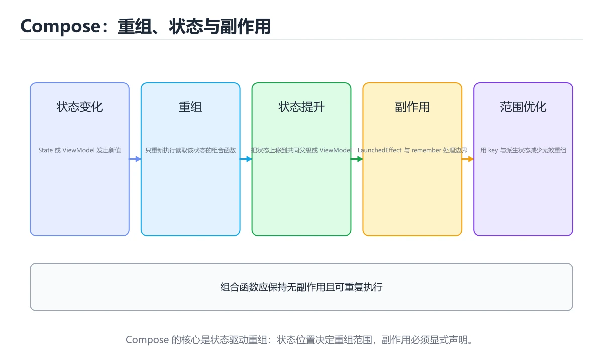
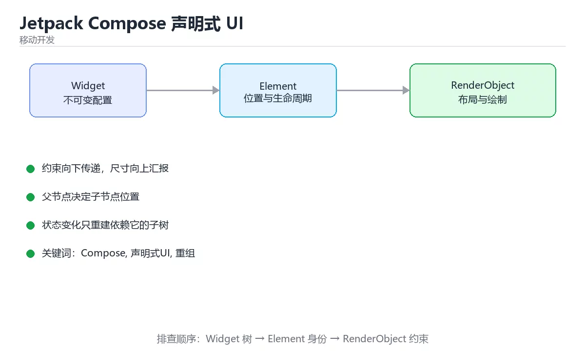

# Jetpack Compose 声明式 UI





> 内容更新时间：2026-10-03 · 学习阶段：进阶 · 预计用时：16 分钟

## 学习目标

- 能用自己的话解释「Jetpack Compose 声明式 UI」解决了什么问题，而不是只背术语。
- 能说清 「Compose」、「声明式UI」、「重组」、「状态提升」 之间的关系，并分别举出一个例子。
- 能把本课知识放回「移动开发」的知识体系，说明它和相邻主题的边界。
- 能完成本课练习，并用验收标准检查自己的结果。

> 一句话摘要：重组机制、状态提升、副作用与重组范围优化。

## 前置知识

- 先完成上一课《React Native 跨平台开发》；如果已经掌握，可以直接用本课练习自测。
- 本课阶段：进阶。建议先掌握同一分类的基础课程，并能独立运行正文中的最小示例。
- 开始前先复习：Compose、声明式UI、重组。
- 如果某一步看不懂，先记录具体卡点，完成练习后再回头读一遍。


## 核心理念

Compose 用「函数描述 UI」取代 XML 布局：UI 是状态的函数，状态变了就重组（recompose）受影响的部分。理解重组的作用域与稳定性，是写好 Compose 的关键。

| 概念 | 含义 |
| --- | --- |
| 可组合函数 | 标注 `@Composable` 的函数，描述一段 UI |
| 重组 | 状态变化时重新执行受影响的 composable |
| 状态提升 | 把状态交给调用方，组件只负责展示 |
| 副作用 | 在组合之外执行的动作（`LaunchedEffect`、`DisposableEffect`） |
| 记忆 | `remember` 在重组间保留值 |
| 稳定性 | 参数稳定则可跳过重组，性能更好 |

## 常用 API 速查

| 需求 | 写法 |
| --- | --- |
| 状态 | `var x by remember { mutableStateOf(0) }` |
| 可观察列表 | `mutableStateListOf()` |
| 副作用 | `LaunchedEffect(key) { }`、`DisposableEffect(key)` |
| 列表 | `LazyColumn` / `LazyRow` / `LazyVerticalGrid` |
| 布局 | `Column`、`Row`、`Box`、`ConstraintLayout` |
| 修饰符 | `Modifier.padding().fillMaxWidth().clip()` |
| 主题 | `MaterialTheme`、`ColorScheme`、`Typography` |
| 派生状态 | `derivedStateOf { }` |

```kotlin
@Composable
fun LessonScreen(viewModel: LessonViewModel, modifier: Modifier = Modifier) {
    // 用 collectAsStateWithLifecycle 让订阅跟随生命周期，避免后台空跑
    val state by viewModel.state.collectAsStateWithLifecycle()

    LaunchedEffect(Unit) {
        viewModel.load()          // 副作用写在 LaunchedEffect 里，而不是组合体中
    }

    Column(modifier = modifier.fillMaxSize().padding(16.dp)) {
        when {
            state.loading -> CircularProgressIndicator(Modifier.align(Alignment.CenterHorizontally))
            state.error != null -> ErrorBanner(state.error!!, onRetry = viewModel::load)
            else -> LazyColumn(
                verticalArrangement = Arrangement.spacedBy(8.dp),
                contentPadding = PaddingValues(bottom = 24.dp),
            ) {
                items(state.items, key = { it.id }) { lesson ->
                    LessonCard(
                        title = lesson.title,
                        onClick = { viewModel.open(lesson.id) },
                    )
                }
            }
        }
    }
}

@Composable
private fun LessonCard(title: String, onClick: () -> Unit) {
    Card(onClick = onClick, modifier = Modifier.fillMaxWidth()) {
        Text(
            text = title,
            style = MaterialTheme.typography.titleMedium,
            maxLines = 1,
            overflow = TextOverflow.Ellipsis,
            modifier = Modifier.padding(16.dp),
        )
    }
}
```

## 重组与性能速查

| 现象 | 原因 | 处理 |
| --- | --- | --- |
| 列表滚动卡顿 | 每次重组都创建新对象 | 用 `key`、`remember`、稳定数据类 |
| 状态丢失 | 状态放在会被移除的组合中 | 状态提升或 `rememberSaveable` |
| 无限重组 | 在组合体里改状态 | 副作用移到 `LaunchedEffect` |
| 参数不稳定导致全量重组 | 传入可变集合或 lambda | 使用不可变集合、`@Stable` 标注 |
| 频繁布局读取 | 在组合阶段读 `Modifier` 布局信息 | 用 `Modifier.layout` 或 `derivedStateOf` |

## 与 View 体系对照

| 维度 | View / XML | Compose |
| --- | --- | --- |
| 描述方式 | 命令式、可变树 | 声明式、状态驱动 |
| 更新 | 手动查找并修改视图 | 状态变化自动重组 |
| 可测试性 | 依赖 Espresso 查找视图 | 用测试规则直接断言节点 |
| 动画 | 属性动画 | `animate*AsState`、`Transition` |
| 复用 | `<include>`、自定义 View | 可组合函数天然复用 |

## 常见错误对照表

| 容易踩的做法 | 实际现象 | 原因与正确做法 |
| --- | --- | --- |
| 在 composable 里直接发请求 | 每次重组都触发 | 放到 `LaunchedEffect` |
| 用普通变量存状态 | 界面不更新 | 用 `mutableStateOf` 或 `StateFlow` |
| 列表不写 `key` | 增删后状态错位 | `items(list, key = { it.id })` |
| 在组合体里读取 `LazyListState` 的滚动值 | 滚动时全量重组 | 用 `derivedStateOf` 包一层 |
| 传可变集合给子组件 | 无法跳过重组 | 用 `ImmutableList` 或不可变结构 |
| 把 `remember` 当全局缓存 | 状态意外保留或丢失 | 明确生命周期，必要时提升状态 |
| 忽略 `Modifier` 顺序 | 内边距与裁剪效果不符合预期 | 顺序即执行顺序，按需调整 |

## 自测清单

- [ ] 能解释声明式 UI 与重组的关系。
- [ ] 状态用 `mutableStateOf`/`StateFlow`，副作用用 `LaunchedEffect`。
- [ ] 列表使用 `key` 并传稳定数据。
- [ ] 会用 `derivedStateOf` 减少重组范围。
- [ ] 知道状态提升与 `rememberSaveable` 的适用场景。


## 零基础详解：Jetpack Compose 声明式 UI

### 一句话说清它是什么

Compose 用 Kotlin 函数描述界面：**UI = f(状态)**。
状态变了，Compose 自动重组受影响的组件，你不需要手动找控件改内容。

### 用生活比喻理解

| 概念 | 比喻 | 说明 |
| --- | --- | --- |
| Composable | 会画画的函数 | 描述「界面长什么样」 |
| 状态 | 输入参数 | 变了就重新画 |
| 重组 | 重画 | 只重画用到该状态的部分 |
| 副作用 | 画画之外的动手 | 发请求、订阅、埋点 |
| 修饰符 | 装修清单 | 尺寸、间距、点击都在这里加 |

### 最小可运行示例

```kotlin
@Composable
fun Greeting(name: String, modifier: Modifier = Modifier) {
    Text(
        text = "你好，$name！",
        modifier = modifier.padding(16.dp),
        style = MaterialTheme.typography.titleMedium,
    )
}

@Preview(showBackground = true)
@Composable
private fun GreetingPreview() {
    MyAppTheme { Greeting("小明") }
}
```

`@Preview` 可以在 Android Studio 里直接看效果，不用跑模拟器。

### 状态：记住与提升

```kotlin
@Composable
fun Counter() {
    var count by rememberSaveable { mutableIntStateOf(0) }   // 旋转屏幕也能保留

    Column(Modifier.padding(16.dp)) {
        Text("计数：$count")
        Button(onClick = { count++ }) { Text("加一") }
    }
}

// 状态提升：把状态交给调用方，组件变成纯展示
@Composable
fun CounterRow(count: Int, onIncrement: () -> Unit) {
    Row(verticalAlignment = Alignment.CenterVertically) {
        Text("计数：$count", Modifier.weight(1f))
        Button(onClick = onIncrement) { Text("加一") }
    }
}
```

| 写法 | 用途 |
| --- | --- |
| `remember` | 重组之间记住值 |
| `rememberSaveable` | 进程重建也能恢复 |
| `mutableStateOf` | 可观察状态 |
| `derivedStateOf` | 从其他状态推导，减少重组 |

**状态提升的好处**：组件可复用、可测试、状态来源单一。

### 副作用：三个最常用的 API

```kotlin
@Composable
fun UserScreen(userId: Long, viewModel: UserViewModel = viewModel()) {
    val state by viewModel.state.collectAsStateWithLifecycle()

    // 1. LaunchedEffect：进入或 key 变化时执行一次挂起逻辑
    LaunchedEffect(userId) { viewModel.load(userId) }

    // 2. DisposableEffect：需要成对注册与注销
    DisposableEffect(Unit) {
        val listener = registerListener()
        onDispose { listener.unregister() }
    }

    // 3. remember 缓存计算结果，避免每次重组都算
    val label = remember(state) { buildLabel(state) }

    Text(label)
}
```

**规则**：Composable 函数体内应当只做「描述界面」的事，取数据与订阅要放进副作用 API。

### 布局与修饰符

```kotlin
Column(
    modifier = Modifier
        .fillMaxWidth()
        .padding(16.dp),
    verticalArrangement = Arrangement.spacedBy(8.dp),
) {
    Text("标题", style = MaterialTheme.typography.titleLarge)

    Row(
        modifier = Modifier.fillMaxWidth(),
        horizontalArrangement = Arrangement.SpaceBetween,
    ) {
        Text("说明", Modifier.weight(1f), maxLines = 2, overflow = TextOverflow.Ellipsis)
        Icon(Icons.Default.ChevronRight, contentDescription = null)
    }
}
```

| 修饰符 | 作用 |
| --- | --- |
| `fillMaxWidth` / `fillMaxSize` | 撑满可用空间 |
| `padding` / `size` | 内边距与尺寸 |
| `weight` | 按比例分配剩余空间 |
| `clickable` | 添加点击 |
| `semantics` | 无障碍描述 |

**修饰符顺序有影响**：`padding` 在 `background` 之前与之后，效果完全不同。

### 列表：一定要给稳定 key

```kotlin
LazyColumn(
    contentPadding = PaddingValues(16.dp),
    verticalArrangement = Arrangement.spacedBy(12.dp),
) {
    items(items = state.items, key = { it.id }) { item ->
        ItemCard(item)
    }
}
```

`key` 让 Compose 在数据变化时正确复用与移动元素，避免状态错位。

### 新手最容易踩的八个坑

| 坑 | 现象 | 正确做法 |
| --- | --- | --- |
| 在 Composable 里发请求 | 重组时重复请求 | 用 `LaunchedEffect` |
| 用普通变量存状态 | 界面不更新 | 用 `mutableStateOf` |
| 列表不给 key | 元素状态错位 | `key = { it.id }` |
| 修饰符顺序随意 | 样式与预期不符 | 记住顺序有意义 |
| 列表项里做重计算 | 滚动卡顿 | 用 `remember` 缓存 |
| 忘记 `onDispose` | 监听器泄漏 | 用 `DisposableEffect` |
| 状态放太深 | 无法共享与测试 | 状态提升到 ViewModel |
| 过度使用 `derivedStateOf` | 逻辑绕 | 只在真正需要时用 |

### 学完自测

- [ ] 能说出 `remember` 与 `rememberSaveable` 的区别。
- [ ] 知道为什么要做状态提升。
- [ ] 能说出 `LaunchedEffect` 与 `DisposableEffect` 的适用场景。
- [ ] 知道 LazyColumn 为什么必须给 key。
- [ ] 能说出两类不能直接写在 Composable 里的操作。

## 动手练习


> 本课练习重点：围绕「Compose、声明式UI、重组」完成复述、实验和交付，每个结果都要能被别人检查。

先做一个最小 Widget，再切换状态与约束，最后在窄屏和深色模式下验证布局。

### 练习 1：建立心智模型（10 分钟）

合上教程，用 3～5 句话回答：

1. 「Jetpack Compose 声明式 UI」解决了什么问题？
2. 如果没有它，会出现什么具体后果？
3. 它和「声明式UI」是什么关系？

**验收标准**：至少出现一个本课关键词，并写出一个反例、边界条件或失效场景。

### 练习 2：做一次可控实验（20 分钟）

从正文中选一个最小示例，完成以下操作：

1. 先预测修改一个参数、输入或步骤后的结果。
2. 再实际执行或逐步推演，记录真实结果。
3. 如果结果与预测不同，写出差异原因。

**验收标准**：留下「原例 → 改动 → 预测 → 结果 → 原因」五步记录。

### 练习 3：交付一个小结果（30 分钟）

创建一个最小 Widget，分别验证正常输入、空数据和超长文本三种状态。

任务要求：

- 结果必须能被别人检查，不能只写“我已经理解了”。
- 至少覆盖「Compose」和「声明式UI」两个关键词。
- 写出 1 个仍然不确定的问题，以及下一步如何验证。

> 提示：时间有限时优先做练习 1 和练习 2；练习 3 可以拆成两次完成。

## 本课小结

- 核心问题：「Jetpack Compose 声明式 UI」不是孤立术语，而是在「移动开发」中解决一类具体问题。
- 关键关系：先分清「Compose」与「声明式UI」的职责，再理解「重组」的适用边界。
- 判断标准：能解释正常场景、边界条件和失败场景，才算真正掌握。
- 下一步：完成练习后，用自己的话写下 3 条要点，再去做本课测验。


## 实践任务

本节围绕“Jetpack Compose 声明式 UI”安排 3 个可交付任务，每个任务都要求留下可以复查的记录。

### 任务 1：用自己的话画出结构

合上教程，用 5 句话说明“Jetpack Compose 声明式 UI”解决什么问题、输入是什么、输出是什么、失败时会怎样、与相邻概念的边界在哪里。画一张流程图或状态图，把每个节点标注成“输入 / 处理 / 输出 / 失败路径”之一。

**验收标准**：图里至少有 5 个节点和 1 条失败路径；每个节点都能在正文中找到依据。

### 任务 2：做一次对比实验

从正文里选两个差异最小的方案，列成 4 列表格：方案、前提、代价、适用边界。然后只改变一个条件（数据规模、并发度、精度或资源上限），记录结果变化。

**验收标准**：表格里两个方案的结论不能完全一样；写下“在什么条件下应该换方案”。

### 任务 3：迁移到自己的场景

把“Jetpack Compose 声明式 UI”的核心方法用到你熟悉的一个真实场景，写出一份 300 字以内的实施记录：目标、步骤、验证方式、仍然不确定的问题。

**验收标准**：至少有一个可复现的命令、代码片段或数据样例；结论能被别人独立检查。


## 故障现场

这一节把“Jetpack Compose 声明式 UI”最常见的失败方式还原成现场记录，练习时按“症状 → 复现 → 定位 → 修复 → 预防”的顺序排查。

### 现场 1：“Jetpack Compose 声明式 UI”的 Compose 常规用例通过，但边界用例失败

**症状**：在“Jetpack Compose 声明式 UI”的练习或生产场景里出现““Jetpack Compose 声明式 UI”的 Compose 常规用例通过，但边界用例失败”。

**复现**：准备一组最小输入，只保留触发““Jetpack Compose 声明式 UI”的 Compose 常规用例通过，但边界用例失败”的必要条件，连续运行两次确认结果稳定。

**定位**：围绕“Compose 的前置条件与取值边界没有写进代码，默认值掩盖了空值和极值”检查调用链、输入数据和环境配置，先验证假设再改代码。

**修复**：为“Jetpack Compose 声明式 UI”补一条空值或极值用例，把前置条件写成断言，并让失败信息直接指出是哪个输入越界

**预防**：把““Jetpack Compose 声明式 UI”的 Compose 常规用例通过，但边界用例失败”写成一条自动化用例，并在“Jetpack Compose 声明式 UI”的验收清单里保留对应检查项。


### 现场 2：“Jetpack Compose 声明式 UI”的 声明式UI 结果在两次运行之间不一致

**症状**：在“Jetpack Compose 声明式 UI”的练习或生产场景里出现““Jetpack Compose 声明式 UI”的 声明式UI 结果在两次运行之间不一致”。

**复现**：准备一组最小输入，只保留触发““Jetpack Compose 声明式 UI”的 声明式UI 结果在两次运行之间不一致”的必要条件，连续运行两次确认结果稳定。

**定位**：围绕“声明式UI 依赖了当前版本、执行顺序或共享状态，单次运行无法暴露差异”检查调用链、输入数据和环境配置，先验证假设再改代码。

**修复**：固定“Jetpack Compose 声明式 UI”使用的版本与随机种子，记录两次运行的完整输入和输出，再逐项消除非确定性来源

**预防**：把““Jetpack Compose 声明式 UI”的 声明式UI 结果在两次运行之间不一致”写成一条自动化用例，并在“Jetpack Compose 声明式 UI”的验收清单里保留对应检查项。


### 现场 3：“Jetpack Compose 声明式 UI”的验证只在开发机通过

**症状**：在“Jetpack Compose 声明式 UI”的练习或生产场景里出现““Jetpack Compose 声明式 UI”的验证只在开发机通过”。

**复现**：准备一组最小输入，只保留触发““Jetpack Compose 声明式 UI”的验证只在开发机通过”的必要条件，连续运行两次确认结果稳定。

**定位**：围绕“环境版本、配置和输入规模与目标环境不同，Compose 缺少可重复的验证记录”检查调用链、输入数据和环境配置，先验证假设再改代码。

**修复**：把“Jetpack Compose 声明式 UI”的运行环境、输入样本和预期输出写成清单，并在另一套环境复跑同一条命令

**预防**：把““Jetpack Compose 声明式 UI”的验证只在开发机通过”写成一条自动化用例，并在“Jetpack Compose 声明式 UI”的验收清单里保留对应检查项。


## 考点精讲：把测验题还原成判断过程

本课有 6 个判断点。先自己作答，再看「判断依据」；如果结论正确但理由不完整，回到正文对应章节补足概念。

### 考点 1：在 composable 中发起网络请求，正确做法是？

- **正确判断**：放在 LaunchedEffect 中
- **判断依据**：正确答案是「放在 LaunchedEffect 中」，本课在「零基础详解：Jetpack Compose 声明式 UI」中说明：状态提升的好处：组件可复用、可测试、状态来源单一。composable 会因为状态变化反复执行，请求必须放在有 key 控制的副作用里，LaunchedEffect 正是为此设计。本课还在「零基础详解：Jetpack Compose 声明式 UI」中说明：能说出两类不能直接写在 Composable 里的操作。
- **迁移检查**：如果给某个错误选项去掉一个限定词，它会不会变成正确？说明理由。

### 考点 2：让 Compose 列表在增删后不错位，关键是？

- **正确判断**：给 items 传稳定唯一的 key
- **判断依据**：正确答案是「给 items 传稳定唯一的 key」，本课在「零基础详解：Jetpack Compose 声明式 UI」中说明：状态提升的好处：组件可复用、可测试、状态来源单一。key 让 Compose 在重组时识别同一个条目，从而保留各自的内部状态。本课还在「核心理念」中说明：Compose 用「函数描述 UI」取代 XML 布局：UI 是状态的函数，状态变了就重组（recompose）受影响的部分。
- **迁移检查**：遮住选项，只根据定义复述一次答案，再回来看哪个选项与复述一致。

### 考点 3：关于派生状态 derivedStateOf，说法正确的是？

- **正确判断**：它能减少因状态频繁变化导致的重组
- **判断依据**：正确答案是「它能减少因状态频繁变化导致的重组」，本课在「核心理念」中说明：Compose 用「函数描述 UI」取代 XML 布局：UI 是状态的函数，状态变了就重组（recompose）受影响的部分。derivedStateOf 让读取方只在派生结果真正变化时才重组，例如「是否滚动到顶部」这种布尔值，避免每像素滚动都触发重组。本课还在「零基础详解：Jetpack Compose 声明式 UI」中说明：状态变了，Compose 自动重组受影响的组件，你不需要手动找控件改内容。
- **迁移检查**：遮住选项，只根据定义复述一次答案，再回来看哪个选项与复述一致。

### 考点 4：状态提升（state hoisting）的主要目的是？

- **正确判断**：让组件无状态、易于复用与测试
- **判断依据**：正确答案是「让组件无状态、易于复用与测试」，本课在「零基础详解：Jetpack Compose 声明式 UI」中说明：key 让 Compose 在数据变化时正确复用与移动元素，避免状态错位。把状态交给调用方管理，组件只接收值并回调事件，从而变成纯粹的展示层，复用与测试都更简单。本课还在「核心理念」中说明：理解重组的作用域与稳定性，是写好 Compose 的关键。本课还在「零基础详解：Jetpack Compose 声明式 UI」中说明：Compose 用 Kotlin 函数描述界面：UI = f(状态)。
- **迁移检查**：遮住选项，只根据定义复述一次答案，再回来看哪个选项与复述一致。

### 考点 5：下面哪种写法最容易造成无限重组？

- **正确判断**：在 composable 函数体里直接修改状态
- **判断依据**：正确答案是「在 composable 函数体里直接修改状态」，本课在「零基础详解：Jetpack Compose 声明式 UI」中说明：规则：Composable 函数体内应当只做「描述界面」的事，取数据与订阅要放进副作用 API。在组合阶段修改状态会触发新一轮重组，形成循环。本课还在「零基础详解：Jetpack Compose 声明式 UI」中说明：@Preview 可以在 Android Studio 里直接看效果，不用跑模拟器。
- **迁移检查**：遮住选项，只根据定义复述一次答案，再回来看哪个选项与复述一致。

### 考点 6：补全代码：「Jetpack Compose 声明式 UI」示例中，下面这行代码缺少哪个关键字或函数名？请填入 ____。 `____(Unit) {`

- **正确判断**：DisposableEffect / disposableeffect
- **判断依据**：正确答案是「DisposableEffect」，本课在「零基础详解：Jetpack Compose 声明式 UI」中说明：能说出 LaunchedEffect 与 DisposableEffect 的适用场景。本课示例中还能看到 `DisposableEffect(Unit) {` 这样的用法，说明该关键字在本课代码中承担实际功能。
- **迁移检查**：如果填成相近的另一个函数或关键字，程序会在哪一步出错？

### 补充考点 1：阅读「Jetpack Compose 声明式 UI」的代码片段，下面哪项判断是正确的？

- **正确判断**：放在 LaunchedEffect 中
- **判断依据**：正确答案是「放在 LaunchedEffect 中」。这段代码来自「Jetpack Compose 声明式 UI」的示例，判断时先看输入与输出，再检查条件、循环和边界。正确答案是「放在 LaunchedEffect 中」，本课在「零基础详解·Jetpack Compose 声明式 UI」中说明：状态提升的好处：组件可复用、可测试、状态来源单一。composable …在「Jetpack Compose 声明式 UI」中，如果只改一个条件，输出通常会随之改变，因此不能脱离代码前提作答。

### 补充自测（2 题）

1. 围绕“Jetpack Compose 声明式 UI”中的 Compose、声明式UI、重组，下列哪两项是本课强调的实践判断？
2. 按“Jetpack Compose 声明式 UI”中 Compose、声明式UI、重组 的实践顺序，把四个步骤排成从准备到复盘的合理顺序。

这些题按“先定位概念、再排除边界错误、最后核对答案”的顺序作答；每题解析都给出了判断依据。


## 本课复习清单

离开本课前，逐项确认：

- [ ] 不看解析，能说出「在 composable 中发起网络请求，正确做法是？」的判断依据。
- [ ] 不看解析，能说出「让 Compose 列表在增删后不错位，关键是？」的判断依据。
- [ ] 不看解析，能说出「关于派生状态 derivedStateOf，说法正确的是？」的判断依据。
- [ ] 不看解析，能说出「状态提升（state hoisting）的主要目的是？」的判断依据。
- [ ] 不看解析，能说出「下面哪种写法最容易造成无限重组？」的判断依据。
- [ ] 不看解析，能说出「补全代码：「Jetpack Compose 声明式 UI」示例中，下面这行代码缺…」的判断依据。
- [ ] 至少运行一次本课示例，记录输入、输出和一个边界情况。
- [ ] 把本课最容易混淆的两个概念写成一句话对照。

| 复盘项 | 记录 |
| --- | --- |
| 已经能独立解释的考点 |  |
| 仍然说不清的概念 |  |
| 下一步验证动作 |  |

## 术语速查

把本课反复出现的术语集中放在一起。复习时先遮住右列，尝试用自己的话解释，再回到正文核对。

| 术语 | 本课语境 |
| --- | --- |
| `@Composable` | \| 可组合函数 \| 标注 `@Composable` 的函数，描述一段 UI \| |
| `LaunchedEffect` | \| 副作用 \| 在组合之外执行的动作（`LaunchedEffect`、`DisposableEffect`） \| |
| `DisposableEffect` | \| 副作用 \| 在组合之外执行的动作（`LaunchedEffect`、`DisposableEffect`） \| |
| `remember` | \| 记忆 \| `remember` 在重组间保留值 \| |
| `mutableStateListOf()` | \| 可观察列表 \| `mutableStateListOf()` \| |
| `LaunchedEffect(key) { }` | \| 副作用 \| `LaunchedEffect(key) { }`、`DisposableEffect(key)` \| |
| `DisposableEffect(key)` | \| 副作用 \| `LaunchedEffect(key) { }`、`DisposableEffect(key)` \| |
| `LazyColumn` | \| 列表 \| `LazyColumn` / `LazyRow` / `LazyVerticalGrid` \| |
| `LazyRow` | \| 列表 \| `LazyColumn` / `LazyRow` / `LazyVerticalGrid` \| |
| `LazyVerticalGrid` | \| 列表 \| `LazyColumn` / `LazyRow` / `LazyVerticalGrid` \| |
| `Column` | \| 布局 \| `Column`、`Row`、`Box`、`ConstraintLayout` \| |
| `Row` | \| 布局 \| `Column`、`Row`、`Box`、`ConstraintLayout` \| |

## 面试问答与自测

下面把本课考点换成面试追问。先口述自己的答案，
再对照参考回答检查是否遗漏了前提、边界或失败路径。

### 追问 1：在 composable 中发起网络请求，正确做法是？

**参考回答**：正确答案是「放在 LaunchedEffect 中」，本课在「零基础详解·Jetpack Compose 声明式 UI」中说明：状态提升的好处：组件可复用、可测试、状态来源单一。composable 会因为状态变化反复执行，请求必须放在有 key 控制的副作用里，LaunchedEffect 正是为此设计。本课还在「零基础详解·Jetpack Compose 声明式 UI」中说明：能说出两类不能直接写在 Composable 里的操作。

### 追问 2：让 Compose 列表在增删后不错位，关键是？

**参考回答**：正确答案是「给 items 传稳定唯一的 key」，本课在「零基础详解·Jetpack Compose 声明式 UI」中说明：状态提升的好处：组件可复用、可测试、状态来源单一。key 让 Compose 在重组时识别同一个条目，从而保留各自的内部状态。本课还在「核心理念」中说明：Compose 用「函数描述 UI」取代 XML 布局：UI 是状态的函数，状态变了就重组（recompose）受影响的部分。

### 追问 3：关于派生状态 derivedStateOf，说法正确的是？

**参考回答**：正确答案是「它能减少因状态频繁变化导致的重组」，本课在「核心理念」中说明：Compose 用「函数描述 UI」取代 XML 布局：UI 是状态的函数，状态变了就重组（recompose）受影响的部分。derivedStateOf 让读取方只在派生结果真正变化时才重组，例如「是否滚动到顶部」这种布尔值，避免每像素滚动都触发重组。本课还在「零基础详解·Jetpack Compose 声明式 UI」中说明：状态变了，Compose 自动重组受影响的组件，你不需要手动找控件改内容。

### 追问 4：状态提升（state hoisting）的主要目的是？

**参考回答**：正确答案是「让组件无状态、易于复用与测试」，本课在「零基础详解·Jetpack Compose 声明式 UI」中说明：key 让 Compose 在数据变化时正确复用与移动元素，避免状态错位。把状态交给调用方管理，组件只接收值并回调事件，从而变成纯粹的展示层，复用与测试都更简单。本课还在「核心理念」中说明：理解重组的作用域与稳定性，是写好 Compose 的关键。本课还在「零基础详解·Jetpack Compose 声明式 UI」中说明：Compose 用 Kotlin 函数描述界面：UI = f(状态)。

### 追问 5：下面哪种写法最容易造成无限重组？

**参考回答**：正确答案是「在 composable 函数体里直接修改状态」，本课在「零基础详解·Jetpack Compose 声明式 UI」中说明：规则：Composable 函数体内应当只做「描述界面」的事，取数据与订阅要放进副作用 API。在组合阶段修改状态会触发新一轮重组，形成循环。本课还在「零基础详解·Jetpack Compose 声明式 UI」中说明：@Preview 可以在 Android Studio 里直接看效果，不用跑模拟器。

## English Overview

**Title:** Jetpack Compose

**Summary:** Recomposition, state hoisting, side effects and performance.

**Category:** Mobile Development  
**Level:** 进阶  
**Key terms:** Compose, 声明式UI, 重组, 状态提升, LazyColumn

> The full tutorial is written in Chinese. This bilingual overview helps English readers identify the topic, scope and key terms before studying the detailed examples.

## 内容元数据

- 内容版本：v2.0
- 最后更新：2026-10-03
- 学习阶段：进阶
- 适用环境：Flutter 3.x / Dart 3.x
- 内容来源：内置结构化课程与工程实践整理
- 相关主题：Compose、声明式UI、重组、状态提升、LazyColumn
- 质量版本：P0 测验标准 + P1 覆盖扩展 + P2 体验补全


## 参考资料与复核

- 最后复核：2026-10-04
- 下次复核：2027-04-04
- 复核范围：版本兼容、API 行为、安全建议与工程实践
- 来源性质：官方文档与标准；本课正文为离线教学重组，不复制原文

| 参考资料 | 本课用途 |
| --- | --- |
| [Flutter 官方文档](https://docs.flutter.dev/) | 框架、组件与发布流程 |
| [Dart 官方文档](https://dart.dev/guides) | 语言、异步与工具链 |

> 本课主题：重组机制、状态提升、副作用与重组范围优化。

> App 完全离线展示文字链接，不会自动联网；需要延伸阅读时可复制链接到浏览器。
