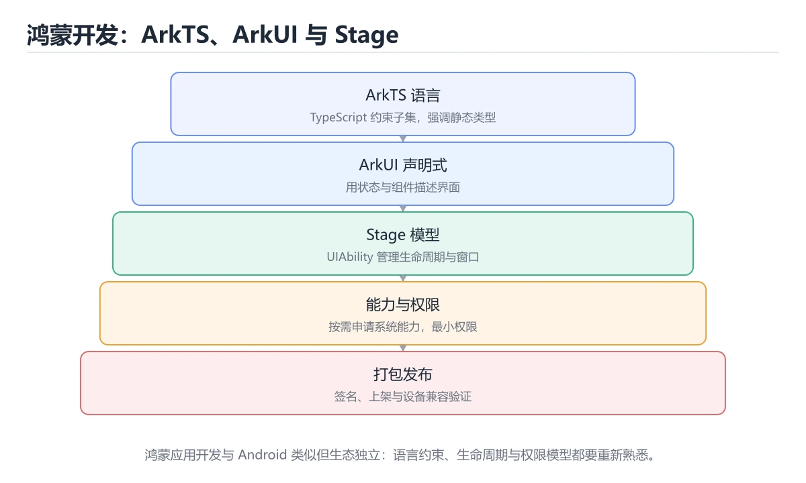
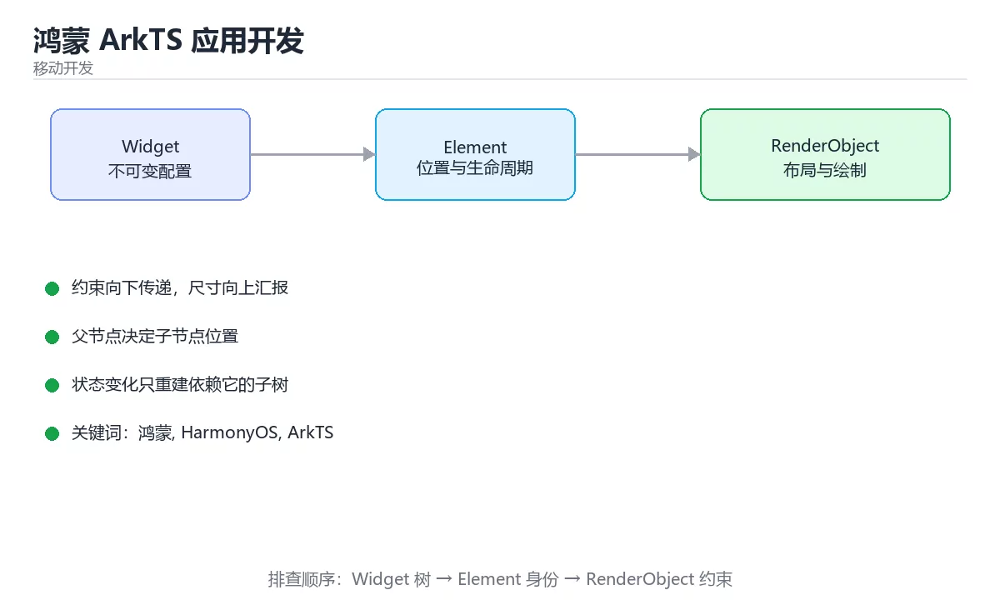

# 鸿蒙 ArkTS 应用开发





> 内容更新时间：2026-10-03 · 学习阶段：进阶 · 预计用时：16 分钟

## 学习目标

- 能用自己的话解释「鸿蒙 ArkTS 应用开发」解决了什么问题，而不是只背术语。
- 能说清 「鸿蒙」、「HarmonyOS」、「ArkTS」、「ArkUI」 之间的关系，并分别举出一个例子。
- 能把本课知识放回「移动开发」的知识体系，说明它和相邻主题的边界。
- 能完成本课练习，并用验收标准检查自己的结果。

> 一句话摘要：ArkTS 语言约束、ArkUI 声明式写法与 Stage 模型。

## 前置知识

- 先完成上一课《Jetpack Compose 声明式 UI》；如果已经掌握，可以直接用本课练习自测。
- 本课阶段：进阶。建议先掌握同一分类的基础课程，并能独立运行正文中的最小示例。
- 开始前先复习：鸿蒙、HarmonyOS、ArkTS。
- 如果某一步看不懂，先记录具体卡点，完成练习后再回头读一遍。


## 技术栈速查

| 组成 | 说明 |
| --- | --- |
| ArkTS | 基于 TypeScript 扩展的语言，禁用部分动态特性以提升性能 |
| ArkUI | 声明式 UI 框架，写法与 Compose/SwiftUI 类似 |
| Stage 模型 | 当前主推的应用模型，UIAbility 承载界面 |
| UIAbility | 应用组件，对应一个可启动的界面能力 |
| HAP / HSP | 模块包，HAP 为部署单元，HSP 为共享包 |
| AppGallery Connect | 上架、分发与测试服务 |

| 与 Android 对照 | Android | HarmonyOS |
| --- | --- | --- |
| 语言 | Kotlin / Java | ArkTS |
| UI | Compose / XML | ArkUI 声明式 |
| 入口组件 | Activity | UIAbility |
| 部署包 | APK / AAB | HAP / App Pack |
| 权限声明 | AndroidManifest | module.json5 |

## ArkUI 速查

| 需求 | 写法 |
| --- | --- |
| 布局容器 | `Column`、`Row`、`Stack`、`Flex` |
| 列表 | `List` + `ListItem`，配合 `ForEach` |
| 状态 | `@State`、`@Prop`、`@Link`、`@Provide`/`@Consume` |
| 持久状态 | `PersistentStorage`、`AppStorage` |
| 复用组件 | `@Component` + `@Builder` |
| 副作用 | `aboutToAppear()`、`aboutToDisappear()` |
| 路由 | `router.pushUrl` / `Navigation` |

```typescript
@Component
struct LessonList {
  @State lessons: Lesson[] = [];
  @State loading: boolean = false;

  aboutToAppear(): void {
    this.load();                       // 生命周期里做初始化，不在 build 中触发
  }

  async load(): Promise<void> {
    this.loading = true;
    try {
      this.lessons = await LessonRepository.fetch();
    } finally {
      this.loading = false;
    }
  }

  build() {
    Column({ space: 8 }) {
      if (this.loading) {
        LoadingProgress().width(48).height(48);
      } else {
        List({ space: 8 }) {
          ForEach(this.lessons, (lesson: Lesson) => {
            ListItem() {
              Text(lesson.title)
                .fontSize(16)
                .maxLines(1)
                .textOverflow({ overflow: TextOverflow.Ellipsis })
                .width('100%')
                .padding(16)
            }
          }, (lesson: Lesson) => lesson.id)      // 稳定 key，避免列表错位
        }
        .layoutWeight(1)
      }
    }
    .width('100%')
    .height('100%')
    .padding(16)
  }
}
```

## 与 Flutter / Compose 的差异

| 维度 | 说明 |
| --- | --- |
| 语言限制 | ArkTS 禁用 `any`、运行时动态属性等，编译期检查更严 |
| 状态装饰器 | 通过 `@State`/`@Prop` 等装饰器声明与传递状态 |
| 并发模型 | 提供 TaskPool 与 Worker 处理耗时任务，UI 线程不阻塞 |
| 分布式能力 | 支持跨设备流转、分布式数据对象（需用户授权） |
| 包体结构 | 以模块（Module）组织，HAP 按需分发 |

## 常见错误对照表

| 容易踩的做法 | 实际现象 | 原因与正确做法 |
| --- | --- | --- |
| 在 `build()` 里发起请求 | 每次刷新都重复请求 | 放到 `aboutToAppear` 或事件回调 |
| 用普通变量存 UI 状态 | 界面不刷新 | 加 `@State` 等装饰器 |
| 列表 `ForEach` 不给 key | 增删后界面错乱 | 用唯一业务 ID 作为 key |
| UI 线程做耗时计算 | 界面卡顿 | 用 TaskPool / Worker |
| 权限只在代码里判断 | 未声明导致调用失败 | 同时在 `module.json5` 声明权限 |
| 直接用动态类型写法 | 编译报错 | 显式类型，遵循 ArkTS 约束 |
| 忽略多设备适配 | 大屏或折叠屏布局异常 | 用响应式断点与栅格布局 |

## 自测清单

- [ ] 能说清 ArkTS、ArkUI、UIAbility 与 Stage 模型的关系。
- [ ] 状态用装饰器声明，初始化放在生命周期而非 `build`。
- [ ] 列表使用稳定 key，耗时任务放 TaskPool。
- [ ] 权限在配置文件与代码中同时处理。
- [ ] 能对照 Android 的 Activity/Compose 理解差异。


## 零基础详解：鸿蒙 ArkTS 与 ArkUI

### 一句话说清它是什么

鸿蒙应用用 **ArkTS**（TypeScript 的超集）编写，界面用 **ArkUI 声明式语法**描述。
心智与 Compose、SwiftUI 一致：**状态驱动界面**，改状态就自动刷新。

### 用生活比喻理解

| 概念 | 比喻 | 说明 |
| --- | --- | --- |
| ArkTS | 带类型的安全版 TS | 语法近似 TypeScript |
| ArkUI | 声明式画布 | 用代码描述界面 |
| 装饰器 | 贴标签 | `@State`、`@Prop` 标明数据角色 |
| Ability | 应用的一个能力入口 | UIAbility 对应一个界面容器 |
| 页面路由 | 导航员 | 页面之间跳转与传参 |

### 一个页面的基本结构

```typescript
@Entry
@Component
struct CounterPage {
  @State count: number = 0;

  build() {
    Column({ space: 12 }) {
      Text(`计数：${this.count}`)
        .fontSize(20)
        .fontWeight(FontWeight.Medium)

      Button('加一')
        .onClick(() => { this.count += 1; })
        .width('60%')
    }
    .padding(16)
    .width('100%')
    .height('100%')
    .justifyContent(FlexAlign.Center)
  }
}
```

| 关键点 | 说明 |
| --- | --- |
| `@Entry` | 标记为页面入口 |
| `@Component` | 标记为可复用组件 |
| `build()` | 描述界面结构 |
| `@State` | 组件内部状态，变化触发刷新 |

### 五个常用状态装饰器

| 装饰器 | 作用 | 数据流向 |
| --- | --- | --- |
| `@State` | 组件自己的状态 | 组件内部 |
| `@Prop` | 父传子的单向数据 | 父 → 子 |
| `@Link` | 与父组件双向同步 | 双向 |
| `@Provide` / `@Consume` | 跨层共享 | 祖先 → 后代 |
| `@Observed` / `@ObjectLink` | 观察对象内部变化 | 对象属性级 |

```typescript
@Component
struct Child {
  @Prop title: string;              // 只读，父组件传入
  @Link count: number;              // 双向，可直接改

  build() {
    Row({ space: 8 }) {
      Text(this.title)
      Button('+1').onClick(() => { this.count += 1; })
    }
  }
}
```

**要点**：`@State` 只能观察第一层变化；对象内部属性变化要用 `@Observed` 与 `@ObjectLink`。

### 页面跳转与传参

```typescript
import { router } from '@kit.ArkUI';

// 跳转并传参
router.pushUrl({
  url: 'pages/DetailPage',
  params: { id: 42, title: '订单详情' },
});

// 目标页面接收
const params = router.getParams() as Record<string, Object>;
const id = params?.id as number;

// 返回
router.back();
```

更推荐用 **Navigation 组件**管理多级页面与返回栈，能力比 `router` 更完整。

### 应用模型：Stage 模型

```text
entry/                      应用入口模块（HAP）
  src/main/ets/
    entryability/           UIAbility：界面入口与生命周期
    pages/                  页面
    components/             可复用组件
    model/                  数据模型
    viewmodel/              状态与业务编排
  resources/                字符串、图片、颜色
```

| 目录 | 职责 |
| --- | --- |
| `entryability` | 应用启动、前台后台切换 |
| `pages` | 页面级组件 |
| `components` | 通用组件 |
| `viewmodel` | 状态与数据编排 |

**资源统一放 `resources`**：多语言与深色模式都靠它切换，不要在代码里写死文案。

### 生命周期要处理的四件事

```typescript
export default class EntryAbility extends UIAbility {
  onCreate() { /* 初始化资源 */ }
  onWindowStageCreate(windowStage: window.WindowStage) {
    windowStage.loadContent('pages/Index');    // 加载首页
  }
  onForeground() { /* 恢复刷新 */ }
  onBackground() { /* 暂停轮询、保存草稿 */ }
}
```

| 时机 | 该做什么 |
| --- | --- |
| `onCreate` | 初始化全局资源 |
| `onWindowStageCreate` | 加载首页 |
| `onForeground` | 恢复定时器与刷新 |
| `onBackground` | 暂停任务、保存状态 |
| `onDestroy` | 释放资源 |

### 新手最容易踩的八个坑

| 坑 | 现象 | 正确做法 |
| --- | --- | --- |
| 用普通变量存状态 | 界面不刷新 | 用 `@State` |
| 修改对象内部属性 | 界面不更新 | 用 `@Observed` 与 `@ObjectLink` |
| 文案写死在代码里 | 无法多语言 | 放 `resources` |
| 忽略 `onBackground` | 后台仍在轮询耗电 | 暂停任务 |
| 列表项缺 key | 刷新后状态错位 | 提供稳定 key |
| 把业务写在 `build()` 里 | 重复执行 | 放生命周期或 ViewModel |
| 不处理权限申请 | 功能静默失败 | 运行时申请并处理拒绝 |
| 忘记适配深色模式 | 界面刺眼 | 用资源颜色变量 |

### 学完自测

- [ ] 能说出 `@State`、`@Prop`、`@Link` 的差别。
- [ ] 知道对象内部属性变化要用什么装饰器。
- [ ] 能说出 Stage 模型里 `entryability` 的职责。
- [ ] 知道为什么文案要放 `resources`。
- [ ] 能说出 `onBackground` 里应该做什么。

## 动手练习


> 本课练习重点：围绕「鸿蒙、HarmonyOS、ArkTS」完成复述、实验和交付，每个结果都要能被别人检查。

先做一个最小 Widget，再切换状态与约束，最后在窄屏和深色模式下验证布局。

### 练习 1：建立心智模型（10 分钟）

合上教程，用 3～5 句话回答：

1. 「鸿蒙 ArkTS 应用开发」解决了什么问题？
2. 如果没有它，会出现什么具体后果？
3. 它和「HarmonyOS」是什么关系？

**验收标准**：至少出现一个本课关键词，并写出一个反例、边界条件或失效场景。

### 练习 2：做一次可控实验（20 分钟）

从正文中选一个最小示例，完成以下操作：

1. 先预测修改一个参数、输入或步骤后的结果。
2. 再实际执行或逐步推演，记录真实结果。
3. 如果结果与预测不同，写出差异原因。

**验收标准**：留下「原例 → 改动 → 预测 → 结果 → 原因」五步记录。

### 练习 3：交付一个小结果（30 分钟）

创建一个最小 Widget，分别验证正常输入、空数据和超长文本三种状态。

任务要求：

- 结果必须能被别人检查，不能只写“我已经理解了”。
- 至少覆盖「鸿蒙」和「HarmonyOS」两个关键词。
- 写出 1 个仍然不确定的问题，以及下一步如何验证。

> 提示：时间有限时优先做练习 1 和练习 2；练习 3 可以拆成两次完成。

## 本课小结

- 核心问题：「鸿蒙 ArkTS 应用开发」不是孤立术语，而是在「移动开发」中解决一类具体问题。
- 关键关系：先分清「鸿蒙」与「HarmonyOS」的职责，再理解「ArkTS」的适用边界。
- 判断标准：能解释正常场景、边界条件和失败场景，才算真正掌握。
- 下一步：完成练习后，用自己的话写下 3 条要点，再去做本课测验。


## 可运行练习

下面 3 个任务围绕“鸿蒙 ArkTS 应用开发”展开，代码可以直接粘贴到 App 的离线沙箱里运行；如果示例会读取标准输入，请按代码注释在沙箱的 stdin 区域填入同样格式的数据。

### 任务 1：先跑通，再解释

```typescript
@Entry
@Component
struct CounterPage {
  @State count: number = 0;

  build() {
    Column({ space: 12 }) {
      Text(`计数：${this.count}`)
        .fontSize(20)
        .fontWeight(FontWeight.Medium)

      Button('加一')
        .onClick(() => { this.count += 1; })
        .width('60%')
    }
    .padding(16)
    .width('100%')
    .height('100%')
    .justifyContent(FlexAlign.Center)
  }
}
```

**预期输出**：运行后会输出与“鸿蒙 ArkTS 应用开发”相关的关键结果；请重点核对输出行数、最后一个数值和异常提示。

**验收标准**：代码能正常运行；逐行解释每个变量的值如何变化，并指出哪一行决定了最终结果。

### 任务 2：只改一个条件

复制上面的代码，只修改一个输入、边界或参数（例如空值、最大值、循环次数、过滤条件），先写出你的预测，再实际运行。

**验收标准**：留下“原结果 → 改动 → 预测 → 实际结果 → 差异原因”五步记录；如果预测错误，要写出修正后的心智模型。

### 任务 3：迁移到自己的数据

用同一套思路处理一组你自己的数据或场景，保持输出格式与任务 1 一致。

**验收标准**：代码不少于 10 行，至少包含 1 个边界检查；把代码和运行结果保存到笔记或片段库。


## 故障现场

这一节把“鸿蒙 ArkTS 应用开发”最常见的失败方式还原成现场记录，练习时按“症状 → 复现 → 定位 → 修复 → 预防”的顺序排查。

### 现场 1：“鸿蒙 ArkTS 应用开发”的 鸿蒙 常规用例通过，但边界用例失败

**症状**：在“鸿蒙 ArkTS 应用开发”的练习或生产场景里出现““鸿蒙 ArkTS 应用开发”的 鸿蒙 常规用例通过，但边界用例失败”。

**复现**：准备一组最小输入，只保留触发““鸿蒙 ArkTS 应用开发”的 鸿蒙 常规用例通过，但边界用例失败”的必要条件，连续运行两次确认结果稳定。

**定位**：围绕“鸿蒙 的前置条件与取值边界没有写进代码，默认值掩盖了空值和极值”检查调用链、输入数据和环境配置，先验证假设再改代码。

**修复**：为“鸿蒙 ArkTS 应用开发”补一条空值或极值用例，把前置条件写成断言，并让失败信息直接指出是哪个输入越界

**预防**：把““鸿蒙 ArkTS 应用开发”的 鸿蒙 常规用例通过，但边界用例失败”写成一条自动化用例，并在“鸿蒙 ArkTS 应用开发”的验收清单里保留对应检查项。


### 现场 2：“鸿蒙 ArkTS 应用开发”的 HarmonyOS 结果在两次运行之间不一致

**症状**：在“鸿蒙 ArkTS 应用开发”的练习或生产场景里出现““鸿蒙 ArkTS 应用开发”的 HarmonyOS 结果在两次运行之间不一致”。

**复现**：准备一组最小输入，只保留触发““鸿蒙 ArkTS 应用开发”的 HarmonyOS 结果在两次运行之间不一致”的必要条件，连续运行两次确认结果稳定。

**定位**：围绕“HarmonyOS 依赖了当前版本、执行顺序或共享状态，单次运行无法暴露差异”检查调用链、输入数据和环境配置，先验证假设再改代码。

**修复**：固定“鸿蒙 ArkTS 应用开发”使用的版本与随机种子，记录两次运行的完整输入和输出，再逐项消除非确定性来源

**预防**：把““鸿蒙 ArkTS 应用开发”的 HarmonyOS 结果在两次运行之间不一致”写成一条自动化用例，并在“鸿蒙 ArkTS 应用开发”的验收清单里保留对应检查项。


### 现场 3：“鸿蒙 ArkTS 应用开发”的验证只在开发机通过

**症状**：在“鸿蒙 ArkTS 应用开发”的练习或生产场景里出现““鸿蒙 ArkTS 应用开发”的验证只在开发机通过”。

**复现**：准备一组最小输入，只保留触发““鸿蒙 ArkTS 应用开发”的验证只在开发机通过”的必要条件，连续运行两次确认结果稳定。

**定位**：围绕“环境版本、配置和输入规模与目标环境不同，鸿蒙 缺少可重复的验证记录”检查调用链、输入数据和环境配置，先验证假设再改代码。

**修复**：把“鸿蒙 ArkTS 应用开发”的运行环境、输入样本和预期输出写成清单，并在另一套环境复跑同一条命令

**预防**：把““鸿蒙 ArkTS 应用开发”的验证只在开发机通过”写成一条自动化用例，并在“鸿蒙 ArkTS 应用开发”的验收清单里保留对应检查项。


## 考点精讲：把测验题还原成判断过程

本课有 6 个判断点。先自己作答，再看「判断依据」；如果结论正确但理由不完整，回到正文对应章节补足概念。

### 考点 1：HarmonyOS 中承载界面的应用组件是？

- **正确判断**：UIAbility
- **判断依据**：Stage 模型下用 UIAbility 承载界面能力，配合窗口与页面路由。「Service」、「UIAbility」来自 Android 体系。针对「HarmonyOS 中承载界面的应用组件是，」，本课在「零基础详解：鸿蒙 ArkTS 与 ArkUI」中说明：鸿蒙应用用 ArkTS（TypeScript 的超集）编写，界面用 ArkUI 声明式语法描述。本课还在「零基础详解：鸿蒙 ArkTS 与 ArkUI」中说明：心智与 Compose、SwiftUI 一致：状态驱动界面，改状态就自动刷新。
- **迁移检查**：遮住选项，只根据定义复述一次答案，再回来看哪个选项与复述一致。

### 考点 2：ArkTS 相比 TypeScript 的主要差异是？

- **正确判断**：限制部分动态特性以提升运行性能与稳定性
- **判断依据**：正确答案是「限制部分动态特性以提升运行性能与稳定性」，这道题在问ArkTS相比TypeScript的主要差异是，判断时要把题干限定的输入、边界与目标逐项对齐。ArkTS 在 TS 基础上禁用或限制 any、运行时动态属性等能力，让编译期能做更多检查、运行时更可控。
- **迁移检查**：把题干里的一个条件换成边界值，原来的结论还成立吗？写出判断过程。

### 考点 3：在 ArkUI 中让界面随数据变化刷新，应该怎么做？

- **正确判断**：用 @State 等状态装饰器声明数据
- **判断依据**：正确答案是「用 @State 等状态装饰器声明数据」，本课在「零基础详解：鸿蒙 ArkTS 与 ArkUI」中说明：鸿蒙应用用 ArkTS（TypeScript 的超集）编写，界面用 ArkUI 声明式语法描述。ArkUI 通过装饰器建立数据与 UI 的绑定，状态变化自动触发刷新。本课还在「零基础详解：鸿蒙 ArkTS 与 ArkUI」中说明：心智与 Compose、SwiftUI 一致：状态驱动界面，改状态就自动刷新。
- **迁移检查**：遮住选项，只根据定义复述一次答案，再回来看哪个选项与复述一致。

### 考点 4：ForEach 渲染列表时必须注意什么？

- **正确判断**：必须提供稳定唯一的 key
- **判断依据**：正确答案是「必须提供稳定唯一的 key」，这道题在问ForEach渲染列表时必须注意什么，判断时要把题干限定的输入、边界与目标逐项对齐。稳定 key 让框架识别条目身份，增删时才能正确复用节点与状态。课程摘要指出ArkTS 语言约束，ArkUI 声明式写法与 Stage 模型，本课要判断的正是ForEach渲染列表时必须注意什么。
- **迁移检查**：如果给某个错误选项去掉一个限定词，它会不会变成正确？说明理由。

### 考点 5：耗时计算放在 UI 线程会怎样？如何解决？

- **正确判断**：导致界面卡顿
- **判断依据**：正确答案是「导致界面卡顿」，这道题在问耗时计算放在UI线程会怎样，如何解决，判断时要把题干限定的输入、边界与目标逐项对齐。UI 线程被占用会直接表现为掉帧甚至无响应，鸿蒙提供 TaskPool 与 Worker 处理并发任务。耗时计算放在 UI 线程会怎样。
- **迁移检查**：遮住选项，只根据定义复述一次答案，再回来看哪个选项与复述一致。

### 考点 6：补全代码：「鸿蒙 ArkTS 应用开发」示例中，下面这行代码缺少哪个关键字或函数名？请填入 ____。 `____(windowStage: window.WindowStage) {`

- **正确判断**：onWindowStageCreate / onwindowstagecreate
- **判断依据**：正确答案是「onWindowStageCreate」，本课在「零基础详解：鸿蒙 ArkTS 与 ArkUI」中说明：资源统一放 resources：多语言与深色模式都靠它切换，不要在代码里写死文案。本课示例中还能看到 `onWindowStageCreate(windowStage: window.WindowStage) {` 这样的用法，说明该关键字在本课代码中承担实际功能。
- **迁移检查**：不看题干，用自己的话补全这句话，再与标准答案对照。

### 补充自测（2 题）

1. 围绕“鸿蒙 ArkTS 应用开发”中的 鸿蒙、HarmonyOS、ArkTS，下列哪两项是本课强调的实践判断？
2. 下面这段 Dart 代码复现了“鸿蒙 ArkTS 应用开发”中 鸿蒙、HarmonyOS、ArkTS 相关的一个常见故障，哪一项最准确地解释了问题？

这些题按“先定位概念、再排除边界错误、最后核对答案”的顺序作答；每题解析都给出了判断依据。


## 本课复习清单

离开本课前，逐项确认：

- [ ] 不看解析，能说出「HarmonyOS 中承载界面的应用组件是？」的判断依据。
- [ ] 不看解析，能说出「ArkTS 相比 TypeScript 的主要差异是？」的判断依据。
- [ ] 不看解析，能说出「在 ArkUI 中让界面随数据变化刷新，应该怎么做？」的判断依据。
- [ ] 不看解析，能说出「ForEach 渲染列表时必须注意什么？」的判断依据。
- [ ] 不看解析，能说出「耗时计算放在 UI 线程会怎样？如何解决？」的判断依据。
- [ ] 不看解析，能说出「补全代码：「鸿蒙 ArkTS 应用开发」示例中，下面这行代码缺少哪个关键字或函数…」的判断依据。
- [ ] 至少运行一次本课示例，记录输入、输出和一个边界情况。
- [ ] 把本课最容易混淆的两个概念写成一句话对照。

| 复盘项 | 记录 |
| --- | --- |
| 已经能独立解释的考点 |  |
| 仍然说不清的概念 |  |
| 下一步验证动作 |  |

## 术语速查

把本课反复出现的术语集中放在一起。复习时先遮住右列，尝试用自己的话解释，再回到正文核对。

| 术语 | 本课语境 |
| --- | --- |
| `Column` | \| 布局容器 \| `Column`、`Row`、`Stack`、`Flex` \| |
| `Row` | \| 布局容器 \| `Column`、`Row`、`Stack`、`Flex` \| |
| `Stack` | \| 布局容器 \| `Column`、`Row`、`Stack`、`Flex` \| |
| `Flex` | \| 布局容器 \| `Column`、`Row`、`Stack`、`Flex` \| |
| `List` | \| 列表 \| `List` + `ListItem`，配合 `ForEach` \| |
| `ListItem` | \| 列表 \| `List` + `ListItem`，配合 `ForEach` \| |
| `ForEach` | \| 列表 \| `List` + `ListItem`，配合 `ForEach` \| |
| `@State` | \| 状态 \| `@State`、`@Prop`、`@Link`、`@Provide`/`@Consume` \| |
| `@Prop` | \| 状态 \| `@State`、`@Prop`、`@Link`、`@Provide`/`@Consume` \| |
| `@Link` | \| 状态 \| `@State`、`@Prop`、`@Link`、`@Provide`/`@Consume` \| |
| `@Provide` | \| 状态 \| `@State`、`@Prop`、`@Link`、`@Provide`/`@Consume` \| |
| `@Consume` | \| 状态 \| `@State`、`@Prop`、`@Link`、`@Provide`/`@Consume` \| |

## 面试问答与自测

下面把本课考点换成面试追问。先口述自己的答案，
再对照参考回答检查是否遗漏了前提、边界或失败路径。

### 追问 1：HarmonyOS 中承载界面的应用组件是？

**参考回答**：Stage 模型下用 UIAbility 承载界面能力，配合窗口与页面路由。「Service」、「UIAbility」来自 Android 体系。针对「HarmonyOS 中承载界面的应用组件是，」，本课在「零基础详解·鸿蒙 ArkTS 与 ArkUI」中说明：鸿蒙应用用 ArkTS（TypeScript 的超集）编写，界面用 ArkUI 声明式语法描述。本课还在「零基础详解·鸿蒙 ArkTS 与 ArkUI」中说明：心智与 Compose、SwiftUI 一致：状态驱动界面，改状态就自动刷新。

### 追问 2：ArkTS 相比 TypeScript 的主要差异是？

**参考回答**：正确答案是「限制部分动态特性以提升运行性能与稳定性」，这道题在问ArkTS相比TypeScript的主要差异是，判断时要把题干限定的输入、边界与目标逐项对齐。ArkTS 在 TS 基础上禁用或限制 any、运行时动态属性等能力，让编译期能做更多检查、运行时更可控。

### 追问 3：在 ArkUI 中让界面随数据变化刷新，应该怎么做？

**参考回答**：正确答案是「用 @State 等状态装饰器声明数据」，本课在「零基础详解·鸿蒙 ArkTS 与 ArkUI」中说明：鸿蒙应用用 ArkTS（TypeScript 的超集）编写，界面用 ArkUI 声明式语法描述。ArkUI 通过装饰器建立数据与 UI 的绑定，状态变化自动触发刷新。本课还在「零基础详解·鸿蒙 ArkTS 与 ArkUI」中说明：心智与 Compose、SwiftUI 一致：状态驱动界面，改状态就自动刷新。

### 追问 4：ForEach 渲染列表时必须注意什么？

**参考回答**：正确答案是「必须提供稳定唯一的 key」，这道题在问ForEach渲染列表时必须注意什么，判断时要把题干限定的输入、边界与目标逐项对齐。稳定 key 让框架识别条目身份，增删时才能正确复用节点与状态。课程摘要指出ArkTS 语言约束，ArkUI 声明式写法与 Stage 模型，本课要判断的正是ForEach渲染列表时必须注意什么。

### 追问 5：耗时计算放在 UI 线程会怎样？如何解决？

**参考回答**：正确答案是「导致界面卡顿」，这道题在问耗时计算放在UI线程会怎样，如何解决，判断时要把题干限定的输入、边界与目标逐项对齐。UI 线程被占用会直接表现为掉帧甚至无响应，鸿蒙提供 TaskPool 与 Worker 处理并发任务。耗时计算放在 UI 线程会怎样。

## English Overview

**Title:** HarmonyOS ArkTS

**Summary:** ArkTS constraints, ArkUI declarative UI and Stage model.

**Category:** Mobile Development  
**Level:** 进阶  
**Key terms:** 鸿蒙, HarmonyOS, ArkTS, ArkUI, UIAbility

> The full tutorial is written in Chinese. This bilingual overview helps English readers identify the topic, scope and key terms before studying the detailed examples.

## 内容元数据

- 内容版本：v2.0
- 最后更新：2026-10-03
- 学习阶段：进阶
- 适用环境：Flutter 3.x / Dart 3.x
- 内容来源：内置结构化课程与工程实践整理
- 相关主题：鸿蒙、HarmonyOS、ArkTS、ArkUI、UIAbility
- 质量版本：P0 测验标准 + P1 覆盖扩展 + P2 体验补全


## 参考资料与复核

- 最后复核：2026-10-04
- 下次复核：2027-04-04
- 复核范围：版本兼容、API 行为、安全建议与工程实践
- 来源性质：官方文档与标准；本课正文为离线教学重组，不复制原文

| 参考资料 | 本课用途 |
| --- | --- |
| [Flutter 官方文档](https://docs.flutter.dev/) | 框架、组件与发布流程 |
| [Dart 官方文档](https://dart.dev/guides) | 语言、异步与工具链 |

> 本课主题：ArkTS 语言约束、ArkUI 声明式写法与 Stage 模型。

> App 完全离线展示文字链接，不会自动联网；需要延伸阅读时可复制链接到浏览器。
