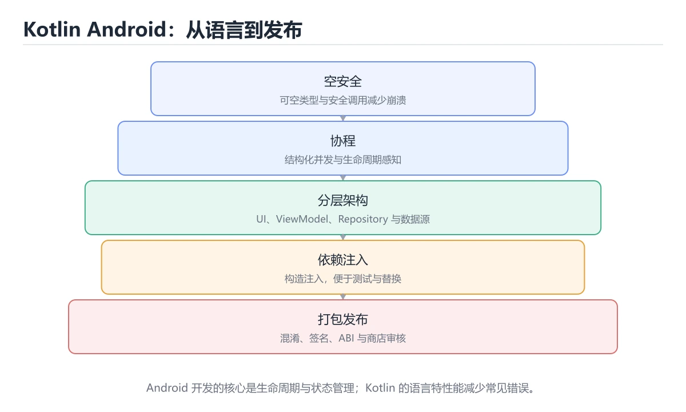
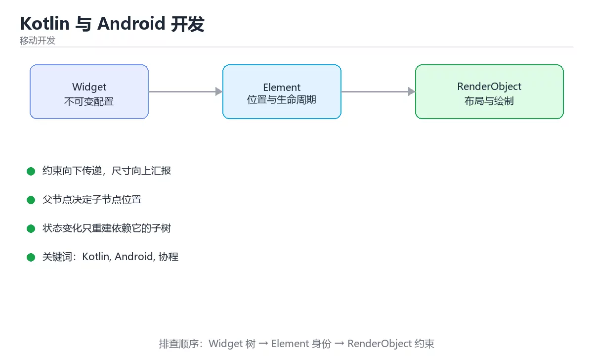

# Kotlin 与 Android 开发





> 内容更新时间：2026-10-06 · 学习阶段：基础 · 预计用时：35 分钟

## 学习目标

- 能用自己的话解释Kotlin 与 Android 开发解决了什么问题，而不是只背术语。
- 能说清 「Kotlin」、「Android」、「协程」、「ViewModel」 之间的关系，并分别举出一个例子。
- 能把 Kotlin 放回「Kotlin 与 Android 开发」的知识体系，说明它和 Android 的边界。
- 能完成本课练习，并用验收标准检查自己的结果。

> 一句话摘要：空安全、协程、分层架构与打包发布。

## 前置知识

- 先完成上一课《实战：Flutter 打包发布 Android》；如果已经掌握，可以直接用本课练习自测。
- 本课阶段：基础。建议先完成「实战：Flutter 打包发布 Android」，或确认自己能独立跑通正文里的 LessonRepository 示例。
- 开始前先复习：Kotlin、Android、协程。
- 如果 语言特性速览 这一步看不懂，先记录具体卡点，再用 LessonRepository 复现一遍。

## 语言特性速览

| 特性 | 说明 |
| --- | --- |
| 空安全 | 类型区分可空与非空，`?.`/`?:`/`!!` 显式处理空值 |
| 数据类 | `data class User(val id: Int, val name: String)` 自动生成 equals/hashCode/copy |
| 扩展函数 | 给已有类加方法而不继承，如 `fun String.toSlug()` |
| 协程 | `suspend` + `launch`/`async`，用同步写法表达异步逻辑 |
| 密封类 | `sealed class Result` 表达有限状态，配合 when 穷尽检查 |
| 属性委托 | `by lazy`、`by viewModels()` 减少样板代码 |

## Android 应用结构

| 层 | 组件 | 职责 |
| --- | --- | --- |
| UI | Activity / Fragment / Compose | 展示与交互 |
| 状态 | ViewModel + StateFlow | 持有界面状态，配置变更后存活 |
| 数据 | Repository + Room/Retrofit | 统一数据来源（本地缓存 + 网络） |
| 后台 | WorkManager | 可延迟、需保证执行的任务 |

要点：**不要在 Activity 里写业务逻辑**；网络与数据库操作必须离开主线程（协程的 Dispatchers.IO）；用 `viewLifecycleOwner` 收集 Flow 避免泄漏。

## 生命周期与常见崩溃

1. 配置变更（旋转）会重建 Activity，状态放 ViewModel 而非成员变量。
2. 持有 Activity/Context 的长时间引用会内存泄漏（用 applicationContext 或在 onDestroy 释放）。
3. 后台启动 Service 受限，长任务改用 WorkManager 或前台服务。
4. 主线程做 IO 会 ANR，所有磁盘与网络访问走协程。

## 打包发布

`./gradlew bundleRelease` 产出 AAB；签名用 `keystore.properties` 外置并在 .gitignore 排除；用 `minifyEnabled true` 加混淆规则减小体积；多渠道与不同环境通过 productFlavors 配置；上线前用 `lint` 检查权限与 API 使用问题。

## 本课小结

Android 开发的关键是**分层（UI/状态/数据）+ 空安全 + 协程**：把状态交给 ViewModel、把耗时操作交给协程、把数据来源收敛到 Repository。

## Kotlin 语法速查

| 特性 | 写法 | 说明 |
| --- | --- | --- |
| 只读变量 | `val name = "x"` | 引用不可重新赋值 |
| 可空类型 | `String?` | 必须显式处理空值 |
| 安全调用 | `name?.length` | 为空返回 null |
| 埃尔维斯 | `name ?: "默认"` | 空值兜底 |
| 非空断言 | `name!!` | 为空即崩溃，尽量不用 |
| 数据类 | `data class User(val id: Long)` | 自动生成 equals / copy |
| 密封类 | `sealed interface Result` | 穷尽分支的联合类型 |
| 扩展函数 | `fun String.shout() = uppercase()` | 不修改原类即可扩展 |
| 作用域函数 | `apply`、`let`、`run`、`also` | 简化初始化与空值处理 |
| 协程 | `suspend fun load()` | 可挂起的异步函数 |

## 协程速查

| 作用域 | 生命周期 | 适用 |
| --- | --- | --- |
| `viewModelScope` | 与 ViewModel 一致 | 界面数据加载 |
| `lifecycleScope` | 与 Activity/Fragment 一致 | 界面相关任务 |
| `applicationScope` | 与应用一致 | 全局后台任务 |
| `GlobalScope` | 不受限 | **禁止使用** |

| 概念 | 说明 |
| --- | --- |
| `Dispatchers.Main` | 主线程，更新 UI |
| `Dispatchers.IO` | 阻塞 IO |
| `Dispatchers.Default` | CPU 密集计算 |
| `withContext` | 切换线程并返回结果 |
| `Flow` | 冷数据流，支持背压 |
| `StateFlow` | 有状态热流，适合 UI 状态 |

```kotlin
// ViewModel：状态用 StateFlow 暴露，UI 只读订阅
data class UiState(
    val loading: Boolean = false,
    val items: List<String> = emptyList(),
    val error: String? = null,
)

class LessonViewModel(private val repo: LessonRepository) : ViewModel() {
    private val _state = MutableStateFlow(UiState())
    val state: StateFlow<UiState> = _state.asStateFlow()

    fun load() {
        viewModelScope.launch {
            _state.update { it.copy(loading = true, error = null) }
            runCatching { withContext(Dispatchers.IO) { repo.fetch() } }
                .onSuccess { list -> _state.update { it.copy(loading = false, items = list) } }
                .onFailure { e -> _state.update { it.copy(loading = false, error = e.message) } }
        }
    }
}

// 可空链式处理：任一步为空即短路
fun displayName(user: User?): String =
    user?.profile?.nickname?.takeIf { it.isNotBlank() } ?: "匿名用户"
```

## Android 组件速查

| 组件 | 职责 | 注意 |
| --- | --- | --- |
| Activity | 承载界面 | 避免放业务逻辑 |
| Fragment | 可复用界面块 | 生命周期复杂，注意视图销毁 |
| ViewModel | 保存界面状态 | 不持有 View 引用 |
| Repository | 数据来源统一入口 | 负责缓存策略 |
| WorkManager | 可靠后台任务 | 适合可延迟任务 |
| Foreground Service | 前台服务 | 需通知与权限说明 |
| Room | 本地数据库 | 用 DAO 与 Flow 观察数据 |

## 常见错误与排查

| 容易踩的做法 | 实际现象 | 原因与正确做法 |
| --- | --- | --- |
| 滥用 `!!` | 线上崩溃 | 用 `?.`、`?:` 或 `requireNotNull` |
| 在 `ViewModel` 里持有 Activity | 内存泄漏 | 只持有 Application 或数据层 |
| 主线程做 IO | 界面卡顿甚至 ANR | 切到 `Dispatchers.IO` |
| 用 `GlobalScope` | 任务泄漏、难以取消 | 用受生命周期约束的作用域 |
| Fragment 中直接碰已销毁视图 | 崩溃 | 在 `onDestroyView` 后置空绑定 |
| 手写大量 `findViewById` | 易错 | 用 ViewBinding |
| 在协程外抛异常未捕获 | 崩溃 | 用 `runCatching` 或 `CoroutineExceptionHandler` |
| 忘记处理配置变更 | 数据丢失 | 状态放 `ViewModel` 或用 `SavedStateHandle` |
| 用字符串拼 SQL | 注入风险 | Room 或参数化查询 |
| 权限未做兼容处理 | 新系统版本崩溃 | 按版本分支申请权限 |

## 复习与自测

- [ ] 空安全用 `?.`、`?:` 处理，`!!` 只出现在确定非空处。
- [ ] 协程绑定合适作用域，禁止 `GlobalScope`。
- [ ] 状态用 `StateFlow` 暴露，UI 只读订阅。
- [ ] ViewModel 不持有 View 或 Activity 引用。
- [ ] 后台任务与权限按系统版本做兼容处理。

## 零基础详解：Kotlin 与 Android 开发

### 一句话说清它是什么

Kotlin 是 Android 的官方首选语言，核心优势是**空安全、简洁、协程**。
Android 侧的工程要点是：**UI 层不写业务、状态放 ViewModel、耗时工作交给协程**。

### 用生活比喻理解

| 概念 | 比喻 | 说明 |
| --- | --- | --- |
| 可空类型 `?` | 贴了「可能空的标签」 | 用前必须处理 |
| `val` / `var` | 只读标签 / 可改标签 | 默认用 `val` |
| 数据类 | 自动生成的信息卡 | 自带 `equals`、`copy` |
| 扩展函数 | 给别人的类加方法 | 不改源码就能扩展 |
| 协程 | 可暂停的轻量任务 | 挂起而不阻塞线程 |
| ViewModel | 页面专属的数据管家 | 旋转屏幕后仍存活 |

### 空安全：Kotlin 最值钱的设计

```kotlin
var name: String = "小明"
var nickname: String? = null          // 加了 ? 才能为 null

// 编译期就拦住：println(nickname.length) 无法编译
println(nickname?.length ?: 0)        // 安全调用加默认值
println(nickname?.length ?: "未填写")

nickname?.let { value ->              // 非空时才执行
    println("昵称长度 ${value.length}")
}

// 只在确实不可能为空时使用，且要能说出理由
val forced = nickname!!.length
```

| 写法 | 含义 |
| --- | --- |
| `String` | 一定不为空 |
| `String?` | 可能为空 |
| `?.` | 为空就返回 null |
| `?:` | 为空时取默认值 |
| `!!` | 断言非空，为空就抛异常（慎用） |

### 数据类与扩展函数

```kotlin
data class User(
    val id: Long,
    val name: String,
    val email: String? = null,
)

val a = User(1, "小明")
val b = a.copy(name = "小红")          // 非破坏性修改
println(a == User(1, "小明"))          // true，按值比较

fun String.toInitials(): String =
    split(" ").mapNotNull { it.firstOrNull() }.joinToString("")

println("Xiao Ming".toInitials())      // XM
```

### 协程：把耗时工作挪出主线程

```kotlin
class UserViewModel(
    private val repository: UserRepository,
) : ViewModel() {

    private val _state = MutableStateFlow<UiState>(UiState.Loading)
    val state: StateFlow<UiState> = _state.asStateFlow()

    fun load(userId: Long) {
        viewModelScope.launch {                 // 绑定 ViewModel 生命周期
            _state.value = UiState.Loading
            _state.value = try {
                UiState.Success(repository.find(userId))
            } catch (e: IOException) {
                UiState.Failure("网络异常，请重试")
            }
        }
    }
}

sealed interface UiState {
    data object Loading : UiState
    data class Success(val user: User) : UiState
    data class Failure(val message: String) : UiState
}
```

| 作用域 | 生命周期 | 用途 |
| --- | --- | --- |
| `viewModelScope` | 跟随 ViewModel | 页面数据加载 |
| `lifecycleScope` | 跟随 Activity 或 Fragment | 界面相关任务 |
| `applicationScope` | 跟随进程 | 全局后台任务 |

**不要在 `GlobalScope` 里启动协程**：它不受生命周期约束，容易泄漏。

### Compose 中的状态

```kotlin
@Composable
fun UserScreen(viewModel: UserViewModel = viewModel()) {
    val state by viewModel.state.collectAsStateWithLifecycle()

    when (val s = state) {
        UiState.Loading -> CircularProgressIndicator()
        is UiState.Failure -> ErrorMessage(s.message, onRetry = { viewModel.load(1) })
        is UiState.Success -> UserCard(s.user)
    }
}

@Composable
private fun UserCard(user: User) {
    Card {
        Column(Modifier.padding(16.dp)) {
            Text(user.name, style = MaterialTheme.typography.titleMedium)
            user.email?.let { Text(it, style = MaterialTheme.typography.bodySmall) }
        }
    }
}
```

**要点**：`collectAsStateWithLifecycle` 会在界面不可见时自动停止收集，省电。

### Android 分层

```text
app/
  ui/             Compose 界面与 ViewModel
  domain/         业务模型与用例
  data/
    local/        数据库（Room）
    remote/       Retrofit 接口
    repository/   组合本地与远端
```

**原则**：UI 只依赖 ViewModel 暴露的状态；Repository 负责决定数据从缓存还是网络来。

### 新手最容易踩的八个坑

| 坑 | 现象 | 正确做法 |
| --- | --- | --- |
| 在 UI 里发网络请求 | 旋转屏幕后重复请求、崩溃 | 放 ViewModel |
| 用 `!!` 图省事 | 线上空指针崩溃 | 用 `?.` 与 `?:` |
| 在主线程做耗时操作 | 界面卡顿或 ANR | 用协程切换 IO 调度器 |
| 用 `GlobalScope` | 协程泄漏 | 用 `viewModelScope` |
| 状态可变且多处修改 | 界面不同步 | 单一数据源加不可变状态 |
| 忘记处理失败态 | 出错白屏 | 四态齐全 |
| 在 Composable 里做副作用 | 重组时重复执行 | 用 `LaunchedEffect` |
| 数据库操作在主线程 | 报错或卡顿 | Room 加挂起函数 |

### 手把手练习：带四态的列表页

```kotlin
class ListViewModel(private val repo: ItemRepository) : ViewModel() {
    private val _state = MutableStateFlow<ListUiState>(ListUiState.Loading)
    val state: StateFlow<ListUiState> = _state.asStateFlow()

    init { refresh() }

    fun refresh() {
        viewModelScope.launch {
            _state.value = ListUiState.Loading
            runCatching { repo.all() }
                .onSuccess { items ->
                    _state.value = if (items.isEmpty()) {
                        ListUiState.Empty
                    } else {
                        ListUiState.Success(items)
                    }
                }
                .onFailure { _state.value = ListUiState.Failure(it.message ?: "加载失败") }
        }
    }
}

sealed interface ListUiState {
    data object Loading : ListUiState
    data object Empty : ListUiState
    data class Success(val items: List<Item>) : ListUiState
    data class Failure(val message: String) : ListUiState
}
```

### 学完自测

- [ ] 能说出 `String` 与 `String?` 的区别。
- [ ] 知道为什么不该用 `!!`。
- [ ] 能说出 `viewModelScope` 与 `GlobalScope` 的差别。
- [ ] 知道为什么状态要放在 ViewModel 里。
- [ ] 能说出 Compose 里副作用的正确位置。

## 动手练习

> 本课练习重点：围绕「Kotlin、Android、协程」完成复述、实验和交付，每个结果都要能被别人检查。

先固定 Android 的约束，再验证不同屏幕宽度下的表现。

### 练习 1：建立心智模型（10 分钟）

合上教程，用 3～5 句话回答：

1. Kotlin 与 Android 开发解决了什么问题？
2. 如果没有它，会出现什么具体后果？
3. 它和「Android」是什么关系？

验收标准：回答里必须出现 Kotlin，并写出一个让结论失效的边界条件。

### 练习 2：做一次可控实验（20 分钟）

从正文中选一个最小示例，完成以下操作：

1. 先预测修改一个参数、输入或步骤后的结果。
2. 再实际执行或逐步推演，记录真实结果。
3. 如果结果与预测不同，写出差异原因。

**验收标准**：先在「语言特性速览」里找一个可运行的最小输入，再按五步法记录Kotlin的影响；预测与结果不一致时补写被忽略的前提。

### 练习 3：交付一个小结果（30 分钟）

用最小 Widget 验证 Android 在空数据与超长文本下的表现。

任务要求：

- 结果必须能被别人检查，不能只写“我已经理解了”。
- 至少覆盖「Kotlin」和「Android」两个关键词。
- 写出 1 个仍然不确定的问题，以及下一步如何验证。

> 提示：时间有限时优先做练习 1 和练习 2；练习 3 可以拆成两次完成。

## 可运行练习

本节围绕Kotlin 与 Android 开发安排 3 个可交付任务，每个任务都要求留下可以复查的记录。

### 任务 1：用自己的话画出结构

不看书，用一张图说清「Kotlin 与 Android 开发」的结构，画完再对照骨架：

- 主干：语言特性速览 → Android 应用结构 → 生命周期与常见崩溃 → 打包发布
- 连接线：在每条边上标出输入、输出与失败路径。
- 自检：能否用一句话说明Kotlin与Android的关系？

### 任务 2：做一次对比实验

**验收标准**：两个方案至少在一个输入上给出不同结果；把差异归因到Kotlin，而不是笼统地写「性能更好」。

### 任务 3：迁移到自己的场景

**验收标准**：结论要能追溯到「语言特性速览」的具体段落，并说明它和 Android 的边界。

## 故障现场

### 现场 1：主线程做 IO

**症状**：在《Kotlin 与 Android 开发》的复现场景中，界面卡顿甚至 ANR。

**根因**：当出现“主线程做 IO”时，执行路径已经绕过了《Kotlin 与 Android 开发》的关键约束，最终以“界面卡顿甚至 ANR”暴露出来；修复前必须先确认约束在哪里失效。

**修复**：针对《Kotlin 与 Android 开发》的问题，切到 Dispatchers.IO。

**验证**：保留《Kotlin 与 Android 开发》里触发“界面卡顿甚至 ANR”的输入、版本和日志，按“切到 Dispatchers.IO”完成修改后原样重放；只有失败现象消失且相邻场景仍可解释，才保留改动。

### 现场 2：用 GlobalScope

**症状**：在《Kotlin 与 Android 开发》的复现场景中，任务泄漏、难以取消。

**根因**：当出现“用 GlobalScope”时，执行路径已经绕过了《Kotlin 与 Android 开发》的关键约束，最终以“任务泄漏、难以取消”暴露出来；修复前必须先确认约束在哪里失效。

**修复**：针对《Kotlin 与 Android 开发》的问题，用受生命周期约束的作用域。

**验证**：在《Kotlin 与 Android 开发》中按“用受生命周期约束的作用域”调整后，从“用 GlobalScope”的触发条件重放同一条路径，确认“任务泄漏、难以取消”不再出现，并补一个相邻边界用例检查没有引入新问题。

### 现场 3：权限未做兼容处理

**症状**：在《Kotlin 与 Android 开发》的复现场景中，新系统版本崩溃。

**根因**：触发点是把“权限未做兼容处理”当成安全做法。它没有满足《Kotlin 与 Android 开发》要求的前提，因此先表现为“新系统版本崩溃”；排查时先完整复现这一段，再核对输入、配置与依赖。

**修复**：针对《Kotlin 与 Android 开发》的问题，按版本分支申请权限。

**验证**：保留《Kotlin 与 Android 开发》里触发“新系统版本崩溃”的输入、版本和日志，按“按版本分支申请权限”完成修改后原样重放；只有失败现象消失且相邻场景仍可解释，才保留改动。

## 本课复习清单

离开本课前，逐项确认：

- [ ] 不看解析，能说出「Kotlin 中表示「可能为空」的类型写法是？」的判断依据。
- [ ] 不看解析，能说出「Android 中承载界面状态、配置变更后仍存活的组件是？」的判断依据。
- [ ] 不看解析，能说出「Android 上架 Google Play 推荐的产物格式是？」的判断依据。
- [ ] 不看解析，能说出「Kotlin 中 val 与 var 的区别是？」的判断依据。
- [ ] 不看解析，能说出「在 Activity 中启动一个随生命周期自动取消的协程，常用写法是？」的判断依据。
- [ ] 用 Kotlin 构造一个正常输入和一个边界输入，分别记录输出与判断依据。
- [ ] 把本课最容易混淆的两个概念写成一句话对照。

| 复盘项 | 记录 |
| --- | --- |
| 已经能独立解释的考点 |  |
| 仍然说不清的概念 |  |
| 下一步验证动作 |  |

## 术语速查

把「Kotlin 与 Android 开发」里反复出现的术语集中放在一起。复习时先遮住右列，尝试用自己的话解释，再回到正文核对。

| 术语 | 一句话说明 |
| --- | --- |
| `Kotlin` | 运行于 JVM 等平台、强调空安全与简洁语法的现代编程语言。 |
| `Android` | Android 开发的关键是分层（UI/状态/数据）+ 空安全 + 协程：把状态交给 ViewModel、把耗时操作交给协程、把数据来源收敛到 Repository。 |
| `AAB` | Android App Bundle 发布格式，由应用商店按设备配置生成拆分后的 APK。 |
| `构建变体` | debug、release 等不同配置的产物，用变体维度管理签名、混淆与接口地址。 |
| `协程` | 协程把耗时工作挪出主线程 |

## 考点精讲

### 考点 1：多选辨析·Kotlin

- **题目**：围绕“Kotlin 与 Android 开发”中的 Kotlin、Android、协程，下列哪两项是本课强调的实践判断？
- **判断依据**：本课把Kotlin 与 Android 开发拆成概念、示例与故障现场三部分，因此判断 Kotlin 时必须同时交代输入、输出和失败路径，这使“学习 Kotlin 时要同时说明输入、输出和失败路径，不能只看正常流程”成立。在Kotlin 与 Android 开发里，判断 Android 时要固定版本与边界输入，所以“验证 Android 时要固定版本并覆盖边界输入，结论才可复现”才可复现。

### 考点 2：概念判断·Kotlin

- **题目**：Android 中承载界面状态、配置变更后仍存活的组件是？
- **判断依据**：在「Kotlin 与 Android 开发」里，Activity 旋转会重建，状态应放在 ViewModel 中。在「Kotlin 与 Android 开发」里，其他选项：Application 是进程级入口，Adapter 负责列表项绑定，Activity 在配置变更时会重建。

### 考点 3：概念判断·Kotlin

- **题目**：Android 上架 Google Play 推荐的产物格式是？
- **判断依据**：AAB 让商店按设备下发，减小下载体积。其他选项：JAR 不是 Android 产物，DEX 是字节码格式，APK 虽可安装但并非商店推荐。如果只凭关键词作答，很容易把「JAR」、「APK」与「AAB」混在一起；这道题的关键在「Kotlin 与 Android 开发」的Kotlin、Android、协程：先确认题干“Android 上架 Google”问的是哪一步，再排除偷换前提的选项。

### 考点 4：代码补全·Kotlin

- **题目**：下面这段 Kotlin 代码摘自「Kotlin 与 Android 开发」的正文示例。关于这段代码，下面哪一项说法与实际内容相符？
- **判断依据**：在「Kotlin 与 Android 开发」里，这段代码包含异常处理分支，失败时会走专门的补救路径。这段代码出自「Kotlin 与 Android 开发」的正文示例，围绕Kotlin、Android、协程展开；把输入或边界换成空值、极值或失败情况后，结论要以「Kotlin 与 Android 开发」的实际运行结果为准。

### 考点 5：概念判断·Kotlin

- **题目**：在 Activity 中启动一个随生命周期自动取消的协程，常用写法是？
- **判断依据**：在「Kotlin 与 Android 开发」里，lifecycleScope.launch { }。lifecycleScope 绑定组件生命周期，销毁时自动取消，避免泄漏。「Kotlin 与 Android 开发」要求先交代Kotlin、Android、协程的前提再下结论，所以“lifecycleScope.launc”只在题干“在 Activity 中启动一个随生命周期自动取消的协程”给定的条件下成立。

### 考点 6：顺序排列·Kotlin

- **题目**：按照「Kotlin 与 Android 开发」从概念到实践的讲解顺序排列下列主题。
- **判断依据**：在「Kotlin 与 Android 开发」里，正确的执行顺序是「语言特性速览」 → 「Android 应用结构」 → 「生命周期与常见崩溃」 → 「打包发布」。在「Kotlin 与 Android 开发」里，在本课中，正确顺序是：1. 语言特性速览 → 2. Android 应用结构 → 3. 生命周期与常见崩溃 → 4. 打包发布。

## English Overview

**Title:** Kotlin & Android

**Summary:** Null safety, coroutines, layering and release.

**Category:** Mobile Development
**Level:** 基础
**Key terms:** Kotlin, Android, 协程, ViewModel, AAB

## 内容元数据

- 内容版本：v2.0
- 最后更新：2026-10-06
- 学习阶段：基础
- 适用环境：Flutter 3.x / Dart 3.x；本课聚焦 Kotlin。
- 内容来源：内置结构化课程与工程实践整理
- 相关主题：Kotlin、Android、协程、ViewModel、AAB
- 质量版本：P0 测验标准 + P1 覆盖扩展 + P2 体验补全

## 参考资料与复核

- 最后复核：2026-10-04
- 下次复核：2027-08-10
- 复核范围：版本兼容、API 行为、安全建议与工程实践
- 来源性质：官方文档、标准或权威教材；正文为离线教学重组

| 参考资料 | 本课用途 |
| --- | --- |
| [Android 发布指南](https://docs.flutter.dev/deployment/android) | 签名、构建与发布 |
| [Dart 语言文档](https://dart.dev/language) | 语言语法、类型与空安全 |
| [Flutter 性能最佳实践](https://docs.flutter.dev/perf/best-practices) | 帧率、构建与内存优化 |

> 「Kotlin 与 Android 开发」的链接用于离线阅读后的延伸核对；App 不会自动联网。

