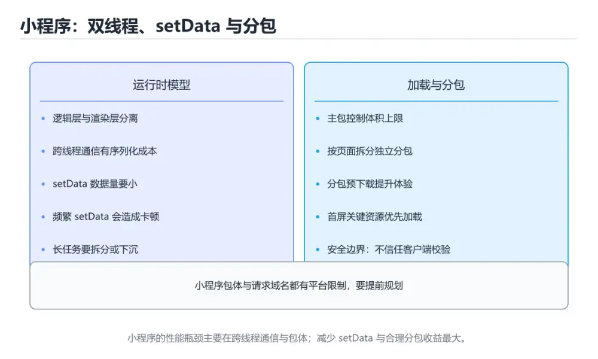
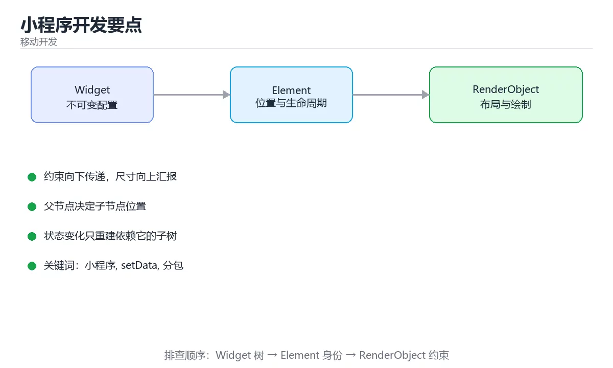

# 小程序开发要点





> 内容更新时间：2026-10-06 · 学习阶段：基础 · 预计用时：30 分钟

## 学习目标

- 能用自己的话解释小程序开发要点解决了什么问题，而不是只背术语。
- 能说清 「小程序」、「setData」、「分包」、「rpx」 之间的关系，并分别举出一个例子。
- 能把 小程序 放回「小程序开发要点」的知识体系，说明它和 setData 的边界。
- 能完成本课练习，并用验收标准检查自己的结果。

> 一句话摘要：双线程模型、setData 优化、分包加载与安全边界。

## 前置知识

- 先完成上一课《鸿蒙 ArkTS 应用开发》；如果已经掌握，可以直接用本课练习自测。
- 本课阶段：基础。建议先掌握同一分类的基础课程，并能独立运行正文里的 onReachBottom 示例。
- 开始前先复习：小程序、setData、分包。
- 卡在 小程序 上时不要跳过：把输入、预期和实际输出写成三行，再回头读正文。

## 运行模型速查

| 层 | 作用 | 限制 |
| --- | --- | --- |
| 逻辑层 | 执行业务 JS（JSCore / V8） | 没有 DOM，不能直接用浏览器 API |
| 渲染层 | 由宿主渲染，通过消息通信 | 不能直接操作节点样式 |
| 通信 | `setData` 跨层传输 | 数据量与频率是性能瓶颈 |
| 分包 | 主包 + 多个分包 | 主包体积有上限，需合理拆分 |

## 常用能力对照

| 需求 | 微信小程序 | 通用说明 |
| --- | --- | --- |
| 页面结构 | WXML | 模板语法，数据绑定 |
| 样式 | WXSS | 类似 CSS，尺寸用 `rpx` |
| 逻辑 | JS/TS（Page/Component） | 页面与组件分离 |
| 本地存储 | `wx.setStorageSync` | 有容量上限 |
| 网络 | `wx.request` | 需配置合法域名，仅 HTTPS |
| 登录 | `wx.login` + 服务端换取 | 不暴露会话密钥 |
| 支付 | 统一下单 + 支付回调 | 金额与签名在服务端校验 |
| 分包加载 | `subpackages` | 主包只放首屏必需资源 |

```javascript
// 列表页：分页加载 + 防抖触底，避免重复请求
Page({
  data: { items: [], page: 1, loading: false, hasMore: true },

  onLoad() {
    this.loadMore();
  },

  onReachBottom() {
    this.loadMore();
  },

  async loadMore() {
    if (this.data.loading || !this.data.hasMore) return;   // 双重防抖
    this.setData({ loading: true });
    try {
      const res = await wx.request({
        url: "https://api.example.com/items",
        data: { page: this.data.page, size: 20 },
      });
      const list = res.data.items || [];
      // 合并数据再一次性 setData，减少跨层通信次数
      this.setData({
        items: this.data.items.concat(list),
        page: this.data.page + 1,
        hasMore: list.length === 20,
        loading: false,
      });
    } catch (error) {
      this.setData({ loading: false });
      wx.showToast({ title: "加载失败", icon: "none" });
    }
  },
});
```

## 性能与体验速查

| 问题 | 手段 |
| --- | --- |
| 首屏慢 | 主包瘦身、分包预加载、骨架屏 |
| `setData` 卡顿 | 只传变化字段、合并调用、避免传大对象 |
| 长列表卡 | 虚拟列表或分段渲染，减少节点数量 |
| 图片体积大 | 压缩、CDN 裁剪参数、按需加载 |
| 频繁请求 | 合并接口、缓存、请求取消 |
| 审核被拒 | 隐私政策、用户授权、类目资质齐全 |

## 常见错误与排查

| 容易踩的做法 | 实际现象 | 原因与正确做法 |
| --- | --- | --- |
| 用 `setData` 传整个大数组 | 渲染卡顿 | 只更新变化项（用路径写法） |
| 直接用 `document`/`window` | 运行报错 | 小程序没有 DOM，用官方 API |
| 未配置请求域名 | 真机请求失败 | 在小程序后台配置合法域名 |
| 把密钥写在前端代码 | 泄漏 | 敏感操作全部走服务端 |
| 主包塞入大量资源 | 超限无法上传 | 资源放分包或 CDN |
| 忽略 `rpx` 与 `px` 差异 | 不同机型尺寸错乱 | 用 `rpx` 做自适应 |
| 不做登录态校验 | 会话过期后请求全失败 | 统一封装请求并处理重新登录 |

## 复习与自测

- [ ] 理解逻辑层与渲染层分离对性能的影响。
- [ ] 会用分包与预加载优化首屏。
- [ ] `setData` 只传变化字段并合并调用。
- [ ] 敏感逻辑与密钥只在服务端处理。
- [ ] 隐私、授权与类目资质在上线前确认。

## 零基础详解：小程序开发要点

### 一句话说清它是什么

小程序是「运行在宿主 App 里的轻量应用」，用 **WXML + WXSS + JS/TS** 三件套编写。
它最大的特点是：**逻辑层与渲染层分离，数据通过 `setData` 单向传递**。

### 用生活比喻理解

| 概念 | 比喻 | 说明 |
| --- | --- | --- |
| WXML | 骨架 | 描述结构（类似 HTML） |
| WXSS | 皮肤 | 描述样式（类似 CSS） |
| JS/TS | 神经 | 逻辑与数据 |
| `setData` | 快递员 | 把数据从逻辑层送到渲染层 |
| 分包 | 分册装订 | 减小首屏体积 |

### 页面文件结构

```text
pages/orders/
  orders.wxml      结构
  orders.wxss      样式
  orders.ts        逻辑
  orders.json      页面配置
app.json           全局配置（页面注册、窗口、分包）
app.ts             应用生命周期
```

### 一个页面的完整写法

```xml
<!-- orders.wxml -->
<view class="page">
  <view wx:if="{{loading}}" class="tip">加载中…</view>
  <view wx:elif="{{error}}" class="tip error">{{error}}</view>
  <view wx:elif="{{orders.length === 0}}" class="tip">暂无订单</view>
  <view wx:else>
    <view
      wx:for="{{orders}}"
      wx:key="id"
      class="card"
      bindtap="onTapOrder"
      data-id="{{item.id}}"
    >
      <text class="title">{{item.title}}</text>
      <text class="amount">¥{{item.amount}}</text>
    </view>
  </view>
</view>
```

```typescript
// orders.ts
Page({
  data: {
    orders: [] as Order[],
    loading: true,
    error: "",
  },

  onLoad() {
    void this.loadOrders();
  },

  async loadOrders() {
    this.setData({ loading: true, error: "" });
    try {
      const res = await wx.request<{ items: Order[] }>({ url: "/api/orders" });
      this.setData({ orders: res.data.items, loading: false });
    } catch (e) {
      this.setData({ error: "加载失败，请稍后重试", loading: false });
    }
  },

  onTapOrder(e: WechatMiniprogram.TouchEvent) {
    const id = e.currentTarget.dataset.id as string;
    wx.navigateTo({ url: `/pages/detail/detail?id=${id}` });
  },
});
```

### setData 的三条纪律

```typescript
// 1. 只传变化的部分，不要整体传
this.setData({ "orders[0].title": "新标题" });

// 2. 高频更新要合并，别在循环里反复 setData
const patch: Record<string, unknown> = {};
for (const item of changed) patch[`orders[${item.index}].title`] = item.title;
this.setData(patch);

// 3. 不要传大对象或函数
this.setData({ list: hugeArray });        // 数据量大时会明显卡顿
```

| 原则 | 原因 |
| --- | --- |
| 最小化数据 | 跨线程通信成本高 |
| 合并更新 | 每次 setData 都是一次通信 |
| 不传函数 | 只支持可序列化数据 |

**长列表用 `recycle-view` 或虚拟列表组件**，直接 `wx:for` 上千条会卡。

### 分包与体积控制

```json
// app.json
{
  "pages": ["pages/index/index"],
  "subPackages": [
    {
      "root": "packageOrders",
      "pages": ["list/list", "detail/detail"]
    }
  ],
  "preloadRule": {
    "pages/index/index": { "network": "all", "packages": ["packageOrders"] }
  }
}
```

| 手段 | 效果 |
| --- | --- |
| 分包 | 首屏只加载主包 |
| 预加载规则 | 空闲时提前下载分包 |
| 图片放 CDN | 不占包体积 |
| 按需引入组件库 | 避免整库打包 |

### 常见 API 与能力

| 需求 | API |
| --- | --- |
| 请求 | `wx.request` |
| 存储 | `wx.setStorageSync` / `wx.getStorageSync` |
| 登录 | `wx.login` 换 code，服务端换 openid |
| 支付 | `wx.requestPayment` |
| 分享 | `onShareAppMessage` |
| 扫码 | `wx.scanCode` |

**敏感信息（如 session_key、密钥）只能放服务端**，小程序端一律不可信。

### 新手最容易踩的八个坑

| 坑 | 现象 | 正确做法 |
| --- | --- | --- |
| 频繁 setData | 界面卡顿 | 合并更新、只传变化字段 |
| 传大数组 | 通信开销大 | 分页或虚拟列表 |
| `wx:for` 缺 `wx:key` | 列表状态错乱 | 用稳定唯一字段 |
| 把密钥放前端 | 泄露 | 放服务端 |
| 不处理请求失败 | 白屏 | 四态齐全 |
| 主包塞太多页面 | 首屏加载慢 | 分包 |
| 用 `data-*` 传复杂对象 | 序列化丢失 | 只传 id，自己查数据 |
| 忽略审核规范 | 上架被拒 | 提前查类目与内容要求 |

### 学完自测

- [ ] 能说出 WXML、WXSS、JS 各自负责什么。
- [ ] 知道 `setData` 为什么要注意性能。
- [ ] 能说出 `wx:key` 的作用。
- [ ] 知道为什么要分包。
- [ ] 能说出哪类信息绝不能放小程序端。

## 动手练习

> 本课练习重点：围绕「小程序、setData、分包」完成复述、实验和交付，每个结果都要能被别人检查。

把 onReachBottom 的布局放进窄屏与深色模式各检查一次。

### 练习 1：建立心智模型（10 分钟）

合上教程，用 3～5 句话回答：

1. 小程序开发要点解决了什么问题？
2. 如果没有它，会出现什么具体后果？
3. 它和「setData」是什么关系？

验收标准：说明 小程序 与 setData 的分工，并写出一个失效场景。

### 练习 2：做一次可控实验（20 分钟）

从正文中选一个最小示例，完成以下操作：

1. 先预测修改一个参数、输入或步骤后的结果。
2. 再实际执行或逐步推演，记录真实结果。
3. 如果结果与预测不同，写出差异原因。

**验收标准**：先原样跑通正文里的 `onReachBottom`，再只改小程序相关的输入，按「原例 → 改动 → 预测 → 结果 → 原因」记录；预测必须写在实际运行之前。

### 练习 3：交付一个小结果（30 分钟）

创建一个最小 Widget 展示 小程序，分别验证正常、空数据和超长文本三种状态。

任务要求：

- 结果必须能被别人检查，不能只写“我已经理解了”。
- 至少覆盖「小程序」和「setData」两个关键词。
- 写出 1 个仍然不确定的问题，以及下一步如何验证。

> 提示：时间有限时优先做练习 1 和练习 2；练习 3 可以拆成两次完成。

## 本课小结

- 核心问题：小程序开发要点不是孤立术语，而是在「移动开发」中解决一类具体问题。
- 关键关系：先分清「小程序」与「setData」的职责，再理解「分包」的适用边界。
- 判断标准：能举出 setData 的一个反例并解释原因。
- 下一步：完成练习后写下 小程序 的 3 条要点，再去做本课测验。

## 可运行练习

### 任务 1：先跑通，再解释

```typescript
// orders.ts
Page({
  data: {
    orders: [] as Order[],
    loading: true,
    error: "",
  },

  onLoad() {
    void this.loadOrders();
  },

  async loadOrders() {
    this.setData({ loading: true, error: "" });
    try {
      const res = await wx.request<{ items: Order[] }>({ url: "/api/orders" });
      this.setData({ orders: res.data.items, loading: false });
    } catch (e) {
      this.setData({ error: "加载失败，请稍后重试", loading: false });
    }
  },

  onTapOrder(e: WechatMiniprogram.TouchEvent) {
    const id = e.currentTarget.dataset.id as string;
    wx.navigateTo({ url: `/pages/detail/detail?id=${id}` });
  },
});
```

### 任务 2：只改一个条件

把「小程序开发要点」的最小示例复制一份，只改一个条件再跑一次：

- 改动点：只调整 onReachBottom 的一个参数，其余条件一律不动。
- 预测：先写下「小程序开发要点」在改动后的输出或错误信息，再运行。
- 记录：对照改动前后的结果，指出差异出在哪一步。
- 验收：换回原条件能复现原结果，改动只影响小程序。

### 任务 3：迁移到自己的数据

把 onReachBottom 换成你自己的输入，先保持步骤不变，再比较输出差异。

## 故障现场

### 现场 1：未配置请求域名

**症状**：在《小程序开发要点》的复现场景中，真机请求失败。

**根因**：触发点是把“未配置请求域名”当成安全做法。它没有满足《小程序开发要点》要求的前提，因此先表现为“真机请求失败”；排查时先完整复现这一段，再核对输入、配置与依赖。

**修复**：针对《小程序开发要点》的问题，在小程序后台配置合法域名。

**验证**：先在《小程序开发要点》中记录“未配置请求域名”留下的失败证据，再执行“在小程序后台配置合法域名”并重放；确认错误路径变为明确结果，且修复没有掩盖同类故障。

### 现场 2：主包塞入大量资源

**症状**：在《小程序开发要点》的复现场景中，超限无法上传。

**根因**：当出现“主包塞入大量资源”时，执行路径已经绕过了《小程序开发要点》的关键约束，最终以“超限无法上传”暴露出来；修复前必须先确认约束在哪里失效。

**修复**：针对《小程序开发要点》的问题，资源放分包或 CDN。

**验证**：在《小程序开发要点》中按“资源放分包或 CDN”调整后，从“主包塞入大量资源”的触发条件重放同一条路径，确认“超限无法上传”不再出现，并补一个相邻边界用例检查没有引入新问题。

### 现场 3：忽略 rpx 与 px 差异

**症状**：在《小程序开发要点》的复现场景中，不同机型尺寸错乱。

**根因**：当出现“忽略 rpx 与 px 差异”时，执行路径已经绕过了《小程序开发要点》的关键约束，最终以“不同机型尺寸错乱”暴露出来；修复前必须先确认约束在哪里失效。

**修复**：针对《小程序开发要点》的问题，用 rpx 做自适应。

**验证**：保留《小程序开发要点》里触发“不同机型尺寸错乱”的输入、版本和日志，按“用 rpx 做自适应”完成修改后原样重放；只有失败现象消失且相邻场景仍可解释，才保留改动。

## 本课复习清单

离开本课前，逐项确认：

- [ ] 不看解析，能说出「小程序性能瓶颈通常出现在哪里？」的判断依据。
- [ ] 不看解析，能说出「首屏加载过慢，最先考虑的手段是？」的判断依据。
- [ ] 不看解析，能说出「在小程序前端代码里保存支付密钥，会导致？」的判断依据。
- [ ] 不看解析，能说出「为什么小程序里不能使用 document 与 window？」的判断依据。
- [ ] 不看解析，能说出「适配不同机型屏幕尺寸，推荐使用哪个单位？」的判断依据。
- [ ] 至少运行一次 onReachBottom 的示例，记录输入、输出和 小程序 的边界情况。
- [ ] 把本课最容易混淆的两个概念写成一句话对照。

| 复盘项 | 记录 |
| --- | --- |
| 已经能独立解释的考点 |  |
| 仍然说不清的概念 |  |
| 下一步验证动作 |  |

## 术语速查

| 术语 | 一句话说明 |
| --- | --- |
| `小程序` | 小程序是「运行在宿主 App 里的轻量应用」，用 WXML + WXSS + JS/TS 三件套编写。 |
| `页面文件结构` | pages/orders/。 |
| `一个页面的完整写法` | class="card"。 |
| `setData 的三条纪律` | // 1. 只传变化的部分，不要整体传。 |

## 考点精讲

### 考点 1：多选辨析·小程序

- **题目**：围绕“小程序开发要点”中的 小程序、setData、分包，下列哪两项是本课强调的实践判断？
- **判断依据**：本课把小程序开发要点拆成概念、示例与故障现场三部分，因此判断 小程序 时必须同时交代输入、输出和失败路径，这使“学习 小程序 时要同时说明输入、输出和失败路径，不能只看正常流程”成立。在小程序开发要点里，判断 setData 时要固定版本与边界输入，所以“验证 setData 时要固定版本并覆盖边界输入，结论才可复现”才可复现。

### 考点 2：概念判断·小程序

- **题目**：首屏加载过慢，最先考虑的手段是？
- **判断依据**：在「小程序开发要点」里，主包瘦身并使用分包与预加载。主包体积直接影响下载与首屏启动时间，把非首屏资源移入分包并预加载是最直接的手段。「小程序开发要点」要求先交代小程序、setData、分包的前提再下结论，所以“主包瘦身并使用分包与预加载”只在题干“首屏加载过慢”给定的条件下成立。

### 考点 3：代码补全·小程序

- **题目**：这段 TypeScript 代码是「小程序开发要点」的示例片段，下面哪一项描述与它一致？
- **判断依据**：题干的正确项是这段代码包含循环结构，同一段逻辑会被重复执行，在「小程序开发要点」里循环次数与小程序的输入规模直接相关。这段代码出自「小程序开发要点」的正文示例，围绕小程序、setData、分包展开；把输入或边界换成空值、极值或失败情况后，结论要以「小程序开发要点」的实际运行结果为准。这道题的关键在「小程序开发要点」的小程序、setData、分包：先确认题干“这段 TypeScript 代码是小”问的是哪一步，再排除偷换前提的选项。

### 考点 4：概念判断·小程序

- **题目**：为什么小程序里不能使用 document 与 window？
- **判断依据**：在「小程序开发要点」里，结论应落在「因为没有浏览器 DOM 环境」。小程序的逻辑层运行在独立 JS 引擎中，没有 DOM/BOM，界面更新通过 setData 传递到渲染层。在「小程序开发要点」里，这道题要求区分概念与边界，「因为没有浏览器 DOM 环境」只有在题干给出的前提下才成立，而「因为性能太差」、「因为需要付费开通」缺少同一组条件。

### 考点 5：概念判断·小程序

- **题目**：适配不同机型屏幕尺寸，推荐使用哪个单位？
- **判断依据**：rpx 会按屏幕宽度等比换算，是实现自适应布局的官方单位。这道题考查 适配不同机型屏幕尺寸，推荐使用哪个单位 与小程序、setData、分包、rpx这些概念之间的边界，判断时要把题干限定的条件逐项代入。在「小程序开发要点」里判断这道题，要把小程序、setData、分包的条件、过程与失败路径逐项对齐，换成“适配不同机型屏幕尺寸”这个场景，只有满足前提的结论才成立。

### 考点 6：填空·小程序

- **题目**：补全代码：「小程序开发要点」示例中，下面这行代码缺少哪个关键字或函数名？请填入 ____。 `const res = await wx.____({`
- **判断依据**：在「小程序开发要点」里，request。这道题的关键在「小程序开发要点」的小程序、setData、分包：先确认题干“补全代码”问的是哪一步，再排除偷换前提的选项。回到小程序、setData、分包本身再看一遍：只有“request”与题干“request”的前提一致，结论才成立。

## English Overview

**Title:** Mini Program Development

**Summary:** Dual-thread model, setData cost, subpackages and security.

**Category:** Mobile Development
**Level:** 基础
**Key terms:** 小程序, setData, 分包, rpx, 微信

## 内容元数据

- 内容版本：v2.0
- 最后更新：2026-10-06
- 学习阶段：基础
- 适用环境：Flutter 3.x / Dart 3.x
；本课聚焦 小程序。
- 内容来源：内置结构化课程与工程实践整理
- 相关主题：小程序、setData、分包、rpx、微信
- 质量版本：P0 测验标准 + P1 覆盖扩展 + P2 体验补全

## 参考资料与复核

- 最后复核：2026-10-04
- 下次复核：2027-08-24
- 复核范围：版本兼容、API 行为、安全建议与工程实践
- 来源性质：官方文档、标准或权威教材；正文为离线教学重组

| 参考资料 | 本课用途 |
| --- | --- |
| [Flutter 包与插件](https://docs.flutter.dev/packages-and-plugins) | 包管理、插件与平台通道 |
| [Dart 语言文档](https://dart.dev/language) | 语言语法、类型与空安全 |
| [Flutter UI 文档](https://docs.flutter.dev/ui) | Widget、布局与渲染 |

> 「小程序开发要点」的链接用于离线阅读后的延伸核对；App 不会自动联网。
