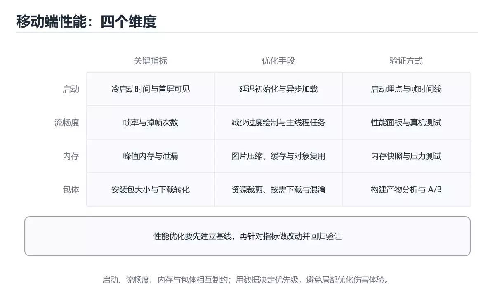

# 移动端性能优化实战




> 内容更新时间：2026-10-03 · 学习阶段：进阶 · 预计用时：18 分钟

## 学习目标

- 能用自己的话解释「移动端性能优化实战」解决了什么问题，而不是只背术语。
- 能说清 「性能优化」、「冷启动」、「卡顿」、「内存」 之间的关系，并分别举出一个例子。
- 能把本课知识放回「移动开发」的知识体系，说明它和相邻主题的边界。
- 能完成本课练习，并用验收标准检查自己的结果。

> 一句话摘要：启动、流畅度、内存与包体四个维度的指标与优化手段。

## 前置知识

- 先完成上一课《小程序开发要点》；如果已经掌握，可以直接用本课练习自测。
- 本课阶段：进阶。建议先掌握同一分类的基础课程，并能独立运行正文中的最小示例。
- 开始前先复习：性能优化、冷启动、卡顿。
- 如果某一步看不懂，先记录具体卡点，完成练习后再回头读一遍。


## 四个核心维度速查

| 维度 | 关键指标 | 良好目标 | 主要手段 |
| --- | --- | --- | --- |
| 启动 | 冷启动耗时、首帧时间 | 冷启动小于 2 秒 | 延迟初始化、启动图、精简主包 |
| 流畅度 | 卡顿率、掉帧率、帧时间 | 掉帧小于 1%，帧时间小于 16.7ms | 减少主线程工作、异步化 |
| 内存 | 峰值内存、OOM 率 | 无 OOM，峰值稳定 | 图片复用、及时释放、避免泄漏 |
| 包体 | 下载体积、安装体积 | 视商店要求 | 资源压缩、按需下发、ABI 拆分 |

## 启动优化速查

| 阶段 | 常见耗时来源 | 手段 |
| --- | --- | --- |
| 进程创建 | 系统开销 | 无法优化，只能减少依赖 |
| 应用初始化 | 三方 SDK 同步初始化 | 改懒加载、并行初始化 |
| 首屏渲染 | 布局层级过深、图片阻塞 | 简化布局、占位图、异步解码 |
| 首页数据 | 串行请求 | 并行请求、本地缓存先展示 |

原则：**启动路径上只保留「首屏必须」的初始化**，其余延后到首屏之后或空闲时执行。

```kotlin
// 启动路径只做必需初始化，其余交给空闲任务
override fun onCreate() {
    super.onCreate()
    initCrashReporter()          // 崩溃上报必须在最前
    initLogger()
    scheduleIdleInit()           // 统计、推送、AB 实验等延后
}

// 图片按目标尺寸降采样，避免整张原图进内存
fun decodeSampled(path: String, reqW: Int, reqH: Int): Bitmap? {
    val bounds = BitmapFactory.Options().apply { inJustDecodeBounds = true }
    BitmapFactory.decodeFile(path, bounds)
    var sample = 1
    while (bounds.outWidth / sample > reqW * 2 && bounds.outHeight / sample > reqH * 2) {
        sample *= 2
    }
    val options = BitmapFactory.Options().apply { inSampleSize = sample }
    return BitmapFactory.decodeFile(path, options)
}
```

## 卡顿排查速查

| 现象 | 常见原因 | 验证方式 |
| --- | --- | --- |
| 列表滚动掉帧 | 主线程做 IO、布局过深、图片解码 | 帧率面板加主线程耗时追踪 |
| 点击无响应 | 主线程长任务 | 主线程堆栈采样 |
| 页面切换慢 | 同步初始化大量对象 | 页面启动耗时打点 |
| 偶发卡顿 | GC 抖动或锁竞争 | 内存与线程监控 |
| 首帧后卡顿 | 首屏后立刻做重活 | 移到空闲队列 |

## 内存与包体速查

| 问题 | 手段 |
| --- | --- |
| 内存泄漏 | 生命周期解绑、避免静态持有 Context 或 View |
| 图片内存 | 按需尺寸解码、LRU 内存缓存、复用 Bitmap |
| 频繁 GC | 减少临时对象、避免循环内分配、使用对象池 |
| 包体过大 | 图片转 WebP 或 AVIF、去除未用资源、按 ABI 拆包、动态下发 |
| 资源重复 | 统一资源管理，避免同一图多份 |

## 监控与度量速查

| 指标 | 采集方式 | 用途 |
| --- | --- | --- |
| 冷启动耗时 | 进程创建到首帧打点 | 版本回归对比 |
| 卡顿率 | 帧监控按设备分档 | 定位低端机问题 |
| 峰值内存 | 内存采样与分位统计 | 发现异常增长 |
| 崩溃率 | 崩溃上报 | 发布门禁 |
| 页面耗时 | 页面级打点 | 定位慢页面 |
| 网络耗时 | 请求分段计时 | 区分服务端与网络问题 |

注意：所有指标都要**分设备档位与系统版本**看，只看平均值会掩盖低端机的真实问题。

## 常见错误对照表

| 容易踩的做法 | 实际现象 | 原因与正确做法 |
| --- | --- | --- |
| 在启动时初始化所有 SDK | 冷启动显著变慢 | 只保留必需项，其余懒加载 |
| 用平均值判断性能 | 低端机问题被掩盖 | 分设备档位看 P95 |
| 主线程做网络或文件 IO | 界面卡死甚至 ANR | 全部移到后台线程 |
| 图片按原图解码 | 内存暴涨、OOM | 按目标尺寸降采样 |
| 只优化一次不回归 | 版本迭代后劣化 | 建性能基线并纳入 CI |
| 用模拟器测性能 | 数据与真机差异大 | 真机分档测试 |
| 忽略后台与弱网场景 | 用户真实体验差 | 覆盖切后台、弱网、低电量 |

## 自测清单

- [ ] 能从启动、流畅度、内存、包体四个维度建立指标。
- [ ] 启动路径只保留首屏必需初始化。
- [ ] 图片按目标尺寸解码并做内存缓存。
- [ ] 性能指标分设备档位统计并设基线。
- [ ] 性能回归纳入发布前检查。


## 零基础详解：移动端性能优化

### 一句话说清它是什么

移动端性能只看三件事：**启动要快、滑动要顺、耗电要少**。
再加上两条底线：**不崩、不占爆内存**。所有优化都围绕「测量 → 定位 → 改一处 → 复测」。

### 用生活比喻理解

| 指标 | 比喻 | 用户感受 |
| --- | --- | --- |
| 启动时间 | 开门速度 | 等久了就退出 |
| 帧率 | 翻页流畅度 | 掉帧就是卡顿 |
| 内存 | 桌面空间 | 不够就杀后台 |
| 包体积 | 行李箱重量 | 太重就不愿下载 |
| 耗电 | 手机发热 | 费电就被卸载 |

### 五个核心指标与参考值

| 指标 | 定义 | 参考目标 |
| --- | --- | --- |
| 冷启动 | 进程从零到首帧 | 控制在 1 秒内（越高越好） |
| 帧率 | 每秒绘制帧数 | 60fps 机型稳定不掉帧 |
| 卡顿率 | 超过 16.7ms 的帧占比 | 越低越好 |
| 内存峰值 | 前台占用峰值 | 避免被系统杀进程 |
| 崩溃率 | 崩溃会话占比 | 低于 0.1% |

**Android 看 Perfetto、Android Studio Profiler；iOS 看 Instruments（Time Profiler、Allocations）；跨端再加一个端内埋点统计。**

### 启动优化：先看三段耗时

```text
1. 进程创建 → Application.onCreate：主要看 SDK 初始化
2. Activity 或 UIAbility 创建 → 首帧绘制：主要看布局复杂度
3. 首帧之后 → 可交互：主要看数据加载与网络请求
```

| 常见问题 | 对策 |
| --- | --- |
| 启动时初始化大量 SDK | 延迟到用的时候再初始化 |
| 同步读数据库或文件 | 移到后台线程，先展示骨架屏 |
| 首屏布局层级过深 | 减少嵌套，用约束布局或 Compose |
| 首页请求阻塞渲染 | 先渲染骨架，数据到了再填 |
| 启动时加载大图 | 用合适分辨率或占位图 |

```kotlin
// Android：把非关键初始化延后
class App : Application() {
    override fun onCreate() {
        super.onCreate()
        initCrashReporter()                 // 必须最早
        // 其余 SDK 延后到首帧之后
        ProcessLifecycleOwner.get().lifecycleScope.launch {
            delay(1_000)
            initAnalytics()
            initPushService()
        }
    }
}
```

### 渲染优化：掉帧的四个原因

| 原因 | 现象 | 对策 |
| --- | --- | --- |
| 主线程耗时 | 计算或 IO 阻塞 | 移到后台线程 |
| 布局层级过深 | 每次测量都很慢 | 扁平化、用约束 |
| 过度绘制 | 同一像素画多次 | 减少背景叠加 |
| 频繁创建对象 | GC 引发卡顿 | 复用、预分配 |

```kotlin
// 列表项复用 + 只更新变化部分
class ItemAdapter : ListAdapter<Item, VH>(DIFF) {
    companion object {
        private val DIFF = object : DiffUtil.ItemCallback<Item>() {
            override fun areItemsTheSame(a: Item, b: Item) = a.id == b.id
            override fun areContentsTheSame(a: Item, b: Item) = a == b
        }
    }
}
```

**用「只更新变化项」代替 `notifyDataSetChanged()`**，是列表流畅度的第一大功臣。

### 内存优化：三条纪律

```text
1. 及时释放：监听器、订阅、Bitmap、Cursor 都要在生命周期结束时清理
2. 避免泄漏：长生命周期对象不能持有 Activity 或 View
3. 控制峰值：大图按需降采样，列表用分页加载
```

```kotlin
// 泄漏的典型与修复
object Singleton {
    var activity: Activity? = null       // 错误：静态持有 Activity
}

class Screen : Fragment() {
    private val observer = Observer<Data> { render(it) }
    override fun onStart() { super.onStart(); store.observe(observer) }
    override fun onStop() { store.removeObserver(observer); super.onStop() }
}
```

**检测方式**：Android Studio Memory Profiler 抓堆快照，找「本该被回收却还在」的对象。

### 包体积优化

| 手段 | 效果 |
| --- | --- |
| 开启代码与资源压缩 | 去掉未使用代码与资源 |
| 按 ABI 拆分 | 用户只下载对应架构 |
| 图片转 WebP | 体积显著下降 |
| 移除未使用语言资源 | 减少资源体积 |
| 大资源走 CDN | 不占安装包 |

```bash
# Android 查看体积构成
./gradlew :app:analyzeReleaseBundle
```

### 网络与电量优化

| 原则 | 做法 |
| --- | --- |
| 减少请求数 | 合并接口、批量查询 |
| 减少数据量 | 只请求需要的字段 |
| 合理缓存 | 内存 + 磁盘两层，设过期时间 |
| 避免轮询 | 用推送或长连接 |
| 批量上报埋点 | 攒批后一次发送 |
| 后台任务延迟 | 用系统的延迟队列 |

### 监控：没有数据就没有优化

```text
必须采集的指标：
  · 冷启动耗时（分位数，不只看平均）
  · 卡顿与掉帧率
  · 内存峰值与 OOM 次数
  · 崩溃与 ANR 率
  · 关键页面加载耗时
```

**看 P95、P99 而不是平均值**：平均值会把最差的那部分用户体验完全掩盖。

### 新手最容易踩的八个坑

| 坑 | 现象 | 正确做法 |
| --- | --- | --- |
| 凭感觉优化 | 改了没效果 | 先测量再改 |
| 只看平均值 | 长尾用户仍卡 | 看 P95 与 P99 |
| 在主线程做 IO | 掉帧、ANR | 移到后台线程 |
| 列表用 notifyDataSetChanged | 整表重建 | 用 DiffUtil |
| 大图不降采样 | 内存暴涨 | 按显示尺寸解码 |
| 监听器不注销 | 内存泄漏 | 生命周期配对注销 |
| 只优化 Release | 掩盖问题 | Debug 与 Release 都测 |
| 只在高端机测 | 低端机卡顿 | 用低端设备或限频测试 |

### 学完自测

- [ ] 能说出启动的三个阶段各自优化什么。
- [ ] 能说出掉帧的四个常见原因。
- [ ] 知道内存泄漏最典型的一类成因。
- [ ] 能说出三条减包体积的手段。
- [ ] 知道为什么性能指标要看分位数。

## 动手练习


> 本课练习重点：围绕「性能优化、冷启动、卡顿」完成复述、实验和交付，每个结果都要能被别人检查。

先做一个最小 Widget，再切换状态与约束，最后在窄屏和深色模式下验证布局。

### 练习 1：建立心智模型（10 分钟）

合上教程，用 3～5 句话回答：

1. 「移动端性能优化实战」解决了什么问题？
2. 如果没有它，会出现什么具体后果？
3. 它和「冷启动」是什么关系？

**验收标准**：至少出现一个本课关键词，并写出一个反例、边界条件或失效场景。

### 练习 2：做一次可控实验（20 分钟）

从正文中选一个最小示例，完成以下操作：

1. 先预测修改一个参数、输入或步骤后的结果。
2. 再实际执行或逐步推演，记录真实结果。
3. 如果结果与预测不同，写出差异原因。

**验收标准**：留下「原例 → 改动 → 预测 → 结果 → 原因」五步记录。

### 练习 3：交付一个小结果（30 分钟）

创建一个最小 Widget，分别验证正常输入、空数据和超长文本三种状态。

任务要求：

- 结果必须能被别人检查，不能只写“我已经理解了”。
- 至少覆盖「性能优化」和「冷启动」两个关键词。
- 写出 1 个仍然不确定的问题，以及下一步如何验证。

> 提示：时间有限时优先做练习 1 和练习 2；练习 3 可以拆成两次完成。

## 本课小结

- 核心问题：「移动端性能优化实战」不是孤立术语，而是在「移动开发」中解决一类具体问题。
- 关键关系：先分清「性能优化」与「冷启动」的职责，再理解「卡顿」的适用边界。
- 判断标准：能解释正常场景、边界条件和失败场景，才算真正掌握。
- 下一步：完成练习后，用自己的话写下 3 条要点，再去做本课测验。


## 验证命令与预期输出

项目代码不能只看“能编译”，还要能按固定命令复现结果。下表给出最低验证集：

| 阶段 | 命令 | 预期输出 |
| --- | --- | --- |
| 静态检查 | `flutter analyze` | 无分析问题 |
| 运行测试 | `flutter test` | 测试全部通过 |
| 构建 | `flutter build apk --release` | 成功生成 APK |

### 验收证据

- [ ] 保存依赖安装和启动命令的完整输出。
- [ ] 至少运行 3 条测试，其中包含一条非法输入或失败路径。
- [ ] 重复执行同一操作两次，确认没有重复写入或副作用。
- [ ] 记录一次失败状态码、错误日志和恢复步骤。
- [ ] 在 README 中写明环境版本、启动方式和回滚方式。

### 回归与回滚

1. 先在一个可丢弃的目录或临时数据库执行，避免污染真实数据。
2. 修改一处逻辑后重跑全部验证命令，确认没有回归。
3. 若失败，回滚到上一个可运行版本并保留失败日志。
4. 定位原因后补一条自动化测试，再重新执行发布流程。
5. 把教训写入项目复盘或本课笔记，形成下一次的检查项。


## 考点精讲：把测验题还原成判断过程

本课有 6 个判断点。先自己作答，再看「判断依据」；如果结论正确但理由不完整，回到正文对应章节补足概念。

### 考点 1：优化冷启动最有效的原则是？

- **正确判断**：启动路径只保留首屏必需的初始化
- **判断依据**：正确答案是「启动路径只保留首屏必需的初始化」，本课在「启动优化速查」中说明：原则：启动路径上只保留「首屏必须」的初始化，其余延后到首屏之后或空闲时执行。冷启动时间主要由进程创建与初始化决定，把非必需 SDK 延迟到空闲时执行收益最大。本课还在「零基础详解：移动端性能优化」中说明：移动端性能只看三件事：启动要快、滑动要顺、耗电要少。本课还在「项目专属规格：移动端性能优化实战」中说明：启动、流畅度、内存与包体四个维度的指标与优化手段。
- **迁移检查**：把题干里的一个条件换成边界值，原来的结论还成立吗？写出判断过程。

### 考点 2：判断性能问题只看平均值会有什么后果？

- **正确判断**：低端机与长尾问题被掩盖
- **判断依据**：正确答案是「低端机与长尾问题被掩盖」，本课在「监控与度量速查」中说明：注意：所有指标都要分设备档位与系统版本看，只看平均值会掩盖低端机的真实问题。平均值会被高端机数据拉低，必须按设备档位看 P95/P99 才能发现真实体感问题。本课还在「零基础详解：移动端性能优化」中说明：移动端性能只看三件事：启动要快、滑动要顺、耗电要少。本课还在「零基础详解：移动端性能优化」中说明：看 P95、P99 而不是平均值：平均值会把最差的那部分用户体验完全掩盖。
- **迁移检查**：把题干里的一个条件换成边界值，原来的结论还成立吗？写出判断过程。

### 考点 3：图片导致内存暴涨，最常见的直接原因是？

- **正确判断**：按原图尺寸解码并整张读入内存
- **判断依据**：正确答案是「按原图尺寸解码并整张读入内存」，本课在「项目专属规格：移动端性能优化实战」中说明：启动、流畅度、内存与包体四个维度的指标与优化手段。位图内存与像素数成正比，4000×3000 的图解码后可能占用几十 MB，必须按目标显示尺寸降采样。本课还在「零基础详解：移动端性能优化」中说明：所有优化都围绕「测量 → 定位 → 改一处 → 复测」。
- **迁移检查**：把题干里的一个条件换成边界值，原来的结论还成立吗？写出判断过程。

### 考点 4：主线程做文件或网络 IO 的直接后果是？

- **正确判断**：界面卡顿甚至 ANR
- **判断依据**：正确答案是「界面卡顿甚至 ANR」，本课在「零基础详解：移动端性能优化」中说明：Android 看 Perfetto、Android Studio Profiler。主线程负责渲染与输入响应，任何阻塞都会直接表现为掉帧或无响应（Android 超时即 ANR）。本课还在「零基础详解：移动端性能优化」中说明：iOS 看 Instruments（Time Profiler、Allocations）。本课还在「零基础详解：移动端性能优化」中说明：检测方式：Android Studio Memory Profiler 抓堆快照，找「本该被回收却还在」的对象。
- **迁移检查**：如果给某个错误选项去掉一个限定词，它会不会变成正确？说明理由。

### 考点 5：为了避免版本迭代后性能劣化，应该怎么做？

- **正确判断**：建立性能基线并纳入持续集成与发布检查
- **判断依据**：正确答案是「建立性能基线并纳入持续集成与发布检查」，这道题在问为了避免版本迭代后性能劣化，应该怎么做，判断时要把题干限定的输入、边界与目标逐项对齐。性能需要像功能一样防回归：固定基线、自动采集、超阈值阻断发布。课程摘要指出启动，流畅度，内存与包体四个维度的指标与优化手段，本课要判断的正是为了避免版本迭代后性能劣化，应该怎么做。
- **迁移检查**：遮住选项，只根据定义复述一次答案，再回来看哪个选项与复述一致。

### 考点 6：补全代码：「移动端性能优化实战」示例中，下面这行代码缺少哪个关键字或函数名？请填入 ____。 `"project": "____",`

- **正确判断**：mobile_performance
- **判断依据**：正确答案是「mobile_performance」，这道题在问补全代码：移动端性能优化实战示例中，下面这行代码缺少…，`"project":"____",`，判断时要把题干限定的输入、边界与目标逐项对齐。"project": "", 限定的语境来判断。
- **迁移检查**：不看题干，用自己的话补全这句话，再与标准答案对照。

## 本课复习清单

离开本课前，逐项确认：

- [ ] 不看解析，能说出「优化冷启动最有效的原则是？」的判断依据。
- [ ] 不看解析，能说出「判断性能问题只看平均值会有什么后果？」的判断依据。
- [ ] 不看解析，能说出「图片导致内存暴涨，最常见的直接原因是？」的判断依据。
- [ ] 不看解析，能说出「主线程做文件或网络 IO 的直接后果是？」的判断依据。
- [ ] 不看解析，能说出「为了避免版本迭代后性能劣化，应该怎么做？」的判断依据。
- [ ] 不看解析，能说出「补全代码：「移动端性能优化实战」示例中，下面这行代码缺少哪个关键字或函数名？请填…」的判断依据。
- [ ] 至少运行一次本课示例，记录输入、输出和一个边界情况。
- [ ] 把本课最容易混淆的两个概念写成一句话对照。

| 复盘项 | 记录 |
| --- | --- |
| 已经能独立解释的考点 |  |
| 仍然说不清的概念 |  |
| 下一步验证动作 |  |

## 术语速查

把本课反复出现的术语集中放在一起。复习时先遮住右列，尝试用自己的话解释，再回到正文核对。

| 术语 | 本课语境 |
| --- | --- |
| `notifyDataSetChanged()` | 用「只更新变化项」代替 `notifyDataSetChanged()`**，是列表流畅度的第一大功臣。 |
| `flutter analyze` | \| 静态检查 \| `flutter analyze` \| 无分析问题 \| |
| `flutter test` | \| 运行测试 \| `flutter test` \| 测试全部通过 \| |
| `flutter build apk --release` | \| 构建 \| `flutter build apk --release` \| 成功生成 APK \| |
| `"project":"____",` | 判断依据**：正确答案是「mobile_performance」，这道题在问补全代码：移动端性能优化实战示例中，下面这行代码缺少…，`"project":"____",`，判断时要把题干限定的输入、边界与目标逐项对齐。"… |

## 面试问答与自测

下面把本课考点换成面试追问。先口述自己的答案，
再对照参考回答检查是否遗漏了前提、边界或失败路径。

### 追问 1：优化冷启动最有效的原则是？

**参考回答**：正确答案是「启动路径只保留首屏必需的初始化」，本课在「启动优化速查」中说明：原则：启动路径上只保留「首屏必须」的初始化，其余延后到首屏之后或空闲时执行。冷启动时间主要由进程创建与初始化决定，把非必需 SDK 延迟到空闲时执行收益最大。本课还在「零基础详解·移动端性能优化」中说明：移动端性能只看三件事：启动要快、滑动要顺、耗电要少。本课还在「项目专属规格·移动端性能优化实战」中说明：启动、流畅度、内存与包体四个维度的指标与优化手段。

### 追问 2：判断性能问题只看平均值会有什么后果？

**参考回答**：正确答案是「低端机与长尾问题被掩盖」，本课在「监控与度量速查」中说明：注意：所有指标都要分设备档位与系统版本看，只看平均值会掩盖低端机的真实问题。平均值会被高端机数据拉低，必须按设备档位看 P95/P99 才能发现真实体感问题。本课还在「零基础详解·移动端性能优化」中说明：移动端性能只看三件事：启动要快、滑动要顺、耗电要少。本课还在「零基础详解·移动端性能优化」中说明：看 P95、P99 而不是平均值：平均值会把最差的那部分用户体验完全掩盖。

### 追问 3：图片导致内存暴涨，最常见的直接原因是？

**参考回答**：正确答案是「按原图尺寸解码并整张读入内存」，本课在「项目专属规格·移动端性能优化实战」中说明：启动、流畅度、内存与包体四个维度的指标与优化手段。位图内存与像素数成正比，4000×3000 的图解码后可能占用几十 MB，必须按目标显示尺寸降采样。本课还在「零基础详解·移动端性能优化」中说明：所有优化都围绕「测量 → 定位 → 改一处 → 复测」。

### 追问 4：主线程做文件或网络 IO 的直接后果是？

**参考回答**：正确答案是「界面卡顿甚至 ANR」，本课在「零基础详解·移动端性能优化」中说明：Android 看 Perfetto、Android Studio Profiler。主线程负责渲染与输入响应，任何阻塞都会直接表现为掉帧或无响应（Android 超时即 ANR）。本课还在「零基础详解·移动端性能优化」中说明：iOS 看 Instruments（Time Profiler、Allocations）。本课还在「零基础详解·移动端性能优化」中说明：检测方式：Android Studio Memory Profiler 抓堆快照，找「本该被回收却还在」的对象。

### 追问 5：为了避免版本迭代后性能劣化，应该怎么做？

**参考回答**：正确答案是「建立性能基线并纳入持续集成与发布检查」，这道题在问为了避免版本迭代后性能劣化，应该怎么做，判断时要把题干限定的输入、边界与目标逐项对齐。性能需要像功能一样防回归：固定基线、自动采集、超阈值阻断发布。课程摘要指出启动，流畅度，内存与包体四个维度的指标与优化手段，本课要判断的正是为了避免版本迭代后性能劣化，应该怎么做。

## English Overview

**Title:** Mobile Performance

**Summary:** Startup, smoothness, memory and app size optimization.

**Category:** Mobile Development  
**Level:** 进阶  
**Key terms:** 性能优化, 冷启动, 卡顿, 内存, 包体

> The full tutorial is written in Chinese. This bilingual overview helps English readers identify the topic, scope and key terms before studying the detailed examples.

## 内容元数据

- 内容版本：v2.0
- 最后更新：2026-10-03
- 学习阶段：进阶
- 适用环境：Flutter 3.x / Dart 3.x
- 内容来源：内置结构化课程与工程实践整理
- 相关主题：性能优化、冷启动、卡顿、内存、包体
- 质量版本：P0 测验标准 + P1 覆盖扩展 + P2 体验补全

## 项目专属规格：移动端性能优化实战

### 核心场景

启动、流畅度、内存与包体四个维度的指标与优化手段。 项目目标是把「性能优化、冷启动、卡顿、内存、包体」落实为可运行、可测试、可回滚的交付物。

### 架构与数据流

```text
用户/输入 → 接口或命令 → 领域逻辑 → 存储/外部依赖 → 输出与监控
                         ↘ 失败分类 → 重试/补偿 → 回滚
```

### 最小数据模型

| 对象 | 关键字段 | 约束 |
| --- | --- | --- |
| 输入实体 | 性能优化、时间、来源 | 必填校验、长度限制、幂等键 |
| 任务实体 | 状态、优先级、创建时间 | 状态迁移合法、不可重复执行 |
| 结果实体 | 输出、错误码、耗时 | 可序列化、错误可解释 |
| 审计记录 | 操作者、动作、结果、时间 | 不可篡改、可查询、脱敏 |

### 验收场景

1. 正常路径：最小输入得到预期输出，并留下日志与指标。
2. 边界路径：空值、最大值、重复数据和超长内容得到明确处理。
3. 失败路径：依赖超时或不可用时能快速失败、重试或降级。
4. 幂等路径：同一请求执行两次不会产生重复副作用。
5. 回滚路径：回滚后数据一致，且能说明恢复时间和影响范围。


## 项目交付物

### 建议仓库结构

```text
lib/
  models/
  screens/
  services/
test/
pubspec.yaml
```

### 测试矩阵

| 层级 | 覆盖内容 | 最低数量 | 通过标准 |
| --- | --- | ---: | --- |
| 单元测试 | 领域规则、边界和错误分类 | 8 | 正常、边界、失败路径全部通过 |
| 集成测试 | 数据库、网络、文件或平台边界 | 3 | 使用真实边界且可重复运行 |
| 端到端测试 | 核心用户路径 | 1 | 从输入到输出完整跑通 |
| 手动验收 | 文档中列出的 5 个场景 | 5 | 有命令、输出和结论记录 |

### 验收数据

```json
{
  "project": "mobile_performance",
  "input": {"case": "normal", "value": 5},
  "expected": {"ok": true, "result": 5},
  "failure_case": {"value": -1, "error": "validation_error"},
  "idempotency_key": "demo-001"
}
```

### 复盘模板

| 问题 | 记录 |
| --- | --- |
| 原目标是什么？ | 用一句话描述可验收目标 |
| 实际发生了什么？ | 时间线、指标和关键日志 |
| 哪个假设被推翻？ | 根因与促成因素 |
| 如何回滚？ | 步骤、耗时和数据校验 |
| 下一步做什么？ | 负责人、期限和验证方式 |

> 项目验收围绕「性能优化、冷启动、卡顿」：至少完成一次正常路径、一次边界输入、一次失败恢复和一次幂等检查。


## 参考资料与复核

- 最后复核：2026-10-04
- 下次复核：2027-04-04
- 复核范围：版本兼容、API 行为、安全建议与工程实践
- 来源性质：官方文档与标准；本课正文为离线教学重组，不复制原文

| 参考资料 | 本课用途 |
| --- | --- |
| [Flutter 官方文档](https://docs.flutter.dev/) | 框架、组件与发布流程 |
| [Dart 官方文档](https://dart.dev/guides) | 语言、异步与工具链 |

> 本课主题：启动、流畅度、内存与包体四个维度的指标与优化手段。

> App 完全离线展示文字链接，不会自动联网；需要延伸阅读时可复制链接到浏览器。
