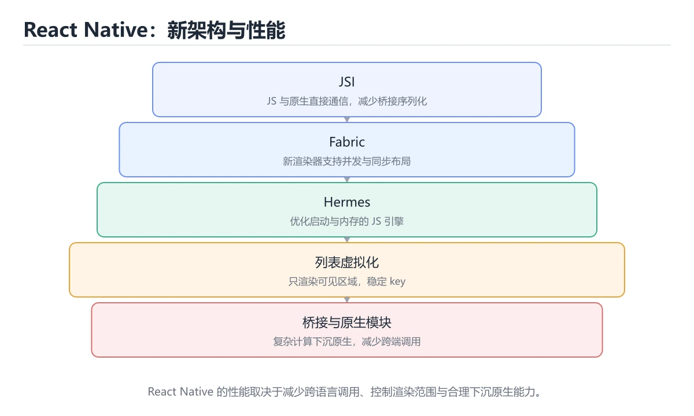

# React Native 跨平台开发

> 内容更新时间：2026-10-06 · 学习阶段：进阶 · 预计用时：50 分钟




## 本节知识框架

**课程定位**：所属分类 `flutter`（移动开发），课程主题 `React Native 跨平台开发`，学习阶段 进阶，建议用时 45 分钟。

本课主线：新架构 JSI/Fabric/Hermes、列表虚拟化与桥接性能优化。

**学完本课应当能够**
- 说清 `Hooks` 与 `原生模块` 的含义与区别，并各举一个正例和一个反例。
- 用本课示例验证 `桥接` 的行为，记录输入、输出与失败条件。
- 遇到「`useEffect` 缺依赖」这类问题时，能说出触发条件与修复顺序。

### 从概念到验证的学习链条

1. `Hooks`：先掌握 React 函数组件里管理状态与副作用的 API（useState、useEffect 等），依赖数组写错是常见 bug 来源，再用它解释 `原生模块` 为什么会出现。
2. `原生模块`：先掌握 用平台原生代码封装能力并暴露给 JavaScript 调用，用来抹平权限、组件与 API 差异，再用它解释 `桥接` 为什么会出现。
3. `桥接`：先掌握 JavaScript 与原生之间传递调用与数据的通道，跨线程通信是性能开销的主要来源，再用它解释 `平台差异` 为什么会出现。
4. `平台差异`：先掌握 iOS 与 Android 在组件、权限、手势上的不一致，需要用 Platform 判断或平台后缀文件分别处理，再用它解释 本课示例的观察结果 为什么会出现。

**先修与衔接**：本课是「移动开发」分类的第 9 课。先修内容：《Swift 与 iOS 开发》。《Swift 与 iOS 开发》里的 `Swift`、`SwiftUI` 是本课的前提。相关或后续课程：《Jetpack Compose 声明式 UI》。

### 完成判据

- **定义关**：不看正文也能说明 `Hooks` 是 React 函数组件里管理状态与副作用的 API（useState、useEffect 等），依赖数组写错是常见 bug 来源，并指出一个反例。
- **机制关**：能按“输入 → 转换 → 输出 → 验证”复述 `React Native 跨平台开发`，而不是只背结论。
- **示例关**：能运行或推演 `React Native 跨平台开发` 的 `tsx` 示例，并说明一个真实出现的标识符或字面量。
- **证据关**：能指出 `React Native 跨平台开发` 示例里的 调用了 `LessonList()`，并说明它支持或反驳了本课的哪一条结论。
- **排错关**：能复现 `useEffect` 缺依赖，记录现象并按 把依赖写全，或用函数式更新 修复。
- **迁移关**：能把 `React Native`、`跨平台`、`Hermes`、`Fabric` 放进一个与 `React Native 跨平台开发` 不同的项目场景，并保持输入与验证条件可追踪。
- **复盘关**：学完 `React Native 跨平台开发` 后，用一句话写下仍然不确定的结论，并列出下一次验证需要的输入、环境和成功判据。

### 复习清单

- [ ] 能不看正文复述本课核心术语，并指出一个边界或反例。
- [ ] 能运行或推演本课示例，记录输入、输出与失败现象。
- [ ] 能完成一次自测，并把错题对照错误表定位原因。

## 核心概念定义

| 术语 | 操作性定义 | 常见边界与风险 |
| --- | --- | --- |
| Hooks | React 函数组件里管理状态与副作用的 API（useState、useEffect 等），依赖数组写错是常见 bug 来源。 | 不同版本与依赖组合的行为可能不同，升级或换环境前要按官方变更说明重新验证。 |
| 原生模块 | 用平台原生代码封装能力并暴露给 JavaScript 调用，用来抹平权限、组件与 API 差异。 | 易错：动画与交互卡顿；正确做法是移到原生模块或 Worker。 |
| 桥接 | JavaScript 与原生之间传递调用与数据的通道，跨线程通信是性能开销的主要来源。 | 共享状态与调度顺序会改变结论，单线程或串行测试通过不等于并发下成立。 |
| 平台差异 | iOS 与 Android 在组件、权限、手势上的不一致，需要用 Platform 判断或平台后缀文件分别处理。 | 隔离级别与并发事务会影响可见性，换级别或换存储引擎后要重新验证。 |

## 原理与运行机制

### 机制总览

**教材衔接：定位与原理**

React Native（RN）用 JavaScript/TypeScript 写业务，通过桥接调用原生组件渲染真实原生控件，而不是 WebView。它的价值是「一套业务代码 + 两种原生体验」，代价是需要理解 JS 线程与原生线程的通信边界。

| 方案 | 渲染方式 | 性能 | 生态 |
| --- | --- | --- | --- |
| React Native | 原生组件 | 接近原生 | JS 生态庞大 |
| Flutter | 自绘引擎 | 稳定高帧率 | Dart 生态 |
| WebView 混合 | 网页 | 较差 | 前端复用 |
| 原生开发 | 平台控件 | 最好 | 两套代码 |

**教材衔接：架构速查（新架构）**

| 组成 | 作用 |
| --- | --- |
| JSI | 让 JS 直接调用 C++ 层，替代异步桥接 |
| Fabric | 新渲染器，支持同步布局与并发渲染 |
| TurboModules | 按需加载原生模块 |
| Hermes | 默认 JS 引擎，启动更快、内存更低 |
| Codegen | 由类型定义生成桥接代码 |

### 机制拆解：每一步的输入、动作与输出

#### 1. `Hooks`
- 输入：`React Native`；本步把 React 函数组件里管理状态与副作用的 API（useState、useEffect 等），依赖数组写错是常见 bug 来源 当作判断规则。
- 动作：围绕 `Hooks` 保留中间状态，并记录它与 `原生模块` 的对应关系。
- 输出：`原生模块`，它可以被下一段代码、测试或记录继续使用。
- `Hooks` 的失败条件：不同版本与依赖组合的行为可能不同，升级或换环境前要按官方变更说明重新验证。

#### 2. `原生模块`
- 输入：`Hooks`；本步把 用平台原生代码封装能力并暴露给 JavaScript 调用，用来抹平权限、组件与 API 差异 当作判断规则。
- 动作：围绕 `原生模块` 保留中间状态，并记录它与 `桥接` 的对应关系。
- 输出：`桥接`，它可以被下一段代码、测试或记录继续使用。
- `原生模块` 的失败条件：当在 JS 线程做重计算时，会出现动画与交互卡顿。

#### 3. `桥接`
- 输入：`原生模块`；本步把 JavaScript 与原生之间传递调用与数据的通道，跨线程通信是性能开销的主要来源 当作判断规则。
- 动作：围绕 `桥接` 保留中间状态，并记录它与 `平台差异` 的对应关系。
- 输出：`平台差异`，它可以被下一段代码、测试或记录继续使用。
- `桥接` 的失败条件：共享状态与调度顺序会改变结论，单线程或串行测试通过不等于并发下成立。

#### 4. `平台差异`
- 输入：`桥接`；本步把 iOS 与 Android 在组件、权限、手势上的不一致，需要用 Platform 判断或平台后缀文件分别处理 当作判断规则。
- 动作：围绕 `平台差异` 保留中间状态，并记录它与 `LessonList` 的对应关系。
- 输出：`LessonList`，它可以被下一段代码、测试或记录继续使用。
- `平台差异` 的失败条件：隔离级别与并发事务会影响可见性，换级别或换存储引擎后要重新验证。

### 示例中的可观察事实

1. 调用了 `LessonList()`；它对应的课程主题是 `React Native 跨平台开发`。
2. 调用了 `create()`；它对应的课程主题是 `React Native 跨平台开发`。
3. 出现字面量 `react`；它对应的课程主题是 `React Native 跨平台开发`。
4. 出现字面量 `react-native`；它对应的课程主题是 `React Native 跨平台开发`。
5. 出现字面量 `#fff`；它对应的课程主题是 `React Native 跨平台开发`。
6. 出现字面量 `600`；它对应的课程主题是 `React Native 跨平台开发`。
7. 出现字面量 `#64748b`；它对应的课程主题是 `React Native 跨平台开发`。
8. 调用了 `ItemListScreen()`；它对应的课程主题是 `React Native 跨平台开发`。

### 复现实验记录

- 环境：`React Native 跨平台开发` 使用 `tsx` 示例，固定 `React Native`、`跨平台`、`Hermes`、`Fabric` 作为第一组条件。
- 首轮输入：先确认 调用了 `LessonList()`，预测 `Hooks` 会怎样变化。
- 基线观察：记录命令、输入、输出和错误原文，不用截图代替可复制的文本。
- 单变量修改：只改变 `React Native`，观察 `平台差异` 是否仍满足定义。
- 失败注入：复现 `useEffect` 缺依赖，确认现象是 用到旧值。
- 记录结论：把“修改前、修改后、预期变化、实际变化”写成四列表，这样复盘 `React Native 跨平台开发` 时才能区分概念错误与实现错误。

## 典型应用场景

- **`useEffect` 缺依赖**：典型现象是用到旧值；正确做法是把依赖写全，或用函数式更新。
- **每次渲染新建函数**：典型现象是子组件无谓重建；正确做法是用 `useCallback`。
- **每次渲染新建对象**：典型现象是`memo` 失效；正确做法是用 `useMemo`。
- **组件卸载后 setState**：典型现象是警告或异常；正确做法是用标志位或取消请求。

### 最小验证场景

- 准备：保留 `tsx` 示例的原始输入，先记录 `React Native 跨平台开发` 的基线输出和完整运行命令。
- 观察：先核对 调用了 `LessonList()`，再改变一个与 `Hooks` 相关的条件。
- 判定：新结果与 `React Native 跨平台开发` 的基线不同不等于错误；只有当差异破坏了 `Hooks` 的定义或错误表中的约束，才判定为失败。

### 选择与边界

- 使用 `Hooks` 时，先满足它的定义：React 函数组件里管理状态与副作用的 API（useState、useEffect 等），依赖数组写错是常见 bug 来源；不同版本与依赖组合的行为可能不同，升级或换环境前要按官方变更说明重新验证。
- 使用 `原生模块` 时，先满足它的定义：用平台原生代码封装能力并暴露给 JavaScript 调用，用来抹平权限、组件与 API 差异；易错：动画与交互卡顿；正确做法是移到原生模块或 Worker。
- 使用 `桥接` 时，先满足它的定义：JavaScript 与原生之间传递调用与数据的通道，跨线程通信是性能开销的主要来源；共享状态与调度顺序会改变结论，单线程或串行测试通过不等于并发下成立。
- 使用 `平台差异` 时，先满足它的定义：iOS 与 Android 在组件、权限、手势上的不一致，需要用 Platform 判断或平台后缀文件分别处理；隔离级别与并发事务会影响可见性，换级别或换存储引擎后要重新验证。

## 代码/协议/SQL 示例

### 最小可验证示例

```tsx
import React from "react";
import { FlatList, Pressable, StyleSheet, Text, View } from "react-native";

type Lesson = { id: string; title: string; minutes: number };

export function LessonList({ lessons }: { lessons: Lesson[] }) {
  return (
    <FlatList
      data={lessons}
      keyExtractor={(item) => item.id}
      // 只渲染可见行，避免一次性创建全部子组件
      initialNumToRender={8}
      windowSize={5}
      removeClippedSubviews
      ItemSeparatorComponent={() => <View style={styles.gap} />}
      renderItem={({ item }) => (
        <Pressable
          style={({ pressed }) => [styles.card, pressed && styles.cardPressed]}
          onPress={() => undefined}
        >
          <Text style={styles.title} numberOfLines={1}>
            {item.title}
          </Text>
          <Text style={styles.meta}>{item.minutes} 分钟</Text>
        </Pressable>
      )}
    />
  );
}

const styles = StyleSheet.create({
  card: { padding: 16, borderRadius: 8, backgroundColor: "#fff" },
  cardPressed: { opacity: 0.7 },
  title: { fontSize: 16, fontWeight: "600" },
  meta: { marginTop: 4, color: "#64748b" },
  gap: { height: 8 },
});
```

**教材衔接：常用组件与 API**

| 需求 | 写法 |
| --- | --- |
| 基础容器 | `View`、`ScrollView`、`SafeAreaView` |
| 文本 | `Text`、`TextInput` |
| 列表 | `FlatList`（大数据）、`SectionList` |
| 图片 | `Image`（需显式宽高或 `aspectRatio`） |
| 触摸 | `Pressable`、`TouchableOpacity` |
| 样式 | `StyleSheet.create`，单位是无量纲的 dp |
| 平台差异 | `Platform.select({ ios: ..., android: ... })` |
| 存储 | `AsyncStorage` / MMKV |
| 导航 | React Navigation |

**教材衔接：零基础详解：React Native 跨平台开发**

### 一句话说清它是什么

React Native 用 JavaScript/TypeScript 写界面，再通过「桥」或 JSI 调用原生控件渲染。
它的核心心智是：**UI 是状态的函数，改状态就自动重建界面**。

### 用生活比喻理解

| 概念 | 比喻 | 说明 |
| --- | --- | --- |
| 组件 | 积木 | 可复用的界面单元 |
| props | 传入的参数 | 只读，父传子 |
| state | 组件自己的记忆 | 改了就重建 |
| Hooks | 给函数组件装能力 | 状态、副作用、缓存 |
| 桥 / JSI | 翻译通道 | JS 与原生互相调用 |

### 用 Hooks 写一个页面

```tsx
import { useCallback, useEffect, useState } from "react";
import { ActivityIndicator, FlatList, Pressable, Text, View } from "react-native";

type Item = { id: string; title: string };

export function ItemListScreen() {
  const [items, setItems] = useState<Item[]>([]);
  const [status, setStatus] = useState<"loading" | "ready" | "error">("loading");

  const load = useCallback(async () => {
    setStatus("loading");
    try {
      const res = await fetch("https://example.com/api/items");
      if (!res.ok) throw new Error(`HTTP ${res.status}`);
      setItems(await res.json());
      setStatus("ready");
    } catch {
      setStatus("error");
    }
  }, []);

  useEffect(() => {
    void load();
  }, [load]);

  if (status === "loading") return <ActivityIndicator />;
  if (status === "error") {
    return (
      <View>
        <Text>加载失败</Text>
        <Pressable onPress={load}><Text>重试</Text></Pressable>
      </View>
    );
  }
  if (items.length === 0) return <Text>暂无数据</Text>;

  return (
    <FlatList
      data={items}
      keyExtractor={(item) => item.id}
      renderItem={({ item }) => <Text>{item.title}</Text>}
    />
  );
}
```

**关键点**：长列表必须用 `FlatList` 或 `FlashList`，`ScrollView` 会一次性渲染全部子项。

### 四个最容易出 bug 的 Hooks 用法

| 问题 | 现象 | 正确做法 |
| --- | --- | --- |
| `useEffect` 缺依赖 | 用到旧值 | 把依赖写全，或用函数式更新 |
| 每次渲染新建函数 | 子组件无谓重建 | 用 `useCallback` |
| 每次渲染新建对象 | `memo` 失效 | 用 `useMemo` |
| 组件卸载后 setState | 警告或异常 | 用标志位或取消请求 |

```tsx
// 依赖数组写全的正确姿势
useEffect(() => {
  const controller = new AbortController();
  void (async () => {
    try {
      const res = await fetch(url, { signal: controller.signal });
      setData(await res.json());
    } catch (error) {
      if ((error as Error).name !== "AbortError") setError("加载失败");
    }
  })();
  return () => controller.abort();      // 清理函数：组件卸载时取消
}, [url]);
```

### 平台差异与原生能力

```tsx
import { Platform, StyleSheet } from "react-native";

const styles = StyleSheet.create({
  card: {
    padding: 16,
    shadowOpacity: Platform.OS === "ios" ? 0.1 : 0,
    elevation: Platform.OS === "android" ? 2 : 0,
  },
});

// 分平台文件：Button.ios.tsx 与 Button.android.tsx 会被自动选用
```

| 需求 | 方式 |
| --- | --- |
| 平台差异样式 | `Platform.OS` 或分平台文件 |
| 需要原生能力 | 社区库或自己写 Native Module |
| 频繁通信的性能问题 | 用 JSI 或新架构 Fabric |
| 本地存储 | AsyncStorage、MMKV |
| 导航 | React Navigation |

### 性能四原则

```tsx
// 1. 长列表用虚拟化并给出稳定 key
<FlatList keyExtractor={(i) => i.id} ... />

// 2. 列表项用 memo 包裹，避免整表重建
const Row = memo(function Row({ item }: { item: Item }) {
  return <Text>{item.title}</Text>;
});

// 3. 回调与对象用 useCallback / useMemo 稳定引用
const renderItem = useCallback(({ item }: { item: Item }) => <Row item={item} />, []);

// 4. 图片给定尺寸，避免布局跳动
<Image source={{ uri }} style={{ width: 64, height: 64 }} />
```

### 新手最容易踩的八个坑

| 坑 | 现象 | 正确做法 |
| --- | --- | --- |
| 用 ScrollView 渲染长列表 | 内存暴涨、卡顿 | 用 FlatList |
| `useEffect` 依赖不全 | 数据不更新 | 补全依赖 |
| 卸载后 setState | 警告与异常 | 清理函数里取消 |
| 内联对象传子组件 | memo 失效 | 用 useMemo |
| 图片不给尺寸 | 布局跳动 | 固定宽高或比例 |
| 在主线程做重计算 | 掉帧 | 拆分或移到原生 |
| 直接改 state 数组 | 界面不刷新 | 返回新数组 |
| 忽略安全区 | 内容被遮挡 | 用 `SafeAreaView` |

### 学完自测

- [ ] 能说出 props 与 state 的区别。
- [ ] 知道 `useEffect` 的清理函数有什么用。
- [ ] 能说出长列表为什么必须虚拟化。
- [ ] 知道 `useCallback` 与 `useMemo` 各自稳定什么。
- [ ] 能说出至少两种处理平台差异的方式。

### 示例精读：先找证据，再改一个条件

1. 调用了 `LessonList()`；它出现在 `React Native 跨平台开发` 的示例中，阅读时先确认它前后各发生了什么。
2. 调用了 `create()`；它出现在 `React Native 跨平台开发` 的示例中，阅读时先确认它前后各发生了什么。
3. 出现字面量 `react`；它出现在 `React Native 跨平台开发` 的示例中，阅读时先确认它前后各发生了什么。
4. 出现字面量 `react-native`；它出现在 `React Native 跨平台开发` 的示例中，阅读时先确认它前后各发生了什么。
5. 出现字面量 `#fff`；它出现在 `React Native 跨平台开发` 的示例中，阅读时先确认它前后各发生了什么。
6. 出现字面量 `600`；它出现在 `React Native 跨平台开发` 的示例中，阅读时先确认它前后各发生了什么。
7. 出现字面量 `#64748b`；它出现在 `React Native 跨平台开发` 的示例中，阅读时先确认它前后各发生了什么。
8. 调用了 `ItemListScreen()`；它出现在 `React Native 跨平台开发` 的示例中，阅读时先确认它前后各发生了什么。
- 在 `React Native 跨平台开发` 中与 `Hooks` 对照：示例必须能支持 React 函数组件里管理状态与副作用的 API（useState、useEffect 等），依赖数组写错是常见 bug 来源，否则说明这一段还缺少实现或验证步骤。
- 在 `React Native 跨平台开发` 中与 `原生模块` 对照：示例必须能支持 用平台原生代码封装能力并暴露给 JavaScript 调用，用来抹平权限、组件与 API 差异，否则说明这一段还缺少实现或验证步骤。
- 在 `React Native 跨平台开发` 中与 `桥接` 对照：示例必须能支持 JavaScript 与原生之间传递调用与数据的通道，跨线程通信是性能开销的主要来源，否则说明这一段还缺少实现或验证步骤。
- 在 `React Native 跨平台开发` 中与 `平台差异` 对照：示例必须能支持 iOS 与 Android 在组件、权限、手势上的不一致，需要用 Platform 判断或平台后缀文件分别处理，否则说明这一段还缺少实现或验证步骤。

## 时间/空间复杂度或性能分析

| 问题 | 手段 |
| --- | --- |
| 长列表卡顿 | `FlatList` 虚拟化 + `keyExtractor` + `getItemLayout` |
| 频繁重渲染 | `React.memo`、`useCallback`、`useMemo` |
| 启动慢 | 开启 Hermes、减少启动期初始化、延迟加载模块 |
| 桥接开销 | 合并调用、避免每帧跨桥传输大数据 |
| 图片内存 | 按需缩放、使用缓存库、及时释放 |
| 动画掉帧 | 用 `Animated`/`Reanimated` 走原生线程，避免 JS 逐帧改样式 |

**测量方法**：以 `React Native 跨平台开发` 的 `React Native` 场景为对象，固定输入跑一遍记录基线，再把规模或并发度提高一个数量级复测；两次结果的差值与波动范围才是结论依据。

### 需要控制的变量与记录项

- `React Native 跨平台开发` 的 `React Native`：固定它的版本、输入范围和资源上限，分别记录速度、内存与失败率的变化。
- `React Native 跨平台开发` 的 `跨平台`：固定它的版本、输入范围和资源上限，分别记录速度、内存与失败率的变化。
- `React Native 跨平台开发` 的 `Hermes`：固定它的版本、输入范围和资源上限，分别记录速度、内存与失败率的变化。
- `React Native 跨平台开发` 的 `Fabric`：固定它的版本、输入范围和资源上限，分别记录速度、内存与失败率的变化。
- `React Native 跨平台开发` 的 `FlatList`：固定它的版本、输入范围和资源上限，分别记录速度、内存与失败率的变化。
- `React Native 跨平台开发` 中 `Hooks` 的边界：不同版本与依赖组合的行为可能不同，升级或换环境前要按官方变更说明重新验证。达到边界时不要外推，必须重新测量。
- `React Native 跨平台开发` 中 `原生模块` 的边界：易错：动画与交互卡顿；正确做法是移到原生模块或 Worker。达到边界时不要外推，必须重新测量。
- `React Native 跨平台开发` 中 `桥接` 的边界：共享状态与调度顺序会改变结论，单线程或串行测试通过不等于并发下成立。达到边界时不要外推，必须重新测量。
- `React Native 跨平台开发` 中 `平台差异` 的边界：隔离级别与并发事务会影响可见性，换级别或换存储引擎后要重新验证。达到边界时不要外推，必须重新测量。
- `React Native 跨平台开发` 的代码证据：先验证 调用了 `LessonList()`，再记录该路径的输入规模与耗时；只看代码行数不能推出复杂度。

## 常见误区与易错点

| 容易写错的做法 | 实际现象 | 原因与正确做法 |
| --- | --- | --- |
| `useEffect` 缺依赖 | 用到旧值 | 把依赖写全，或用函数式更新 |
| 每次渲染新建函数 | 子组件无谓重建 | 用 `useCallback` |
| 每次渲染新建对象 | `memo` 失效 | 用 `useMemo` |
| 组件卸载后 setState | 警告或异常 | 用标志位或取消请求 |
| 用 ScrollView 渲染长列表 | 内存暴涨、卡顿 | 用 FlatList |
| `useEffect` 依赖不全 | 数据不更新 | 补全依赖 |
| 卸载后 setState | 警告与异常 | 清理函数里取消 |
| 内联对象传子组件 | memo 失效 | 用 useMemo |
| 图片不给尺寸 | 布局跳动 | 固定宽高或比例 |
| 在主线程做重计算 | 掉帧 | 拆分或移到原生 |
| 直接改 state 数组 | 界面不刷新 | 返回新数组 |
| 忽略安全区 | 内容被遮挡 | 用 `SafeAreaView` |
| 用 `ScrollView` 渲染长列表 | 内存暴涨、卡顿 | 改用 `FlatList` 虚拟化 |
| 内联箭头函数当 `renderItem` | 每次渲染都新建函数与组件 | 提到组件外或用 `useCallback` |
| 图片不设宽高 | 布局错乱或空白 | 显式设置尺寸或 `aspectRatio` |
| 在 JS 线程做重计算 | 动画与交互卡顿 | 移到原生模块或 Worker |
| 直接用 `console.log` 排查线上问题 | 性能下降、无日志留存 | 用日志库并按级别控制 |
| 把原生差异写死在业务里 | 维护成本高 | 抽平台适配层 |
| 忽略返回键与安全区域 | Android 与刘海屏体验异常 | 处理 `BackHandler` 与安全区 |
| 内联箭头函数当 renderItem | 每次渲染都新建函数与组件。 | 提到组件外或用 useCallback。 |

### 现场 1：`useEffect` 缺依赖

**症状**：用到旧值。

**根因与修复**：把依赖写全，或用函数式更新。

**自检**：在本课示例里复现「`useEffect` 缺依赖」，改成把依赖写全，或用函数式更新后重跑；如果症状消失且失败路径按预期变化，说明定位正确。

### 现场 2：每次渲染新建函数

**症状**：子组件无谓重建。

**根因与修复**：用 `useCallback`。

**自检**：在本课示例里复现「每次渲染新建函数」，改成用 `useCallback`后重跑；如果症状消失且失败路径按预期变化，说明定位正确。

### 现场 3：每次渲染新建对象

**症状**：`memo` 失效。

**根因与修复**：用 `useMemo`。

**自检**：在本课示例里复现「每次渲染新建对象」，改成用 `useMemo`后重跑；如果症状消失且失败路径按预期变化，说明定位正确。

### 现场 4：组件卸载后 setState

**症状**：警告或异常。

**根因与修复**：用标志位或取消请求。

**自检**：在本课示例里复现「组件卸载后 setState」，改成用标志位或取消请求后重跑；如果症状消失且失败路径按预期变化，说明定位正确。

### 现场 5：用 ScrollView 渲染长列表

**症状**：内存暴涨、卡顿。

**根因与修复**：用 FlatList。

**自检**：在本课示例里复现「用 ScrollView 渲染长列表」，改成用 FlatList后重跑；如果症状消失且失败路径按预期变化，说明定位正确。

### 现场 6：`useEffect` 依赖不全

**症状**：数据不更新。

**根因与修复**：补全依赖。

**自检**：在本课示例里复现「`useEffect` 依赖不全」，改成补全依赖后重跑；如果症状消失且失败路径按预期变化，说明定位正确。

### 现场 7：卸载后 setState

**症状**：警告与异常。

**根因与修复**：清理函数里取消。

**自检**：在本课示例里复现「卸载后 setState」，改成清理函数里取消后重跑；如果症状消失且失败路径按预期变化，说明定位正确。

### 现场 8：内联对象传子组件

**症状**：memo 失效。

**根因与修复**：用 useMemo。

**自检**：在本课示例里复现「内联对象传子组件」，改成用 useMemo后重跑；如果症状消失且失败路径按预期变化，说明定位正确。

### 现场 9：图片不给尺寸

**症状**：布局跳动。

**根因与修复**：固定宽高或比例。

**自检**：在本课示例里复现「图片不给尺寸」，改成固定宽高或比例后重跑；如果症状消失且失败路径按预期变化，说明定位正确。

## 与其他知识点的关系

- **先修**：`Swift 与 iOS 开发`。本课默认这些内容已经掌握。
- **相关或后续**：`Jetpack Compose 声明式 UI`。本课术语会在这些课程里继续使用。
- **术语归属**：`Hooks`、`原生模块`、`桥接` 的定义以本课「核心概念定义」为准，换到其他课程时先确认定义是否被改写。

### 先修与后续术语接口

- `Swift 与 iOS 开发`：两者通过本分类的学习顺序衔接，阅读时重点比较各自的输入与失败条件。
- `Jetpack Compose 声明式 UI`：两者通过本分类的学习顺序衔接，阅读时重点比较各自的输入与失败条件。

### 容易混淆的相邻概念

- `Hooks` 与 `原生模块`：前者强调 React 函数组件里管理状态与副作用的 API（useState、useEffect 等），依赖数组写错是常见 bug 来源；后者强调 用平台原生代码封装能力并暴露给 JavaScript 调用，用来抹平权限、组件与 API 差异。判断时分别检查两条定义的适用范围，不要只看名称相似就互换。
- `原生模块` 与 `桥接`：前者强调 用平台原生代码封装能力并暴露给 JavaScript 调用，用来抹平权限、组件与 API 差异；后者强调 JavaScript 与原生之间传递调用与数据的通道，跨线程通信是性能开销的主要来源。判断时分别检查两条定义的适用范围，不要只看名称相似就互换。
- `桥接` 与 `平台差异`：前者强调 JavaScript 与原生之间传递调用与数据的通道，跨线程通信是性能开销的主要来源；后者强调 iOS 与 Android 在组件、权限、手势上的不一致，需要用 Platform 判断或平台后缀文件分别处理。判断时分别检查两条定义的适用范围，不要只看名称相似就互换。

## 自测题与参考答案

> 先独立作答，再对照参考答案；答案都能在本课正文、术语表或错误表里找到依据。

### 自测 1（概念复述）

不看正文，写出 `Hooks` 的操作性定义，并说明它与 `原生模块` 的区别。

**参考答案**：React 函数组件里管理状态与副作用的 API（useState、useEffect 等），依赖数组写错是常见 bug 来源。

`原生模块` 的定位是：用平台原生代码封装能力并暴露给 JavaScript 调用，用来抹平权限、组件与 API 差异；两者的差别要从适用对象与失败模式上说明。

### 自测 2（排错）

本课错误表记录了「`useEffect` 缺依赖」这类做法。请写出它会出现的现象、根因，以及修复顺序。

**参考答案**：现象是用到旧值；正确做法是把依赖写全，或用函数式更新。修复时先复现现象并保留证据，再改动一处假设重跑，确认现象消失。

### 自测 3（动手验证）

运行本课的 `tsx` 示例，把其中的 `"react"` 换成一个边界值后重新运行，记录输出与错误信息。

**参考答案**：正常输入下 `tsx` 示例应当复现正文给出的结果；把 `"react"` 换成边界值后，如果结果改变或报错，先核对它是否满足 `React Native 跨平台开发` 中`Hooks` 的适用范围，再检查错误表里是否有同类现象。

### 自测 4（代码阅读）

阅读本课开头的 `tsx` 示例，说明它体现了`Hooks` 的哪一条性质，并指出改动哪个输入会让这条性质不再成立。

**参考答案**：`Hooks` 的定义是 React 函数组件里管理状态与副作用的 API（useState、useEffect 等），依赖数组写错是常见 bug 来源，示例正是在实现这条定义。改动与 `Hooks` 有关的一个输入后，如果结果不再符合 `React Native 跨平台开发` 的正文描述，就说明该性质只在当前前提成立。

### 自测 5（迁移）

把 `React Native 跨平台开发` 的方法迁移到自己的项目：围绕 `Hooks` 写出一个与错误表同类的风险点，并说明触发条件和检验方式。

**参考答案**：例如「内联箭头函数当 renderItem」，它会导致每次渲染都新建函数与组件；检验方式是按提到组件外或用 useCallback改一处再复现，确认现象消失且没有引入新的失败分支。

### 自测 6（对比）

用一个表格对比 `Hooks` 与 `原生模块`：各写一行适用场景、一行失败表现。

**参考答案**：`Hooks` 的定义是React 函数组件里管理状态与副作用的 API（useState、useEffect 等），依赖数组写错是常见 bug 来源；`原生模块` 的定义是用平台原生代码封装能力并暴露给 JavaScript 调用，用来抹平权限、组件与 API 差异。两者的失败表现分别对应本课错误表里与本术语相关的行。

### 自测 7（排错顺序）

面对「`useEffect` 缺依赖」引发的问题，请把“复现 用到旧值 → 保留证据 → 把依赖写全，或用函数式更新 → 回归验证”四步写成可执行的检查清单。

**参考答案**：第一步按用到旧值复现；第二步记录输入、版本与完整报错；第三步按把依赖写全，或用函数式更新只改一处；第四步重跑并确认失败路径也按预期变化。

### 自测 8（边界判断）

针对 `平台差异`，分别写出“可以使用”的条件和“结论不再成立”的条件。

**参考答案**：隔离级别与并发事务会影响可见性，换级别或换存储引擎后要重新验证。 同时要把 `平台差异` 的定义 iOS 与 Android 在组件、权限、手势上的不一致，需要用 Platform 判断或平台后缀文件分别处理 与实际输入逐项对照。

### 自测 9（机制重建）

不看正文，按输入、转换、输出、验证四段重建 `Hooks` → `原生模块` → `桥接` → `平台差异` 的作用链。

**参考答案**：起点是 `Hooks` 的定义 React 函数组件里管理状态与副作用的 API（useState、useEffect 等），依赖数组写错是常见 bug 来源；中间每一步都保留可观察状态；终点由 `平台差异` 检查，失败时回到错误表定位第一个偏离定义的步骤。

### 自测 10（综合排错）

在 `React Native 跨平台开发` 中，现象是 每次渲染都新建函数与组件。请围绕 内联箭头函数当 renderItem 写出最小复现、关键证据、修复动作和回归验证，并说明为什么不能只凭一次运行下结论。

**参考答案**：先复现 内联箭头函数当 renderItem，记录输入与完整错误；再按 提到组件外或用 useCallback 只改一处。回归时同时跑正常路径和边界路径，只有两次结果都可解释，才把修复视为完成。

### 自测 11（一分钟复述）

用每分钟约 200 字的速度复述 `React Native 跨平台开发`：先给主问题，再按顺序说出 `Hooks`、`原生模块`、`桥接`、`平台差异`，最后给一个失败案例。

**自评标准**：主问题必须对应 新架构 JSI/Fabric/Hermes、列表虚拟化与桥接性能优化；每个术语都要能接上一句定义或边界；失败案例必须写成可观察现象，不能用“可能有风险”代替证据。

## 术语速查

| 术语 | 一句话说明 |
| --- | --- |
| `Hooks` | React 函数组件里管理状态与副作用的 API（useState、useEffect 等），依赖数组写错是常见 bug 来源。 |
| `原生模块` | 用平台原生代码封装能力并暴露给 JavaScript 调用，用来抹平权限、组件与 API 差异。 |
| `桥接` | JavaScript 与原生之间传递调用与数据的通道，跨线程通信是性能开销的主要来源。 |
| `平台差异` | iOS 与 Android 在组件、权限、手势上的不一致，需要用 Platform 判断或平台后缀文件分别处理。 |

**术语关系**：`Hooks`（React 函数组件里管理状态与副作用的 API（useState、useEffect 等）） → `原生模块`（用平台原生代码封装能力并暴露给 JavaScript 调用） → `桥接`（JavaScript 与原生之间传递调用与数据的通道） → `平台差异`（iOS 与 Android 在组件、权限、手势上的不一致）。

## 考点精讲

`React Native 跨平台开发` 的题库有 6 道题，下面逐题给出题干、正确项与判断依据：先自己作答，再核对正确项，最后回到正文对应小节复核。

### 考点 1：第 1 题

- **题目**：按“React Native 跨平台开发”中 React Native、跨平台、Hermes 的实践顺序，把四个步骤排成从准备到复盘的合理顺序。
- **正确项**：先明确 React Native 的输入、输出与约束 → 写出最小示例并核对 跨平台 的基线结果 → 只改一个变量，记录边界与失败路径的变化 → 固定版本与证据，把“React Native 跨平台开发”的结论写成可复现记录
- **判断依据**：这道题检验本课主问题：新架构 JSI/Fabric/Hermes、列表虚拟化与桥接性能优化。复习时先复述本课主问题，再举一个会让结论失效的输入。

### 考点 2：第 2 题

- **题目**：围绕“React Native 跨平台开发”中的 React Native、跨平台、Hermes，下列哪两项是本课强调的实践判断？
- **正确项**：验证 跨平台 时要固定版本并覆盖边界输入，结论才可复现；学习 React Native 时要同时说明输入、输出和失败路径，不能只看正常流程
- **判断依据**：这道题检验本课主问题：新架构 JSI/Fabric/Hermes、列表虚拟化与桥接性能优化。复习时先复述本课主问题，再举一个会让结论失效的输入。

### 考点 3：第 3 题

- **题目**：Hermes 引擎带来的主要收益是？
- **正确项**：提升启动速度并降低内存占用
- **判断依据**：这道题检验本课主问题：新架构 JSI/Fabric/Hermes、列表虚拟化与桥接性能优化。复习时先复述本课主问题，再举一个会让结论失效的输入。

### 考点 4：第 4 题

- **题目**：关于 RN 中的动画性能，正确做法是？
- **正确项**：用 Animated 或 Reanimated 让动画在原生线程执行
- **判断依据**：这道题检验本课主问题：新架构 JSI/Fabric/Hermes、列表虚拟化与桥接性能优化。复习时先复述本课主问题，再举一个会让结论失效的输入。

### 考点 5：第 5 题

- **题目**：图片在 RN 布局中不设置宽高会出现什么？
- **正确项**：可能不显示或导致布局异常
- **判断依据**：这道题检验本课主问题：新架构 JSI/Fabric/Hermes、列表虚拟化与桥接性能优化。复习时先复述本课主问题，再举一个会让结论失效的输入。

### 考点 6：第 6 题

- **题目**：结合 `React Native 跨平台开发` 中围绕 `Hooks` 的代码，哪一项说法与“新架构 JSI/Fabric/Hermes、列表虚拟化与桥接性能优化。”一致？
- **正确项**：RN 通过桥接渲染真实原生组件，不是网页
- **判断依据**：这道题落在术语 `Hooks` 上：React 函数组件里管理状态与副作用的 API（useState、useEffect 等），依赖数组写错是常见 bug 来源。复习时把 `Hooks` 的定义、适用边界和一个反例一起说清楚，再回到「核心概念定义」核对原文。

### 考点 7：`Hooks`

- **要点**：React 函数组件里管理状态与副作用的 API（useState、useEffect 等），依赖数组写错是常见 bug 来源。
- **Hooks 的边界**：不同版本与依赖组合的行为可能不同，升级或换环境前要按官方变更说明重新验证。

### 考点 8：`原生模块`

- **要点**：用平台原生代码封装能力并暴露给 JavaScript 调用，用来抹平权限、组件与 API 差异。
- **原生模块 的边界**：易错：动画与交互卡顿；正确做法是移到原生模块或 Worker。

### 考点 9：`桥接`

- **要点**：JavaScript 与原生之间传递调用与数据的通道，跨线程通信是性能开销的主要来源。
- **桥接 的边界**：共享状态与调度顺序会改变结论，单线程或串行测试通过不等于并发下成立。

### 考点 10：`平台差异`

- **要点**：iOS 与 Android 在组件、权限、手势上的不一致，需要用 Platform 判断或平台后缀文件分别处理。
- **平台差异 的边界**：隔离级别与并发事务会影响可见性，换级别或换存储引擎后要重新验证。

### 考点 11：排错——`useEffect` 缺依赖

- **现象**：用到旧值。
- **处理**：把依赖写全，或用函数式更新。

### 考点 12：排错——每次渲染新建函数

- **现象**：子组件无谓重建。
- **处理**：用 `useCallback`。

### 考点 13：综合辨析——`Hooks` 与 `平台差异`

- **辨析点**：`Hooks` 的定义是 React 函数组件里管理状态与副作用的 API（useState、useEffect 等），依赖数组写错是常见 bug 来源；`平台差异` 的定义是 iOS 与 Android 在组件、权限、手势上的不一致，需要用 Platform 判断或平台后缀文件分别处理。
- **答题要求**：面对 `React Native 跨平台开发` 的题目，先判断描述的是 `Hooks` 还是 `平台差异`，再归到对应定义，最后写出一个会让该定义失效的边界输入。

### 考点 14：排错评分点

- **现象分**：能写出 用到旧值，而不是只写“程序有错”。
- **证据分**：保留触发 `useEffect` 缺依赖 的输入、版本和错误原文。
- **修复分**：按 把依赖写全，或用函数式更新 只改一处，并同时回归正常路径与边界路径。

## 内容元数据

- 内容版本：v2.0
- 最后更新：2026-10-06
- 学习阶段：进阶
- 适用环境：Flutter 3.x / Dart 3.x
；本课聚焦 React Native。
- 内容来源：内置结构化课程与工程实践整理
- 相关主题：React Native、跨平台、Hermes、Fabric、FlatList
- 质量版本：P0 测验标准 + P1 覆盖扩展 + P2 体验补全

## 参考资料与复核

- 最后复核：2026-10-04
- 下次复核：2027-08-10
- 复核范围：版本兼容、API 行为、安全建议与工程实践
- 来源性质：官方文档、标准或权威教材；本课核对关键词：React Native、跨平台、Hermes、Fabric、FlatList。

| 参考资料 | 本课用途 |
| --- | --- |
| [Flutter 性能最佳实践](https://docs.flutter.dev/perf/best-practices) | 帧率、构建与内存优化 |
| [Dart 异步编程](https://dart.dev/libraries/async/async-await) | Future、Stream 与事件循环 |
| [Flutter 状态管理](https://docs.flutter.dev/data-and-backend/state-mgmt/intro) | 状态分层与重建范围 |

| [本课术语索引：React Native 跨平台开发](#核心概念定义) | 按本课输入、术语边界和错误表现逐项核对 |
> 「React Native 跨平台开发」的链接用于离线阅读后的延伸核对；App 不会自动联网。