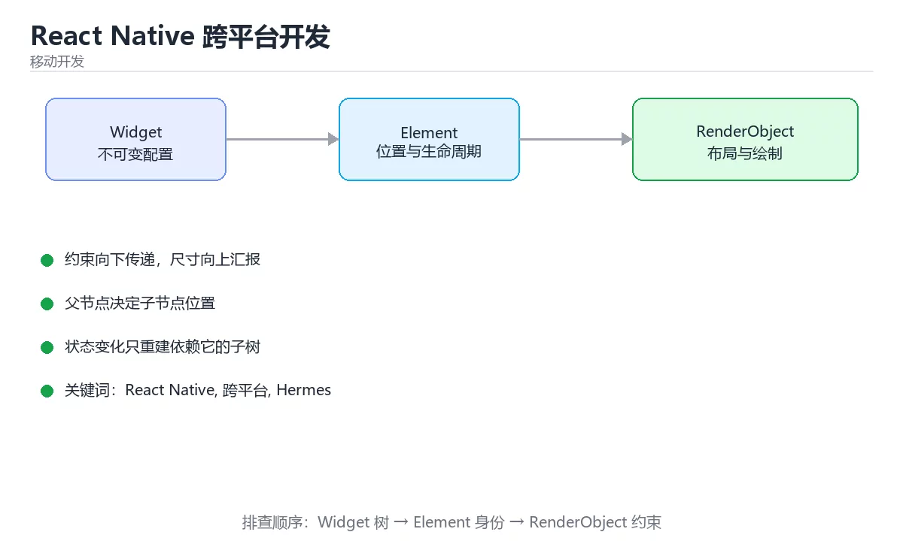

# React Native 跨平台开发



> 内容更新时间：2026-10-03 · 学习阶段：进阶 · 预计用时：16 分钟

## 学习目标

- 能用自己的话解释「React Native 跨平台开发」解决了什么问题，而不是只背术语。
- 能说清 「React Native」、「跨平台」、「Hermes」、「Fabric」 之间的关系，并分别举出一个例子。
- 能把本课知识放回「移动开发」的知识体系，说明它和相邻主题的边界。
- 能完成本课练习，并用验收标准检查自己的结果。

> 一句话摘要：新架构 JSI/Fabric/Hermes、列表虚拟化与桥接性能优化。

## 前置知识

- 先完成上一课《Swift 与 iOS 开发》；如果已经掌握，可以直接用本课练习自测。
- 本课阶段：进阶。建议先掌握同一分类的基础课程，并能独立运行正文中的最小示例。
- 开始前先复习：React Native、跨平台、Hermes。
- 如果某一步看不懂，先记录具体卡点，完成练习后再回头读一遍。


## 定位与原理

React Native（RN）用 JavaScript/TypeScript 写业务，通过桥接调用原生组件渲染真实原生控件，而不是 WebView。它的价值是「一套业务代码 + 两种原生体验」，代价是需要理解 JS 线程与原生线程的通信边界。

| 方案 | 渲染方式 | 性能 | 生态 |
| --- | --- | --- | --- |
| React Native | 原生组件 | 接近原生 | JS 生态庞大 |
| Flutter | 自绘引擎 | 稳定高帧率 | Dart 生态 |
| WebView 混合 | 网页 | 较差 | 前端复用 |
| 原生开发 | 平台控件 | 最好 | 两套代码 |

## 架构速查（新架构）

| 组成 | 作用 |
| --- | --- |
| JSI | 让 JS 直接调用 C++ 层，替代异步桥接 |
| Fabric | 新渲染器，支持同步布局与并发渲染 |
| TurboModules | 按需加载原生模块 |
| Hermes | 默认 JS 引擎，启动更快、内存更低 |
| Codegen | 由类型定义生成桥接代码 |

## 常用组件与 API

| 需求 | 写法 |
| --- | --- |
| 基础容器 | `View`、`ScrollView`、`SafeAreaView` |
| 文本 | `Text`、`TextInput` |
| 列表 | `FlatList`（大数据）、`SectionList` |
| 图片 | `Image`（需显式宽高或 `aspectRatio`） |
| 触摸 | `Pressable`、`TouchableOpacity` |
| 样式 | `StyleSheet.create`，单位是无量纲的 dp |
| 平台差异 | `Platform.select({ ios: ..., android: ... })` |
| 存储 | `AsyncStorage` / MMKV |
| 导航 | React Navigation |

```tsx
import React from "react";
import { FlatList, Pressable, StyleSheet, Text, View } from "react-native";

type Lesson = { id: string; title: string; minutes: number };

export function LessonList({ lessons }: { lessons: Lesson[] }) {
  return (
    <FlatList
      data={lessons}
      keyExtractor={(item) => item.id}
      // 只渲染可见行，避免一次性创建全部子组件
      initialNumToRender={8}
      windowSize={5}
      removeClippedSubviews
      ItemSeparatorComponent={() => <View style={styles.gap} />}
      renderItem={({ item }) => (
        <Pressable
          style={({ pressed }) => [styles.card, pressed && styles.cardPressed]}
          onPress={() => undefined}
        >
          <Text style={styles.title} numberOfLines={1}>
            {item.title}
          </Text>
          <Text style={styles.meta}>{item.minutes} 分钟</Text>
        </Pressable>
      )}
    />
  );
}

const styles = StyleSheet.create({
  card: { padding: 16, borderRadius: 8, backgroundColor: "#fff" },
  cardPressed: { opacity: 0.7 },
  title: { fontSize: 16, fontWeight: "600" },
  meta: { marginTop: 4, color: "#64748b" },
  gap: { height: 8 },
});
```

## 性能要点速查

| 问题 | 手段 |
| --- | --- |
| 长列表卡顿 | `FlatList` 虚拟化 + `keyExtractor` + `getItemLayout` |
| 频繁重渲染 | `React.memo`、`useCallback`、`useMemo` |
| 启动慢 | 开启 Hermes、减少启动期初始化、延迟加载模块 |
| 桥接开销 | 合并调用、避免每帧跨桥传输大数据 |
| 图片内存 | 按需缩放、使用缓存库、及时释放 |
| 动画掉帧 | 用 `Animated`/`Reanimated` 走原生线程，避免 JS 逐帧改样式 |

## 常见错误对照表

| 容易踩的做法 | 实际现象 | 原因与正确做法 |
| --- | --- | --- |
| 用 `ScrollView` 渲染长列表 | 内存暴涨、卡顿 | 改用 `FlatList` 虚拟化 |
| 内联箭头函数当 `renderItem` | 每次渲染都新建函数与组件 | 提到组件外或用 `useCallback` |
| 图片不设宽高 | 布局错乱或空白 | 显式设置尺寸或 `aspectRatio` |
| 在 JS 线程做重计算 | 动画与交互卡顿 | 移到原生模块或 Worker |
| 直接用 `console.log` 排查线上问题 | 性能下降、无日志留存 | 用日志库并按级别控制 |
| 把原生差异写死在业务里 | 维护成本高 | 抽平台适配层 |
| 忽略返回键与安全区域 | Android 与刘海屏体验异常 | 处理 `BackHandler` 与安全区 |

## 自测清单

- [ ] 能说清 RN 与 Flutter、原生、WebView 的取舍。
- [ ] 知道 JSI、Fabric、TurboModules、Hermes 各自解决什么。
- [ ] 长列表使用虚拟化并提供 `keyExtractor`。
- [ ] 用 `React.memo` 与 hooks 控制重渲染范围。
- [ ] 动画走原生线程，避免 JS 逐帧驱动。


## 零基础详解：React Native 跨平台开发

### 一句话说清它是什么

React Native 用 JavaScript/TypeScript 写界面，再通过「桥」或 JSI 调用原生控件渲染。
它的核心心智是：**UI 是状态的函数，改状态就自动重建界面**。

### 用生活比喻理解

| 概念 | 比喻 | 说明 |
| --- | --- | --- |
| 组件 | 积木 | 可复用的界面单元 |
| props | 传入的参数 | 只读，父传子 |
| state | 组件自己的记忆 | 改了就重建 |
| Hooks | 给函数组件装能力 | 状态、副作用、缓存 |
| 桥 / JSI | 翻译通道 | JS 与原生互相调用 |

### 用 Hooks 写一个页面

```tsx
import { useCallback, useEffect, useState } from "react";
import { ActivityIndicator, FlatList, Pressable, Text, View } from "react-native";

type Item = { id: string; title: string };

export function ItemListScreen() {
  const [items, setItems] = useState<Item[]>([]);
  const [status, setStatus] = useState<"loading" | "ready" | "error">("loading");

  const load = useCallback(async () => {
    setStatus("loading");
    try {
      const res = await fetch("https://example.com/api/items");
      if (!res.ok) throw new Error(`HTTP ${res.status}`);
      setItems(await res.json());
      setStatus("ready");
    } catch {
      setStatus("error");
    }
  }, []);

  useEffect(() => {
    void load();
  }, [load]);

  if (status === "loading") return <ActivityIndicator />;
  if (status === "error") {
    return (
      <View>
        <Text>加载失败</Text>
        <Pressable onPress={load}><Text>重试</Text></Pressable>
      </View>
    );
  }
  if (items.length === 0) return <Text>暂无数据</Text>;

  return (
    <FlatList
      data={items}
      keyExtractor={(item) => item.id}
      renderItem={({ item }) => <Text>{item.title}</Text>}
    />
  );
}
```

**关键点**：长列表必须用 `FlatList` 或 `FlashList`，`ScrollView` 会一次性渲染全部子项。

### 四个最容易出 bug 的 Hooks 用法

| 问题 | 现象 | 正确做法 |
| --- | --- | --- |
| `useEffect` 缺依赖 | 用到旧值 | 把依赖写全，或用函数式更新 |
| 每次渲染新建函数 | 子组件无谓重建 | 用 `useCallback` |
| 每次渲染新建对象 | `memo` 失效 | 用 `useMemo` |
| 组件卸载后 setState | 警告或异常 | 用标志位或取消请求 |

```tsx
// 依赖数组写全的正确姿势
useEffect(() => {
  const controller = new AbortController();
  void (async () => {
    try {
      const res = await fetch(url, { signal: controller.signal });
      setData(await res.json());
    } catch (error) {
      if ((error as Error).name !== "AbortError") setError("加载失败");
    }
  })();
  return () => controller.abort();      // 清理函数：组件卸载时取消
}, [url]);
```

### 平台差异与原生能力

```tsx
import { Platform, StyleSheet } from "react-native";

const styles = StyleSheet.create({
  card: {
    padding: 16,
    shadowOpacity: Platform.OS === "ios" ? 0.1 : 0,
    elevation: Platform.OS === "android" ? 2 : 0,
  },
});

// 分平台文件：Button.ios.tsx 与 Button.android.tsx 会被自动选用
```

| 需求 | 方式 |
| --- | --- |
| 平台差异样式 | `Platform.OS` 或分平台文件 |
| 需要原生能力 | 社区库或自己写 Native Module |
| 频繁通信的性能问题 | 用 JSI 或新架构 Fabric |
| 本地存储 | AsyncStorage、MMKV |
| 导航 | React Navigation |

### 性能四原则

```tsx
// 1. 长列表用虚拟化并给出稳定 key
<FlatList keyExtractor={(i) => i.id} ... />

// 2. 列表项用 memo 包裹，避免整表重建
const Row = memo(function Row({ item }: { item: Item }) {
  return <Text>{item.title}</Text>;
});

// 3. 回调与对象用 useCallback / useMemo 稳定引用
const renderItem = useCallback(({ item }: { item: Item }) => <Row item={item} />, []);

// 4. 图片给定尺寸，避免布局跳动
<Image source={{ uri }} style={{ width: 64, height: 64 }} />
```

### 新手最容易踩的八个坑

| 坑 | 现象 | 正确做法 |
| --- | --- | --- |
| 用 ScrollView 渲染长列表 | 内存暴涨、卡顿 | 用 FlatList |
| `useEffect` 依赖不全 | 数据不更新 | 补全依赖 |
| 卸载后 setState | 警告与异常 | 清理函数里取消 |
| 内联对象传子组件 | memo 失效 | 用 useMemo |
| 图片不给尺寸 | 布局跳动 | 固定宽高或比例 |
| 在主线程做重计算 | 掉帧 | 拆分或移到原生 |
| 直接改 state 数组 | 界面不刷新 | 返回新数组 |
| 忽略安全区 | 内容被遮挡 | 用 `SafeAreaView` |

### 学完自测

- [ ] 能说出 props 与 state 的区别。
- [ ] 知道 `useEffect` 的清理函数有什么用。
- [ ] 能说出长列表为什么必须虚拟化。
- [ ] 知道 `useCallback` 与 `useMemo` 各自稳定什么。
- [ ] 能说出至少两种处理平台差异的方式。

## 动手练习


> 本课练习重点：围绕「React Native、跨平台、Hermes」完成复述、实验和交付，每个结果都要能被别人检查。

先做一个最小 Widget，再切换状态与约束，最后在窄屏和深色模式下验证布局。

### 练习 1：建立心智模型（10 分钟）

合上教程，用 3～5 句话回答：

1. 「React Native 跨平台开发」解决了什么问题？
2. 如果没有它，会出现什么具体后果？
3. 它和「跨平台」是什么关系？

**验收标准**：至少出现一个本课关键词，并写出一个反例、边界条件或失效场景。

### 练习 2：做一次可控实验（20 分钟）

从正文中选一个最小示例，完成以下操作：

1. 先预测修改一个参数、输入或步骤后的结果。
2. 再实际执行或逐步推演，记录真实结果。
3. 如果结果与预测不同，写出差异原因。

**验收标准**：留下「原例 → 改动 → 预测 → 结果 → 原因」五步记录。

### 练习 3：交付一个小结果（30 分钟）

创建一个最小 Widget，分别验证正常输入、空数据和超长文本三种状态。

任务要求：

- 结果必须能被别人检查，不能只写“我已经理解了”。
- 至少覆盖「React Native」和「跨平台」两个关键词。
- 写出 1 个仍然不确定的问题，以及下一步如何验证。

> 提示：时间有限时优先做练习 1 和练习 2；练习 3 可以拆成两次完成。

## 本课小结

- 核心问题：「React Native 跨平台开发」不是孤立术语，而是在「移动开发」中解决一类具体问题。
- 关键关系：先分清「React Native」与「跨平台」的职责，再理解「Hermes」的适用边界。
- 判断标准：能解释正常场景、边界条件和失败场景，才算真正掌握。
- 下一步：完成练习后，用自己的话写下 3 条要点，再去做本课测验。


## 考点精讲：把测验题还原成判断过程

本课有 6 个判断点。先自己作答，再看「判断依据」；如果结论正确但理由不完整，回到正文对应章节补足概念。

### 考点 1：React Native 与 WebView 混合方案的关键区别是？

- **正确判断**：RN 通过桥接渲染真实原生组件，不是网页
- **判断依据**：正确答案是「RN 通过桥接渲染真实原生组件，不是网页」，本课在「定位与原理」中说明：React Native（RN）用 JavaScript/TypeScript 写业务，通过桥接调用原生组件渲染真实原生控件，而不是 WebView。RN 用 JS 描述业务，最终渲染的是平台原生控件，所以体验接近原生。本课还在「零基础详解：React Native 跨平台开发」中说明：React Native 用 JavaScript/TypeScript 写界面，再通过「桥」或 JSI 调用原生控件渲染。
- **迁移检查**：如果给某个错误选项去掉一个限定词，它会不会变成正确？说明理由。

### 考点 2：列表数据量大时应该使用哪个组件？

- **正确判断**：FlatList
- **判断依据**：FlatList 做虚拟化，只渲染可见区域，内存与滚动性能都可控。ScrollView 会一次性创建全部子视图。针对「列表数据量大时应该使用哪个组件，」，本课在「零基础详解：React Native 跨平台开发」中说明：关键点：长列表必须用 FlatList 或 FlashList，ScrollView 会一次性渲染全部子项。本课还在「定位与原理」中说明：它的价值是「一套业务代码 + 两种原生体验」，代价是需要理解 JS 线程与原生线程的通信边界。
- **迁移检查**：如果给某个错误选项去掉一个限定词，它会不会变成正确？说明理由。

### 考点 3：Hermes 引擎带来的主要收益是？

- **正确判断**：提升启动速度并降低内存占用
- **判断依据**：正确答案是「提升启动速度并降低内存占用」，本课在「定位与原理」中说明：它的价值是「一套业务代码 + 两种原生体验」，代价是需要理解 JS 线程与原生线程的通信边界。Hermes 为移动端优化，通过预编译字节码减少启动解析时间并降低内存，是 RN 默认引擎。
- **迁移检查**：把题干里的一个条件换成边界值，原来的结论还成立吗？写出判断过程。

### 考点 4：关于 RN 中的动画性能，正确做法是？

- **正确判断**：用 Animated 或 Reanimated 让动画在原生线程执行
- **判断依据**：正确答案是「用 Animated 或 Reanimated 让动画在原生线程执行」，这道题在问关于RN中的动画性能，正确做法是，判断时要把题干限定的输入、边界与目标逐项对齐。动画在原生线程执行可以绕开 JS 线程繁忙导致的掉帧，这是 RN 动画的主流做法。
- **迁移检查**：遮住选项，只根据定义复述一次答案，再回来看哪个选项与复述一致。

### 考点 5：图片在 RN 布局中不设置宽高会出现什么？

- **正确判断**：可能不显示或导致布局异常
- **判断依据**：正确答案是「可能不显示或导致布局异常」，本课在「零基础详解：React Native 跨平台开发」中说明：它的核心心智是：UI 是状态的函数，改状态就自动重建界面。RN 的 Image 没有像浏览器那样的固有尺寸，必须显式给出宽高或 aspectRatio，否则可能渲染不出或造成布局跳动。
- **迁移检查**：如果给某个错误选项去掉一个限定词，它会不会变成正确？说明理由。

### 考点 6：补全代码：「React Native 跨平台开发」示例中，下面这行代码缺少哪个关键字或函数名？请填入 ____。 `const load = ____(async () => {`

- **正确判断**：useCallback / usecallback
- **判断依据**：正确答案是「useCallback」，本课在「零基础详解：React Native 跨平台开发」中说明：知道 useCallback 与 useMemo 各自稳定什么。本课还在「零基础详解：React Native 跨平台开发」中说明：知道 useEffect 的清理函数有什么用。
- **迁移检查**：不看题干，用自己的话补全这句话，再与标准答案对照。

### 补充考点 1：阅读「React Native 跨平台开发」的代码片段，下面哪项判断是正确的？

- **正确判断**：RN 通过桥接渲染真实原生组件，不是网页
- **判断依据**：正确答案是「RN 通过桥接渲染真实原生组件，不是网页」。这段代码来自「React Native 跨平台开发」的示例，判断时先看输入与输出，再检查条件、循环和边界。正确答案是「RN 通过桥接渲染真实原生组件，不是网页」，本课在「定位与原理」中说明：React Native（RN）用 JavaScript/TypeScript 写业务，通过桥接调用原生组件渲染真实…在「React Native 跨平台开发」中，如果只改一个条件，输出通常会随之改变，因此不能脱离代码前提作答。

## 本课复习清单

离开本课前，逐项确认：

- [ ] 不看解析，能说出「React Native 与 WebView 混合方案的关键区别是？」的判断依据。
- [ ] 不看解析，能说出「列表数据量大时应该使用哪个组件？」的判断依据。
- [ ] 不看解析，能说出「Hermes 引擎带来的主要收益是？」的判断依据。
- [ ] 不看解析，能说出「关于 RN 中的动画性能，正确做法是？」的判断依据。
- [ ] 不看解析，能说出「图片在 RN 布局中不设置宽高会出现什么？」的判断依据。
- [ ] 不看解析，能说出「补全代码：「React Native 跨平台开发」示例中，下面这行代码缺少哪个关…」的判断依据。
- [ ] 至少运行一次本课示例，记录输入、输出和一个边界情况。
- [ ] 把本课最容易混淆的两个概念写成一句话对照。

| 复盘项 | 记录 |
| --- | --- |
| 已经能独立解释的考点 |  |
| 仍然说不清的概念 |  |
| 下一步验证动作 |  |

## 术语速查

把本课反复出现的术语集中放在一起。复习时先遮住右列，尝试用自己的话解释，再回到正文核对。

| 术语 | 本课语境 |
| --- | --- |
| `View` | \| 基础容器 \| `View`、`ScrollView`、`SafeAreaView` \| |
| `ScrollView` | \| 基础容器 \| `View`、`ScrollView`、`SafeAreaView` \| |
| `SafeAreaView` | \| 基础容器 \| `View`、`ScrollView`、`SafeAreaView` \| |
| `Text` | \| 文本 \| `Text`、`TextInput` \| |
| `TextInput` | \| 文本 \| `Text`、`TextInput` \| |
| `FlatList` | \| 列表 \| `FlatList`（大数据）、`SectionList` \| |
| `SectionList` | \| 列表 \| `FlatList`（大数据）、`SectionList` \| |
| `Image` | \| 图片 \| `Image`（需显式宽高或 `aspectRatio`） \| |
| `aspectRatio` | \| 图片 \| `Image`（需显式宽高或 `aspectRatio`） \| |
| `Pressable` | \| 触摸 \| `Pressable`、`TouchableOpacity` \| |
| `TouchableOpacity` | \| 触摸 \| `Pressable`、`TouchableOpacity` \| |
| `StyleSheet.create` | \| 样式 \| `StyleSheet.create`，单位是无量纲的 dp \| |

## 面试问答与自测

下面把本课考点换成面试追问。先口述自己的答案，
再对照参考回答检查是否遗漏了前提、边界或失败路径。

### 追问 1：React Native 与 WebView 混合方案的关键区别是？

**参考回答**：正确答案是「RN 通过桥接渲染真实原生组件，不是网页」，本课在「定位与原理」中说明：React Native（RN）用 JavaScript/TypeScript 写业务，通过桥接调用原生组件渲染真实原生控件，而不是 WebView。RN 用 JS 描述业务，最终渲染的是平台原生控件，所以体验接近原生。本课还在「零基础详解·React Native 跨平台开发」中说明：React Native 用 JavaScript/TypeScript 写界面，再通过「桥」或 JSI 调用原生控件渲染。

### 追问 2：列表数据量大时应该使用哪个组件？

**参考回答**：FlatList 做虚拟化，只渲染可见区域，内存与滚动性能都可控。ScrollView 会一次性创建全部子视图。针对「列表数据量大时应该使用哪个组件，」，本课在「零基础详解·React Native 跨平台开发」中说明：关键点：长列表必须用 FlatList 或 FlashList，ScrollView 会一次性渲染全部子项。本课还在「定位与原理」中说明：它的价值是「一套业务代码 + 两种原生体验」，代价是需要理解 JS 线程与原生线程的通信边界。

### 追问 3：Hermes 引擎带来的主要收益是？

**参考回答**：正确答案是「提升启动速度并降低内存占用」，本课在「定位与原理」中说明：它的价值是「一套业务代码 + 两种原生体验」，代价是需要理解 JS 线程与原生线程的通信边界。Hermes 为移动端优化，通过预编译字节码减少启动解析时间并降低内存，是 RN 默认引擎。

### 追问 4：关于 RN 中的动画性能，正确做法是？

**参考回答**：正确答案是「用 Animated 或 Reanimated 让动画在原生线程执行」，这道题在问关于RN中的动画性能，正确做法是，判断时要把题干限定的输入、边界与目标逐项对齐。动画在原生线程执行可以绕开 JS 线程繁忙导致的掉帧，这是 RN 动画的主流做法。

### 追问 5：图片在 RN 布局中不设置宽高会出现什么？

**参考回答**：正确答案是「可能不显示或导致布局异常」，本课在「零基础详解·React Native 跨平台开发」中说明：它的核心心智是：UI 是状态的函数，改状态就自动重建界面。RN 的 Image 没有像浏览器那样的固有尺寸，必须显式给出宽高或 aspectRatio，否则可能渲染不出或造成布局跳动。

## English Overview

**Title:** React Native

**Summary:** JSI, Fabric, Hermes and list virtualization.

**Category:** Mobile Development  
**Level:** 进阶  
**Key terms:** React Native, 跨平台, Hermes, Fabric, FlatList

> The full tutorial is written in Chinese. This bilingual overview helps English readers identify the topic, scope and key terms before studying the detailed examples.

## 内容元数据

- 内容版本：v2.0
- 最后更新：2026-10-03
- 学习阶段：进阶
- 适用环境：Flutter 3.x / Dart 3.x
- 内容来源：内置结构化课程与工程实践整理
- 相关主题：React Native、跨平台、Hermes、Fabric、FlatList
- 质量版本：P0 测验标准 + P1 覆盖扩展 + P2 体验补全


## 参考资料与复核

- 最后复核：2026-10-04
- 下次复核：2027-04-04
- 复核范围：版本兼容、API 行为、安全建议与工程实践
- 来源性质：官方文档与标准；本课正文为离线教学重组，不复制原文

| 参考资料 | 本课用途 |
| --- | --- |
| [Flutter 官方文档](https://docs.flutter.dev/) | 框架、组件与发布流程 |
| [Dart 官方文档](https://dart.dev/guides) | 语言、异步与工具链 |

> 本课主题：新架构 JSI/Fabric/Hermes、列表虚拟化与桥接性能优化。

> App 完全离线展示文字链接，不会自动联网；需要延伸阅读时可复制链接到浏览器。
