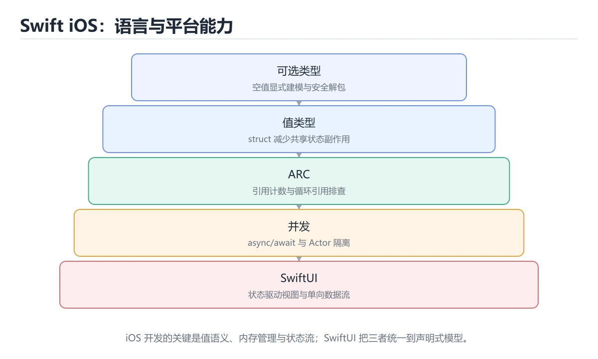
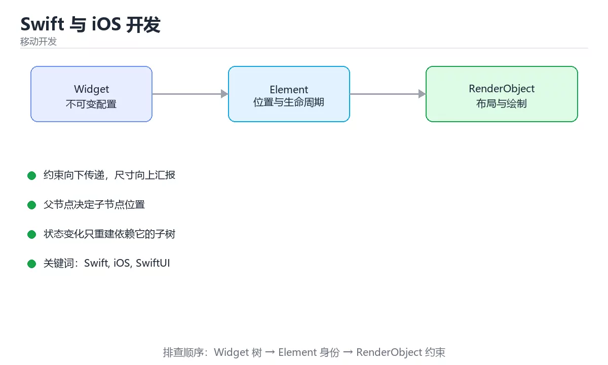

# Swift 与 iOS 开发





> 内容更新时间：2026-10-06 · 学习阶段：基础 · 预计用时：55 分钟

## 本节知识框架

**课程定位**：所属分类 `flutter`（移动开发），课程主题 `Swift 与 iOS 开发`，学习阶段 基础，建议用时 50 分钟。

本课主线：可选类型、值类型、ARC 与 SwiftUI 状态。

**学完本课应当能够**
- 说清 `Swift` 与 `SwiftUI` 的含义与区别，并各举一个正例和一个反例。
- 用本课示例验证 `可选类型` 的行为，记录输入、输出与失败条件。
- 遇到「用 `!` 强制解包」这类问题时，能说出触发条件与修复顺序。

### 从概念到验证的学习链条

1. `Swift`：先掌握 Apple 推出的静态类型编程语言，用于 iOS、macOS 等平台开发，再用它解释 `SwiftUI` 为什么会出现。
2. `SwiftUI`：先掌握 Apple 的声明式 UI 框架，用状态驱动视图并跨 Apple 平台复用，再用它解释 `可选类型` 为什么会出现。
3. `可选类型`：先掌握 Optional 表示值可能为 nil，必须显式解包（if let、guard let）才能使用，从类型层面消除空指针，再用它解释 `ARC` 为什么会出现。
4. `ARC`：先掌握 Swift 的自动引用计数，在编译期插入引用计数的增减，循环引用要用 weak 或 unowned 打破，再用它解释 `Task` 为什么会出现。
5. `Task`：先掌握 Swift 并发中的异步任务单元，可等待结果、取消或组合并发工作，再用它解释 `async` 为什么会出现。
6. `async`：先掌握 标记异步函数或异步块，使内部可以使用 await 而不阻塞调用线程，再用它解释 本课示例的观察结果 为什么会出现。

**先修与衔接**：本课是「移动开发」分类的第 7 课。先修内容：《Kotlin 与 Android 开发》。《Kotlin 与 Android 开发》里的 `Kotlin`、`Android` 是本课的前提。相关或后续课程：《React Native 跨平台开发》。

### 完成判据

- **定义关**：不看正文也能说明 `Swift` 是 Apple 推出的静态类型编程语言，用于 iOS、macOS 等平台开发，并指出一个反例。
- **机制关**：能按“输入 → 转换 → 输出 → 验证”复述 `Swift 与 iOS 开发`，而不是只背结论。
- **示例关**：能运行或推演 `Swift 与 iOS 开发` 的 `swift` 示例，并说明一个真实出现的标识符或字面量。
- **证据关**：能指出 `Swift 与 iOS 开发` 示例里的 调用了 `private()`，并说明它支持或反驳了本课的哪一条结论。
- **排错关**：能复现 用 `!` 强制解包，记录现象并按 用 `if let` 或 `guard let` 修复。
- **迁移关**：能把 `Swift`、`iOS`、`SwiftUI`、`ARC` 放进一个与 `Swift 与 iOS 开发` 不同的项目场景，并保持输入与验证条件可追踪。
- **复盘关**：学完 `Swift 与 iOS 开发` 后，用一句话写下仍然不确定的结论，并列出下一次验证需要的输入、环境和成功判据。

### 复习清单

- [ ] 能不看正文复述本课核心术语，并指出一个边界或反例。
- [ ] 能运行或推演本课示例，记录输入、输出与失败现象。
- [ ] 能完成一次自测，并把错题对照错误表定位原因。

## 核心概念定义

| 术语 | 操作性定义 | 常见边界与风险 |
| --- | --- | --- |
| Swift | Apple 推出的静态类型编程语言，用于 iOS、macOS 等平台开发。 | 静态检查只在编译期成立，运行期输入仍需校验。 |
| SwiftUI | Apple 的声明式 UI 框架，用状态驱动视图并跨 Apple 平台复用。 | 缓存与状态残留会让结果过期，先明确失效策略再判断正确性。 |
| 可选类型 | Optional 表示值可能为 nil，必须显式解包（if let、guard let）才能使用，从类型层面消除空指针。 | 静态检查只在编译期成立，运行期输入仍需校验。 |
| ARC | Swift 的自动引用计数，在编译期插入引用计数的增减，循环引用要用 weak 或 unowned 打破。 | 静态检查只在编译期成立，运行期输入仍需校验。 |
| Task | Swift 并发中的异步任务单元，可等待结果、取消或组合并发工作 | 易错：页面销毁后仍在请求；正确做法是用 `.task` 或在 `deinit` 取消。 |
| async | 标记异步函数或异步块，使内部可以使用 await 而不阻塞调用线程 | 共享状态与调度顺序会改变结论，单线程或串行测试通过不等于并发下成立。 |

## 原理与运行机制

### 机制总览

**教材衔接：语言特性速览**

| 特性 | 说明 |
| --- | --- |
| 可选类型 | `String?` 表示可能为 nil，用 `if let`/`guard let` 解包 |
| 值类型优先 | struct 默认值语义，class 才引用语义；SwiftUI 中 struct 是主流 |
| 协议与扩展 | 协议定义契约，extension 提供默认实现，面向协议编程 |
| 闭包 | 尾随闭包语法简洁，注意用 `[weak self]` 避免循环引用 |
| 错误处理 | `throws` + `try/catch`，或用 Result 类型 |
| 并发 | `async/await` + `actor` 保证数据隔离 |

**教材衔接：打包发布**

用 Xcode Archive 产出 ipa；签名依赖证书与描述文件（开发/分发/企业三类）；TestFlight 做灰度与内测；App Store 审核要点包括隐私清单（Privacy Manifest）、权限用途说明与 ATT 跟踪授权。CI 上常用 fastlane 自动化构建与上传。

**教材衔接：生命周期与线程速查**

| 概念 | 说明 |
| --- | --- |
| `viewDidLoad` | 视图加载完成，做一次性配置 |
| `viewWillAppear` | 即将显示，刷新数据 |
| `deinit` | 释放资源，验证无循环引用 |
| MainActor | 主线程更新 UI |
| Task | 结构化并发任务 |
| async let | 并发启动多个异步调用 |
| actor | 保护可变状态的隔离单元 |

### 机制拆解：每一步的输入、动作与输出

#### 1. `Swift`
- 输入：`Swift`；本步把 Apple 推出的静态类型编程语言，用于 iOS、macOS 等平台开发 当作判断规则。
- 动作：围绕 `Swift` 保留中间状态，并记录它与 `SwiftUI` 的对应关系。
- 输出：`SwiftUI`，它可以被下一段代码、测试或记录继续使用。
- `Swift` 的失败条件：静态检查只在编译期成立，运行期输入仍需校验。

#### 2. `SwiftUI`
- 输入：`Swift`；本步把 Apple 的声明式 UI 框架，用状态驱动视图并跨 Apple 平台复用 当作判断规则。
- 动作：围绕 `SwiftUI` 保留中间状态，并记录它与 `可选类型` 的对应关系。
- 输出：`可选类型`，它可以被下一段代码、测试或记录继续使用。
- `SwiftUI` 的失败条件：缓存与状态残留会让结果过期，先明确失效策略再判断正确性。

#### 3. `可选类型`
- 输入：`SwiftUI`；本步把 Optional 表示值可能为 nil，必须显式解包（if let、guard let）才能使用，从类型层面消除空指针 当作判断规则。
- 动作：围绕 `可选类型` 保留中间状态，并记录它与 `ARC` 的对应关系。
- 输出：`ARC`，它可以被下一段代码、测试或记录继续使用。
- `可选类型` 的失败条件：静态检查只在编译期成立，运行期输入仍需校验。

#### 4. `ARC`
- 输入：`可选类型`；本步把 Swift 的自动引用计数，在编译期插入引用计数的增减，循环引用要用 weak 或 unowned 打破 当作判断规则。
- 动作：围绕 `ARC` 保留中间状态，并记录它与 `Task` 的对应关系。
- 输出：`Task`，它可以被下一段代码、测试或记录继续使用。
- `ARC` 的失败条件：静态检查只在编译期成立，运行期输入仍需校验。

#### 5. `Task`
- 输入：`ARC`；本步把 Swift 并发中的异步任务单元，可等待结果、取消或组合并发工作 当作判断规则。
- 动作：围绕 `Task` 保留中间状态，并记录它与 `async` 的对应关系。
- 输出：`async`，它可以被下一段代码、测试或记录继续使用。
- `Task` 的失败条件：当忘记取消 Task时，会出现页面销毁后仍在请求。

#### 6. `async`
- 输入：`Task`；本步把 标记异步函数或异步块，使内部可以使用 await 而不阻塞调用线程 当作判断规则。
- 动作：围绕 `async` 保留中间状态，并记录它与 `private` 的对应关系。
- 输出：`private`，它可以被下一段代码、测试或记录继续使用。
- `async` 的失败条件：共享状态与调度顺序会改变结论，单线程或串行测试通过不等于并发下成立。

### 示例中的可观察事实

1. 调用了 `private()`；它对应的课程主题是 `Swift 与 iOS 开发`。
2. 调用了 `load()`；它对应的课程主题是 `Swift 与 iOS 开发`。
3. 调用了 `escaping()`；它对应的课程主题是 `Swift 与 iOS 开发`。
4. 调用了 `fetch()`；它对应的课程主题是 `Swift 与 iOS 开发`。
5. 调用了 `completion()`；它对应的课程主题是 `Swift 与 iOS 开发`。
6. 调用了 `sleep()`；它对应的课程主题是 `Swift 与 iOS 开发`。
7. 调用了 `Lesson()`；它对应的课程主题是 `Swift 与 iOS 开发`。
8. 调用了 `LessonStore()`；它对应的课程主题是 `Swift 与 iOS 开发`。

### 复现实验记录

- 环境：`Swift 与 iOS 开发` 使用 `swift` 示例，固定 `Swift`、`iOS`、`SwiftUI`、`ARC` 作为第一组条件。
- 首轮输入：先确认 调用了 `private()`，预测 `Swift` 会怎样变化。
- 基线观察：记录命令、输入、输出和错误原文，不用截图代替可复制的文本。
- 单变量修改：只改变 `Swift`，观察 `async` 是否仍满足定义。
- 失败注入：复现 用 `!` 强制解包，确认现象是 线上崩溃。
- 记录结论：把“修改前、修改后、预期变化、实际变化”写成四列表，这样复盘 `Swift 与 iOS 开发` 时才能区分概念错误与实现错误。

## 典型应用场景

**教材衔接：iOS 应用结构**

| 模式 | 说明 |
| --- | --- |
| MVC | 传统模式，容易把逻辑堆进 ViewController |
| MVVM | ViewModel 持有状态，SwiftUI 下最常用 |
| 单向数据流 | 状态集中管理，配合 @State/@Observable 驱动 UI |

SwiftUI 要点：视图是 struct（轻量重建）；`@State` 管局部状态、`@Binding` 传递、`@Observable` 管共享模型；用 `List`/`LazyVStack` 做长列表懒加载。

- **用 `!` 强制解包**：典型现象是线上崩溃；正确做法是用 `if let` 或 `guard let`。
- **闭包捕获 self 成环**：典型现象是内存泄漏；正确做法是`[weak self]`。
- **在后台线程更新 UI**：典型现象是界面异常或崩溃；正确做法是回到 `@MainActor`。
- **用 class 表达简单状态**：典型现象是状态共享混乱；正确做法是用 struct 与 enum。

### 最小验证场景

- 准备：保留 `swift` 示例的原始输入，先记录 `Swift 与 iOS 开发` 的基线输出和完整运行命令。
- 观察：先核对 调用了 `private()`，再改变一个与 `Swift` 相关的条件。
- 判定：新结果与 `Swift 与 iOS 开发` 的基线不同不等于错误；只有当差异破坏了 `Swift` 的定义或错误表中的约束，才判定为失败。

### 选择与边界

- 使用 `Swift` 时，先满足它的定义：Apple 推出的静态类型编程语言，用于 iOS、macOS 等平台开发；静态检查只在编译期成立，运行期输入仍需校验。
- 使用 `SwiftUI` 时，先满足它的定义：Apple 的声明式 UI 框架，用状态驱动视图并跨 Apple 平台复用；缓存与状态残留会让结果过期，先明确失效策略再判断正确性。
- 使用 `可选类型` 时，先满足它的定义：Optional 表示值可能为 nil，必须显式解包（if let、guard let）才能使用，从类型层面消除空指针；静态检查只在编译期成立，运行期输入仍需校验。
- 使用 `ARC` 时，先满足它的定义：Swift 的自动引用计数，在编译期插入引用计数的增减，循环引用要用 weak 或 unowned 打破；静态检查只在编译期成立，运行期输入仍需校验。
- 使用 `Task` 时，先满足它的定义：Swift 并发中的异步任务单元，可等待结果、取消或组合并发工作；易错：页面销毁后仍在请求；正确做法是用 `.task` 或在 `deinit` 取消。

## 代码/协议/SQL 示例

### 最小可验证示例

```swift
// 值类型 + 不可变：默认优先的选择
struct Lesson: Identifiable, Hashable {
    let id: String
    let title: String
    var completed: Bool = false
}

// 异步加载：用弱引用避免闭包持有视图控制器
final class LessonViewModel {
    private(set) var lessons: [Lesson] = []
    var onChange: (() -> Void)?

    func load(completion: @escaping () -> Void) {
        Task { [weak self] in
            guard let self else { return }
            let fetched = await Self.fetch()
            self.lessons = fetched
            self.onChange?()
            completion()
        }
    }

    private static func fetch() async -> [Lesson] {
        try? await Task.sleep(nanoseconds: 100_000_000)
        return [Lesson(id: "1", title: "Swift 基础")]
    }
}

// SwiftUI 状态：@State 管局部，@Observable 管共享
import SwiftUI

@Observable
final class LessonStore {
    var lessons: [Lesson] = []
    var isLoading = false

    func load() async {
        isLoading = true
        defer { isLoading = false }
        lessons = await LessonViewModel.fetch()
    }
}

struct LessonListView: View {
    @State private var store = LessonStore()

    var body: some View {
        List(store.lessons) { lesson in
            Text(lesson.title)
        }
        .task { await store.load() }
        .overlay { if store.isLoading { ProgressView() } }
    }
}
```

**教材衔接：Swift 语法速查**

| 特性 | 写法 | 说明 |
| --- | --- | --- |
| 常量与变量 | `let` / `var` | 优先用 `let` |
| 可选类型 | `String?` | 必须解包后才能使用 |
| 可选绑定 | `if let name = user.name { }` | 安全解包 |
| 提前返回 | `guard let name else { return }` | 解包失败即退出 |
| 空值兜底 | `user.name ?? "匿名"` | 提供默认值 |
| 强制解包 | `user.name!` | 为空即崩溃，避免使用 |
| 值类型 | `struct` | 复制语义，优先使用 |
| 引用类型 | `class` | 需要共享身份时才用 |
| 枚举关联值 | `enum Result { case ok(String) }` | 表达状态与数据 |
| 协议扩展 | `extension` | 提供默认实现 |

**教材衔接：零基础详解：Swift 与 iOS 开发**

### 一句话说清它是什么

Swift 的核心特性是**可选类型、值语义、协议**；iOS 侧的工程要点是
**状态驱动界面、异步用 async/await、闭包注意循环引用**。

### 用生活比喻理解

| 概念 | 比喻 | 说明 |
| --- | --- | --- |
| 可选类型 `?` | 可能是空盒子 | 用前必须打开检查 |
| `let` / `var` | 只读 / 可改 | 默认用 `let` |
| struct | 复印件 | 赋值即复制 |
| class | 共享原件 | 赋值是同一实例 |
| 协议 | 岗位要求 | 谁实现谁上岗 |
| 闭包 | 带走的行李 | 捕获外部变量，可能成环 |

### 可选类型：Swift 最核心的安全设计

```swift
var nickname: String? = nil

// 方式一：if let（作用域内使用）
if let nickname {
    print("昵称长度 \(nickname.count)")
}

// 方式二：guard let（提前返回，后续一直可用）
func greet(_ nickname: String?) -> String {
    guard let nickname, !nickname.isEmpty else {
        return "你好，朋友"
    }
    return "你好，\(nickname)"
}

// 方式三：空合并与可选链
let shown = nickname ?? "未填写"
let count = nickname?.count ?? 0
```

**避免 `!` 强制解包**：`nickname!` 在 nil 时会直接崩溃。

### 值类型与引用类型

```swift
struct Point { var x: Int; var y: Int }
class Counter { var value = 0 }

var p1 = Point(x: 1, y: 1)
var p2 = p1
p2.x = 99
print(p1.x)        // 1，结构体是复制语义

let c1 = Counter()
let c2 = c1
c2.value = 5
print(c1.value)    // 5，类共享同一实例
```

| 类型 | 语义 | 适用 |
| --- | --- | --- |
| `struct` | 值类型 | 数据模型、状态、UI 状态 |
| `class` | 引用类型 | 需要共享与身份、继承 |
| `enum` | 值类型 | 有限状态（配合关联值更强） |

**SwiftUI 推荐用 struct 与 enum 表达状态**，配合不可变更新更安全。

### 闭包与循环引用

```swift
final class Loader {
    var onFinish: (() -> Void)?
    private var cache: [String] = []

    func load() {
        // [weak self] 打破强引用环
        fetch { [weak self] result in
            guard let self else { return }
            self.cache.append(result)
            self.onFinish?()
        }
    }
}
```

**规则**：闭包被 self 持有，且闭包又捕获 self 时，必须用 `[weak self]` 或 `[unowned self]`。

### async/await 与并发

```swift
struct UserService {
    func fetchUser(id: Int) async throws -> User {
        let (data, response) = try await URLSession.shared.data(
            from: URL(string: "https://example.com/users/\(id)")!
        )
        guard let http = response as? HTTPURLResponse, http.statusCode == 200 else {
            throw ServiceError.badStatus
        }
        return try JSONDecoder().decode(User.self, from: data)
    }
}

// 并发拉取多个任务
async let a = service.fetchUser(id: 1)
async let b = service.fetchUser(id: 2)
let users = try await [a, b]

// 结构化并发 + 限制并发数
try await withThrowingTaskGroup(of: User.self) { group in
    for id in ids { group.addTask { try await service.fetchUser(id: id) } }
    for try await user in group { print(user.name) }
}
```

### SwiftUI 的状态包装器

| 包装器 | 用途 |
| --- | --- |
| `@State` | 视图内部的简单状态 |
| `@Binding` | 把状态传给子视图修改 |
| `@Observable` | 可观察模型（推荐） |
| `@Environment` | 从环境读取共享值 |

```swift
@Observable
final class CartModel {
    private(set) var items: [Item] = []
    var total: Decimal { items.reduce(0) { $0 + $1.price } }

    func add(_ item: Item) { items.append(item) }
}

struct CartView: View {
    @State private var model = CartModel()

    var body: some View {
        List(model.items) { item in
            Text(item.name)
        }
        .safeAreaInset(edge: .bottom) {
            Text("合计 \(model.total, format: .currency(code: "CNY"))")
        }
    }
}
```

**要点**：`@Observable` 会自动追踪被读取的属性，只有用到它的视图才重建。

### iOS 分层

```text
App/
  Features/        按功能划分的界面与 ViewModel
  Domain/          模型、协议、用例
  Data/            网络、数据库、第三方 SDK 实现
  Resources/       资源与本地化
```

**原则**：界面依赖协议而不是具体实现，方便替换与测试。

### 新手最容易踩的八个坑

| 坑 | 现象 | 正确做法 |
| --- | --- | --- |
| 用 `!` 强制解包 | 线上崩溃 | 用 `if let` 或 `guard let` |
| 闭包捕获 self 成环 | 内存泄漏 | `[weak self]` |
| 在后台线程更新 UI | 界面异常或崩溃 | 回到 `@MainActor` |
| 用 class 表达简单状态 | 状态共享混乱 | 用 struct 与 enum |
| 忘记 `@MainActor` | 编译器警告、偶发崩溃 | 标注在需要主线程的类型上 |
| 网络请求没有超时 | 一直转圈 | 设置 `timeoutInterval` |
| 强制 try | 崩溃 | `do/catch` 或向上 `throws` |
| 把大对象放进 `@State` | 频繁复制影响性能 | 用引用类型或拆分视图 |

### 手把手练习：带四态的列表视图

```swift
enum LoadState<T> {
    case loading
    case empty
    case loaded(T)
    case failed(String)
}

@MainActor
@Observable
final class ItemListModel {
    private(set) var state: LoadState<[Item]> = .loading
    private let service: ItemService

    init(service: ItemService) { self.service = service }

    func load() async {
        state = .loading
        do {
            let items = try await service.fetchAll()
            state = items.isEmpty ? .empty : .loaded(items)
        } catch {
            state = .failed("加载失败，请稍后重试")
        }
    }
}

struct ItemListView: View {
    @State private var model: ItemListModel

    init(service: ItemService) {
        _model = State(initialValue: ItemListModel(service: service))
    }

    var body: some View {
        Group {
            switch model.state {
            case .loading: ProgressView()
            case .empty: Text("暂无数据")
            case .failed(let message): Text(message)
            case .loaded(let items): List(items) { Text($0.name) }
            }
        }
        .task { await model.load() }
    }
}
```

### 学完自测

- [ ] 能说出 `if let` 与 `guard let` 的差别。
- [ ] 知道 struct 与 class 在赋值时的不同。
- [ ] 能说出闭包什么时候需要 `[weak self]`。
- [ ] 知道为什么 UI 更新要在 `@MainActor`。
- [ ] 能说出四种界面状态该怎么表达。

**运行方式**：运行 `Swift 与 iOS 开发` 的示例时，用 `swift 文件名.swift` 运行脚本，或在 Xcode 工程里运行。

### 示例精读：先找证据，再改一个条件

1. 调用了 `private()`；它出现在 `Swift 与 iOS 开发` 的示例中，阅读时先确认它前后各发生了什么。
2. 调用了 `load()`；它出现在 `Swift 与 iOS 开发` 的示例中，阅读时先确认它前后各发生了什么。
3. 调用了 `escaping()`；它出现在 `Swift 与 iOS 开发` 的示例中，阅读时先确认它前后各发生了什么。
4. 调用了 `fetch()`；它出现在 `Swift 与 iOS 开发` 的示例中，阅读时先确认它前后各发生了什么。
5. 调用了 `completion()`；它出现在 `Swift 与 iOS 开发` 的示例中，阅读时先确认它前后各发生了什么。
6. 调用了 `sleep()`；它出现在 `Swift 与 iOS 开发` 的示例中，阅读时先确认它前后各发生了什么。
7. 调用了 `Lesson()`；它出现在 `Swift 与 iOS 开发` 的示例中，阅读时先确认它前后各发生了什么。
8. 调用了 `LessonStore()`；它出现在 `Swift 与 iOS 开发` 的示例中，阅读时先确认它前后各发生了什么。
- 在 `Swift 与 iOS 开发` 中与 `Swift` 对照：示例必须能支持 Apple 推出的静态类型编程语言，用于 iOS、macOS 等平台开发，否则说明这一段还缺少实现或验证步骤。
- 在 `Swift 与 iOS 开发` 中与 `SwiftUI` 对照：示例必须能支持 Apple 的声明式 UI 框架，用状态驱动视图并跨 Apple 平台复用，否则说明这一段还缺少实现或验证步骤。
- 在 `Swift 与 iOS 开发` 中与 `可选类型` 对照：示例必须能支持 Optional 表示值可能为 nil，必须显式解包（if let、guard let）才能使用，从类型层面消除空指针，否则说明这一段还缺少实现或验证步骤。
- 在 `Swift 与 iOS 开发` 中与 `ARC` 对照：示例必须能支持 Swift 的自动引用计数，在编译期插入引用计数的增减，循环引用要用 weak 或 unowned 打破，否则说明这一段还缺少实现或验证步骤。

## 时间/空间复杂度或性能分析

**教材衔接：生命周期与内存管理**

1. ARC 自动引用计数：强引用成环就泄漏，闭包捕获 self 时用 `[weak self]`。
2. App 生命周期从 App/Scene 委托演进到 SwiftUI 的 scenePhase。
3. 图片与大数据对象要及时释放，避免内存峰值被杀。
4. 后台任务受系统调度限制，用 BackgroundTasks 框架申请。

**教材衔接：内存管理速查**

**测量方法**：以 `Swift 与 iOS 开发` 的 `Swift` 场景为对象，固定输入跑一遍记录基线，再把规模或并发度提高一个数量级复测；两次结果的差值与波动范围才是结论依据。

### 需要控制的变量与记录项

- `Swift 与 iOS 开发` 的 `Swift`：固定它的版本、输入范围和资源上限，分别记录速度、内存与失败率的变化。
- `Swift 与 iOS 开发` 的 `iOS`：固定它的版本、输入范围和资源上限，分别记录速度、内存与失败率的变化。
- `Swift 与 iOS 开发` 的 `SwiftUI`：固定它的版本、输入范围和资源上限，分别记录速度、内存与失败率的变化。
- `Swift 与 iOS 开发` 的 `ARC`：固定它的版本、输入范围和资源上限，分别记录速度、内存与失败率的变化。
- `Swift 与 iOS 开发` 的 `TestFlight`：固定它的版本、输入范围和资源上限，分别记录速度、内存与失败率的变化。
- `Swift 与 iOS 开发` 中 `Swift` 的边界：静态检查只在编译期成立，运行期输入仍需校验。达到边界时不要外推，必须重新测量。
- `Swift 与 iOS 开发` 中 `SwiftUI` 的边界：缓存与状态残留会让结果过期，先明确失效策略再判断正确性。达到边界时不要外推，必须重新测量。
- `Swift 与 iOS 开发` 中 `可选类型` 的边界：静态检查只在编译期成立，运行期输入仍需校验。达到边界时不要外推，必须重新测量。
- `Swift 与 iOS 开发` 中 `ARC` 的边界：静态检查只在编译期成立，运行期输入仍需校验。达到边界时不要外推，必须重新测量。
- `Swift 与 iOS 开发` 中 `Task` 的边界：易错：页面销毁后仍在请求；正确做法是用 `.task` 或在 `deinit` 取消。达到边界时不要外推，必须重新测量。
- `Swift 与 iOS 开发` 的代码证据：先验证 调用了 `private()`，再记录该路径的输入规模与耗时；只看代码行数不能推出复杂度。

## 常见误区与易错点

| 容易写错的做法 | 实际现象 | 原因与正确做法 |
| --- | --- | --- |
| 用 `!` 强制解包 | 线上崩溃 | 用 `if let` 或 `guard let` |
| 闭包捕获 self 成环 | 内存泄漏 | `[weak self]` |
| 在后台线程更新 UI | 界面异常或崩溃 | 回到 `@MainActor` |
| 用 class 表达简单状态 | 状态共享混乱 | 用 struct 与 enum |
| 忘记 `@MainActor` | 编译器警告、偶发崩溃 | 标注在需要主线程的类型上 |
| 网络请求没有超时 | 一直转圈 | 设置 `timeoutInterval` |
| 强制 try | 崩溃 | `do/catch` 或向上 `throws` |
| 把大对象放进 `@State` | 频繁复制影响性能 | 用引用类型或拆分视图 |
| 滥用 `!` 强制解包 | 偶发崩溃 | 用 `guard let` 或 `??` |
| 闭包里强引用 self | 内存泄漏 | 用 `[weak self]` |
| 用 class 表达纯数据 | 意外共享与修改 | 优先 `struct` |
| 在后台线程更新 UI | 崩溃或异常 | 用 `@MainActor` 或切回主线程 |
| 忘记取消 Task | 页面销毁后仍在请求 | 用 `.task` 或在 `deinit` 取消 |
| 用 unowned 却可能为 nil | 崩溃 | 不确定时用 weak |
| 过度使用单例 | 难测试、状态共享 | 依赖注入替代 |
| 忽略 `Sendable` 约束 | 并发警告与隐患 | 明确类型跨线程安全性 |
| 视图里堆业务逻辑 | 难测试 | 抽到 ViewModel 或 Store |
| 不处理错误分支 | 静默失败 | 用 `Result` 或抛出并显式处理 |

### 现场 1：用 `!` 强制解包

**症状**：线上崩溃。

**根因与修复**：用 `if let` 或 `guard let`。

**自检**：在本课示例里复现「用 `!` 强制解包」，改成用 `if let` 或 `guard let`后重跑；如果症状消失且失败路径按预期变化，说明定位正确。

### 现场 2：闭包捕获 self 成环

**症状**：内存泄漏。

**根因与修复**：`[weak self]`。

**自检**：在本课示例里复现「闭包捕获 self 成环」，改成`[weak self]`后重跑；如果症状消失且失败路径按预期变化，说明定位正确。

### 现场 3：在后台线程更新 UI

**症状**：界面异常或崩溃。

**根因与修复**：回到 `@MainActor`。

**自检**：在本课示例里复现「在后台线程更新 UI」，改成回到 `@MainActor`后重跑；如果症状消失且失败路径按预期变化，说明定位正确。

### 现场 4：用 class 表达简单状态

**症状**：状态共享混乱。

**根因与修复**：用 struct 与 enum。

**自检**：在本课示例里复现「用 class 表达简单状态」，改成用 struct 与 enum后重跑；如果症状消失且失败路径按预期变化，说明定位正确。

### 现场 5：忘记 `@MainActor`

**症状**：编译器警告、偶发崩溃。

**根因与修复**：标注在需要主线程的类型上。

**自检**：在本课示例里复现「忘记 `@MainActor`」，改成标注在需要主线程的类型上后重跑；如果症状消失且失败路径按预期变化，说明定位正确。

### 现场 6：网络请求没有超时

**症状**：一直转圈。

**根因与修复**：设置 `timeoutInterval`。

**自检**：在本课示例里复现「网络请求没有超时」，改成设置 `timeoutInterval`后重跑；如果症状消失且失败路径按预期变化，说明定位正确。

### 现场 7：强制 try

**症状**：崩溃。

**根因与修复**：`do/catch` 或向上 `throws`。

**自检**：在本课示例里复现「强制 try」，改成`do/catch` 或向上 `throws`后重跑；如果症状消失且失败路径按预期变化，说明定位正确。

### 现场 8：把大对象放进 `@State`

**症状**：频繁复制影响性能。

**根因与修复**：用引用类型或拆分视图。

**自检**：在本课示例里复现「把大对象放进 `@State`」，改成用引用类型或拆分视图后重跑；如果症状消失且失败路径按预期变化，说明定位正确。

### 现场 9：滥用 `!` 强制解包

**症状**：偶发崩溃。

**根因与修复**：用 `guard let` 或 `??`。

**自检**：在本课示例里复现「滥用 `!` 强制解包」，改成用 `guard let` 或 `??`后重跑；如果症状消失且失败路径按预期变化，说明定位正确。

## 与其他知识点的关系

- **先修**：`Kotlin 与 Android 开发`。本课默认这些内容已经掌握。
- **相关或后续**：`React Native 跨平台开发`。本课术语会在这些课程里继续使用。
- **术语归属**：`Swift`、`SwiftUI`、`可选类型` 的定义以本课「核心概念定义」为准，换到其他课程时先确认定义是否被改写。

### 先修与后续术语接口

- `Kotlin 与 Android 开发`：两者通过本分类的学习顺序衔接，阅读时重点比较各自的输入与失败条件。
- `React Native 跨平台开发`：两者通过本分类的学习顺序衔接，阅读时重点比较各自的输入与失败条件。

### 容易混淆的相邻概念

- `Swift` 与 `SwiftUI`：前者强调 Apple 推出的静态类型编程语言，用于 iOS、macOS 等平台开发；后者强调 Apple 的声明式 UI 框架，用状态驱动视图并跨 Apple 平台复用。判断时分别检查两条定义的适用范围，不要只看名称相似就互换。
- `SwiftUI` 与 `可选类型`：前者强调 Apple 的声明式 UI 框架，用状态驱动视图并跨 Apple 平台复用；后者强调 Optional 表示值可能为 nil，必须显式解包（if let、guard let）才能使用，从类型层面消除空指针。判断时分别检查两条定义的适用范围，不要只看名称相似就互换。
- `可选类型` 与 `ARC`：前者强调 Optional 表示值可能为 nil，必须显式解包（if let、guard let）才能使用，从类型层面消除空指针；后者强调 Swift 的自动引用计数，在编译期插入引用计数的增减，循环引用要用 weak 或 unowned 打破。判断时分别检查两条定义的适用范围，不要只看名称相似就互换。
- `ARC` 与 `Task`：前者强调 Swift 的自动引用计数，在编译期插入引用计数的增减，循环引用要用 weak 或 unowned 打破；后者强调 Swift 并发中的异步任务单元，可等待结果、取消或组合并发工作。判断时分别检查两条定义的适用范围，不要只看名称相似就互换。
- `Task` 与 `async`：前者强调 Swift 并发中的异步任务单元，可等待结果、取消或组合并发工作；后者强调 标记异步函数或异步块，使内部可以使用 await 而不阻塞调用线程。判断时分别检查两条定义的适用范围，不要只看名称相似就互换。

## 自测题与参考答案

> 先独立作答，再对照参考答案；答案都能在本课正文、术语表或错误表里找到依据。

### 自测 1（概念复述）

不看正文，写出 `Swift` 的操作性定义，并说明它与 `SwiftUI` 的区别。

**参考答案**：Apple 推出的静态类型编程语言，用于 iOS、macOS 等平台开发。

`SwiftUI` 的定位是：Apple 的声明式 UI 框架，用状态驱动视图并跨 Apple 平台复用；两者的差别要从适用对象与失败模式上说明。

### 自测 2（排错）

本课错误表记录了「用 `!` 强制解包」这类做法。请写出它会出现的现象、根因，以及修复顺序。

**参考答案**：现象是线上崩溃；正确做法是用 `if let` 或 `guard let`。修复时先复现现象并保留证据，再改动一处假设重跑，确认现象消失。

### 自测 3（动手验证）

运行本课的 `swift` 示例，把其中的 `"1"` 换成一个边界值后重新运行，记录输出与错误信息。

**参考答案**：正常输入下 `swift` 示例应当复现正文给出的结果；把 `"1"` 换成边界值后，如果结果改变或报错，先核对它是否满足 `Swift 与 iOS 开发` 中`Swift` 的适用范围，再检查错误表里是否有同类现象。

### 自测 4（代码阅读）

阅读本课开头的 `swift` 示例，说明它体现了`Swift` 的哪一条性质，并指出改动哪个输入会让这条性质不再成立。

**参考答案**：`Swift` 的定义是 Apple 推出的静态类型编程语言，用于 iOS、macOS 等平台开发，示例正是在实现这条定义。改动与 `Swift` 有关的一个输入后，如果结果不再符合 `Swift 与 iOS 开发` 的正文描述，就说明该性质只在当前前提成立。

### 自测 5（迁移）

把 `Swift 与 iOS 开发` 的方法迁移到自己的项目：围绕 `Swift` 写出一个与错误表同类的风险点，并说明触发条件和检验方式。

**参考答案**：例如「不处理错误分支」，它会导致静默失败；检验方式是按用 `Result` 或抛出并显式处理改一处再复现，确认现象消失且没有引入新的失败分支。

### 自测 6（对比）

用一个表格对比 `Swift` 与 `SwiftUI`：各写一行适用场景、一行失败表现。

**参考答案**：`Swift` 的定义是Apple 推出的静态类型编程语言，用于 iOS、macOS 等平台开发；`SwiftUI` 的定义是Apple 的声明式 UI 框架，用状态驱动视图并跨 Apple 平台复用。两者的失败表现分别对应本课错误表里与本术语相关的行。

### 自测 7（排错顺序）

面对「用 `!` 强制解包」引发的问题，请把“复现 线上崩溃 → 保留证据 → 用 `if let` 或 `guard let` → 回归验证”四步写成可执行的检查清单。

**参考答案**：第一步按线上崩溃复现；第二步记录输入、版本与完整报错；第三步按用 `if let` 或 `guard let`只改一处；第四步重跑并确认失败路径也按预期变化。

### 自测 8（边界判断）

针对 `async`，分别写出“可以使用”的条件和“结论不再成立”的条件。

**参考答案**：共享状态与调度顺序会改变结论，单线程或串行测试通过不等于并发下成立。 同时要把 `async` 的定义 标记异步函数或异步块，使内部可以使用 await 而不阻塞调用线程 与实际输入逐项对照。

### 自测 9（机制重建）

不看正文，按输入、转换、输出、验证四段重建 `Swift` → `SwiftUI` → `可选类型` → `ARC` 的作用链。

**参考答案**：起点是 `Swift` 的定义 Apple 推出的静态类型编程语言，用于 iOS、macOS 等平台开发；中间每一步都保留可观察状态；终点由 `async` 检查，失败时回到错误表定位第一个偏离定义的步骤。

### 自测 10（综合排错）

在 `Swift 与 iOS 开发` 中，现象是 静默失败。请围绕 不处理错误分支 写出最小复现、关键证据、修复动作和回归验证，并说明为什么不能只凭一次运行下结论。

**参考答案**：先复现 不处理错误分支，记录输入与完整错误；再按 用 `Result` 或抛出并显式处理 只改一处。回归时同时跑正常路径和边界路径，只有两次结果都可解释，才把修复视为完成。

### 自测 11（一分钟复述）

用每分钟约 200 字的速度复述 `Swift 与 iOS 开发`：先给主问题，再按顺序说出 `Swift`、`SwiftUI`、`可选类型`、`ARC`，最后给一个失败案例。

**自评标准**：主问题必须对应 可选类型、值类型、ARC 与 SwiftUI 状态；每个术语都要能接上一句定义或边界；失败案例必须写成可观察现象，不能用“可能有风险”代替证据。

## 术语速查

| 术语 | 一句话说明 |
| --- | --- |
| `Swift` | Apple 推出的静态类型编程语言，用于 iOS、macOS 等平台开发。 |
| `SwiftUI` | Apple 的声明式 UI 框架，用状态驱动视图并跨 Apple 平台复用。 |
| `可选类型` | Optional 表示值可能为 nil，必须显式解包（if let、guard let）才能使用，从类型层面消除空指针。 |
| `ARC` | Swift 的自动引用计数，在编译期插入引用计数的增减，循环引用要用 weak 或 unowned 打破。 |
| `Task` | Swift 并发中的异步任务单元，可等待结果、取消或组合并发工作。 |
| `async` | 标记异步函数或异步块，使内部可以使用 await 而不阻塞调用线程。 |

**术语关系**：`Swift`（Apple 推出的静态类型编程语言） → `SwiftUI`（Apple 的声明式 UI 框架） → `可选类型`（Optional 表示值可能为 nil） → `ARC`（Swift 的自动引用计数）。

## 考点精讲

`Swift 与 iOS 开发` 的题库有 6 道题，下面逐题给出题干、正确项与判断依据：先自己作答，再核对正确项，最后回到正文对应小节复核。

### 考点 1：第 1 题

- **题目**：围绕“Swift 与 iOS 开发”中的 Swift、iOS、SwiftUI，下列哪两项是本课强调的实践判断？
- **正确项**：学习 Swift 时要同时说明输入、输出和失败路径，不能只看正常流程；验证 iOS 时要固定版本并覆盖边界输入，结论才可复现
- **判断依据**：这道题落在术语 `Swift` 上：Apple 推出的静态类型编程语言，用于 iOS、macOS 等平台开发。复习时把 `Swift` 的定义、适用边界和一个反例一起说清楚，再回到「核心概念定义」核对原文。

### 考点 2：第 2 题

- **题目**：按“Swift 与 iOS 开发”中 Swift、iOS、SwiftUI 的实践顺序，把四个步骤排成从准备到复盘的合理顺序。
- **正确项**：先明确 Swift 的输入、输出与约束 → 写出最小示例并核对 iOS 的基线结果 → 只改一个变量，记录边界与失败路径的变化 → 固定版本与证据，把“Swift 与 iOS 开发”的结论写成可复现记录
- **判断依据**：这道题落在术语 `Swift` 上：Apple 推出的静态类型编程语言，用于 iOS、macOS 等平台开发。复习时把 `Swift` 的定义、适用边界和一个反例一起说清楚，再回到「核心概念定义」核对原文。

### 考点 3：第 3 题

- **题目**：SwiftUI 中管理共享模型状态的常用方式是？
- **正确项**：@Observable 等状态包装器
- **判断依据**：这道题落在术语 `Swift` 上：Apple 推出的静态类型编程语言，用于 iOS、macOS 等平台开发。复习时把 `Swift` 的定义、适用边界和一个反例一起说清楚，再回到「核心概念定义」核对原文。

### 考点 4：第 4 题

- **题目**：Swift 中 struct 与 class 的关键区别是？
- **正确项**：struct 是值类型（复制语义）
- **判断依据**：这道题落在术语 `Swift` 上：Apple 推出的静态类型编程语言，用于 iOS、macOS 等平台开发。复习时把 `Swift` 的定义、适用边界和一个反例一起说清楚，再回到「核心概念定义」核对原文。

### 考点 5：第 5 题

- **题目**：guard let 与 if let 相比，最明显的特点是？
- **正确项**：guard 的条件不满足时必须在当前作用域退出（return/throw 等）
- **判断依据**：这道题检验本课主问题：可选类型、值类型、ARC 与 SwiftUI 状态。复习时先复述本课主问题，再举一个会让结论失效的输入。

### 考点 6：第 6 题

- **题目**：`Swift 与 iOS 开发` 的示例代码服务于“可选类型、值类型、ARC 与 SwiftUI 状态。”。哪一条判断是正确的？
- **正确项**：if let 或 guard let
- **判断依据**：这道题落在术语 `Swift` 上：Apple 推出的静态类型编程语言，用于 iOS、macOS 等平台开发。复习时把 `Swift` 的定义、适用边界和一个反例一起说清楚，再回到「核心概念定义」核对原文。

### 考点 7：`Swift`

- **要点**：Apple 推出的静态类型编程语言，用于 iOS、macOS 等平台开发。
- **Swift 的边界**：静态检查只在编译期成立，运行期输入仍需校验。

### 考点 8：`SwiftUI`

- **要点**：Apple 的声明式 UI 框架，用状态驱动视图并跨 Apple 平台复用。
- **SwiftUI 的边界**：缓存与状态残留会让结果过期，先明确失效策略再判断正确性。

### 考点 9：`可选类型`

- **要点**：Optional 表示值可能为 nil，必须显式解包（if let、guard let）才能使用，从类型层面消除空指针。
- **可选类型 的边界**：静态检查只在编译期成立，运行期输入仍需校验。

### 考点 10：`ARC`

- **要点**：Swift 的自动引用计数，在编译期插入引用计数的增减，循环引用要用 weak 或 unowned 打破。
- **ARC 的边界**：静态检查只在编译期成立，运行期输入仍需校验。

### 考点 11：`Task`

- **要点**：Swift 并发中的异步任务单元，可等待结果、取消或组合并发工作
- **Task 的边界**：易错：页面销毁后仍在请求；正确做法是用 `.task` 或在 `deinit` 取消。

### 考点 12：`async`

- **要点**：标记异步函数或异步块，使内部可以使用 await 而不阻塞调用线程
- **async 的边界**：共享状态与调度顺序会改变结论，单线程或串行测试通过不等于并发下成立。

### 考点 13：排错——用 `!` 强制解包

- **现象**：线上崩溃。
- **处理**：用 `if let` 或 `guard let`。

### 考点 14：排错——闭包捕获 self 成环

- **现象**：内存泄漏。
- **处理**：`[weak self]`。

### 考点 15：综合辨析——`Swift` 与 `async`

- **辨析点**：`Swift` 的定义是 Apple 推出的静态类型编程语言，用于 iOS、macOS 等平台开发；`async` 的定义是 标记异步函数或异步块，使内部可以使用 await 而不阻塞调用线程。
- **答题要求**：面对 `Swift 与 iOS 开发` 的题目，先判断描述的是 `Swift` 还是 `async`，再归到对应定义，最后写出一个会让该定义失效的边界输入。

### 考点 16：排错评分点

- **现象分**：能写出 线上崩溃，而不是只写“程序有错”。
- **证据分**：保留触发 用 `!` 强制解包 的输入、版本和错误原文。
- **修复分**：按 用 `if let` 或 `guard let` 只改一处，并同时回归正常路径与边界路径。

## 内容元数据

- 内容版本：v2.0
- 最后更新：2026-10-06
- 学习阶段：基础
- 适用环境：Flutter 3.x / Dart 3.x
；本课聚焦 Swift。
- 内容来源：内置结构化课程与工程实践整理
- 相关主题：Swift、iOS、SwiftUI、ARC、TestFlight
- 质量版本：P0 测验标准 + P1 覆盖扩展 + P2 体验补全

## 参考资料与复核

- 最后复核：2026-10-04
- 下次复核：2027-08-10
- 复核范围：版本兼容、API 行为、安全建议与工程实践
- 来源性质：官方文档、标准或权威教材；本课核对关键词：Swift、iOS、SwiftUI、ARC、TestFlight。

| 参考资料 | 本课用途 |
| --- | --- |
| [Dart 语言文档](https://dart.dev/language) | 语言语法、类型与空安全 |
| [Flutter 状态管理](https://docs.flutter.dev/data-and-backend/state-mgmt/intro) | 状态分层与重建范围 |
| [Flutter 性能最佳实践](https://docs.flutter.dev/perf/best-practices) | 帧率、构建与内存优化 |

| [本课术语索引：Swift 与 iOS 开发](#核心概念定义) | 按本课输入、术语边界和错误表现逐项核对 |
> 「Swift 与 iOS 开发」的链接用于离线阅读后的延伸核对；App 不会自动联网。