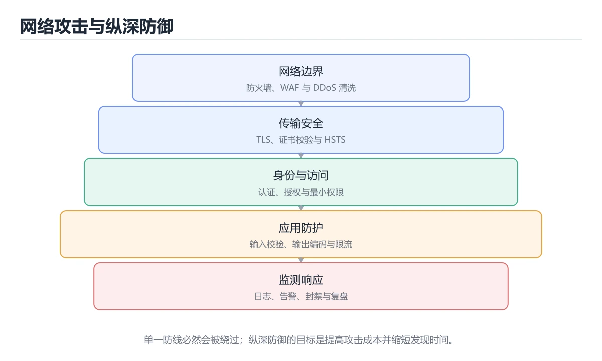
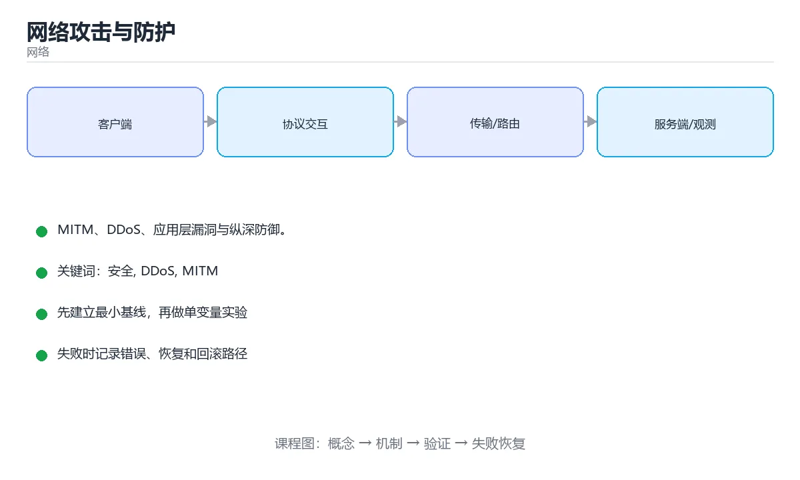

# 本课主题

> 内容更新时间：2026-10-03





## 学习目标

- 能用自己的话解释本课主题解决了什么问题，而不是只背术语。
- 能说清 「安全」、「DDoS」、「MITM」、「WAF」 之间的关系，并分别举出一个例子。
- 能把本课知识放回「网络」的知识体系，说明它和相邻主题的边界。
- 能完成本课练习，并用验收标准检查自己的结果。

> 一句话摘要：MITM、DDoS、应用层漏洞与纵深防御。

## 前置知识

- 先完成上一课《无线与移动网络》；如果已经掌握，可以直接用本课练习自测。
- 本课阶段：进阶。建议先掌握同一分类的基础课程，并能独立运行正文中的最小示例。
- 开始前先复习：安全、DDoS、MITM。
- 如果某一步看不懂，先记录具体卡点，完成练习后再回头读一遍。

## 常见攻击类型

| 攻击 | 原理 | 防护 |
| --- | --- | --- |
| 中间人（MITM） | 插入通信链路窃听/篡改 | TLS + 证书校验 + HSTS |
| ARP / DNS 欺骗 | 伪造解析结果指向攻击者 | 静态绑定、DNSSEC、DoH/DoT |
| SYN Flood | 大量半连接耗尽连接表 | SYN Cookie、限速、清洗 |
| UDP 反射放大 | 伪造源 IP 向放大器发小请求 | 关闭开放解析器、入口过滤 |
| 端口扫描 | 探测开放服务 | 最小化暴露、防火墙、蜜罐 |
| 暴力破解 | 撞库/爆破口令 | 限速、验证码、多因素认证 |
| 应用层 DDoS | 高频请求耗尽后端 | WAF、限流、人机校验 |

## DDoS 的分层与缓解

网络层（流量型）靠 CDN 与清洗中心吸收；传输层（协议型）靠 SYN Cookie 与连接限制；应用层（CC 攻击）靠 WAF 规则、行为分析与限流。核心思路是**分层过滤 + 弹性扩容 + 降级预案**。

## 边界防护组件

防火墙（ACL 与状态检测）、IDS（检测告警）、IPS（阻断）、WAF（HTTP 层规则）、堡垒机（运维审计）。零信任强调「默认不信任、持续验证、最小权限」，替代「内网即可信」的旧假设。

## 应用层常见漏洞

SQL 注入（参数化查询）、XSS（输出转义 + CSP）、CSRF（SameSite + Token）、SSRF（限制出站与白名单）、越权（服务端逐次鉴权）、反序列化（避免不可信数据反序列化）、依赖漏洞（SCA 扫描 + 及时升级）。

## 排查与响应

1. 看流量特征：来源分布、请求路径、User-Agent、速率突增。
2. 看资源曲线：连接数、CPU、带宽、队列长度。
3. 快速止损：限流、封禁网段、切备用入口、开启验证码。
4. 保留证据：抓包、访问日志、时间线，用于复盘与溯源。
5. 复盘加固：补齐规则、增加监控告警、演练预案。

## 攻防演练清单

| 演练项 | 操作 | 期望结果 |
| --- | --- | --- |
| 端口暴露面 | 从外网扫描常用端口 | 只开放必要端口，其余被防火墙拒绝 |
| 弱口令 | 对登录接口做限速内的字典尝试 | 触发锁定或验证码，日志有告警 |
| 应用层 CC | 用压测工具打热点接口 | 限流生效、核心链路仍可用 |
| 依赖漏洞 | 跑 SCA 扫描 | 高危漏洞有清单与升级计划 |
| 越权 | 用 A 用户 Token 访问 B 用户资源 | 返回 403 而非数据 |
| 注入 | 尝试在参数中注入 SQL/命令 | 被参数化与白名单拦住 |

演练原则：**只在自己有授权的环境做**；每次演练都要留证据（命令、时间、结果）并转化为修复项与回归用例。把发现的问题按 P0/P1 分级，P0 必须在下次发布前修完。

排查入侵迹象的五个信号：异常登录时间与地理位置、非预期的出站连接、权限被提升的账户、异常增长的流量或费用、日志中出现被清理的痕迹（缺失时间段）。

## 本课小结
安全的原则是**纵深防御**：网络层过滤、传输层加密、应用层校验、账号层多因素、数据层最小权限，任何一层都不假设其他层已经安全。

## 常见攻击速查

| 攻击 | 原理 | 主要防护 |
| --- | --- | --- |
| SYN Flood | 大量半开连接耗尽队列 | SYN Cookie、限速、缩短超时 |
| UDP 反射放大 | 伪造源 IP 触发大响应 | 禁用开放服务、入口过滤、限速 |
| DNS 放大 | 利用大 TXT 响应 | 限制递归、响应限速、RRL |
| ARP 欺骗 | 伪造 IP 与 MAC 映射 | 动态 ARP 检测、静态绑定、分段 |
| DDoS | 多源流量压垮服务 | 云清洗、就近拦截、弹性扩容 |
| 中间人 | 劫持流量 | 强制 HTTPS、证书校验、HSTS |
| 端口扫描 | 探测开放服务 | 最小暴露面、防火墙、隐藏版本 |
| 暴力破解 | 反复尝试口令 | 限速、多因素、锁定与告警 |
| 会话固定 | 固定会话 ID 后劫持 | 登录后重新生成会话 ID |
| 供应链投毒 | 依赖或镜像被篡改 | 锁定版本、校验签名与哈希 |

## 防护措施速查

| 层次 | 措施 |
| --- | --- |
| 网络层 | 安全组、WAF、DDoS 清洗、网络分段 |
| 传输层 | 强制 TLS、HSTS、证书透明 |
| 应用层 | 输入校验、参数化查询、输出编码、CSRF 令牌 |
| 身份层 | 多因素认证、最小权限、短会话与刷新令牌 |
| 数据层 | 加密存储、脱敏、审计日志 |
| 供应链 | 依赖扫描、签名校验、私有仓库 |
| 运营层 | 告警、演练、应急响应手册 |

```python
import time
from collections import defaultdict, deque

class SlidingWindowBlocker:
    """按来源限速：滑动窗口内超过阈值即拒绝，用于缓解暴力破解与扫描。"""

    def __init__(self, limit: int = 20, window_seconds: float = 60.0):
        self.limit = limit
        self.window = window_seconds
        self.events = defaultdict(deque)
        self.blocked = set()

    def allow(self, source: str, now: float | None = None) -> bool:
        now = time.monotonic() if now is None else now
        if source in self.blocked:
            return False
        queue = self.events[source]
        while queue and now - queue[0] >= self.window:
            queue.popleft()
        if len(queue) >= self.limit:
            self.blocked.add(source)          # 触发封禁，可配合告警
            return False
        queue.append(now)
        return True

def is_suspicious_scan(ports_hit: set[int], threshold: int = 20) -> bool:
    """同一来源短时间命中大量不同端口，判断为端口扫描。"""
    return len(ports_hit) >= threshold

blocker = SlidingWindowBlocker(limit=3, window_seconds=60)
print([blocker.allow("10.0.0.9", now=i) for i in range(5)])
print(is_suspicious_scan(set(range(100))))
```

## 常见错误对照表

| 容易踩的做法 | 实际现象 | 原因与正确做法 |
| --- | --- | --- |
| 只靠 IP 黑名单 | 攻击者换 IP 继续 | 叠加行为限速与业务风控 |
| 限流粒度太粗 | 正常用户被误伤 | 按账号、来源、接口多维限流 |
| 认为内网绝对可信 | 横向移动畅通无阻 | 零信任与微隔离 |
| 日志记录明文口令 | 二次泄漏 | 严禁记录敏感字段，脱敏处理 |
| 不区分人与机器流量 | 自动化攻击未被拦住 | 行为分析与验证码分级 |
| 暴露调试接口 | 被直接利用 | 生产环境关闭并限制访问 |
| 依赖默认口令 | 设备被批量入侵 | 强制修改并纳入基线检查 |
| 不做备份与演练 | 被勒索后无法恢复 | 离线备份 + 恢复演练 |
| 只在上线前做一次扫描 | 新漏洞无人跟踪 | 持续扫描与依赖更新 |
| 忽略告警疲劳 | 真事件被淹没 | 分级告警与降噪 |

## 自测清单

- [ ] 能说出常见攻击原理与对应防护。
- [ ] 有基于滑动窗口的限速与封禁能力。
- [ ] 敏感数据全链路加密且日志脱敏。
- [ ] 内网按零信任原则做微隔离。
- [ ] 有离线备份、恢复演练与应急手册。

## 动手练习

> 本课练习重点：围绕「安全、DDoS、MITM」完成复述、实验和交付，每个结果都要能被别人检查。

先抓一次真实请求或画出协议交互，再注入延迟或丢包，最后解释每层变化。

### 练习 1：建立心智模型（10 分钟）

合上教程，用 3～5 句话回答：

1. 本课主题解决了什么问题？
2. 如果没有它，会出现什么具体后果？
3. 它和「DDoS」是什么关系？

**验收标准**：至少出现一个本课关键词，并写出一个反例、边界条件或失效场景。

### 练习 2：做一次可控实验（20 分钟）

从正文中选一个最小示例，完成以下操作：

1. 先预测修改一个参数、输入或步骤后的结果。
2. 再实际执行或逐步推演，记录真实结果。
3. 如果结果与预测不同，写出差异原因。

**验收标准**：留下「原例 → 改动 → 预测 → 结果 → 原因」五步记录。

### 练习 3：交付一个小结果（30 分钟）

画出一张报文或时序图，标出每一跳的地址、协议、状态和可能失败点。

任务要求：

- 结果必须能被别人检查，不能只写“我已经理解了”。
- 至少覆盖「安全」和「DDoS」两个关键词。
- 写出 1 个仍然不确定的问题，以及下一步如何验证。

> 提示：时间有限时优先做练习 1 和练习 2；练习 3 可以拆成两次完成。

## 可运行练习

### 任务 1：先跑通，再解释

```python
import time
from collections import defaultdict, deque

class SlidingWindowBlocker:
    """按来源限速：滑动窗口内超过阈值即拒绝，用于缓解暴力破解与扫描。"""

    def __init__(self, limit: int = 20, window_seconds: float = 60.0):
        self.limit = limit
        self.window = window_seconds
        self.events = defaultdict(deque)
        self.blocked = set()

    def allow(self, source: str, now: float | None = None) -> bool:
        now = time.monotonic() if now is None else now
        if source in self.blocked:
            return False
        queue = self.events[source]
        while queue and now - queue[0] >= self.window:
            queue.popleft()
        if len(queue) >= self.limit:
            self.blocked.add(source)          # 触发封禁，可配合告警
            return False
        queue.append(now)
        return True

def is_suspicious_scan(ports_hit: set[int], threshold: int = 20) -> bool:
    """同一来源短时间命中大量不同端口，判断为端口扫描。"""
    return len(ports_hit) >= threshold

blocker = SlidingWindowBlocker(limit=3, window_seconds=60)
print([blocker.allow("10.0.0.9", now=i) for i in range(5)])
print(is_suspicious_scan(set(range(100))))
```

### 任务 2：只改一个条件

### 任务 3：迁移到自己的数据

用同一套思路处理一组你自己的数据或场景，保持输出格式与任务 1 一致。

## 故障现场

### 现场 1：本课的 安全 常规用例通过，但边界用例失败

**症状**：在本课的练习或生产场景里出现“本课的 安全 常规用例通过，但边界用例失败”。

**复现**：准备一组最小输入，只保留触发“本课的 安全 常规用例通过，但边界用例失败”的必要条件，连续运行两次确认结果稳定。

**定位**：围绕“安全 的前置条件与取值边界没有写进代码，默认值掩盖了空值和极值”检查调用链、输入数据和环境配置，先验证假设再改代码。

**预防**：把“本课的 安全 常规用例通过，但边界用例失败”写成一条自动化用例，并在本课的验收清单里保留对应检查项。

### 现场 2：本课的 DDoS 结果在两次运行之间不一致

**症状**：在本课的练习或生产场景里出现“本课的 DDoS 结果在两次运行之间不一致”。

**复现**：准备一组最小输入，只保留触发“本课的 DDoS 结果在两次运行之间不一致”的必要条件，连续运行两次确认结果稳定。

**定位**：围绕“DDoS 依赖了当前版本、执行顺序或共享状态，单次运行无法暴露差异”检查调用链、输入数据和环境配置，先验证假设再改代码。

**预防**：把“本课的 DDoS 结果在两次运行之间不一致”写成一条自动化用例，并在本课的验收清单里保留对应检查项。

### 现场 3：请求偶发超时，但服务端监控看起来正常

**症状**：在本课的练习或生产场景里出现“请求偶发超时，但服务端监控看起来正常”。

## 深入补充：本课主题 的取舍与边界

### 一、把概念放回真实约束

学习本课主题时，最容易只记住结论而忽略前提。先写出三个约束：数据规模、时间预算、可接受的失败方式；再判断 安全 与 DDoS 在这些约束下是否仍然成立。只要约束改变，原来的最优解就可能变成错误解。

| 场景 | 协议或方案 | 延迟与可靠性 | 排障入口 |
| --- | --- | --- | --- |
| 强一致请求 | TCP / HTTP | 可靠但可能队头阻塞 | 连接与重传指标 |
| 实时音视频 | UDP / QUIC | 低延迟但允许丢包 | 抖动与丢包率 |
| 大规模分发 | CDN 与缓存 | 就近命中 | 命中率与回源 |
| 服务间调用 | RPC 或消息队列 | 取决于确认机制 | 超时、重试与幂等 |

### 二、三个容易混淆的边界

2. **把“平均值”当成“全部”**：安全 的指标好看，不代表尾部请求、冷启动或失败重试也好看。
3. **把“当前版本”当成“永久行为”**：DDoS 依赖的默认值、API 或性能特征都可能随版本变化，需要固定版本并保留回归用例。

### 三、一个生产场景

假设团队要在真实系统里使用本课主题：第一周先做小流量验证，记录 安全 的基线与异常；第二周扩大输入规模，观察 DDoS 是否成为瓶颈；第三周再做故障演练，主动注入超时、重复请求和依赖不可用，确认系统能降级、能重试、能恢复。每一步都要留下指标、日志和结论，而不是只留下“感觉更快了”。

### 四、自测清单

- 能否用一句话说出本课主题解决的核心问题与不适用场景？
- 能否画出 安全 的数据流或状态变化，并标出失败路径？
- 能否给出一个反例，证明某个看似合理的结论在边界条件下不成立？
- 能否写出一条可复现的验证命令，让别人独立得到相同结论？

## 本课复习清单

离开本课前，逐项确认：

- [ ] 不看解析，能说出「防御 SYN Flood 的常用手段是？」的判断依据。
- [ ] 不看解析，能说出「UDP 反射放大攻击成立的两个前提是？」的判断依据。
- [ ] 不看解析，能说出「零信任安全模型的核心是？」的判断依据。
- [ ] 不看解析，能说出「DDoS 与 DoS 的区别是？」的判断依据。
- [ ] 不看解析，能说出「ARP 欺骗的危害是？」的判断依据。
- [ ] 至少运行一次本课示例，记录输入、输出和一个边界情况。
- [ ] 把本课最容易混淆的两个概念写成一句话对照。

| 复盘项 | 记录 |
| --- | --- |
| 已经能独立解释的考点 |  |
| 仍然说不清的概念 |  |
| 下一步验证动作 |  |

## 术语速查

| 术语 | 本课语境 |
| --- | --- |
| `安全` | 本课围绕该主题展开，结合正文与代码示例理解它的适用边界。 |
| `DDoS` | 本课围绕该主题展开，结合正文与代码示例理解它的适用边界。 |
| `MITM` | 本课围绕该主题展开，结合正文与代码示例理解它的适用边界。 |
| `WAF` | 本课围绕该主题展开，结合正文与代码示例理解它的适用边界。 |
| `零信任` | 本课围绕该主题展开，结合正文与代码示例理解它的适用边界。 |

## 零基础精讲：把本课主题真正讲透

### 先建立一个直觉

把网络看成寄信系统：地址负责定位，路由负责中转，协议负责约定信封格式，重试与超时负责处理丢件。任何一层含糊，都会表现为「能连上但结果不对」。

本课的摘要可以当作一张地图：MITM、DDoS、应用层漏洞与纵深防御。

### 逐步拆解

2. 描述处理过程。把「安全、DDoS、MITM、WAF、零信任」映射到具体步骤，每步都要求能单独验证。
3. 定义输出。输出不仅包括正常结果，还包括错误码、日志、指标和资源释放状态。
4. 找出一条失败路径。让错误尽早暴露，并说明重试、降级、回滚或人工处理的边界。
5. 用一个小例子贯穿全过程。先手算或预测结果，再运行代码或实验，最后解释差异。

### 把正文串成一条执行链

- **练习 1：建立心智模型（10 分钟）**：练习 1：建立心智模型（10 分钟）
- **练习 2：做一次可控实验（20 分钟）**：练习 2：做一次可控实验（20 分钟）
- **练习 3：交付一个小结果（30 分钟）**：练习 3：交付一个小结果（30 分钟）
- **考点 1：防御 SYN Flood 的常用手段是？**：考点 1：防御 SYN Flood 的常用手段是
- **考点 2：UDP 反射放大攻击成立的两个前提是？**：考点 2：UDP 反射放大攻击成立的两个前提是
- **考点 3：零信任安全模型的核心是？**：考点 3：零信任安全模型的核心是

### 从测验反推易错点

**检查点 1：防御 SYN Flood 的常用手段是？**

- 参考判断：SYN Cookie
- 自问：如果去掉题干里的一个限定词，结论还成立吗？

**检查点 2：UDP 反射放大攻击成立的两个前提是？**

- 参考判断：伪造源 IP 与开放的可放大服务

**检查点 3：零信任安全模型的核心是？**

- 参考判断：默认不信任，持续验证

**检查点 4：DDoS 与 DoS 的区别是？**

- 参考判断：DDoS 由大量分布在不同位置的节点（僵尸网络）同时发起

**检查点 5：ARP 欺骗的危害是？**

- 参考判断：伪造 IP 与 MAC 的映射

### 工程排错顺序

| 先查什么 | 要得到的证据 | 判断标准 |
| --- | --- | --- |
| DNS、路由和端口是否逐层验证？ | 日志、输入样例、测试或指标 | 能复现并解释，才算定位 |
| 超时、重试和幂等边界是否明确？ | 日志、输入样例、测试或指标 | 能复现并解释，才算定位 |
| MTU、代理与防火墙是否影响请求？ | 日志、输入样例、测试或指标 | 能复现并解释，才算定位 |
| 日志能否定位到具体一跳或一次请求？ | 日志、输入样例、测试或指标 | 能复现并解释，才算定位 |

### 变式训练

1. 把它放进一个只有单机、没有额外依赖的小项目，先保证正确，再考虑扩展。
2. 把输入规模扩大十倍，记录时间、内存和失败路径，找出第一个真正瓶颈。
3. 制造一次依赖超时或错误输入，要求系统给出可解释错误并且不留下半完成状态。
5. 删掉一个看似必要的步骤，观察哪个测试或指标先失败，用证据说明它为什么必要。
6. 把方案切换到低资源设备，重新评估默认参数、超时和降级策略。

### 本课自测

- [ ] 能用一句话解释「安全」在本课中的角色与边界。
- [ ] 能举出一个正常例子和一个失败例子。
- [ ] 能说出最小验证步骤，以及需要记录的证据。
- [ ] 能用一句话解释「DDoS」在本课中的角色与边界。
- [ ] 能用一句话解释「MITM」在本课中的角色与边界。
- [ ] 能用一句话解释「WAF」在本课中的角色与边界。
- [ ] 能用一句话解释「零信任」在本课中的角色与边界。

### 迁移案例库

下面用不同约束重复同一套方法。每完成一轮，都把结论写进笔记，并只改变一个变量。

#### 迁移案例 1：围绕「安全」做一次小实验

**目标**：在不改变课程主体的前提下，验证本课主题中的一个关键判断。

**步骤**：
1. 复述当前方案对「安全」的假设，写成一句可证伪的话。
2. 设计一个正常输入和一个边界输入，分别预测输出。
3. 运行或逐步演算，记录实际输出、耗时和失败信息。
4. 只调整一个参数，比较前后差异并解释原因。
5. 补充一条测试或复习卡，确保下次能更快复现。

**验收**：结论有证据、差异可解释、失败可恢复；如果做不到，说明还需要缩小问题范围。

#### 迁移案例 2：围绕「DDoS」做一次小实验

**步骤**：
1. 复述当前方案对「DDoS」的假设，写成一句可证伪的话。

#### 迁移案例 3：围绕「MITM」做一次小实验

**步骤**：
1. 复述当前方案对「MITM」的假设，写成一句可证伪的话。

#### 迁移案例 4：围绕「WAF」做一次小实验

**步骤**：
1. 复述当前方案对「WAF」的假设，写成一句可证伪的话。

#### 迁移案例 5：围绕「零信任」做一次小实验

**步骤**：
1. 复述当前方案对「零信任」的假设，写成一句可证伪的话。

#### 迁移案例 6：围绕「安全」做一次小实验

**步骤**：

#### 迁移案例 7：围绕「DDoS」做一次小实验

**步骤**：

#### 迁移案例 8：围绕「MITM」做一次小实验

**步骤**：

#### 迁移案例 9：围绕「WAF」做一次小实验

**步骤**：

#### 迁移案例 10：围绕「零信任」做一次小实验

**步骤**：

#### 迁移案例 11：围绕「安全」做一次小实验

**步骤**：

#### 迁移案例 12：围绕「DDoS」做一次小实验

**步骤**：

#### 迁移案例 13：围绕「MITM」做一次小实验

**步骤**：

#### 迁移案例 14：围绕「WAF」做一次小实验

**步骤**：

#### 迁移案例 15：围绕「零信任」做一次小实验

**步骤**：

#### 迁移案例 16：围绕「安全」做一次小实验

**步骤**：

<!-- p0-depth-v2:end -->

## 考点精讲

### 考点 1：防御 SYN Flood 的常用手段是？

- **判断依据**：SYN Cookie 不保存半连接状态，用加密校验值验证后续 ACK。其他选项：防御 SYN Flood 常用 SYN Cookie（不立即分配资源）。判断这类题时，要把「SYN Cookie」放回题干限定的对象、输入和边界，「关闭防火墙」、「禁用 TCP」 等说法虽然包含相关术语，但范围或前提与本题不一致。

### 考点 2：UDP 反射放大攻击成立的两个前提是？

- **判断依据**：本题应选「伪造源 IP 与开放的可放大服务」。攻击者伪造受害者 IP 向放大器发小请求，获得大响应。解题的关键不是记住孤立术语，而是确认「伪造源 IP 与开放的可放大服务」是否完整覆盖题干的输入、输出和失败路径，并排除「加密与压缩」、「多播与广播」这类相邻概念。

### 考点 3：按“网络攻击与防护”中 安全、DDoS、MITM 的实践顺序，把四个步骤排成从准备到复盘的合理顺序。

- **判断依据**：正确的执行顺序是「先明确 安全 的输入、输出与约束」 → 「写出最小示例并核对 DDoS 的基线结果」 → 「只改一个变量，记录边界与失败路径的变化」 → 「固定版本与证据，把本课的结论写成可复现记录」。在本课的练习里，顺序应当是：先明确 安全 的输入、输出与约束 → 写出最小示例并核对 DDoS 的基线结果 → 只改一个变量，记录边界与失败路径的变化 → 固定版本与证据，把本课的结论写成可复现记录。这个顺序把 安全 的输入、输出和约束放在最前面，在本课主题里避免概念没对齐就开始调参。第二步用 DDoS 建立可核对的基线，在本课主题里第三步才允许改变一个变量并观察失败路径。

### 考点 4：DDoS 与 DoS 的区别是？

- **判断依据**：分布式特性让清洗与溯源都更难，所以防护要结合云清洗与就近拦截。其他选项：DDoS 由大量分布在不同位置的节点（僵尸网络）同时发起，因此更难清洗与溯源。这道题要求区分概念与边界，「DDoS 由大量分布在不同位置的节点（僵尸网络）同时发起」只有在题干给出的前提下才成立，而「两者完全等价」、「DoS 无法防御」缺少同一组条件。

### 考点 5：下面这段 Python 代码复现了“网络攻击与防护”中 安全、DDoS、MITM 相关的一个常见故障，哪一项最准确地解释了问题？

- **判断依据**：结合安全、DDoS来看，正确答案是「默认参数 bucket=[] 只在定义时创建一次，两次调用共享同一个列表」。正确答案是默认参数 bucket=[] 只在定义时创建一次，两次调用共享同一个列表（networkattacks 第 5 题）。结合安全、DDoS来看，正确答案是默认参数 bucket=[] 只在定义时创建一次。

### 考点 6：以下哪些术语与「网络攻击与防护」直接相关？（多选）

- **判断依据**：正确答案包括「安全」、「DDoS」。解题的关键不是记住孤立术语，而是确认安全。DDoS是否完整覆盖题干的输入、输出和失败路径，并排除安全、Amdahl这类相邻概念。围绕 以下哪些术语与本课主题直接相关（networkattacks 第 6 题）。

## English Overview

**Title:** Network Attacks

**Summary:** MITM, DDoS, app vulnerabilities and defense in depth.

**Category:** Networking
**Level:** 进阶
**Key terms:** 安全, DDoS, MITM, WAF, 零信任

## 内容元数据

- 内容版本：v2.0
- 最后更新：2026-10-03
- 学习阶段：进阶
- 适用环境：TCP/IP、HTTP/2、HTTP/3 与现代网络栈
- 内容来源：内置结构化课程与工程实践整理
- 相关主题：安全、DDoS、MITM、WAF、零信任
- 质量版本：P0 测验标准 + P1 覆盖扩展 + P2 体验补全


## 参考资料与复核

- 最后复核：2026-10-04
- 下次复核：2027-04-04
- 复核范围：版本兼容、API 行为、安全建议与工程实践
- 来源性质：官方文档、标准或权威教材；正文为离线教学重组

| 参考资料 | 本课用途 |
| --- | --- |
| [Cloudflare Learning](https://www.cloudflare.com/learning/) | 网络概念与安全解释 |
| [IANA 协议注册表](https://www.iana.org/protocols) | 端口、协议号与参数 |
| [RFC 9000 QUIC](https://www.rfc-editor.org/rfc/rfc9000) | QUIC 传输与连接迁移 |

> 「网络攻击与防护」的链接用于离线阅读后的延伸核对；App 不会自动联网。
