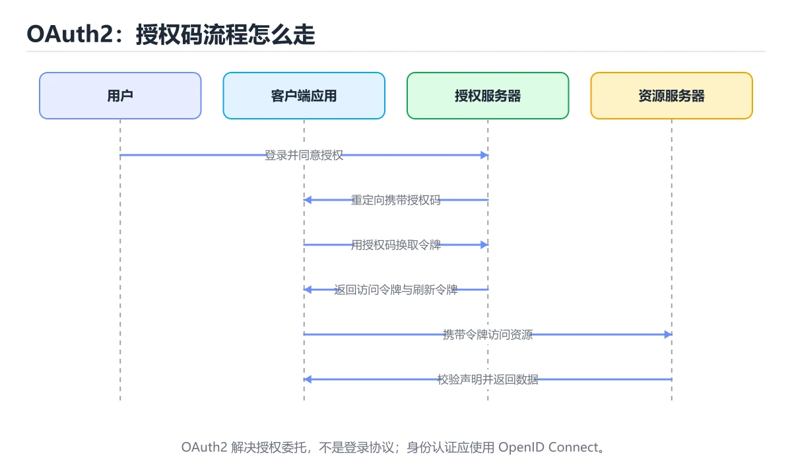
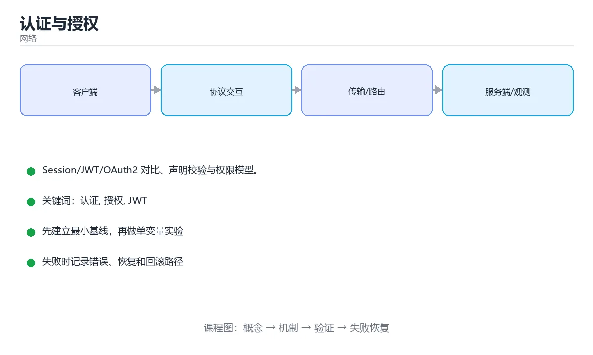

# 认证与授权





> 内容更新时间：2026-10-06 · 学习阶段：进阶 · 预计用时：30 分钟

## 学习目标

- 能用自己的话解释认证与授权解决了什么问题，而不是只背术语。
- 能说清 「认证」、「授权」、「JWT」、「OAuth2」 之间的关系，并分别举出一个例子。
- 能把 认证 放回「认证与授权」的知识体系，说明它和 授权 的边界。
- 能完成本课练习，并用验收标准检查自己的结果。

> 一句话摘要：Session/JWT/OAuth2 对比、声明校验与权限模型。

## 前置知识

- 先完成上一课《实战：抓包分析一次真实请求》；如果已经掌握，可以直接用本课练习自测。
- 开始前先复习：认证、授权、JWT。
- 卡在 认证 上时不要跳过：把输入、预期和实际输出写成三行，再回头读正文。

## 两个概念先分清

**认证（Authentication）**回答"你是谁"；**授权（Authorization）**回答"你能做什么"。二者常被混为一谈，但实现与故障排查完全不同：401 是没通过认证，403 是已认证但无权限。

## 会话方案对比

| 方案 | 存储 | 优点 | 缺点 |
| --- | --- | --- | --- |
| Session + Cookie | 服务端存会话 | 可即时失效、实现简单 | 多实例需共享存储（Redis） |
| JWT | 客户端存令牌 | 无状态、易水平扩展 | 无法即时撤销、令牌膨胀 |
| OAuth2 / OIDC | 授权服务器 | 标准协议、支持第三方登录 | 流程复杂，需正确校验 |

实践建议：**同为自有系统，Session + Redis 更简单可靠**；需要跨服务无状态或对外提供 API 时用 JWT，并把有效期设短（如 15 分钟）配刷新令牌。

## JWT 的正确用法

三段式：header.payload.signature。要点：① 必须校验签名与算法（拒绝 `alg: none`）；② 校验 exp/nbf/iss/aud 四个声明；③ 载荷只放非敏感信息（任何人都能解码）；④ 用密钥轮换（kid）支持平滑换钥；⑤ 泄露后无法撤销，因此要配合短期有效 + 黑名单/版本号机制。

## OAuth2 四种授权模式

| 模式 | 适用 | 注意 |
| --- | --- | --- |
| 授权码 + PKCE | 前端与移动端（推荐） | 必须用 PKCE，禁止隐式模式 |
| 客户端凭证 | 服务间调用 | 只代表应用身份，无用户上下文 |
| 密码模式 | 遗留系统 | 已被标准弃用，新项目不要用 |
| 设备码 | 电视等无输入设备 | 用户在另一设备确认 |

## 权限模型与落地

| 模型 | 说明 | 适用 |
| --- | --- | --- |
| RBAC | 用户 → 角色 → 权限 | 绝大多数后台系统 |
| ABAC | 按属性（部门、时间、资源标签）动态判定 | 复杂合规要求 |
| ReBAC | 按关系图判定（如"文档的协作者"） | 协作类产品 |

落地要点：**每次请求都在服务端鉴权**（不能只靠前端隐藏按钮）；资源级校验必须带 owner 条件（防水平越权）；权限变更后要有生效机制（Session 方案可即时失效，JWT 需配合版本号）。

## 本课小结

认证与授权的核心是**分清身份与权限、选对令牌形态、并在每次请求上做服务端校验**；401/403 的区分、JWT 的四项声明校验、资源级 owner 检查是三个最容易出问题的点。

## 认证与授权速查

| 概念 | 含义 |
| --- | --- |
| 认证（AuthN） | 你是谁 |
| 授权（AuthZ） | 你能做什么 |
| 401 Unauthorized | 未认证或凭证失效 |
| 403 Forbidden | 已认证但无权限 |
| 会话 Cookie | 服务端保存状态，浏览器自动携带 |
| Token | 客户端持有凭证，服务端校验签名 |
| JWT | 自包含声明，注意无法主动失效 |

## OAuth 2.0 授权模式速查

| 模式 | 适用 | 说明 |
| --- | --- | --- |
| 授权码 + PKCE | 移动端、SPA、Web | 推荐默认选择 |
| 客户端凭证 | 服务间调用 | 无用户上下文 |
| 设备码 | 电视、CLI | 在另一设备完成授权 |
| 隐式模式 | 已废弃 | 令牌暴露在 URL |
| 密码模式 | 已废弃 | 直接传用户名口令 |

令牌使用速查：

| 令牌 | 生命周期 | 存放位置 |
| --- | --- | --- |
| access_token | 短（分钟级） | 内存，避免长期存储 |
| refresh_token | 长（天到月） | 安全存储，可吊销 |
| id_token | 短 | 前端解析用户信息（校验签名） |

```python
import base64
import hashlib
import hmac
import json
import secrets
import time

def b64url(data: bytes) -> str:
    return base64.urlsafe_b64encode(data).rstrip(b"=").decode()

def create_jwt(payload: dict, secret: bytes) -> str:
    """极简 JWT 生成（HS256）：生产请用成熟库。"""
    header = {"alg": "HS256", "typ": "JWT"}
    body = {**payload, "exp": int(time.time()) + 900, "iat": int(time.time())}
    segments = [
        b64url(json.dumps(header, separators=(",", ":")).encode()),
        b64url(json.dumps(body, separators=(",", ":")).encode()),
    ]
    signing_input = ".".join(segments).encode()
    signature = hmac.new(secret, signing_input, hashlib.sha256).digest()
    return ".".join(segments + [b64url(signature)])

def verify_jwt(token: str, secret: bytes, issuer: str) -> dict:
    """校验签名、有效期与签发者，任一不符即拒绝。"""
    try:
        header_b64, payload_b64, signature_b64 = token.split(".")
    except ValueError as exc:
        raise ValueError("令牌格式错误") from exc

    signing_input = f"{header_b64}.{payload_b64}".encode()
    expected = b64url(hmac.new(secret, signing_input, hashlib.sha256).digest())
    if not hmac.compare_digest(expected, signature_b64):
        raise ValueError("签名校验失败")

    payload = json.loads(base64.urlsafe_b64decode(payload_b64 + "=="))
    if payload.get("exp", 0) < time.time():
        raise ValueError("令牌已过期")
    if payload.get("iss") != issuer:
        raise ValueError("签发者不匹配")
    if "aud" not in payload:
        raise ValueError("缺少受众声明")
    return payload

def new_pkce_pair() -> tuple[str, str]:
    """PKCE：客户端生成 code_verifier 与对应的 challenge。"""
    verifier = secrets.token_urlsafe(64)
    challenge = b64url(hashlib.sha256(verifier.encode()).digest())
    return verifier, challenge

secret_key = b"demo-secret"
token = create_jwt({"sub": "user-1", "iss": "https://auth.example.com", "aud": "api"}, secret_key)
print(verify_jwt(token, secret_key, "https://auth.example.com")["sub"])
print(new_pkce_pair()[1][:16])
```

## 权限模型速查

| 模型 | 结构 | 适用 |
| --- | --- | --- |
| RBAC | 用户到角色到权限 | 大多数管理系统 |
| ABAC | 基于属性（部门、时间、地点） | 细粒度策略 |
| ReBAC | 基于关系（Google Zanzibar） | 文档与组织共享 |
| ACL | 每资源一张访问列表 | 简单共享场景 |

越权防护三层：**资源归属校验 + 角色权限校验 + 数据层过滤**（WHERE user_id = 当前用户）。

## 常见错误与排查

| 容易踩的做法 | 实际现象 | 原因与正确做法 |
| --- | --- | --- |
| 不校验 JWT 的 exp 与 aud | 过期或被错用的令牌有效 | 校验签名、exp、iss、aud 全部声明 |
| 用 JWT 存敏感数据 | 信息泄漏 | JWT 只含必要标识，敏感数据放服务端 |
| 只校验登录不校验归属 | 水平越权 | 每次访问校验资源归属 |
| access_token 有效期过长 | 泄漏影响面大 | 短过期 + refresh_token 轮换 |
| refresh_token 不可吊销 | 被盗后长期可用 | 支持吊销与轮换，检测重放 |
| 令牌放 localStorage | XSS 可窃取 | 优先 HttpOnly Cookie 或内存 |
| 到处用隐式模式 | 令牌出现在 URL | 用授权码 + PKCE |
| 密码明文或弱哈希 | 拖库即失守 | Argon2id + 随机盐 |
| 登录后不重置会话 ID | 会话固定攻击 | 登录成功后重新生成会话 |
| 权限判断散落各处 | 容易漏判 | 集中式鉴权中间件 + 数据层过滤 |

## 复习与自测

- [ ] 分得清 401 与 403 的使用场景。
- [ ] 令牌校验覆盖签名、exp、iss、aud。
- [ ] 移动端与 SPA 使用授权码 + PKCE。
- [ ] 所有资源访问都校验归属（防水平越权）。
- [ ] 会话登录后重置，令牌可吊销并可轮换。

## 动手练习

> 本课练习重点：围绕「认证、授权、JWT」完成复述、实验和交付，每个结果都要能被别人检查。

先抓一次真实请求或画出 认证 的协议交互，再注入延迟或丢包并解释变化。

### 练习 1：建立心智模型（10 分钟）

合上教程，用 3～5 句话回答：

1. 认证与授权解决了什么问题？
2. 如果没有它，会出现什么具体后果？
3. 它和「授权」是什么关系？

验收标准：用自己的话解释 认证，并给出一个它不成立的反例。

### 练习 2：做一次可控实验（20 分钟）

从正文中选一个最小示例，完成以下操作：

1. 先预测修改一个参数、输入或步骤后的结果。
2. 再实际执行或逐步推演，记录真实结果。
3. 如果结果与预测不同，写出差异原因。

**验收标准**：先在「两个概念先分清」里找一个可运行的最小输入，再按五步法记录认证的影响；预测与结果不一致时补写被忽略的前提。

### 练习 3：交付一个小结果（30 分钟）

画出一张 认证 的报文或时序图，标出每一跳的地址、协议与失败点。

任务要求：

- 结果必须能被别人检查，不能只写“我已经理解了”。
- 至少覆盖「认证」和「授权」两个关键词。
- 写出 1 个仍然不确定的问题，以及下一步如何验证。

> 提示：时间有限时优先做练习 1 和练习 2；练习 3 可以拆成两次完成。

## 可运行练习

本节围绕认证与授权安排 3 个可交付任务，每个任务都要求留下可以复查的记录。

### 任务 1：用自己的话画出结构

不看书，用一张图说清「认证与授权」的结构，画完再对照骨架：

- 主干：两个概念先分清 → 会话方案对比 → JWT 的正确用法 → OAuth2 四种授权模式
- 连接线：在每条边上标出输入、输出与失败路径。
- 自检：能否用一句话说明认证与授权的关系？

### 任务 2：做一次对比实验

**验收标准**：对照表两列都要有证据（命令、输出或数据），并注明认证与授权哪一个才是决定性变量。

### 任务 3：迁移到自己的场景

**验收标准**：换一个人按你的记录重跑 urlsafe_b64encode，能得到相同输出；得不到就补写缺失的前提。

## 故障现场

### 现场 1：不校验 JWT 的 exp 与 aud

**症状**：在《认证与授权》的复现场景中，过期或被错用的令牌有效。

**根因**：当出现“不校验 JWT 的 exp 与 aud”时，执行路径已经绕过了《认证与授权》的关键约束，最终以“过期或被错用的令牌有效”暴露出来；修复前必须先确认约束在哪里失效。

**修复**：针对《认证与授权》的问题，校验签名、exp、iss、aud 全部声明。

**验证**：在《认证与授权》中按“校验签名、exp、iss、aud 全部声明”调整后，从“不校验 JWT 的 exp 与 aud”的触发条件重放同一条路径，确认“过期或被错用的令牌有效”不再出现，并补一个相邻边界用例检查没有引入新问题。

### 现场 2：access_token 有效期过长

**症状**：在《认证与授权》的复现场景中，泄漏影响面大。

**根因**：“泄漏影响面大”只是表层结果。向上追溯会落到“access_token 有效期过长”这一步，因为它省略了《认证与授权》的约束，使实现行为和预期模型发生了偏离。

**修复**：针对《认证与授权》的问题，短过期 + refresh_token 轮换。

**验证**：保留《认证与授权》里触发“泄漏影响面大”的输入、版本和日志，按“短过期 + refresh_token 轮换”完成修改后原样重放；只有失败现象消失且相邻场景仍可解释，才保留改动。

### 现场 3：refresh_token 不可吊销

**症状**：在《认证与授权》的复现场景中，被盗后长期可用。

**根因**：触发点是把“refresh_token 不可吊销”当成安全做法。它没有满足《认证与授权》要求的前提，因此先表现为“被盗后长期可用”；排查时先完整复现这一段，再核对输入、配置与依赖。

**修复**：针对《认证与授权》的问题，支持吊销与轮换，检测重放。

**验证**：先在《认证与授权》中记录“refresh_token 不可吊销”留下的失败证据，再执行“支持吊销与轮换，检测重放”并重放；确认错误路径变为明确结果，且修复没有掩盖同类故障。

## 深入补充：认证与授权 的取舍与边界

### 一、把概念放回真实约束

学习认证与授权时，最容易只记住结论而忽略前提。先写出三个约束：数据规模、时间预算、可接受的失败方式；再判断 认证 与 授权 在这些约束下是否仍然成立。只要约束改变，原来的最优解就可能变成错误解。

| 场景 | 协议或方案 | 延迟与可靠性 | 排障入口 |
| --- | --- | --- | --- |
| 强一致请求 | TCP / HTTP | 可靠但可能队头阻塞 | 连接与重传指标 |
| 实时音视频 | UDP / QUIC | 低延迟但允许丢包 | 抖动与丢包率 |
| 大规模分发 | CDN 与缓存 | 就近命中 | 命中率与回源 |
| 服务间调用 | RPC 或消息队列 | 取决于确认机制 | 超时、重试与幂等 |

### 二、三个容易混淆的边界

1. 澄清输入与目标。先写清「认证与授权」要解决的问题、合法输入范围和成功标准，再进入后续步骤。
2. **把“平均值”当成“全部”**：认证 的指标好看，不代表尾部请求、冷启动或失败重试也好看。
3. **把“当前版本”当成“永久行为”**：授权 依赖的默认值、API 或性能特征都可能随版本变化，需要固定版本并保留回归用例。

### 三、一个生产场景

假设团队要在真实系统里使用认证与授权：第一周先做小流量验证，记录 认证 的基线与异常；第二周扩大输入规模，观察 授权 是否成为瓶颈；第三周再做故障演练，主动注入超时、重复请求和依赖不可用，确认系统能降级、能重试、能恢复。每一步都要留下指标、日志和结论，而不是只留下“感觉更快了”。

### 四、自测清单

- 能否用一句话说出认证与授权解决的核心问题与不适用场景？
- 能否画出 认证 的数据流或状态变化，并标出失败路径？
- 能否给出一个反例，证明 认证 的结论在边界条件下不成立？
- 能否写出一条可复现的验证命令，让别人独立得到相同结论？

## 本课复习清单

离开本课前，逐项确认：

- [ ] 不看解析，能说出「HTTP 401 与 403 的区别是？」的判断依据。
- [ ] 不看解析，能说出「使用 JWT 时必须校验的声明包括？」的判断依据。
- [ ] 不看解析，能说出「服务端防止水平越权的关键是？」的判断依据。
- [ ] 不看解析，能说出「OAuth 2.0 授权码模式推荐配合 PKCE 的原因是？」的判断依据。
- [ ] 不看解析，能说出「access_token 与 refresh_token 的分工是？」的判断依据。
- [ ] 用 认证 构造一个正常输入和一个边界输入，分别记录输出与判断依据。
- [ ] 把本课最容易混淆的两个概念写成一句话对照。

| 复盘项 | 记录 |
| --- | --- |
| 已经能独立解释的考点 |  |
| 仍然说不清的概念 |  |
| 下一步验证动作 |  |

## 术语速查

把「认证与授权」里反复出现的术语集中放在一起。复习时先遮住右列，尝试用自己的话解释，再回到正文核对。

| 术语 | 一句话说明 |
| --- | --- |
| `认证` | 验证用户或服务的身份是否真实。 |
| `授权` | 在认证之后判断主体能访问哪些资源、执行哪些操作。 |
| `JWT` | 落地要点：每次请求都在服务端鉴权（不能只靠前端隐藏按钮）；资源级校验必须带 owner 条件（防水平越权）；权限变更后要有生效机制（Session 方案可即时失效，JWT 需配合版本号）。 |
| `OAuth2` | 授权框架：第三方应用用授权码换访问令牌，在用户不交出密码的前提下访问受保护资源。 |
| `RBAC` | 基于角色的访问控制，把权限授予角色，再给用户分配角色。 |
| `PKCE` | 授权码流程的扩展：客户端生成并校验 code_verifier，防止授权码被截获后换令牌 |

## 代码对照与验证

这一节把授权码流程拆成可观察的每一步，并给出令牌校验的最小实现。

### 对照一：授权码 + PKCE 流程

```text
浏览器                应用后端              授权服务器
  |-- 1. 生成 code_verifier 与 code_challenge -->|
  |-- 2. 跳转授权端点（带 challenge） ---------->|
  |<-- 3. 返回授权码 ----------------------------|
  |-- 4. 用授权码 + verifier 换令牌 ------------>|
  |<-- 5. 返回 access_token / refresh_token -----|
```

PKCE 让公开客户端不必内置密钥：即使授权码被截获，没有 `code_verifier` 也换不到令牌。

### 对照二：JWT 载荷校验

```python
import base64
import hashlib
import hmac
import json

def b64url(data: bytes) -> str:
    return base64.urlsafe_b64encode(data).rstrip(b"=").decode()

header = b64url(json.dumps({"alg": "HS256", "typ": "JWT"}).encode())
payload = b64url(json.dumps({"sub": "u1", "exp": 1893456000}).encode())
signing_input = f"{header}.{payload}".encode()
signature = b64url(hmac.new(b"secret", signing_input, hashlib.sha256).digest())
token = f"{header}.{payload}.{signature}"
print(token.split(".")[2] == signature)
```

校验时必须先验证签名，再检查 `exp`、`aud`、`iss`；顺序颠倒会让攻击者用未签名的载荷探测系统。

### 对照三：常见错误对照

| 错误做法 | 后果 | 修正 |
| --- | --- | --- |
| 把令牌放在 URL 参数 | 进入日志与浏览器历史 | 用 Authorization 头或 HttpOnly Cookie |
| 只在前端校验过期 | 过期令牌仍可访问接口 | 服务端每次校验签名与 exp |
| refresh_token 永不过期 | 泄露后长期可用 | 轮换并绑定设备或会话 |

### 验证清单

- 授权码只能使用一次，重放会被拒绝。
- 令牌校验同时检查签名、有效期、受众与签发者。
- 退出登录会失效服务端会话，而不只是清除本地存储。

## 考点精讲

### 考点 1：概念判断·认证

- **题目**：HTTP 401 与 403 的区别是？
- **判断依据**：在「认证与授权」里，401 是未通过认证。区分二者能快速定位是登录问题还是权限问题。「认证与授权」要求先交代认证、授权、JWT的前提再下结论，所以“401 是未通过认证”只在题干“HTTP 401 与 403 的区别是”给定的条件下成立。把“401 是未通过认证”代回「认证与授权」里“HTTP 401 与 403 的区别是”的例子核对，条件一旦改变，结论就要用认证、授权、JWT重新推导。

### 考点 2：代码阅读·令牌校验

- **题目**：阅读这段令牌签发与校验代码，下面哪项判断是正确的？
- **正确判断**：令牌设了 900 秒过期，服务端仍必须校验签名并检查 exp，不能只解码 payload
- **判断依据**：正确判断是令牌设了 900 秒过期，服务端仍必须校验签名并检查 exp，不能只解码 payload。认证确认调用者身份，授权决定它能访问什么，两者不能混为一谈。JWT 的 payload 只是 Base64 编码而非加密，任何人都能读取甚至改写，所以服务端必须固定允许的签名算法、校验签名与过期时间，并核对签发方与受众；HS256 是对称算法，验签方持有同一密钥，泄漏后果等同于签发权限。

### 考点 3：多选辨析·认证

- **题目**：围绕“认证与授权”中的 认证、授权、JWT，下列哪两项是本课强调的实践判断？
- **判断依据**：本课把认证与授权拆成概念、示例与故障现场三部分，因此判断 认证 时必须同时交代输入、输出和失败路径，这使“学习 认证 时要同时说明输入、输出和失败路径，不能只看正常流程”成立。在认证与授权里，判断 授权 时要固定版本与边界输入，所以“验证 授权 时要固定版本并覆盖边界输入，结论才可复现”才可复现。

### 考点 4：概念判断·认证

- **题目**：OAuth 2.0 授权码模式推荐配合 PKCE 的原因是？
- **判断依据**：在「认证与授权」里，结论应落在「用一次性校验值防止授权码被拦截后换到令牌」。移动端与 SPA 无法安全保存 clientsecret，PKCE 已成为标准做法。在「认证与授权」里，这道题要求区分概念与边界，「用一次性校验值防止授权码被拦截后换到令牌」只有在题干给出的前提下才成立，而「为了省略 refresh_token」、「为了加快授权速度」缺少同一组条件。

### 考点 5：概念判断·认证

- **题目**：access_token 与 refresh_token 的分工是？
- **判断依据**：在「认证与授权」里，access_token 短期用于访问资源。缩短 accesstoken 有效期可限制泄露影响，refreshtoken 必须严格保管并支持吊销。回到「认证与授权」的正文示例，用“accesstoken 与 refr”走一遍认证、授权、JWT的完整流程，能复现的结论才可以保留。

### 考点 6：填空·认证

- **题目**：补全代码：「认证与授权」示例中，下面这行代码缺少哪个关键字或函数名？请填入 ____。 `____ = hmac.new(secret, signing_input, hashlib.sha256).digest`
- **判断依据**：在「认证与授权」里，signature。回到「认证与授权」的正文示例，用“补全代码”走一遍认证、授权、JWT的完整流程，能复现的结论才可以保留。回到认证、授权、JWT本身再看一遍：只有“signature”与题干“signature”的前提一致，结论才成立。

## English Overview

**Title:** Authentication & Authorization

**Summary:** Session/JWT/OAuth2, claim validation and permission models.

**Category:** Networking
**Level:** 高级
**Key terms:** 认证, 授权, JWT, OAuth2, RBAC

## 内容元数据

- 内容版本：v2.0
- 最后更新：2026-10-06
- 学习阶段：进阶
- 适用环境：TCP/IP、HTTP/2、HTTP/3 与现代网络栈；本课聚焦其中的 认证。
- 内容来源：内置结构化课程与工程实践整理
- 相关主题：认证、授权、JWT、OAuth2、RBAC
- 质量版本：P0 测验标准 + P1 覆盖扩展 + P2 体验补全

## 参考资料与复核

- 最后复核：2026-10-04
- 下次复核：2027-06-24
- 复核范围：版本兼容、API 行为、安全建议与工程实践
- 来源性质：官方文档、标准或权威教材；正文为离线教学重组

| 参考资料 | 本课用途 |
| --- | --- |
| [MDN HTTP](https://developer.mozilla.org/docs/Web/HTTP) | 浏览器视角的 HTTP |
| [RFC 9000 QUIC](https://www.rfc-editor.org/rfc/rfc9000) | QUIC 传输与连接迁移 |
| [RFC 9293 TCP](https://www.rfc-editor.org/rfc/rfc9293) | TCP 连接、重传与拥塞 |

> 「认证与授权」的链接用于离线阅读后的延伸核对；App 不会自动联网。

