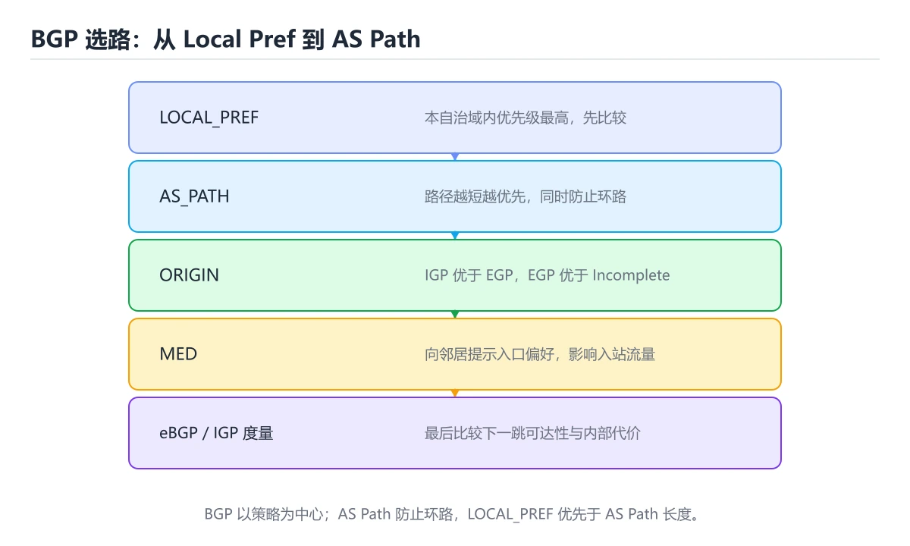
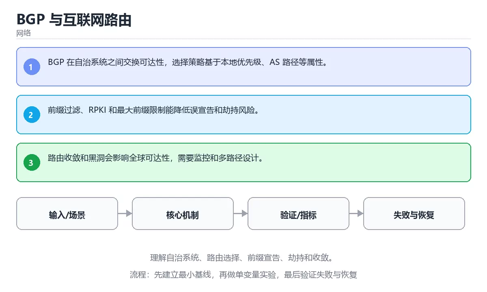

# BGP 与互联网路由





> 内容更新时间：2026-10-03 · 学习阶段：高级 · 预计用时：25 分钟

## 学习目标

- 能用自己的话解释：BGP 在自治系统之间交换可达性，选择策略基于本地优先级、AS 路径等属性。
- 能用自己的话解释：前缀过滤、RPKI 和最大前缀限制能降低误宣告和劫持风险。
- 能用自己的话解释：路由收敛和黑洞会影响全球可达性，需要监控和多路径设计。
- 能把本课知识放回「网络」，并完成练习与测验。

## 前置知识

- 已完成「网络」的基础课程，能运行正文中的最小示例。
- 本课关键词：BGP、自治系统、路由劫持、收敛。
- 遇到不熟悉的术语先记录问题，完成练习后再回读。

## 核心知识

### 1. BGP 在自治系统之间交换可达性，选择策略基于本地优先级、AS 路径等属性。

- 它解决的问题：把「BGP 在自治系统之间交换可达性，选择策略基于本地优先级、AS 路径等属性。」放回真实场景，说明不做它会带来什么后果。
- 关键做法：先用最小示例建立基线，再逐步加入边界、失败和性能条件。
- 验证标准：结果可复现、错误可解释、边界有测试、失败能恢复。

### 2. 前缀过滤、RPKI 和最大前缀限制能降低误宣告和劫持风险。

- 它解决的问题：把「前缀过滤、RPKI 和最大前缀限制能降低误宣告和劫持风险。」放回真实场景，说明不做它会带来什么后果。
- 关键做法：先用最小示例建立基线，再逐步加入边界、失败和性能条件。
- 验证标准：结果可复现、错误可解释、边界有测试、失败能恢复。

### 3. 路由收敛和黑洞会影响全球可达性，需要监控和多路径设计。

- 它解决的问题：把「路由收敛和黑洞会影响全球可达性，需要监控和多路径设计。」放回真实场景，说明不做它会带来什么后果。
- 关键做法：先用最小示例建立基线，再逐步加入边界、失败和性能条件。
- 验证标准：结果可复现、错误可解释、边界有测试、失败能恢复。

## 关键流程

```text
输入 → 校验 → 核心处理 → 验证 → 记录指标 → 失败恢复
```

## 实践路径

1. 用一句话复述本课要解决的问题。
2. 跑通正文中的最小示例并记录基线。
3. 只改变一个输入或参数，预测并验证结果。
4. 补一个失败路径，记录错误、恢复和指标。
5. 把结论写成可复现的笔记或测试。

## 常见误区

| 误区 | 后果 | 修正 |
| --- | --- | --- |
| 只记术语不做实验 | 遇到真实问题无法判断 | 用最小输入跑通并记录结果 |
| 只测正常路径 | 边界和故障上线才暴露 | 补空值、极值和依赖失败 |
| 没有基线就优化 | 无法证明改进有效 | 先测量再修改 |
| 忽略成本与安全 | 性能和风险失控 | 同时记录资源、权限与失败代价 |

## 动手练习

1. 合上教程，用 3～5 句话解释「BGP 与互联网路由」。
2. 从正文选一个例子，改变一个条件并预测结果。
3. 设计一个失败场景，写出止损与恢复步骤。

**验收标准**：留下输入、命令、输出、差异和下一步问题。

## 本课小结

- 本课属于「网络」，核心关键词是 BGP、自治系统、路由劫持、收敛。
- 先保证正确与可复现，再讨论性能和扩展。
- 完成练习和测验后，把仍然不确定的问题写成下一轮验证清单。

> 本课由 P1 内容扩展生成，重点补充原有课程缺失的主题与工程边界。


## 深入理解：BGP 与互联网路由

### 自治系统与路径向量

互联网由数万个自治系统（AS）组成，BGP 负责在 AS 之间交换可达性。它不传播完整的
网络拓扑，而是传播「到某个前缀需要经过哪些 AS」的路径向量。AS_PATH 既用于选路，
也用于防环：收到包含自己 AS 号的路由直接丢弃。iBGP 在同一 AS 内同步路由，
eBGP 在 AS 之间传递，二者在下一跳与规则上并不相同。

### 选路靠属性而不是最短路径

BGP 依次比较权重、本地优先级、本地起源、AS_PATH 长度、起源类型、MED 等属性，
最后才用路由器 ID 打破平局。因此「跳数最少」并不总是被选中：策略、商业关系和
流量工程都会影响结果。调试时要先确认是哪一条属性造成了差异，而不是只看路径长度。

### 汇聚、劫持与防护

路由汇聚能缩小表项，但配置不当会造成黑洞或子前缀冲突。前缀劫持则是某个 AS
错误地宣告了不属于自己的地址段。RPKI 通过签名证明「这个 AS 有权宣告这个前缀」，
配合路由过滤可以显著降低风险。运维上还要监控前缀数量突变与路径异常。

## 考点精讲：把测验题还原成判断过程

本课有 5 个判断点。先自己作答，再看「判断依据」；如果结论正确但理由不完整，回到正文对应章节补足概念。

### 考点 1：关于「BGP 在自治系统之间交换可达性 选…」，下列说法正确的是？

- **正确判断**：BGP 在自治系统之间交换可达性，选择策略基于本地优先级、AS 路径等属性。
- **判断依据**：正确答案是「BGP 在自治系统之间交换可达性，选择策略基于本地优先级、AS 路径等属性。」，本课在「深入理解：BGP 与互联网路由」中说明：互联网由数万个自治系统（AS）组成，BGP 负责在 AS 之间交换可达性。，本课在「核心知识」中说明：它解决的问题：把BGP 在自治系统之间交换可达性，选择策略基于本地优先级、AS 路径等属性。，本课在「本课小结」中说明：本课属于「网络」，核心关键词是 BGP、自治系统、路由劫持、收敛。
- **迁移检查**：如果给某个错误选项去掉一个限定词，它会不会变成正确？说明理由。

### 考点 2：关于「前缀过滤、RPKI 和最大前缀限制能…」，下列说法正确的是？

- **正确判断**：前缀过滤、RPKI 和最大前缀限制能降低误宣告和劫持风险。
- **判断依据**：正确答案是「前缀过滤、RPKI 和最大前缀限制能降低误宣告和劫持风险。」，本课在「本课小结」中说明：本课属于「网络」，核心关键词是 BGP、自治系统、路由劫持、收敛。，本课在「核心知识」中说明：它解决的问题：把前缀过滤、RPKI 和最大前缀限制能降低误宣告和劫持风险。，本课在「深入理解：BGP 与互联网路由」中说明：互联网由数万个自治系统（AS）组成，BGP 负责在 AS 之间交换可达性。
- **迁移检查**：把题干里的一个条件换成边界值，原来的结论还成立吗？写出判断过程。

### 考点 3：关于「路由收敛和黑洞会影响全球可达性 需要…」，下列说法正确的是？

- **正确判断**：路由收敛和黑洞会影响全球可达性，需要监控和多路径设计。
- **判断依据**：正确答案是「路由收敛和黑洞会影响全球可达性，需要监控和多路径设计。」，本课在「本课小结」中说明：本课属于「网络」，核心关键词是 BGP、自治系统、路由劫持、收敛。，本课在核心知识中说明：它解决的问题：把路由收敛和黑洞会影响全球可达性，需要监控和多路径设计。互联网由数万个自治系统（AS）组成，BGP 负责在 AS 之间交换可达性。
- **迁移检查**：如果给某个错误选项去掉一个限定词，它会不会变成正确？说明理由。

### 考点 4：「BGP 与互联网路由」的核心学习目标是什么？

- **正确判断**：理解自治系统、路由选择、前缀宣告、劫持和收敛。
- **判断依据**：正确答案是「理解自治系统、路由选择、前缀宣告、劫持和收敛。」，本课在「深入理解：BGP 与互联网路由」中说明：互联网由数万个自治系统（AS）组成，BGP 负责在 AS 之间交换可达性。，本课在核心知识中说明：它解决的问题：把BGP 在自治系统之间交换可达性，选择策略基于本地优先级、AS 路径等属性。本课还在核心知识中说明：它解决的问题：把前缀过滤、RPKI 和最大前缀限制能降低误宣告和劫持风险。
- **迁移检查**：把题干里的一个条件换成边界值，原来的结论还成立吗？写出判断过程。

### 考点 5：以下哪些术语与「BGP 与互联网路由」直接相关？（多选）

- **正确判断**：BGP、自治系统
- **判断依据**：正确答案是「BGP、自治系统」，本课在「核心知识」中说明：它解决的问题：把BGP 在自治系统之间交换可达性，选择策略基于本地优先级、AS 路径等属性。本课还在核心知识中说明：它解决的问题：把路由收敛和黑洞会影响全球可达性，需要监控和多路径设计。本课还在「深入理解：BGP 与互联网路由」中说明：也用于防环：收到包含自己 AS 号的路由直接丢弃。
- **迁移检查**：每个正确项各自成立的条件是什么？有没有互相依赖。

## 本课复习清单

离开本课前，逐项确认：

- [ ] 不看解析，能说出「关于「BGP 在自治系统之间交换可达性 选…」，下列说法正确的是？」的判断依据。
- [ ] 不看解析，能说出「关于「前缀过滤、RPKI 和最大前缀限制能…」，下列说法正确的是？」的判断依据。
- [ ] 不看解析，能说出「关于「路由收敛和黑洞会影响全球可达性 需要…」，下列说法正确的是？」的判断依据。
- [ ] 不看解析，能说出「「BGP 与互联网路由」的核心学习目标是什么？」的判断依据。
- [ ] 不看解析，能说出「以下哪些术语与「BGP 与互联网路由」直接相关？（多选）」的判断依据。
- [ ] 至少运行一次本课示例，记录输入、输出和一个边界情况。
- [ ] 把本课最容易混淆的两个概念写成一句话对照。

| 复盘项 | 记录 |
| --- | --- |
| 已经能独立解释的考点 |  |
| 仍然说不清的概念 |  |
| 下一步验证动作 |  |

## 逐节复习与自检

下面按正文顺序回顾每一节，并给出一个自检问题；说不清的地方回到原章节补课。

### 核心知识

」放回真实场景，说明不做它会带来什么后果。关键做法：先用最小示例建立基线，再逐步加入边界、失败和性能条件。

自检：这一节与相邻主题的边界在哪里？

### 动手练习

合上教程，用 3～5 句话解释「BGP 与互联网路由」。从正文选一个例子，改变一个条件并预测结果。

自检：如果去掉这一节里的一个前提，结论会怎样变化？

### 深入理解：BGP 与互联网路由

互联网由数万个自治系统（AS）组成，BGP 负责在 AS 之间交换可达性。网络拓扑，而是传播「到某个前缀需要经过哪些 AS」的路径向量。

自检：这一节的关键输入与输出分别是什么？

### 验证步骤

制造一次错误输入，记录错误信息与修复方式。

自检：如果去掉这一节里的一个前提，结论会怎样变化？

## 易错点回顾

下面把本课最容易判断错的地方集中成一张清单，复习时先自己回答，再对照解析补全理由。

- **关于「BGP 在自治系统之间交换可达性 选…」，下列说法正确的是？**：正确答案是「BGP 在自治系统之间交换可达性，选择策略基于本地优先级、AS 路径等属性。
- **关于「前缀过滤、RPKI 和最大前缀限制能…」，下列说法正确的是？**：正确答案是「前缀过滤、RPKI 和最大前缀限制能降低误宣告和劫持风险。
- **关于「路由收敛和黑洞会影响全球可达性 需要…」，下列说法正确的是？**：正确答案是「路由收敛和黑洞会影响全球可达性，需要监控和多路径设计。
- **「BGP 与互联网路由」的核心学习目标是什么？**：正确答案是「理解自治系统、路由选择、前缀宣告、劫持和收敛。
- **以下哪些术语与「BGP 与互联网路由」直接相关？（多选）**：正确答案是「BGP、自治系统」，本课在「核心知识」中说明：它解决的问题：把BGP 在自治系统之间交换可达性，选择策略基于本地优先级、AS 路径等属性。

## 术语速查

把本课反复出现的术语集中放在一起。复习时先遮住右列，尝试用自己的话解释，再回到正文核对。

| 术语 | 本课语境 |
| --- | --- |
| `BGP` | 本课围绕该主题展开，结合正文与代码示例理解它的适用边界。 |
| `自治系统` | 本课围绕该主题展开，结合正文与代码示例理解它的适用边界。 |
| `路由劫持` | 本课围绕该主题展开，结合正文与代码示例理解它的适用边界。 |
| `收敛` | 本课围绕该主题展开，结合正文与代码示例理解它的适用边界。 |

## 面试问答与自测

下面把本课考点换成面试追问。先口述自己的答案，
再对照参考回答检查是否遗漏了前提、边界或失败路径。

### 追问 1：关于「BGP 在自治系统之间交换可达性 选…」，下列说法正确的是？

**参考回答**：正确答案是「BGP 在自治系统之间交换可达性，选择策略基于本地优先级、AS 路径等属性。」，本课在「核心知识」中说明：它解决的问题：把BGP 在自治系统之间交换可达性，选择策略基于本地优先级、AS 路径等属性。，本课在「本课小结」中说明：本课属于「网络」，核心关键词是 BGP、自治系统、路由劫持、收敛。，本课在「深入理解：BGP 与互联网路由」中说明：互联网由数万个自治系统（AS）组成，BGP 负责在 AS 之间交换可达性。

### 追问 2：关于「前缀过滤、RPKI 和最大前缀限制能…」，下列说法正确的是？

**参考回答**：正确答案是「前缀过滤、RPKI 和最大前缀限制能降低误宣告和劫持风险。」，本课在「核心知识」中说明：它解决的问题：把前缀过滤、RPKI 和最大前缀限制能降低误宣告和劫持风险。，本课在「深入理解·BGP 与互联网路由」中说明：互联网由数万个自治系统（AS）组成，BGP 负责在 AS 之间交换可达性。，本课在「本课小结」中说明：本课属于「网络」，核心关键词是 BGP、自治系统、路由劫持、收敛。

### 追问 3：关于「路由收敛和黑洞会影响全球可达性 需要…」，下列说法正确的是？

**参考回答**：正确答案是「路由收敛和黑洞会影响全球可达性，需要监控和多路径设计。」，本课在「本课小结」中说明：本课属于「网络」，核心关键词是 BGP、自治系统、路由劫持、收敛。，本课在核心知识中说明：它解决的问题：把路由收敛和黑洞会影响全球可达性，需要监控和多路径设计。互联网由数万个自治系统（AS）组成，BGP 负责在 AS 之间交换可达性。

### 追问 4：「BGP 与互联网路由」的核心学习目标是什么？

**参考回答**：正确答案是「理解自治系统、路由选择、前缀宣告、劫持和收敛。」，本课在「本课小结」中说明：本课属于「网络」，核心关键词是 BGP、自治系统、路由劫持、收敛。，本课在「核心知识」中说明：它解决的问题：把前缀过滤、RPKI 和最大前缀限制能降低误宣告和劫持风险。，本课在「深入理解：BGP 与互联网路由」中说明：互联网由数万个自治系统（AS）组成，BGP 负责在 AS 之间交换可达性。本课还在「核心知识」中说明：它解决的问题：把BGP 在自治系统之间交换可达性，选择策略基于本地优先级、AS 路径等属性。

### 追问 5：以下哪些术语与「BGP 与互联网路由」直接相关？（多选）

**参考回答**：正确答案是「BGP、自治系统」，本课在「深入理解·BGP 与互联网路由」中说明：互联网由数万个自治系统（AS）组成，BGP 负责在 AS 之间交换可达性。本课还在核心知识中说明：它解决的问题：把路由收敛和黑洞会影响全球可达性，需要监控和多路径设计。本课还在「深入理解·BGP 与互联网路由」中说明：也用于防环：收到包含自己 AS 号的路由直接丢弃。

## 深度拓展与实战

这一节把正文里的定义、代码和失败模式串成一条可操作的复习路线。

### 机制拆解

- **1. BGP 在自治系统之间交换可达性，选择策略基于本地优先级、AS 路径等属性。**：1. BGP 在自治系统之间交换可达性，选择策略基于本地优先级、AS 路径等属性
- **2. 前缀过滤、RPKI 和最大前缀限制能降低误宣告和劫持风险。**：2. 前缀过滤、RPKI 和最大前缀限制能降低误宣告和劫持风险
- **3. 路由收敛和黑洞会影响全球可达性，需要监控和多路径设计。**：3. 路由收敛和黑洞会影响全球可达性，需要监控和多路径设计
- **自治系统与路径向量**：互联网由数万个自治系统（AS）组成，BGP 负责在 AS 之间交换可达性
- **选路靠属性而不是最短路径**：选路靠属性而不是最短路径

### 边界条件与常见反例

- **关于「BGP 在自治系统之间交换可达性 选…」，下列说法正确的是？**：正确答案是「BGP 在自治系统之间交换可达性，选择策略基于本地优先级、AS 路径等属性。」，本课在「核心知识」中说明：它解决的问题：把BGP 在自治系统之间交换可达性，选择策略基于本地优先级、AS 路径等属性。，本课在「本课小结」中说明：本课属于「网络」，核心关键词是 BGP、自治系统、路由劫持、收敛。，本课在「深入理解：BGP 与互联网路由」中说明：互联网由数万个自治系统（AS）组成，BGP 负责在 AS 之间交换可达性。
- **关于「前缀过滤、RPKI 和最大前缀限制能…」，下列说法正确的是？**：正确答案是「前缀过滤、RPKI 和最大前缀限制能降低误宣告和劫持风险。」，本课在「核心知识」中说明：它解决的问题：把前缀过滤、RPKI 和最大前缀限制能降低误宣告和劫持风险。，本课在「深入理解·BGP 与互联网路由」中说明：互联网由数万个自治系统（AS）组成，BGP 负责在 AS 之间交换可达性。，本课在「本课小结」中说明：本课属于「网络」，核心关键词是 BGP、自治系统、路由劫持、收敛。
- **关于「路由收敛和黑洞会影响全球可达性 需要…」，下列说法正确的是？**：正确答案是「路由收敛和黑洞会影响全球可达性，需要监控和多路径设计。」，本课在「本课小结」中说明：本课属于「网络」，核心关键词是 BGP、自治系统、路由劫持、收敛。，本课在核心知识中说明：它解决的问题：把路由收敛和黑洞会影响全球可达性，需要监控和多路径设计。互联网由数万个自治系统（AS）组成，BGP 负责在 AS 之间交换可达性。
- **「BGP 与互联网路由」的核心学习目标是什么？**：正确答案是「理解自治系统、路由选择、前缀宣告、劫持和收敛。」，本课在「本课小结」中说明：本课属于「网络」，核心关键词是 BGP、自治系统、路由劫持、收敛。，本课在「核心知识」中说明：它解决的问题：把前缀过滤、RPKI 和最大前缀限制能降低误宣告和劫持风险。，本课在「深入理解：BGP 与互联网路由」中说明：互联网由数万个自治系统（AS）组成，BGP 负责在 AS 之间交换可达性。本课还在「核心知识」中说明：它解决的问题：把BGP 在自治系统之间交换可达性，选择策略基于本地优先级、AS 路径等属性。

### 工程检查表

- [ ] 能否用自己的话说明BGP 与互联网路由解决什么问题，以及它不负责什么？
- [ ] 能否指出最小可运行示例的输入、输出和一条失败路径？
- [ ] 能否解释本课关键词在真实项目中的边界与取舍？
- [ ] 能否把本课方法迁移到另一个相近问题，并说明需要改什么？

### 迁移练习

1. 保持正文示例不变，写出它的输入、处理步骤和预期输出。
2. 只改变一个条件，预测结果并说明依据；再运行或手算验证。
3. 结合BGP、自治系统、路由劫持、收敛，写出一个真实项目中的使用场景。
4. 写下一个反例，说明它在什么条件下会使朴素做法失效。


## 深入理解：BGP 与互联网路由

### 自治系统与路径向量

互联网由数万个自治系统（AS）组成，BGP 负责在 AS 之间交换可达性。它不传播完整的
网络拓扑，而是传播「到某个前缀需要经过哪些 AS」的路径向量。AS_PATH 既用于选路，
也用于防环：收到包含自己 AS 号的路由直接丢弃。iBGP 在同一 AS 内同步路由，
eBGP 在 AS 之间传递，二者在下一跳与规则上并不相同。

### 选路靠属性而不是最短路径

BGP 依次比较权重、本地优先级、本地起源、AS_PATH 长度、起源类型、MED 等属性，
最后才用路由器 ID 打破平局。因此「跳数最少」并不总是被选中：策略、商业关系和
流量工程都会影响结果。调试时要先确认是哪一条属性造成了差异，而不是只看路径长度。

### 汇聚、劫持与防护

路由汇聚能缩小表项，但配置不当会造成黑洞或子前缀冲突。前缀劫持则是某个 AS
错误地宣告了不属于自己的地址段。RPKI 通过签名证明「这个 AS 有权宣告这个前缀」，
配合路由过滤可以显著降低风险。运维上还要监控前缀数量突变与路径异常。

## English Overview

**Title:** BGP and Internet Routing

**Summary:** Learn autonomous systems, route selection, prefix announcements, hijacking and convergence.

**Category:** Networking  
**Level:** 高级  
**Key terms:** BGP, 自治系统, 路由劫持, 收敛

> The full tutorial is written in Chinese. This bilingual overview helps English readers identify the topic, scope and key terms before studying the detailed examples.

## 内容元数据

- 内容版本：v2.0
- 最后更新：2026-10-03
- 学习阶段：高级
- 适用环境：TCP/IP、HTTP/2、HTTP/3 与现代网络栈
- 内容来源：内置结构化课程与工程实践整理
- 相关主题：BGP、自治系统、路由劫持、收敛
- 质量版本：P0 测验标准 + P1 覆盖扩展 + P2 体验补全


## 最小可运行示例

下面示例用于验证「BGP 与互联网路由」的最小输入、处理和输出。先原样运行，再只修改一个值：

```python
import socket

print(socket.gethostbyname("localhost"))
```

## 预期输出

```text
127.0.0.1
```

## 验证步骤

1. 记录运行环境、命令和真实输出。
2. 修改一个输入，先写预测再运行。
3. 制造一次错误输入，记录错误信息与修复方式。
4. 把结论写回本课笔记或测试用例。


## 参考资料与复核

- 最后复核：2026-10-04
- 下次复核：2027-04-04
- 复核范围：版本兼容、API 行为、安全建议与工程实践
- 来源性质：官方文档与标准；本课正文为离线教学重组，不复制原文

| 参考资料 | 本课用途 |
| --- | --- |
| [RFC Editor](https://www.rfc-editor.org/) | 互联网协议标准 |
| [MDN HTTP](https://developer.mozilla.org/docs/Web/HTTP) | HTTP 语义与浏览器行为 |

> 本课主题：理解自治系统、路由选择、前缀宣告、劫持和收敛。

> App 完全离线展示文字链接，不会自动联网；需要延伸阅读时可复制链接到浏览器。
