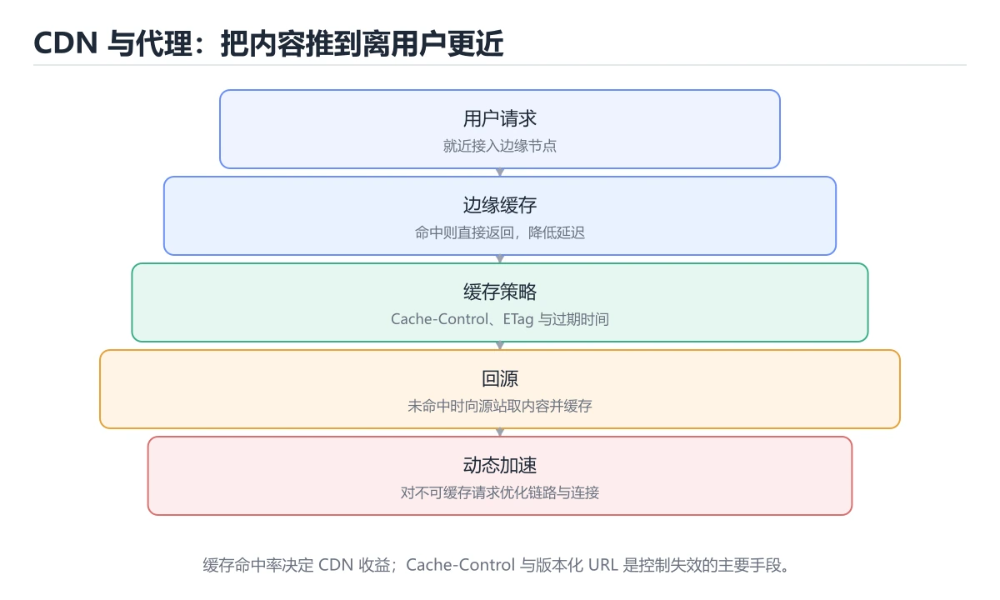
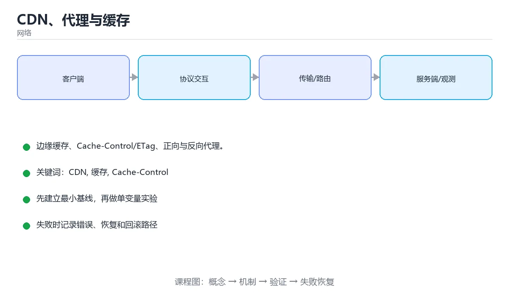

# CDN、代理与缓存





> 内容更新时间：2026-10-06 · 学习阶段：进阶 · 预计用时：30 分钟

## 学习目标

- 能用自己的话解释CDN、代理与缓存解决了什么问题，而不是只背术语。
- 能说清 「CDN」、「缓存」、「Cache-Control」、「ETag」 之间的关系，并分别举出一个例子。
- 能把 CDN 放回「CDN、代理与缓存」的知识体系，说明它和 缓存 的边界。
- 能完成本课练习，并用验收标准检查自己的结果。

> 一句话摘要：边缘缓存、Cache-Control/ETag、正向与反向代理。

## 前置知识

- 先完成上一课《HTTPS 与 TLS》；如果已经掌握，可以直接用本课练习自测。
- 开始前先复习：CDN、缓存、Cache-Control。
- 看不懂就直接缩小例子：只保留 CDN 相关的两行输入，跑通后再加回其余部分。

## 为什么需要 CDN

用户离源站越远，延迟越高。CDN 把静态资源缓存到**离用户最近的边缘节点**，同时分担源站流量。

```text
用户 -> 就近边缘节点（命中缓存直接返回）
           └─ 未命中 -> 回源到源站 -> 缓存并返回
```

## 缓存的关键机制

```http
Cache-Control: public, max-age=31536000, immutable
ETag: "abc123"
Last-Modified: Tue, 01 Oct 2026 00:00:00 GMT
```

| 机制 | 作用 |
| --- | --- |
| `Cache-Control: max-age` | 强缓存：有效期内不发请求 |
| `ETag` + `If-None-Match` | 协商缓存：内容没变返回 304 |
| `Cache-Control: no-store` | 完全不缓存，适合敏感数据 |
| CDN 刷新/预热 | 主动失效或提前加载缓存 |

静态资源常用「内容哈希文件名」做永久缓存：`app.9f2c1a.js`，内容变化则文件名变化，天然避免脏缓存。

## 正向代理与反向代理

| 类型 | 代理谁 | 典型用途 |
| --- | --- | --- |
| 正向代理 | 代表客户端 | 科学上网、企业出口、抓包 |
| 反向代理 | 代表服务器 | 负载均衡、TLS 卸载、限流、缓存 |

```nginx
# Nginx 反向代理 + 负载均衡
upstream backend {
    server 10.0.0.1:8080;
    server 10.0.0.2:8080;
}
server {
    listen 443 ssl;
    server_name example.com;
    location /api/ {
        proxy_pass http://backend;
        proxy_set_header X-Real-IP $remote_addr;
    }
}
```

反向代理转发时要带 `X-Forwarded-For` / `X-Real-IP`，否则后端只能看到代理的 IP。

## 常见错误与排查

1. 缓存没失效导致用户看到旧页面 → 检查缓存键与刷新策略。
2. 多级代理后拿到错误客户端 IP → 逐层检查转发头。
3. 动态接口被 CDN 缓存 → 对 `/api` 设置 `no-store` 或按参数设置缓存键。
4. HTTPS 到源站变 HTTP → 注意代理中的协议头与重定向循环。
| 容易踩的做法 | 实际现象 | 原因与正确做法 |
| --- | --- | --- |
| 静态资源不带指纹却设长缓存 | 发版后用户仍加载旧文件 | 文件名带哈希加长缓存 |
| 接口响应设 `max-age` | 用户看到过期数据 | 接口用 `no-store` 或短缓存加校验 |
| 用 `no-cache` 当「不缓存」 | 理解错误 | 它是每次校验，不缓存要用 `no-store` |
| 忘记 `Vary` | 压缩与非压缩内容串用 | 按 `Accept-Encoding` 等维度区分 |
| 私有数据被 CDN 缓存 | 数据泄漏 | 加 `private` 或 `no-store` |
| 刷新缓存不及时 | 用户看到旧内容 | 发版时主动 purge 或改路径 |
| 回源超时设得过长 | 慢请求拖垮连接 | 设置连接与读取超时并降级 |
| 不做命中率监控 | 优化无依据 | 记录 `X-Cache-Status` 与命中率 |
| 忽略跨域头与缓存的关系 | 偶发 CORS 失败 | 明确 `Vary: Origin` 或统一配置 |
| 认为加了 CDN 就一定快 | 回源率过高反而更慢 | 优化命中率与边缘节点覆盖 |

## 本课小结

CDN 是「缓存 + 就近分发」，代理是「中间转发」。理解 `Cache-Control`、`ETag` 与转发头，就能定位绝大多数缓存与 IP 问题。

## 缓存策略速查

| 头部 | 作用 |
| --- | --- |
| `Cache-Control: max-age=31536000, immutable` | 强缓存一年，适合带指纹的静态资源 |
| `Cache-Control: no-cache` | 可缓存但每次要校验 |
| `Cache-Control: no-store` | 完全不缓存，适合敏感数据 |
| `Cache-Control: private` | 只允许浏览器缓存，CDN 不缓存 |
| `Cache-Control: s-maxage=60` | 仅对共享缓存（CDN）生效 |
| `ETag` 与 `If-None-Match` | 协商缓存，未变返回 304 |
| `Last-Modified` 与 `If-Modified-Since` | 时间维度协商缓存 |
| `Vary: Accept-Encoding` | 按编码维度区分缓存 |
| `stale-while-revalidate=30` | 过期后先用旧值并后台刷新 |

## 代理类型速查

| 类型 | 代表谁 | 典型用途 |
| --- | --- | --- |
| 正向代理 | 客户端 | 出网统一管控、缓存、审计 |
| 反向代理 | 服务端 | 负载均衡、TLS 卸载、限流、灰度 |
| 透明代理 | 客户端（不可见） | 企业网关、运营商缓存 |
| API 网关 | 服务端 | 鉴权、配额、路由、协议转换 |

```nginx
# 反向代理 + 缓存 + 回源超时的配置骨架
proxy_cache_path /var/cache/nginx levels=1:2 keys_zone=app_cache:100m max_size=10g inactive=24h use_temp_path=off;

server {
    listen 443 ssl;
    server_name cdn.example.com;

    # 带指纹的静态资源：长期强缓存
    location ~* \.(js|css|png|jpg|woff2)$ {
        proxy_pass http://origin;
        proxy_cache app_cache;
        proxy_cache_valid 200 301 302 30d;
        add_header Cache-Control "public, max-age=31536000, immutable";
        add_header X-Cache-Status $upstream_cache_status;
    }

    # 接口：不缓存，并限制回源超时
    location /api/ {
        proxy_pass http://origin;
        proxy_cache off;
        add_header Cache-Control "no-store";
        proxy_connect_timeout 2s;
        proxy_read_timeout 5s;
    }
}
```

## 缓存问题与对策

| 问题 | 现象 | 对策 |
| --- | --- | --- |
| 缓存穿透 | 请求不存在的内容，全部回源 | 缓存空值、参数校验、布隆过滤器 |
| 缓存击穿 | 热点失效瞬间回源激增 | 互斥回源、逻辑过期、预热 |
| 缓存雪崩 | 大范围同时过期 | 过期时间加随机、分层缓存 |
| 缓存污染 | 长尾内容挤掉热点 | 分层策略与容量规划 |
| 回源带宽打满 | 源站被压垮 | 提高命中率、限速、合并回源 |
| 内容更新不及时 | 用户看到旧版本 | 主动刷新（purge）加版本化路径 |

## 复习与自测

- [ ] 能区分强缓存、协商缓存与 `no-store`。
- [ ] 静态资源用「指纹加长缓存」，接口用短缓存或不缓存。
- [ ] 知道 `s-maxage` 只对共享缓存生效。
- [ ] 会通过 `X-Cache-Status` 判断命中情况。
- [ ] 发版有主动刷新缓存的流程。

## 动手练习

> 本课练习重点：围绕「CDN、缓存、Cache-Control」完成复述、实验和交付，每个结果都要能被别人检查。

先抓一次真实请求或画出 CDN 的协议交互，再注入延迟或丢包并解释变化。

### 练习 1：建立心智模型（10 分钟）

合上教程，用 3～5 句话回答：

1. CDN、代理与缓存解决了什么问题？
2. 如果没有它，会出现什么具体后果？
3. 它和「缓存」是什么关系？

验收标准：回答里必须出现 CDN，并写出一个让结论失效的边界条件。

### 练习 2：做一次可控实验（20 分钟）

从正文中选一个最小示例，完成以下操作：

1. 先预测修改一个参数、输入或步骤后的结果。
2. 再实际执行或逐步推演，记录真实结果。
3. 如果结果与预测不同，写出差异原因。

**验收标准**：先原样跑通正文里的 `proxy_set_header`，再只改CDN相关的输入，按「原例 → 改动 → 预测 → 结果 → 原因」记录；预测必须写在实际运行之前。

### 练习 3：交付一个小结果（30 分钟）

把 缓存 的报文结构画出来，逐字段说明作用与边界。

任务要求：

- 结果必须能被别人检查，不能只写“我已经理解了”。
- 至少覆盖「CDN」和「缓存」两个关键词。
- 写出 1 个仍然不确定的问题，以及下一步如何验证。

> 提示：时间有限时优先做练习 1 和练习 2；练习 3 可以拆成两次完成。

## 可运行练习

本节围绕CDN、代理与缓存安排 3 个可交付任务，每个任务都要求留下可以复查的记录。

### 任务 1：用自己的话画出结构

不看书，用一张图说清「CDN、代理与缓存」的结构，画完再对照骨架：

- 主干：为什么需要 CDN → 缓存的关键机制 → 正向代理与反向代理 → 常见问题
- 连接线：在每条边上标出输入、输出与失败路径。
- 自检：能否用一句话说明CDN与缓存的关系？

### 任务 2：做一次对比实验

**验收标准**：两个方案的差异必须落在「CDN、代理与缓存」的实际约束上；写清当CDN越过哪条边界时应该换方案。

### 任务 3：迁移到自己的场景

**验收标准**：换一个人按你的记录重跑 proxy_set_header，能得到相同输出；得不到就补写缺失的前提。

## 故障现场

### 现场 1：静态资源不带指纹却设长缓存

**症状**：在《CDN、代理与缓存》的复现场景中，发版后用户仍加载旧文件。

**根因**：触发点是把“静态资源不带指纹却设长缓存”当成安全做法。它没有满足《CDN、代理与缓存》要求的前提，因此先表现为“发版后用户仍加载旧文件”；排查时先完整复现这一段，再核对输入、配置与依赖。

**修复**：针对《CDN、代理与缓存》的问题，文件名带哈希加长缓存。

**验证**：保留《CDN、代理与缓存》里触发“发版后用户仍加载旧文件”的输入、版本和日志，按“文件名带哈希加长缓存”完成修改后原样重放；只有失败现象消失且相邻场景仍可解释，才保留改动。

### 现场 2：接口响应设 max-age

**症状**：在《CDN、代理与缓存》的复现场景中，用户看到过期数据。

**根因**：“用户看到过期数据”只是表层结果。向上追溯会落到“接口响应设 max-age”这一步，因为它省略了《CDN、代理与缓存》的约束，使实现行为和预期模型发生了偏离。

**修复**：针对《CDN、代理与缓存》的问题，接口用 no-store 或短缓存加校验。

**验证**：保留《CDN、代理与缓存》里触发“用户看到过期数据”的输入、版本和日志，按“接口用 no-store 或短缓存加校验”完成修改后原样重放；只有失败现象消失且相邻场景仍可解释，才保留改动。

### 现场 3：忘记 Vary

**症状**：在《CDN、代理与缓存》的复现场景中，压缩与非压缩内容串用。

**根因**：触发点是把“忘记 Vary”当成安全做法。它没有满足《CDN、代理与缓存》要求的前提，因此先表现为“压缩与非压缩内容串用”；排查时先完整复现这一段，再核对输入、配置与依赖。

**修复**：针对《CDN、代理与缓存》的问题，按 Accept-Encoding 等维度区分。

**验证**：在《CDN、代理与缓存》中按“按 Accept-Encoding 等维度区分”调整后，从“忘记 Vary”的触发条件重放同一条路径，确认“压缩与非压缩内容串用”不再出现，并补一个相邻边界用例检查没有引入新问题。

## 深入补充：CDN、代理与缓存 的取舍与边界

### 一、把概念放回真实约束

学习CDN、代理与缓存时，最容易只记住结论而忽略前提。先写出三个约束：数据规模、时间预算、可接受的失败方式；再判断 CDN 与 缓存 在这些约束下是否仍然成立。只要约束改变，原来的最优解就可能变成错误解。

| 场景 | 协议或方案 | 延迟与可靠性 | 排障入口 |
| --- | --- | --- | --- |
| 强一致请求 | TCP / HTTP | 可靠但可能队头阻塞 | 连接与重传指标 |
| 实时音视频 | UDP / QUIC | 低延迟但允许丢包 | 抖动与丢包率 |
| 大规模分发 | CDN 与缓存 | 就近命中 | 命中率与回源 |
| 服务间调用 | RPC 或消息队列 | 取决于确认机制 | 超时、重试与幂等 |

### 二、三个容易混淆的边界

1. 澄清输入与目标。先写清「CDN、代理与缓存」要解决的问题、合法输入范围和成功标准，再进入后续步骤。
2. **把“平均值”当成“全部”**：CDN 的指标好看，不代表尾部请求、冷启动或失败重试也好看。
3. **把“当前版本”当成“永久行为”**：缓存 依赖的默认值、API 或性能特征都可能随版本变化，需要固定版本并保留回归用例。

### 三、一个生产场景

假设团队要在真实系统里使用CDN、代理与缓存：第一周先做小流量验证，记录 CDN 的基线与异常；第二周扩大输入规模，观察 缓存 是否成为瓶颈；第三周再做故障演练，主动注入超时、重复请求和依赖不可用，确认系统能降级、能重试、能恢复。每一步都要留下指标、日志和结论，而不是只留下“感觉更快了”。

### 四、自测清单

- 能否用一句话说出CDN、代理与缓存解决的核心问题与不适用场景？
- 能否画出 CDN 的数据流或状态变化，并标出失败路径？
- 能否给出一个反例，证明 CDN 的结论在边界条件下不成立？
- 能否写出一条可复现的验证命令，让别人独立得到相同结论？

## 本课复习清单

离开本课前，逐项确认：

- [ ] 不看解析，能说出「Cache-Control: max-age 属于哪种缓存？」的判断依据。
- [ ] 不看解析，能说出「浏览器带上 If-None-Match 后，若内容未变化服务器返回？」的判断依据。
- [ ] 不看解析，能说出「反向代理代表的是？」的判断依据。
- [ ] 不看解析，能说出「正向代理与反向代理的区别是？」的判断依据。
- [ ] 不看解析，能说出「CDN 中的「回源」指的是？」的判断依据。
- [ ] 跑通「CDN、代理与缓存」的最小示例，并记录一次失败输入的处理方式。
- [ ] 把本课最容易混淆的两个概念写成一句话对照。

| 复盘项 | 记录 |
| --- | --- |
| 已经能独立解释的考点 |  |
| 仍然说不清的概念 |  |
| 下一步验证动作 |  |

## 术语速查

| 术语 | 一句话说明 |
| --- | --- |
| `X-Forwarded-For` | 反向代理转发时要带 `X-Forwarded-For` / `X-Real-IP`，否则后端只能看到代理的 IP。 |
| `CDN` | 把静态或可缓存内容分发到边缘节点，降低源站压力和用户延迟。 |
| `缓存` | 把计算或读取结果暂存到更快存储，后续请求直接复用。 |
| `Cache-Control` | Cache-Control: public, max-age=31536000, immutable。 |

## 考点精讲

### 考点 1：概念判断·CDN

- **题目**：Cache-Control: max-age 属于哪种缓存？
- **判断依据**：max-age 有效期内浏览器直接使用本地副本，不发送请求，属于强缓存。其他选项：max-age 属于强缓存，浏览器在有效期内直接使用本地副本。在「CDN、代理与缓存」里判断这道题，要把CDN、缓存、Cache-Control的条件、过程与失败路径逐项对齐，换成“Cache-Control”这个场景，只有满足前提的结论才成立。

### 考点 2：代码补全·CDN

- **题目**：这段代码是「CDN、代理与缓存」的示例片段，下面哪一项描述与它一致？
- **判断依据**：在「CDN、代理与缓存」里，题干的正确项是这段代码只做静态声明，没有循环、分支或可观察输出，在「CDN、代理与缓存」里它只能证明CDN相关约束存在，不能替代真实运行证据。把输入或边界换成空值、极值或失败情况后，结论要以「CDN、代理与缓存」的实际运行结果为准。回到「CDN、代理与缓存」的正文示例，用“这段代码是CDN、代理与缓存的示”走一遍CDN、缓存、Cache-Control的完整流程，能复现的结论才可以保留。

### 考点 3：多选辨析·CDN

- **题目**：围绕“CDN、代理与缓存”中的 CDN、缓存、Cache-Control，下列哪两项是本课强调的实践判断？
- **判断依据**：本课把CDN、代理与缓存拆成概念、示例与故障现场三部分，因此判断 CDN 时必须同时交代输入、输出和失败路径，这使“学习 CDN 时要同时说明输入、输出和失败路径，不能只看正常流程”成立。在CDN、代理与缓存里，判断 缓存 时要固定版本与边界输入，所以“验证 缓存 时要固定版本并覆盖边界输入，结论才可复现”才可复现。

### 考点 4：概念判断·CDN

- **题目**：正向代理与反向代理的区别是？
- **判断依据**：在「CDN、代理与缓存」里，结论应落在「正向代理代表客户端访问外部」。Nginx 作为网关对外提供服务属于反向代理。在「CDN、代理与缓存」里，这道题要求区分概念与边界，「正向代理代表客户端访问外部」只有在题干给出的前提下才成立，而「正向代理只能用于 HTTPS」、「反向代理必须部署在客户端」缺少同一组条件。

### 考点 5：概念判断·回源

- **题目**：CDN 中的「回源」指的是？
- **判断依据**：在「CDN、代理与缓存」里，边缘节点缓存未命中或内容过期时。回源率是 CDN 的关键指标，回源过多会让源站压力与延迟同时上升。这道题的关键在「CDN、代理与缓存」的CDN、缓存、Cache-Control：先确认题干“CDN 中的回源指的是”问的是哪一步，再排除偷换前提的选项。把“边缘节点缓存未命中或内容过期时”代回「CDN、代理与缓存」里“CDN 中的回源指的是”的例子核对，条件一旦改变，结论就要用CDN、缓存、Cache-Control重新推导。

### 考点 6：填空·CDN

- **题目**：补全代码：「CDN、代理与缓存」示例中，下面这行代码缺少哪个关键字或函数名？请填入 ____。 `Cache-Control: public, max-age=31536000, ____`
- **判断依据**：在「CDN、代理与缓存」里，immutable。在「CDN、代理与缓存」里判断这道题，要把CDN、缓存、Cache-Control的条件、过程与失败路径逐项对齐，换成“补全代码”这个场景，只有满足前提的结论才成立。回到「CDN、代理与缓存」的正文示例，用“补全代码”走一遍CDN、缓存、Cache-Control的完整流程，能复现的结论才可以保留。

## English Overview

**Title:** CDN, Proxies & Caching

**Summary:** Edge caching, cache headers, forward and reverse proxies.

**Category:** Networking
**Level:** 高级
**Key terms:** CDN, 缓存, Cache-Control, ETag, 反向代理, Nginx

## 内容元数据

- 内容版本：v2.0
- 最后更新：2026-10-06
- 学习阶段：进阶
- 适用环境：TCP/IP、HTTP/2、HTTP/3 与现代网络栈；本课聚焦其中的 CDN。
- 内容来源：内置结构化课程与工程实践整理
- 相关主题：CDN、缓存、Cache-Control、ETag、反向代理、Nginx
- 质量版本：P0 测验标准 + P1 覆盖扩展 + P2 体验补全

## 参考资料与复核

- 最后复核：2026-10-04
- 下次复核：2027-05-17
- 复核范围：版本兼容、API 行为、安全建议与工程实践
- 来源性质：官方文档、标准或权威教材；正文为离线教学重组

| 参考资料 | 本课用途 |
| --- | --- |
| [MDN HTTP](https://developer.mozilla.org/docs/Web/HTTP) | 浏览器视角的 HTTP |
| [RFC 9110 HTTP 语义](https://www.rfc-editor.org/rfc/rfc9110) | HTTP 方法、状态与缓存 |
| [RFC 9000 QUIC](https://www.rfc-editor.org/rfc/rfc9000) | QUIC 传输与连接迁移 |

> 「CDN、代理与缓存」的链接用于离线阅读后的延伸核对；App 不会自动联网。

## 复习与迁移

复习目标：把「CDN、代理与缓存」的判断标准放回可复现的例子里。先自己作答，再对照依据；如果结论正确但理由不完整，回到正文补足前提。

### 概念复述

- 用一句话说明「CDN、代理与缓存」解决什么问题：边缘缓存、Cache-Control/ETag、正向与反向代理。
- 写出CDN、缓存、Cache-Control之间的关系，并各举一个例子。
- 说出本课最容易混淆的两个概念，以及区分它们的判据。

### 正文逐节复核

- **缓存的关键机制**：静态资源常用「内容哈希文件名」做永久缓存：`app.9f2c1a.js`，内容变化则文件名变化，天然避免脏缓存。
- **正向代理与反向代理**：反向代理转发时要带 `X-Forwarded-For` / `X-Real-IP`，否则后端只能看到代理的 IP。
- **实践任务**：本节围绕CDN、代理与缓存安排 3 个可交付任务，每个任务都要求留下可以复查的记录。
- **深入补充：CDN、代理与缓存 的取舍与边界**：学习CDN、代理与缓存时，最容易只记住结论而忽略前提。

### 测验回顾

1. Cache-Control: max-age 属于哪种缓存？
   - 依据：max-age 有效期内浏览器直接使用本地副本，不发送请求，属于强缓存。其他选项：max-age 属于强缓存，浏览器在有效期内直接使用本地副本。在「CDN、代理与缓存」里判断这道题，要把CDN、缓存、Cache-Control的条件、过程与失败路径逐项对齐，换成“Cache-Control”这个场景，只有满足前提的结论才成立。
2. 这段代码是「CDN、代理与缓存」的示例片段，下面哪一项描述与它一致？
   - 依据：在「CDN、代理与缓存」里，题干的正确项是这段代码只做静态声明，没有循环、分支或可观察输出，在「CDN、代理与缓存」里它只能证明CDN相关约束存在，不能替代真实运行证据。把输入或边界换成空值、极值或失败情况后，结论要以「CDN、代理与缓存」的实际运行结果为准。回到「CDN、代理与缓存」的正文示例，用“这段代码是CDN、代理与缓存的示”走一遍CDN、缓存、Cache-Control的完整流程，能复现的结论才可以保留。
3. 围绕“CDN、代理与缓存”中的 CDN、缓存、Cache-Control，下列哪两项是本课强调的实践判断？
   - 依据：本课把CDN、代理与缓存拆成概念、示例与故障现场三部分，因此判断 CDN 时必须同时交代输入、输出和失败路径，这使“学习 CDN 时要同时说明输入、输出和失败路径，不能只看正常流程”成立。在CDN、代理与缓存里，判断 缓存 时要固定版本与边界输入，所以“验证 缓存 时要固定版本并覆盖边界输入，结论才可复现”才可复现。
4. 正向代理与反向代理的区别是？
   - 依据：在「CDN、代理与缓存」里，结论应落在「正向代理代表客户端访问外部」。Nginx 作为网关对外提供服务属于反向代理。在「CDN、代理与缓存」里，这道题要求区分概念与边界，「正向代理代表客户端访问外部」只有在题干给出的前提下才成立，而「正向代理只能用于 HTTPS」、「反向代理必须部署在客户端」缺少同一组条件。
5. CDN 中的「回源」指的是？
   - 依据：在「CDN、代理与缓存」里，边缘节点缓存未命中或内容过期时。回源率是 CDN 的关键指标，回源过多会让源站压力与延迟同时上升。这道题的关键在「CDN、代理与缓存」的CDN、缓存、Cache-Control：先确认题干“CDN 中的回源指的是”问的是哪一步，再排除偷换前提的选项。把“边缘节点缓存未命中或内容过期时”代回「CDN、代理与缓存」里“CDN 中的回源指的是”的例子核对，条件一旦改变，结论就要用CDN、缓存、Cache-Control重新推导。
6. 补全代码：「CDN、代理与缓存」示例中，下面这行代码缺少哪个关键字或函数名？请填入 ____。

`Cache-Control: public, max-age=31536000, ____`
   - 依据：在「CDN、代理与缓存」里，immutable。在「CDN、代理与缓存」里判断这道题，要把CDN、缓存、Cache-Control的条件、过程与失败路径逐项对齐，换成“补全代码”这个场景，只有满足前提的结论才成立。回到「CDN、代理与缓存」的正文示例，用“补全代码”走一遍CDN、缓存、Cache-Control的完整流程，能复现的结论才可以保留。

### 迁移练习

把「CDN、代理与缓存」的结论迁移到相邻主题，每次迁移都写清预测与证据：

1. 换输入：用CDN处理一组你自己的数据，对比教材示例的结果差异。
2. 换失败条件：制造一个缓存相关的错误，说明如何从错误信息定位根因。
3. 换规模：把数据量或并发度提高一个数量级，说明「CDN、代理与缓存」的结论是否仍成立。
