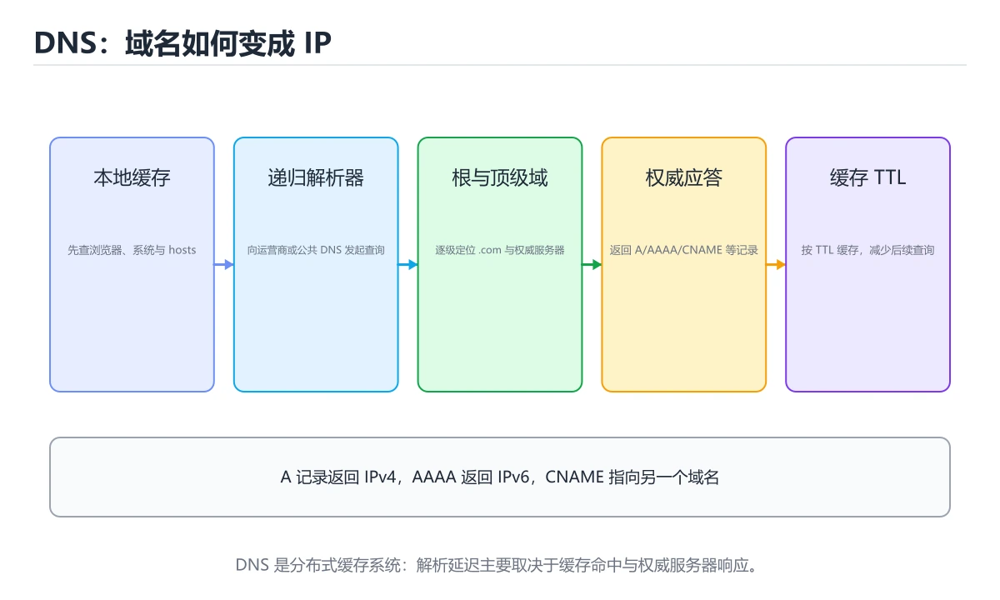
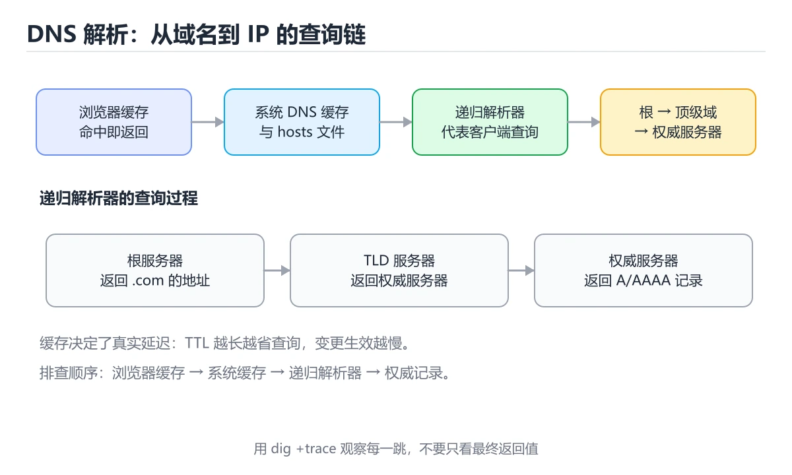
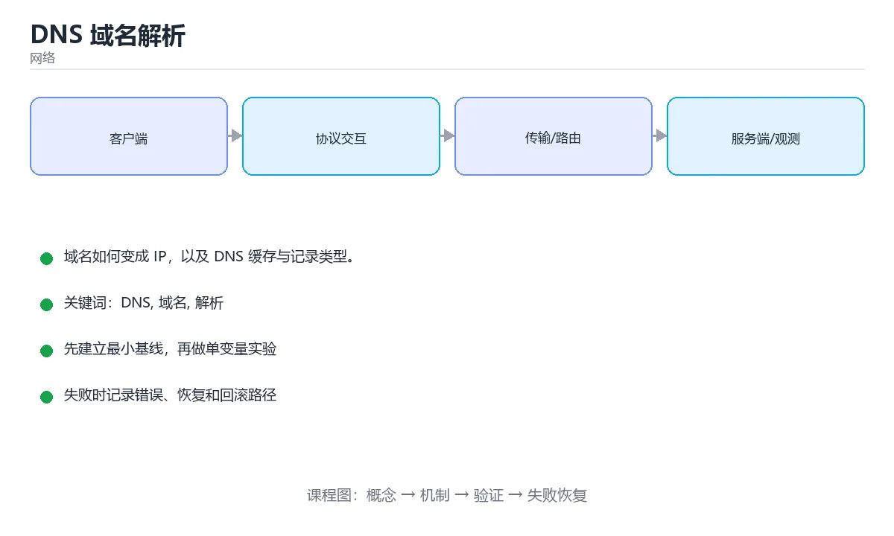

# DNS 域名解析







> 内容更新时间：2026-10-03 · 学习阶段：基础 · 预计用时：12 分钟

## 学习目标

- 能用自己的话解释DNS 域名解析解决了什么问题，而不是只背术语。
- 能说清 「DNS」、「域名」、「解析」、「A记录」 之间的关系，并分别举出一个例子。
- 能把本课知识放回「网络」的知识体系，说明它和相邻主题的边界。
- 能完成本课练习，并用验收标准检查自己的结果。

> 一句话摘要：域名如何变成 IP，以及 DNS 缓存与记录类型。

## 前置知识

- 先完成上一课《TCP/IP 协议栈》；如果已经掌握，可以直接用本课练习自测。
- 本课阶段：基础。建议会读写简单代码或命令，并理解变量、输入输出等基本概念。
- 开始前先复习：DNS、域名、解析。
- 如果某一步看不懂，先记录具体卡点，完成练习后再回头读一遍。

## DNS 的作用

人记不住 IP 地址，于是有了域名。DNS（域名系统）负责把 `www.example.com` 这样的域名翻译成 IP 地址，是互联网的「电话簿」。

## 查询过程

以访问 `www.example.com` 为例：

1. 浏览器查自身缓存，再查操作系统缓存。
2. 请求本地 DNS 服务器（通常由运营商或公司提供）。
3. 本地 DNS 依次询问**根域名服务器 → 顶级域服务器（.com）→ 权威域名服务器**。
4. 得到 IP 后返回给客户端，并按 TTL 缓存一段时间。

```text
浏览器缓存 -> 系统缓存 -> 本地 DNS -> 根 -> 顶级域 -> 权威服务器
```

## 常见记录类型

| 类型 | 作用 | 示例 |
| --- | --- | --- |
| A | 域名 → IPv4 | `example.com → 93.184.216.34` |
| AAAA | 域名 → IPv6 | `example.com → 2606:2800::1` |
| CNAME | 域名别名 | `www → example.com` |
| MX | 邮件服务器 | `mail.example.com` |
| TXT | 文本记录，常用于校验 | `v=spf1 ...` |

## 用命令行查询

```bash
nslookup example.com
dig example.com A +short
dig example.com MX
```

Windows 下还可以清理本地缓存：

```powershell
ipconfig /flushdns
```

## TTL 与 CDN

TTL（Time To Live）决定记录被缓存多久。TTL 太大会导致修改解析后长时间不生效，太小会增加解析压力。

CDN 通常返回离用户最近的节点 IP，因此不同地区解析同一个域名可能得到不同地址，这也是「域名污染」和「就近访问」现象的来源。

## 排查思路

网站打不开时，可以按顺序检查：

1. `ping 域名`：DNS 是否解析成功。
2. `ping IP`：网络是否可达。
3. 换一个 DNS 服务器（如 `1.1.1.1`）再看结果。
4. 检查 hosts 文件是否被手动修改。

## 解析耗时怎么排查

| 现象 | 可能原因 | 排查方式 |
| --- | --- | --- |
| 首次访问慢、之后快 | 本地无缓存 | 对比首次与第二次的 dig 耗时 |
| 一直很慢（数百毫秒） | 本地 DNS 服务器响应慢或需递归 | `dig @8.8.8.8 example.com` 换服务器对比 |
| 个别域名慢 | 该域名权威服务器响应慢 | `dig +trace` 看哪一级卡住 |
| 时快时慢 | 多个上游、随机路由 | 多次测量取 P95，而非平均值 |
| 解析结果与预期不符 | 本地缓存未过期 / hosts 文件 / CDN 就近解析 | `dig` 直查权威服务器、检查 hosts |

测量命令：`dig example.com +stats` 关注 Query time；`dig +trace` 观察逐级耗时；`nslookup -debug` 看完整应答。注意 DNS 通常走 UDP 53，响应超过 512 字节会切 TCP，抓包时别只过滤 UDP。

## TTL 设置的经验值

| 场景 | 建议 TTL |
| --- | --- |
| 计划做迁移/切换 | 提前 24~48 小时调小到 60~300 秒 |
| 稳定不变的服务 | 3600~86400 秒，减少解析压力 |
| 故障转移（配合健康检查） | 30~60 秒，但过低会显著增加解析量 |
| CDN 加速域名 | 通常由服务商管理，按业务调整 |

上线前检查清单：确认权威记录已生效（直查权威服务器）、确认 TTL 已调小、确认新旧地址都能服务，切换后观察一段时间再恢复较大 TTL。

## 本课小结
DNS 是典型的**分布式、分层缓存**系统。理解递归查询与缓存 TTL，就能解释大多数「域名解析异常」问题。

## 记录类型速查

| 类型 | 作用 | 示例 |
| --- | --- | --- |
| A | 域名到 IPv4 | `example.com` 到 `93.184.216.34` |
| AAAA | 域名到 IPv6 | `example.com` 到 `2606:2800::1` |
| CNAME | 域名到另一个域名 | `www` 指向 `example.com` |
| MX | 邮件服务器 | `mail.example.com`（带优先级） |
| TXT | 文本记录 | SPF、DKIM、域名验证 |
| NS | 权威服务器 | 指定该域的权威解析方 |
| SOA | 区域起始信息 | 主服务器与默认 TTL |
| SRV | 服务位置 | 指定主机与端口 |
| PTR | IP 到域名 | 反向解析 |

## 解析过程速查

```text
浏览器缓存 → 系统缓存 → hosts 文件 → 本地递归解析器
   → 根服务器 → 顶级域服务器 → 权威服务器
   → 返回结果并按 TTL 缓存
```

| 查询方式 | 说明 |
| --- | --- |
| 递归查询 | 客户端要求解析器给出最终结果 |
| 迭代查询 | 解析器逐级询问，每级返回下一步该问谁 |
| 正向解析 | 域名到 IP |
| 反向解析 | IP 到域名（PTR） |

```bash
# 常用排查命令
dig example.com A +short                  # 查询 A 记录
dig example.com AAAA +short               # 查询 IPv6
dig www.example.com CNAME +short          # 看 CNAME 链
dig example.com MX +short                 # 邮件记录
dig +trace example.com                    # 从根开始的完整迭代过程
dig @8.8.8.8 example.com                  # 指定解析器
dig -x 93.184.216.34 +short               # 反向解析
dig example.com +noall +answer +ttlunits  # 查看 TTL
```

```python
import socket
import time

def resolve_with_timing(host: str):
    """测量解析耗时并返回全部地址（含 IPv6）。"""
    start = time.perf_counter()
    infos = socket.getaddrinfo(host, 443, type=socket.SOCK_STREAM)
    elapsed_ms = (time.perf_counter() - start) * 1000
    addresses = sorted({info[4][0] for info in infos})
    return {"host": host, "addresses": addresses, "elapsed_ms": round(elapsed_ms, 2)}

print(resolve_with_timing("example.com"))
```

## DNS 优化与安全速查

| 主题 | 做法 |
| --- | --- |
| 降低延迟 | 就近解析、Anycast、减少 CNAME 层级 |
| 故障切换 | 多 A 记录 + 健康检查 + 低 TTL |
| 负载均衡 | 轮询、加权、地理与延迟调度 |
| 缓存 | 合理设置 TTL，兼顾切换速度与解析压力 |
| 防劫持 | DNSSEC 校验、DoH 或 DoT 加密解析 |
| 防投毒 | 随机化查询 ID 与源端口，启用 DNSSEC |
| 防放大攻击 | 限制递归查询开放范围、响应限速 |

## 常见错误对照表

| 容易踩的做法 | 实际现象 | 原因与正确做法 |
| --- | --- | --- |
| 修改 DNS 后立即验证 | 看到旧结果 | 等待 TTL 过期或刷新本地缓存 |
| CNAME 链太长 | 解析变慢、易失败 | 减少层级，直接指向目标 A 记录 |
| 根域使用 CNAME | 违反规范 | 根域用 A / AAAA 或 ALIAS |
| TTL 设得过长 | 故障切换慢 | 关键服务 TTL 设短（如 60 秒） |
| 只配 A 不配 AAAA | IPv6 用户走降级路径 | 双栈配置 A 与 AAAA |
| 忽略解析器缓存差异 | 各地结果不一致 | 用多地 `dig` 验证权威与递归结果 |
| 用 `ping` 判断 DNS 是否正常 | 结论不准确 | 用 `dig` 直接验证解析结果 |
| 邮件域名无 SPF 与 DKIM | 邮件被判垃圾 | 配 TXT 记录与 DKIM 签名 |
| 只依赖单台权威服务器 | 解析中断 | 至少两台不同网络的权威服务器 |
| 开放递归解析 | 被用作放大攻击源 | 只对可信网段开放递归 |

## 自测清单

- [ ] 能说出 A、AAAA、CNAME、MX、TXT、NS 的作用。
- [ ] 能描述一次完整解析的递归与迭代过程。
- [ ] 会用 `dig +trace`、`dig -x`、指定解析器排查。
- [ ] TTL 设置兼顾切换速度与解析压力。
- [ ] 知道 DNSSEC 与 DoH/DoT 分别解决什么问题。

## 动手练习

> 本课练习重点：围绕「DNS、域名、解析」完成复述、实验和交付，每个结果都要能被别人检查。

先抓一次真实请求或画出协议交互，再注入延迟或丢包，最后解释每层变化。

### 练习 1：建立心智模型（10 分钟）

合上教程，用 3～5 句话回答：

1. DNS 域名解析解决了什么问题？
2. 如果没有它，会出现什么具体后果？
3. 它和「域名」是什么关系？

**验收标准**：至少出现一个本课关键词，并写出一个反例、边界条件或失效场景。

### 练习 2：做一次可控实验（20 分钟）

从正文中选一个最小示例，完成以下操作：

1. 先预测修改一个参数、输入或步骤后的结果。
2. 再实际执行或逐步推演，记录真实结果。
3. 如果结果与预测不同，写出差异原因。

**验收标准**：留下「原例 → 改动 → 预测 → 结果 → 原因」五步记录。

### 练习 3：交付一个小结果（30 分钟）

画出一张报文或时序图，标出每一跳的地址、协议、状态和可能失败点。

任务要求：

- 结果必须能被别人检查，不能只写“我已经理解了”。
- 至少覆盖「DNS」和「域名」两个关键词。
- 写出 1 个仍然不确定的问题，以及下一步如何验证。

> 提示：时间有限时优先做练习 1 和练习 2；练习 3 可以拆成两次完成。

## 可运行练习

### 任务 1：先跑通，再解释

```python
import socket
import time

def resolve_with_timing(host: str):
    """测量解析耗时并返回全部地址（含 IPv6）。"""
    start = time.perf_counter()
    infos = socket.getaddrinfo(host, 443, type=socket.SOCK_STREAM)
    elapsed_ms = (time.perf_counter() - start) * 1000
    addresses = sorted({info[4][0] for info in infos})
    return {"host": host, "addresses": addresses, "elapsed_ms": round(elapsed_ms, 2)}

print(resolve_with_timing("example.com"))
```

### 任务 2：只改一个条件

### 任务 3：迁移到自己的数据

用同一套思路处理一组你自己的数据或场景，保持输出格式与任务 1 一致。

## 故障现场

### 现场 1：本课的 DNS 常规用例通过，但边界用例失败

**症状**：在本课的练习或生产场景里出现“本课的 DNS 常规用例通过，但边界用例失败”。

**复现**：准备一组最小输入，只保留触发“本课的 DNS 常规用例通过，但边界用例失败”的必要条件，连续运行两次确认结果稳定。

**定位**：围绕“DNS 的前置条件与取值边界没有写进代码，默认值掩盖了空值和极值”检查调用链、输入数据和环境配置，先验证假设再改代码。

**预防**：把“本课的 DNS 常规用例通过，但边界用例失败”写成一条自动化用例，并在本课的验收清单里保留对应检查项。

### 现场 2：本课的 域名 结果在两次运行之间不一致

**症状**：在本课的练习或生产场景里出现“本课的 域名 结果在两次运行之间不一致”。

**复现**：准备一组最小输入，只保留触发“本课的 域名 结果在两次运行之间不一致”的必要条件，连续运行两次确认结果稳定。

**定位**：围绕“域名 依赖了当前版本、执行顺序或共享状态，单次运行无法暴露差异”检查调用链、输入数据和环境配置，先验证假设再改代码。

**预防**：把“本课的 域名 结果在两次运行之间不一致”写成一条自动化用例，并在本课的验收清单里保留对应检查项。

### 现场 3：请求偶发超时，但服务端监控看起来正常

**症状**：在本课的练习或生产场景里出现“请求偶发超时，但服务端监控看起来正常”。

## 深入补充：DNS 域名解析 的取舍与边界

### 一、把概念放回真实约束

学习DNS 域名解析时，最容易只记住结论而忽略前提。先写出三个约束：数据规模、时间预算、可接受的失败方式；再判断 DNS 与 域名 在这些约束下是否仍然成立。只要约束改变，原来的最优解就可能变成错误解。

| 场景 | 协议或方案 | 延迟与可靠性 | 排障入口 |
| --- | --- | --- | --- |
| 强一致请求 | TCP / HTTP | 可靠但可能队头阻塞 | 连接与重传指标 |
| 实时音视频 | UDP / QUIC | 低延迟但允许丢包 | 抖动与丢包率 |
| 大规模分发 | CDN 与缓存 | 就近命中 | 命中率与回源 |
| 服务间调用 | RPC 或消息队列 | 取决于确认机制 | 超时、重试与幂等 |

### 二、三个容易混淆的边界

2. **把“平均值”当成“全部”**：DNS 的指标好看，不代表尾部请求、冷启动或失败重试也好看。
3. **把“当前版本”当成“永久行为”**：域名 依赖的默认值、API 或性能特征都可能随版本变化，需要固定版本并保留回归用例。

### 三、一个生产场景

假设团队要在真实系统里使用DNS 域名解析：第一周先做小流量验证，记录 DNS 的基线与异常；第二周扩大输入规模，观察 域名 是否成为瓶颈；第三周再做故障演练，主动注入超时、重复请求和依赖不可用，确认系统能降级、能重试、能恢复。每一步都要留下指标、日志和结论，而不是只留下“感觉更快了”。

### 四、自测清单

- 能否用一句话说出DNS 域名解析解决的核心问题与不适用场景？
- 能否画出 DNS 的数据流或状态变化，并标出失败路径？
- 能否给出一个反例，证明某个看似合理的结论在边界条件下不成立？
- 能否写出一条可复现的验证命令，让别人独立得到相同结论？

## 本课复习清单

离开本课前，逐项确认：

- [ ] 不看解析，能说出「DNS 的核心作用是什么？」的判断依据。
- [ ] 不看解析，能说出「A 记录的作用是？」的判断依据。
- [ ] 不看解析，能说出「DNS 记录中的 TTL 表示什么？」的判断依据。
- [ ] 不看解析，能说出「CNAME 记录与 A 记录的区别是？」的判断依据。
- [ ] 不看解析，能说出「递归查询与迭代查询的区别是？」的判断依据。
- [ ] 至少运行一次本课示例，记录输入、输出和一个边界情况。
- [ ] 把本课最容易混淆的两个概念写成一句话对照。

| 复盘项 | 记录 |
| --- | --- |
| 已经能独立解释的考点 |  |
| 仍然说不清的概念 |  |
| 下一步验证动作 |  |

## 术语速查

| 术语 | 本课语境 |
| --- | --- |
| `www.example.com` | 人记不住 IP 地址，于是有了域名。DNS（域名系统）负责把 `www.example.com` 这样的域名翻译成 IP 地址，是互联网的「电话簿」。 |
| `example.com → 93.184.216.34` | \| A \| 域名 → IPv4 \| `example.com → 93.184.216.34` \| |
| `example.com → 2606:2800::1` | \| AAAA \| 域名 → IPv6 \| `example.com → 2606:2800::1` \| |
| `www → example.com` | \| CNAME \| 域名别名 \| `www → example.com` \| |
| `mail.example.com` | \| MX \| 邮件服务器 \| `mail.example.com` \| |
| `v=spf1 ...` | \| TXT \| 文本记录，常用于校验 \| `v=spf1 ...` \| |
| `ping 域名` | `ping 域名`：DNS 是否解析成功。 |
| `ping IP` | `ping IP`：网络是否可达。 |
| `1.1.1.1` | 换一个 DNS 服务器（如 `1.1.1.1`）再看结果。 |
| `dig @8.8.8.8 example.com` | \| 一直很慢（数百毫秒） \| 本地 DNS 服务器响应慢或需递归 \| `dig @8.8.8.8 example.com` 换服务器对比 \| |
| `dig +trace` | \| 个别域名慢 \| 该域名权威服务器响应慢 \| `dig +trace` 看哪一级卡住 \| |
| `dig` | \| 解析结果与预期不符 \| 本地缓存未过期 / hosts 文件 / CDN 就近解析 \| `dig` 直查权威服务器、检查 hosts \| |

## 考点精讲

### 考点 1：DNS 的核心作用是什么？

- **判断依据**：DNS 相当于互联网的电话簿，负责把人类可读的域名翻译成机器可用的 IP 地址。在「DNS 域名解析」里，其他选项：DNS 把域名解析成 IP 地址。这道题的关键在「DNS 域名解析」的DNS、域名、解析：先确认题干“DNS 的核心作用是什么”问的是哪一步，再排除偷换前提的选项。

### 考点 2：下面这段代码代码摘自「DNS 域名解析」的正文示例。关于这段代码，下面哪一项说法与实际内容相符？

- **判断依据**：在「DNS 域名解析」里，这段代码只做静态声明，没有循环、分支或可观察输出。这段代码出自「DNS 域名解析」的正文示例，围绕DNS、域名、解析展开；把输入或边界换成空值、极值或失败情况后，结论要以「DNS 域名解析」的实际运行结果为准。回到「DNS 域名解析」的正文示例，用“下面这段代码代码摘自DNS 域名解析”走一遍DNS、域名、解析的完整流程，能复现的结论才可以保留。

### 考点 3：围绕“DNS 域名解析”中的 DNS、域名、解析，下列哪两项是本课强调的实践判断？

- **判断依据**：本课把DNS 域名解析拆成概念、示例与故障现场三部分，因此判断 DNS 时必须同时交代输入、输出和失败路径，这使“学习 DNS 时要同时说明输入、输出和失败路径，不能只看正常流程”成立。在DNS 域名解析里，判断 域名 时要固定版本与边界输入，所以“验证 域名 时要固定版本并覆盖边界输入，结论才可复现”才可复现。

### 考点 4：CNAME 记录与 A 记录的区别是？

- **判断依据**：在「DNS 域名解析」里，结论应落在「CNAME 把一个域名指向另一个域名」。把服务切到 CDN 或多台机器时常用 CNAME，便于后续更换真实地址。在「DNS 域名解析」里，这道题要求区分概念与边界，「CNAME 把一个域名指向另一个域名」只有在题干给出的前提下才成立，而「A 记录只能指向 IPv6」、「CNAME 只能用于邮件」缺少同一组条件。

### 考点 5：递归查询与迭代查询的区别是？

- **判断依据**：在「DNS 域名解析」里，递归由解析器负责问到底并返回最终结果。客户端通常向本地递归解析器发起递归查询，解析器之间再做迭代查询。回到「DNS 域名解析」的正文示例，用“递归查询与迭代查询的区别是”走一遍DNS、域名、解析的完整流程，能复现的结论才可以保留。回到「DNS 域名解析」的正文示例，用“递归查询与迭代查询的区别是”走一遍DNS、域名、解析的完整流程，能复现的结论才可以保留。

### 考点 6：补全代码：「DNS 域名解析」示例中，下面这行代码缺少哪个关键字或函数名？请填入 ____。

`nslookup ____.com`

- **判断依据**：在「DNS 域名解析」里，example。回到「DNS 域名解析」的正文示例，用“补全代码”走一遍DNS、域名、解析的完整流程，能复现的结论才可以保留。「DNS 域名解析」要求先交代DNS、域名、解析的前提再下结论，所以“example”只在题干“DNS 域名解析示例中”给定的条件下成立。

## English Overview

**Title:** DNS Resolution

**Summary:** How domains resolve to IPs, caching and record types.

**Category:** Networking
**Level:** 基础
**Key terms:** DNS, 域名, 解析, A记录, TTL, 缓存

## 内容元数据

- 内容版本：v2.0
- 最后更新：2026-10-03
- 学习阶段：基础
- 适用环境：TCP/IP、HTTP/2、HTTP/3 与现代网络栈
- 内容来源：内置结构化课程与工程实践整理
- 相关主题：DNS、域名、解析、A记录、TTL、缓存
- 质量版本：P0 测验标准 + P1 覆盖扩展 + P2 体验补全

## 参考资料与复核

- 最后复核：2026-10-04
- 下次复核：2027-04-04
- 复核范围：版本兼容、API 行为、安全建议与工程实践
- 来源性质：官方文档、标准或权威教材；正文为离线教学重组

| 参考资料 | 本课用途 |
| --- | --- |
| [RFC 1035 DNS](https://www.rfc-editor.org/rfc/rfc1035) | DNS 报文与解析 |
| [Cloudflare Learning](https://www.cloudflare.com/learning/) | 网络概念与安全解释 |
| [RFC 9110 HTTP 语义](https://www.rfc-editor.org/rfc/rfc9110) | HTTP 方法、状态与缓存 |

> 「DNS 域名解析」的链接用于离线阅读后的延伸核对；App 不会自动联网。
