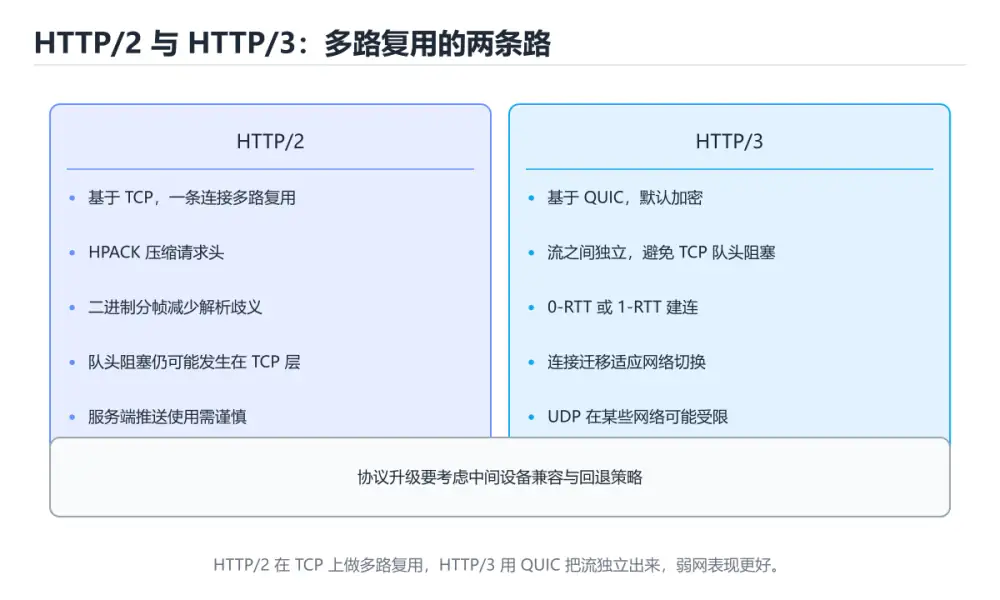

# 本课主题




> 内容更新时间：2026-10-03 · 学习阶段：高级 · 预计用时：15 分钟

## 学习目标

- 能用自己的话解释本课主题解决了什么问题，而不是只背术语。
- 能说清 「HTTP/2」、「HTTP/3」、「QUIC」、「多路复用」 之间的关系，并分别举出一个例子。
- 能把本课知识放回「网络」的知识体系，说明它和相邻主题的边界。
- 能完成本课练习，并用验收标准检查自己的结果。

> 一句话摘要：多路复用、HPACK 与 QUIC 建连。

## 前置知识

- 先完成上一课《WebSocket 与实时通信》；如果已经掌握，可以直接用本课练习自测。
- 开始前先复习：HTTP/2、HTTP/3、QUIC。
- 如果某一步看不懂，先记录具体卡点，完成练习后再回头读一遍。

## HTTP/1.1 的瓶颈

1. **队头阻塞**：同一连接上请求必须按序返回，前面慢会拖住后面。
2. **连接数限制**：浏览器对同域名并发连接有限制，只能靠多开连接绕过。
3. **头部重复**：每次请求都重复发送大量头部（Cookie、User-Agent）。

## HTTP/2 的改进

| 特性 | 作用 |
| --- | --- |
| 二进制分帧 | 把请求与响应拆成帧，替代文本协议 |
| 多路复用 | 一条连接上并行多个流，解决应用层队头阻塞 |
| 头部压缩 HPACK | 用静态表与动态表压缩重复头部 |
| 服务器推送 | 主动推送资源（实践中效果有限，已逐步弃用） |
| 流优先级 | 标记资源优先级（实现复杂，HTTP/3 已简化） |

注意：HTTP/2 仍建立在 TCP 之上，**TCP 层的队头阻塞依然存在**——丢一个包会阻塞整条连接的所有流。

## HTTP/3 与 QUIC

HTTP/3 改用基于 UDP 的 QUIC 协议：

1. **彻底解决队头阻塞**：各流独立重传，互不影响。
2. **0-RTT / 1-RTT 建连**：把 TLS 1.3 握手与传输握手合并，恢复连接几乎零延迟。
3. **连接迁移**：用连接 ID 而不是 IP+端口标识连接，切换 Wi-Fi/蜂窝网络不掉线。
4. **强制加密**：QUIC 默认加密，包括大部分传输元数据。

代价：UDP 在部分企业网络被限制，服务端实现与运维复杂度更高。

## 实践建议

| 场景 | 建议 |
| --- | --- |
| 普通网站 | 开启 HTTP/2，配合 TLS 与 Brotli 压缩 |
| 移动端 / 弱网 | 优先启用 HTTP/3（CDN 一般可一键开启） |
| 大量小请求 | 多路复用收益明显，减少域名分片 |
| 大文件下载 | 关注带宽与断点续传，协议版本影响较小 |

优化顺序建议：先做缓存与压缩、减少请求数与体积，再考虑协议升级；协议只是放大器，不能弥补糟糕的资源策略。

## 队头阻塞对比演示

假设一条连接上同时请求 A、B、C 三个资源，且传输中丢失了一个数据包：

| 版本 | 表现 |
| --- | --- |
| HTTP/1.1 | 请求串行，A 未返回前 B、C 排队等待（应用层队头阻塞） |
| HTTP/2 | 三条流并行发送，但共用一条 TCP 连接——丢包导致**所有流**一起等待重传（TCP 层队头阻塞） |
| HTTP/3 | 每条流独立重传，只有受影响的那条流等待，其余照常到达 |

这就是为什么弱网（丢包率高）环境下 HTTP/3 的收益最明显，而局域网（几乎不丢包）下三者差异不大。

## 版本迁移与兼容实践

1. 服务端同时支持 h2 与 h3（h3 通过 Alt-Svc 头通告），客户端自动择优。
2. 保留 HTTP/1.1 作为兜底，部分企业网络会封 UDP。
3. HTTP/2 下不要再做域名分片（会削弱多路复用收益），可去掉雪碧图与内联小图。
4. 观察指标：协议版本分布、握手耗时、首字节时间、重传率，用真实数据判断收益。

## 本课小结
HTTP/2 用二进制分帧与多路复用解决了应用层队头阻塞，HTTP/3 用 QUIC 解决了 TCP 层队头阻塞并优化建连。**先优化内容，再升级协议**。

## 版本对照速查

| 维度 | HTTP/1.1 | HTTP/2 | HTTP/3 |
| --- | --- | --- | --- |
| 传输层 | TCP | TCP | QUIC（基于 UDP） |
| 并发方式 | 多连接或流水线 | 单连接多路复用 | 单连接多路复用（独立流） |
| 队头阻塞 | 有（连接级） | TCP 层仍有 | 基本消除（流级独立） |
| 头部压缩 | 无 | HPACK | QPACK |
| 建连 | TCP + TLS | TCP + TLS（ALPN 协商） | TLS 集成在 QUIC 内 |
| 握手往返 | 3 次以上 | 2 到 3 次 | 1 次（会话复用可 0 次） |
| 连接迁移 | 不支持 | 不支持 | 支持（连接 ID） |

## 关键概念速查

| 概念 | 说明 |
| --- | --- |
| 流（Stream） | 逻辑上的独立请求响应通道 |
| 帧（Frame） | HTTP/2 的最小传输单位 |
| 多路复用 | 多个流在同一连接上交错传输 |
| HPACK / QPACK | 头部压缩算法，QPACK 解决 QUIC 乱序问题 |
| 服务器推送 | HTTP/2 特性，实践中收益有限，已逐步弃用 |
| 优先级 | HTTP/2 的优先级树；HTTP/3 用紧急度 + 增量 |
| ALPN | TLS 握手时协商应用协议（h2、h3） |
| 0-RTT | 会话复用下提前发送数据，需防重放 |

```bash
# 检查服务端支持的协议版本
curl -I --http2 https://example.com
curl -I --http3 https://example.com          # 需要 curl 支持 HTTP/3
openssl s_client -connect example.com:443 -alpn h2 -brief

# 查看协商结果与连接复用情况
curl -v -o /dev/null -s https://example.com 2>&1 | grep -E 'ALPN|HTTP/'
```

```nginx
# Nginx 开启 本课主题 的配置骨架
server {
    listen 443 ssl;
    listen 443 quic reuseport;            # HTTP/3 基于 UDP
    http2 on;
    server_name example.com;

    ssl_certificate     /etc/ssl/fullchain.pem;
    ssl_certificate_key /etc/ssl/privkey.pem;
    ssl_protocols TLSv1.2 TLSv1.3;

    add_header Alt-Svc 'h3=":443"; ma=86400';   # 告知客户端可升级到 HTTP/3
}
```

## 优化与迁移要点

| 要点 | 说明 |
| --- | --- |
| 域名收敛 | HTTP/2 下单连接多路复用，域名分片反而有害 |
| 资源合并 | 不再为减少请求数而过度合并，避免缓存粒度变粗 |
| 服务端推送替代方案 | 用 `preload` / `103 Early Hints` |
| 头部体积 | 压缩后仍需精简 Cookie 与自定义头 |
| 拥塞控制 | QUIC 可插拔，常见 CUBIC 与 BBR |
| 中间设备 | HTTP/3 依赖 UDP，需确认防火墙与负载均衡支持 |
| 降级策略 | 客户端先用 HTTP/2，Alt-Svc 探测成功后再走 h3 |
| 观测 | 记录协商版本、握手耗时、流取消与重传率 |

## 常见错误对照表

| 容易踩的做法 | 实际现象 | 原因与正确做法 |
| --- | --- | --- |
| 认为 HTTP/2 没有队头阻塞 | 丢包时全部流受影响 | TCP 层队头阻塞仍存在，需 HTTP/3 |
| 继续做域名分片 | 连接数增加、收益为负 | HTTP/2 下收敛域名 |
| 无脑使用 0-RTT | 重放攻击风险 | 只对幂等请求启用 |
| 防火墙未放行 UDP | HTTP/3 一直不可用 | 放行 UDP 并验证 Alt-Svc |
| 服务端推送滥用 | 带宽浪费 | 改用 preload 与 Early Hints |
| 忽略协商失败 | 用户走旧协议且无人知 | 监控协商版本分布 |
| 认为 HTTP/3 一定更快 | 高丢包与移动网络才明显 | 按场景实测对比 |
| 头部不做精简 | 压缩成本仍高 | 减少 Cookie 与冗余头 |
| 未更新负载均衡配置 | 连接异常或降级 | 确认七层网关支持并开启 h3 |
| 缺少回退与超时 | h3 探测失败后长时间不可用 | 设短探测超时并回退 h2 |

## 自测清单

- [ ] 能说清 HTTP/1.1、2、3 在并发与队头阻塞上的差异。
- [ ] 知道 HPACK 与 QPACK 的区别与原因。
- [ ] 会用 `curl` 与 `openssl` 检查协议协商。
- [ ] 明白 0-RTT 的重放风险与适用条件。
- [ ] 上线 HTTP/3 时配置好 Alt-Svc 与回退策略。

## 动手练习

> 本课练习重点：围绕「HTTP/2、HTTP/3、QUIC」完成复述、实验和交付，每个结果都要能被别人检查。

先抓一次真实请求或画出协议交互，再注入延迟或丢包，最后解释每层变化。

### 练习 1：建立心智模型（10 分钟）

合上教程，用 3～5 句话回答：

1. 本课主题解决了什么问题？
2. 如果没有它，会出现什么具体后果？
3. 它和「HTTP/3」是什么关系？

**验收标准**：至少出现一个本课关键词，并写出一个反例、边界条件或失效场景。

### 练习 2：做一次可控实验（20 分钟）

从正文中选一个最小示例，完成以下操作：

1. 先预测修改一个参数、输入或步骤后的结果。
2. 再实际执行或逐步推演，记录真实结果。
3. 如果结果与预测不同，写出差异原因。

**验收标准**：留下「原例 → 改动 → 预测 → 结果 → 原因」五步记录。

### 练习 3：交付一个小结果（30 分钟）

画出一张报文或时序图，标出每一跳的地址、协议、状态和可能失败点。

任务要求：

- 结果必须能被别人检查，不能只写“我已经理解了”。
- 至少覆盖「HTTP/2」和「HTTP/3」两个关键词。
- 写出 1 个仍然不确定的问题，以及下一步如何验证。

> 提示：时间有限时优先做练习 1 和练习 2；练习 3 可以拆成两次完成。

## 实践任务

本节围绕本课主题安排 3 个可交付任务，每个任务都要求留下可以复查的记录。

### 任务 1：用自己的话画出结构

### 任务 2：做一次对比实验

**验收标准**：表格里两个方案的结论不能完全一样；写下“在什么条件下应该换方案”。

### 任务 3：迁移到自己的场景

**验收标准**：至少有一个可复现的命令、代码片段或数据样例；结论能被别人独立检查。

## 故障现场

### 现场 1：本课的 HTTP/2 常规用例通过，但边界用例失败

**症状**：在本课的练习或生产场景里出现“本课的 HTTP/2 常规用例通过，但边界用例失败”。

**复现**：准备一组最小输入，只保留触发“本课的 HTTP/2 常规用例通过，但边界用例失败”的必要条件，连续运行两次确认结果稳定。

**定位**：围绕“HTTP/2 的前置条件与取值边界没有写进代码，默认值掩盖了空值和极值”检查调用链、输入数据和环境配置，先验证假设再改代码。

**预防**：把“本课的 HTTP/2 常规用例通过，但边界用例失败”写成一条自动化用例，并在本课的验收清单里保留对应检查项。

### 现场 2：本课的 HTTP/3 结果在两次运行之间不一致

**症状**：在本课的练习或生产场景里出现“本课的 HTTP/3 结果在两次运行之间不一致”。

**复现**：准备一组最小输入，只保留触发“本课的 HTTP/3 结果在两次运行之间不一致”的必要条件，连续运行两次确认结果稳定。

**定位**：围绕“HTTP/3 依赖了当前版本、执行顺序或共享状态，单次运行无法暴露差异”检查调用链、输入数据和环境配置，先验证假设再改代码。

**预防**：把“本课的 HTTP/3 结果在两次运行之间不一致”写成一条自动化用例，并在本课的验收清单里保留对应检查项。

### 现场 3：请求偶发超时，但服务端监控看起来正常

**症状**：在本课的练习或生产场景里出现“请求偶发超时，但服务端监控看起来正常”。

## 深入补充：本课主题 的取舍与边界

### 一、把概念放回真实约束

学习本课主题时，最容易只记住结论而忽略前提。先写出三个约束：数据规模、时间预算、可接受的失败方式；再判断 本课主题 在这些约束下是否仍然成立。只要约束改变，原来的最优解就可能变成错误解。

| 场景 | 协议或方案 | 延迟与可靠性 | 排障入口 |
| --- | --- | --- | --- |
| 强一致请求 | TCP / HTTP | 可靠但可能队头阻塞 | 连接与重传指标 |
| 实时音视频 | UDP / QUIC | 低延迟但允许丢包 | 抖动与丢包率 |
| 大规模分发 | CDN 与缓存 | 就近命中 | 命中率与回源 |
| 服务间调用 | RPC 或消息队列 | 取决于确认机制 | 超时、重试与幂等 |

### 二、三个容易混淆的边界

2. **把“平均值”当成“全部”**：HTTP/2 的指标好看，不代表尾部请求、冷启动或失败重试也好看。
3. **把“当前版本”当成“永久行为”**：HTTP/3 依赖的默认值、API 或性能特征都可能随版本变化，需要固定版本并保留回归用例。

### 三、一个生产场景

假设团队要在真实系统里使用本课主题：第一周先做小流量验证，记录 HTTP/2 的基线与异常；第二周扩大输入规模，观察 HTTP/3 是否成为瓶颈；第三周再做故障演练，主动注入超时、重复请求和依赖不可用，确认系统能降级、能重试、能恢复。每一步都要留下指标、日志和结论，而不是只留下“感觉更快了”。

### 四、自测清单

- 能否用一句话说出本课主题解决的核心问题与不适用场景？
- 能否画出 HTTP/2 的数据流或状态变化，并标出失败路径？
- 能否给出一个反例，证明某个看似合理的结论在边界条件下不成立？
- 能否写出一条可复现的验证命令，让别人独立得到相同结论？

## 本课复习清单

离开本课前，逐项确认：

- [ ] 不看解析，能说出「HTTP/2 主要解决了什么问题？」的判断依据。
- [ ] 不看解析，能说出「HTTP/2 仍然存在什么限制？」的判断依据。
- [ ] 不看解析，能说出「HTTP/3 建立在什么之上？」的判断依据。
- [ ] 不看解析，能说出「HTTP/2 的多路复用指什么？」的判断依据。
- [ ] 不看解析，能说出「QUIC（HTTP/3）相比 TCP + TLS 的建连差异是？」的判断依据。
- [ ] 不看解析，能说出「补全代码：本课主题示例中，下面这行代码缺少哪个关键字或…」的判断依据。
- [ ] 至少运行一次本课示例，记录输入、输出和一个边界情况。
- [ ] 把本课最容易混淆的两个概念写成一句话对照。

| 复盘项 | 记录 |
| --- | --- |
| 已经能独立解释的考点 |  |
| 仍然说不清的概念 |  |
| 下一步验证动作 |  |

## 术语速查

| 术语 | 本课语境 |
| --- | --- |
| `preload` | \| 服务端推送替代方案 \| 用 `preload` / `103 Early Hints` \| |
| `103 Early Hints` | \| 服务端推送替代方案 \| 用 `preload` / `103 Early Hints` \| |
| `curl` | [ ] 会用 `curl` 与 `openssl` 检查协议协商。 |
| `openssl` | [ ] 会用 `curl` 与 `openssl` 检查协议协商。 |

## 考点精讲

### 考点 1：下面这段 Python 代码复现了“HTTP/2 与 HTTP/3”中 HTTP/2、HTTP/3、QUIC 相关的一个常见故障，哪一项最准确地解释了问题？

- **判断依据**：正确答案是「默认参数 bucket=[] 只在定义时创建一次，两次调用共享同一个列表」。正确答案是默认参数 bucket=[] 只在定义时创建一次，两次调用共享同一个列表（http2http3 第 1 题）。在这个复现里，第二次调用看到的是 HTTP/2 留下的内容。在这个复现里，把 HTTP/3 相关的默认值改成 None，并在函数体内按需创建新列表，才能让每次调用都从干净状态开始。

### 考点 2：HTTP/2 仍然存在什么限制？

- **判断依据**：丢包会阻塞整条 TCP 连接上的所有流，这正是 HTTP/3 要解决的。其他选项：HTTP/2 仍受 TCP 层队头阻塞影响（一个丢包会拖住所有流）。解题的关键不是记住孤立术语，而是确认「TCP 层队头阻塞」是否完整覆盖题干的输入、输出和失败路径，并排除「连接数受限」、「不支持压缩」这类相邻概念。

### 考点 3：围绕“HTTP/2 与 HTTP/3”中的 HTTP/2、HTTP/3、QUIC，下列哪两项是本课强调的实践判断？

- **判断依据**：正确答案包括「学习 HTTP/2 时要同时说明输入、输出和失败路径，不能只看正常流程」、「验证 HTTP/3 时要固定版本并覆盖边界输入，结论才可复现」。符合题干条件的是学习 HTTP/2 时要同时说明输入、输出和失败路径。本课把本课主题拆成概念、示例与故障现场三部分，因此判断 HTTP/2 时必须同时交代输入、输出和失败路径，这使“学习 HTTP/2 时要同时说明输入、输出和失败路径，不能只看正常流程”成立。在本课主题里，判断 HTTP/3 时要固定版本与边界输入，所以“验证 HTTP/3 时要固定版本并覆盖边界输入，结论才可复现”才可复现。

### 考点 4：HTTP/2 的多路复用指什么？

- **判断依据**：多路复用消除了 HTTP/1.1 的队头阻塞，但也让 TCP 层丢包影响所有流。其他选项：多路复用是在同一条 TCP 连接上并发多个流、帧交错发送与重组。这道题要求区分概念与边界，「在同一条 TCP 连接上并发多个流」只有在题干给出的前提下才成立，而「把请求排队串行发送」、「使用多个域名」缺少同一组条件。

### 考点 5：QUIC（HTTP/3）相比 TCP + TLS 的建连差异是？

- **判断依据**：QUIC 还解决了 TCP 层的队头阻塞，每个流独立重传。其他选项：QUIC 基于 UDP 并把 TLS 集成进握手，且每个流独立重传。判断这类题时，要把「基于 UDP 并把 TLS 集成进握手」放回题干限定的对象、输入和边界，「必须依赖 TCP 快速打开」、「不能加密」 等说法虽然包含相关术语，但范围或前提与本题不一致。

### 考点 6：补全代码：「HTTP/2 与 HTTP/3」示例中，下面这行代码缺少哪个关键字或函数名？请填入 ____。

`curl -I --http2 https://____.com`

- **判断依据**：围绕 补全代码：本课主题示例中，下面这行代码缺少… 作答时，先用HTTP/2建立输入与输出的基线，再把example代入边界条件核对，结论才能复现。解题的关键不是记住孤立术语，而是确认「example」是否完整覆盖题干的输入、输出和失败路径，并排除这类相邻概念。

## English Overview

**Title:** HTTP/2 & HTTP/3

**Summary:** Multiplexing, HPACK and QUIC.

**Category:** Networking
**Level:** 高级
**Key terms:** HTTP/2, HTTP/3, QUIC, 多路复用, 头部压缩

## 内容元数据

- 内容版本：v2.0
- 最后更新：2026-10-03
- 学习阶段：高级
- 适用环境：TCP/IP、HTTP/2、HTTP/3 与现代网络栈
- 内容来源：内置结构化课程与工程实践整理
- 相关主题：HTTP/2、HTTP/3、QUIC、多路复用、头部压缩
- 质量版本：P0 测验标准 + P1 覆盖扩展 + P2 体验补全


## 参考资料与复核

- 最后复核：2026-10-04
- 下次复核：2027-04-04
- 复核范围：版本兼容、API 行为、安全建议与工程实践
- 来源性质：官方文档、标准或权威教材；正文为离线教学重组

| 参考资料 | 本课用途 |
| --- | --- |
| [RFC 9113 HTTP/2](https://www.rfc-editor.org/rfc/rfc9113) | HTTP/2 多路复用与流 |
| [Cloudflare Learning](https://www.cloudflare.com/learning/) | 网络概念与安全解释 |
| [RFC 9112 HTTP/1.1](https://www.rfc-editor.org/rfc/rfc9112) | HTTP/1.1 报文与连接 |

> 「HTTP/2 与 HTTP/3」的链接用于离线阅读后的延伸核对；App 不会自动联网。

## 复习与迁移

- 围绕「下面这段 Python 代码复现了本课主题中 HTTP/2、HTTP/3、QUIC 相关的一个常…」做迁移时，先记录输入、边界和预期，再观察HTTP/2对结果的影响，并用「默认参数 bucket=[] 只在定义时创建一次，两次调用共享同一个列表。」解释正常与失败路径。

<!-- p0p1-review:start -->
## 复习与迁移

- 围绕「下面这段 Python 代码复现了本课主题中 HTTP/2、HTTP/3、QUIC 相关的一个常…」做迁移时，先记录输入、边界和预期，再观察HTTP/2对结果的影响，并用「默认参数 bucket=[] 只在定义时创建一次，两次调用共享同一个列表。」解释正常与失败路径。
- 把HTTP/3放进最小实验：固定版本和输入，只改变一个条件，记录输出差异，并说明「TCP 层队头阻塞」在什么前提下成立。
- 复习「围绕本课主题中的 HTTP/2、HTTP/3、QUIC，下列哪两项是本课强调的实践判断？」时，不要只背结论；用QUIC的边界值复现一次，再把现象、原因和修复写成三步记录。
- 如果把多路复用换成空值、极值或并发输入，「在同一条 TCP 连接上并发多个流」是否仍然成立？写出验证命令和观察到的结果。
- 围绕「QUIC（HTTP/3）相比 TCP + TLS 的建连差异是？」做迁移时，先记录输入、边界和预期，再观察头部压缩对结果的影响，并用「基于 UDP 并把 TLS 集成进握手」解释正常与失败路径。
- 把HTTP/2放进最小实验：固定版本和输入，只改变一个条件，记录输出差异，并说明「example」在什么前提下成立。
<!-- p0p1-review:end -->
