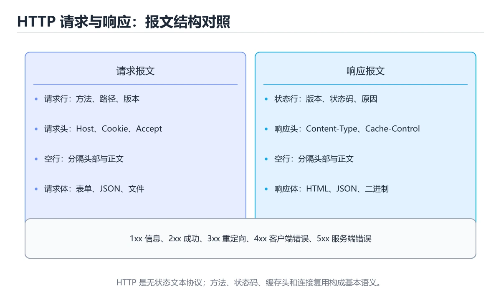

# HTTP 基础




> 内容更新时间：2026-10-03 · 学习阶段：基础 · 预计用时：14 分钟

## 学习目标

- 能用自己的话解释HTTP 基础解决了什么问题，而不是只背术语。
- 能说清 「HTTP」、「状态码」、「GET」、「POST」 之间的关系，并分别举出一个例子。
- 能把本课知识放回「网络」的知识体系，说明它和相邻主题的边界。
- 能完成本课练习，并用验收标准检查自己的结果。

> 一句话摘要：请求响应模型、方法、状态码与 Cookie。

## 前置知识

- 会进行基本的文件、命令行或浏览器操作；遇到不熟悉的术语先查本课关键词。
- 本课阶段：基础。建议会读写简单代码或命令，并理解变量、输入输出等基本概念。
- 开始前先复习：HTTP、状态码、GET。
- 如果某一步看不懂，先记录具体卡点，完成练习后再回头读一遍。

## HTTP 是什么

HTTP（超文本传输协议）是浏览器与服务器之间的应用层通信协议，采用**请求 / 响应**模型：客户端发一个请求，服务器返回一个响应。

## 请求与响应

一个典型的 HTTP 请求：

```http
GET /articles/42 HTTP/1.1
Host: example.com
Accept: application/json

```

对应的响应：

```http
HTTP/1.1 200 OK
Content-Type: application/json
Content-Length: 27

{"id": 42, "title": "HTTP"}
```

## 常用请求方法

| 方法 | 含义 | 是否幂等 |
| --- | --- | --- |
| GET | 获取资源 | 是 |
| POST | 新建资源、提交数据 | 否 |
| PUT | 全量更新资源 | 是 |
| PATCH | 部分更新资源 | 否 |
| DELETE | 删除资源 | 是 |

## 状态码

- `2xx` 成功：`200 OK`、`201 Created`、`204 No Content`。
- `3xx` 重定向：`301` 永久、`302` 临时、`304` 未修改。
- `4xx` 客户端错误：`400` 参数错误、`401` 未认证、`403` 无权限、`404` 不存在。
- `5xx` 服务端错误：`500` 内部错误、`502` 网关错误、`503` 服务不可用。

## 无状态与 Cookie

HTTP 本身是无状态的，服务器默认不记得你上次是谁。为了维持登录状态，常用机制是 **Cookie + Session** 或 **Token**：

```http
POST /login HTTP/1.1
Content-Type: application/json

{"username": "tom", "password": "******"}

---

HTTP/1.1 200 OK
Set-Cookie: session_id=abc123; HttpOnly; Secure
```

浏览器后续请求会自动带上 `Cookie: session_id=abc123`。

## 用命令行观察 HTTP

```bash
curl -i https://example.com          # 打印响应头与响应体
curl -X POST -d '{"a":1}' \
     -H 'Content-Type: application/json' \
     https://httpbin.org/post
```

## 排查速查

| 现象 | 优先怀疑 | 检查手段 |
| --- | --- | --- |
| 401 / 403 | 未带 Token、Token 过期、权限不足 | 看请求头 Authorization 与响应体错误码 |
| 404 | 路径拼错、网关路由未配置、资源已删除 | 对比接口文档与实际 URL |
| 405 | 方法用错（GET 当 POST） | 看 Allow 响应头 |
| 429 | 触发限流 | 查 Retry-After，加退避重试 |
| 502 / 504 | 网关到后端失败或超时 | 查网关日志与后端健康状态 |
| 200 但数据不对 | 缓存命中旧内容、字段类型不符 | 看响应头 Cache-Control 与响应体 |

调试顺序：先看状态码 → 再看请求头（Authorization、Content-Type、Cookie）→ 最后看请求体与响应体；用 `curl -i` 或浏览器 Network 面板都能一次拿到这些信息。

## 缓存头的实际协商过程

| 请求/响应 | 头字段 | 作用 |
| --- | --- | --- |
| 响应 | `Cache-Control: max-age=3600` | 强缓存 1 小时，期间不发请求 |
| 响应 | `ETag: "v1"` | 资源版本指纹 |
| 响应 | `Last-Modified: ...` | 资源最后修改时间（精度到秒） |
| 首次过期后请求 | `If-None-Match: "v1"` | 携带上次的 ETag |
| 内容未变 | `304 Not Modified` | 不返回正文，只更新缓存时间 |
| 内容已变 | `200` + 新 ETag | 返回新内容 |

实践建议：带哈希指纹的静态资源（`app.9f2c.js`）用 `max-age=31536000, immutable`；HTML 入口用 `no-cache`（每次都协商）；接口数据用 `no-store` 或短 TTL，避免缓存导致数据不一致。**强缓存优先，协商缓存兜底**，两者配合才能既快又不易出错。

## 压缩与内容协商

请求带 `Accept-Encoding: gzip, br, zstd`，响应用 `Content-Encoding` 指明实际压缩算法。经验：文本类资源（HTML/CSS/JS/JSON）必须开启压缩，通常能减少 60%~80% 体积；图片与视频已压缩，再压无收益；Brotli 在同等级别下通常比 gzip 小 15%~25%，且已有预压缩方案（构建时生成 .br 文件，服务端直接返回）。注意 `Vary: Accept-Encoding` 必须设置，否则代理可能把压缩后的内容发给不支持压缩的客户端。

## 本课小结
理解 HTTP 的关键是四件事：**方法、URL、头部、状态码**。调试接口时，先看状态码，再看请求头，最后看响应体。

## 方法与状态码速查

| 方法 | 语义 | 幂等 | 安全 | 典型场景 |
| --- | --- | --- | --- | --- |
| `GET` | 读取资源 | 是 | 是 | 查询列表、详情 |
| `HEAD` | 只取响应头 | 是 | 是 | 检查资源是否存在 |
| `POST` | 创建资源或提交处理 | 否 | 否 | 下单、提交表单 |
| `PUT` | 全量替换 | 是 | 否 | 覆盖保存 |
| `PATCH` | 局部更新 | 通常否 | 否 | 改昵称、改状态 |
| `DELETE` | 删除资源 | 是 | 否 | 删除记录 |
| `OPTIONS` | 查询支持的方法 | 是 | 是 | CORS 预检 |

| 状态码 | 含义 | 使用要点 |
| --- | --- | --- |
| 200 / 201 / 204 | 成功 / 已创建 / 无内容 | 创建成功返回 201 并给 `Location` |
| 301 / 302 / 307 / 308 | 永久 / 临时重定向 | 307/308 保持原方法 |
| 304 | 资源未修改 | 配合 `ETag` 或 `Last-Modified` |
| 400 / 422 | 请求格式错误 / 语义校验失败 | 返回字段级错误信息 |
| 401 / 403 | 未认证 / 无权限 | 401 让客户端去登录，403 表示身份已确认但禁止 |
| 404 / 410 | 不存在 / 已永久删除 | 区分资源状态 |
| 409 / 412 | 冲突 / 前置条件失败 | 并发更新与乐观锁场景 |
| 429 | 触发限流 | 返回 `Retry-After` |
| 500 / 502 / 503 / 504 | 服务端错误系列 | 502/504 常见于网关与上游超时 |

## 常用请求与响应头速查

| 头部 | 方向 | 作用 |
| --- | --- | --- |
| `Content-Type` | 双向 | 媒体类型，如 `application/json; charset=utf-8` |
| `Accept` | 请求 | 期望的响应类型 |
| `Authorization` | 请求 | 携带令牌 |
| `Cache-Control` | 双向 | `max-age`、`no-store`、`no-cache` |
| `ETag` / `If-None-Match` | 双向 | 协商缓存 |
| `Last-Modified` / `If-Modified-Since` | 双向 | 时间维度缓存 |
| `Set-Cookie` / `Cookie` | 双向 | 会话状态 |
| `Location` | 响应 | 重定向或新资源地址 |
| `Retry-After` | 响应 | 限流后建议重试时间 |
| `X-Request-Id` | 双向 | 链路追踪，排查跨服务问题 |

```http
GET /api/users/42 HTTP/1.1
Host: api.example.com
Accept: application/json
Authorization: Bearer <token>
```

```http
HTTP/1.1 200 OK
Content-Type: application/json; charset=utf-8
Cache-Control: max-age=60
ETag: "abc123"

{"id": 42, "name": "小明"}
```

## 常见错误对照表

| 容易写错的做法 | 实际现象 | 原因与正确做法 |
| --- | --- | --- |
| 用 `GET` 做删除或下单 | 请求可能被预取、重放 | 有副作用的操作使用 `POST` / `PUT` / `DELETE` |
| 所有错误都返回 200 | 客户端无法区分成功与失败 | 正确使用 4xx / 5xx 状态码 |
| 401 与 403 混用 | 客户端跳转逻辑错误 | 401 触发登录，403 提示无权限 |
| 传 JSON 却不写 `Content-Type` | 服务端解析失败 | 明确 `application/json` |
| 在 URL 里传敏感信息 | 被日志与代理记录 | 敏感数据放请求体或请求头 |
| 不设 `Cache-Control` | 中间层缓存了不该缓存的内容 | 私有数据用 `no-store`，静态资源设长缓存 + 指纹 |
| 忽略 `ETag` 协商缓存 | 每次都传完整响应 | 客户端带 `If-None-Match`，服务端返回 304 |
| 无限重试失败请求 | 放大故障 | 只重试幂等方法，加指数退避与上限 |
| 用 `POST` 重试扣款 | 重复扣费 | 使用幂等键（`Idempotency-Key`） |
| 缺少 `X-Request-Id` | 跨服务排查困难 | 网关生成并全链路透传 |

## 自测清单

- [ ] 能说出常用方法的幂等性与安全性。
- [ ] 分得清 401 与 403、400 与 422。
- [ ] 知道强缓存与协商缓存的头部与流程。
- [ ] 会用 `Retry-After` 与指数退避处理限流与重试。
- [ ] 请求带 `X-Request-Id` 便于链路排查。

## 动手练习

> 本课练习重点：围绕「HTTP、状态码、GET」完成复述、实验和交付，每个结果都要能被别人检查。

先抓一次真实请求或画出协议交互，再注入延迟或丢包，最后解释每层变化。

### 练习 1：建立心智模型（10 分钟）

合上教程，用 3～5 句话回答：

1. HTTP 基础解决了什么问题？
2. 如果没有它，会出现什么具体后果？
3. 它和「状态码」是什么关系？

**验收标准**：至少出现一个本课关键词，并写出一个反例、边界条件或失效场景。

### 练习 2：做一次可控实验（20 分钟）

从正文中选一个最小示例，完成以下操作：

1. 先预测修改一个参数、输入或步骤后的结果。
2. 再实际执行或逐步推演，记录真实结果。
3. 如果结果与预测不同，写出差异原因。

**验收标准**：留下「原例 → 改动 → 预测 → 结果 → 原因」五步记录。

### 练习 3：交付一个小结果（30 分钟）

画出一张报文或时序图，标出每一跳的地址、协议、状态和可能失败点。

任务要求：

- 结果必须能被别人检查，不能只写“我已经理解了”。
- 至少覆盖「HTTP」和「状态码」两个关键词。
- 写出 1 个仍然不确定的问题，以及下一步如何验证。

> 提示：时间有限时优先做练习 1 和练习 2；练习 3 可以拆成两次完成。

## 实践任务

本节围绕HTTP 基础安排 3 个可交付任务，每个任务都要求留下可以复查的记录。

### 任务 1：用自己的话画出结构

不看书，用一张图说清「HTTP 基础」的结构，画完再对照骨架：

- 主干：HTTP 是什么 → 请求与响应 → 常用请求方法 → 状态码
- 连接线：在每条边上标出输入、输出与失败路径。
- 自检：能否用一句话说明HTTP与状态码的关系？

### 任务 2：做一次对比实验

**验收标准**：表格里两个方案的结论不能完全一样；写下“在什么条件下应该换方案”。

### 任务 3：迁移到自己的场景

**验收标准**：至少有一个可复现的命令、代码片段或数据样例；结论能被别人独立检查。

## 故障现场

### 现场 1：本课的 HTTP 常规用例通过，但边界用例失败

**症状**：在本课的练习或生产场景里出现“本课的 HTTP 常规用例通过，但边界用例失败”。

**复现**：准备一组最小输入，只保留触发“本课的 HTTP 常规用例通过，但边界用例失败”的必要条件，连续运行两次确认结果稳定。

**定位**：围绕“HTTP 的前置条件与取值边界没有写进代码，默认值掩盖了空值和极值”检查调用链、输入数据和环境配置，先验证假设再改代码。

**预防**：把“本课的 HTTP 常规用例通过，但边界用例失败”写成一条自动化用例，并在本课的验收清单里保留对应检查项。

### 现场 2：本课的 状态码 结果在两次运行之间不一致

**症状**：在本课的练习或生产场景里出现“本课的 状态码 结果在两次运行之间不一致”。

**复现**：准备一组最小输入，只保留触发“本课的 状态码 结果在两次运行之间不一致”的必要条件，连续运行两次确认结果稳定。

**定位**：围绕“状态码 依赖了当前版本、执行顺序或共享状态，单次运行无法暴露差异”检查调用链、输入数据和环境配置，先验证假设再改代码。

**预防**：把“本课的 状态码 结果在两次运行之间不一致”写成一条自动化用例，并在本课的验收清单里保留对应检查项。

### 现场 3：请求偶发超时，但服务端监控看起来正常

**症状**：在本课的练习或生产场景里出现“请求偶发超时，但服务端监控看起来正常”。

## 深入补充：HTTP 基础 的取舍与边界

### 一、把概念放回真实约束

学习HTTP 基础时，最容易只记住结论而忽略前提。先写出三个约束：数据规模、时间预算、可接受的失败方式；再判断 HTTP 与 状态码 在这些约束下是否仍然成立。只要约束改变，原来的最优解就可能变成错误解。

| 场景 | 协议或方案 | 延迟与可靠性 | 排障入口 |
| --- | --- | --- | --- |
| 强一致请求 | TCP / HTTP | 可靠但可能队头阻塞 | 连接与重传指标 |
| 实时音视频 | UDP / QUIC | 低延迟但允许丢包 | 抖动与丢包率 |
| 大规模分发 | CDN 与缓存 | 就近命中 | 命中率与回源 |
| 服务间调用 | RPC 或消息队列 | 取决于确认机制 | 超时、重试与幂等 |

### 二、三个容易混淆的边界

1. 澄清输入与目标。先写清「HTTP 基础」要解决的问题、合法输入范围和成功标准，再进入后续步骤。
2. **把“平均值”当成“全部”**：HTTP 的指标好看，不代表尾部请求、冷启动或失败重试也好看。
3. **把“当前版本”当成“永久行为”**：状态码 依赖的默认值、API 或性能特征都可能随版本变化，需要固定版本并保留回归用例。

### 三、一个生产场景

假设团队要在真实系统里使用HTTP 基础：第一周先做小流量验证，记录 HTTP 的基线与异常；第二周扩大输入规模，观察 状态码 是否成为瓶颈；第三周再做故障演练，主动注入超时、重复请求和依赖不可用，确认系统能降级、能重试、能恢复。每一步都要留下指标、日志和结论，而不是只留下“感觉更快了”。

### 四、自测清单

- 能否用一句话说出HTTP 基础解决的核心问题与不适用场景？
- 能否画出 HTTP 的数据流或状态变化，并标出失败路径？
- 能否给出一个反例，证明某个看似合理的结论在边界条件下不成立？
- 能否写出一条可复现的验证命令，让别人独立得到相同结论？

## 本课复习清单

离开本课前，逐项确认：

- [ ] 不看解析，能说出「HTTP 状态码 404 表示什么？」的判断依据。
- [ ] 不看解析，能说出「下面哪个 HTTP 方法是幂等的？」的判断依据。
- [ ] 不看解析，能说出「HTTP 是无状态的，浏览器通常靠什么维持登录状态？」的判断依据。
- [ ] 不看解析，能说出「POST 与 PUT 的典型区别是？」的判断依据。
- [ ] 不看解析，能说出「把一次普通 HTTP/1.1 请求与响应的大致过程调整为正确顺序。」的判断依据。
- [ ] 至少运行一次本课示例，记录输入、输出和一个边界情况。
- [ ] 把本课最容易混淆的两个概念写成一句话对照。

| 复盘项 | 记录 |
| --- | --- |
| 已经能独立解释的考点 |  |
| 仍然说不清的概念 |  |
| 下一步验证动作 |  |

## 术语速查

| 术语 | 本课语境 |
| --- | --- |
| `2xx` | `2xx` 成功：`200 OK`、`201 Created`、`204 No Content`。 |
| `200 OK` | `2xx` 成功：`200 OK`、`201 Created`、`204 No Content`。 |
| `201 Created` | `2xx` 成功：`200 OK`、`201 Created`、`204 No Content`。 |
| `204 No Content` | `2xx` 成功：`200 OK`、`201 Created`、`204 No Content`。 |
| `3xx` | `3xx` 重定向：`301` 永久、`302` 临时、`304` 未修改。 |
| `4xx` | `4xx` 客户端错误：`400` 参数错误、`401` 未认证、`403` 无权限、`404` 不存在。 |

## 考点精讲

### 考点 1：概念判断·HTTP

- **题目**：HTTP 状态码 404 表示什么？
- **判断依据**：在「HTTP 基础」里，请求的资源不存在。404 Not Found 属于 4xx 客户端错误，表示服务器找不到请求的资源。这道题的关键在「HTTP 基础」的HTTP、状态码、GET：先确认题干“HTTP 状态码 404 表示什么”问的是哪一步，再排除偷换前提的选项。

### 考点 2：概念判断·HTTP

- **题目**：下面哪个 HTTP 方法是幂等的？
- **判断依据**：GET 重复执行不会改变资源状态，是幂等方法。作答时，先用HTTP建立输入与输出的基线，再把GET代入边界条件核对，结论才能复现。这道题的关键在「HTTP 基础」的HTTP、状态码、GET：先确认题干“下面哪个 HTTP 方法是幂等的”问的是哪一步，再排除偷换前提的选项。把“GET”代回「HTTP 基础」里“下面哪个”的例子核对，条件一旦改变，结论就要用HTTP、状态码、GET重新推导。

### 考点 3：多选辨析·HTTP

- **题目**：围绕“HTTP 基础”中的 HTTP、状态码、GET，下列哪两项是本课强调的实践判断？
- **判断依据**：本课把HTTP 基础拆成概念、示例与故障现场三部分，因此判断 HTTP 时必须同时交代输入、输出和失败路径，这使“学习 HTTP 时要同时说明输入、输出和失败路径，不能只看正常流程”成立。在HTTP 基础里，判断 状态码 时要固定版本与边界输入，所以“验证 状态码 时要固定版本并覆盖边界输入，结论才可复现”才可复现。

### 考点 4：代码补全·HTTP

- **题目**：阅读「HTTP 基础」正文里的这段代码代码，下面哪一项判断是正确的？
- **判断依据**：在「HTTP 基础」里，题干的正确项是这段代码只做静态声明，没有循环、分支或可观察输出，在「HTTP 基础」里它只能证明HTTP相关约束存在，不能替代真实运行证据。把输入或边界换成空值、极值或失败情况后，结论要以「HTTP 基础」的实际运行结果为准。在「HTTP 基础」里判断这道题，要把HTTP、状态码、GET的条件、过程与失败路径逐项对齐，换成“阅读HTTP 基础正文里的这段代码代”这个场景，只有满足前提的结论才成立。

### 考点 5：顺序排列·HTTP

- **题目**：把一次普通 HTTP/1.1 请求与响应的大致过程调整为正确顺序。
- **判断依据**：在「HTTP 基础」里，正确的执行顺序是「建立 TCP 连接」 → 「客户端发送请求行、请求头和请求体」 → 「服务器返回状态码、响应头和响应体」 → 「客户端解析响应并渲染内容」。回到「HTTP 基础」的正文示例，用“把一次普通 HTTP/1.1 请求与”走一遍HTTP、状态码、GET的完整流程，能复现的结论才可以保留。

### 考点 6：顺序排列·HTTP

- **题目**：按照「HTTP 基础」从概念到实践的讲解顺序排列下列主题。
- **判断依据**：正确的执行顺序是「HTTP 是什么」 → 「请求与响应」 → 「常用请求方法」 → 「状态码」。在本课中，正确顺序是：1. HTTP 是什么 → 2. 请求与响应 → 3. 常用请求方法 → 4. 状态码。这道题的关键在「HTTP 基础」的HTTP、状态码、GET：先确认题干“按照HTTP 基础从概念到实践的讲解”问的是哪一步，再排除偷换前提的选项。

## English Overview

**Title:** HTTP Basics

**Summary:** Request/response, methods, status codes and cookies.

**Category:** Networking
**Level:** 基础
**Key terms:** HTTP, 状态码, GET, POST, Cookie, 请求

## 内容元数据

- 内容版本：v2.0
- 最后更新：2026-10-03
- 学习阶段：基础
- 适用环境：TCP/IP、HTTP/2、HTTP/3 与现代网络栈
- 内容来源：内置结构化课程与工程实践整理
- 相关主题：HTTP、状态码、GET、POST、Cookie、请求
- 质量版本：P0 测验标准 + P1 覆盖扩展 + P2 体验补全

## Full English Study Guide

### Overview

**HTTP Basics** focuses on Request/response, methods, status codes and cookies.

### Learning Outcomes

- Explain what **HTTP Basics** solves and when it should be used.

### Glossary

- Topic: **HTTP Basics**
- Related terms: HTTP, 状态码, GET, POST

## Bilingual Section Outline

| 中文小节 | English section |
| --- | --- |
| 学习目标 | Learning objectives |
| 前置知识 | Prerequisites |
| HTTP 是什么 | HTTP 是什么 |
| 请求与响应 | 请求与响应 |
| 常用请求方法 | 常用请求方法 |
| 状态码 | 状态码 |
| 无状态与 Cookie | 无状态与 Cookie |
| 用命令行观察 HTTP | 用命令行观察 HTTP |
| 排查速查 | 排查速查 |
| 缓存头的实际协商过程 | Cache头的实际协商过程 |

## 参考资料与复核

- 最后复核：2026-10-04
- 下次复核：2027-04-04
- 复核范围：版本兼容、API 行为、安全建议与工程实践
- 来源性质：官方文档、标准或权威教材；正文为离线教学重组

| 参考资料 | 本课用途 |
| --- | --- |
| [RFC 9110 HTTP 语义](https://www.rfc-editor.org/rfc/rfc9110) | HTTP 方法、状态与缓存 |
| [MDN HTTP](https://developer.mozilla.org/docs/Web/HTTP) | 浏览器视角的 HTTP |
| [RFC 9112 HTTP/1.1](https://www.rfc-editor.org/rfc/rfc9112) | HTTP/1.1 报文与连接 |

> 「HTTP 基础」的链接用于离线阅读后的延伸核对；App 不会自动联网。
