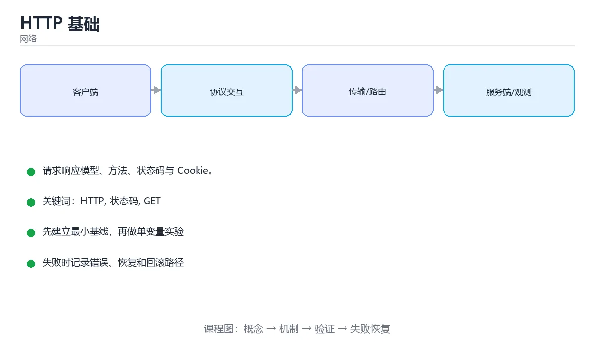

# HTTP 基础



> 内容更新时间：2026-10-03 · 学习阶段：基础 · 预计用时：14 分钟

## 学习目标

- 能用自己的话解释「HTTP 基础」解决了什么问题，而不是只背术语。
- 能说清 「HTTP」、「状态码」、「GET」、「POST」 之间的关系，并分别举出一个例子。
- 能把本课知识放回「网络」的知识体系，说明它和相邻主题的边界。
- 能完成本课练习，并用验收标准检查自己的结果。

> 一句话摘要：请求响应模型、方法、状态码与 Cookie。

## 前置知识

- 会进行基本的文件、命令行或浏览器操作；遇到不熟悉的术语先查本课关键词。
- 本课阶段：基础。建议会读写简单代码或命令，并理解变量、输入输出等基本概念。
- 开始前先复习：HTTP、状态码、GET。
- 如果某一步看不懂，先记录具体卡点，完成练习后再回头读一遍。


## HTTP 是什么

HTTP（超文本传输协议）是浏览器与服务器之间的应用层通信协议，采用**请求 / 响应**模型：客户端发一个请求，服务器返回一个响应。

## 请求与响应

一个典型的 HTTP 请求：

```http
GET /articles/42 HTTP/1.1
Host: example.com
Accept: application/json

```

对应的响应：

```http
HTTP/1.1 200 OK
Content-Type: application/json
Content-Length: 27

{"id": 42, "title": "HTTP"}
```

## 常用请求方法

| 方法 | 含义 | 是否幂等 |
| --- | --- | --- |
| GET | 获取资源 | 是 |
| POST | 新建资源、提交数据 | 否 |
| PUT | 全量更新资源 | 是 |
| PATCH | 部分更新资源 | 否 |
| DELETE | 删除资源 | 是 |

## 状态码

- `2xx` 成功：`200 OK`、`201 Created`、`204 No Content`。
- `3xx` 重定向：`301` 永久、`302` 临时、`304` 未修改。
- `4xx` 客户端错误：`400` 参数错误、`401` 未认证、`403` 无权限、`404` 不存在。
- `5xx` 服务端错误：`500` 内部错误、`502` 网关错误、`503` 服务不可用。

## 无状态与 Cookie

HTTP 本身是无状态的，服务器默认不记得你上次是谁。为了维持登录状态，常用机制是 **Cookie + Session** 或 **Token**：

```http
POST /login HTTP/1.1
Content-Type: application/json

{"username": "tom", "password": "******"}

---

HTTP/1.1 200 OK
Set-Cookie: session_id=abc123; HttpOnly; Secure
```

浏览器后续请求会自动带上 `Cookie: session_id=abc123`。

## 用命令行观察 HTTP

```bash
curl -i https://example.com          # 打印响应头与响应体
curl -X POST -d '{"a":1}' \
     -H 'Content-Type: application/json' \
     https://httpbin.org/post
```

## 排查速查

| 现象 | 优先怀疑 | 检查手段 |
| --- | --- | --- |
| 401 / 403 | 未带 Token、Token 过期、权限不足 | 看请求头 Authorization 与响应体错误码 |
| 404 | 路径拼错、网关路由未配置、资源已删除 | 对比接口文档与实际 URL |
| 405 | 方法用错（GET 当 POST） | 看 Allow 响应头 |
| 429 | 触发限流 | 查 Retry-After，加退避重试 |
| 502 / 504 | 网关到后端失败或超时 | 查网关日志与后端健康状态 |
| 200 但数据不对 | 缓存命中旧内容、字段类型不符 | 看响应头 Cache-Control 与响应体 |

调试顺序：先看状态码 → 再看请求头（Authorization、Content-Type、Cookie）→ 最后看请求体与响应体；用 `curl -i` 或浏览器 Network 面板都能一次拿到这些信息。

## 缓存头的实际协商过程

| 请求/响应 | 头字段 | 作用 |
| --- | --- | --- |
| 响应 | `Cache-Control: max-age=3600` | 强缓存 1 小时，期间不发请求 |
| 响应 | `ETag: "v1"` | 资源版本指纹 |
| 响应 | `Last-Modified: ...` | 资源最后修改时间（精度到秒） |
| 首次过期后请求 | `If-None-Match: "v1"` | 携带上次的 ETag |
| 内容未变 | `304 Not Modified` | 不返回正文，只更新缓存时间 |
| 内容已变 | `200` + 新 ETag | 返回新内容 |

实践建议：带哈希指纹的静态资源（`app.9f2c.js`）用 `max-age=31536000, immutable`；HTML 入口用 `no-cache`（每次都协商）；接口数据用 `no-store` 或短 TTL，避免缓存导致数据不一致。**强缓存优先，协商缓存兜底**，两者配合才能既快又不易出错。

## 压缩与内容协商

请求带 `Accept-Encoding: gzip, br, zstd`，响应用 `Content-Encoding` 指明实际压缩算法。经验：文本类资源（HTML/CSS/JS/JSON）必须开启压缩，通常能减少 60%~80% 体积；图片与视频已压缩，再压无收益；Brotli 在同等级别下通常比 gzip 小 15%~25%，且已有预压缩方案（构建时生成 .br 文件，服务端直接返回）。注意 `Vary: Accept-Encoding` 必须设置，否则代理可能把压缩后的内容发给不支持压缩的客户端。

## 本课小结
理解 HTTP 的关键是四件事：**方法、URL、头部、状态码**。调试接口时，先看状态码，再看请求头，最后看响应体。


## 方法与状态码速查

| 方法 | 语义 | 幂等 | 安全 | 典型场景 |
| --- | --- | --- | --- | --- |
| `GET` | 读取资源 | 是 | 是 | 查询列表、详情 |
| `HEAD` | 只取响应头 | 是 | 是 | 检查资源是否存在 |
| `POST` | 创建资源或提交处理 | 否 | 否 | 下单、提交表单 |
| `PUT` | 全量替换 | 是 | 否 | 覆盖保存 |
| `PATCH` | 局部更新 | 通常否 | 否 | 改昵称、改状态 |
| `DELETE` | 删除资源 | 是 | 否 | 删除记录 |
| `OPTIONS` | 查询支持的方法 | 是 | 是 | CORS 预检 |

| 状态码 | 含义 | 使用要点 |
| --- | --- | --- |
| 200 / 201 / 204 | 成功 / 已创建 / 无内容 | 创建成功返回 201 并给 `Location` |
| 301 / 302 / 307 / 308 | 永久 / 临时重定向 | 307/308 保持原方法 |
| 304 | 资源未修改 | 配合 `ETag` 或 `Last-Modified` |
| 400 / 422 | 请求格式错误 / 语义校验失败 | 返回字段级错误信息 |
| 401 / 403 | 未认证 / 无权限 | 401 让客户端去登录，403 表示身份已确认但禁止 |
| 404 / 410 | 不存在 / 已永久删除 | 区分资源状态 |
| 409 / 412 | 冲突 / 前置条件失败 | 并发更新与乐观锁场景 |
| 429 | 触发限流 | 返回 `Retry-After` |
| 500 / 502 / 503 / 504 | 服务端错误系列 | 502/504 常见于网关与上游超时 |

## 常用请求与响应头速查

| 头部 | 方向 | 作用 |
| --- | --- | --- |
| `Content-Type` | 双向 | 媒体类型，如 `application/json; charset=utf-8` |
| `Accept` | 请求 | 期望的响应类型 |
| `Authorization` | 请求 | 携带令牌 |
| `Cache-Control` | 双向 | `max-age`、`no-store`、`no-cache` |
| `ETag` / `If-None-Match` | 双向 | 协商缓存 |
| `Last-Modified` / `If-Modified-Since` | 双向 | 时间维度缓存 |
| `Set-Cookie` / `Cookie` | 双向 | 会话状态 |
| `Location` | 响应 | 重定向或新资源地址 |
| `Retry-After` | 响应 | 限流后建议重试时间 |
| `X-Request-Id` | 双向 | 链路追踪，排查跨服务问题 |

```http
GET /api/users/42 HTTP/1.1
Host: api.example.com
Accept: application/json
Authorization: Bearer <token>
```

```http
HTTP/1.1 200 OK
Content-Type: application/json; charset=utf-8
Cache-Control: max-age=60
ETag: "abc123"

{"id": 42, "name": "小明"}
```

## 常见错误对照表

| 容易写错的做法 | 实际现象 | 原因与正确做法 |
| --- | --- | --- |
| 用 `GET` 做删除或下单 | 请求可能被预取、重放 | 有副作用的操作使用 `POST` / `PUT` / `DELETE` |
| 所有错误都返回 200 | 客户端无法区分成功与失败 | 正确使用 4xx / 5xx 状态码 |
| 401 与 403 混用 | 客户端跳转逻辑错误 | 401 触发登录，403 提示无权限 |
| 传 JSON 却不写 `Content-Type` | 服务端解析失败 | 明确 `application/json` |
| 在 URL 里传敏感信息 | 被日志与代理记录 | 敏感数据放请求体或请求头 |
| 不设 `Cache-Control` | 中间层缓存了不该缓存的内容 | 私有数据用 `no-store`，静态资源设长缓存 + 指纹 |
| 忽略 `ETag` 协商缓存 | 每次都传完整响应 | 客户端带 `If-None-Match`，服务端返回 304 |
| 无限重试失败请求 | 放大故障 | 只重试幂等方法，加指数退避与上限 |
| 用 `POST` 重试扣款 | 重复扣费 | 使用幂等键（`Idempotency-Key`） |
| 缺少 `X-Request-Id` | 跨服务排查困难 | 网关生成并全链路透传 |

## 自测清单

- [ ] 能说出常用方法的幂等性与安全性。
- [ ] 分得清 401 与 403、400 与 422。
- [ ] 知道强缓存与协商缓存的头部与流程。
- [ ] 会用 `Retry-After` 与指数退避处理限流与重试。
- [ ] 请求带 `X-Request-Id` 便于链路排查。

## 动手练习


> 本课练习重点：围绕「HTTP、状态码、GET」完成复述、实验和交付，每个结果都要能被别人检查。

先抓一次真实请求或画出协议交互，再注入延迟或丢包，最后解释每层变化。

### 练习 1：建立心智模型（10 分钟）

合上教程，用 3～5 句话回答：

1. 「HTTP 基础」解决了什么问题？
2. 如果没有它，会出现什么具体后果？
3. 它和「状态码」是什么关系？

**验收标准**：至少出现一个本课关键词，并写出一个反例、边界条件或失效场景。

### 练习 2：做一次可控实验（20 分钟）

从正文中选一个最小示例，完成以下操作：

1. 先预测修改一个参数、输入或步骤后的结果。
2. 再实际执行或逐步推演，记录真实结果。
3. 如果结果与预测不同，写出差异原因。

**验收标准**：留下「原例 → 改动 → 预测 → 结果 → 原因」五步记录。

### 练习 3：交付一个小结果（30 分钟）

画出一张报文或时序图，标出每一跳的地址、协议、状态和可能失败点。

任务要求：

- 结果必须能被别人检查，不能只写“我已经理解了”。
- 至少覆盖「HTTP」和「状态码」两个关键词。
- 写出 1 个仍然不确定的问题，以及下一步如何验证。

> 提示：时间有限时优先做练习 1 和练习 2；练习 3 可以拆成两次完成。


## 考点精讲：把测验题还原成判断过程

本课有 5 个判断点。先自己作答，再看「判断依据」；如果结论正确但理由不完整，回到正文对应章节补足概念。

### 考点 1：HTTP 状态码 404 表示什么？

- **正确判断**：请求的资源不存在
- **判断依据**：404 Not Found 属于 4xx 客户端错误，表示服务器找不到请求的资源。其他选项：404 表示资源不存在。500 是服务器内部错误，2xx 表示成功，401 表示未认证。正确项「请求的资源不存在」抓住了题干的核心条件，是经得起边界检验的表述。错误项「需要重新认证」把不同概念混在一起，缺少题干限定的前提。错误项「请求成功」在边界或失败路径上会得出错误结果。把题干「HTTP 状态码 404 表示什么？」放回《HTTP 基础》的「请求响应模型、方法、状态码与 Cookie」语境，逐项对照定义与边界条件，就能排除其余说法。
- **迁移检查**：把题干里的一个条件换成边界值，原来的结论还成立吗？写出判断过程。

### 考点 2：下面哪个 HTTP 方法是幂等的？

- **正确判断**：GET
- **判断依据**：GET 重复执行不会改变资源状态，是幂等方法。POST 通常会创建新资源，不幂等。其他选项：GET 是幂等的。正确项「GET」描述正确，能够解释题干场景中的现象与结果。错误项「CONNECT」与课程给出的定义相冲突，不能回答题目所问。错误项「PATCH」只看到了表面现象，没有解释题干真正考查的机制。把题干「下面哪个 HTTP 方法是幂等的？」放回《HTTP 基础》的「请求响应模型、方法、状态码与 Cookie」语境，逐项对照定义与边界条件，就能排除其余说法。
- **迁移检查**：把题干里的一个条件换成边界值，原来的结论还成立吗？写出判断过程。

### 考点 3：HTTP 是无状态的，浏览器通常靠什么维持登录状态？

- **正确判断**：Cookie 与 Session
- **判断依据**：服务器通过 Set-Cookie 下发会话标识，浏览器后续请求自动携带 Cookie，从而识别用户。其他选项：浏览器靠 Cookie 携带会话标识、服务端用 Session 保存状态。端口号、DNS 缓存与 URL 长度都与登录态无关。正确项「Cookie 与 Session」完整覆盖了题目要求的关键点，没有遗漏前提。错误项「TCP 端口号（仅部分场景成立）」把因果关系颠倒了，不能作为正确结论。把题干「HTTP 是无状态的，浏览器通常靠什么维持登录状态？」放回《HTTP 基础》的「请求响应模型、方法、状态码与 Cookie」语境，逐项对照定义与边界条件，就能排除其余说法。
- **迁移检查**：遮住选项，只根据定义复述一次答案，再回来看哪个选项与复述一致。

### 考点 4：POST 与 PUT 的典型区别是？

- **正确判断**：PUT 通常幂等且用于全量更新
- **判断依据**：幂等性意味着重复调用结果一致，这是接口设计的重要区分点。其他选项：PUT 幂等且常用于全量更新，POST 用于新建且不幂等。两者都能携带请求体与 JSON。正确项「PUT 通常幂等且用于全量更新」与本课示例和结论一致，可以直接用于实际编码。错误项「两者完全等价」在边界或失败路径上会得出错误结果。错误项「POST 只能传 JSON」适用于其他场景，但与本题的前提不匹配。错误项「PUT 不能带请求体」把因果关系颠倒了，不能作为正确结论。把题干「POST 与 PUT 的典型区别是？」放回《HTTP 基础》的「请求响应模型、方法、状态码与 Cookie」语境，逐项对照定义与边界条件，就能排除其余说法。
- **迁移检查**：如果给某个错误选项去掉一个限定词，它会不会变成正确？说明理由。

### 考点 5：把一次普通 HTTP/1.1 请求与响应的大致过程调整为正确顺序。

- **正确判断**：1. 建立 TCP 连接 → 2. 客户端发送请求行、请求头和请求体 → 3. 服务器返回状态码、响应头和响应体 → 4. 客户端解析响应并渲染内容
- **判断依据**：HTTP 依赖底层传输连接。客户端通常先建立 TCP 连接，再发送请求行、请求头和可选请求体；服务器处理请求后返回状态码、响应头和响应体；客户端根据状态码和内容类型解析并渲染结果。HTTPS 还会在传输前完成 TLS 握手。理解这个顺序有助于定位连接失败、证书错误、状态码异常和页面内容解析等不同层次的问题。
- **迁移检查**：把每一步的输入与输出写出来，确认上下文确实衔接。

## 本课复习清单

离开本课前，逐项确认：

- [ ] 不看解析，能说出「HTTP 状态码 404 表示什么？」的判断依据。
- [ ] 不看解析，能说出「下面哪个 HTTP 方法是幂等的？」的判断依据。
- [ ] 不看解析，能说出「HTTP 是无状态的，浏览器通常靠什么维持登录状态？」的判断依据。
- [ ] 不看解析，能说出「POST 与 PUT 的典型区别是？」的判断依据。
- [ ] 不看解析，能说出「把一次普通 HTTP/1.1 请求与响应的大致过程调整为正确顺序。」的判断依据。
- [ ] 至少运行一次本课示例，记录输入、输出和一个边界情况。
- [ ] 把本课最容易混淆的两个概念写成一句话对照。

| 复盘项 | 记录 |
| --- | --- |
| 已经能独立解释的考点 |  |
| 仍然说不清的概念 |  |
| 下一步验证动作 |  |

## English Overview

**Title:** HTTP Basics

**Summary:** Request/response, methods, status codes and cookies.

**Category:** Networking  
**Level:** 基础  
**Key terms:** HTTP, 状态码, GET, POST, Cookie, 请求

> The full tutorial is written in Chinese. This bilingual overview helps English readers identify the topic, scope and key terms before studying the detailed examples.

## 内容元数据

- 内容版本：v2.0
- 最后更新：2026-10-03
- 学习阶段：基础
- 适用环境：TCP/IP、HTTP/2、HTTP/3 与现代网络栈
- 内容来源：内置结构化课程与工程实践整理
- 相关主题：HTTP、状态码、GET、POST、Cookie、请求
- 质量版本：P0 测验标准 + P1 覆盖扩展 + P2 体验补全


## Full English Study Guide

### Overview

**HTTP Basics** focuses on Request/response, methods, status codes and cookies.

### Learning Outcomes

- Explain what **HTTP Basics** solves and when it should be used.
- Identify inputs, outputs, state and failure boundaries.
- Build a minimal reproducible example and observe the real result.
- Test normal, boundary and failure paths.
- Measure performance, resource cost or security impact before optimizing.
- Document the decision, rollback path and remaining uncertainty.

### Core Mental Model

1. **Problem first:** define the exact problem before choosing a tool or pattern.
2. **Smallest example:** reduce the system to one input and one observable output.
3. **State and flow:** trace how data, control or responsibility moves through the system.
4. **Boundaries:** identify invalid input, resource limits, timeouts and permission edges.
5. **Evidence:** use tests, logs, metrics or reproductions instead of intuition.
6. **Trade-offs:** compare correctness, latency, cost, complexity and operability.

### Step-by-step Study Plan

1. Read the Chinese lesson once and write down the main problem in one sentence.
2. Run the smallest example and save the exact command and output.
3. Change only one input or parameter and predict the result before running it.
4. Introduce one failure and record how the system detects, reports and recovers.
5. Write one test or checklist item for the normal, boundary and failure paths.
6. Complete the quiz and explain every wrong answer in your own words.

### Practice Tasks

- Rebuild the minimal example from an empty directory.
- Add one boundary test and one failure test.
- Produce a short report containing the baseline, change, result and rollback.

### Common Failure Modes

- Treating a happy-path demo as production readiness.
- Skipping boundary values and invalid inputs.
- Optimizing before establishing a measurable baseline.
- Hiding errors, permissions or resource limits.

### Self-check Questions

1. What is the smallest observable result that proves this lesson works?
2. What input or state is most likely to break it?
3. Which metric or test would reveal a regression?
4. What is the rollback path?
5. What is the cost of using this approach at 10x scale?
6. Which adjacent topic is most often confused with this one?

### Glossary

- Topic: **HTTP Basics**
- Related terms: HTTP, 状态码, GET, POST
- Primary evidence: command output, tests, logs, metrics or reproductions

> This guide is an English study companion for the detailed Chinese lesson. It covers the learning path, mental model and acceptance questions; code examples and engineering details remain in the main tutorial.


## Bilingual Section Outline

| 中文小节 | English section |
| --- | --- |
| 学习目标 | Learning objectives |
| 前置知识 | Prerequisites |
| HTTP 是什么 | HTTP 是什么 |
| 请求与响应 | 请求与响应 |
| 常用请求方法 | 常用请求方法 |
| 状态码 | 状态码 |
| 无状态与 Cookie | 无状态与 Cookie |
| 用命令行观察 HTTP | 用命令行观察 HTTP |
| 排查速查 | 排查速查 |
| 缓存头的实际协商过程 | Cache头的实际协商过程 |

> 该大纲把每个中文小节映射为英文标题，配合 Full English Study Guide 使用。


## 参考资料与复核

- 最后复核：2026-10-04
- 下次复核：2027-04-04
- 复核范围：版本兼容、API 行为、安全建议与工程实践
- 来源性质：官方文档与标准；本课正文为离线教学重组，不复制原文

| 参考资料 | 本课用途 |
| --- | --- |
| [RFC Editor](https://www.rfc-editor.org/) | 互联网协议标准 |
| [MDN HTTP](https://developer.mozilla.org/docs/Web/HTTP) | HTTP 语义与浏览器行为 |

> 本课主题：请求响应模型、方法、状态码与 Cookie。

> App 完全离线展示文字链接，不会自动联网；需要延伸阅读时可复制链接到浏览器。

