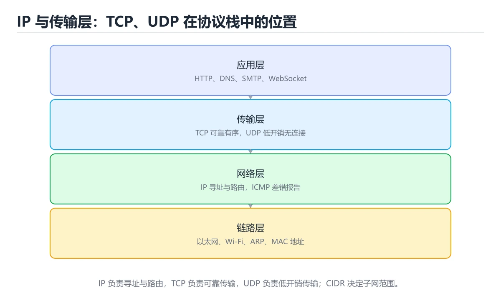
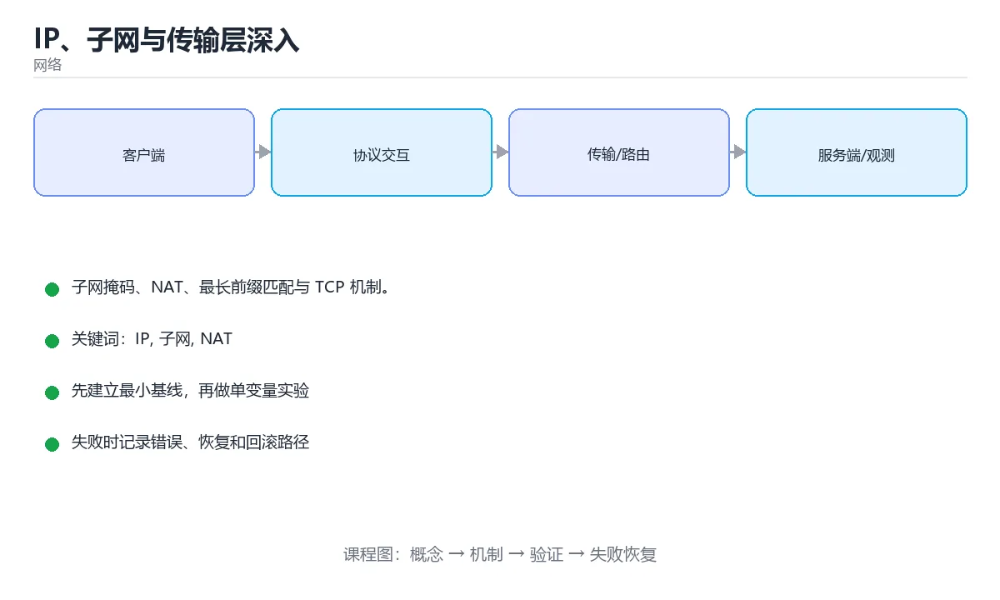

# IP、子网与传输层深入

> 内容更新时间：2026-10-06





## 学习目标

- 能用自己的话解释IP、子网与传输层深入解决了什么问题，而不是只背术语。
- 能说清 「IP」、「子网」、「NAT」、「TCP」 之间的关系，并分别举出一个例子。
- 能把本课知识放回「网络」的知识体系，说明它和相邻主题的边界。
- 能完成本课练习，并用验收标准检查自己的结果。

> 一句话摘要：子网掩码、NAT、最长前缀匹配与 TCP 机制。

## 前置知识

- 先完成上一课《HTTP/2 与 HTTP/3》；如果已经掌握，可以直接用本课练习自测。
- 开始前先复习：IP、子网、NAT。
- 如果某一步看不懂，先记录具体卡点，完成练习后再回头读一遍。

## IP 层要解决的问题

IP 负责**寻址与转发**：给每台主机一个地址，让路由器把数据包一跳一跳送到目的地。它不保证可靠、不保证顺序，这些交给传输层。

## IPv4 地址与子网

地址 32 位，通常写成点分十进制。子网掩码决定网络位与主机位：`192.168.1.10/24` 表示前 24 位是网络号，可用主机 254 个。

| 概念 | 说明 |
| --- | --- |
| 私有地址段 | 10.0.0.0/8、172.16.0.0/12、192.168.0.0/16 |
| NAT | 局域网多台设备共用一个公网出口地址 |
| CIDR | 用前缀长度灵活划分子网 |
| 广播/组播 | 一对全、一对多发送 |
| MTU | 单帧最大传输单元，超长需分片（通常 1500 字节） |

IPv6 用 128 位地址解决枯竭问题，取消 NAT、简化报头，并原生支持自动配置。

## 路由与转发

路由器查路由表做**最长前缀匹配**：目的地址匹配到多条路由时，选前缀最长（最具体）的那条。默认路由 0.0.0.0/0 是最后兜底。traceroute 利用逐步增大的 TTL 探测路径上的每一跳。

## 传输层：TCP 的核心机制

1. **序号与确认**：保证数据不丢、不重、按序。
2. **滑动窗口**：接收方通告可接收窗口，实现流量控制。
3. **拥塞控制**：慢启动、拥塞避免、快重传、快恢复；现代算法有 CUBIC、BBR。
4. **超时重传与 RTO 自适应**：根据 RTT 动态计算重传超时。
5. **连接管理**：三次握手建立、四次挥手释放，TIME_WAIT 保证旧包不干扰新连接。

UDP 只做端口复用与校验和，无连接、无重传、开销小，适合实时音视频、DNS 与游戏；可靠性需要应用层自行补齐（QUIC 就是典型）。

## 排障工具

| 工具 | 用途 |
| --- | --- |
| ping | 测连通与 RTT |
| traceroute / tracert | 看路径与哪一跳异常 |
| tcpdump / Wireshark | 抓包看握手、重传、RST |
| ss -s / netstat | 看连接状态分布与端口占用 |
| mtr | 连续探测并统计每跳丢包率 |
| ip route / ip addr | 查看路由表与网卡地址 |

## 常见故障模式

连不上先分清是 DNS、路由还是端口问题；大量 TIME_WAIT 说明短连接过多，应改用连接池；CLOSE_WAIT 堆积说明应用没有正确关闭连接；重传率高通常是链路质量或 MTU 问题。

## 本课小结
IP 负责"送到哪台机器"，TCP/UDP 负责"送到哪个程序、是否可靠"。掌握子网划分、最长前缀匹配与 TCP 四大机制，排障时就能按层定位。

## IP 与子网速查

| 前缀 | 子网掩码 | 可用主机数 | 常见用途 |
| --- | --- | --- | --- |
| /31 | 255.255.255.254 | 2（点对点） | 链路互联 |
| /30 | 255.255.255.252 | 2 | 点对点链路 |
| /29 | 255.255.255.248 | 6 | 小网段 |
| /24 | 255.255.255.0 | 254 | 常规子网 |
| /16 | 255.255.0.0 | 65534 | 大型内网 |
| /8 | 255.0.0.0 | 约 1677 万 | 超大型 |

| 私有地址段 | 范围 |
| --- | --- |
| 10.0.0.0/8 | 10.0.0.0 到 10.255.255.255 |
| 172.16.0.0/12 | 172.16.0.0 到 172.31.255.255 |
| 192.168.0.0/16 | 192.168.0.0 到 192.168.255.255 |
| 127.0.0.0/8 | 本机回环 |
| 169.254.0.0/16 | 链路本地（DHCP 失败时出现） |

## 传输层速查

| 维度 | TCP | UDP |
| --- | --- | --- |
| 连接 | 面向连接 | 无连接 |
| 可靠性 | 确认与重传 | 不保证 |
| 顺序 | 保证有序 | 不保证 |
| 流量与拥塞控制 | 有 | 无（应用层自实现） |
| 头部开销 | 20 字节起 | 8 字节 |
| 适用 | 文件、HTTP、数据库 | DNS、音视频、游戏、QUIC |

```bash
# 查看路由与接口
ip route show
ip -br addr
traceroute -n 8.8.8.8        # 逐跳观察路径
mtr -n 8.8.8.8               # 持续观察每跳丢包与延迟

# 查看连接与监听
ss -tan state established | head
ss -s                        # 汇总各类 socket 数量

# 排查 MTU 与分片（禁止分片 + 指定大小）
ping -M do -s 1472 8.8.8.8   # 1472 + 28 = 1500，成功说明路径 MTU 至少 1500
```

```python
import ipaddress

def subnet_info(cidr: str) -> dict:
    """子网信息速算：网络号、广播地址、可用主机范围与数量。"""
    net = ipaddress.ip_network(cidr, strict=False)
    hosts = list(net.hosts()) if net.num_addresses > 2 else []
    return {
        "network": str(net.network_address),
        "netmask": str(net.netmask),
        "broadcast": str(net.broadcast_address),
        "first_host": str(hosts[0]) if hosts else None,
        "last_host": str(hosts[-1]) if hosts else None,
        "usable_hosts": len(hosts),
    }

def same_subnet(ip_a: str, ip_b: str, cidr: str) -> bool:
    """判断两个地址是否在同一子网（不依赖能否 ping 通）。"""
    net = ipaddress.ip_network(cidr, strict=False)
    return ipaddress.ip_address(ip_a) in net and ipaddress.ip_address(ip_b) in net

print(subnet_info("192.168.10.0/24"))
print(same_subnet("192.168.10.5", "192.168.10.200", "192.168.10.0/24"))
```

## 常见错误对照表

| 容易踩的做法 | 实际现象 | 原因与正确做法 |
| --- | --- | --- |
| 把广播地址当可用主机 | 地址冲突 | 网络号与广播地址不可分配给主机 |
| 认为 /24 有 256 个可用地址 | 少算了两个 | 可用 254 个 |
| 忽略 169.254 地址 | 网络不可用却查不出原因 | 说明 DHCP 失败，检查获取流程 |
| 用 `ping` 判断端口是否开放 | 结论不准确 | 用 `nc -zv` 或 `ss` 验证 |
| 忽视 MTU 与分片 | 大包超时、小包正常 | 检查路径 MTU，必要时调整 MSS |
| 认为 UDP 一定更快 | 应用层补偿开销被忽略 | 需要可靠性时选 TCP 或 QUIC |
| 混淆流量控制与拥塞控制 | 优化方向错误 | 流量控制面向接收方，拥塞控制面向网络 |
| 只用 `netstat` 不用 `ss` | 大连接数下很慢 | 用 `ss`（内核 netlink 实现） |
| 忽略 TIME_WAIT 与端口耗尽 | 客户端无法新建连接 | 使用连接池，必要时调整内核参数 |
| 认为 NAT 后能直接被外部访问 | 连接失败 | 需要端口映射或反向通道 |

## 自测清单

- [ ] 能快速判断子网的网络号、广播地址与可用主机数。
- [ ] 知道私有地址段与回环、链路本地地址范围。
- [ ] 能按需求在 TCP 与 UDP 之间选择。
- [ ] 会用 `ip`、`ss`、`traceroute`、`mtr` 排查网络。
- [ ] 知道如何验证路径 MTU 与排查分片问题。

## 动手练习

> 本课练习重点：围绕「IP、子网、NAT」完成复述、实验和交付，每个结果都要能被别人检查。

先抓一次真实请求或画出协议交互，再注入延迟或丢包，最后解释每层变化。

### 练习 1：建立心智模型（10 分钟）

合上教程，用 3～5 句话回答：

1. IP、子网与传输层深入解决了什么问题？
2. 如果没有它，会出现什么具体后果？
3. 它和「子网」是什么关系？

**验收标准**：至少出现一个本课关键词，并写出一个反例、边界条件或失效场景。

### 练习 2：做一次可控实验（20 分钟）

从正文中选一个最小示例，完成以下操作：

1. 先预测修改一个参数、输入或步骤后的结果。
2. 再实际执行或逐步推演，记录真实结果。
3. 如果结果与预测不同，写出差异原因。

**验收标准**：留下「原例 → 改动 → 预测 → 结果 → 原因」五步记录。

### 练习 3：交付一个小结果（30 分钟）

画出一张报文或时序图，标出每一跳的地址、协议、状态和可能失败点。

任务要求：

- 结果必须能被别人检查，不能只写“我已经理解了”。
- 至少覆盖「IP」和「子网」两个关键词。
- 写出 1 个仍然不确定的问题，以及下一步如何验证。

> 提示：时间有限时优先做练习 1 和练习 2；练习 3 可以拆成两次完成。

## 可运行练习

### 任务 1：先跑通，再解释

```python
import ipaddress

def subnet_info(cidr: str) -> dict:
    """子网信息速算：网络号、广播地址、可用主机范围与数量。"""
    net = ipaddress.ip_network(cidr, strict=False)
    hosts = list(net.hosts()) if net.num_addresses > 2 else []
    return {
        "network": str(net.network_address),
        "netmask": str(net.netmask),
        "broadcast": str(net.broadcast_address),
        "first_host": str(hosts[0]) if hosts else None,
        "last_host": str(hosts[-1]) if hosts else None,
        "usable_hosts": len(hosts),
    }

def same_subnet(ip_a: str, ip_b: str, cidr: str) -> bool:
    """判断两个地址是否在同一子网（不依赖能否 ping 通）。"""
    net = ipaddress.ip_network(cidr, strict=False)
    return ipaddress.ip_address(ip_a) in net and ipaddress.ip_address(ip_b) in net

print(subnet_info("192.168.10.0/24"))
print(same_subnet("192.168.10.5", "192.168.10.200", "192.168.10.0/24"))
```

### 任务 2：只改一个条件

把「IP、子网与传输层深入」的最小示例复制一份，只改一个条件再跑一次：

- 改动点：只把IP的输入换成空值、极值或错误输入，其余保持不变。
- 预测：先写下「IP、子网与传输层深入」在改动后的输出或错误信息，再运行。
- 记录：对照改动前后的结果，指出差异出在哪一步。
- 验收：换回原条件能复现原结果，改动只影响IP。

### 任务 3：迁移到自己的数据

用同一套思路处理一组你自己的数据或场景，保持输出格式与任务 1 一致。

## 故障现场

### 现场 1：本课的 IP 常规用例通过，但边界用例失败

**症状**：在本课的练习或生产场景里出现“本课的 IP 常规用例通过，但边界用例失败”。

**复现**：准备一组最小输入，只保留触发“本课的 IP 常规用例通过，但边界用例失败”的必要条件，连续运行两次确认结果稳定。

**定位**：围绕“IP 的前置条件与取值边界没有写进代码，默认值掩盖了空值和极值”检查调用链、输入数据和环境配置，先验证假设再改代码。

**预防**：把“本课的 IP 常规用例通过，但边界用例失败”写成一条自动化用例，并在本课的验收清单里保留对应检查项。

### 现场 2：本课的 子网 结果在两次运行之间不一致

**症状**：在本课的练习或生产场景里出现“本课的 子网 结果在两次运行之间不一致”。

**复现**：准备一组最小输入，只保留触发“本课的 子网 结果在两次运行之间不一致”的必要条件，连续运行两次确认结果稳定。

**定位**：围绕“子网 依赖了当前版本、执行顺序或共享状态，单次运行无法暴露差异”检查调用链、输入数据和环境配置，先验证假设再改代码。

**预防**：把“本课的 子网 结果在两次运行之间不一致”写成一条自动化用例，并在本课的验收清单里保留对应检查项。

### 现场 3：请求偶发超时，但服务端监控看起来正常

**症状**：在本课的练习或生产场景里出现“请求偶发超时，但服务端监控看起来正常”。

## 深入补充：IP、子网与传输层深入 的取舍与边界

### 一、把概念放回真实约束

学习IP、子网与传输层深入时，最容易只记住结论而忽略前提。先写出三个约束：数据规模、时间预算、可接受的失败方式；再判断 IP 与 子网 在这些约束下是否仍然成立。只要约束改变，原来的最优解就可能变成错误解。

| 场景 | 协议或方案 | 延迟与可靠性 | 排障入口 |
| --- | --- | --- | --- |
| 强一致请求 | TCP / HTTP | 可靠但可能队头阻塞 | 连接与重传指标 |
| 实时音视频 | UDP / QUIC | 低延迟但允许丢包 | 抖动与丢包率 |
| 大规模分发 | CDN 与缓存 | 就近命中 | 命中率与回源 |
| 服务间调用 | RPC 或消息队列 | 取决于确认机制 | 超时、重试与幂等 |

### 二、三个容易混淆的边界

1. 澄清输入与目标。先写清「IP、子网与传输层深入」要解决的问题、合法输入范围和成功标准，再进入后续步骤。
2. **把“平均值”当成“全部”**：IP 的指标好看，不代表尾部请求、冷启动或失败重试也好看。
3. **把“当前版本”当成“永久行为”**：子网 依赖的默认值、API 或性能特征都可能随版本变化，需要固定版本并保留回归用例。

### 三、一个生产场景

假设团队要在真实系统里使用IP、子网与传输层深入：第一周先做小流量验证，记录 IP 的基线与异常；第二周扩大输入规模，观察 子网 是否成为瓶颈；第三周再做故障演练，主动注入超时、重复请求和依赖不可用，确认系统能降级、能重试、能恢复。每一步都要留下指标、日志和结论，而不是只留下“感觉更快了”。

### 四、自测清单

- 能否用一句话说出IP、子网与传输层深入解决的核心问题与不适用场景？
- 能否画出 IP 的数据流或状态变化，并标出失败路径？
- 能否给出一个反例，证明某个看似合理的结论在边界条件下不成立？
- 能否写出一条可复现的验证命令，让别人独立得到相同结论？

## 本课复习清单

离开本课前，逐项确认：

- [ ] 不看解析，能说出「路由器转发时如何选择路由？」的判断依据。
- [ ] 不看解析，能说出「TCP 的流量控制依靠什么机制？」的判断依据。
- [ ] 不看解析，能说出「TIME_WAIT 状态的主要作用是？」的判断依据。
- [ ] 不看解析，能说出的判断依据。
- [ ] 不看解析，能说出「TCP 流量控制与拥塞控制的区别是？」的判断依据。
- [ ] 至少运行一次本课示例，记录输入、输出和一个边界情况。
- [ ] 把本课最容易混淆的两个概念写成一句话对照。

| 复盘项 | 记录 |
| --- | --- |
| 已经能独立解释的考点 |  |
| 仍然说不清的概念 |  |
| 下一步验证动作 |  |

## 术语速查

| 术语 | 本课语境 |
| --- | --- |
| `192.168.1.10/24` | 地址 32 位，通常写成点分十进制。子网掩码决定网络位与主机位：`192.168.1.10/24` 表示前 24 位是网络号，可用主机 254 个。 |
| `ping` | \| 用 `ping` 判断端口是否开放 \| 结论不准确 \| 用 `nc -zv` 或 `ss` 验证 \| |
| `nc -zv` | \| 用 `ping` 判断端口是否开放 \| 结论不准确 \| 用 `nc -zv` 或 `ss` 验证 \| |
| `ss` | \| 用 `ping` 判断端口是否开放 \| 结论不准确 \| 用 `nc -zv` 或 `ss` 验证 \| |
| `netstat` | \| 只用 `netstat` 不用 `ss` \| 大连接数下很慢 \| 用 `ss`（内核 netlink 实现） \| |
| `ip` | [ ] 会用 `ip`、`ss`、`traceroute`、`mtr` 排查网络。 |

## 考点精讲

### 考点 1：多选辨析·IP

- **题目**：围绕“IP、子网与传输层深入”中的 IP、子网、NAT，下列哪两项是本课强调的实践判断？
- **判断依据**：本课把IP、子网与传输层深入拆成概念、示例与故障现场三部分，因此判断 IP 时必须同时交代输入、输出和失败路径，这使“学习 IP 时要同时说明输入、输出和失败路径，不能只看正常流程”成立。在IP、子网与传输层深入里，判断 子网 时要固定版本与边界输入，所以“验证 子网 时要固定版本并覆盖边界输入，结论才可复现”才可复现。

### 考点 2：概念判断·IP

- **题目**：TCP 的流量控制依靠什么机制？
- **判断依据**：接收方通告可接收窗口大小，发送方据此调整发送量。其他选项：流量控制靠滑动窗口（接收方通告的窗口）。这道题的关键在「IP、子网与传输层深入」的IP、子网、NAT：先确认题干“TCP 的流量控制依靠什么机制”问的是哪一步，再排除偷换前提的选项。

### 考点 3：概念判断·IP

- **题目**：TIME_WAIT 状态的主要作用是？
- **判断依据**：在「IP、子网与传输层深入」里，确保旧连接的报文不干扰新连接。同时保证最后的 ACK 能被对方收到。「IP、子网与传输层深入」要求先交代IP、子网、NAT的前提再下结论，所以“确保旧连接的报文不干扰新连接”只在题干“TIMEWAIT 状态的主要作用是”给定的条件下成立。把“确保旧连接的报文不干扰新连接”代回「IP、子网与传输层深入」里“TIMEWAIT 状态的主要作用是”的例子核对，条件一旦改变，结论就要用IP、子网、NAT重新推导。

### 考点 4：代码补全·IP

- **题目**：这段代码代码是「IP、子网与传输层深入」的示例片段，下面哪一项描述与它一致？
- **判断依据**：在「IP、子网与传输层深入」里，题干的正确项是这段代码包含循环结构，同一段逻辑会被重复执行，在「IP、子网与传输层深入」里循环次数与IP的输入规模直接相关。把输入或边界换成空值、极值或失败情况后，结论要以「IP、子网与传输层深入」的实际运行结果为准。这道题的关键在「IP、子网与传输层深入」的IP、子网、NAT：先确认题干“这段代码代码是IP、子网与传输层深入”问的是哪一步，再排除偷换前提的选项。

### 考点 5：概念判断·IP

- **题目**：TCP 流量控制与拥塞控制的区别是？
- **判断依据**：在「IP、子网与传输层深入」里，流量控制防止压垮接收方（接收窗口）。实际发送窗口取两者较小值，这也是滑动窗口与拥塞窗口需要同时考虑的原因。这道题的关键在「IP、子网与传输层深入」的IP、子网、NAT：先确认题干“TCP 流量控制与拥塞控制的区别是”问的是哪一步，再排除偷换前提的选项。

### 考点 6：填空·IP

- **题目**：补全代码：「IP、子网与传输层深入」示例中，下面这行代码缺少哪个关键字或函数名？请填入 ____。 `____ -n 8.8.8.8 # 逐跳观察路径`
- **判断依据**：在「IP、子网与传输层深入」里，traceroute。这道题的关键在「IP、子网与传输层深入」的IP、子网、NAT：先确认题干“补全代码”问的是哪一步，再排除偷换前提的选项。回到IP、子网、NAT本身再看一遍：只有“traceroute”与题干“子网与传输层深入示例中”的前提一致，结论才成立。

## English Overview

**Title:** IP, Subnets & Transport

**Summary:** Subnets, NAT, longest prefix match and TCP.

**Category:** Networking
**Level:** 高级
**Key terms:** IP, 子网, NAT, TCP, 拥塞控制, MTU

## 内容元数据

- 内容版本：v2.0
- 最后更新：2026-10-06
- 学习阶段：高级
- 适用环境：TCP/IP、HTTP/2、HTTP/3 与现代网络栈
- 内容来源：内置结构化课程与工程实践整理
- 相关主题：IP、子网、NAT、TCP、拥塞控制、MTU
- 质量版本：P0 测验标准 + P1 覆盖扩展 + P2 体验补全

## 参考资料与复核

- 最后复核：2026-10-04
- 下次复核：2027-04-04
- 复核范围：版本兼容、API 行为、安全建议与工程实践
- 来源性质：官方文档、标准或权威教材；正文为离线教学重组

| 参考资料 | 本课用途 |
| --- | --- |
| [RFC 9293 TCP](https://www.rfc-editor.org/rfc/rfc9293) | TCP 连接、重传与拥塞 |
| [RFC 9000 QUIC](https://www.rfc-editor.org/rfc/rfc9000) | QUIC 传输与连接迁移 |
| [RFC 9113 HTTP/2](https://www.rfc-editor.org/rfc/rfc9113) | HTTP/2 多路复用与流 |

> 「IP、子网与传输层深入」的链接用于离线阅读后的延伸核对；App 不会自动联网。
