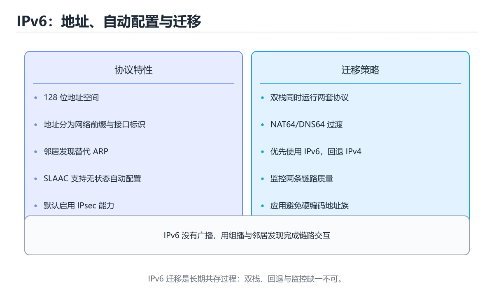
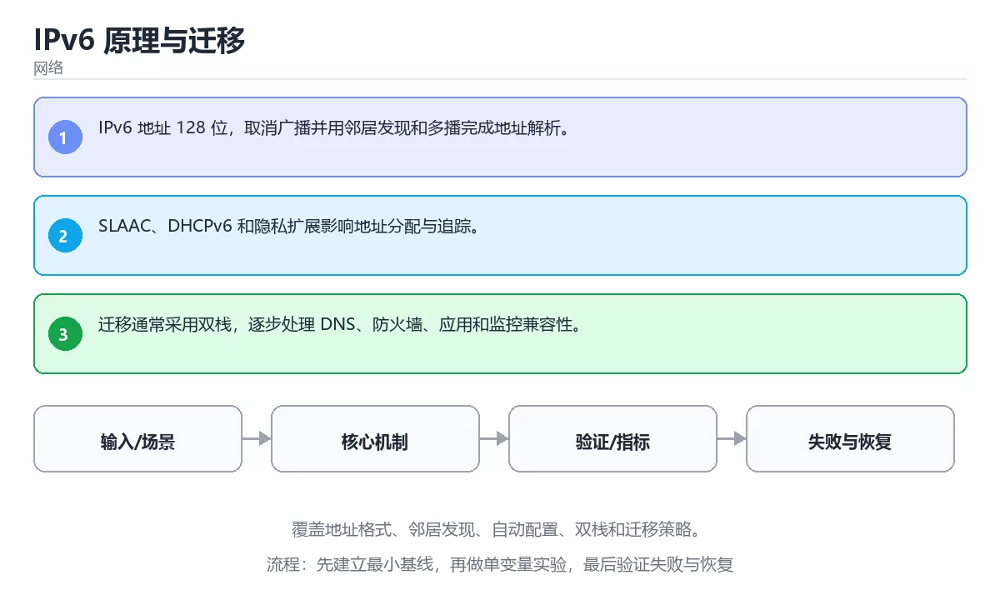

# IPv6 原理与迁移

> 内容更新时间：2026-10-06 · 学习阶段：高级 · 预计用时：40 分钟





## 本节知识框架

**课程定位**：所属分类 `network`（网络），课程主题 `IPv6 原理与迁移`，学习阶段 高级，建议用时 40 分钟。

本课主线：覆盖地址格式、邻居发现、自动配置、双栈和迁移策略。

**学完本课应当能够**
- 说清 `IPv6` 与 `NDP` 的含义与区别，并各举一个正例和一个反例。
- 用本课示例验证 `双栈` 的行为，记录输入、输出与失败条件。
- 遇到「以为只是地址变长」这类问题时，能说出触发条件与修复顺序。

### 从概念到验证的学习链条

1. `IPv6`：先掌握 128 位地址的新一代 IP 协议，扩大地址空间并改进邻居发现，再用它解释 `NDP` 为什么会出现。
2. `NDP`：先掌握 IPv6 邻居发现协议，负责地址解析、路由器发现和可达性检测，再用它解释 `双栈` 为什么会出现。
3. `双栈`：先掌握 过渡与共存：现实中 IPv6 与 IPv4 会长期共存，常见策略有三种：双栈（同一台机器同时拥有两种地址），再用它解释 `迁移` 为什么会出现。
4. `迁移`：先掌握 结合IPv6、NDP、双栈、迁移，写出一个真实项目中的使用场景，再用它解释 `NAT` 为什么会出现。
5. `NAT`：先掌握 把内网地址转换成公网地址，让多台设备共享一个出口 IP，再用它解释 `DNS` 为什么会出现。
6. `DNS`：先掌握 把域名解析成 IP 的层次化系统，排查时要区分递归解析器、权威服务器与本地缓存，再用它解释 本课示例的观察结果 为什么会出现。

**先修与衔接**：本课是「网络」分类的第 20 课。先修内容：《渗透测试基础》。《渗透测试基础》里的 `渗透测试`、`nmap` 是本课的前提。相关或后续课程：《NAT、隧道与 VPN》。

### 完成判据

- **定义关**：不看正文也能说明 `IPv6` 是 128 位地址的新一代 IP 协议，扩大地址空间并改进邻居发现，并指出一个反例。
- **机制关**：能按“输入 → 转换 → 输出 → 验证”复述 `IPv6 原理与迁移`，而不是只背结论。
- **示例关**：能运行或推演 `IPv6 原理与迁移` 的 `text` 示例，并说明一个真实出现的标识符或字面量。
- **证据关**：能指出 `IPv6 原理与迁移` 示例里的 调用了 `print()`，并说明它支持或反驳了本课的哪一条结论。
- **排错关**：能复现 以为只是地址变长，记录现象并按 重新学习地址类型、邻居发现与无状态配置 修复。
- **迁移关**：能把 `IPv6`、`NDP`、`双栈`、`迁移` 放进一个与 `IPv6 原理与迁移` 不同的项目场景，并保持输入与验证条件可追踪。
- **复盘关**：学完 `IPv6 原理与迁移` 后，用一句话写下仍然不确定的结论，并列出下一次验证需要的输入、环境和成功判据。

### 复习清单

- [ ] 能不看正文复述本课核心术语，并指出一个边界或反例。
- [ ] 能运行或推演本课示例，记录输入、输出与失败现象。
- [ ] 能完成一次自测，并把错题对照错误表定位原因。

## 核心概念定义

| 术语 | 操作性定义 | 常见边界与风险 |
| --- | --- | --- |
| IPv6 | 128 位地址的新一代 IP 协议，扩大地址空间并改进邻居发现。 | 网络延迟、超时与版本协商会改变行为，只在真实链路或多版本客户端上验证才算数。 |
| NDP | IPv6 邻居发现协议，负责地址解析、路由器发现和可达性检测。 | 网络延迟、超时与版本协商会改变行为，只在真实链路或多版本客户端上验证才算数。 |
| 双栈 | 过渡与共存：现实中 IPv6 与 IPv4 会长期共存，常见策略有三种：双栈（同一台机器同时拥有两种地址）。 | 易错：部分用户无法访问；正确做法是两条协议栈同时配置并分别监控可达性。 |
| 迁移 | 结合IPv6、NDP、双栈、迁移，写出一个真实项目中的使用场景。 | 越界、悬垂引用与释放顺序会破坏结论，必须在边界输入下复验。 |
| NAT | 把内网地址转换成公网地址，让多台设备共享一个出口 IP | 共享状态与调度顺序会改变结论，单线程或串行测试通过不等于并发下成立。 |
| DNS | 把域名解析成 IP 的层次化系统，排查时要区分递归解析器、权威服务器与本地缓存 | 缓存与状态残留会让结果过期，先明确失效策略再判断正确性。 |

## 原理与运行机制

### 机制总览

**教材衔接：核心知识**

### 1. IPv6 地址 128 位，取消广播并用邻居发现和多播完成地址解析。

- 关键做法：基线只保留 NDP 必需的部分，其余条件一次加一个。
- 验证标准：IPv6 的结果可复现、错误可解释、失败能恢复。

### 2. SLAAC、DHCPv6 和隐私扩展影响地址分配与追踪。

把这条结论放回「IPv6 原理与迁移」的完整流程里展开：

- 正文依据：能用自己的话解释：IPv6 地址 128 位，取消广播并用邻居发现和多播完成地址解析。
- 落地检查：把「2. SLAAC、DHCPv6 和隐私扩展影响地址分配与追踪。」改写成一条可执行的核对项，逐条验证输入、超时与失败路径。

### 3. 迁移通常采用双栈，逐步处理 DNS、防火墙、应用和监控兼容性。

把这条结论放回「IPv6 原理与迁移」的完整流程里展开：

- 正文依据：能用自己的话解释：迁移通常采用双栈，逐步处理 DNS、防火墙、应用和监控兼容性。
- 落地检查：把「3. 迁移通常采用双栈，逐步处理 DNS、防火墙、应用和监控兼容性。」改写成一条可执行的核对项，逐条验证输入、超时与失败路径。

**教材衔接：关键流程**

**教材衔接：实践路径**

**教材衔接：深入理解：IPv6 原理与迁移**

### 地址写法与分配

IPv6 用 128 位地址，写成 8 组十六进制，每组 4 位；连续的全零组可以用 `::` 压缩一次。
地址前缀通常写成 `2001:db8::/32`。与 IPv4 不同，IPv6 没有广播地址，主机通过
邻居发现（NDP）解析链路层地址，也可以在收到路由器通告后自动配置（SLAAC）。

### 过渡与共存

现实中 IPv6 与 IPv4 会长期共存，常见策略有三种：双栈（同一台机器同时拥有两种地址）、
隧道（把 IPv6 包封装进 IPv4 传输）、翻译（NAT64/DNS64 让只有 IPv6 的主机访问 IPv4 服务）。
部署时要同时考虑 DNS 的 A/AAAA 记录、防火墙规则和应用的地址选择策略，否则会出现
「解析到 IPv6 却连不通」的问题。

### 没有 NAT 意味着什么

IPv6 地址空间足够大，设计目标是端到端可达，不再依赖 NAT 隐藏内网。但「无 NAT」不等于
「无安全边界」：边界防火墙仍然要显式放行流量，隐私地址用于避免跟踪，运营商也可能
分配动态前缀。写网络程序时不要假设对端一定在 NAT 后，也不要假设地址永远不变。

「IPv6 原理与迁移」的「地址写法与分配」一节补全如下：

- 定位：这一节说明地址写法与分配在「IPv6 原理与迁移」知识体系里的位置。
- 要点：IPv6 用 128 位地址，写成 8 组十六进制，每组 4 位；连续的全零组可以用 :: 压缩一次。
- 自检：能否用一个最小例子解释地址写法与分配？

「IPv6 原理与迁移」的「过渡与共存」一节补全如下：

- 定位：这一节说明过渡与共存在「IPv6 原理与迁移」知识体系里的位置。
- 要点：地址前缀通常写成 2001:db8::/32。与 IPv4 不同，IPv6 没有广播地址，主机通过
- 自检：能否用一个最小例子解释过渡与共存？

「IPv6 原理与迁移」的「没有 NAT 意味着什么」一节补全如下：

- 定位：这一节说明没有 NAT 意味着什么在「IPv6 原理与迁移」知识体系里的位置。
- 要点：邻居发现（NDP）解析链路层地址，也可以在收到路由器通告后自动配置（SLAAC）。
- 自检：能否用一个最小例子解释没有 NAT 意味着什么？

**教材衔接：深入补充：IPv6 原理与迁移 的取舍与边界**


### 四、自测清单

**教材衔接：验证步骤**

### 机制拆解：每一步的输入、动作与输出

#### 1. `IPv6`
- 输入：`IPv6`；本步把 128 位地址的新一代 IP 协议，扩大地址空间并改进邻居发现 当作判断规则。
- 动作：围绕 `IPv6` 保留中间状态，并记录它与 `NDP` 的对应关系。
- 输出：`NDP`，它可以被下一段代码、测试或记录继续使用。
- `IPv6` 的失败条件：网络延迟、超时与版本协商会改变行为，只在真实链路或多版本客户端上验证才算数。

#### 2. `NDP`
- 输入：`IPv6`；本步把 IPv6 邻居发现协议，负责地址解析、路由器发现和可达性检测 当作判断规则。
- 动作：围绕 `NDP` 保留中间状态，并记录它与 `双栈` 的对应关系。
- 输出：`双栈`，它可以被下一段代码、测试或记录继续使用。
- `NDP` 的失败条件：网络延迟、超时与版本协商会改变行为，只在真实链路或多版本客户端上验证才算数。

#### 3. `双栈`
- 输入：`NDP`；本步把 过渡与共存：现实中 IPv6 与 IPv4 会长期共存，常见策略有三种：双栈（同一台机器同时拥有两种地址） 当作判断规则。
- 动作：围绕 `双栈` 保留中间状态，并记录它与 `迁移` 的对应关系。
- 输出：`迁移`，它可以被下一段代码、测试或记录继续使用。
- `双栈` 的失败条件：当双栈只配置一半时，会出现部分用户无法访问。

#### 4. `迁移`
- 输入：`双栈`；本步把 结合IPv6、NDP、双栈、迁移，写出一个真实项目中的使用场景 当作判断规则。
- 动作：围绕 `迁移` 保留中间状态，并记录它与 `NAT` 的对应关系。
- 输出：`NAT`，它可以被下一段代码、测试或记录继续使用。
- `迁移` 的失败条件：越界、悬垂引用与释放顺序会破坏结论，必须在边界输入下复验。

#### 5. `NAT`
- 输入：`迁移`；本步把 把内网地址转换成公网地址，让多台设备共享一个出口 IP 当作判断规则。
- 动作：围绕 `NAT` 保留中间状态，并记录它与 `DNS` 的对应关系。
- 输出：`DNS`，它可以被下一段代码、测试或记录继续使用。
- `NAT` 的失败条件：共享状态与调度顺序会改变结论，单线程或串行测试通过不等于并发下成立。

#### 6. `DNS`
- 输入：`NAT`；本步把 把域名解析成 IP 的层次化系统，排查时要区分递归解析器、权威服务器与本地缓存 当作判断规则。
- 动作：围绕 `DNS` 保留中间状态，并记录它与 `print` 的对应关系。
- 输出：`print`，它可以被下一段代码、测试或记录继续使用。
- `DNS` 的失败条件：缓存与状态残留会让结果过期，先明确失效策略再判断正确性。

### 示例中的可观察事实

1. 调用了 `print()`；它对应的课程主题是 `IPv6 原理与迁移`。
2. 调用了 `gethostbyname()`；它对应的课程主题是 `IPv6 原理与迁移`。
3. 出现字面量 `localhost`；它对应的课程主题是 `IPv6 原理与迁移`。

### 复现实验记录

- 环境：`IPv6 原理与迁移` 使用 `text` 示例，固定 `IPv6`、`NDP`、`双栈`、`迁移` 作为第一组条件。
- 首轮输入：先确认 调用了 `print()`，预测 `IPv6` 会怎样变化。
- 基线观察：记录命令、输入、输出和错误原文，不用截图代替可复制的文本。
- 单变量修改：只改变 `IPv6`，观察 `DNS` 是否仍满足定义。
- 失败注入：复现 以为只是地址变长，确认现象是 忽略邻居发现与自动配置机制。
- 记录结论：把“修改前、修改后、预期变化、实际变化”写成四列表，这样复盘 `IPv6 原理与迁移` 时才能区分概念错误与实现错误。

## 典型应用场景

**教材衔接：深度拓展与实战**

这一节把「IPv6 原理与迁移」正文里的定义、代码和失败模式串成一条可操作的复习路线。

### 机制拆解

- **1. IPv6 地址 128 位，取消广播并用邻居发现和多播完成地址解析。**：在「IPv6 原理与迁移」里，「1. IPv6 地址 128 位，取消广播并用邻居发现和多播完成地址解析。」这一步要先写清输入与预期，再记录实际结果和差异；结果不符时回到对应小节核对前提。
- **2. SLAAC、DHCPv6 和隐私扩展影响地址分配与追踪。**：在「IPv6 原理与迁移」里，「2. SLAAC、DHCPv6 和隐私扩展影响地址分配与追踪。」这一步要先写清输入与预期，再记录实际结果和差异；结果不符时回到对应小节核对前提。
- **3. 迁移通常采用双栈，逐步处理 DNS、防火墙、应用和监控兼容性。**：在「IPv6 原理与迁移」里，「3. 迁移通常采用双栈，逐步处理 DNS、防火墙、应用和监控兼容性。」这一步要先写清输入与预期，再记录实际结果和差异；结果不符时回到对应小节核对前提。
- **地址写法与分配**：IPv6 用 128 位地址，写成 8 组十六进制，每组 4 位；连续的全零组可以用 `::` 压缩一次
- **过渡与共存**：现实中 IPv6 与 IPv4 会长期共存，常见策略有三种：双栈（同一台机器同时拥有两种地址）、

### 边界条件与常见反例

「IPv6 原理与迁移」的边界不只包括最大最小值，还要覆盖空、重复和失败：

### 工程检查表

- [ ] 能否用自己的话说明IPv6 原理与迁移解决什么问题，以及它不负责什么？
- [ ] 能否用「IPv6 原理与迁移」的最小示例复现一次失败并解释原因？
- [ ] 能否解释本课关键词在真实项目中的边界与取舍？
- [ ] 能否说明 NDP 在新场景下需要补充什么前提？

### 迁移练习

1. 保持正文示例不变，写出它的输入、处理步骤和预期输出。
2. 固定其他输入，只调整 gethostbyname 的一个参数，先写预测再验证。
3. 结合IPv6、NDP、双栈、迁移，写出一个真实项目中的使用场景。
4. 写下一个反例，说明它在什么条件下会使朴素做法失效。

- **以为只是地址变长**：典型现象是忽略邻居发现与自动配置机制；正确做法是重新学习地址类型、邻居发现与无状态配置。
- **双栈只配置一半**：典型现象是部分用户无法访问；正确做法是两条协议栈同时配置并分别监控可达性。
- **忽略路径最大传输单元差异**：典型现象是大包被丢弃且难以定位；正确做法是确认路径最大传输单元，并避免依赖中间设备分片。

### 最小验证场景

- 准备：保留 `text` 示例的原始输入，先记录 `IPv6 原理与迁移` 的基线输出和完整运行命令。
- 观察：先核对 调用了 `print()`，再改变一个与 `IPv6` 相关的条件。
- 判定：新结果与 `IPv6 原理与迁移` 的基线不同不等于错误；只有当差异破坏了 `IPv6` 的定义或错误表中的约束，才判定为失败。

### 选择与边界

- 使用 `IPv6` 时，先满足它的定义：128 位地址的新一代 IP 协议，扩大地址空间并改进邻居发现；网络延迟、超时与版本协商会改变行为，只在真实链路或多版本客户端上验证才算数。
- 使用 `NDP` 时，先满足它的定义：IPv6 邻居发现协议，负责地址解析、路由器发现和可达性检测；网络延迟、超时与版本协商会改变行为，只在真实链路或多版本客户端上验证才算数。
- 使用 `双栈` 时，先满足它的定义：过渡与共存：现实中 IPv6 与 IPv4 会长期共存，常见策略有三种：双栈（同一台机器同时拥有两种地址）；易错：部分用户无法访问；正确做法是两条协议栈同时配置并分别监控可达性。
- 使用 `迁移` 时，先满足它的定义：结合IPv6、NDP、双栈、迁移，写出一个真实项目中的使用场景；越界、悬垂引用与释放顺序会破坏结论，必须在边界输入下复验。
- 使用 `NAT` 时，先满足它的定义：把内网地址转换成公网地址，让多台设备共享一个出口 IP；共享状态与调度顺序会改变结论，单线程或串行测试通过不等于并发下成立。

## 代码/协议/SQL 示例

### 最小可验证示例

**教材衔接：最小可运行示例**

下面的示例覆盖「IPv6 原理与迁移」中 IPv6 的核心路径。先原样运行，再按注释改一处：

```python
import socket

print(socket.gethostbyname("localhost"))
```

**教材衔接：预期输出**

```text
127.0.0.1
```

### 示例精读：先找证据，再改一个条件

1. 调用了 `print()`；它出现在 `IPv6 原理与迁移` 的示例中，阅读时先确认它前后各发生了什么。
2. 调用了 `gethostbyname()`；它出现在 `IPv6 原理与迁移` 的示例中，阅读时先确认它前后各发生了什么。
3. 出现字面量 `localhost`；它出现在 `IPv6 原理与迁移` 的示例中，阅读时先确认它前后各发生了什么。
- 在 `IPv6 原理与迁移` 中与 `IPv6` 对照：示例必须能支持 128 位地址的新一代 IP 协议，扩大地址空间并改进邻居发现，否则说明这一段还缺少实现或验证步骤。
- 在 `IPv6 原理与迁移` 中与 `NDP` 对照：示例必须能支持 IPv6 邻居发现协议，负责地址解析、路由器发现和可达性检测，否则说明这一段还缺少实现或验证步骤。
- 在 `IPv6 原理与迁移` 中与 `双栈` 对照：示例必须能支持 过渡与共存：现实中 IPv6 与 IPv4 会长期共存，常见策略有三种：双栈（同一台机器同时拥有两种地址），否则说明这一段还缺少实现或验证步骤。
- 在 `IPv6 原理与迁移` 中与 `迁移` 对照：示例必须能支持 结合IPv6、NDP、双栈、迁移，写出一个真实项目中的使用场景，否则说明这一段还缺少实现或验证步骤。

## 时间/空间复杂度或性能分析

**性能关注点（IPv6 原理与迁移）**：往返延迟与带宽是主要成本：记录 RTT、吞吐与重传率，区分局域网与真实链路。

**本课特有开销（IPv6 原理与迁移 · IPv6）**：缓存命中率比缓存实现本身更关键，先记录命中率与失效策略再谈优化。

**测量方法**：以 `IPv6 原理与迁移` 的 `IPv6` 场景为对象，固定输入跑一遍记录基线，再把规模或并发度提高一个数量级复测；两次结果的差值与波动范围才是结论依据。

### 需要控制的变量与记录项

- `IPv6 原理与迁移` 的 `IPv6`：固定它的版本、输入范围和资源上限，分别记录速度、内存与失败率的变化。
- `IPv6 原理与迁移` 的 `NDP`：固定它的版本、输入范围和资源上限，分别记录速度、内存与失败率的变化。
- `IPv6 原理与迁移` 的 `双栈`：固定它的版本、输入范围和资源上限，分别记录速度、内存与失败率的变化。
- `IPv6 原理与迁移` 的 `迁移`：固定它的版本、输入范围和资源上限，分别记录速度、内存与失败率的变化。
- `IPv6 原理与迁移` 中 `IPv6` 的边界：网络延迟、超时与版本协商会改变行为，只在真实链路或多版本客户端上验证才算数。达到边界时不要外推，必须重新测量。
- `IPv6 原理与迁移` 中 `NDP` 的边界：网络延迟、超时与版本协商会改变行为，只在真实链路或多版本客户端上验证才算数。达到边界时不要外推，必须重新测量。
- `IPv6 原理与迁移` 中 `双栈` 的边界：易错：部分用户无法访问；正确做法是两条协议栈同时配置并分别监控可达性。达到边界时不要外推，必须重新测量。
- `IPv6 原理与迁移` 中 `迁移` 的边界：越界、悬垂引用与释放顺序会破坏结论，必须在边界输入下复验。达到边界时不要外推，必须重新测量。
- `IPv6 原理与迁移` 中 `NAT` 的边界：共享状态与调度顺序会改变结论，单线程或串行测试通过不等于并发下成立。达到边界时不要外推，必须重新测量。
- `IPv6 原理与迁移` 的代码证据：先验证 调用了 `print()`，再记录该路径的输入规模与耗时；只看代码行数不能推出复杂度。

## 常见误区与易错点

| 容易写错的做法 | 实际现象 | 原因与正确做法 |
| --- | --- | --- |
| 以为只是地址变长 | 忽略邻居发现与自动配置机制。 | 重新学习地址类型、邻居发现与无状态配置。 |
| 双栈只配置一半 | 部分用户无法访问。 | 两条协议栈同时配置并分别监控可达性。 |
| 忽略路径最大传输单元差异 | 大包被丢弃且难以定位。 | 确认路径最大传输单元，并避免依赖中间设备分片。 |

### 现场 1：以为只是地址变长

**症状**：忽略邻居发现与自动配置机制。

**根因与修复**：重新学习地址类型、邻居发现与无状态配置。

**自检**：在本课示例里复现「以为只是地址变长」，改成重新学习地址类型、邻居发现与无状态配置后重跑；如果症状消失且失败路径按预期变化，说明定位正确。

### 现场 2：双栈只配置一半

**症状**：部分用户无法访问。

**根因与修复**：两条协议栈同时配置并分别监控可达性。

**自检**：在本课示例里复现「双栈只配置一半」，改成两条协议栈同时配置并分别监控可达性后重跑；如果症状消失且失败路径按预期变化，说明定位正确。

### 现场 3：忽略路径最大传输单元差异

**症状**：大包被丢弃且难以定位。

**根因与修复**：确认路径最大传输单元，并避免依赖中间设备分片。

**自检**：在本课示例里复现「忽略路径最大传输单元差异」，改成确认路径最大传输单元，并避免依赖中间设备分片后重跑；如果症状消失且失败路径按预期变化，说明定位正确。

## 与其他知识点的关系

| 关系 | 课程 | 为什么 |
| --- | --- | --- |
| 先修 | 《渗透测试基础》 | 本课会直接使用它的概念或操作前提。 |
| 关联 | 《NAT、隧道与 VPN》 | 用于横向比较或把本课结论迁移到相邻主题。 |
| 前置顺序 | 《Socket 编程实战》 | 同分类中安排在本课之前，建议先完成其自测。 |
| 后续顺序 | 《NAT、隧道与 VPN》 | 同分类中安排在本课之后，会继续使用本课术语。 |

把「IPv6 原理与迁移」放回知识体系时，不只要记住“前面学过什么”，还要说明两个主题在输入、机制、资源边界和失败模式上的差异。这样才能把单课知识迁移到项目、排障和后续课程。

**教材衔接：复习与迁移**

### 概念复述

- 用一句话说明「IPv6 原理与迁移」解决什么问题：覆盖地址格式、邻居发现、自动配置、双栈和迁移策略。
- 写出IPv6、NDP、双栈之间的关系，并各举一个例子。
- 说出本课最容易混淆的两个概念，以及区分它们的判据。

### 正文逐节复核

- **深入理解：IPv6 原理与迁移**：IPv6 用 128 位地址，写成 8 组十六进制，每组 4 位；连续的全零组可以用 `::` 压缩一次。
- **深入补充：IPv6 原理与迁移 的取舍与边界**：学习IPv6 原理与迁移时，最容易只记住结论而忽略前提。
- **逐节复习与自检**：IPv6 用 128 位地址，写成 8 组十六进制，每组 4 位；连续的全零组可以用 `::` 压缩一次。


### 迁移练习

把「IPv6 原理与迁移」的结论迁移到相邻主题，每次迁移都写清预测与证据：

- **先修**：`渗透测试基础`。本课默认这些内容已经掌握。
- **相关或后续**：`NAT、隧道与 VPN`。本课术语会在这些课程里继续使用。
- **术语归属**：`IPv6`、`NDP`、`双栈` 的定义以本课「核心概念定义」为准，换到其他课程时先确认定义是否被改写。

### 先修与后续术语接口

- `渗透测试基础`：两者通过本分类的学习顺序衔接，阅读时重点比较各自的输入与失败条件。
- `NAT、隧道与 VPN`：共享术语 `NAT`。

### 容易混淆的相邻概念

- `IPv6` 与 `NDP`：前者强调 128 位地址的新一代 IP 协议，扩大地址空间并改进邻居发现；后者强调 IPv6 邻居发现协议，负责地址解析、路由器发现和可达性检测。判断时分别检查两条定义的适用范围，不要只看名称相似就互换。
- `NDP` 与 `双栈`：前者强调 IPv6 邻居发现协议，负责地址解析、路由器发现和可达性检测；后者强调 过渡与共存：现实中 IPv6 与 IPv4 会长期共存，常见策略有三种：双栈（同一台机器同时拥有两种地址）。判断时分别检查两条定义的适用范围，不要只看名称相似就互换。
- `双栈` 与 `迁移`：前者强调 过渡与共存：现实中 IPv6 与 IPv4 会长期共存，常见策略有三种：双栈（同一台机器同时拥有两种地址）；后者强调 结合IPv6、NDP、双栈、迁移，写出一个真实项目中的使用场景。判断时分别检查两条定义的适用范围，不要只看名称相似就互换。
- `迁移` 与 `NAT`：前者强调 结合IPv6、NDP、双栈、迁移，写出一个真实项目中的使用场景；后者强调 把内网地址转换成公网地址，让多台设备共享一个出口 IP。判断时分别检查两条定义的适用范围，不要只看名称相似就互换。
- `NAT` 与 `DNS`：前者强调 把内网地址转换成公网地址，让多台设备共享一个出口 IP；后者强调 把域名解析成 IP 的层次化系统，排查时要区分递归解析器、权威服务器与本地缓存。判断时分别检查两条定义的适用范围，不要只看名称相似就互换。

## 自测题与参考答案

> 先独立作答，再对照参考答案；答案都能在本课正文、术语表或错误表里找到依据。

### 自测 1（概念复述）

不看正文，写出 `IPv6` 的操作性定义，并说明它与 `NDP` 的区别。

**参考答案**：128 位地址的新一代 IP 协议，扩大地址空间并改进邻居发现。

`NDP` 的定位是：IPv6 邻居发现协议，负责地址解析、路由器发现和可达性检测；两者的差别要从适用对象与失败模式上说明。

### 自测 2（排错）

本课错误表记录了「以为只是地址变长」这类做法。请写出它会出现的现象、根因，以及修复顺序。

**参考答案**：现象是忽略邻居发现与自动配置机制；正确做法是重新学习地址类型、邻居发现与无状态配置。修复时先复现现象并保留证据，再改动一处假设重跑，确认现象消失。

### 自测 3（动手验证）

运行本课的 `text` 示例，改动其中一个输入后重新运行，记录输出与错误信息。

**参考答案**：正常输入下 `text` 示例应当复现正文给出的结果；改动输入后，如果结果改变或报错，先核对它是否满足 `IPv6 原理与迁移` 中`IPv6` 的适用范围，再检查错误表里是否有同类现象。

### 自测 4（代码阅读）

阅读本课开头的 `text` 示例，说明它体现了`IPv6` 的哪一条性质，并指出改动哪个输入会让这条性质不再成立。

**参考答案**：`IPv6` 的定义是 128 位地址的新一代 IP 协议，扩大地址空间并改进邻居发现，示例正是在实现这条定义。改动与 `IPv6` 有关的一个输入后，如果结果不再符合 `IPv6 原理与迁移` 的正文描述，就说明该性质只在当前前提成立。

### 自测 5（迁移）

把 `IPv6 原理与迁移` 的方法迁移到自己的项目：围绕 `IPv6` 写出一个与错误表同类的风险点，并说明触发条件和检验方式。

**参考答案**：例如「忽略路径最大传输单元差异」，它会导致大包被丢弃且难以定位；检验方式是按确认路径最大传输单元，并避免依赖中间设备分片改一处再复现，确认现象消失且没有引入新的失败分支。

### 自测 6（对比）

用一个表格对比 `IPv6` 与 `NDP`：各写一行适用场景、一行失败表现。

**参考答案**：`IPv6` 的定义是128 位地址的新一代 IP 协议，扩大地址空间并改进邻居发现；`NDP` 的定义是IPv6 邻居发现协议，负责地址解析、路由器发现和可达性检测。两者的失败表现分别对应本课错误表里与本术语相关的行。

### 自测 7（排错顺序）

面对「以为只是地址变长」引发的问题，请把“复现 忽略邻居发现与自动配置机制 → 保留证据 → 重新学习地址类型、邻居发现与无状态配置 → 回归验证”四步写成可执行的检查清单。

**参考答案**：第一步按忽略邻居发现与自动配置机制复现；第二步记录输入、版本与完整报错；第三步按重新学习地址类型、邻居发现与无状态配置只改一处；第四步重跑并确认失败路径也按预期变化。

### 自测 8（边界判断）

针对 `DNS`，分别写出“可以使用”的条件和“结论不再成立”的条件。

**参考答案**：缓存与状态残留会让结果过期，先明确失效策略再判断正确性。 同时要把 `DNS` 的定义 把域名解析成 IP 的层次化系统，排查时要区分递归解析器、权威服务器与本地缓存 与实际输入逐项对照。

### 自测 9（机制重建）

不看正文，按输入、转换、输出、验证四段重建 `IPv6` → `NDP` → `双栈` → `迁移` 的作用链。

**参考答案**：起点是 `IPv6` 的定义 128 位地址的新一代 IP 协议，扩大地址空间并改进邻居发现；中间每一步都保留可观察状态；终点由 `DNS` 检查，失败时回到错误表定位第一个偏离定义的步骤。

### 自测 10（综合排错）

在 `IPv6 原理与迁移` 中，现象是 大包被丢弃且难以定位。请围绕 忽略路径最大传输单元差异 写出最小复现、关键证据、修复动作和回归验证，并说明为什么不能只凭一次运行下结论。

**参考答案**：先复现 忽略路径最大传输单元差异，记录输入与完整错误；再按 确认路径最大传输单元，并避免依赖中间设备分片 只改一处。回归时同时跑正常路径和边界路径，只有两次结果都可解释，才把修复视为完成。

### 自测 11（一分钟复述）

用每分钟约 200 字的速度复述 `IPv6 原理与迁移`：先给主问题，再按顺序说出 `IPv6`、`NDP`、`双栈`、`迁移`，最后给一个失败案例。

**自评标准**：主问题必须对应 覆盖地址格式、邻居发现、自动配置、双栈和迁移策略；每个术语都要能接上一句定义或边界；失败案例必须写成可观察现象，不能用“可能有风险”代替证据。

## 术语速查

| 术语 | 一句话说明 |
| --- | --- |
| `IPv6` | 128 位地址的新一代 IP 协议，扩大地址空间并改进邻居发现。 |
| `NDP` | IPv6 邻居发现协议，负责地址解析、路由器发现和可达性检测。 |
| `双栈` | 过渡与共存：现实中 IPv6 与 IPv4 会长期共存，常见策略有三种：双栈（同一台机器同时拥有两种地址）。 |
| `迁移` | 结合IPv6、NDP、双栈、迁移，写出一个真实项目中的使用场景。 |
| `NAT` | 把内网地址转换成公网地址，让多台设备共享一个出口 IP。 |
| `DNS` | 把域名解析成 IP 的层次化系统，排查时要区分递归解析器、权威服务器与本地缓存。 |

**术语关系**：`IPv6`（128 位地址的新一代 IP 协议） → `NDP`（IPv6 邻居发现协议） → `双栈`（过渡与共存：现实中 IPv6 与 IPv4 会长期共存） → `迁移`（结合IPv6、NDP、双栈、迁移）。

## 考点精讲

`IPv6 原理与迁移` 的题库有 6 道题，下面逐题给出题干、正确项与判断依据：先自己作答，再核对正确项，最后回到正文对应小节复核。

### 考点 1：第 1 题

- **题目**：在 `IPv6 原理与迁移` 里，与 `IPv6` 有关的说法中，哪一项最符合覆盖地址格式、邻居发现、自动配置、双栈和迁移策略。？
- **正确项**：IPv6 地址 128 位，取消广播并用邻居发现和多播完成地址解析。
- **判断依据**：这道题落在术语 `IPv6` 上：128 位地址的新一代 IP 协议，扩大地址空间并改进邻居发现。复习时把 `IPv6` 的定义、适用边界和一个反例一起说清楚，再回到「核心概念定义」核对原文。

### 考点 2：第 2 题

- **题目**：在 `IPv6 原理与迁移` 里，与 `IPv6` 有关的说法中，哪一项最符合覆盖地址格式、邻居发现、自动配置、双栈和迁移策略。？（IPv6 原理与迁移·网络 第 2 题）
- **正确项**：SLAAC、DHCPv6 和隐私扩展影响地址分配与追踪。
- **判断依据**：这道题落在术语 `IPv6` 上：128 位地址的新一代 IP 协议，扩大地址空间并改进邻居发现。复习时把 `IPv6` 的定义、适用边界和一个反例一起说清楚，再回到「核心概念定义」核对原文。

### 考点 3：第 3 题

- **题目**：下面这段 `python` 代码来自 `IPv6 原理与迁移`。课程主线是覆盖地址格式、邻居发现、自动配置、双栈和迁移策略。代码与 `IPv6` 有关。哪一项是代码里真实出现的内容？
- **正确项**：调用了 `gethostbyname()`
- **判断依据**：这道题落在术语 `IPv6` 上：128 位地址的新一代 IP 协议，扩大地址空间并改进邻居发现。复习时把 `IPv6` 的定义、适用边界和一个反例一起说清楚，再回到「核心概念定义」核对原文。

### 考点 4：第 4 题

- **题目**：`IPv6 原理与迁移` 的主线是：覆盖地址格式、邻居发现、自动配置、双栈和迁移策略。下面哪一项与这条主线一致？
- **正确项**：覆盖地址格式、邻居发现、自动配置、双栈和迁移策略。
- **判断依据**：这道题落在术语 `IPv6` 上：128 位地址的新一代 IP 协议，扩大地址空间并改进邻居发现。复习时把 `IPv6` 的定义、适用边界和一个反例一起说清楚，再回到「核心概念定义」核对原文。

### 考点 5：第 5 题

- **题目**：课程 `覆盖地址格式、邻居发现、自动配置、双栈和迁移策略。`。在 `IPv6 原理与迁移` 里，`IPv6`、`NDP` 与下面哪些选项属于同一层概念？（多选）
- **正确项**：IPv6；NDP
- **判断依据**：这道题落在术语 `IPv6` 上：128 位地址的新一代 IP 协议，扩大地址空间并改进邻居发现。复习时把 `IPv6` 的定义、适用边界和一个反例一起说清楚，再回到「核心概念定义」核对原文。

### 考点 6：第 6 题

- **题目**：下面几项都与 `IPv6` 有关，请按 `IPv6 原理与迁移` 的正文顺序排列；该课主线是覆盖地址格式、邻居发现、自动配置、双栈和迁移策略。
- **正确项**：核心知识 → 关键流程 → 实践路径 → 常见误区
- **判断依据**：这道题落在术语 `IPv6` 上：128 位地址的新一代 IP 协议，扩大地址空间并改进邻居发现。复习时把 `IPv6` 的定义、适用边界和一个反例一起说清楚，再回到「核心概念定义」核对原文。

### 考点 7：`IPv6`

- **要点**：128 位地址的新一代 IP 协议，扩大地址空间并改进邻居发现。
- **IPv6 的边界**：网络延迟、超时与版本协商会改变行为，只在真实链路或多版本客户端上验证才算数。

### 考点 8：`NDP`

- **要点**：IPv6 邻居发现协议，负责地址解析、路由器发现和可达性检测。
- **NDP 的边界**：网络延迟、超时与版本协商会改变行为，只在真实链路或多版本客户端上验证才算数。

### 考点 9：`双栈`

- **要点**：过渡与共存：现实中 IPv6 与 IPv4 会长期共存，常见策略有三种：双栈（同一台机器同时拥有两种地址）。
- **双栈 的边界**：易错：部分用户无法访问；正确做法是两条协议栈同时配置并分别监控可达性。

### 考点 10：`迁移`

- **要点**：结合IPv6、NDP、双栈、迁移，写出一个真实项目中的使用场景。
- **迁移 的边界**：越界、悬垂引用与释放顺序会破坏结论，必须在边界输入下复验。

### 考点 11：`NAT`

- **要点**：把内网地址转换成公网地址，让多台设备共享一个出口 IP
- **NAT 的边界**：共享状态与调度顺序会改变结论，单线程或串行测试通过不等于并发下成立。

### 考点 12：`DNS`

- **要点**：把域名解析成 IP 的层次化系统，排查时要区分递归解析器、权威服务器与本地缓存
- **DNS 的边界**：缓存与状态残留会让结果过期，先明确失效策略再判断正确性。

### 考点 13：排错——以为只是地址变长

- **现象**：忽略邻居发现与自动配置机制。
- **处理**：重新学习地址类型、邻居发现与无状态配置。

### 考点 14：排错——双栈只配置一半

- **现象**：部分用户无法访问。
- **处理**：两条协议栈同时配置并分别监控可达性。

### 考点 15：综合辨析——`IPv6` 与 `DNS`

- **辨析点**：`IPv6` 的定义是 128 位地址的新一代 IP 协议，扩大地址空间并改进邻居发现；`DNS` 的定义是 把域名解析成 IP 的层次化系统，排查时要区分递归解析器、权威服务器与本地缓存。
- **答题要求**：面对 `IPv6 原理与迁移` 的题目，先判断描述的是 `IPv6` 还是 `DNS`，再归到对应定义，最后写出一个会让该定义失效的边界输入。

### 考点 16：排错评分点

- **现象分**：能写出 忽略邻居发现与自动配置机制，而不是只写“程序有错”。
- **证据分**：保留触发 以为只是地址变长 的输入、版本和错误原文。
- **修复分**：按 重新学习地址类型、邻居发现与无状态配置 只改一处，并同时回归正常路径与边界路径。

## 内容元数据

- 内容版本：v2.0
- 最后更新：2026-10-06
- 学习阶段：高级
- 适用环境：TCP/IP、HTTP/2、HTTP/3 与现代网络栈；本课聚焦其中的 IPv6。
- 内容来源：内置结构化课程与工程实践整理
- 相关主题：IPv6、NDP、双栈、迁移
- 质量版本：P0 测验标准 + P1 覆盖扩展 + P2 体验补全

## 参考资料与复核

- 最后复核：2026-10-04
- 下次复核：2027-06-24
- 复核范围：版本兼容、API 行为、安全建议与工程实践
- 来源性质：官方文档、标准或权威教材；本课核对关键词：IPv6、NDP、双栈、迁移。

| 参考资料 | 本课用途 |
| --- | --- |
| [MDN HTTP](https://developer.mozilla.org/docs/Web/HTTP) | 浏览器视角的 HTTP |
| [RFC 9110 HTTP 语义](https://www.rfc-editor.org/rfc/rfc9110) | HTTP 方法、状态与缓存 |
| [RFC 9113 HTTP/2](https://www.rfc-editor.org/rfc/rfc9113) | HTTP/2 多路复用与流 |

| [本课术语索引：IPv6 原理与迁移](#核心概念定义) | 按本课输入、术语边界和错误表现逐项核对 |
> 「IPv6 原理与迁移」的链接用于离线阅读后的延伸核对；App 不会自动联网。