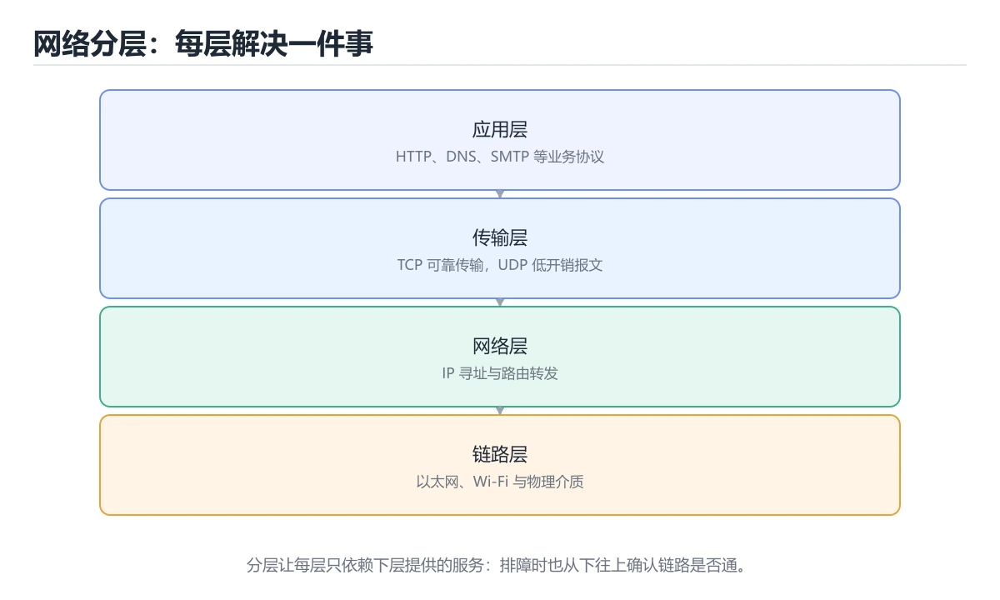
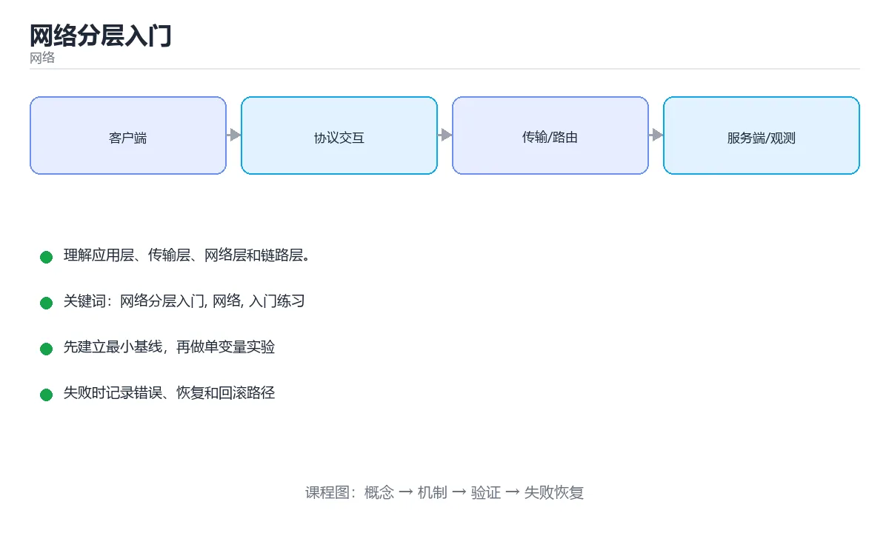

# 网络分层入门

> 内容更新时间：2026-10-06 · 学习阶段：入门 · 预计用时：35 分钟





## 学习目标

- 先认识网络分层入门需要的工具、输入和输出。
- 按步骤运行最小示例，并记录结果与错误。
- 用一个边界输入验证自己是否真正掌握。

## 前置知识

- 会进行基本的文件或命令行操作。
- 不需要预先掌握「网络」的高级知识。

## 一句话入门

理解应用层、传输层、网络层和链路层。

## 最小示例

```python
layers = ["应用层 HTTP", "传输层 TCP", "网络层 IP", "链路层 Ethernet"]
for layer in layers:
    print("封装 ->", layer)
```

## 预期输出

```text
封装 -> 应用层 HTTP
封装 -> 传输层 TCP
封装 -> 网络层 IP
封装 -> 链路层 Ethernet
```

## 常见错误与排查

- 输入或环境与示例不一致，导致结果不符合预期。
- 复制命令时遗漏空格、引号或必要参数。

## 动手练习

1. 原样运行最小示例，保存命令和输出。
2. 把数字 2 改成 10，预测并验证新结果。
3. 制造一个错误输入，写出错误信息和修复方法。

## 本课小结

- 入门阶段先保证能运行、能观察、能解释，再追求复杂功能。
- 每次只改一个变量，记录预测与实际结果。
- 遇到错误先看第一条错误信息，再回到最小示例。

## 分层的真正目的

网络分层不是为了把协议背成一张表，而是为了把“变化隔离在局部”。每一层只向上层提供稳定接口，并使用下层的服务。应用层负责业务语义，例如 HTTP、DNS、SMTP；传输层负责进程到进程的数据交付，例如 TCP、UDP；网络层负责跨网络寻址和路由，例如 IP；链路层负责同一链路内的帧传输，例如以太网、Wi-Fi。数据从上层往下走时，每层都会加上自己的头部，这个过程叫封装；到达对端后逐层去掉头部，叫解封装。

分层带来的直接好处是替换某层的实现通常不影响其他层。网站可以从 HTTP/1.1 升级到 HTTP/2，而底层仍然使用 TCP；也可以把传输层换成基于 UDP 的 QUIC，而应用层依旧表达请求和响应。分层的代价是头部开销和抽象泄漏：应用层不能完全忽视网络延迟、丢包和 MTU，否则就会出现“代码没错但请求超时”的情况。

排查网络问题时，按层自下而上检查通常最快。先确认网卡和链路是否正常，再检查 IP 地址、路由和 DNS，然后确认端口是否可达、TCP 是否建立，最后才看 HTTP 状态码、TLS 证书和应用日志。反过来从最上层猜问题，容易把 DNS 失败误判成后端故障，或者把防火墙拦截误判成代码异常。

## 一次网页请求如何穿过各层

在浏览器输入一个域名后，系统通常先用 DNS 把域名解析成 IP；然后根据目标端口和传输协议建立连接。以 HTTPS 为例，TCP 三次握手和 TLS 握手完成后，HTTP 请求才被发送。请求数据从应用层进入传输层，被分成若干段；网络层为每段选择路由，链路层再把它封装成帧发往下一跳。响应按相反方向返回，浏览器根据状态码、内容类型和缓存策略决定如何展示。

这条链路里每个环节都可能成为瓶颈。DNS 慢会表现为“页面迟迟不开始请求”，TCP 握手慢通常与网络质量或服务器负载有关，TLS 错误要检查证书链和时间，HTTP 4xx 多半是请求语义问题，5xx 则要结合服务端日志。理解分层后，排查就能从“网络不好”变成“具体哪一层、哪个指标、哪条证据”。

学习时可以用一个可执行实验串起各层：先用 `ping` 看网络层可达性，再用 `curl -v` 观察 DNS、TCP、TLS 和 HTTP 的完整过程，最后用浏览器开发者工具的 Network 面板查看耗时分解。这样每个协议名词都对应一个可观察现象，而不是孤立定义。

## 代码实验：把示例跑成证据

### 实验一：建立基线

```python
layers = ["应用层 HTTP", "传输层 TCP", "网络层 IP", "链路层 Ethernet"]
for layer in layers:
    print("封装 ->", layer)
```

### 实验二：只改一个输入

沿用「网络分层入门」的最小示例做一次单变量实验：

| 实验 | 改动 | 预测 | 实际 | 结论 |
| --- | --- | --- | --- | --- |
| 基线 | 保持「网络分层入门」示例原样 |  |  |  |
| 边界 | 把网络分层入门换成空值或极值 |  |  |  |
| 失败 | 给网络传入非法输入 |  |  |  |

做完后用一句话写出「网络分层入门」的结论：输入怎么变，结果才怎么变。

### 实验三：制造一个可控错误

把复合语句末尾的冒号删掉，或者把字符串直接参与数值运算。先记录解释器报出的第一行错误和行号，再修复并重跑基线。

| 实验 | 改动 | 预测 | 实际 | 结论 |
| --- | --- | --- | --- | --- |
| 基线 | 保持原样 |  |  |  |
| 边界 |  |  |  |  |
| 失败 |  |  |  |  |

### 实验四：用三句话复述

1. 输入是什么，哪些输入属于合法范围，哪些属于边界或非法范围？
2. 程序按什么顺序处理输入，在哪一步产生了状态变化或副作用？
3. 输出如何验证，失败时第一条可观察证据是什么？

## 可运行练习

### 任务 1：先跑通，再解释

```python
layers = ["应用层 HTTP", "传输层 TCP", "网络层 IP", "链路层 Ethernet"]
for layer in layers:
    print("封装 ->", layer)
```

### 任务 2：只改一个条件

把「网络分层入门」的最小示例复制一份，只改一个条件再跑一次：

- 改动点：只把网络分层入门的输入换成空值、极值或错误输入，其余保持不变。
- 预测：先写下「网络分层入门」在改动后的输出或错误信息，再运行。
- 记录：对照改动前后的结果，指出差异出在哪一步。
- 验收：换回原条件能复现原结果，改动只影响网络分层入门。

### 任务 3：迁移到自己的数据

用同一套思路处理一组你自己的数据或场景，保持输出格式与任务 1 一致。

## 故障现场

### 现场 1：本课的 网络分层入门 常规用例通过，但边界用例失败

把这条结论放回「网络分层入门」的完整流程里展开：

- 正文依据：定位：围绕“网络 依赖了当前版本、执行顺序或共享状态，单次运行无法暴露差异”检查调用链、输入数据和环境配置，先验证假设再改代码。
- 落地检查：把「现场 1：本课的 网络分层入门 常规用例通过，但边界用例失败」改写成一条可执行的核对项，逐条验证输入、超时与失败路径。

### 现场 2：本课的 网络 结果在两次运行之间不一致

**症状**：在本课的练习或生产场景里出现“本课的 网络 结果在两次运行之间不一致”。

**复现**：准备一组最小输入，只保留触发“本课的 网络 结果在两次运行之间不一致”的必要条件，连续运行两次确认结果稳定。

**定位**：围绕“网络 依赖了当前版本、执行顺序或共享状态，单次运行无法暴露差异”检查调用链、输入数据和环境配置，先验证假设再改代码。

**预防**：把“本课的 网络 结果在两次运行之间不一致”写成一条自动化用例，并在本课的验收清单里保留对应检查项。

### 现场 3：请求偶发超时，但服务端监控看起来正常

**症状**：在本课的练习或生产场景里出现“请求偶发超时，但服务端监控看起来正常”。

## 深入补充：网络分层入门 的取舍与边界

### 一、把概念放回真实约束

学习网络分层入门时，最容易只记住结论而忽略前提。先写出三个约束：数据规模、时间预算、可接受的失败方式；再判断 网络分层入门 与 网络 在这些约束下是否仍然成立。只要约束改变，原来的最优解就可能变成错误解。

| 场景 | 协议或方案 | 延迟与可靠性 | 排障入口 |
| --- | --- | --- | --- |
| 强一致请求 | TCP / HTTP | 可靠但可能队头阻塞 | 连接与重传指标 |
| 实时音视频 | UDP / QUIC | 低延迟但允许丢包 | 抖动与丢包率 |
| 大规模分发 | CDN 与缓存 | 就近命中 | 命中率与回源 |
| 服务间调用 | RPC 或消息队列 | 取决于确认机制 | 超时、重试与幂等 |

### 二、三个容易混淆的边界

1. 澄清输入与目标。先写清「网络分层入门」要解决的问题、合法输入范围和成功标准，再进入后续步骤。
2. **把“平均值”当成“全部”**：网络分层入门 的指标好看，不代表尾部请求、冷启动或失败重试也好看。
3. **把“当前版本”当成“永久行为”**：网络 依赖的默认值、API 或性能特征都可能随版本变化，需要固定版本并保留回归用例。

### 三、一个生产场景

假设团队要在真实系统里使用网络分层入门：第一周先做小流量验证，记录 网络分层入门 的基线与异常；第二周扩大输入规模，观察 网络 是否成为瓶颈；第三周再做故障演练，主动注入超时、重复请求和依赖不可用，确认系统能降级、能重试、能恢复。每一步都要留下指标、日志和结论，而不是只留下“感觉更快了”。

### 四、自测清单

- 能否用一句话说出网络分层入门解决的核心问题与不适用场景？
- 能否画出 网络分层入门 的数据流或状态变化，并标出失败路径？
- 能否给出一个反例，证明某个看似合理的结论在边界条件下不成立？
- 能否写出一条可复现的验证命令，让别人独立得到相同结论？

## 本课复习清单

离开本课前，逐项确认：

- [ ] 不看解析，能说出「网络分层设计的主要好处是？」的判断依据。
- [ ] 不看解析，能说出「HTTP、TCP 与 IP 通常分别属于哪一层？」的判断依据。
- [ ] 不看解析，能说出「发送数据时的封装顺序通常是？」的判断依据。
- [ ] 不看解析，能说出「下列哪些协议主要工作在应用层？请选择所有正确答案。」的判断依据。
- [ ] 至少运行一次本课示例，记录输入、输出和一个边界情况。
- [ ] 把本课最容易混淆的两个概念写成一句话对照。

| 复盘项 | 记录 |
| --- | --- |
| 已经能独立解释的考点 |  |
| 仍然说不清的概念 |  |
| 下一步验证动作 |  |

## 复习与自测

下面按正文顺序回顾每一节，并给出一个自检问题；说不清的地方回到原章节补课。

### 最小示例

```python
layers = ["应用层 HTTP", "传输层 TCP", "网络层 IP", "链路层 Ethernet"]
for layer in layers:
    print("封装 ->", layer)
```

自检：这一节与相邻主题的边界在哪里？

### 预期输出

```text
封装 -> 应用层 HTTP
封装 -> 传输层 TCP
封装 -> 网络层 IP
封装 -> 链路层 Ethernet
```

### 常见错误

自检：把这一节讲给没学过的人，最需要强调哪一点？

### 动手练习

自检：如果去掉这一节里的一个前提，结论会怎样变化？

### 分层的真正目的

网络分层不是为了把协议背成一张表，而是为了把“变化隔离在局部”。每一层只向上层提供稳定接口，并使用下层的服务。

### 一次网页请求如何穿过各层

在浏览器输入一个域名后，系统通常先用 DNS 把域名解析成 IP；然后根据目标端口和传输协议建立连接。以 HTTPS 为例，TCP 三次握手和 TLS 握手完成后，HTTP 请求才被发送。

## 术语速查

把「网络分层入门」里反复出现的术语集中放在一起。复习时先遮住右列，尝试用自己的话解释，再回到正文核对。

| 术语 | 本课语境 |
| --- | --- |
| `网络` | 定位：围绕“网络 依赖了当前版本、执行顺序或共享状态，单次运行无法暴露差异”检查调用链、输入数据和环境配置，先验证假设再改代码。 |
| `入门练习` | 按“网络分层入门”中 网络分层入门、网络、入门练习 的实践顺序，把四个步骤排成从准备到复盘的合理顺序。 |

## 深度拓展与实战

这一节把正文里的定义、代码和失败模式串成一条可操作的复习路线。

### 机制拆解

- **实验一：建立基线**：先原样运行上面的代码，记录命令、完整输出和退出状态
- **实验三：制造一个可控错误**：在「网络分层入门」里，「实验三：制造一个可控错误」这一步要先写清输入与预期，再记录实际结果和差异；结果不符时回到对应小节核对前提。
- **考点 1：网络分层设计的主要好处是？**：针对「网络分层入门」，先自问「网络分层设计的主要好处是」；作答后回到对应考点核对判断依据。

### 边界条件与常见反例

「网络分层入门」的边界不只包括最大最小值，还要覆盖空、重复和失败：

| 条件 | 常见反例 | 处理方式 |
| --- | --- | --- |
| 空输入 | 网络分层入门 没有任何取值 | 先判空，给出明确错误而不是继续执行 |
| 边界值 | 网络 取最小或最大 | 用最小值、最大值和越界值各跑一次 |
| 重复执行 | 同一输入被执行两次 | 保证结果可重复，必要时加锁或去重 |
| 失败路径 | 网络分层入门 相关步骤报错 | 保留原始错误，确认回滚或重试行为 |

### 工程检查表

- [ ] 能否用自己的话说明网络分层入门解决什么问题，以及它不负责什么？
- [ ] 能否指出最小可运行示例的输入、输出和一条失败路径？
- [ ] 能否解释本课关键词在真实项目中的边界与取舍？
- [ ] 能否把本课方法迁移到另一个相近问题，并说明需要改什么？

### 迁移练习

1. 保持正文示例不变，写出它的输入、处理步骤和预期输出。
2. 只改变一个条件，预测结果并说明依据；再运行或手算验证。
3. 结合网络分层入门、网络、入门练习，写出一个真实项目中的使用场景。
4. 写下一个反例，说明它在什么条件下会使朴素做法失效。

<!-- p0-depth-v2:start -->

## 零基础精讲：把网络分层入门真正讲透

### 先建立一个直觉

把网络看成寄信系统：地址负责定位，路由负责中转，协议负责约定信封格式，重试与超时负责处理丢件。任何一层含糊，都会表现为「能连上但结果不对」。

本课的摘要可以当作一张地图：理解应用层、传输层、网络层和链路层。

### 逐步拆解

1. 澄清输入与目标。先写清「网络分层入门」要解决的问题、合法输入范围和成功标准，再进入后续步骤。
2. 描述处理过程。把「网络分层入门、网络、入门练习」映射到具体步骤，每步都要求能单独验证。
3. 定义输出。输出不仅包括正常结果，还包括错误码、日志、指标和资源释放状态。
4. 找出一条失败路径。让错误尽早暴露，并说明重试、降级、回滚或人工处理的边界。
5. 用一个小例子贯穿全过程。先手算或预测结果，再运行代码或实验，最后解释差异。

### 把正文串成一条执行链

- **考点 2：HTTP、TCP 与 IP 通常分别属于哪一层？**：针对「网络分层入门」，先自问「HTTP、TCP 与 IP 通常分别属于哪一层」；作答后回到对应考点核对判断依据。

### 从测验反推易错点

**检查点 1：网络分层设计的主要好处是？**

- 参考判断：各层职责独立，便于替换实现与分别排查问题
- 自问：如果去掉题干里的一个限定词，结论还成立吗？

**检查点 2：HTTP、TCP 与 IP 通常分别属于哪一层？**

- 参考判断：应用层、传输层与网络层

**检查点 3：发送数据时的封装顺序通常是？**

- 参考判断：应用数据依次加上传输层、网络层与链路层首部后发出

**检查点 4：下列哪些协议主要工作在应用层？请选择所有正确答案。**

- 参考判断：HTTP、DNS

**检查点 5：阅读本课的代码片段，下面哪项判断是正确的？**

### 工程排错顺序

| 先查什么 | 要得到的证据 | 判断标准 |
| --- | --- | --- |
| DNS、路由和端口是否逐层验证？ | 日志、输入样例、测试或指标 | 能复现并解释，才算定位 |
| 超时、重试和幂等边界是否明确？ | 日志、输入样例、测试或指标 | 能复现并解释，才算定位 |
| MTU、代理与防火墙是否影响请求？ | 日志、输入样例、测试或指标 | 能复现并解释，才算定位 |
| 日志能否定位到具体一跳或一次请求？ | 日志、输入样例、测试或指标 | 能复现并解释，才算定位 |

### 变式训练

1. 把它放进一个只有单机、没有额外依赖的小项目，先保证正确，再考虑扩展。
2. 把输入规模扩大十倍，记录时间、内存和失败路径，找出第一个真正瓶颈。
3. 制造一次依赖超时或错误输入，要求系统给出可解释错误并且不留下半完成状态。
5. 删掉一个看似必要的步骤，观察哪个测试或指标先失败，用证据说明它为什么必要。
6. 把方案切换到低资源设备，重新评估默认参数、超时和降级策略。

### 本课自测

- [ ] 能用一句话解释网络分层入门在本课中的角色与边界。
- [ ] 能举出一个正常例子和一个失败例子。
- [ ] 能说出最小验证步骤，以及需要记录的证据。
- [ ] 能用一句话解释「网络」在本课中的角色与边界。
- [ ] 能用一句话解释「入门练习」在本课中的角色与边界。

### 迁移案例库

下面用不同约束重复同一套方法。每完成一轮，都把结论写进笔记，并只改变一个变量。

#### 迁移案例 1：围绕网络分层入门做一次小实验

**目标**：在不改变课程主体的前提下，验证网络分层入门中的一个关键判断。

**步骤**：
1. 复述当前方案对本课的假设，写成一句可证伪的话。
2. 设计一个正常输入和一个边界输入，分别预测输出。
3. 运行或逐步演算，记录实际输出、耗时和失败信息。
4. 只调整一个参数，比较前后差异并解释原因。
5. 补充一条测试或复习卡，确保下次能更快复现。

**验收**：结论有证据、差异可解释、失败可恢复；如果做不到，说明还需要缩小问题范围。

#### 迁移案例 2：围绕「网络」做一次小实验

**步骤**：
1. 复述当前方案对「网络」的假设，写成一句可证伪的话。

#### 迁移案例 3：围绕「入门练习」做一次小实验

**步骤**：
1. 复述当前方案对「入门练习」的假设，写成一句可证伪的话。

#### 迁移案例 4：围绕网络分层入门做一次小实验

**步骤**：

#### 迁移案例 5：围绕「网络」做一次小实验

**步骤**：

#### 迁移案例 6：围绕「入门练习」做一次小实验

**步骤**：

#### 迁移案例 7：围绕网络分层入门做一次小实验

**步骤**：

#### 迁移案例 8：围绕「网络」做一次小实验

**步骤**：

#### 迁移案例 9：围绕「入门练习」做一次小实验

**步骤**：

#### 迁移案例 10：围绕网络分层入门做一次小实验

**步骤**：

#### 迁移案例 11：围绕「网络」做一次小实验

**步骤**：

#### 迁移案例 12：围绕「入门练习」做一次小实验

**步骤**：

#### 迁移案例 13：围绕网络分层入门做一次小实验

**步骤**：

#### 迁移案例 14：围绕「网络」做一次小实验

**步骤**：

#### 迁移案例 15：围绕「入门练习」做一次小实验

**步骤**：

#### 迁移案例 16：围绕网络分层入门做一次小实验

**步骤**：

<!-- p0-depth-v2:end -->

## 考点精讲

### 考点 1：概念判断·网络分层入门

- **题目**：网络分层设计的主要好处是？
- **判断依据**：在「网络分层入门」里，各层职责独立，便于替换实现与分别排查问题。分层把复杂问题拆成可独立演进的职责：应用层关注业务语义，传输层提供端到端通信，网络层负责寻址与路由，链路层处理物理传输。在「网络分层入门」里判断这道题，要把网络分层入门、网络、入门练习的条件、过程与失败路径逐项对齐，换成“网络分层设计的主要好处是”这个场景，只有满足前提的结论才成立。

### 考点 2：顺序排列·网络分层入门

- **题目**：按“网络分层入门”中 网络分层入门、网络、入门练习 的实践顺序，把四个步骤排成从准备到复盘的合理顺序。
- **判断依据**：在「网络分层入门」里，题干的正确项是写出最小示例并核对 网络 的基线结果。这个顺序把 网络分层入门 的输入、输出和约束放在最前面，在网络分层入门里避免概念没对齐就开始调参。第二步用 网络 建立可核对的基线，在网络分层入门里第三步才允许改变一个变量并观察失败路径。判断这道题时，要把网络分层入门、网络、入门练习的条件、过程与失败路径逐项对齐，换成“写出最小示例并核对 网络 的基线结果”这个场景，只有满足前提的结论才成立。

### 考点 3：概念判断·网络分层入门

- **题目**：发送数据时的封装顺序通常是？
- **判断依据**：在「网络分层入门」里，应用数据依次加上传输层、网络层与链路层首部后发出。数据从上往下传递，每层在原有内容前加上自己的控制信息：传输层加上端口等信息，网络层加上源与目的地址，链路层加上帧头与校验。「网络分层入门」要求先交代网络分层入门、网络、入门练习的前提再下结论，所以“应用数据依次加上传输层”只在题干“发送数据时的封装顺序通常是”给定的条件下成立。

### 考点 4：多选辨析·网络分层入门

- **题目**：下列哪些协议主要工作在应用层？请选择所有正确答案。
- **判断依据**：HTTP 定义浏览器与服务器之间请求和响应的语义，DNS 负责把域名解析成 IP 地址，两者都属于应用层协议。DNS只有在题干给出的前提下才成立，而HTTP、TCP缺少同一组条件。这道题要求区分概念与边界，「HTTP；DNS」只有在题干给出的前提下才成立，而「HTTP」、「TCP」缺少同一组条件。在「网络分层入门」里判断这道题，要把网络分层入门、网络、入门练习的条件、过程与失败路径逐项对齐，换成“下列哪些协议主要工作在应用层”这个场景，只有满足前提的结论才成立。

### 考点 5：排错·网络分层入门

- **题目**：阅读「网络分层入门」的代码片段，下面哪项判断是正确的？
- **判断依据**：在「网络分层入门」里，题干的正确项是各层职责独立，便于替换实现与分别排查问题。回到「网络分层入门」的正文示例，用“阅读网络分层入门的代码片段”走一遍网络分层入门、网络、入门练习的完整流程，能复现的结论才可以保留。判断这道题时，要把网络分层入门、网络、入门练习的条件、过程与失败路径逐项对齐，换成“阅读的代码片段”这个场景，只有满足前提的结论才成立。

## English Overview

**Title:** Network Layers Basics

**Summary:** Understand application, transport, network and link layers.

**Category:** Networking
**Level:** 入门
**Key terms:** 网络分层入门, 网络, 入门练习

## 内容元数据

- 内容版本：v2.0
- 最后更新：2026-10-06
- 学习阶段：入门
- 适用环境：TCP/IP、HTTP/2、HTTP/3 与现代网络栈
- 内容来源：内置结构化课程与工程实践整理
- 相关主题：网络分层入门、网络、入门练习
- 质量版本：P0 测验标准 + P1 覆盖扩展 + P2 体验补全

## 参考资料与复核

- 最后复核：2026-10-04
- 下次复核：2027-04-04
- 复核范围：版本兼容、API 行为、安全建议与工程实践
- 来源性质：官方文档、标准或权威教材；正文为离线教学重组

| 参考资料 | 本课用途 |
| --- | --- |
| [Cloudflare Learning](https://www.cloudflare.com/learning/) | 网络概念与安全解释 |
| [RFC 1035 DNS](https://www.rfc-editor.org/rfc/rfc1035) | DNS 报文与解析 |
| [RFC 9112 HTTP/1.1](https://www.rfc-editor.org/rfc/rfc9112) | HTTP/1.1 报文与连接 |

> 「网络分层入门」的链接用于离线阅读后的延伸核对；App 不会自动联网。

## 复习与迁移

复习目标：把「网络分层入门」的判断标准放回可复现的例子里。先自己作答，再对照依据；如果结论正确但理由不完整，回到正文补足前提。

### 概念复述

- 用一句话说明「网络分层入门」解决什么问题：理解应用层、传输层、网络层和链路层。
- 写出网络分层入门、网络、入门练习之间的关系，并各举一个例子。
- 说出本课最容易混淆的两个概念，以及区分它们的判据。

### 正文逐节复核

- **分层的真正目的**：网络分层不是为了把协议背成一张表，而是为了把“变化隔离在局部”。
- **一次网页请求如何穿过各层**：学习时可以用一个可执行实验串起各层：先用 `ping` 看网络层可达性，再用 `curl -v` 观察 DNS、TCP、TLS 和 HTTP 的完整过程，最后用浏览器开发者工具的 Network 面板查看耗时分解。
- **深入补充：网络分层入门 的取舍与边界**：学习网络分层入门时，最容易只记住结论而忽略前提。
- **逐节复习与自检**：网络分层不是为了把协议背成一张表，而是为了把“变化隔离在局部”。
- **零基础精讲：把网络分层入门真正讲透**：把网络看成寄信系统：地址负责定位，路由负责中转，协议负责约定信封格式，重试与超时负责处理丢件。

### 测验回顾

1. 网络分层设计的主要好处是？
   - 依据：在「网络分层入门」里，各层职责独立，便于替换实现与分别排查问题。分层把复杂问题拆成可独立演进的职责：应用层关注业务语义，传输层提供端到端通信，网络层负责寻址与路由，链路层处理物理传输。在「网络分层入门」里判断这道题，要把网络分层入门、网络、入门练习的条件、过程与失败路径逐项对齐，换成“网络分层设计的主要好处是”这个场景，只有满足前提的结论才成立。
2. 按“网络分层入门”中 网络分层入门、网络、入门练习 的实践顺序，把四个步骤排成从准备到复盘的合理顺序。
   - 依据：在「网络分层入门」里，题干的正确项是写出最小示例并核对 网络 的基线结果。这个顺序把 网络分层入门 的输入、输出和约束放在最前面，在网络分层入门里避免概念没对齐就开始调参。第二步用 网络 建立可核对的基线，在网络分层入门里第三步才允许改变一个变量并观察失败路径。判断这道题时，要把网络分层入门、网络、入门练习的条件、过程与失败路径逐项对齐，换成“写出最小示例并核对 网络 的基线结果”这个场景，只有满足前提的结论才成立。
3. 发送数据时的封装顺序通常是？
   - 依据：在「网络分层入门」里，应用数据依次加上传输层、网络层与链路层首部后发出。数据从上往下传递，每层在原有内容前加上自己的控制信息：传输层加上端口等信息，网络层加上源与目的地址，链路层加上帧头与校验。「网络分层入门」要求先交代网络分层入门、网络、入门练习的前提再下结论，所以“应用数据依次加上传输层”只在题干“发送数据时的封装顺序通常是”给定的条件下成立。
4. 下列哪些协议主要工作在应用层？请选择所有正确答案。
   - 依据：HTTP 定义浏览器与服务器之间请求和响应的语义，DNS 负责把域名解析成 IP 地址，两者都属于应用层协议。DNS只有在题干给出的前提下才成立，而HTTP、TCP缺少同一组条件。这道题要求区分概念与边界，「HTTP；DNS」只有在题干给出的前提下才成立，而「HTTP」、「TCP」缺少同一组条件。在「网络分层入门」里判断这道题，要把网络分层入门、网络、入门练习的条件、过程与失败路径逐项对齐，换成“下列哪些协议主要工作在应用层”这个场景，只有满足前提的结论才成立。
5. 阅读「网络分层入门」的代码片段，下面哪项判断是正确的？
   - 依据：在「网络分层入门」里，题干的正确项是各层职责独立，便于替换实现与分别排查问题。回到「网络分层入门」的正文示例，用“阅读网络分层入门的代码片段”走一遍网络分层入门、网络、入门练习的完整流程，能复现的结论才可以保留。判断这道题时，要把网络分层入门、网络、入门练习的条件、过程与失败路径逐项对齐，换成“阅读的代码片段”这个场景，只有满足前提的结论才成立。

### 迁移练习

把「网络分层入门」的结论迁移到相邻主题，每次迁移都写清预测与证据：

1. 换输入：用网络分层入门处理一组你自己的数据，对比教材示例的结果差异。
2. 换失败条件：制造一个网络相关的错误，说明如何从错误信息定位根因。
3. 换规模：把数据量或并发度提高一个数量级，说明「网络分层入门」的结论是否仍成立。
