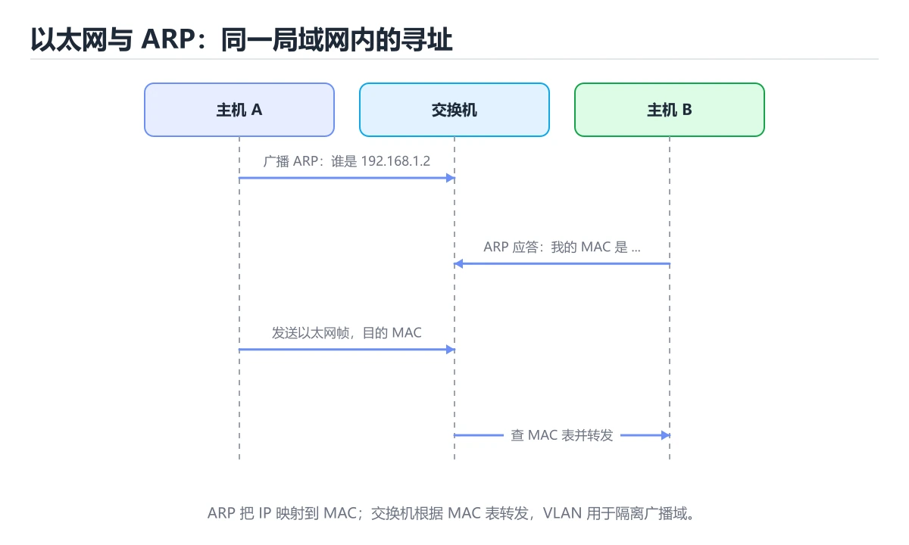

# 链路层：以太网、ARP 与交换机




> 内容更新时间：2026-10-06 · 学习阶段：基础 · 预计用时：45 分钟

## 本节知识框架

**课程定位**：所属分类 `network`（网络），课程主题 `链路层：以太网、ARP 与交换机`，学习阶段 基础，建议用时 40 分钟。

本课主线：以太网帧、ARP、交换机自学习、VLAN 与 STP。

**学完本课应当能够**
- 说清 `arp -a` 与 `链路层` 的含义与区别，并各举一个正例和一个反例。
- 用本课示例验证 `ARP` 的行为，记录输入、输出与失败条件。
- 遇到「把 MAC 和 IP 混为一谈」这类问题时，能说出触发条件与修复顺序。

### 从概念到验证的学习链条

1. `arp -a`：先掌握 工具：`arp -a`、`ip neigh`、`tcpdump -e`（看 MAC）、交换机 `show mac address-table`，再用它解释 `链路层` 为什么会出现。
2. `链路层`：先掌握 链路层负责同一网段内的设备通信：封装成帧、介质访问控制、差错检测。它不理解 IP 地址，只看 MAC 地址，再用它解释 `ARP` 为什么会出现。
3. `ARP`：先掌握 ARP 把同网段 IP 解析成 MAC，结果缓存在 ARP 表中，再用它解释 `VLAN` 为什么会出现。
4. `VLAN`：先掌握 VLAN 把一个物理交换机划分成多个广播域，再用它解释 `IP` 为什么会出现。
5. `IP`：先掌握 IP 负责寻址与转发：给每台主机一个地址，让路由器把数据包一跳一跳送到目的地。它不保证可靠、不保证顺序，这些交给传输层，再用它解释 本课示例的观察结果 为什么会出现。

**先修与衔接**：本课是「网络」分类的第 7 课。相关或后续课程：《无线与移动网络》。

### 完成判据

- **定义关**：不看正文也能说明 `arp -a` 是 工具：`arp -a`、`ip neigh`、`tcpdump -e`（看 MAC）、交换机 `show mac address-table`，并指出一个反例。
- **机制关**：能按“输入 → 转换 → 输出 → 验证”复述 `链路层：以太网、ARP 与交换机`，而不是只背结论。
- **示例关**：能运行或推演 `链路层：以太网、ARP 与交换机` 的 `bash` 示例，并说明一个真实出现的标识符或字面量。
- **证据关**：能指出 `链路层：以太网、ARP 与交换机` 示例里的 调用了 `parse_mac()`，并说明它支持或反驳了本课的哪一条结论。
- **排错关**：能复现 把 MAC 和 IP 混为一谈，记录现象并按 先判断是否同网段，再决定 ARP 目标 修复。
- **迁移关**：能把 `链路层`、`ARP`、`交换机`、`VLAN` 放进一个与 `链路层：以太网、ARP 与交换机` 不同的项目场景，并保持输入与验证条件可追踪。
- **复盘关**：学完 `链路层：以太网、ARP 与交换机` 后，用一句话写下仍然不确定的结论，并列出下一次验证需要的输入、环境和成功判据。

### 复习清单

- [ ] 能不看正文复述本课核心术语，并指出一个边界或反例。
- [ ] 能运行或推演本课示例，记录输入、输出与失败现象。
- [ ] 能完成一次自测，并把错题对照错误表定位原因。

## 核心概念定义

| 术语 | 操作性定义 | 常见边界与风险 |
| --- | --- | --- |
| arp -a | 工具：arp -a、ip neigh、tcpdump -e（看 MAC）、交换机 show mac address-table。 | 只在「工具：arp -a、ip neigh、tcpdump -e（看 MAC）、交换机 show mac address-table」这一前提下成立，换输入或换环境要重新验证。 |
| 链路层 | 链路层负责同一网段内的设备通信：封装成帧、介质访问控制、差错检测。它不理解 IP 地址，只看 MAC 地址。 | 只在「链路层负责同一网段内的设备通信：封装成帧、介质访问控制、差错检测」这一前提下成立，换输入或换环境要重新验证。 |
| ARP | ARP 把同网段 IP 解析成 MAC，结果缓存在 ARP 表中。 | 易错：无法解释跨网段转发过程；正确做法是先判断是否同网段，再决定 ARP 目标。 |
| VLAN | VLAN 把一个物理交换机划分成多个广播域。 | 易错：广播风暴影响全网；正确做法是需要 VLAN 或路由器隔离。 |
| IP | IP 负责寻址与转发：给每台主机一个地址，让路由器把数据包一跳一跳送到目的地。它不保证可靠、不保证顺序，这些交给传输层 | 易错：无法解释跨网段转发过程；正确做法是先判断是否同网段，再决定 ARP 目标。 |

## 原理与运行机制

### 机制总览

**教材衔接：链路层的职责**

链路层负责**同一网段内**的设备通信：封装成帧、介质访问控制、差错检测。它不理解 IP 地址，只看 MAC 地址。

以太网帧结构：目的 MAC（6 字节）+ 源 MAC（6 字节）+ 类型（2 字节）+ 数据（46~1500 字节）+ FCS（4 字节校验）。1500 字节就是常说的 **MTU**，超过要分片（IPv4 由路由器分片，IPv6 要求路径 MTU 发现）。

**教材衔接：ARP：IP 到 MAC 的翻译**

主机知道目标的 IP 却不知道 MAC 时，广播 ARP 请求「谁是这个 IP」，目标单播回应自己的 MAC，双方缓存一段时间。

ARP 的问题：**无认证**，攻击者可伪造 ARP 响应实现中间人（ARP 欺骗）。防护手段有静态 ARP 绑定、DHCP Snooping 与动态 ARP 检测（DAI）。

**教材衔接：交换机如何工作**

交换机是链路层设备，维护「MAC 地址 → 端口」表：

1. **自学习**：收到帧后记录源 MAC 与入端口。
2. **转发**：查表命中则只从对应端口发出。
3. **泛洪**：查不到（或广播/组播）则从其他所有端口发出。

环路会导致广播风暴，因此用 **STP/RSTP** 逻辑上阻塞冗余链路，或改用 **链路聚合** 提升带宽与冗余。

**教材衔接：VLAN 与隔离**

VLAN 在同一台交换机上划分多个广播域（802.1Q 标签，12 位，最多 4094 个）。Trunk 口承载多个 VLAN（打标签），Access 口只属于一个 VLAN（不打标签）。VLAN 解决广播域过大与二层隔离问题，跨 VLAN 通信需要三层设备（路由器/三层交换机）。

**教材衔接：常见排查**

| 现象 | 可能原因 |
| --- | --- |
| 同网段不通 | VLAN 不一致、端口未启用、ARP 未解析 |
| 时通时断 | 环路、MAC 抖动、网线/光模块故障 |
| 丢大包不丢小包 | MTU 不匹配、分片被丢弃 |
| 广播风暴 | 二层环路未启用 STP |

工具：`arp -a`、`ip neigh`、`tcpdump -e`（看 MAC）、交换机 `show mac address-table`。

**教材衔接：链路层速查**

| 概念 | 说明 |
| --- | --- |
| MAC 地址 | 48 位，链路内寻址，前 24 位是厂商 OUI |
| 以太网帧 | 目的 MAC + 源 MAC + 类型 + 载荷 + FCS |
| MTU | 以太网默认 1500 字节 |
| 广播 | `FF:FF:FF:FF:FF:FF`，泛洪到所有端口 |
| 单播与组播 | 一对一与一对多 |
| ARP | IPv4 地址到 MAC 的解析 |
| NDP | IPv6 中替代 ARP 的邻居发现协议 |
| VLAN | 在二层逻辑隔离广播域（802.1Q 标签） |

### 机制拆解：每一步的输入、动作与输出

#### 1. `arp -a`
- 输入：`链路层`；本步把 工具：`arp -a`、`ip neigh`、`tcpdump -e`（看 MAC）、交换机 `show mac address-table` 当作判断规则。
- 动作：围绕 `arp -a` 保留中间状态，并记录它与 `链路层` 的对应关系。
- 输出：`链路层`，它可以被下一段代码、测试或记录继续使用。
- `arp -a` 的失败条件：只在「工具：`arp -a`、`ip neigh`、`tcpdump -e`（看 MAC）、交换机 `show mac address-table`」这一前提下成立，换输入或换环境要重新验证。

#### 2. `链路层`
- 输入：`arp -a`；本步把 链路层负责同一网段内的设备通信：封装成帧、介质访问控制、差错检测。它不理解 IP 地址，只看 MAC 地址 当作判断规则。
- 动作：围绕 `链路层` 保留中间状态，并记录它与 `ARP` 的对应关系。
- 输出：`ARP`，它可以被下一段代码、测试或记录继续使用。
- `链路层` 的失败条件：只在「链路层负责同一网段内的设备通信：封装成帧、介质访问控制、差错检测」这一前提下成立，换输入或换环境要重新验证。

#### 3. `ARP`
- 输入：`链路层`；本步把 ARP 把同网段 IP 解析成 MAC，结果缓存在 ARP 表中 当作判断规则。
- 动作：围绕 `ARP` 保留中间状态，并记录它与 `VLAN` 的对应关系。
- 输出：`VLAN`，它可以被下一段代码、测试或记录继续使用。
- `ARP` 的失败条件：当把 MAC 和 IP 混为一谈时，会出现无法解释跨网段转发过程。

#### 4. `VLAN`
- 输入：`ARP`；本步把 VLAN 把一个物理交换机划分成多个广播域 当作判断规则。
- 动作：围绕 `VLAN` 保留中间状态，并记录它与 `IP` 的对应关系。
- 输出：`IP`，它可以被下一段代码、测试或记录继续使用。
- `VLAN` 的失败条件：当以为交换机隔离广播域时，会出现广播风暴影响全网。

#### 5. `IP`
- 输入：`VLAN`；本步把 IP 负责寻址与转发：给每台主机一个地址，让路由器把数据包一跳一跳送到目的地。它不保证可靠、不保证顺序，这些交给传输层 当作判断规则。
- 动作：围绕 `IP` 保留中间状态，并记录它与 `parse_mac` 的对应关系。
- 输出：`parse_mac`，它可以被下一段代码、测试或记录继续使用。
- `IP` 的失败条件：当把 MAC 和 IP 混为一谈时，会出现无法解释跨网段转发过程。

### 示例中的可观察事实

1. 调用了 `parse_mac()`；它对应的课程主题是 `链路层：以太网、ARP 与交换机`。
2. 调用了 `replace()`；它对应的课程主题是 `链路层：以太网、ARP 与交换机`。
3. 调用了 `split()`；它对应的课程主题是 `链路层：以太网、ARP 与交换机`。
4. 调用了 `len()`；它对应的课程主题是 `链路层：以太网、ARP 与交换机`。
5. 调用了 `ValueError()`；它对应的课程主题是 `链路层：以太网、ARP 与交换机`。
6. 调用了 `int()`；它对应的课程主题是 `链路层：以太网、ARP 与交换机`。
7. 调用了 `join()`；它对应的课程主题是 `链路层：以太网、ARP 与交换机`。
8. 调用了 `lower()`；它对应的课程主题是 `链路层：以太网、ARP 与交换机`。

### 复现实验记录

- 环境：`链路层：以太网、ARP 与交换机` 使用 `bash` 示例，固定 `链路层`、`ARP`、`交换机`、`VLAN` 作为第一组条件。
- 首轮输入：先确认 调用了 `parse_mac()`，预测 `arp -a` 会怎样变化。
- 基线观察：记录命令、输入、输出和错误原文，不用截图代替可复制的文本。
- 单变量修改：只改变 `链路层`，观察 `IP` 是否仍满足定义。
- 失败注入：复现 把 MAC 和 IP 混为一谈，确认现象是 无法解释跨网段转发过程。
- 记录结论：把“修改前、修改后、预期变化、实际变化”写成四列表，这样复盘 `链路层：以太网、ARP 与交换机` 时才能区分概念错误与实现错误。

## 典型应用场景

- **把 MAC 和 IP 混为一谈**：典型现象是无法解释跨网段转发过程；正确做法是先判断是否同网段，再决定 ARP 目标。
- **认为交换机会学习所有流量**：典型现象是对转发路径判断错误；正确做法是交换机只学习源 MAC 与入端口映射。
- **忽略 MTU 和分片**：典型现象是出现大包丢失或性能下降；正确做法是检查路径 MTU，必要时调整上层包大小。
- **无线网络直接套用有线模型**：典型现象是误判延迟和丢包来源；正确做法是考虑介质竞争、重传和信号质量。

### 最小验证场景

- 准备：保留 `bash` 示例的原始输入，先记录 `链路层：以太网、ARP 与交换机` 的基线输出和完整运行命令。
- 观察：先核对 调用了 `parse_mac()`，再改变一个与 `arp -a` 相关的条件。
- 判定：新结果与 `链路层：以太网、ARP 与交换机` 的基线不同不等于错误；只有当差异破坏了 `arp -a` 的定义或错误表中的约束，才判定为失败。

### 选择与边界

- 使用 `arp -a` 时，先满足它的定义：工具：`arp -a`、`ip neigh`、`tcpdump -e`（看 MAC）、交换机 `show mac address-table`；只在「工具：`arp -a`、`ip neigh`、`tcpdump -e`（看 MAC）、交换机 `show mac address-table`」这一前提下成立，换输入或换环境要重新验证。
- 使用 `链路层` 时，先满足它的定义：链路层负责同一网段内的设备通信：封装成帧、介质访问控制、差错检测。它不理解 IP 地址，只看 MAC 地址；只在「链路层负责同一网段内的设备通信：封装成帧、介质访问控制、差错检测」这一前提下成立，换输入或换环境要重新验证。
- 使用 `ARP` 时，先满足它的定义：ARP 把同网段 IP 解析成 MAC，结果缓存在 ARP 表中；易错：无法解释跨网段转发过程；正确做法是先判断是否同网段，再决定 ARP 目标。
- 使用 `VLAN` 时，先满足它的定义：VLAN 把一个物理交换机划分成多个广播域；易错：广播风暴影响全网；正确做法是需要 VLAN 或路由器隔离。
- 使用 `IP` 时，先满足它的定义：IP 负责寻址与转发：给每台主机一个地址，让路由器把数据包一跳一跳送到目的地。它不保证可靠、不保证顺序，这些交给传输层；易错：无法解释跨网段转发过程；正确做法是先判断是否同网段，再决定 ARP 目标。

## 代码/协议/SQL 示例

### 最小可验证示例

```bash
# 查看 ARP 与邻居表
ip neigh show
arp -an

# 查看接口 MAC 与统计
ip -br link
ip -s link show eth0 | head

# 抓取链路层信息（含 MAC 与 ARP）
tcpdump -i eth0 -e -n arp
tcpdump -i eth0 -e -n -c 20

# 查看 VLAN 接口与网桥转发表
ip -d link show type vlan
bridge link
bridge fdb show
```

**教材衔接：设备与转发速查**

| 设备 | 工作层次 | 转发依据 | 隔离广播域 |
| --- | --- | --- | --- |
| 集线器 | 物理层 | 无（电信号广播） | 否 |
| 交换机 | 数据链路层 | MAC 地址表 | 否（VLAN 可以） |
| 路由器 | 网络层 | 路由表 | 是 |
| 三层交换机 | 二三层 | MAC 加 IP | 是 |

```python
def parse_mac(mac: str) -> dict:
    """解析 MAC 地址：判断单播与组播、是否本地管理。"""
    parts = mac.replace("-", ":").split(":")
    if len(parts) != 6:
        raise ValueError("MAC 地址格式不正确")
    first = int(parts[0], 16)
    return {
        "normalized": ":".join(p.lower() for p in parts),
        "is_multicast": bool(first & 0x01),        # 最低位为 1 表示组播
        "is_locally_administered": bool(first & 0x02),
        "oui": ":".join(parts[:3]).upper(),
    }

print(parse_mac("00-1A-2B-3C-4D-5E"))
print(parse_mac("01:00:5e:00:00:01"))
```

**教材衔接：深入补充：链路层：以太网、ARP 与交换机**

前面已经建立了基本概念。这一节换一个角度，把链路层：以太网、ARP 与交换机放进真实工程里，
重点回答三件事：ValueError 解决什么问题、依赖哪些前提、在什么条件下失效。

### 一、核心模型

链路层负责在同一局域网内把数据帧送到正确的网卡，核心是 MAC 地址、以太网帧、ARP 解析和交换机转发；跨网段时则把数据交给路由器。

```text
上层 IP 包 → 封装以太网帧 → ARP 查 MAC → 交换机按表转发 → 目标网卡接收 → 解封装交给 IP 层
```

### 二、关键机制拆解

1. 以太网帧包含目的 MAC、源 MAC、类型、负载和 FCS；标准 MTU 为 1500 字节，超出的 IP 包需要分片或由上层控制长度。
2. MAC 地址用于同一广播域内的转发，IP 地址用于跨网段寻址；一次跨网段转发会经历多段链路，但端到端 IP 通常保持不变。
3. ARP 把同网段 IP 解析成 MAC，结果缓存在 ARP 表中；ARP 欺骗会污染缓存，因此需要动态检测和端口安全。
4. 交换机学习源 MAC 与端口的映射，转发时只发往目标端口；未知单播会泛洪，广播会发往同一 VLAN 的所有端口。
5. VLAN 把一个物理交换机划分成多个广播域；生成树协议用于消除环路，避免广播风暴。
6. 无线链路的介质共享特性更明显，需要 CSMA/CA、确认重传和速率自适应，丢包模型与有线网络不同。

### 三、对照表：抓住容易混淆的边界

| 维度 | 一侧 | 另一侧 |
| --- | --- | --- |
| MAC 地址 | 局域网内的接口标识 | 通常不跨路由器保持不变 |
| IP 地址 | 跨网段的逻辑地址 | 端到端路径中通常保持同一目标 |
| 交换机 | 按 MAC 表在二层转发 | 默认不理解 IP 路由 |
| 路由器 | 按路由表在三层转发 | 每跳会重写链路层帧 |

### 四、工作示例

主机 A 访问同网段主机 B 时，先查 ARP；若缓存没有 B 的 MAC，就广播 ARP 请求。交换机学习 A 的端口并泛洪请求，B 单播应答后，A 才发送真正的数据帧。访问外网时，目的 MAC 是网关而不是最终服务器。

### 五、常见误区与失效边界

| 错误做法或假设 | 后果 | 正确做法 |
| --- | --- | --- |
| 把 MAC 和 IP 混为一谈 | 无法解释跨网段转发过程 | 先判断是否同网段，再决定 ARP 目标 |
| 认为交换机会学习所有流量 | 对转发路径判断错误 | 交换机只学习源 MAC 与入端口映射 |
| 忽略 MTU 和分片 | 出现大包丢失或性能下降 | 检查路径 MTU，必要时调整上层包大小 |
| 无线网络直接套用有线模型 | 误判延迟和丢包来源 | 考虑介质竞争、重传和信号质量 |

### 六、场景推演

办公网出现间歇性卡顿。排查时先确认是单机、同 VLAN 还是跨网段；再检查 ARP 表是否有异常、交换机端口是否反复上下线、是否存在环路或广播风暴；最后才怀疑上层应用。链路层问题通常表现为延迟抖动、广播增加或丢包，而不是单纯的 HTTP 错误。

### 七、自测问答

**Q1：同网段访问时目的 MAC 是谁？**

是目标主机的 MAC，因为数据帧不需要经过路由器。

**Q2：跨网段访问时目的 MAC 是谁？**

是默认网关的 MAC，IP 包里的目标 IP 仍是最终主机。

**Q3：交换机为什么需要 MAC 表？**

它根据源 MAC 学习端口，再据此把帧定向转发，减少泛洪。

**Q4：VLAN 解决了什么问题？**

把一个物理网络划分成多个广播域，隔离广播和故障范围。

### 八、小项目：把知识变成可检查的产出

用两台主机和一个交换机搭一个最小拓扑，分别测试同网段、跨网段和错误网关三种情况；抓包记录 ARP、源/目的 MAC、TTL 变化，并用一张表总结每跳的地址变化。

### 九、适用边界

链路层只负责一跳内的交付，不保证端到端可靠性、顺序或拥塞控制。可靠性由 TCP 或应用层负责，跨网段寻址由 IP 和路由协议负责。

### 十、完成检查清单

- [ ] 能画出一帧以太网数据的字段
- [ ] 能解释同网段和跨网段的转发差异
- [ ] 能读懂 ARP 表和交换机 MAC 表
- [ ] 能说明 VLAN 与生成树的作用
- [ ] 能用抓包结果定位链路层故障

**运行方式**：运行 `链路层：以太网、ARP 与交换机` 的示例时，用 `bash 文件名.sh` 运行；先 `bash -n` 做语法检查更稳妥。

### 示例精读：先找证据，再改一个条件

1. 调用了 `parse_mac()`；它出现在 `链路层：以太网、ARP 与交换机` 的示例中，阅读时先确认它前后各发生了什么。
2. 调用了 `replace()`；它出现在 `链路层：以太网、ARP 与交换机` 的示例中，阅读时先确认它前后各发生了什么。
3. 调用了 `split()`；它出现在 `链路层：以太网、ARP 与交换机` 的示例中，阅读时先确认它前后各发生了什么。
4. 调用了 `len()`；它出现在 `链路层：以太网、ARP 与交换机` 的示例中，阅读时先确认它前后各发生了什么。
5. 调用了 `ValueError()`；它出现在 `链路层：以太网、ARP 与交换机` 的示例中，阅读时先确认它前后各发生了什么。
6. 调用了 `int()`；它出现在 `链路层：以太网、ARP 与交换机` 的示例中，阅读时先确认它前后各发生了什么。
7. 调用了 `join()`；它出现在 `链路层：以太网、ARP 与交换机` 的示例中，阅读时先确认它前后各发生了什么。
8. 调用了 `lower()`；它出现在 `链路层：以太网、ARP 与交换机` 的示例中，阅读时先确认它前后各发生了什么。
- 在 `链路层：以太网、ARP 与交换机` 中与 `arp -a` 对照：示例必须能支持 工具：`arp -a`、`ip neigh`、`tcpdump -e`（看 MAC）、交换机 `show mac address-table`，否则说明这一段还缺少实现或验证步骤。
- 在 `链路层：以太网、ARP 与交换机` 中与 `链路层` 对照：示例必须能支持 链路层负责同一网段内的设备通信：封装成帧、介质访问控制、差错检测。它不理解 IP 地址，只看 MAC 地址，否则说明这一段还缺少实现或验证步骤。
- 在 `链路层：以太网、ARP 与交换机` 中与 `ARP` 对照：示例必须能支持 ARP 把同网段 IP 解析成 MAC，结果缓存在 ARP 表中，否则说明这一段还缺少实现或验证步骤。
- 在 `链路层：以太网、ARP 与交换机` 中与 `VLAN` 对照：示例必须能支持 VLAN 把一个物理交换机划分成多个广播域，否则说明这一段还缺少实现或验证步骤。

## 时间/空间复杂度或性能分析

**性能关注点（链路层：以太网、ARP 与交换机）**：往返延迟与带宽是主要成本：记录 RTT、吞吐与重传率，区分局域网与真实链路。

**本课特有开销（链路层：以太网、ARP 与交换机 · 链路层）**：缓存命中率比缓存实现本身更关键，先记录命中率与失效策略再谈优化。

**测量方法**：以 `链路层：以太网、ARP 与交换机` 的 `链路层` 场景为对象，固定输入跑一遍记录基线，再把规模或并发度提高一个数量级复测；两次结果的差值与波动范围才是结论依据。

### 需要控制的变量与记录项

- `链路层：以太网、ARP 与交换机` 的 `链路层`：固定它的版本、输入范围和资源上限，分别记录速度、内存与失败率的变化。
- `链路层：以太网、ARP 与交换机` 的 `ARP`：固定它的版本、输入范围和资源上限，分别记录速度、内存与失败率的变化。
- `链路层：以太网、ARP 与交换机` 的 `交换机`：固定它的版本、输入范围和资源上限，分别记录速度、内存与失败率的变化。
- `链路层：以太网、ARP 与交换机` 的 `VLAN`：固定它的版本、输入范围和资源上限，分别记录速度、内存与失败率的变化。
- `链路层：以太网、ARP 与交换机` 的 `MTU`：固定它的版本、输入范围和资源上限，分别记录速度、内存与失败率的变化。
- `链路层：以太网、ARP 与交换机` 中 `arp -a` 的边界：只在「工具：`arp -a`、`ip neigh`、`tcpdump -e`（看 MAC）、交换机 `show mac address-table`」这一前提下成立，换输入或换环境要重新验证。达到边界时不要外推，必须重新测量。
- `链路层：以太网、ARP 与交换机` 中 `链路层` 的边界：只在「链路层负责同一网段内的设备通信：封装成帧、介质访问控制、差错检测」这一前提下成立，换输入或换环境要重新验证。达到边界时不要外推，必须重新测量。
- `链路层：以太网、ARP 与交换机` 中 `ARP` 的边界：易错：无法解释跨网段转发过程；正确做法是先判断是否同网段，再决定 ARP 目标。达到边界时不要外推，必须重新测量。
- `链路层：以太网、ARP 与交换机` 中 `VLAN` 的边界：易错：广播风暴影响全网；正确做法是需要 VLAN 或路由器隔离。达到边界时不要外推，必须重新测量。
- `链路层：以太网、ARP 与交换机` 中 `IP` 的边界：易错：无法解释跨网段转发过程；正确做法是先判断是否同网段，再决定 ARP 目标。达到边界时不要外推，必须重新测量。
- `链路层：以太网、ARP 与交换机` 的代码证据：先验证 调用了 `parse_mac()`，再记录该路径的输入规模与耗时；只看代码行数不能推出复杂度。

## 常见误区与易错点

| 容易写错的做法 | 实际现象 | 原因与正确做法 |
| --- | --- | --- |
| 把 MAC 和 IP 混为一谈 | 无法解释跨网段转发过程 | 先判断是否同网段，再决定 ARP 目标 |
| 认为交换机会学习所有流量 | 对转发路径判断错误 | 交换机只学习源 MAC 与入端口映射 |
| 忽略 MTU 和分片 | 出现大包丢失或性能下降 | 检查路径 MTU，必要时调整上层包大小 |
| 无线网络直接套用有线模型 | 误判延迟和丢包来源 | 考虑介质竞争、重传和信号质量 |
| 认为 MAC 能跨路由寻址 | 通信失败 | MAC 只在同一链路有效，跨网靠 IP |
| 以为交换机隔离广播域 | 广播风暴影响全网 | 需要 VLAN 或路由器隔离 |
| 忽视 ARP 表老化 | 迁移后短暂不通 | 等待老化或清理 ARP 缓存 |
| 手工写错静态 ARP | 通信中断 | 核对 MAC 与接口 |
| 只看 IP 不看 MAC 排查二层 | 定位困难 | 用 `-e` 抓包观察 MAC |
| 网线两端 MTU 不一致 | 大包丢弃 | 统一 MTU 或调整 MSS |
| 忽略双工模式不匹配 | 丢包、性能骤降 | 两端设为自协商或统一为全双工 |
| 认为 VLAN 是安全边界 | 被 VLAN 跳跃攻击 | 正确配置 trunk 与原生 VLAN |
| 未关闭未使用端口 | 未授权接入 | 端口安全与访问控制 |
| 抓包时间过短 | 漏掉周期性故障 | 延长抓包并设置文件轮转 |

### 现场 1：把 MAC 和 IP 混为一谈

**症状**：无法解释跨网段转发过程。

**根因与修复**：先判断是否同网段，再决定 ARP 目标。

**自检**：在本课示例里复现「把 MAC 和 IP 混为一谈」，改成先判断是否同网段，再决定 ARP 目标后重跑；如果症状消失且失败路径按预期变化，说明定位正确。

### 现场 2：认为交换机会学习所有流量

**症状**：对转发路径判断错误。

**根因与修复**：交换机只学习源 MAC 与入端口映射。

**自检**：在本课示例里复现「认为交换机会学习所有流量」，改成交换机只学习源 MAC 与入端口映射后重跑；如果症状消失且失败路径按预期变化，说明定位正确。

### 现场 3：忽略 MTU 和分片

**症状**：出现大包丢失或性能下降。

**根因与修复**：检查路径 MTU，必要时调整上层包大小。

**自检**：在本课示例里复现「忽略 MTU 和分片」，改成检查路径 MTU，必要时调整上层包大小后重跑；如果症状消失且失败路径按预期变化，说明定位正确。

### 现场 4：无线网络直接套用有线模型

**症状**：误判延迟和丢包来源。

**根因与修复**：考虑介质竞争、重传和信号质量。

**自检**：在本课示例里复现「无线网络直接套用有线模型」，改成考虑介质竞争、重传和信号质量后重跑；如果症状消失且失败路径按预期变化，说明定位正确。

### 现场 5：认为 MAC 能跨路由寻址

**症状**：通信失败。

**根因与修复**：MAC 只在同一链路有效，跨网靠 IP。

**自检**：在本课示例里复现「认为 MAC 能跨路由寻址」，改成MAC 只在同一链路有效，跨网靠 IP后重跑；如果症状消失且失败路径按预期变化，说明定位正确。

### 现场 6：以为交换机隔离广播域

**症状**：广播风暴影响全网。

**根因与修复**：需要 VLAN 或路由器隔离。

**自检**：在本课示例里复现「以为交换机隔离广播域」，改成需要 VLAN 或路由器隔离后重跑；如果症状消失且失败路径按预期变化，说明定位正确。

### 现场 7：忽视 ARP 表老化

**症状**：迁移后短暂不通。

**根因与修复**：等待老化或清理 ARP 缓存。

**自检**：在本课示例里复现「忽视 ARP 表老化」，改成等待老化或清理 ARP 缓存后重跑；如果症状消失且失败路径按预期变化，说明定位正确。

### 现场 8：手工写错静态 ARP

**症状**：通信中断。

**根因与修复**：核对 MAC 与接口。

**自检**：在本课示例里复现「手工写错静态 ARP」，改成核对 MAC 与接口后重跑；如果症状消失且失败路径按预期变化，说明定位正确。

### 现场 9：只看 IP 不看 MAC 排查二层

**症状**：定位困难。

**根因与修复**：用 `-e` 抓包观察 MAC。

**自检**：在本课示例里复现「只看 IP 不看 MAC 排查二层」，改成用 `-e` 抓包观察 MAC后重跑；如果症状消失且失败路径按预期变化，说明定位正确。

## 与其他知识点的关系

- **相关或后续**：`无线与移动网络`。本课术语会在这些课程里继续使用。
- **术语归属**：`arp -a`、`链路层`、`ARP` 的定义以本课「核心概念定义」为准，换到其他课程时先确认定义是否被改写。
- 同一分类的《IP、子网与传输层深入》也涉及 `MTU`；两课衔接时先确认这个术语的定义是否一致。

### 先修与后续术语接口

- `无线与移动网络`：两者通过本分类的学习顺序衔接，阅读时重点比较各自的输入与失败条件。

### 容易混淆的相邻概念

- `arp -a` 与 `链路层`：前者强调 工具：`arp -a`、`ip neigh`、`tcpdump -e`（看 MAC）、交换机 `show mac address-table`；后者强调 链路层负责同一网段内的设备通信：封装成帧、介质访问控制、差错检测。它不理解 IP 地址，只看 MAC 地址。判断时分别检查两条定义的适用范围，不要只看名称相似就互换。
- `链路层` 与 `ARP`：前者强调 链路层负责同一网段内的设备通信：封装成帧、介质访问控制、差错检测。它不理解 IP 地址，只看 MAC 地址；后者强调 ARP 把同网段 IP 解析成 MAC，结果缓存在 ARP 表中。判断时分别检查两条定义的适用范围，不要只看名称相似就互换。
- `ARP` 与 `VLAN`：前者强调 ARP 把同网段 IP 解析成 MAC，结果缓存在 ARP 表中；后者强调 VLAN 把一个物理交换机划分成多个广播域。判断时分别检查两条定义的适用范围，不要只看名称相似就互换。
- `VLAN` 与 `IP`：前者强调 VLAN 把一个物理交换机划分成多个广播域；后者强调 IP 负责寻址与转发：给每台主机一个地址，让路由器把数据包一跳一跳送到目的地。它不保证可靠、不保证顺序，这些交给传输层。判断时分别检查两条定义的适用范围，不要只看名称相似就互换。

## 自测题与参考答案

> 先独立作答，再对照参考答案；答案都能在本课正文、术语表或错误表里找到依据。

### 自测 1（概念复述）

不看正文，写出 `arp -a` 的操作性定义，并说明它与 `链路层` 的区别。

**参考答案**：工具：`arp -a`、`ip neigh`、`tcpdump -e`（看 MAC）、交换机 `show mac address-table`。

`链路层` 的定位是：链路层负责同一网段内的设备通信：封装成帧、介质访问控制、差错检测。它不理解 IP 地址，只看 MAC 地址；两者的差别要从适用对象与失败模式上说明。

### 自测 2（排错）

本课错误表记录了「把 MAC 和 IP 混为一谈」这类做法。请写出它会出现的现象、根因，以及修复顺序。

**参考答案**：现象是无法解释跨网段转发过程；正确做法是先判断是否同网段，再决定 ARP 目标。修复时先复现现象并保留证据，再改动一处假设重跑，确认现象消失。

### 自测 3（动手验证）

运行本课的 `bash` 示例，把其中的 `20` 换成一个边界值后重新运行，记录输出与错误信息。

**参考答案**：正常输入下 `bash` 示例应当复现正文给出的结果；把 `20` 换成边界值后，如果结果改变或报错，先核对它是否满足 `链路层：以太网、ARP 与交换机` 中`arp -a` 的适用范围，再检查错误表里是否有同类现象。

### 自测 4（代码阅读）

阅读本课开头的 `bash` 示例，说明它体现了`arp -a` 的哪一条性质，并指出改动哪个输入会让这条性质不再成立。

**参考答案**：`arp -a` 的定义是 工具：`arp -a`、`ip neigh`、`tcpdump -e`（看 MAC）、交换机 `show mac address-table`，示例正是在实现这条定义。改动与 `arp -a` 有关的一个输入后，如果结果不再符合 `链路层：以太网、ARP 与交换机` 的正文描述，就说明该性质只在当前前提成立。

### 自测 5（迁移）

把 `链路层：以太网、ARP 与交换机` 的方法迁移到自己的项目：围绕 `arp -a` 写出一个与错误表同类的风险点，并说明触发条件和检验方式。

**参考答案**：例如「抓包时间过短」，它会导致漏掉周期性故障；检验方式是按延长抓包并设置文件轮转改一处再复现，确认现象消失且没有引入新的失败分支。

### 自测 6（对比）

用一个表格对比 `arp -a` 与 `链路层`：各写一行适用场景、一行失败表现。

**参考答案**：`arp -a` 的定义是工具：`arp -a`、`ip neigh`、`tcpdump -e`（看 MAC）、交换机 `show mac address-table`；`链路层` 的定义是链路层负责同一网段内的设备通信：封装成帧、介质访问控制、差错检测。它不理解 IP 地址，只看 MAC 地址。两者的失败表现分别对应本课错误表里与本术语相关的行。

### 自测 7（排错顺序）

面对「把 MAC 和 IP 混为一谈」引发的问题，请把“复现 无法解释跨网段转发过程 → 保留证据 → 先判断是否同网段，再决定 ARP 目标 → 回归验证”四步写成可执行的检查清单。

**参考答案**：第一步按无法解释跨网段转发过程复现；第二步记录输入、版本与完整报错；第三步按先判断是否同网段，再决定 ARP 目标只改一处；第四步重跑并确认失败路径也按预期变化。

### 自测 8（边界判断）

针对 `IP`，分别写出“可以使用”的条件和“结论不再成立”的条件。

**参考答案**：易错：无法解释跨网段转发过程；正确做法是先判断是否同网段，再决定 ARP 目标。 同时要把 `IP` 的定义 IP 负责寻址与转发：给每台主机一个地址，让路由器把数据包一跳一跳送到目的地。它不保证可靠、不保证顺序，这些交给传输层 与实际输入逐项对照。

### 自测 9（机制重建）

不看正文，按输入、转换、输出、验证四段重建 `arp -a` → `链路层` → `ARP` → `VLAN` 的作用链。

**参考答案**：起点是 `arp -a` 的定义 工具：`arp -a`、`ip neigh`、`tcpdump -e`（看 MAC）、交换机 `show mac address-table`；中间每一步都保留可观察状态；终点由 `IP` 检查，失败时回到错误表定位第一个偏离定义的步骤。

### 自测 10（综合排错）

在 `链路层：以太网、ARP 与交换机` 中，现象是 漏掉周期性故障。请围绕 抓包时间过短 写出最小复现、关键证据、修复动作和回归验证，并说明为什么不能只凭一次运行下结论。

**参考答案**：先复现 抓包时间过短，记录输入与完整错误；再按 延长抓包并设置文件轮转 只改一处。回归时同时跑正常路径和边界路径，只有两次结果都可解释，才把修复视为完成。

### 自测 11（一分钟复述）

用每分钟约 200 字的速度复述 `链路层：以太网、ARP 与交换机`：先给主问题，再按顺序说出 `arp -a`、`链路层`、`ARP`、`VLAN`，最后给一个失败案例。

**自评标准**：主问题必须对应 以太网帧、ARP、交换机自学习、VLAN 与 STP；每个术语都要能接上一句定义或边界；失败案例必须写成可观察现象，不能用“可能有风险”代替证据。

## 术语速查

| 术语 | 一句话说明 |
| --- | --- |
| `arp -a` | 工具：`arp -a`、`ip neigh`、`tcpdump -e`（看 MAC）、交换机 `show mac address-table`。 |
| `链路层` | 链路层负责同一网段内的设备通信：封装成帧、介质访问控制、差错检测。它不理解 IP 地址，只看 MAC 地址。 |
| `ARP` | ARP 把同网段 IP 解析成 MAC，结果缓存在 ARP 表中。 |
| `VLAN` | VLAN 把一个物理交换机划分成多个广播域。 |
| `IP` | IP 负责寻址与转发：给每台主机一个地址，让路由器把数据包一跳一跳送到目的地。它不保证可靠、不保证顺序，这些交给传输层。 |

**术语关系**：`arp -a`（工具：`arp -a`、`ip neigh`、`tcpdump -e`（看 MAC）、交换机 `show mac address-table`） → `链路层`（链路层负责同一网段内的设备通信：封装成帧、介质访问控制、差错检测） → `ARP`（ARP 把同网段 IP 解析成 MAC） → `VLAN`（VLAN 把一个物理交换机划分成多个广播域）。

## 考点精讲

`链路层：以太网、ARP 与交换机` 的题库有 6 道题，下面逐题给出题干、正确项与判断依据：先自己作答，再核对正确项，最后回到正文对应小节复核。

### 考点 1：第 1 题

- **题目**：ARP 协议的作用是？
- **正确项**：IP 地址转 MAC 地址
- **判断依据**：这道题落在术语 `ARP` 上：ARP 把同网段 IP 解析成 MAC，结果缓存在 ARP 表中。复习时把 `ARP` 的定义、适用边界和一个反例一起说清楚，再回到「核心概念定义」核对原文。

### 考点 2：第 2 题

- **题目**：围绕“链路层：以太网、ARP 与交换机”中的 链路层、ARP、交换机，下列哪两项是本课强调的实践判断？
- **正确项**：验证 ARP 时要固定版本并覆盖边界输入，结论才可复现；学习 链路层 时要同时说明输入、输出和失败路径，不能只看正常流程
- **判断依据**：这道题落在术语 `链路层` 上：链路层负责同一网段内的设备通信：封装成帧、介质访问控制、差错检测，它不理解 IP 地址，只看 MAC 地址。复习时把 `链路层` 的定义、适用边界和一个反例一起说清楚，再回到「核心概念定义」核对原文。

### 考点 3：第 3 题

- **题目**：VLAN 主要解决什么问题？
- **正确项**：划分广播域实现二层隔离
- **判断依据**：这道题落在术语 `VLAN` 上：VLAN 把一个物理交换机划分成多个广播域。复习时把 `VLAN` 的定义、适用边界和一个反例一起说清楚，再回到「核心概念定义」核对原文。

### 考点 4：第 4 题

- **题目**：按“链路层：以太网、ARP 与交换机”中 链路层、ARP、交换机 的实践顺序，把四个步骤排成从准备到复盘的合理顺序。
- **正确项**：先明确 链路层 的输入、输出与约束 → 写出最小示例并核对 ARP 的基线结果 → 只改一个变量，记录边界与失败路径的变化 → 固定版本与证据，把“链路层：以太网、ARP 与交换机”的结论写成可复现记录
- **判断依据**：这道题落在术语 `链路层` 上：链路层负责同一网段内的设备通信：封装成帧、介质访问控制、差错检测，它不理解 IP 地址，只看 MAC 地址。复习时把 `链路层` 的定义、适用边界和一个反例一起说清楚，再回到「核心概念定义」核对原文。

### 考点 5：第 5 题

- **题目**：MTU 与 IP 分片的关系是？
- **正确项**：超过 MTU 的报文需要分片
- **判断依据**：这道题落在术语 `IP` 上：IP 负责寻址与转发：给每台主机一个地址，让路由器把数据包一跳一跳送到目的地，它不保证可靠、不保证顺序，这些交给传输层。复习时把 `IP` 的定义、适用边界和一个反例一起说清楚，再回到「核心概念定义」核对原文。

### 考点 6：第 6 题

- **题目**：结合 `链路层：以太网、ARP 与交换机` 中围绕 `arp -a` 的代码，哪一项说法与“以太网帧、ARP、交换机自学习、VLAN 与 STP。”一致？
- **正确项**：IP 地址转 MAC 地址
- **判断依据**：这道题落在术语 `arp -a` 上：工具：`arp -a`、`ip neigh`、`tcpdump -e`（看 MAC）、交换机 `show mac address-table`。复习时把 `arp -a` 的定义、适用边界和一个反例一起说清楚，再回到「核心概念定义」核对原文。

### 考点 7：`arp -a`

- **要点**：工具：`arp -a`、`ip neigh`、`tcpdump -e`（看 MAC）、交换机 `show mac address-table`。
- **arp -a 的边界**：只在「工具：`arp -a`、`ip neigh`、`tcpdump -e`（看 MAC）、交换机 `show mac address-table`」这一前提下成立，换输入或换环境要重新验证。

### 考点 8：`链路层`

- **要点**：链路层负责同一网段内的设备通信：封装成帧、介质访问控制、差错检测。它不理解 IP 地址，只看 MAC 地址。
- **链路层 的边界**：只在「链路层负责同一网段内的设备通信：封装成帧、介质访问控制、差错检测」这一前提下成立，换输入或换环境要重新验证。

### 考点 9：`ARP`

- **要点**：ARP 把同网段 IP 解析成 MAC，结果缓存在 ARP 表中。
- **ARP 的边界**：易错：无法解释跨网段转发过程；正确做法是先判断是否同网段，再决定 ARP 目标。

### 考点 10：`VLAN`

- **要点**：VLAN 把一个物理交换机划分成多个广播域。
- **VLAN 的边界**：易错：广播风暴影响全网；正确做法是需要 VLAN 或路由器隔离。

### 考点 11：`IP`

- **要点**：IP 负责寻址与转发：给每台主机一个地址，让路由器把数据包一跳一跳送到目的地。它不保证可靠、不保证顺序，这些交给传输层
- **IP 的边界**：易错：无法解释跨网段转发过程；正确做法是先判断是否同网段，再决定 ARP 目标。

### 考点 12：排错——把 MAC 和 IP 混为一谈

- **现象**：无法解释跨网段转发过程。
- **处理**：先判断是否同网段，再决定 ARP 目标。

### 考点 13：排错——认为交换机会学习所有流量

- **现象**：对转发路径判断错误。
- **处理**：交换机只学习源 MAC 与入端口映射。

### 考点 14：综合辨析——`arp -a` 与 `IP`

- **辨析点**：`arp -a` 的定义是 工具：`arp -a`、`ip neigh`、`tcpdump -e`（看 MAC）、交换机 `show mac address-table`；`IP` 的定义是 IP 负责寻址与转发：给每台主机一个地址，让路由器把数据包一跳一跳送到目的地。它不保证可靠、不保证顺序，这些交给传输层。
- **答题要求**：面对 `链路层：以太网、ARP 与交换机` 的题目，先判断描述的是 `arp -a` 还是 `IP`，再归到对应定义，最后写出一个会让该定义失效的边界输入。

### 考点 15：排错评分点

- **现象分**：能写出 无法解释跨网段转发过程，而不是只写“程序有错”。
- **证据分**：保留触发 把 MAC 和 IP 混为一谈 的输入、版本和错误原文。
- **修复分**：按 先判断是否同网段，再决定 ARP 目标 只改一处，并同时回归正常路径与边界路径。

## 内容元数据

- 内容版本：v2.0
- 最后更新：2026-10-06
- 学习阶段：基础
- 适用环境：TCP/IP、HTTP/2、HTTP/3 与现代网络栈；本课聚焦其中的 链路层。
- 内容来源：内置结构化课程与工程实践整理
- 相关主题：链路层、ARP、交换机、VLAN、MTU
- 质量版本：P0 测验标准 + P1 覆盖扩展 + P2 体验补全

## 参考资料与复核

- 最后复核：2026-10-04
- 下次复核：2027-06-24
- 复核范围：版本兼容、API 行为、安全建议与工程实践
- 来源性质：官方文档、标准或权威教材；本课核对关键词：链路层、ARP、交换机、VLAN、MTU。

| 参考资料 | 本课用途 |
| --- | --- |
| [RFC 9113 HTTP/2](https://www.rfc-editor.org/rfc/rfc9113) | HTTP/2 多路复用与流 |
| [Cloudflare Learning](https://www.cloudflare.com/learning/) | 网络概念与安全解释 |
| [RFC 1035 DNS](https://www.rfc-editor.org/rfc/rfc1035) | DNS 报文与解析 |

| [本课术语索引：链路层：以太网、ARP 与交换机](#核心概念定义) | 按本课输入、术语边界和错误表现逐项核对 |
> 「链路层：以太网、ARP 与交换机」的链接用于离线阅读后的延伸核对；App 不会自动联网。