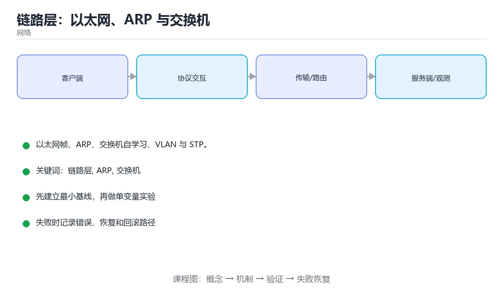

# 链路层：以太网、ARP 与交换机



> 内容更新时间：2026-10-03 · 学习阶段：基础 · 预计用时：15 分钟

## 学习目标

- 能用自己的话解释「链路层：以太网、ARP 与交换机」解决了什么问题，而不是只背术语。
- 能说清 「链路层」、「ARP」、「交换机」、「VLAN」 之间的关系，并分别举出一个例子。
- 能把本课知识放回「网络」的知识体系，说明它和相邻主题的边界。
- 能完成本课练习，并用验收标准检查自己的结果。

> 一句话摘要：以太网帧、ARP、交换机自学习、VLAN 与 STP。

## 前置知识

- 先完成上一课《IP、子网与传输层深入》；如果已经掌握，可以直接用本课练习自测。
- 本课阶段：基础。建议会读写简单代码或命令，并理解变量、输入输出等基本概念。
- 开始前先复习：链路层、ARP、交换机。
- 如果某一步看不懂，先记录具体卡点，完成练习后再回头读一遍。


## 链路层的职责

链路层负责**同一网段内**的设备通信：封装成帧、介质访问控制、差错检测。它不理解 IP 地址，只看 MAC 地址。

以太网帧结构：目的 MAC（6 字节）+ 源 MAC（6 字节）+ 类型（2 字节）+ 数据（46~1500 字节）+ FCS（4 字节校验）。1500 字节就是常说的 **MTU**，超过要分片（IPv4 由路由器分片，IPv6 要求路径 MTU 发现）。

## ARP：IP 到 MAC 的翻译

主机知道目标的 IP 却不知道 MAC 时，广播 ARP 请求「谁是这个 IP」，目标单播回应自己的 MAC，双方缓存一段时间。

ARP 的问题：**无认证**，攻击者可伪造 ARP 响应实现中间人（ARP 欺骗）。防护手段有静态 ARP 绑定、DHCP Snooping 与动态 ARP 检测（DAI）。

## 交换机如何工作

交换机是链路层设备，维护「MAC 地址 → 端口」表：

1. **自学习**：收到帧后记录源 MAC 与入端口。
2. **转发**：查表命中则只从对应端口发出。
3. **泛洪**：查不到（或广播/组播）则从其他所有端口发出。

环路会导致广播风暴，因此用 **STP/RSTP** 逻辑上阻塞冗余链路，或改用 **链路聚合** 提升带宽与冗余。

## VLAN 与隔离

VLAN 在同一台交换机上划分多个广播域（802.1Q 标签，12 位，最多 4094 个）。Trunk 口承载多个 VLAN（打标签），Access 口只属于一个 VLAN（不打标签）。VLAN 解决广播域过大与二层隔离问题，跨 VLAN 通信需要三层设备（路由器/三层交换机）。

## 常见排查

| 现象 | 可能原因 |
| --- | --- |
| 同网段不通 | VLAN 不一致、端口未启用、ARP 未解析 |
| 时通时断 | 环路、MAC 抖动、网线/光模块故障 |
| 丢大包不丢小包 | MTU 不匹配、分片被丢弃 |
| 广播风暴 | 二层环路未启用 STP |

工具：`arp -a`、`ip neigh`、`tcpdump -e`（看 MAC）、交换机 `show mac address-table`。

## 本课小结
链路层解决「同一网段内怎么把帧送到」：**MAC 寻址 + ARP 解析 + 交换机转发 + VLAN 隔离 + STP 防环**。


## 链路层速查

| 概念 | 说明 |
| --- | --- |
| MAC 地址 | 48 位，链路内寻址，前 24 位是厂商 OUI |
| 以太网帧 | 目的 MAC + 源 MAC + 类型 + 载荷 + FCS |
| MTU | 以太网默认 1500 字节 |
| 广播 | `FF:FF:FF:FF:FF:FF`，泛洪到所有端口 |
| 单播与组播 | 一对一与一对多 |
| ARP | IPv4 地址到 MAC 的解析 |
| NDP | IPv6 中替代 ARP 的邻居发现协议 |
| VLAN | 在二层逻辑隔离广播域（802.1Q 标签） |

## 设备与转发速查

| 设备 | 工作层次 | 转发依据 | 隔离广播域 |
| --- | --- | --- | --- |
| 集线器 | 物理层 | 无（电信号广播） | 否 |
| 交换机 | 数据链路层 | MAC 地址表 | 否（VLAN 可以） |
| 路由器 | 网络层 | 路由表 | 是 |
| 三层交换机 | 二三层 | MAC 加 IP | 是 |

```bash
# 查看 ARP 与邻居表
ip neigh show
arp -an

# 查看接口 MAC 与统计
ip -br link
ip -s link show eth0 | head

# 抓取链路层信息（含 MAC 与 ARP）
tcpdump -i eth0 -e -n arp
tcpdump -i eth0 -e -n -c 20

# 查看 VLAN 接口与网桥转发表
ip -d link show type vlan
bridge link
bridge fdb show
```

```python
def parse_mac(mac: str) -> dict:
    """解析 MAC 地址：判断单播与组播、是否本地管理。"""
    parts = mac.replace("-", ":").split(":")
    if len(parts) != 6:
        raise ValueError("MAC 地址格式不正确")
    first = int(parts[0], 16)
    return {
        "normalized": ":".join(p.lower() for p in parts),
        "is_multicast": bool(first & 0x01),        # 最低位为 1 表示组播
        "is_locally_administered": bool(first & 0x02),
        "oui": ":".join(parts[:3]).upper(),
    }


print(parse_mac("00-1A-2B-3C-4D-5E"))
print(parse_mac("01:00:5e:00:00:01"))
```

## 常见错误对照表

| 容易踩的做法 | 实际现象 | 原因与正确做法 |
| --- | --- | --- |
| 认为 MAC 能跨路由寻址 | 通信失败 | MAC 只在同一链路有效，跨网靠 IP |
| 以为交换机隔离广播域 | 广播风暴影响全网 | 需要 VLAN 或路由器隔离 |
| 忽视 ARP 表老化 | 迁移后短暂不通 | 等待老化或清理 ARP 缓存 |
| 手工写错静态 ARP | 通信中断 | 核对 MAC 与接口 |
| 只看 IP 不看 MAC 排查二层 | 定位困难 | 用 `-e` 抓包观察 MAC |
| 网线两端 MTU 不一致 | 大包丢弃 | 统一 MTU 或调整 MSS |
| 忽略双工模式不匹配 | 丢包、性能骤降 | 两端设为自协商或统一为全双工 |
| 认为 VLAN 是安全边界 | 被 VLAN 跳跃攻击 | 正确配置 trunk 与原生 VLAN |
| 未关闭未使用端口 | 未授权接入 | 端口安全与访问控制 |
| 抓包时间过短 | 漏掉周期性故障 | 延长抓包并设置文件轮转 |

## 自测清单

- [ ] 能解释 MAC 与 IP 的分工。
- [ ] 知道集线器、交换机、路由器的转发依据与广播域差异。
- [ ] 会用 `ip neigh`、`bridge fdb`、`tcpdump -e` 排查二层问题。
- [ ] 记得以太网 MTU 默认 1500 并会排查分片。
- [ ] 知道 VLAN 用于隔离广播域而非安全边界。

## 动手练习


> 本课练习重点：围绕「链路层、ARP、交换机」完成复述、实验和交付，每个结果都要能被别人检查。

先抓一次真实请求或画出协议交互，再注入延迟或丢包，最后解释每层变化。

### 练习 1：建立心智模型（10 分钟）

合上教程，用 3～5 句话回答：

1. 「链路层：以太网、ARP 与交换机」解决了什么问题？
2. 如果没有它，会出现什么具体后果？
3. 它和「ARP」是什么关系？

**验收标准**：至少出现一个本课关键词，并写出一个反例、边界条件或失效场景。

### 练习 2：做一次可控实验（20 分钟）

从正文中选一个最小示例，完成以下操作：

1. 先预测修改一个参数、输入或步骤后的结果。
2. 再实际执行或逐步推演，记录真实结果。
3. 如果结果与预测不同，写出差异原因。

**验收标准**：留下「原例 → 改动 → 预测 → 结果 → 原因」五步记录。

### 练习 3：交付一个小结果（30 分钟）

画出一张报文或时序图，标出每一跳的地址、协议、状态和可能失败点。

任务要求：

- 结果必须能被别人检查，不能只写“我已经理解了”。
- 至少覆盖「链路层」和「ARP」两个关键词。
- 写出 1 个仍然不确定的问题，以及下一步如何验证。

> 提示：时间有限时优先做练习 1 和练习 2；练习 3 可以拆成两次完成。


## 深入补充：链路层：以太网、ARP 与交换机

前面已经建立了基本概念。这一节换一个角度，把「链路层：以太网、ARP 与交换机」放进真实工程里，
重点回答三件事：它为什么存在、内部如何运转、什么时候会失效。

### 一、核心模型

链路层负责在同一局域网内把数据帧送到正确的网卡，核心是 MAC 地址、以太网帧、ARP 解析和交换机转发；跨网段时则把数据交给路由器。

```text
上层 IP 包 → 封装以太网帧 → ARP 查 MAC → 交换机按表转发 → 目标网卡接收 → 解封装交给 IP 层
```

### 二、关键机制拆解

1. 以太网帧包含目的 MAC、源 MAC、类型、负载和 FCS；标准 MTU 为 1500 字节，超出的 IP 包需要分片或由上层控制长度。
2. MAC 地址用于同一广播域内的转发，IP 地址用于跨网段寻址；一次跨网段转发会经历多段链路，但端到端 IP 通常保持不变。
3. ARP 把同网段 IP 解析成 MAC，结果缓存在 ARP 表中；ARP 欺骗会污染缓存，因此需要动态检测和端口安全。
4. 交换机学习源 MAC 与端口的映射，转发时只发往目标端口；未知单播会泛洪，广播会发往同一 VLAN 的所有端口。
5. VLAN 把一个物理交换机划分成多个广播域；生成树协议用于消除环路，避免广播风暴。
6. 无线链路的介质共享特性更明显，需要 CSMA/CA、确认重传和速率自适应，丢包模型与有线网络不同。

### 三、对照表：抓住容易混淆的边界

| 维度 | 一侧 | 另一侧 |
| --- | --- | --- |
| MAC 地址 | 局域网内的接口标识 | 通常不跨路由器保持不变 |
| IP 地址 | 跨网段的逻辑地址 | 端到端路径中通常保持同一目标 |
| 交换机 | 按 MAC 表在二层转发 | 默认不理解 IP 路由 |
| 路由器 | 按路由表在三层转发 | 每跳会重写链路层帧 |

### 四、工作示例

主机 A 访问同网段主机 B 时，先查 ARP；若缓存没有 B 的 MAC，就广播 ARP 请求。交换机学习 A 的端口并泛洪请求，B 单播应答后，A 才发送真正的数据帧。访问外网时，目的 MAC 是网关而不是最终服务器。

### 五、常见误区与失效边界

| 错误做法或假设 | 后果 | 正确做法 |
| --- | --- | --- |
| 把 MAC 和 IP 混为一谈 | 无法解释跨网段转发过程 | 先判断是否同网段，再决定 ARP 目标 |
| 认为交换机会学习所有流量 | 对转发路径判断错误 | 交换机只学习源 MAC 与入端口映射 |
| 忽略 MTU 和分片 | 出现大包丢失或性能下降 | 检查路径 MTU，必要时调整上层包大小 |
| 无线网络直接套用有线模型 | 误判延迟和丢包来源 | 考虑介质竞争、重传和信号质量 |

### 六、场景推演

办公网出现间歇性卡顿。排查时先确认是单机、同 VLAN 还是跨网段；再检查 ARP 表是否有异常、交换机端口是否反复上下线、是否存在环路或广播风暴；最后才怀疑上层应用。链路层问题通常表现为延迟抖动、广播增加或丢包，而不是单纯的 HTTP 错误。

### 七、自测问答

**Q1：同网段访问时目的 MAC 是谁？**

是目标主机的 MAC，因为数据帧不需要经过路由器。

**Q2：跨网段访问时目的 MAC 是谁？**

是默认网关的 MAC，IP 包里的目标 IP 仍是最终主机。

**Q3：交换机为什么需要 MAC 表？**

它根据源 MAC 学习端口，再据此把帧定向转发，减少泛洪。

**Q4：VLAN 解决了什么问题？**

把一个物理网络划分成多个广播域，隔离广播和故障范围。

### 八、小项目：把知识变成可检查的产出

用两台主机和一个交换机搭一个最小拓扑，分别测试同网段、跨网段和错误网关三种情况；抓包记录 ARP、源/目的 MAC、TTL 变化，并用一张表总结每跳的地址变化。

### 九、适用边界

链路层只负责一跳内的交付，不保证端到端可靠性、顺序或拥塞控制。可靠性由 TCP 或应用层负责，跨网段寻址由 IP 和路由协议负责。

### 十、完成检查清单

- [ ] 能画出一帧以太网数据的字段
- [ ] 能解释同网段和跨网段的转发差异
- [ ] 能读懂 ARP 表和交换机 MAC 表
- [ ] 能说明 VLAN 与生成树的作用
- [ ] 能用抓包结果定位链路层故障


## 考点精讲：把测验题还原成判断过程

本课有 6 个判断点。先自己作答，再看「判断依据」；如果结论正确但理由不完整，回到正文对应章节补足概念。

### 考点 1：ARP 协议的作用是？

- **正确判断**：IP 地址转 MAC 地址
- **判断依据**：正确答案是「IP 地址转 MAC 地址」，本课在「深入补充：链路层：以太网、ARP 与交换机」中说明：链路层负责在同一局域网内把数据帧送到正确的网卡，核心是 MAC 地址、以太网帧、ARP 解析和交换机转发。同网段通信需要知道目标 MAC，ARP 通过广播询问、单播应答。本课还在「交换机如何工作」中说明：交换机是链路层设备，维护「MAC 地址 → 端口」表。本课还在「常见排查」中说明：工具：arp -a、ip neigh、tcpdump -e（看 MAC）、交换机 show mac address-table。
- **迁移检查**：把题干里的一个条件换成边界值，原来的结论还成立吗？写出判断过程。

### 考点 2：交换机收到帧但转发表里没有目的 MAC 时会？

- **正确判断**：从所有其他端口泛洪
- **判断依据**：正确答案是「从所有其他端口泛洪」，本课在「深入补充：链路层：以太网、ARP 与交换机」中说明：链路层负责在同一局域网内把数据帧送到正确的网卡，核心是 MAC 地址、以太网帧、ARP 解析和交换机转发。泛洪保证首次通信可达，收到应答后会学习到对应端口。本课还在「本课小结」中说明：链路层解决「同一网段内怎么把帧送到」：MAC 寻址 + ARP 解析 + 交换机转发 + VLAN 隔离 + STP 防环。
- **迁移检查**：遮住选项，只根据定义复述一次答案，再回来看哪个选项与复述一致。

### 考点 3：VLAN 主要解决什么问题？

- **正确判断**：划分广播域实现二层隔离
- **判断依据**：VLAN 把一台交换机逻辑上分成多个广播域，跨 VLAN 通信需要三层设备。其他选项：VLAN 通过划分广播域实现二层隔离。针对「VLAN 主要解决什么问题，」，本课在「VLAN 与隔离」中说明：VLAN 解决广播域过大与二层隔离问题，跨 VLAN 通信需要三层设备（路由器/三层交换机）。本课还在「VLAN 与隔离」中说明：VLAN 在同一台交换机上划分多个广播域（802.1Q 标签，12 位，最多 4094 个）。
- **迁移检查**：如果给某个错误选项去掉一个限定词，它会不会变成正确？说明理由。

### 考点 4：MAC 地址与 IP 地址的分工是？

- **正确判断**：MAC 用于同一链路内的寻址
- **判断依据**：数据包逐跳转发时 IP 不变（除 NAT），而每跳的 MAC 头会被重写。其他选项：MAC 用于同一链路内的寻址。针对「MAC 地址与 IP 地址的分工是，」，本课在「深入补充：链路层：以太网、ARP 与交换机」中说明：MAC 地址用于同一广播域内的转发，IP 地址用于跨网段寻址。本课还在「本课小结」中说明：链路层解决「同一网段内怎么把帧送到」：MAC 寻址 + ARP 解析 + 交换机转发 + VLAN 隔离 + STP 防环。
- **迁移检查**：遮住选项，只根据定义复述一次答案，再回来看哪个选项与复述一致。

### 考点 5：MTU 与 IP 分片的关系是？

- **正确判断**：超过 MTU 的报文需要分片
- **判断依据**：IPv6 禁止中间路由器分片，端到端要做 PMTUD，否则会出现「黑洞」问题。其他选项：超过 MTU 的报文需要分片，但更好的做法是用路径 MTU 发现避免分片。针对「MTU 与 IP 分片的关系是，」，本课在「链路层的职责」中说明：1500 字节就是常说的 MTU，超过要分片（IPv4 由路由器分片，IPv6 要求路径 MTU 发现）。本课还在「深入补充：链路层：以太网、ARP 与交换机」中说明：标准 MTU 为 1500 字节，超出的 IP 包需要分片或由上层控制长度。
- **迁移检查**：如果给某个错误选项去掉一个限定词，它会不会变成正确？说明理由。

### 考点 6：补全代码：「链路层：以太网、ARP 与交换机」示例中，下面这行代码缺少哪个关键字或函数名？请填入 ____。 `____ -i eth0 -e -n arp`

- **正确判断**：tcpdump
- **判断依据**：正确答案是「tcpdump」，本课在「常见排查」中说明：工具：arp -a、ip neigh、tcpdump -e（看 MAC）、交换机 show mac address-table。本课还在「交换机如何工作」中说明：交换机是链路层设备，维护「MAC 地址 → 端口」表。本课还在「链路层的职责」中说明：链路层负责同一网段内的设备通信：封装成帧、介质访问控制、差错检测。
- **迁移检查**：把答案换成另一种等价写法，是否仍然正确？说明依据。

### 补充考点 1：阅读「链路层：以太网、ARP 与交换机」的代码片段，下面哪项判断是正确的？

- **正确判断**：IP 地址转 MAC 地址
- **判断依据**：正确答案是「IP 地址转 MAC 地址」。这段代码来自「链路层：以太网、ARP 与交换机」的示例，判断时先看输入与输出，再检查条件、循环和边界。正确答案是「IP 地址转 MAC 地址」，本课在「深入补充·链路层·以太网、ARP 与交换机」中说明：链路层负责在同一局域网内把数据帧送到正确的网卡，核心是 MAC 地址、以太网帧、ARP 解析和交换…在「链路层：以太网、ARP 与交换机」中，如果只改一个条件，输出通常会随之改变，因此不能脱离代码前提作答。

## 本课复习清单

离开本课前，逐项确认：

- [ ] 不看解析，能说出「ARP 协议的作用是？」的判断依据。
- [ ] 不看解析，能说出「交换机收到帧但转发表里没有目的 MAC 时会？」的判断依据。
- [ ] 不看解析，能说出「VLAN 主要解决什么问题？」的判断依据。
- [ ] 不看解析，能说出「MAC 地址与 IP 地址的分工是？」的判断依据。
- [ ] 不看解析，能说出「MTU 与 IP 分片的关系是？」的判断依据。
- [ ] 不看解析，能说出「补全代码：「链路层：以太网、ARP 与交换机」示例中，下面这行代码缺少哪个关键字…」的判断依据。
- [ ] 至少运行一次本课示例，记录输入、输出和一个边界情况。
- [ ] 把本课最容易混淆的两个概念写成一句话对照。

| 复盘项 | 记录 |
| --- | --- |
| 已经能独立解释的考点 |  |
| 仍然说不清的概念 |  |
| 下一步验证动作 |  |

## 术语速查

把本课反复出现的术语集中放在一起。复习时先遮住右列，尝试用自己的话解释，再回到正文核对。

| 术语 | 本课语境 |
| --- | --- |
| `arp -a` | 工具：`arp -a`、`ip neigh`、`tcpdump -e`（看 MAC）、交换机 `show mac address-table`。 |
| `ip neigh` | 工具：`arp -a`、`ip neigh`、`tcpdump -e`（看 MAC）、交换机 `show mac address-table`。 |
| `tcpdump -e` | 工具：`arp -a`、`ip neigh`、`tcpdump -e`（看 MAC）、交换机 `show mac address-table`。 |
| `show mac address-table` | 工具：`arp -a`、`ip neigh`、`tcpdump -e`（看 MAC）、交换机 `show mac address-table`。 |
| `FF:FF:FF:FF:FF:FF` | \| 广播 \| `FF:FF:FF:FF:FF:FF`，泛洪到所有端口 \| |
| `-e` | \| 只看 IP 不看 MAC 排查二层 \| 定位困难 \| 用 `-e` 抓包观察 MAC \| |
| `bridge fdb` | [ ] 会用 `ip neigh`、`bridge fdb`、`tcpdump -e` 排查二层问题。 |

## 面试问答与自测

下面把本课考点换成面试追问。先口述自己的答案，
再对照参考回答检查是否遗漏了前提、边界或失败路径。

### 追问 1：ARP 协议的作用是？

**参考回答**：正确答案是「IP 地址转 MAC 地址」，本课在「深入补充·链路层·以太网、ARP 与交换机」中说明：链路层负责在同一局域网内把数据帧送到正确的网卡，核心是 MAC 地址、以太网帧、ARP 解析和交换机转发。同网段通信需要知道目标 MAC，ARP 通过广播询问、单播应答。本课还在「交换机如何工作」中说明：交换机是链路层设备，维护「MAC 地址 → 端口」表。本课还在「常见排查」中说明：工具：arp -a、ip neigh、tcpdump -e（看 MAC）、交换机 show mac address-table。

### 追问 2：交换机收到帧但转发表里没有目的 MAC 时会？

**参考回答**：正确答案是「从所有其他端口泛洪」，本课在「深入补充·链路层·以太网、ARP 与交换机」中说明：链路层负责在同一局域网内把数据帧送到正确的网卡，核心是 MAC 地址、以太网帧、ARP 解析和交换机转发。泛洪保证首次通信可达，收到应答后会学习到对应端口。本课还在「本课小结」中说明：链路层解决「同一网段内怎么把帧送到」：MAC 寻址 + ARP 解析 + 交换机转发 + VLAN 隔离 + STP 防环。

### 追问 3：VLAN 主要解决什么问题？

**参考回答**：VLAN 把一台交换机逻辑上分成多个广播域，跨 VLAN 通信需要三层设备。其他选项：VLAN 通过划分广播域实现二层隔离。针对「VLAN 主要解决什么问题，」，本课在「VLAN 与隔离」中说明：VLAN 解决广播域过大与二层隔离问题，跨 VLAN 通信需要三层设备（路由器/三层交换机）。本课还在「VLAN 与隔离」中说明：VLAN 在同一台交换机上划分多个广播域（802.1Q 标签，12 位，最多 4094 个）。

### 追问 4：MAC 地址与 IP 地址的分工是？

**参考回答**：数据包逐跳转发时 IP 不变（除 NAT），而每跳的 MAC 头会被重写。其他选项：MAC 用于同一链路内的寻址。针对「MAC 地址与 IP 地址的分工是，」，本课在「深入补充·链路层·以太网、ARP 与交换机」中说明：MAC 地址用于同一广播域内的转发，IP 地址用于跨网段寻址。本课还在「本课小结」中说明：链路层解决「同一网段内怎么把帧送到」：MAC 寻址 + ARP 解析 + 交换机转发 + VLAN 隔离 + STP 防环。

### 追问 5：MTU 与 IP 分片的关系是？

**参考回答**：IPv6 禁止中间路由器分片，端到端要做 PMTUD，否则会出现「黑洞」问题。其他选项：超过 MTU 的报文需要分片，但更好的做法是用路径 MTU 发现避免分片。针对「MTU 与 IP 分片的关系是，」，本课在「链路层的职责」中说明：1500 字节就是常说的 MTU，超过要分片（IPv4 由路由器分片，IPv6 要求路径 MTU 发现）。本课还在「深入补充·链路层·以太网、ARP 与交换机」中说明：标准 MTU 为 1500 字节，超出的 IP 包需要分片或由上层控制长度。

## English Overview

**Title:** Link Layer

**Summary:** Ethernet, ARP, switching, VLAN and STP.

**Category:** Networking  
**Level:** 基础  
**Key terms:** 链路层, ARP, 交换机, VLAN, MTU

> The full tutorial is written in Chinese. This bilingual overview helps English readers identify the topic, scope and key terms before studying the detailed examples.

## 内容元数据

- 内容版本：v2.0
- 最后更新：2026-10-03
- 学习阶段：基础
- 适用环境：TCP/IP、HTTP/2、HTTP/3 与现代网络栈
- 内容来源：内置结构化课程与工程实践整理
- 相关主题：链路层、ARP、交换机、VLAN、MTU
- 质量版本：P0 测验标准 + P1 覆盖扩展 + P2 体验补全


## 参考资料与复核

- 最后复核：2026-10-04
- 下次复核：2027-04-04
- 复核范围：版本兼容、API 行为、安全建议与工程实践
- 来源性质：官方文档与标准；本课正文为离线教学重组，不复制原文

| 参考资料 | 本课用途 |
| --- | --- |
| [RFC Editor](https://www.rfc-editor.org/) | 互联网协议标准 |
| [MDN HTTP](https://developer.mozilla.org/docs/Web/HTTP) | HTTP 语义与浏览器行为 |

> 本课主题：以太网帧、ARP、交换机自学习、VLAN 与 STP。

> App 完全离线展示文字链接，不会自动联网；需要延伸阅读时可复制链接到浏览器。
