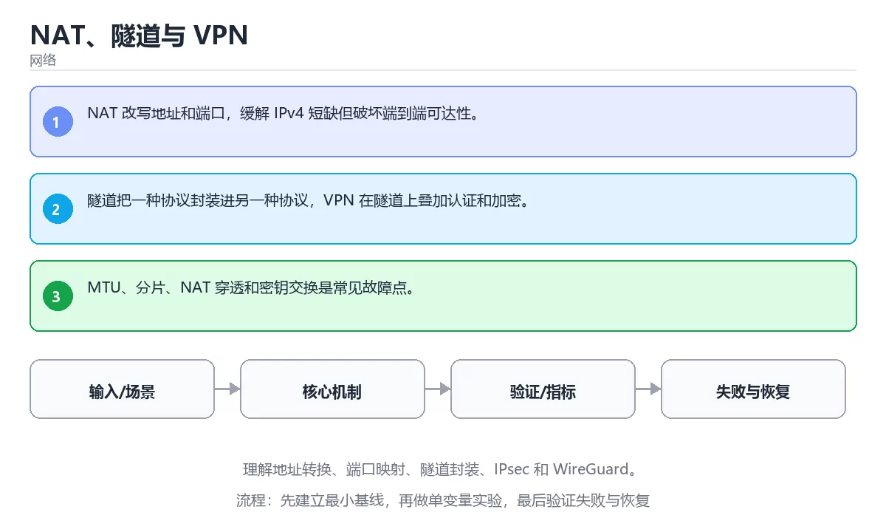

# NAT、隧道与 VPN



> 内容更新时间：2026-10-03 · 学习阶段：高级 · 预计用时：24 分钟

## 学习目标

- 能用自己的话解释：NAT 改写地址和端口，缓解 IPv4 短缺但破坏端到端可达性。
- 能用自己的话解释：隧道把一种协议封装进另一种协议，VPN 在隧道上叠加认证和加密。
- 能用自己的话解释：MTU、分片、NAT 穿透和密钥交换是常见故障点。
- 能把本课知识放回「网络」，并完成练习与测验。

## 前置知识

- 已完成「网络」的基础课程，能运行正文中的最小示例。
- 本课关键词：NAT、VPN、隧道、IPsec。
- 遇到不熟悉的术语先记录问题，完成练习后再回读。

## 核心知识

### 1. NAT 改写地址和端口，缓解 IPv4 短缺但破坏端到端可达性。

- 它解决的问题：把「NAT 改写地址和端口，缓解 IPv4 短缺但破坏端到端可达性。」放回真实场景，说明不做它会带来什么后果。
- 关键做法：先用最小示例建立基线，再逐步加入边界、失败和性能条件。
- 验证标准：结果可复现、错误可解释、边界有测试、失败能恢复。

### 2. 隧道把一种协议封装进另一种协议，VPN 在隧道上叠加认证和加密。

- 它解决的问题：把「隧道把一种协议封装进另一种协议，VPN 在隧道上叠加认证和加密。」放回真实场景，说明不做它会带来什么后果。
- 关键做法：先用最小示例建立基线，再逐步加入边界、失败和性能条件。
- 验证标准：结果可复现、错误可解释、边界有测试、失败能恢复。

### 3. MTU、分片、NAT 穿透和密钥交换是常见故障点。

- 它解决的问题：把「MTU、分片、NAT 穿透和密钥交换是常见故障点。」放回真实场景，说明不做它会带来什么后果。
- 关键做法：先用最小示例建立基线，再逐步加入边界、失败和性能条件。
- 验证标准：结果可复现、错误可解释、边界有测试、失败能恢复。

## 关键流程

```text
输入 → 校验 → 核心处理 → 验证 → 记录指标 → 失败恢复
```

## 实践路径

1. 用一句话复述本课要解决的问题。
2. 跑通正文中的最小示例并记录基线。
3. 只改变一个输入或参数，预测并验证结果。
4. 补一个失败路径，记录错误、恢复和指标。
5. 把结论写成可复现的笔记或测试。

## 常见误区

| 误区 | 后果 | 修正 |
| --- | --- | --- |
| 只记术语不做实验 | 遇到真实问题无法判断 | 用最小输入跑通并记录结果 |
| 只测正常路径 | 边界和故障上线才暴露 | 补空值、极值和依赖失败 |
| 没有基线就优化 | 无法证明改进有效 | 先测量再修改 |
| 忽略成本与安全 | 性能和风险失控 | 同时记录资源、权限与失败代价 |

## 动手练习

1. 合上教程，用 3～5 句话解释「NAT、隧道与 VPN」。
2. 从正文选一个例子，改变一个条件并预测结果。
3. 设计一个失败场景，写出止损与恢复步骤。

**验收标准**：留下输入、命令、输出、差异和下一步问题。

## 本课小结

- 本课属于「网络」，核心关键词是 NAT、VPN、隧道、IPsec。
- 先保证正确与可复现，再讨论性能和扩展。
- 完成练习和测验后，把仍然不确定的问题写成下一轮验证清单。

> 本课由 P1 内容扩展生成，重点补充原有课程缺失的主题与工程边界。


## 深入理解：NAT、隧道与 VPN

### NAT 的映射与生命周期

NAT 设备维护一张映射表：内网源地址与端口、外网源地址与端口、目标地址与端口。
出站连接建立映射，回包按映射反向转发。映射有空闲超时，长时间不活动会被回收；
多个内网主机共用一个公网地址时使用 NAPT，靠端口区分。理解端口分配与超时，
才能解释为什么有些长连接会「静默断开」。

### 打洞与中继

两台都在 NAT 后的主机想直连，需要先通过 STUN 服务器获知自己的公网映射，再把
对方映射告诉彼此，同时向对方发包以打开通道，这就是打洞。对称 NAT 下映射与
目标相关，打洞常常失败，此时只能退回 TURN 中继。直连成本低但成功率有限，
中继成功率高但要为带宽付费，实际系统用 ICE 在两者之间自动选择。

### VPN 封装与代价

VPN 把原始 IP 包封装进新的隧道包头并加密，在两端之间建立虚拟链路。它解决的是
「不可信网络上安全传输」的问题，不负责让应用变快。常见代价是额外的封装开销、
MTU 变小导致的 MSS 调整，以及加密与转发带来的延迟。分割隧道可以让部分流量
走 VPN、部分直连，但会改变路由与安全边界，需要在策略里写清楚。

## 考点精讲：把测验题还原成判断过程

本课有 5 个判断点。先自己作答，再看「判断依据」；如果结论正确但理由不完整，回到正文对应章节补足概念。

### 考点 1：关于「NAT 改写地址和端口 缓解 IPv…」，下列说法正确的是？

- **正确判断**：NAT 改写地址和端口，缓解 IPv4 短缺但破坏端到端可达性。
- **判断依据**：正确答案是「NAT 改写地址和端口，缓解 IPv4 短缺但破坏端到端可达性。」，本课在「深入理解：NAT、隧道与 VPN」中说明：多个内网主机共用一个公网地址时使用 NAPT，靠端口区分。，本课在「核心知识」中说明：它解决的问题：把NAT 改写地址和端口，缓解 IPv4 短缺但破坏端到端可达性。，本课在「深入理解：NAT、隧道与 VPN」中说明：NAT 设备维护一张映射表：内网源地址与端口、外网源地址与端口、目标地址与端口。
- **迁移检查**：如果给某个错误选项去掉一个限定词，它会不会变成正确？说明理由。

### 考点 2：关于「隧道把一种协议封装进另一种协议 VP…」，下列说法正确的是？

- **正确判断**：隧道把一种协议封装进另一种协议，VPN 在隧道上叠加认证和加密。
- **判断依据**：正确答案是「隧道把一种协议封装进另一种协议，VPN 在隧道上叠加认证和加密。」，本课在「深入理解：NAT、隧道与 VPN」中说明：VPN 把原始 IP 包封装进新的隧道包头并加密，在两端之间建立虚拟链路。，本课在「核心知识」中说明：它解决的问题：把隧道把一种协议封装进另一种协议，VPN 在隧道上叠加认证和加密。，本课在「核心知识」中说明：它解决的问题：把NAT 改写地址和端口，缓解 IPv4 短缺但破坏端到端可达性。
- **迁移检查**：遮住选项，只根据定义复述一次答案，再回来看哪个选项与复述一致。

### 考点 3：关于「MTU、分片、NAT 穿透和密钥交换…」，下列说法正确的是？

- **正确判断**：MTU、分片、NAT 穿透和密钥交换是常见故障点。
- **判断依据**：正确答案是「MTU、分片、NAT 穿透和密钥交换是常见故障点。」，本课在「深入理解：NAT、隧道与 VPN」中说明：「不可信网络上安全传输」的问题，不负责让应用变快。，本课在「核心知识」中说明：它解决的问题：把MTU、分片、NAT 穿透和密钥交换是常见故障点。，本课在「核心知识」中说明：它解决的问题：把隧道把一种协议封装进另一种协议，VPN 在隧道上叠加认证和加密。本课还在「核心知识」中说明：它解决的问题：把NAT 改写地址和端口，缓解 IPv4 短缺但破坏端到端可达性。
- **迁移检查**：把题干里的一个条件换成边界值，原来的结论还成立吗？写出判断过程。

### 考点 4：「NAT、隧道与 VPN」的核心学习目标是什么？

- **正确判断**：理解地址转换、端口映射、隧道封装、IPsec 和 WireGuard。
- **判断依据**：正确答案是「理解地址转换、端口映射、隧道封装、IPsec 和 WireGuard。」，本课在「深入理解：NAT、隧道与 VPN」中说明：目标相关，打洞常常失败，此时只能退回 TURN 中继。，本课在「深入理解：NAT、隧道与 VPN」中说明：NAT 设备维护一张映射表：内网源地址与端口、外网源地址与端口、目标地址与端口。，本课在「深入理解：NAT、隧道与 VPN」中说明：VPN 把原始 IP 包封装进新的隧道包头并加密，在两端之间建立虚拟链路。本课还在「核心知识」中说明：它解决的问题：把隧道把一种协议封装进另一种协议，VPN 在隧道上叠加认证和加密。
- **迁移检查**：如果给某个错误选项去掉一个限定词，它会不会变成正确？说明理由。

### 考点 5：以下哪些术语与「NAT、隧道与 VPN」直接相关？（多选）

- **正确判断**：NAT、VPN
- **判断依据**：正确答案是「NAT、VPN」，本课在「本课小结」中说明：本课属于「网络」，核心关键词是 NAT、VPN、隧道、IPsec。本课还在核心知识中说明：它解决的问题：把MTU、分片、NAT 穿透和密钥交换是常见故障点。本课还在「深入理解：NAT、隧道与 VPN」中说明：NAT 设备维护一张映射表：内网源地址与端口、外网源地址与端口、目标地址与端口。
- **迁移检查**：只选其中一项时会漏掉哪个必要条件？把它补进自己的答案。

## 本课复习清单

离开本课前，逐项确认：

- [ ] 不看解析，能说出「关于「NAT 改写地址和端口 缓解 IPv…」，下列说法正确的是？」的判断依据。
- [ ] 不看解析，能说出「关于「隧道把一种协议封装进另一种协议 VP…」，下列说法正确的是？」的判断依据。
- [ ] 不看解析，能说出「关于「MTU、分片、NAT 穿透和密钥交换…」，下列说法正确的是？」的判断依据。
- [ ] 不看解析，能说出「「NAT、隧道与 VPN」的核心学习目标是什么？」的判断依据。
- [ ] 不看解析，能说出「以下哪些术语与「NAT、隧道与 VPN」直接相关？（多选）」的判断依据。
- [ ] 至少运行一次本课示例，记录输入、输出和一个边界情况。
- [ ] 把本课最容易混淆的两个概念写成一句话对照。

| 复盘项 | 记录 |
| --- | --- |
| 已经能独立解释的考点 |  |
| 仍然说不清的概念 |  |
| 下一步验证动作 |  |

## 逐节复习与自检

下面按正文顺序回顾每一节，并给出一个自检问题；说不清的地方回到原章节补课。

### 核心知识

」放回真实场景，说明不做它会带来什么后果。关键做法：先用最小示例建立基线，再逐步加入边界、失败和性能条件。

自检：这一节与相邻主题的边界在哪里？

### 动手练习

合上教程，用 3～5 句话解释「NAT、隧道与 VPN」。从正文选一个例子，改变一个条件并预测结果。

自检：如果去掉这一节里的一个前提，结论会怎样变化？

### 深入理解：NAT、隧道与 VPN

NAT 设备维护一张映射表：内网源地址与端口、外网源地址与端口、目标地址与端口。多个内网主机共用一个公网地址时使用 NAPT，靠端口区分。

自检：把这一节讲给没学过的人，最需要强调哪一点？

### 验证步骤

制造一次错误输入，记录错误信息与修复方式。

自检：如果去掉这一节里的一个前提，结论会怎样变化？

## 深度追问与自测

下面把本课考点换一个角度再问一遍。先合上上一节，写出自己的判断，再对照答案与检查点补全理由。

### 追问 1：关于「NAT 改写地址和端口 缓解 IPv…」，下列说法正确的是？

- 先写下判断，再对照：NAT 改写地址和端口，缓解 IPv4 短缺但破坏端到端可达性。
- 检查点：如果输入换成边界值，这个结论还需要补充哪个前提？

### 追问 2：关于「隧道把一种协议封装进另一种协议 VP…」，下列说法正确的是？

- 先写下判断，再对照：隧道把一种协议封装进另一种协议，VPN 在隧道上叠加认证和加密。
- 检查点：如果输入换成边界值，这个结论还需要补充哪个前提？

### 追问 3：关于「MTU、分片、NAT 穿透和密钥交换…」，下列说法正确的是？

- 先写下判断，再对照：MTU、分片、NAT 穿透和密钥交换是常见故障点。
- 检查点：如果输入换成边界值，这个结论还需要补充哪个前提？

## English Overview

**Title:** NAT, Tunnels and VPN

**Summary:** Learn address translation, port mapping, tunneling, IPsec and WireGuard.

**Category:** Networking  
**Level:** 高级  
**Key terms:** NAT, VPN, 隧道, IPsec

> The full tutorial is written in Chinese. This bilingual overview helps English readers identify the topic, scope and key terms before studying the detailed examples.

## 内容元数据

- 内容版本：v2.0
- 最后更新：2026-10-03
- 学习阶段：高级
- 适用环境：TCP/IP、HTTP/2、HTTP/3 与现代网络栈
- 内容来源：内置结构化课程与工程实践整理
- 相关主题：NAT、VPN、隧道、IPsec
- 质量版本：P0 测验标准 + P1 覆盖扩展 + P2 体验补全


## 最小可运行示例

下面示例用于验证「NAT、隧道与 VPN」的最小输入、处理和输出。先原样运行，再只修改一个值：

```python
import socket

print(socket.gethostbyname("localhost"))
```

## 预期输出

```text
127.0.0.1
```

## 验证步骤

1. 记录运行环境、命令和真实输出。
2. 修改一个输入，先写预测再运行。
3. 制造一次错误输入，记录错误信息与修复方式。
4. 把结论写回本课笔记或测试用例。


## 参考资料与复核

- 最后复核：2026-10-04
- 下次复核：2027-04-04
- 复核范围：版本兼容、API 行为、安全建议与工程实践
- 来源性质：官方文档与标准；本课正文为离线教学重组，不复制原文

| 参考资料 | 本课用途 |
| --- | --- |
| [RFC Editor](https://www.rfc-editor.org/) | 互联网协议标准 |
| [MDN HTTP](https://developer.mozilla.org/docs/Web/HTTP) | HTTP 语义与浏览器行为 |

> 本课主题：理解地址转换、端口映射、隧道封装、IPsec 和 WireGuard。

> App 完全离线展示文字链接，不会自动联网；需要延伸阅读时可复制链接到浏览器。
