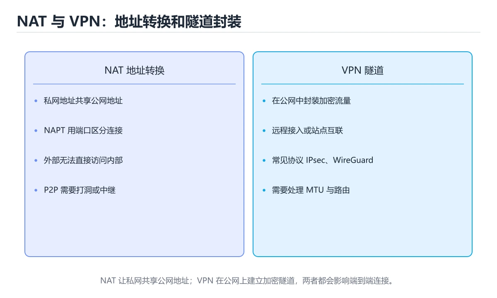

# NAT、隧道与 VPN

> 内容更新时间：2026-10-06 · 学习阶段：高级 · 预计用时：45 分钟




## 本节知识框架

**课程定位**：所属分类为「网络」，课程主题为「NAT、隧道与 VPN」，学习阶段为「高级」，建议用时 45 分钟。

**本课要解决的主问题**：理解地址转换、端口映射、隧道封装、IPsec 和 WireGuard。

| 学习层次 | 要回答的问题 | 完成判据 |
| --- | --- | --- |
| 概念层 | 「NAT、隧道与 VPN」有哪些必须区分的对象与术语？ | 能用自己的话定义核心术语，并各举一个正例和一个反例。 |
| 机制层 | 这些对象按什么顺序发生作用，输入如何变成输出？ | 能画出或写出机制步骤，并说明每一步的失败条件。 |
| 应用层 | 什么场景适合使用「NAT、隧道与 VPN」，什么场景不适合？ | 能给出一个真实场景、一个最小示例和一个边界案例。 |
| 性能层 | 时间、空间、吞吐或延迟受哪些量影响？ | 能说出复杂度或性能瓶颈的证据来源；没有证据时明确写“材料未提供”。 |
| 复习层 | 怎样确认自己不是只记住了结论？ | 能独立完成本课自测，并把错误定位到概念、机制、示例或边界。 |

### 阅读路线

1. 先读「核心概念定义」，建立「NAT」等对象的精确定义。
2. 再读「原理与运行机制」，把定义串成可重复的过程。
3. 用「代码/协议/SQL 示例」验证过程，并只改一个条件观察结果变化。
4. 最后检查性能、易错点、知识关系与自测题，形成可复习的证据链。

**前置知识**：《IPv6 原理与迁移》

**学习位置**：本课位于《IPv6 原理与迁移》之后；如果前一课的自测不能通过，应先回补再继续。

**后续衔接**：下一课《P2P 网络与 NAT 穿透》会继续使用本课术语，学完后建议立即完成一次自测。

**教材衔接：学习目标**

- 能用自己的话解释：NAT 改写地址和端口，缓解 IPv4 短缺但破坏端到端可达性。
- 能用自己的话解释：隧道把一种协议封装进另一种协议，VPN 在隧道上叠加认证和加密。
- 能用自己的话解释：MTU、分片、NAT 穿透和密钥交换是常见故障点。
- 能把本课知识放回「网络」，并完成练习与测验。

**教材衔接：前置知识**

- 具备本分类的前置知识，能跑通「NAT、隧道与 VPN」的示例并解释输出。
- 本课关键词：NAT、VPN、隧道、IPsec。
- 遇到不熟悉的术语先记录问题，完成练习后再回读。

**教材衔接：本课小结**

- 本课围绕 NAT、VPN、隧道、IPsec 展开，复习时重点核对它们的输入、输出和失败路径。
- 完成练习和测验后，把 NAT 上仍然不确定的问题写成下一轮验证清单。

## 核心概念定义

> 阅读约定：本课先给「NAT、隧道与 VPN」相关术语的操作性定义与适用边界；正文里的口语化说法与定义冲突时，以定义和可复现示例为准。

| 术语 | 操作性定义 | 本课中的边界 |
| --- | --- | --- |
| NAT | 在私网地址与公网地址之间转换，使多台主机共享出口。 | 仅在「NAT、隧道与 VPN」明确给出的输入、版本与资源条件下成立。 |
| VPN | VPN 把原始 IP 包封装进新的隧道包头并加密，在两端之间建立虚拟链路。它解决的是。 | 仅在「NAT、隧道与 VPN」明确给出的输入、版本与资源条件下成立。 |
| 隧道 | 按“NAT、隧道与 VPN”中 NAT、VPN、隧道 的实践顺序，把四个步骤排成从准备到复盘的合理顺序。 | 仅在「NAT、隧道与 VPN」明确给出的输入、版本与资源条件下成立。 |
| IPsec | 网络层安全协议族：用 AH/ESP 提供认证与加密，常用于站点到站点的 VPN 隧道。 | 仅在「NAT、隧道与 VPN」明确给出的输入、版本与资源条件下成立。 |
| 中继 | 中继成功率高但要为带宽付费，实际系统用 ICE 在两者之间自动选择 | 仅在「NAT、隧道与 VPN」明确给出的输入、版本与资源条件下成立。 |
| 代价 | 常见代价是额外的封装开销、 | 仅在「NAT、隧道与 VPN」明确给出的输入、版本与资源条件下成立。 |

### 定义如何使用

在「NAT、隧道与 VPN」中判断一个说法是否成立，先确认它使用的是哪个对象的定义，再检查输入规模、运行环境与失败路径。定义不是口号，而是后续推导、代码示例和自测题共享的约束。

## 原理与运行机制

### 机制总览

1. **建立输入**：把「NAT」按本课定义整理成可观察、可重复的输入条件。
2. **执行转换**：围绕「VPN」执行本课的核心步骤；每一步都记录中间状态，避免只看最终输出。
3. **产生输出**：得到「隧道」后，用正文示例或协议/SQL 结果核对输出是否符合预期。
4. **改变一个条件**：只替换一个边界条件或环境参数，观察「NAT、隧道与 VPN」的结论是否仍然成立。

| 阶段 | 关注对象 | 失败时应检查 |
| --- | --- | --- |
| 输入 | NAT | 类型、范围、编码、版本或前置状态是否满足定义。 |
| 处理 | VPN | 顺序、可见性、锁、路由、事务或调度规则是否被破坏。 |
| 输出 | 隧道 | 结果是否可复现，错误是否被正确传播而不是被吞掉。 |

本课的机制结论要用「NAT、隧道与 VPN」自己的示例验证。「NAT、隧道与 VPN」没有给出某个数量级、吞吐或内存数据时，本课把该判断标为“材料未提供”，不从相邻主题外推。

**教材衔接：核心知识**

### 1. NAT 改写地址和端口，缓解 IPv4 短缺但破坏端到端可达性。

- 关键做法：基线只保留 VPN 必需的部分，其余条件一次加一个。
- 验证标准：gethostbyname 的输出能被他人复现，边界输入有对应用例。

### 2. 隧道把一种协议封装进另一种协议，VPN 在隧道上叠加认证和加密。

把这条结论放回「NAT、隧道与 VPN」的完整流程里展开：

- 正文依据：能用自己的话解释：NAT 改写地址和端口，缓解 IPv4 短缺但破坏端到端可达性。
- 落地检查：把「2. 隧道把一种协议封装进另一种协议，VPN 在隧道上叠加认证和加密。」改写成一条可执行的核对项，逐条验证输入、超时与失败路径。

### 3. MTU、分片、NAT 穿透和密钥交换是常见故障点。

把这条结论放回「NAT、隧道与 VPN」的完整流程里展开：

- 正文依据：能用自己的话解释：隧道把一种协议封装进另一种协议，VPN 在隧道上叠加认证和加密。
- 落地检查：把「3. MTU、分片、NAT 穿透和密钥交换是常见故障点。」改写成一条可执行的核对项，逐条验证输入、超时与失败路径。

**教材衔接：关键流程**

```text
输入 → 校验 → 核心处理 → 验证 → 记录指标 → 失败恢复
```

**教材衔接：实践路径**

1. 用一句话复述本课要解决的问题。
2. 跑通正文中的最小示例并记录基线。
3. 只改变一个输入或参数，预测并验证结果。
4. 补一个失败路径，记录错误、恢复和指标。
5. 把结论写成可复现的笔记或测试。

**教材衔接：深入理解：NAT、隧道与 VPN**

### NAT 的映射与生命周期

NAT 设备维护一张映射表：内网源地址与端口、外网源地址与端口、目标地址与端口。
出站连接建立映射，回包按映射反向转发。映射有空闲超时，长时间不活动会被回收；
多个内网主机共用一个公网地址时使用 NAPT，靠端口区分。理解端口分配与超时，
才能解释为什么有些长连接会「静默断开」。

### 打洞与中继

两台都在 NAT 后的主机想直连，需要先通过 STUN 服务器获知自己的公网映射，再把
对方映射告诉彼此，同时向对方发包以打开通道，这就是打洞。对称 NAT 下映射与
目标相关，打洞常常失败，此时只能退回 TURN 中继。直连成本低但成功率有限，
中继成功率高但要为带宽付费，实际系统用 ICE 在两者之间自动选择。

### VPN 封装与代价

VPN 把原始 IP 包封装进新的隧道包头并加密，在两端之间建立虚拟链路。它解决的是
「不可信网络上安全传输」的问题，不负责让应用变快。常见代价是额外的封装开销、
MTU 变小导致的 MSS 调整，以及加密与转发带来的延迟。分割隧道可以让部分流量
走 VPN、部分直连，但会改变路由与安全边界，需要在策略里写清楚。

「NAT、隧道与 VPN」的「NAT 的映射与生命周期」一节补全如下：

- 定位：这一节说明NAT 的映射与生命周期在「NAT、隧道与 VPN」知识体系里的位置。
- 要点：合上教程，用 3～5 句话解释NAT、隧道与 VPN。
- 自检：能否用一个最小例子解释NAT 的映射与生命周期？

「NAT、隧道与 VPN」的「打洞与中继」一节补全如下：

- 定位：这一节说明打洞与中继在「NAT、隧道与 VPN」知识体系里的位置。
- 本课围绕 NAT、VPN、隧道、IPsec 展开，复习时重点核对它们的输入、输出和失败路径。
- 自检：能否用一个最小例子解释打洞与中继？

<!-- p0-depth-v2:start -->

**教材衔接：深入补充：NAT、隧道与 VPN 的取舍与边界**

### 一、把概念放回真实约束

学习NAT、隧道与 VPN时，最容易只记住结论而忽略前提。先写出三个约束：数据规模、时间预算、可接受的失败方式；再判断 NAT 与 VPN 在这些约束下是否仍然成立。只要约束改变，原来的最优解就可能变成错误解。

| 场景 | 协议或方案 | 延迟与可靠性 | 排障入口 |
| --- | --- | --- | --- |
| 强一致请求 | TCP / HTTP | 可靠但可能队头阻塞 | 连接与重传指标 |
| 实时音视频 | UDP / QUIC | 低延迟但允许丢包 | 抖动与丢包率 |
| 大规模分发 | CDN 与缓存 | 就近命中 | 命中率与回源 |
| 服务间调用 | RPC 或消息队列 | 取决于确认机制 | 超时、重试与幂等 |

### 二、三个容易混淆的边界

1. 澄清输入与目标。先写清「NAT、隧道与 VPN」要解决的问题、合法输入范围和成功标准，再进入后续步骤。
2. **把“平均值”当成“全部”**：NAT 的指标好看，不代表尾部请求、冷启动或失败重试也好看。
3. **把“当前版本”当成“永久行为”**：VPN 依赖的默认值、API 或性能特征都可能随版本变化，需要固定版本并保留回归用例。

### 三、一个生产场景

假设团队要在真实系统里使用NAT、隧道与 VPN：第一周先做小流量验证，记录 NAT 的基线与异常；第二周扩大输入规模，观察 VPN 是否成为瓶颈；第三周再做故障演练，主动注入超时、重复请求和依赖不可用，确认系统能降级、能重试、能恢复。每一步都要留下指标、日志和结论，而不是只留下“感觉更快了”。

### 四、自测清单

- 能否用一句话说出NAT、隧道与 VPN解决的核心问题与不适用场景？
- 能否画出 NAT 的数据流或状态变化，并标出失败路径？
- 把 gethostbyname 的输入推到边界，说明本课哪一条结论会先失效。
- 能否写出一条可复现的验证命令，让别人独立得到相同结论？

**教材衔接：零基础精讲：把NAT、隧道与 VPN真正讲透**

### 先建立一个直觉

把网络看成寄信系统：地址负责定位，路由负责中转，协议负责约定信封格式，重试与超时负责处理丢件。任何一层含糊，都会表现为「能连上但结果不对」。落到本课，「NAT、隧道与 VPN」关心的是 NAT 与 VPN 的配合，也就是说这条直觉要在 核心知识 里被具体验证。

本课的摘要可以当作一张地图：理解地址转换、端口映射、隧道封装、IPsec 和 WireGuard。

### 逐步拆解

1. 澄清输入与目标。先写清「NAT、隧道与 VPN」要解决的问题、合法输入范围和成功标准，再进入后续步骤。
2. 描述处理过程。把「NAT、VPN、隧道、IPsec」映射到具体步骤，每步都要求能单独验证。
3. 定义输出。明确 NAT 与 VPN 各自的产物，以及失败时留下什么证据。
4. 让「NAT、隧道与 VPN」的失败路径尽早暴露：把NAT推到边界值，记录错误信息、重试或降级动作，以及人工兜底条件。
5. 用 gethostbyname 贯穿一次小实验：先预测输出，再运行或逐步推演，最后解释差异来自哪一步。

### 把正文串成一条执行链

- **1. NAT 改写地址和端口，缓解 IPv4 短缺但破坏端到端可达性。**：在「NAT、隧道与 VPN」里，「1. NAT 改写地址和端口，缓解 IPv4 短缺但破坏端到端可达性。」这一步要先写清输入与预期，再记录实际结果和差异；结果不符时回到对应小节核对前提。
- **2. 隧道把一种协议封装进另一种协议，VPN 在隧道上叠加认证和加密。**：在「NAT、隧道与 VPN」里，「2. 隧道把一种协议封装进另一种协议，VPN 在隧道上叠加认证和加密。」这一步要先写清输入与预期，再记录实际结果和差异；结果不符时回到对应小节核对前提。
- **3. MTU、分片、NAT 穿透和密钥交换是常见故障点。**：在「NAT、隧道与 VPN」里，「3. MTU、分片、NAT 穿透和密钥交换是常见故障点。」这一步要先写清输入与预期，再记录实际结果和差异；结果不符时回到对应小节核对前提。
- **NAT 的映射与生命周期**：在「NAT、隧道与 VPN」里，「NAT 的映射与生命周期」这一步要先写清输入与预期，再记录实际结果和差异；结果不符时回到对应小节核对前提。
- **打洞与中继**：两台都在 NAT 后的主机想直连，需要先通过 STUN 服务器获知自己的公网映射，再把
- **VPN 封装与代价**：VPN 把原始 IP 包封装进新的隧道包头并加密，在两端之间建立虚拟链路

### 从测验反推易错点

**检查点 1：关于「NAT 改写地址和端口，缓解 IPv4 短缺但破坏端到端可达性。」，下列说法正确的是？**

- 参考判断：NAT 改写地址和端口，缓解 IPv4 短缺但破坏端到端可达性。
- 自问：如果去掉题干里的一个限定词，结论还成立吗？

**检查点 2：关于「隧道把一种协议封装进另一种协议，VPN 在隧道上叠加认证和加密。」，下列说法正确的是？**

- 参考判断：隧道把一种协议封装进另一种协议，VPN 在隧道上叠加认证和加密。

**检查点 3：关于「MTU、分片、NAT 穿透和密钥交换是常见故障点。」，下列说法正确的是？**

- 参考判断：MTU、分片、NAT 穿透和密钥交换是常见故障点。

**检查点 4：本课的核心学习目标是什么？**

- 参考判断：理解地址转换、端口映射、隧道封装、IPsec 和 WireGuard。

**检查点 5：以下哪些术语与NAT、隧道与 VPN直接相关？（多选）**

- 参考判断：NAT、VPN

### 工程排错顺序

| 先查什么 | 要得到的证据 | 判断标准 |
| --- | --- | --- |
| DNS、路由和端口是否逐层验证？ | 日志、输入样例、测试或指标 | 能复现并解释，才算定位 |
| 超时、重试和幂等边界是否明确？ | 日志、输入样例、测试或指标 | 能复现并解释，才算定位 |
| MTU、代理与防火墙是否影响请求？ | 日志、输入样例、测试或指标 | 能复现并解释，才算定位 |
| 日志能否定位到具体一跳或一次请求？ | 日志、输入样例、测试或指标 | 能复现并解释，才算定位 |

### 变式训练

1. 把 NAT 放进一个只有单机、没有额外依赖的小项目，先保证正确再扩展。
2. 把 NAT 的输入规模扩大十倍，记录时间、内存和失败路径，找出第一个瓶颈。
3. 把 VPN 换成失败输入，记录错误信息与恢复动作。
5. 把 gethostbyname 的执行顺序调换一次，记录哪个中间结果先错；顺序敏感的地方就是本课的关键约束。
6. 限制 CPU 与内存上限后重跑 gethostbyname，观察哪一项参数需要重新设定。

### 本课自测

- [ ] 能用一句话解释「NAT」在本课中的角色与边界。
- [ ] 能举出一个正常例子和一个失败例子。
- [ ] 能说出最小验证步骤，以及需要记录的证据。
- [ ] 能用一句话解释「VPN」在本课中的角色与边界。
- [ ] 能用一句话解释「隧道」在本课中的角色与边界。
- [ ] 能用一句话解释「IPsec」在本课中的角色与边界。

### 迁移案例库

换一个 VPN 约束重做一次，确认结论在新条件下是否仍然成立。

#### 迁移案例 1：围绕「NAT」做一次小实验

**目标**：在不改变课程主体的前提下，验证NAT、隧道与 VPN中的一个关键判断。

**步骤**：
1. 复述当前方案对「NAT」的假设，写成一句可证伪的话。
2. 设计一个正常输入和一个边界输入，分别预测输出。
3. 运行或逐步演算，记录实际输出、耗时和失败信息。
4. 只调整一个参数，比较前后差异并解释原因。
5. 补充一条测试或复习卡，确保下次能更快复现。

**验收**：至少给出一个反例，说明NAT在什么情况下会失效；只写成功案例不算通过。

#### 迁移案例 2：围绕「VPN」做一次小实验

**步骤**：
1. 复述当前方案对「VPN」的假设，写成一句可证伪的话。

#### 迁移案例 3：围绕「隧道」做一次小实验

**步骤**：
1. 复述当前方案对「隧道」的假设，写成一句可证伪的话。

#### 迁移案例 4：围绕「IPsec」做一次小实验

**步骤**：
1. 复述当前方案对「IPsec」的假设，写成一句可证伪的话。

#### 迁移案例 5：围绕「NAT」做一次小实验

**步骤**：

#### 迁移案例 6：围绕「VPN」做一次小实验

**步骤**：

#### 迁移案例 7：围绕「隧道」做一次小实验

**步骤**：

#### 迁移案例 8：围绕「IPsec」做一次小实验

**步骤**：

#### 迁移案例 9：围绕「NAT」做一次小实验

**步骤**：

#### 迁移案例 10：围绕「VPN」做一次小实验

**步骤**：

#### 迁移案例 11：围绕「隧道」做一次小实验

**步骤**：

#### 迁移案例 12：围绕「IPsec」做一次小实验

**步骤**：

#### 迁移案例 13：围绕「NAT」做一次小实验

**步骤**：

#### 迁移案例 14：围绕「VPN」做一次小实验

**步骤**：

#### 迁移案例 15：围绕「隧道」做一次小实验

**步骤**：

#### 迁移案例 16：围绕「IPsec」做一次小实验

**步骤**：

<!-- p0-depth-v2:end -->

**教材衔接：验证步骤**

1. 记录运行环境、命令和真实输出。
2. 修改一个输入，先写预测再运行。
4. 把结论写回本课笔记或测试用例。

## 典型应用场景

| 场景 | 典型输入或前提 | 期望产物 |
| --- | --- | --- |
| 学习验证 | 使用本课最小示例和 NAT、VPN | 能复现正文结论，并解释每一步。 |
| 工程落地 | 把「NAT、隧道与 VPN」放入真实模块或服务边界 | 输出可观测、失败可定位、参数可配置。 |
| 故障排查 | 只改一个版本、规模、输入或依赖条件 | 能区分概念错误、实现错误和环境差异。 |

判断「NAT、隧道与 VPN」的场景是否成立，标准是能否写出输入、处理、输出和失败路径；材料中没有出现的数据在本课标注为“材料未提供”，不用推测替代证据。

**课程内置实验入口**：`system_network`，用于动手验证《NAT、隧道与 VPN》的机制；实验结论不替代概念定义与复杂度分析。

## 代码/协议/SQL 示例

### 最小可验证示例

下面保留《NAT、隧道与 VPN》原文中的最小示例。先预测《NAT、隧道与 VPN》示例的输出，再按正文步骤运行或推演；示例依赖外部环境时，同时记录版本与输入。

```text
输入 → 校验 → 核心处理 → 验证 → 记录指标 → 失败恢复
```

**教材衔接：最小可运行示例**

先用 gethostbyname 跑通最小示例，然后只改一个与 NAT 相关的取值：

```python
import socket

print(socket.gethostbyname("localhost"))
```

**教材衔接：预期输出**

```text
127.0.0.1
```

## 时间/空间复杂度或性能分析

**复杂度证据**：「NAT、隧道与 VPN」的现有材料没有给出渐近时间或空间复杂度的明确结论，本课只做定性检查，不补写未经验证的 $O$ 记号。

| 维度 | 本课关注点 | 判断依据 |
| --- | --- | --- |
| 时间/延迟 | 「NAT、隧道与 VPN」的主要步骤是否会随输入规模、并发度或网络往返增长。 | 以正文复杂度、基准数据或可重复测量为准。 |
| 空间/内存 | 中间状态、缓存、副本、连接或索引是否随规模增长。 | 记录峰值内存与数据副本，不只看最终结果。 |
| 吞吐/资源 | 版本、调度、锁、IO、序列化或协议开销是否成为瓶颈。 | 固定环境做对照实验，改变一个变量。 |

评估「NAT、隧道与 VPN」时要区分“正确性成立”和“性能达标”两件事；材料没有给出基准时，本课只保留量级来源与测量方法，不写不可验证的绝对数字。

## 常见误区与易错点

> 复核《NAT、隧道与 VPN》的易错点时，优先保留原文的错误表、故障现场与排错路径；每条修正都要能用本课示例复验。

| 易错点 | 常见表现 | 正确做法 |
| --- | --- | --- |
| 只背结论 | 能复述「NAT、隧道与 VPN」的定义，却说不清输入、输出与边界。 | 回到机制步骤，用最小示例逐一验证。 |
| 混淆相邻概念 | 把本课对象与相邻主题的对象当成同一类。 | 先比较定义、资源归属、生命周期和失败模式。 |
| 忽略版本与环境 | 在开发机通过后直接外推到生产环境。 | 固定版本、输入和资源条件，再记录可复现结果。 |

**教材衔接：常见错误与排查**

> 说明：本表由《NAT、隧道与 VPN》的核心知识整理（2026-10-07），人工复核进度见 docs/content_review_batches.md。

| 易错点 | 容易踩的做法 | 正确结论 |
| --- | --- | --- |
| 把地址转换当安全边界 | 内网仍可被穿透访问 | 地址转换只解决地址复用，安全依赖防火墙与认证 |
| 隧道忽略最大传输单元 | 连接能建立但大包失败 | 调整隧道接口的最大传输单元并验证大包 |
| 忽略会话超时与端口耗尽 | 大量短连接后服务不可用 | 监控端口占用并调整回收时间 |

**教材衔接：故障现场**

### 现场 1：把地址转换当安全边界

**症状**：在《NAT、隧道与 VPN》的复现场景中，内网仍可被穿透访问。

**根因**：“内网仍可被穿透访问”只是表层结果。向上追溯会落到“把地址转换当安全边界”这一步，因为它省略了《NAT、隧道与 VPN》的约束，使实现行为和预期模型发生了偏离。

**修复**：针对《NAT、隧道与 VPN》的问题，地址转换只解决地址复用，安全依赖防火墙与认证。

**验证**：在《NAT、隧道与 VPN》中按“地址转换只解决地址复用，安全依赖防火墙与认证”调整后，从“把地址转换当安全边界”的触发条件重放同一条路径，确认“内网仍可被穿透访问”不再出现，并补一个相邻边界用例检查没有引入新问题。

### 现场 2：隧道忽略最大传输单元

**症状**：在《NAT、隧道与 VPN》的复现场景中，连接能建立但大包失败。

**根因**：当出现“隧道忽略最大传输单元”时，执行路径已经绕过了《NAT、隧道与 VPN》的关键约束，最终以“连接能建立但大包失败”暴露出来；修复前必须先确认约束在哪里失效。

**修复**：针对《NAT、隧道与 VPN》的问题，调整隧道接口的最大传输单元并验证大包。

**验证**：先在《NAT、隧道与 VPN》中记录“隧道忽略最大传输单元”留下的失败证据，再执行“调整隧道接口的最大传输单元并验证大包”并重放；确认错误路径变为明确结果，且修复没有掩盖同类故障。

### 现场 3：忽略会话超时与端口耗尽

**症状**：在《NAT、隧道与 VPN》的复现场景中，大量短连接后服务不可用。

**根因**：当出现“忽略会话超时与端口耗尽”时，执行路径已经绕过了《NAT、隧道与 VPN》的关键约束，最终以“大量短连接后服务不可用”暴露出来；修复前必须先确认约束在哪里失效。

**修复**：针对《NAT、隧道与 VPN》的问题，监控端口占用并调整回收时间。

**验证**：先在《NAT、隧道与 VPN》中记录“忽略会话超时与端口耗尽”留下的失败证据，再执行“监控端口占用并调整回收时间”并重放；确认错误路径变为明确结果，且修复没有掩盖同类故障。

## 与其他知识点的关系

| 关系 | 课程 | 为什么 |
| --- | --- | --- |
| 先修 | 《IPv6 原理与迁移》 | 本课会直接使用它的概念或操作前提。 |
| 关联 | 《P2P 网络与 NAT 穿透》 | 用于横向比较或把本课结论迁移到相邻主题。 |
| 前置顺序 | 《IPv6 原理与迁移》 | 同分类中安排在本课之前，建议先完成其自测。 |
| 后续顺序 | 《P2P 网络与 NAT 穿透》 | 同分类中安排在本课之后，会继续使用本课术语。 |

把「NAT、隧道与 VPN」放回知识体系时，不只要记住“前面学过什么”，还要说明两个主题在输入、机制、资源边界和失败模式上的差异。这样才能把单课知识迁移到项目、排障和后续课程。

**教材衔接：复习与迁移**

复习目标：把「NAT、隧道与 VPN」的判断标准放回可复现的例子里。先自己作答，再对照依据；如果结论正确但理由不完整，回到正文补足前提。

### 概念复述

- 用一句话说明「NAT、隧道与 VPN」解决什么问题：理解地址转换、端口映射、隧道封装、IPsec 和 WireGuard。
- 写出NAT、VPN、隧道之间的关系，并各举一个例子。
- 说出本课最容易混淆的两个概念，以及区分它们的判据。

### 正文逐节复核

- **深入理解：NAT、隧道与 VPN**：NAT 设备维护一张映射表：内网源地址与端口、外网源地址与端口、目标地址与端口。
- **深入补充：NAT、隧道与 VPN 的取舍与边界**：学习NAT、隧道与 VPN时，最容易只记住结论而忽略前提。
- **逐节复习与自检**：NAT 设备维护一张映射表：内网源地址与端口、外网源地址与端口、目标地址与端口。
- **零基础精讲：把NAT、隧道与 VPN真正讲透**：本课的摘要可以当作一张地图：理解地址转换、端口映射、隧道封装、IPsec 和 WireGuard。

### 测验回顾

1. 下面这段 Python 代码摘自「NAT、隧道与 VPN」的正文示例。关于这段代码，下面哪一项说法与实际内容相符？
   - 依据：在「NAT、隧道与 VPN」里，题干的正确项是这段代码会产生可观察的输出，运行后能看到结果，在「NAT、隧道与 VPN」里要结合NAT核对输出是否符合预期。把输入或边界换成空值、极值或失败情况后，结论要以「NAT、隧道与 VPN」的实际运行结果为准。把“这段代码会产生可观察的输出”代回「NAT、隧道与 VPN」里“下面这段 Python 代码摘自NAT、隧道与 VPN的正文”的例子核对，条件一旦改变，结论就要用NAT、VPN、隧道重新推导。
2. 关于「隧道把一种协议封装进另一种协议，VPN 在隧道上叠加认证和加密。」，下列说法正确的是？
   - 依据：在「NAT、隧道与 VPN」里，隧道把一种协议封装进另一种协议，VPN 在隧道上叠加认证和加密。「NAT、隧道与 VPN」要求先交代NAT、VPN、隧道的前提再下结论，所以“隧道把一种协议封装进另一种协议”只在题干“隧道把一种协议封装进另一种协议”给定的条件下成立。把“隧道把一种协议封装进另一种协议”代回「NAT、隧道与 VPN」里“隧道把一种协议封装进另一种协议”的例子核对，条件一旦改变，结论就要用NAT、VPN、隧道重新推导。
3. 关于「MTU、分片、NAT 穿透和密钥交换是常见故障点。」，下列说法正确的是？
   - 依据：在「NAT、隧道与 VPN」里，MTU、分片、NAT 穿透和密钥交换是常见故障点。回到「NAT、隧道与 VPN」的正文示例，用“关于MTU、分片、NAT 穿透和密钥”走一遍NAT、VPN、隧道的完整流程，能复现的结论才可以保留。回到NAT、VPN、隧道本身再看一遍：只有“MTU、分片”与题干“穿透和密钥交换是常见故障点”的前提一致，结论才成立。
4. 按“NAT、隧道与 VPN”中 NAT、VPN、隧道 的实践顺序，把四个步骤排成从准备到复盘的合理顺序。
   - 依据：在「NAT、隧道与 VPN」里，在本课的练习里，顺序应当是：先明确 NAT 的输入、输出与约束 → 写出最小示例并核对 VPN 的基线结果 → 只改一个变量，记录边界与失败路径的变化 → 固定版本与证据，把本课的结论写成可复现记录。这个顺序把 NAT 的输入、输出和约束放在最前面，在NAT、隧道与 VPN里避免概念没对齐就开始调参。第二步用 VPN 建立可核对的基线，在NAT、隧道与 VPN里第三步才允许改变一个变量并观察失败路径。
5. 以下哪些术语与「NAT、隧道与 VPN」直接相关？（多选）
   - 依据：在「NAT、隧道与 VPN」里，NAT；VPN。回到「NAT、隧道与 VPN」的正文示例，用“以下哪些术语与NAT、隧道与 VPN”走一遍NAT、VPN、隧道的完整流程，能复现的结论才可以保留。回到正文示例，用“以下哪些术语与NAT”走一遍NAT、VPN、隧道的完整流程，能复现的结论才可以保留。

### 迁移练习

把「NAT、隧道与 VPN」的结论迁移到相邻主题，每次迁移都写清预测与证据：

1. 换输入：用NAT处理一组你自己的数据，对比教材示例的结果差异。
2. 换失败条件：制造一个VPN相关的错误，说明如何从错误信息定位根因。
3. 换规模：把数据量或并发度提高一个数量级，说明「NAT、隧道与 VPN」的结论是否仍成立。

## 自测题与参考答案

> 先独立作答《NAT、隧道与 VPN》的自测题，再对照答案与解析；每处判断都要能在本课正文或示例中找到依据。

### 自测 1

下面这段 Python 代码摘自「NAT、隧道与 VPN」的正文示例。关于这段代码，下面哪一项说法与实际内容相符？

```python
import socket

print(socket.gethostbyname("localhost"))
```

A. 这段代码会产生可观察的输出，运行后能看到结果。
B. 这段代码包含循环结构，同一段逻辑会被重复执行。
C. 这段代码包含条件分支，不同输入会走不同的执行路径。
D. 这段代码把主要逻辑封装在函数或方法里，需要被调用才会执行。

**参考答案**：这段代码会产生可观察的输出，运行后能看到结果。

**解析**：在「NAT、隧道与 VPN」里，题干的正确项是这段代码会产生可观察的输出，运行后能看到结果，在「NAT、隧道与 VPN」里要结合NAT核对输出是否符合预期。把输入或边界换成空值、极值或失败情况后，结论要以「NAT、隧道与 VPN」的实际运行结果为准。把“这段代码会产生可观察的输出”代回「NAT、隧道与 VPN」里“下面这段 Python 代码摘自NAT、隧道与 VPN的正文”的例子核对，条件一旦改变，结论就要用NAT、VPN、隧道重新推导。

### 自测 2

关于「隧道把一种协议封装进另一种协议，VPN 在隧道上叠加认证和加密。」，下列说法正确的是？

A. SLAAC、DHCPv6 和隐私扩展影响地址分配与追踪。
B. NAT 穿透依赖 STUN、信令和端口预测，失败时回退到 TURN 中继。
C. SPF、DKIM 和 DMARC 分别验证发送源、签名和策略。
D. 隧道把一种协议封装进另一种协议，VPN 在隧道上叠加认证和加密。

**参考答案**：隧道把一种协议封装进另一种协议，VPN 在隧道上叠加认证和加密。

**解析**：在「NAT、隧道与 VPN」里，隧道把一种协议封装进另一种协议，VPN 在隧道上叠加认证和加密。「NAT、隧道与 VPN」要求先交代NAT、VPN、隧道的前提再下结论，所以“隧道把一种协议封装进另一种协议”只在题干“隧道把一种协议封装进另一种协议”给定的条件下成立。把“隧道把一种协议封装进另一种协议”代回「NAT、隧道与 VPN」里“隧道把一种协议封装进另一种协议”的例子核对，条件一旦改变，结论就要用NAT、VPN、隧道重新推导。

### 自测 3

按“NAT、隧道与 VPN”中 NAT、VPN、隧道 的实践顺序，把四个步骤排成从准备到复盘的合理顺序。

A. 先明确 NAT 的输入、输出与约束
B. 写出最小示例并核对 VPN 的基线结果
C. 只改一个变量，记录边界与失败路径的变化
D. 固定版本与证据，把“NAT、隧道与 VPN”的结论写成可复现记录

**参考答案**：先明确 NAT 的输入、输出与约束 → 写出最小示例并核对 VPN 的基线结果 → 只改一个变量，记录边界与失败路径的变化 → 固定版本与证据，把“NAT、隧道与 VPN”的结论写成可复现记录

**解析**：在「NAT、隧道与 VPN」里，在本课的练习里，顺序应当是：先明确 NAT 的输入、输出与约束 → 写出最小示例并核对 VPN 的基线结果 → 只改一个变量，记录边界与失败路径的变化 → 固定版本与证据，把本课的结论写成可复现记录。这个顺序把 NAT 的输入、输出和约束放在最前面，在NAT、隧道与 VPN里避免概念没对齐就开始调参。第二步用 VPN 建立可核对的基线，在NAT、隧道与 VPN里第三步才允许改变一个变量并观察失败路径。

**教材衔接：动手练习**

1. 合上教程，用 3～5 句话解释NAT、隧道与 VPN。
2. 从正文选一个例子，改变一个条件并预测结果。
3. 设计一个失败场景，写出止损与恢复步骤。

**验收标准**：留下输入、命令、输出、差异和下一步问题。

**教材衔接：可运行练习**

### 任务 1：先跑通，再解释

```python
import socket

print(socket.gethostbyname("localhost"))
```

### 任务 2：只改一个条件

把「NAT、隧道与 VPN」的最小示例复制一份，只改一个条件再跑一次：

- 改动点：把 VPN 换成边界值，其他输入保持原样。
- 预测：先写下「NAT、隧道与 VPN」在改动后的输出或错误信息，再运行。
- 记录：对照改动前后的结果，指出差异出在哪一步。
- 验收：换回原条件能复现原结果，改动只影响NAT。

### 任务 3：迁移到自己的数据

换一个 VPN 场景重做一次，确认结论不是只对示例数据成立。

**教材衔接：本课复习清单**

离开本课前，逐项确认：

- [ ] 不看解析，能说出「下面这段 Python 代码摘自「NAT、隧道与 VPN」的正文示例。关于这段代码，下面哪一项说法与实际内容相符？」的判断依据。
- [ ] 不看解析，能说出「关于「隧道把一种协议封装进另一种协议，VPN 在隧道上叠加认证和加密。」，下列说法正确的是？」的判断依据。
- [ ] 不看解析，能说出「关于「MTU、分片、NAT 穿透和密钥交换是常见故障点。」，下列说法正确的是？」的判断依据。
- [ ] 至少运行一次《NAT、隧道与 VPN》的示例，记录输入、输出和一个边界情况。
- [ ] 把本课最容易混淆的两个概念写成一句话对照。

| 复盘项 | 记录 |
| --- | --- |
| 已经能独立解释的考点 |  |
| 仍然说不清的概念 |  |
| 下一步验证动作 |  |

**教材衔接：复习与自测**

下面按正文顺序回顾「NAT、隧道与 VPN」的每一节；说不清的地方回到 核心知识 补课。

### 核心知识

自检：这一节与相邻主题的边界在哪里？

### 动手练习

自检：如果去掉这一节里的一个前提，结论会怎样变化？

### 深入理解：NAT、隧道与 VPN

NAT 设备维护一张映射表：内网源地址与端口、外网源地址与端口、目标地址与端口。多个内网主机共用一个公网地址时使用 NAPT，靠端口区分。

自检：把这一节讲给没学过的人，最需要强调哪一点？

### 验证步骤

制造一次错误输入，记录错误信息与修复方式。
### 追问 1：关于「NAT 改写地址和端口，缓解 IPv4 短缺但破坏端到端可达性。」，下列说法正确的是？

- 先写下判断，再对照：NAT 改写地址和端口，缓解 IPv4 短缺但破坏端到端可达性。
- 检查点：gethostbyname 在输入越界时会产生什么可观察的结果？

### 追问 2：关于「隧道把一种协议封装进另一种协议，VPN 在隧道上叠加认证和加密。」，下列说法正确的是？

- 先写下判断，再对照：隧道把一种协议封装进另一种协议，VPN 在隧道上叠加认证和加密。

### 追问 3：关于「MTU、分片、NAT 穿透和密钥交换是常见故障点。」，下列说法正确的是？

- 先写下判断，再对照：MTU、分片、NAT 穿透和密钥交换是常见故障点。

---

## 术语速查

| 术语 | 一句话说明 |
| --- | --- |
| `NAT` | 在私网地址与公网地址之间转换，使多台主机共享出口。 |
| `VPN` | VPN 把原始 IP 包封装进新的隧道包头并加密，在两端之间建立虚拟链路。它解决的是。 |
| `隧道` | 按“NAT、隧道与 VPN”中 NAT、VPN、隧道 的实践顺序，把四个步骤排成从准备到复盘的合理顺序。 |
| `IPsec` | 网络层安全协议族：用 AH/ESP 提供认证与加密，常用于站点到站点的 VPN 隧道。 |
| `中继` | 中继成功率高但要为带宽付费，实际系统用 ICE 在两者之间自动选择 |
| `代价` | 常见代价是额外的封装开销、 |

## 考点精讲

### 考点 1：代码补全·NAT

- **题目**：下面这段 Python 代码摘自「NAT、隧道与 VPN」的正文示例。关于这段代码，下面哪一项说法与实际内容相符？
- **判断依据**：在「NAT、隧道与 VPN」里，题干的正确项是这段代码会产生可观察的输出，运行后能看到结果，在「NAT、隧道与 VPN」里要结合NAT核对输出是否符合预期。把输入或边界换成空值、极值或失败情况后，结论要以「NAT、隧道与 VPN」的实际运行结果为准。把“这段代码会产生可观察的输出”代回「NAT、隧道与 VPN」里“下面这段 Python 代码摘自NAT、隧道与 VPN的正文”的例子核对，条件一旦改变，结论就要用NAT、VPN、隧道重新推导。

### 考点 2：概念判断·NAT

- **题目**：关于「隧道把一种协议封装进另一种协议，VPN 在隧道上叠加认证和加密。」，下列说法正确的是？
- **判断依据**：在「NAT、隧道与 VPN」里，隧道把一种协议封装进另一种协议，VPN 在隧道上叠加认证和加密。「NAT、隧道与 VPN」要求先交代NAT、VPN、隧道的前提再下结论，所以“隧道把一种协议封装进另一种协议”只在题干“隧道把一种协议封装进另一种协议”给定的条件下成立。把“隧道把一种协议封装进另一种协议”代回「NAT、隧道与 VPN」里“隧道把一种协议封装进另一种协议”的例子核对，条件一旦改变，结论就要用NAT、VPN、隧道重新推导。

### 考点 3：概念判断·NAT

- **题目**：关于「MTU、分片、NAT 穿透和密钥交换是常见故障点。」，下列说法正确的是？
- **判断依据**：在「NAT、隧道与 VPN」里，MTU、分片、NAT 穿透和密钥交换是常见故障点。回到「NAT、隧道与 VPN」的正文示例，用“关于MTU、分片、NAT 穿透和密钥”走一遍NAT、VPN、隧道的完整流程，能复现的结论才可以保留。回到NAT、VPN、隧道本身再看一遍：只有“MTU、分片”与题干“穿透和密钥交换是常见故障点”的前提一致，结论才成立。

### 考点 4：顺序排列·NAT

- **题目**：按“NAT、隧道与 VPN”中 NAT、VPN、隧道 的实践顺序，把四个步骤排成从准备到复盘的合理顺序。
- **判断依据**：在「NAT、隧道与 VPN」里，在本课的练习里，顺序应当是：先明确 NAT 的输入、输出与约束 → 写出最小示例并核对 VPN 的基线结果 → 只改一个变量，记录边界与失败路径的变化 → 固定版本与证据，把本课的结论写成可复现记录。这个顺序把 NAT 的输入、输出和约束放在最前面，在NAT、隧道与 VPN里避免概念没对齐就开始调参。第二步用 VPN 建立可核对的基线，在NAT、隧道与 VPN里第三步才允许改变一个变量并观察失败路径。

### 考点 5：多选辨析·NAT

- **题目**：以下哪些术语与「NAT、隧道与 VPN」直接相关？（多选）
- **判断依据**：在「NAT、隧道与 VPN」里，NAT；VPN。回到「NAT、隧道与 VPN」的正文示例，用“以下哪些术语与NAT、隧道与 VPN”走一遍NAT、VPN、隧道的完整流程，能复现的结论才可以保留。回到正文示例，用“以下哪些术语与NAT”走一遍NAT、VPN、隧道的完整流程，能复现的结论才可以保留。

## English Overview

**Title:** NAT, Tunnels and VPN

**Summary:** Learn address translation, port mapping, tunneling, IPsec and WireGuard.

**Category:** Networking
**Level:** 高级
**Key terms:** NAT, VPN, 隧道, IPsec

## 内容元数据

- 内容版本：v2.0
- 最后更新：2026-10-06
- 学习阶段：高级
- 适用环境：主流网络栈；本课讨论 gethostbyname 在其中的位置。
- 内容来源：内置结构化课程与工程实践整理
- 相关主题：NAT、VPN、隧道、IPsec
- 质量版本：P0 测验标准 + P1 覆盖扩展 + P2 体验补全

## 参考资料与复核

- 最后复核：2026-10-04
- 下次复核：2027-06-24
- 复核范围：版本兼容、API 行为、安全建议与工程实践
- 来源性质：官方文档、标准或权威教材；正文为离线教学重组

| 参考资料 | 本课用途 |
| --- | --- |
| [IANA 协议注册表](https://www.iana.org/protocols) | 端口、协议号与参数 |
| [RFC 1035 DNS](https://www.rfc-editor.org/rfc/rfc1035) | DNS 报文与解析 |
| [RFC 9110 HTTP 语义](https://www.rfc-editor.org/rfc/rfc9110) | HTTP 方法、状态与缓存 |

> 「NAT、隧道与 VPN」的链接用于离线阅读后的延伸核对；App 不会自动联网。
