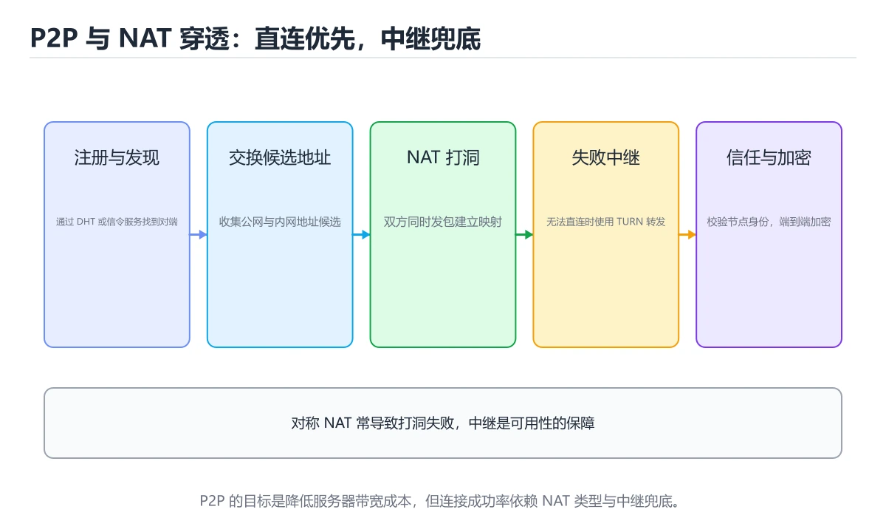
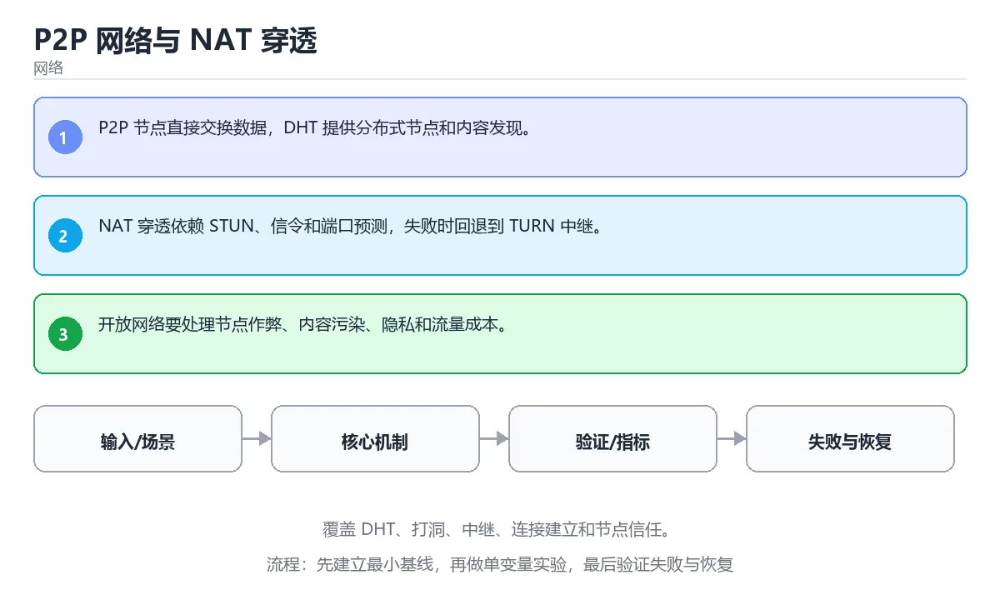

# P2P 网络与 NAT 穿透

> 内容更新时间：2026-10-06 · 学习阶段：高级 · 预计用时：30 分钟





## 学习目标

- 能用自己的话解释：P2P 节点直接交换数据，DHT 提供分布式节点和内容发现。
- 能用自己的话解释：NAT 穿透依赖 STUN、信令和端口预测，失败时回退到 TURN 中继。
- 能用自己的话解释：开放网络要处理节点作弊、内容污染、隐私和流量成本。
- 能把本课知识放回「网络」，并完成练习与测验。

## 前置知识

- 已完成「网络」的基础课程，能运行正文中的最小示例。
- 本课关键词：P2P、DHT、NAT 穿透、中继。
- 遇到不熟悉的术语先记录问题，完成练习后再回读。

## 核心知识

### 1. P2P 节点直接交换数据，DHT 提供分布式节点和内容发现。

- 关键做法：先用最小示例建立基线，再逐步加入边界、失败和性能条件。
- 验证标准：结果可复现、错误可解释、边界有测试、失败能恢复。

### 2. NAT 穿透依赖 STUN、信令和端口预测，失败时回退到 TURN 中继。

把这条结论放回「P2P 网络与 NAT 穿透」的完整流程里展开：

- 正文依据：能用自己的话解释：P2P 节点直接交换数据，DHT 提供分布式节点和内容发现。
- 落地检查：把「2. NAT 穿透依赖 STUN、信令和端口预测，失败时回退到 TURN 中继。」改写成一条可执行的核对项，逐条验证输入、超时与失败路径。

### 3. 开放网络要处理节点作弊、内容污染、隐私和流量成本。

把这条结论放回「P2P 网络与 NAT 穿透」的完整流程里展开：

- 正文依据：能用自己的话解释：NAT 穿透依赖 STUN、信令和端口预测，失败时回退到 TURN 中继。
- 落地检查：把「3. 开放网络要处理节点作弊、内容污染、隐私和流量成本。」改写成一条可执行的核对项，逐条验证输入、超时与失败路径。

## 关键流程

```text
输入 → 校验 → 核心处理 → 验证 → 记录指标 → 失败恢复
```

## 实践路径

1. 用一句话复述本课要解决的问题。
2. 跑通正文中的最小示例并记录基线。
3. 只改变一个输入或参数，预测并验证结果。
4. 补一个失败路径，记录错误、恢复和指标。
5. 把结论写成可复现的笔记或测试。

## 常见错误与排查

| 误区 | 后果 | 修正 |
| --- | --- | --- |
| 只记术语不做实验 | 遇到真实问题无法判断 | 用最小输入跑通并记录结果 |
| 只测正常路径 | 边界和故障上线才暴露 | 补空值、极值和依赖失败 |
| 没有基线就优化 | 无法证明改进有效 | 先测量再修改 |
| 忽略成本与安全 | 性能和风险失控 | 同时记录资源、权限与失败代价 |
- **关于，下列说法正确的是？**：正确答案是「P2P 节点直接交换数据，DHT 提供分布式节点和内容发现。
- **关于，下列说法正确的是？**：正确答案是「NAT 穿透依赖 STUN、信令和端口预测，失败时回退到 TURN 中继。
- **关于，下列说法正确的是？**：正确答案是「开放网络要处理节点作弊、内容污染、隐私和流量成本。
- **本课的核心学习目标是什么？**：正确答案是「覆盖 DHT、打洞、中继、连接建立和节点信任。

## 动手练习

1. 合上教程，用 3～5 句话解释P2P 网络与 NAT 穿透。
2. 从正文选一个例子，改变一个条件并预测结果。
3. 设计一个失败场景，写出止损与恢复步骤。

**验收标准**：留下输入、命令、输出、差异和下一步问题。

## 本课小结

- 本课属于「网络」，核心关键词是 P2P、DHT、NAT 穿透、中继。
- 先保证正确与可复现，再讨论性能和扩展。
- 完成练习和测验后，把仍然不确定的问题写成下一轮验证清单。

> 本课由 P1 内容扩展生成，重点补充原有课程缺失的主题与工程边界。

## 深入理解：P2P 网络与 NAT 穿透

### 中心化、去中心化与混合

P2P 不是一个协议，而是一组拓扑选择。中心化索引（如早期 Napster）查询快但存在单点；
纯去中心化网络（如 Gnutella）没有中心，但广播查询代价高；混合结构用超级节点或
DHT 承担索引，既降低广播又保持可扩展。BitTorrent 的 Tracker 加 DHT 就是混合典型：
Tracker 负责快速发现，DHT 负责在 Tracker 不可用时兜底。

### DHT 与 Kademlia

分布式哈希表把「键」映射到负责它的节点。Kademlia 用异或距离定义节点间的远近，
每个节点维护按距离分桶的路由表，查询时每跳至少把距离减半，因此 O(log n) 跳即可
定位。它天然支持节点频繁加入退出，是 BitTorrent、IPFS 等系统发现层的基石。

### 打洞的工程现实

P2P 客户端要面对各种 NAT：完全锥形、受限锥形、端口受限与对称。STUN 只能探测映射，
TURN 负责兜底中继，ICE 负责组合候选地址并做连通性检查。工程上还要处理 IPv6
直连、移动网络切换、运营商级 NAT 和防火墙丢包。设计指标不是「打洞成功率越高越好」，
而是「直连优先、失败可退、成本与体验平衡」。

「P2P 网络与 NAT 穿透」的「中心化、去中心化与混合」一节补全如下：

- 定位：这一节说明中心化、去中心化与混合在「P2P 网络与 NAT 穿透」知识体系里的位置。
- 要点：本课属于「网络」，核心关键词是 P2P、DHT、NAT 穿透、中继。
- 自检：能否用一个最小例子解释中心化、去中心化与混合？


「P2P 网络与 NAT 穿透」的「DHT 与 Kademlia」一节补全如下：

- 定位：这一节说明DHT 与 Kademlia在「P2P 网络与 NAT 穿透」知识体系里的位置。
- 要点：P2P 不是一个协议，而是一组拓扑选择。中心化索引（如早期 Napster）查询快但存在单点；
- 自检：能否用一个最小例子解释DHT 与 Kademlia？


「P2P 网络与 NAT 穿透」的「打洞的工程现实」一节补全如下：

- 定位：这一节说明打洞的工程现实在「P2P 网络与 NAT 穿透」知识体系里的位置。
- 要点：DHT 承担索引，既降低广播又保持可扩展。BitTorrent 的 Tracker 加 DHT 就是混合典型：
- 自检：能否用一个最小例子解释打洞的工程现实？

## 可运行练习

### 任务 1：先跑通，再解释

```python
import socket

print(socket.gethostbyname("localhost"))
```

### 任务 2：只改一个条件

把「P2P 网络与 NAT 穿透」的最小示例复制一份，只改一个条件再跑一次：

- 改动点：只把P2P的输入换成空值、极值或错误输入，其余保持不变。
- 预测：先写下「P2P 网络与 NAT 穿透」在改动后的输出或错误信息，再运行。
- 记录：对照改动前后的结果，指出差异出在哪一步。
- 验收：换回原条件能复现原结果，改动只影响P2P。

### 任务 3：迁移到自己的数据

用同一套思路处理一组你自己的数据或场景，保持输出格式与任务 1 一致。

## 故障现场

### 现场 1：本课的 P2P 常规用例通过，但边界用例失败

**症状**：在本课的练习或生产场景里出现“本课的 P2P 常规用例通过，但边界用例失败”。

**复现**：准备一组最小输入，只保留触发“本课的 P2P 常规用例通过，但边界用例失败”的必要条件，连续运行两次确认结果稳定。

**定位**：围绕“P2P 的前置条件与取值边界没有写进代码，默认值掩盖了空值和极值”检查调用链、输入数据和环境配置，先验证假设再改代码。

**预防**：把“本课的 P2P 常规用例通过，但边界用例失败”写成一条自动化用例，并在本课的验收清单里保留对应检查项。

### 现场 2：本课的 DHT 结果在两次运行之间不一致

**症状**：在本课的练习或生产场景里出现“本课的 DHT 结果在两次运行之间不一致”。

**复现**：准备一组最小输入，只保留触发“本课的 DHT 结果在两次运行之间不一致”的必要条件，连续运行两次确认结果稳定。

**定位**：围绕“DHT 依赖了当前版本、执行顺序或共享状态，单次运行无法暴露差异”检查调用链、输入数据和环境配置，先验证假设再改代码。

**预防**：把“本课的 DHT 结果在两次运行之间不一致”写成一条自动化用例，并在本课的验收清单里保留对应检查项。

### 现场 3：请求偶发超时，但服务端监控看起来正常

**症状**：在本课的练习或生产场景里出现“请求偶发超时，但服务端监控看起来正常”。

## 深入补充：P2P 网络与 NAT 穿透 的取舍与边界

### 一、把概念放回真实约束

学习P2P 网络与 NAT 穿透时，最容易只记住结论而忽略前提。先写出三个约束：数据规模、时间预算、可接受的失败方式；再判断 P2P 与 DHT 在这些约束下是否仍然成立。只要约束改变，原来的最优解就可能变成错误解。

| 场景 | 协议或方案 | 延迟与可靠性 | 排障入口 |
| --- | --- | --- | --- |
| 强一致请求 | TCP / HTTP | 可靠但可能队头阻塞 | 连接与重传指标 |
| 实时音视频 | UDP / QUIC | 低延迟但允许丢包 | 抖动与丢包率 |
| 大规模分发 | CDN 与缓存 | 就近命中 | 命中率与回源 |
| 服务间调用 | RPC 或消息队列 | 取决于确认机制 | 超时、重试与幂等 |

### 二、三个容易混淆的边界

1. 澄清输入与目标。先写清「P2P 网络与 NAT 穿透」要解决的问题、合法输入范围和成功标准，再进入后续步骤。
2. **把“平均值”当成“全部”**：P2P 的指标好看，不代表尾部请求、冷启动或失败重试也好看。
3. **把“当前版本”当成“永久行为”**：DHT 依赖的默认值、API 或性能特征都可能随版本变化，需要固定版本并保留回归用例。

### 三、一个生产场景

假设团队要在真实系统里使用P2P 网络与 NAT 穿透：第一周先做小流量验证，记录 P2P 的基线与异常；第二周扩大输入规模，观察 DHT 是否成为瓶颈；第三周再做故障演练，主动注入超时、重复请求和依赖不可用，确认系统能降级、能重试、能恢复。每一步都要留下指标、日志和结论，而不是只留下“感觉更快了”。

### 四、自测清单

- 能否用一句话说出P2P 网络与 NAT 穿透解决的核心问题与不适用场景？
- 能否画出 P2P 的数据流或状态变化，并标出失败路径？
- 能否给出一个反例，证明某个看似合理的结论在边界条件下不成立？
- 能否写出一条可复现的验证命令，让别人独立得到相同结论？

## 本课复习清单

离开本课前，逐项确认：

- [ ] 不看解析，能说出「关于，下列说法正确的是？」的判断依据。
- [ ] 不看解析，能说出「本课的核心学习目标是什么？」的判断依据。
- [ ] 至少运行一次本课示例，记录输入、输出和一个边界情况。
- [ ] 把本课最容易混淆的两个概念写成一句话对照。

| 复盘项 | 记录 |
| --- | --- |
| 已经能独立解释的考点 |  |
| 仍然说不清的概念 |  |
| 下一步验证动作 |  |

## 复习与自测

下面按正文顺序回顾每一节，并给出一个自检问题；说不清的地方回到原章节补课。

### 核心知识

自检：这一节与相邻主题的边界在哪里？

### 动手练习

自检：如果去掉这一节里的一个前提，结论会怎样变化？

### 深入理解：P2P 网络与 NAT 穿透

中心化索引（如早期 Napster）查询快但存在单点；。纯去中心化网络（如 Gnutella）没有中心，但广播查询代价高；混合结构用超级节点或。

自检：这一节的关键输入与输出分别是什么？

### 验证步骤

制造一次错误输入，记录错误信息与修复方式。

## 术语速查

| 术语 | 一句话说明 |
| --- | --- |
| `P2P` | 围绕“P2P 的前置条件与取值边界没有写进代码，默认值掩盖了空值和极值”检查调用链、输入数据和环境配置，先验证假设再改代码。 |
| `DHT` | 围绕“DHT 依赖了当前版本、执行顺序或共享状态，单次运行无法暴露差异”检查调用链、输入数据和环境配置，先验证假设再改代码。 |
| `NAT 穿透` | 按“P2P 网络与 NAT 穿透”中 P2P、DHT、NAT 穿透 的实践顺序，把四个步骤排成从准备到复盘的合理顺序。 |
| `中继` | 用一句话说明「P2P 网络与 NAT 穿透」解决什么问题：覆盖 DHT、打洞、中继、连接建立和节点信任。 |

## 深度拓展与实战

这一节把正文里的定义、代码和失败模式串成一条可操作的复习路线。

### 机制拆解

- **1. P2P 节点直接交换数据，DHT 提供分布式节点和内容发现。**：在「P2P 网络与 NAT 穿透」里，「1. P2P 节点直接交换数据，DHT 提供分布式节点和内容发现。」这一步要先写清输入与预期，再记录实际结果和差异；结果不符时回到对应小节核对前提。
- **2. NAT 穿透依赖 STUN、信令和端口预测，失败时回退到 TURN 中继。**：在「P2P 网络与 NAT 穿透」里，「2. NAT 穿透依赖 STUN、信令和端口预测，失败时回退到 TURN 中继。」这一步要先写清输入与预期，再记录实际结果和差异；结果不符时回到对应小节核对前提。
- **3. 开放网络要处理节点作弊、内容污染、隐私和流量成本。**：在「P2P 网络与 NAT 穿透」里，「3. 开放网络要处理节点作弊、内容污染、隐私和流量成本。」这一步要先写清输入与预期，再记录实际结果和差异；结果不符时回到对应小节核对前提。
- **中心化、去中心化与混合**：P2P 不是一个协议，而是一组拓扑选择
- **DHT 与 Kademlia**：在「P2P 网络与 NAT 穿透」里，「DHT 与 Kademlia」这一步要先写清输入与预期，再记录实际结果和差异；结果不符时回到对应小节核对前提。

### 边界条件与常见反例

「P2P 网络与 NAT 穿透」的边界不只包括最大最小值，还要覆盖空、重复和失败：

| 条件 | 常见反例 | 处理方式 |
| --- | --- | --- |
| 空输入 | P2P 没有任何取值 | 先判空，给出明确错误而不是继续执行 |
| 边界值 | DHT 取最小或最大 | 用最小值、最大值和越界值各跑一次 |
| 重复执行 | 同一输入被执行两次 | 保证结果可重复，必要时加锁或去重 |
| 失败路径 | P2P 相关步骤报错 | 保留原始错误，确认回滚或重试行为 |

### 工程检查表

- [ ] 能否用自己的话说明P2P 网络与 NAT 穿透解决什么问题，以及它不负责什么？
- [ ] 能否指出最小可运行示例的输入、输出和一条失败路径？
- [ ] 能否解释本课关键词在真实项目中的边界与取舍？
- [ ] 能否把本课方法迁移到另一个相近问题，并说明需要改什么？

### 迁移练习

1. 保持正文示例不变，写出它的输入、处理步骤和预期输出。
2. 只改变一个条件，预测结果并说明依据；再运行或手算验证。
3. 结合P2P、DHT、NAT 穿透、中继，写出一个真实项目中的使用场景。
4. 写下一个反例，说明它在什么条件下会使朴素做法失效。

## 考点精讲

### 考点 1：顺序排列·P2P

- **题目**：按“P2P 网络与 NAT 穿透”中 P2P、DHT、NAT 穿透 的实践顺序，把四个步骤排成从准备到复盘的合理顺序。
- **判断依据**：在「P2P 网络与 NAT 穿透」里，在本课的练习里，顺序应当是：先明确 P2P 的输入、输出与约束 → 写出最小示例并核对 DHT 的基线结果 → 只改一个变量，记录边界与失败路径的变化 → 固定版本与证据，把本课的结论写成可复现记录。这个顺序把 P2P 的输入、输出和约束放在最前面，在P2P 网络与 NAT 穿透里避免概念没对齐就开始调参。第二步用 DHT 建立可核对的基线，在P2P 网络与 NAT 穿透里第三步才允许改变一个变量并观察失败路径。

### 考点 2：概念判断·P2P

- **题目**：关于「NAT 穿透依赖 STUN、信令和端口预测，失败时回退到 TURN 中继。」，下列说法正确的是？
- **判断依据**：在「P2P 网络与 NAT 穿透」里，NAT 穿透依赖 STUN、信令和端口预测，失败时回退到 TURN 中继。在「P2P 网络与 NAT 穿透」里判断这道题，要把P2P、DHT、NAT 穿透的条件、过程与失败路径逐项对齐，换成“关于NAT 穿透依赖 STUN、信令”这个场景，只有满足前提的结论才成立。

### 考点 3：代码补全·P2P

- **题目**：阅读「P2P 网络与 NAT 穿透」正文里的这段 Python 代码，下面哪一项判断是正确的？
- **判断依据**：在「P2P 网络与 NAT 穿透」里，题干的正确项是这段代码会产生可观察的输出，运行后能看到结果，在「P2P 网络与 NAT 穿透」里要结合P2P核对输出是否符合预期。把输入或边界换成空值、极值或失败情况后，结论要以「P2P 网络与 NAT 穿透」的实际运行结果为准。把“这段代码会产生可观察的输出”代回「P2P 网络与 NAT 穿透」里“阅读P2P 网络与 NAT 穿透正文里的这段 Python”的例子核对，条件一旦改变，结论就要用P2P、DHT、NAT 穿透重新推导。

### 考点 4：概念判断·P2P

- **题目**：「P2P 网络与 NAT 穿透」的核心学习目标是什么？
- **判断依据**：在「P2P 网络与 NAT 穿透」里，结论应落在「覆盖 DHT、打洞、中继、连接建立和节点信任」。在「P2P 网络与 NAT 穿透」里，结论应落在覆盖 DHT、打洞、中继、连接建立和节点信任。在「P2P 网络与 NAT 穿透」里，这道题要求区分概念与边界，覆盖 DHT、打洞、中继、连接建立和节点信任。

### 考点 5：多选辨析·P2P

- **题目**：以下哪些术语与「P2P 网络与 NAT 穿透」直接相关？（多选）
- **判断依据**：在「P2P 网络与 NAT 穿透」里，DHT。把“P2P”代回「P2P 网络与 NAT 穿透」里“以下哪些术语与P2P 网络与 NAT 穿透直接相关”的例子核对，条件一旦改变，结论就要用P2P、DHT、NAT 穿透重新推导。回到P2P、DHT、NAT 穿透本身再看一遍：只有“P2P”与题干“以下哪些术语与P2P”的前提一致，结论才成立。

## English Overview

**Title:** P2P Networks and NAT Traversal

**Summary:** Cover DHTs, hole punching, relays, connection setup and trust.

**Category:** Networking
**Level:** 高级
**Key terms:** P2P, DHT, NAT 穿透, 中继

## 内容元数据

- 内容版本：v2.0
- 最后更新：2026-10-06
- 学习阶段：高级
- 适用环境：TCP/IP、HTTP/2、HTTP/3 与现代网络栈
- 内容来源：内置结构化课程与工程实践整理
- 相关主题：P2P、DHT、NAT 穿透、中继
- 质量版本：P0 测验标准 + P1 覆盖扩展 + P2 体验补全

## 最小可运行示例

下面示例用于验证本课的最小输入、处理和输出。先原样运行，再只修改一个值：

```python
import socket

print(socket.gethostbyname("localhost"))
```

## 预期输出

```text
127.0.0.1
```

## 验证步骤

1. 记录运行环境、命令和真实输出。
2. 修改一个输入，先写预测再运行。
4. 把结论写回本课笔记或测试用例。

## 参考资料与复核

- 最后复核：2026-10-04
- 下次复核：2027-04-04
- 复核范围：版本兼容、API 行为、安全建议与工程实践
- 来源性质：官方文档、标准或权威教材；正文为离线教学重组

| 参考资料 | 本课用途 |
| --- | --- |
| [RFC 9112 HTTP/1.1](https://www.rfc-editor.org/rfc/rfc9112) | HTTP/1.1 报文与连接 |
| [RFC 9293 TCP](https://www.rfc-editor.org/rfc/rfc9293) | TCP 连接、重传与拥塞 |
| [RFC 8446 TLS 1.3](https://www.rfc-editor.org/rfc/rfc8446) | TLS 握手与加密 |

> 「P2P 网络与 NAT 穿透」的链接用于离线阅读后的延伸核对；App 不会自动联网。

## 复习与迁移

复习目标：把「P2P 网络与 NAT 穿透」的判断标准放回可复现的例子里。先自己作答，再对照依据；如果结论正确但理由不完整，回到正文补足前提。

### 概念复述

- 用一句话说明「P2P 网络与 NAT 穿透」解决什么问题：覆盖 DHT、打洞、中继、连接建立和节点信任。
- 写出P2P、DHT、NAT 穿透之间的关系，并各举一个例子。
- 说出本课最容易混淆的两个概念，以及区分它们的判据。

### 正文逐节复核

- **深入理解：P2P 网络与 NAT 穿透**：Tracker 负责快速发现，DHT 负责在 Tracker 不可用时兜底。
- **深入补充：P2P 网络与 NAT 穿透 的取舍与边界**：学习P2P 网络与 NAT 穿透时，最容易只记住结论而忽略前提。

### 测验回顾

1. 按“P2P 网络与 NAT 穿透”中 P2P、DHT、NAT 穿透 的实践顺序，把四个步骤排成从准备到复盘的合理顺序。
   - 依据：在「P2P 网络与 NAT 穿透」里，在本课的练习里，顺序应当是：先明确 P2P 的输入、输出与约束 → 写出最小示例并核对 DHT 的基线结果 → 只改一个变量，记录边界与失败路径的变化 → 固定版本与证据，把本课的结论写成可复现记录。这个顺序把 P2P 的输入、输出和约束放在最前面，在P2P 网络与 NAT 穿透里避免概念没对齐就开始调参。第二步用 DHT 建立可核对的基线，在P2P 网络与 NAT 穿透里第三步才允许改变一个变量并观察失败路径。
2. 关于「NAT 穿透依赖 STUN、信令和端口预测，失败时回退到 TURN 中继。」，下列说法正确的是？
   - 依据：在「P2P 网络与 NAT 穿透」里，NAT 穿透依赖 STUN、信令和端口预测，失败时回退到 TURN 中继。在「P2P 网络与 NAT 穿透」里判断这道题，要把P2P、DHT、NAT 穿透的条件、过程与失败路径逐项对齐，换成“关于NAT 穿透依赖 STUN、信令”这个场景，只有满足前提的结论才成立。
3. 阅读「P2P 网络与 NAT 穿透」正文里的这段 Python 代码，下面哪一项判断是正确的？
   - 依据：在「P2P 网络与 NAT 穿透」里，题干的正确项是这段代码会产生可观察的输出，运行后能看到结果，在「P2P 网络与 NAT 穿透」里要结合P2P核对输出是否符合预期。把输入或边界换成空值、极值或失败情况后，结论要以「P2P 网络与 NAT 穿透」的实际运行结果为准。把“这段代码会产生可观察的输出”代回「P2P 网络与 NAT 穿透」里“阅读P2P 网络与 NAT 穿透正文里的这段 Python”的例子核对，条件一旦改变，结论就要用P2P、DHT、NAT 穿透重新推导。
4. 「P2P 网络与 NAT 穿透」的核心学习目标是什么？
   - 依据：在「P2P 网络与 NAT 穿透」里，结论应落在「覆盖 DHT、打洞、中继、连接建立和节点信任」。在「P2P 网络与 NAT 穿透」里，结论应落在覆盖 DHT、打洞、中继、连接建立和节点信任。在「P2P 网络与 NAT 穿透」里，这道题要求区分概念与边界，覆盖 DHT、打洞、中继、连接建立和节点信任。
5. 以下哪些术语与「P2P 网络与 NAT 穿透」直接相关？（多选）
   - 依据：在「P2P 网络与 NAT 穿透」里，DHT。把“P2P”代回「P2P 网络与 NAT 穿透」里“以下哪些术语与P2P 网络与 NAT 穿透直接相关”的例子核对，条件一旦改变，结论就要用P2P、DHT、NAT 穿透重新推导。回到P2P、DHT、NAT 穿透本身再看一遍：只有“P2P”与题干“以下哪些术语与P2P”的前提一致，结论才成立。

### 迁移练习

把「P2P 网络与 NAT 穿透」的结论迁移到相邻主题，每次迁移都写清预测与证据：

1. 换输入：用P2P处理一组你自己的数据，对比教材示例的结果差异。
2. 换失败条件：制造一个DHT相关的错误，说明如何从错误信息定位根因。
3. 换规模：把数据量或并发度提高一个数量级，说明「P2P 网络与 NAT 穿透」的结论是否仍成立。
