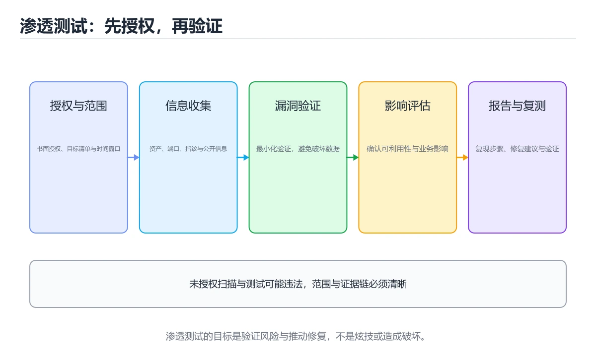

# 渗透测试基础

> 内容更新时间：2026-10-06 · 学习阶段：入门 · 预计用时：40 分钟




## 本节知识框架

**课程定位**：所属分类 `network`（网络），课程主题 `渗透测试基础`，学习阶段 入门，建议用时 40 分钟。

本课主线：授权流程、信息收集、漏洞验证与报告写法。

**学完本课应当能够**
- 说清 `渗透测试` 与 `nmap` 的含义与区别，并各举一个正例和一个反例。
- 用本课示例验证 `Burp` 的行为，记录输入、输出与失败条件。
- 遇到「没有书面授权就开始测试」这类问题时，能说出触发条件与修复顺序。

### 从概念到验证的学习链条

1. `渗透测试`：先掌握 渗透测试是在授权范围内，用攻击者视角验证系统安全控制是否有效，再用它解释 `nmap` 为什么会出现。
2. `nmap`：先掌握 网络主机、端口和服务扫描工具，用于资产发现与安全评估，再用它解释 `Burp` 为什么会出现。
3. `Burp`：先掌握 用于拦截、修改和重放 HTTP 流量的 Web 安全测试代理，再用它解释 `漏洞验证` 为什么会出现。
4. `漏洞验证`：先掌握 渗透测试是在授权范围内，用攻击者视角验证系统安全控制是否有效；完整流程包括范围确认、信息收集、漏洞验证、影响证明、风险评级和修复复测，再用它解释 本课示例的观察结果 为什么会出现。

**先修与衔接**：本课是「网络」分类的第 2 课。相关或后续课程：《IPv6 原理与迁移》。

### 完成判据

- **定义关**：不看正文也能说明 `渗透测试` 是 渗透测试是在授权范围内，用攻击者视角验证系统安全控制是否有效，并指出一个反例。
- **机制关**：能按“输入 → 转换 → 输出 → 验证”复述 `渗透测试基础`，而不是只背结论。
- **示例关**：能运行或推演 `渗透测试基础` 的 `python` 示例，并说明一个真实出现的标识符或字面量。
- **证据关**：能指出 `渗透测试基础` 示例里的 调用了 `field()`，并说明它支持或反驳了本课的哪一条结论。
- **排错关**：能复现 没有书面授权就开始测试，记录现象并按 先确认授权、范围和紧急停止机制 修复。
- **迁移关**：能把 `渗透测试`、`nmap`、`Burp`、`漏洞验证` 放进一个与 `渗透测试基础` 不同的项目场景，并保持输入与验证条件可追踪。
- **复盘关**：学完 `渗透测试基础` 后，用一句话写下仍然不确定的结论，并列出下一次验证需要的输入、环境和成功判据。

### 复习清单

- [ ] 能不看正文复述本课核心术语，并指出一个边界或反例。
- [ ] 能运行或推演本课示例，记录输入、输出与失败现象。
- [ ] 能完成一次自测，并把错题对照错误表定位原因。

## 核心概念定义

| 术语 | 操作性定义 | 常见边界与风险 |
| --- | --- | --- |
| 渗透测试 | 渗透测试是在授权范围内，用攻击者视角验证系统安全控制是否有效。 | 权限与密钥策略变化会让结论失效，按最小权限并用真实凭据流程复验。 |
| nmap | 网络主机、端口和服务扫描工具，用于资产发现与安全评估。 | 网络延迟、超时与版本协商会改变行为，只在真实链路或多版本客户端上验证才算数。 |
| Burp | 用于拦截、修改和重放 HTTP 流量的 Web 安全测试代理。 | 网络延迟、超时与版本协商会改变行为，只在真实链路或多版本客户端上验证才算数。 |
| 漏洞验证 | 渗透测试是在授权范围内，用攻击者视角验证系统安全控制是否有效；完整流程包括范围确认、信息收集、漏洞验证、影响证明、风险评级和修复复测。 | 权限与密钥策略变化会让结论失效，按最小权限并用真实凭据流程复验。 |

## 原理与运行机制

### 机制总览

**教材衔接：授权与流程**

渗透测试的第一步不是技术，而是**书面授权**：明确测试范围（域名/IP/接口）、时间窗口、允许的手段（是否可 DoS、是否可社工）、联系人。未经授权测试他人系统属于违法行为。

标准流程：信息收集 → 漏洞扫描 → 手工验证 → 权限提升/横向移动（若授权）→ 整理报告 → 复测确认修复。每一步都要留存证据（时间戳、请求响应、截图）。

**教材衔接：信息收集要点**

| 目标 | 手段 |
| --- | --- |
| 子域名 | 证书透明度日志、DNS 枚举、被动扫描 |
| 技术栈 | 响应头、错误页、Cookie 名称、JS 中的接口路径 |
| 暴露面 | 端口扫描、目录爆破、GitHub 泄露的密钥 |
| 历史信息 | Wayback、搜索引擎缓存、泄露的数据库样本 |

**教材衔接：常见漏洞的验证方法**

| 漏洞 | 验证方式 | 修复要点 |
| --- | --- | --- |
| SQL 注入 | 在参数中插入 `'` 观察报错与布尔差异 | 参数化查询 |
| XSS | 注入 `<script>` 或属性逃逸载荷，看是否执行 | 输出转义 + CSP |
| 越权 | 用 A 的 Token 访问 B 的资源 ID | 服务端资源级鉴权 |
| SSRF | 传内网地址或云元数据地址观察响应 | 出站白名单 + 禁跳转 |
| 文件上传 | 上传畸形扩展名与图片马 | 类型白名单 + 存储分离 |
| 弱口令 | 在限速范围内尝试常见口令 | 强口令策略 + 多因素 |

**教材衔接：工具与边界**

常用工具：nmap（端口与服务识别）、Burp Suite（代理与改包）、sqlmap（SQL 注入验证）、dirsearch（目录发现）、nuclei（模板化扫描）。工具只是辅助，**真正有价值的是逻辑漏洞与业务缺陷**，那部分必须靠手工分析与业务理解。

**教材衔接：报告写法**

每个漏洞包含：标题、风险等级（CVSS 思路：可利用性 × 影响）、复现步骤（含请求响应）、影响说明（能拿到什么数据/权限）、修复建议、参考链接。**优先级按业务影响排序，而不是按技术炫技程度**。

**教材衔接：阶段速查**

| 阶段 | 目标 | 常用手段 |
| --- | --- | --- |
| 授权与范围 | 明确可测范围与时间窗 | 书面授权、测试账户、应急联系人 |
| 信息收集 | 摸清资产与指纹 | DNS 枚举、端口扫描、目录探测 |
| 漏洞发现 | 找到可利用缺陷 | 手工测试、扫描器、代码审计 |
| 漏洞利用 | 验证危害（在允许范围内） | 最小必要利用，避免破坏数据 |
| 提权与横向 | 评估影响面 | 权限提升、凭证复用 |
| 清理与报告 | 复原环境并交付结论 | 删除测试账号与文件、出具报告 |

### 机制拆解：每一步的输入、动作与输出

#### 1. `渗透测试`
- 输入：`渗透测试`；本步把 渗透测试是在授权范围内，用攻击者视角验证系统安全控制是否有效 当作判断规则。
- 动作：围绕 `渗透测试` 保留中间状态，并记录它与 `nmap` 的对应关系。
- 输出：`nmap`，它可以被下一段代码、测试或记录继续使用。
- `渗透测试` 的失败条件：权限与密钥策略变化会让结论失效，按最小权限并用真实凭据流程复验。

#### 2. `nmap`
- 输入：`渗透测试`；本步把 网络主机、端口和服务扫描工具，用于资产发现与安全评估 当作判断规则。
- 动作：围绕 `nmap` 保留中间状态，并记录它与 `Burp` 的对应关系。
- 输出：`Burp`，它可以被下一段代码、测试或记录继续使用。
- `nmap` 的失败条件：网络延迟、超时与版本协商会改变行为，只在真实链路或多版本客户端上验证才算数。

#### 3. `Burp`
- 输入：`nmap`；本步把 用于拦截、修改和重放 HTTP 流量的 Web 安全测试代理 当作判断规则。
- 动作：围绕 `Burp` 保留中间状态，并记录它与 `漏洞验证` 的对应关系。
- 输出：`漏洞验证`，它可以被下一段代码、测试或记录继续使用。
- `Burp` 的失败条件：网络延迟、超时与版本协商会改变行为，只在真实链路或多版本客户端上验证才算数。

#### 4. `漏洞验证`
- 输入：`Burp`；本步把 渗透测试是在授权范围内，用攻击者视角验证系统安全控制是否有效；完整流程包括范围确认、信息收集、漏洞验证、影响证明、风险评级和修复复测 当作判断规则。
- 动作：围绕 `漏洞验证` 保留中间状态，并记录它与 `field` 的对应关系。
- 输出：`field`，它可以被下一段代码、测试或记录继续使用。
- `漏洞验证` 的失败条件：权限与密钥策略变化会让结论失效，按最小权限并用真实凭据流程复验。

### 示例中的可观察事实

1. 调用了 `field()`；它对应的课程主题是 `渗透测试基础`。
2. 调用了 `priority()`；它对应的课程主题是 `渗透测试基础`。
3. 调用了 `get()`；它对应的课程主题是 `渗透测试基础`。
4. 调用了 `int()`；它对应的课程主题是 `渗透测试基础`。
5. 调用了 `summarize()`；它对应的课程主题是 `渗透测试基础`。
6. 调用了 `sorted()`；它对应的课程主题是 `渗透测试基础`。
7. 调用了 `len()`；它对应的课程主题是 `渗透测试基础`。
8. 调用了 `Finding()`；它对应的课程主题是 `渗透测试基础`。

### 复现实验记录

- 环境：`渗透测试基础` 使用 `python` 示例，固定 `渗透测试`、`nmap`、`Burp`、`漏洞验证` 作为第一组条件。
- 首轮输入：先确认 调用了 `field()`，预测 `渗透测试` 会怎样变化。
- 基线观察：记录命令、输入、输出和错误原文，不用截图代替可复制的文本。
- 单变量修改：只改变 `渗透测试`，观察 `漏洞验证` 是否仍满足定义。
- 失败注入：复现 没有书面授权就开始测试，确认现象是 可能触犯法律并影响业务。
- 记录结论：把“修改前、修改后、预期变化、实际变化”写成四列表，这样复盘 `渗透测试基础` 时才能区分概念错误与实现错误。

## 典型应用场景

- **没有书面授权就开始测试**：典型现象是可能触犯法律并影响业务；正确做法是先确认授权、范围和紧急停止机制。
- **直接下载或修改真实数据**：典型现象是造成隐私泄露或生产事故；正确做法是使用最小证据和只读验证。
- **只报工具输出的高危**：典型现象是误报多且无法修复；正确做法是人工验证利用条件和实际影响。
- **修复后不做复测**：典型现象是同类问题仍然存在；正确做法是复测原漏洞并检查横向入口。

### 最小验证场景

- 准备：保留 `python` 示例的原始输入，先记录 `渗透测试基础` 的基线输出和完整运行命令。
- 观察：先核对 调用了 `field()`，再改变一个与 `渗透测试` 相关的条件。
- 判定：新结果与 `渗透测试基础` 的基线不同不等于错误；只有当差异破坏了 `渗透测试` 的定义或错误表中的约束，才判定为失败。

### 选择与边界

- 使用 `渗透测试` 时，先满足它的定义：渗透测试是在授权范围内，用攻击者视角验证系统安全控制是否有效；权限与密钥策略变化会让结论失效，按最小权限并用真实凭据流程复验。
- 使用 `nmap` 时，先满足它的定义：网络主机、端口和服务扫描工具，用于资产发现与安全评估；网络延迟、超时与版本协商会改变行为，只在真实链路或多版本客户端上验证才算数。
- 使用 `Burp` 时，先满足它的定义：用于拦截、修改和重放 HTTP 流量的 Web 安全测试代理；网络延迟、超时与版本协商会改变行为，只在真实链路或多版本客户端上验证才算数。
- 使用 `漏洞验证` 时，先满足它的定义：渗透测试是在授权范围内，用攻击者视角验证系统安全控制是否有效；完整流程包括范围确认、信息收集、漏洞验证、影响证明、风险评级和修复复测；权限与密钥策略变化会让结论失效，按最小权限并用真实凭据流程复验。

## 代码/协议/SQL 示例

### 最小可验证示例

```python
from dataclasses import dataclass, field

@dataclass
class Finding:
    title: str
    severity: str
    cvss: float
    asset: str
    evidence: str
    impact: str
    remediation: str
    references: list = field(default_factory=list)

    def priority(self) -> int:
        """按 CVSS 与资产重要性给出处置优先级。"""
        weight = {"核心": 1.0, "重要": 0.7, "一般": 0.4}.get(self.asset, 0.4)
        return int(self.cvss * weight * 10)

def summarize(findings: list) -> dict:
    """汇总报告：按严重程度统计并给出排序后的清单。"""
    counts = {}
    for item in findings:
        counts[item.severity] = counts.get(item.severity, 0) + 1
    ordered = sorted(findings, key=lambda f: f.priority(), reverse=True)
    return {
        "counts": counts,
        "top3": [f.title for f in ordered[:3]],
        "total": len(findings),
    }

sample = [
    Finding("订单详情越权", "高", 8.1, "核心", "换 ID 可读他人订单", "用户数据泄漏", "校验资源归属"),
    Finding("登录无限速", "中", 5.3, "重要", "900 次/分钟未拦截", "可暴力破解", "加限速与多因素"),
]
print(summarize(sample))
```

**教材衔接：常见漏洞验证速查**

| 漏洞 | 验证要点 | 注意 |
| --- | --- | --- |
| SQL 注入 | 布尔盲注、时间盲注、报错回显 | 用测试库，避免大批量数据导出 |
| XSS | 反射、存储、DOM 型 | 用无害弹窗证明，不窃取真实会话 |
| 越权 | 换 ID 访问他人资源 | 用两个测试账号互测 |
| 文件上传 | 后缀绕过、内容检测 | 上传无害文件并立即清理 |
| SSRF | 访问内网与元数据地址 | 只验证可达性，不读取敏感数据 |
| 弱口令 | 小字典 + 限速 | 避免锁定真实账号 |
| 目录遍历 | `../` 变体探测 | 限定深度，不下载业务数据 |
| 反序列化 | 结构探测与回显判断 | 高风险操作需事先批准 |

**教材衔接：深入补充：渗透测试基础**

前面已经建立了基本概念。这一节换一个角度，把渗透测试基础放进真实工程里，
重点回答三件事：渗透测试 为什么存在、内部如何运转、什么时候会失效。

### 一、核心模型

渗透测试是在授权范围内，用攻击者视角验证系统安全控制是否有效；完整流程包括范围确认、信息收集、漏洞验证、影响证明、风险评级和修复复测。

```text
授权与范围 → 信息收集 → 资产与暴露面 → 漏洞验证 → 影响证明 → 风险报告 → 修复 → 复测关闭
```

### 二、关键机制拆解

1. 授权文件必须写清目标、时间窗口、允许的技术、禁止的操作和紧急联系人。
2. 信息收集包括域名、子域、端口、服务版本、公开仓库、证书和员工信息，但不能越过授权边界。
3. 漏洞验证要最小化影响，优先使用只读证明，避免下载真实数据或破坏生产环境。
4. 风险评级同时考虑利用难度、影响范围、数据敏感度和业务关键性。
5. 报告必须让开发和运维能复现问题、理解影响并完成修复，而不是只丢一个工具截图。
6. 修复后要复测原漏洞，并检查同类问题和其他入口是否仍然存在。
7. 渗透测试不能替代安全开发流程、代码审计和持续监控。

### 三、对照表：抓住容易混淆的边界

| 维度 | 一侧 | 另一侧 |
| --- | --- | --- |
| 漏洞扫描 | 自动化发现已知问题 | 覆盖广但误报和漏报多 |
| 渗透测试 | 人工验证利用链和影响 | 更深入但依赖范围与时间 |
| 红队演练 | 模拟真实攻击者长期对抗 | 目标更偏检测与响应能力 |
| 安全审计 | 检查流程、配置和代码 | 偏合规与系统性改进 |

### 四、工作示例

发现测试环境泄露了云密钥。正确做法是立即停止进一步使用，记录最小证据，通知资产负责人轮换密钥，检查访问日志和影响范围；修复后再验证旧密钥失效且没有其他泄露路径。

### 五、常见误区与失效边界

| 错误做法或假设 | 后果 | 正确做法 |
| --- | --- | --- |
| 没有书面授权就开始测试 | 可能触犯法律并影响业务 | 先确认授权、范围和紧急停止机制 |
| 直接下载或修改真实数据 | 造成隐私泄露或生产事故 | 使用最小证据和只读验证 |
| 只报工具输出的高危 | 误报多且无法修复 | 人工验证利用条件和实际影响 |
| 修复后不做复测 | 同类问题仍然存在 | 复测原漏洞并检查横向入口 |

### 六、场景推演

对一个 Web 系统做授权测试，先确认测试账号和排除目标；发现越权读取接口后，用两个测试账号证明数据隔离失效，但不上传恶意文件；报告中给出请求、响应、影响和最小修复建议，并复测权限校验。

### 七、自测问答

**Q1：渗透测试开始前最重要的东西是什么？**

明确授权和范围，包括目标、时间、禁用操作和紧急联系人。

**Q2：漏洞验证为什么要最小化影响？**

证明风险的同时不能破坏生产、泄露数据或影响用户。

**Q3：风险评级需要考虑什么？**

利用难度、影响范围、数据敏感度、业务重要性和现有控制。

**Q4：为什么渗透测试不能替代 SDL？**

它是一次性验证，持续安全还需要设计、编码、依赖和监控治理。

### 八、小项目：把知识变成可检查的产出

为一个本地靶场写授权测试计划：目标、范围、时间窗口、禁止事项、信息收集清单、三个验证场景、证据格式、风险评级和复测标准。

### 九、适用边界

渗透测试只在授权范围内使用，不能用于未授权系统。它验证的是某个时间点的安全状态，不等于系统永久安全，也不覆盖所有业务逻辑和供应链风险。

### 十、完成检查清单

- [ ] 能写清授权和测试范围
- [ ] 能进行合规的信息收集
- [ ] 能用最小影响证明漏洞
- [ ] 能写出可修复的风险报告
- [ ] 能完成复测和同类问题检查

### 十一、复习顺序

1. 用自己的话说明 default_factory 的作用，再说出它不适用的情况。
2. 再对照表逐行解释容易混淆的概念，每个概念补一个反例。
3. 跟着工作示例做一遍，改变一个条件并预测结果。
4. 用自测问答检查理解，错题回到对应小节重新阅读。
5. 把 nmap 的实现、测试与复盘整理成一份可提交的产物。

> 复习不是重读一遍，而是离开原文重新产出：复述、改写、验证、复盘。

**运行方式**：运行 `渗透测试基础` 的示例时，保存为 `.py` 文件后用 `python 文件名.py` 运行；第三方依赖先在虚拟环境里安装。

### 示例精读：先找证据，再改一个条件

1. 调用了 `field()`；它出现在 `渗透测试基础` 的示例中，阅读时先确认它前后各发生了什么。
2. 调用了 `priority()`；它出现在 `渗透测试基础` 的示例中，阅读时先确认它前后各发生了什么。
3. 调用了 `get()`；它出现在 `渗透测试基础` 的示例中，阅读时先确认它前后各发生了什么。
4. 调用了 `int()`；它出现在 `渗透测试基础` 的示例中，阅读时先确认它前后各发生了什么。
5. 调用了 `summarize()`；它出现在 `渗透测试基础` 的示例中，阅读时先确认它前后各发生了什么。
6. 调用了 `sorted()`；它出现在 `渗透测试基础` 的示例中，阅读时先确认它前后各发生了什么。
7. 调用了 `len()`；它出现在 `渗透测试基础` 的示例中，阅读时先确认它前后各发生了什么。
8. 调用了 `Finding()`；它出现在 `渗透测试基础` 的示例中，阅读时先确认它前后各发生了什么。
- 在 `渗透测试基础` 中与 `渗透测试` 对照：示例必须能支持 渗透测试是在授权范围内，用攻击者视角验证系统安全控制是否有效，否则说明这一段还缺少实现或验证步骤。
- 在 `渗透测试基础` 中与 `nmap` 对照：示例必须能支持 网络主机、端口和服务扫描工具，用于资产发现与安全评估，否则说明这一段还缺少实现或验证步骤。
- 在 `渗透测试基础` 中与 `Burp` 对照：示例必须能支持 用于拦截、修改和重放 HTTP 流量的 Web 安全测试代理，否则说明这一段还缺少实现或验证步骤。
- 在 `渗透测试基础` 中与 `漏洞验证` 对照：示例必须能支持 渗透测试是在授权范围内，用攻击者视角验证系统安全控制是否有效；完整流程包括范围确认、信息收集、漏洞验证、影响证明、风险评级和修复复测，否则说明这一段还缺少实现或验证步骤。

## 时间/空间复杂度或性能分析

**性能关注点（渗透测试基础）**：往返延迟与带宽是主要成本：记录 RTT、吞吐与重传率，区分局域网与真实链路。

**本课特有开销（渗透测试基础 · 渗透测试）**：比较次数与内存移动决定开销，注意稳定性与额外空间。

**测量方法**：以 `渗透测试基础` 的 `渗透测试` 场景为对象，固定输入跑一遍记录基线，再把规模或并发度提高一个数量级复测；两次结果的差值与波动范围才是结论依据。

### 需要控制的变量与记录项

- `渗透测试基础` 的 `渗透测试`：固定它的版本、输入范围和资源上限，分别记录速度、内存与失败率的变化。
- `渗透测试基础` 的 `nmap`：固定它的版本、输入范围和资源上限，分别记录速度、内存与失败率的变化。
- `渗透测试基础` 的 `Burp`：固定它的版本、输入范围和资源上限，分别记录速度、内存与失败率的变化。
- `渗透测试基础` 的 `漏洞验证`：固定它的版本、输入范围和资源上限，分别记录速度、内存与失败率的变化。
- `渗透测试基础` 的 `CVSS`：固定它的版本、输入范围和资源上限，分别记录速度、内存与失败率的变化。
- `渗透测试基础` 中 `渗透测试` 的边界：权限与密钥策略变化会让结论失效，按最小权限并用真实凭据流程复验。达到边界时不要外推，必须重新测量。
- `渗透测试基础` 中 `nmap` 的边界：网络延迟、超时与版本协商会改变行为，只在真实链路或多版本客户端上验证才算数。达到边界时不要外推，必须重新测量。
- `渗透测试基础` 中 `Burp` 的边界：网络延迟、超时与版本协商会改变行为，只在真实链路或多版本客户端上验证才算数。达到边界时不要外推，必须重新测量。
- `渗透测试基础` 中 `漏洞验证` 的边界：权限与密钥策略变化会让结论失效，按最小权限并用真实凭据流程复验。达到边界时不要外推，必须重新测量。
- `渗透测试基础` 的代码证据：先验证 调用了 `field()`，再记录该路径的输入规模与耗时；只看代码行数不能推出复杂度。

## 常见误区与易错点

| 容易写错的做法 | 实际现象 | 原因与正确做法 |
| --- | --- | --- |
| 没有书面授权就开始测试 | 可能触犯法律并影响业务 | 先确认授权、范围和紧急停止机制 |
| 直接下载或修改真实数据 | 造成隐私泄露或生产事故 | 使用最小证据和只读验证 |
| 只报工具输出的高危 | 误报多且无法修复 | 人工验证利用条件和实际影响 |
| 修复后不做复测 | 同类问题仍然存在 | 复测原漏洞并检查横向入口 |
| 未获授权就测试 | 法律风险 | 先拿到书面授权与范围 |
| 使用生产数据做验证 | 泄漏与破坏 | 用测试账号与测试数据 |
| 只依赖扫描器 | 漏掉业务逻辑漏洞 | 结合手工测试与代码审计 |
| 不记录复现步骤 | 开发无法修复 | 提供请求、响应与截图 |
| 报告不分优先级 | 关键问题被淹没 | 按危害与资产重要性排序 |
| 利用过程破坏数据 | 影响业务 | 最小必要验证，避免写操作 |
| 测试后不清理 | 遗留后门账号 | 删除测试账号、文件与配置 |
| 只报漏洞不给修复建议 | 修复成本高 | 给出具体可执行方案 |
| 忽略业务逻辑漏洞 | 越权与刷单留存 | 结合业务流程设计用例 |
| 不做复测 | 修复是否有效未知 | 交付后安排复测并出结论 |

### 现场 1：没有书面授权就开始测试

**症状**：可能触犯法律并影响业务。

**根因与修复**：先确认授权、范围和紧急停止机制。

**自检**：在本课示例里复现「没有书面授权就开始测试」，改成先确认授权、范围和紧急停止机制后重跑；如果症状消失且失败路径按预期变化，说明定位正确。

### 现场 2：直接下载或修改真实数据

**症状**：造成隐私泄露或生产事故。

**根因与修复**：使用最小证据和只读验证。

**自检**：在本课示例里复现「直接下载或修改真实数据」，改成使用最小证据和只读验证后重跑；如果症状消失且失败路径按预期变化，说明定位正确。

### 现场 3：只报工具输出的高危

**症状**：误报多且无法修复。

**根因与修复**：人工验证利用条件和实际影响。

**自检**：在本课示例里复现「只报工具输出的高危」，改成人工验证利用条件和实际影响后重跑；如果症状消失且失败路径按预期变化，说明定位正确。

### 现场 4：修复后不做复测

**症状**：同类问题仍然存在。

**根因与修复**：复测原漏洞并检查横向入口。

**自检**：在本课示例里复现「修复后不做复测」，改成复测原漏洞并检查横向入口后重跑；如果症状消失且失败路径按预期变化，说明定位正确。

### 现场 5：未获授权就测试

**症状**：法律风险。

**根因与修复**：先拿到书面授权与范围。

**自检**：在本课示例里复现「未获授权就测试」，改成先拿到书面授权与范围后重跑；如果症状消失且失败路径按预期变化，说明定位正确。

### 现场 6：使用生产数据做验证

**症状**：泄漏与破坏。

**根因与修复**：用测试账号与测试数据。

**自检**：在本课示例里复现「使用生产数据做验证」，改成用测试账号与测试数据后重跑；如果症状消失且失败路径按预期变化，说明定位正确。

### 现场 7：只依赖扫描器

**症状**：漏掉业务逻辑漏洞。

**根因与修复**：结合手工测试与代码审计。

**自检**：在本课示例里复现「只依赖扫描器」，改成结合手工测试与代码审计后重跑；如果症状消失且失败路径按预期变化，说明定位正确。

### 现场 8：不记录复现步骤

**症状**：开发无法修复。

**根因与修复**：提供请求、响应与截图。

**自检**：在本课示例里复现「不记录复现步骤」，改成提供请求、响应与截图后重跑；如果症状消失且失败路径按预期变化，说明定位正确。

### 现场 9：报告不分优先级

**症状**：关键问题被淹没。

**根因与修复**：按危害与资产重要性排序。

**自检**：在本课示例里复现「报告不分优先级」，改成按危害与资产重要性排序后重跑；如果症状消失且失败路径按预期变化，说明定位正确。

## 与其他知识点的关系

- **相关或后续**：`IPv6 原理与迁移`。本课术语会在这些课程里继续使用。
- **术语归属**：`渗透测试`、`nmap`、`Burp` 的定义以本课「核心概念定义」为准，换到其他课程时先确认定义是否被改写。

### 先修与后续术语接口

- `IPv6 原理与迁移`：两者通过本分类的学习顺序衔接，阅读时重点比较各自的输入与失败条件。

### 容易混淆的相邻概念

- `渗透测试` 与 `nmap`：前者强调 渗透测试是在授权范围内，用攻击者视角验证系统安全控制是否有效；后者强调 网络主机、端口和服务扫描工具，用于资产发现与安全评估。判断时分别检查两条定义的适用范围，不要只看名称相似就互换。
- `nmap` 与 `Burp`：前者强调 网络主机、端口和服务扫描工具，用于资产发现与安全评估；后者强调 用于拦截、修改和重放 HTTP 流量的 Web 安全测试代理。判断时分别检查两条定义的适用范围，不要只看名称相似就互换。
- `Burp` 与 `漏洞验证`：前者强调 用于拦截、修改和重放 HTTP 流量的 Web 安全测试代理；后者强调 渗透测试是在授权范围内，用攻击者视角验证系统安全控制是否有效；完整流程包括范围确认、信息收集、漏洞验证、影响证明、风险评级和修复复测。判断时分别检查两条定义的适用范围，不要只看名称相似就互换。

## 自测题与参考答案

> 先独立作答，再对照参考答案；答案都能在本课正文、术语表或错误表里找到依据。

### 自测 1（概念复述）

不看正文，写出 `渗透测试` 的操作性定义，并说明它与 `nmap` 的区别。

**参考答案**：渗透测试是在授权范围内，用攻击者视角验证系统安全控制是否有效。

`nmap` 的定位是：网络主机、端口和服务扫描工具，用于资产发现与安全评估；两者的差别要从适用对象与失败模式上说明。

### 自测 2（排错）

本课错误表记录了「没有书面授权就开始测试」这类做法。请写出它会出现的现象、根因，以及修复顺序。

**参考答案**：现象是可能触犯法律并影响业务；正确做法是先确认授权、范围和紧急停止机制。修复时先复现现象并保留证据，再改动一处假设重跑，确认现象消失。

### 自测 3（动手验证）

运行本课的 `python` 示例，把其中的 `"按 CVSS 与资产重要性给出处置优先级。"` 换成一个边界值后重新运行，记录输出与错误信息。

**参考答案**：正常输入下 `python` 示例应当复现正文给出的结果；把 `"按 CVSS 与资产重要性给出处置优先级。"` 换成边界值后，如果结果改变或报错，先核对它是否满足 `渗透测试基础` 中`渗透测试` 的适用范围，再检查错误表里是否有同类现象。

### 自测 4（代码阅读）

阅读本课开头的 `python` 示例，说明它体现了`渗透测试` 的哪一条性质，并指出改动哪个输入会让这条性质不再成立。

**参考答案**：`渗透测试` 的定义是 渗透测试是在授权范围内，用攻击者视角验证系统安全控制是否有效，示例正是在实现这条定义。改动与 `渗透测试` 有关的一个输入后，如果结果不再符合 `渗透测试基础` 的正文描述，就说明该性质只在当前前提成立。

### 自测 5（迁移）

把 `渗透测试基础` 的方法迁移到自己的项目：围绕 `渗透测试` 写出一个与错误表同类的风险点，并说明触发条件和检验方式。

**参考答案**：例如「不做复测」，它会导致修复是否有效未知；检验方式是按交付后安排复测并出结论改一处再复现，确认现象消失且没有引入新的失败分支。

### 自测 6（对比）

用一个表格对比 `渗透测试` 与 `nmap`：各写一行适用场景、一行失败表现。

**参考答案**：`渗透测试` 的定义是渗透测试是在授权范围内，用攻击者视角验证系统安全控制是否有效；`nmap` 的定义是网络主机、端口和服务扫描工具，用于资产发现与安全评估。两者的失败表现分别对应本课错误表里与本术语相关的行。

### 自测 7（排错顺序）

面对「没有书面授权就开始测试」引发的问题，请把“复现 可能触犯法律并影响业务 → 保留证据 → 先确认授权、范围和紧急停止机制 → 回归验证”四步写成可执行的检查清单。

**参考答案**：第一步按可能触犯法律并影响业务复现；第二步记录输入、版本与完整报错；第三步按先确认授权、范围和紧急停止机制只改一处；第四步重跑并确认失败路径也按预期变化。

### 自测 8（边界判断）

针对 `漏洞验证`，分别写出“可以使用”的条件和“结论不再成立”的条件。

**参考答案**：权限与密钥策略变化会让结论失效，按最小权限并用真实凭据流程复验。 同时要把 `漏洞验证` 的定义 渗透测试是在授权范围内，用攻击者视角验证系统安全控制是否有效；完整流程包括范围确认、信息收集、漏洞验证、影响证明、风险评级和修复复测 与实际输入逐项对照。

### 自测 9（机制重建）

不看正文，按输入、转换、输出、验证四段重建 `渗透测试` → `nmap` → `Burp` → `漏洞验证` 的作用链。

**参考答案**：起点是 `渗透测试` 的定义 渗透测试是在授权范围内，用攻击者视角验证系统安全控制是否有效；中间每一步都保留可观察状态；终点由 `漏洞验证` 检查，失败时回到错误表定位第一个偏离定义的步骤。

### 自测 10（综合排错）

在 `渗透测试基础` 中，现象是 修复是否有效未知。请围绕 不做复测 写出最小复现、关键证据、修复动作和回归验证，并说明为什么不能只凭一次运行下结论。

**参考答案**：先复现 不做复测，记录输入与完整错误；再按 交付后安排复测并出结论 只改一处。回归时同时跑正常路径和边界路径，只有两次结果都可解释，才把修复视为完成。

### 自测 11（一分钟复述）

用每分钟约 200 字的速度复述 `渗透测试基础`：先给主问题，再按顺序说出 `渗透测试`、`nmap`、`Burp`、`漏洞验证`，最后给一个失败案例。

**自评标准**：主问题必须对应 授权流程、信息收集、漏洞验证与报告写法；每个术语都要能接上一句定义或边界；失败案例必须写成可观察现象，不能用“可能有风险”代替证据。

## 术语速查

| 术语 | 一句话说明 |
| --- | --- |
| `渗透测试` | 渗透测试是在授权范围内，用攻击者视角验证系统安全控制是否有效。 |
| `nmap` | 网络主机、端口和服务扫描工具，用于资产发现与安全评估。 |
| `Burp` | 用于拦截、修改和重放 HTTP 流量的 Web 安全测试代理。 |
| `漏洞验证` | 渗透测试是在授权范围内，用攻击者视角验证系统安全控制是否有效；完整流程包括范围确认、信息收集、漏洞验证、影响证明、风险评级和修复复测。 |

**术语关系**：`渗透测试`（渗透测试是在授权范围内） → `nmap`（网络主机、端口和服务扫描工具） → `Burp`（用于拦截、修改和重放 HTTP 流量的 Web 安全测试代理） → `漏洞验证`（渗透测试是在授权范围内）。

## 考点精讲

`渗透测试基础` 的题库有 6 道题，下面逐题给出题干、正确项与判断依据：先自己作答，再核对正确项，最后回到正文对应小节复核。

### 考点 1：第 1 题

- **题目**：渗透测试开始前最重要的一步是？
- **正确项**：取得书面授权并明确范围
- **判断依据**：这道题落在术语 `渗透测试` 上：渗透测试是在授权范围内，用攻击者视角验证系统安全控制是否有效。复习时把 `渗透测试` 的定义、适用边界和一个反例一起说清楚，再回到「核心概念定义」核对原文。

### 考点 2：第 2 题

- **题目**：下面哪项验证 SQL 注入最有效？
- **正确项**：在参数中插入单引号观察报错与布尔差异
- **判断依据**：这道题检验本课主问题：授权流程、信息收集、漏洞验证与报告写法。复习时先复述本课主问题，再举一个会让结论失效的输入。

### 考点 3：第 3 题

- **题目**：阅读 `渗透测试基础` 的 `渗透测试` 示例。它服务于授权流程、信息收集、漏洞验证与报告写法。代码中实际包含下列哪一项？
- **正确项**：出现字面量 `校验资源归属`
- **判断依据**：这道题落在术语 `渗透测试` 上：渗透测试是在授权范围内，用攻击者视角验证系统安全控制是否有效。复习时把 `渗透测试` 的定义、适用边界和一个反例一起说清楚，再回到「核心概念定义」核对原文。

### 考点 4：第 4 题

- **题目**：围绕“渗透测试基础”中的 渗透测试、nmap、Burp，下列哪两项是本课强调的实践判断？
- **正确项**：学习 渗透测试 时要同时说明输入、输出和失败路径，不能只看正常流程；验证 nmap 时要固定版本并覆盖边界输入，结论才可复现
- **判断依据**：这道题落在术语 `渗透测试` 上：渗透测试是在授权范围内，用攻击者视角验证系统安全控制是否有效。复习时把 `渗透测试` 的定义、适用边界和一个反例一起说清楚，再回到「核心概念定义」核对原文。

### 考点 5：第 5 题

- **题目**：CVSS 评分的作用是？
- **正确项**：用统一维度（可利用性、影响）量化漏洞严重程度，便于排序与沟通
- **判断依据**：这道题检验本课主问题：授权流程、信息收集、漏洞验证与报告写法。复习时先复述本课主问题，再举一个会让结论失效的输入。

### 考点 6：第 6 题

- **题目**：填空：补齐下面这段术语说明中的空缺。课程 `授权流程、信息收集、漏洞验证与报告写法。`，这段说明是：`____`：用于拦截、修改和重放 HTTP 流量的 Web 安全测试代理。空缺处应填哪个术语？
- **正确项**：Burp
- **判断依据**：这道题落在术语 `Burp` 上：用于拦截、修改和重放 HTTP 流量的 Web 安全测试代理。复习时把 `Burp` 的定义、适用边界和一个反例一起说清楚，再回到「核心概念定义」核对原文。

### 考点 7：`渗透测试`

- **要点**：渗透测试是在授权范围内，用攻击者视角验证系统安全控制是否有效。
- **渗透测试 的边界**：权限与密钥策略变化会让结论失效，按最小权限并用真实凭据流程复验。

### 考点 8：`nmap`

- **要点**：网络主机、端口和服务扫描工具，用于资产发现与安全评估。
- **nmap 的边界**：网络延迟、超时与版本协商会改变行为，只在真实链路或多版本客户端上验证才算数。

### 考点 9：`Burp`

- **要点**：用于拦截、修改和重放 HTTP 流量的 Web 安全测试代理。
- **Burp 的边界**：网络延迟、超时与版本协商会改变行为，只在真实链路或多版本客户端上验证才算数。

### 考点 10：`漏洞验证`

- **要点**：渗透测试是在授权范围内，用攻击者视角验证系统安全控制是否有效；完整流程包括范围确认、信息收集、漏洞验证、影响证明、风险评级和修复复测。
- **漏洞验证 的边界**：权限与密钥策略变化会让结论失效，按最小权限并用真实凭据流程复验。

### 考点 11：排错——没有书面授权就开始测试

- **现象**：可能触犯法律并影响业务。
- **处理**：先确认授权、范围和紧急停止机制。

### 考点 12：排错——直接下载或修改真实数据

- **现象**：造成隐私泄露或生产事故。
- **处理**：使用最小证据和只读验证。

### 考点 13：综合辨析——`渗透测试` 与 `漏洞验证`

- **辨析点**：`渗透测试` 的定义是 渗透测试是在授权范围内，用攻击者视角验证系统安全控制是否有效；`漏洞验证` 的定义是 渗透测试是在授权范围内，用攻击者视角验证系统安全控制是否有效；完整流程包括范围确认、信息收集、漏洞验证、影响证明、风险评级和修复复测。
- **答题要求**：面对 `渗透测试基础` 的题目，先判断描述的是 `渗透测试` 还是 `漏洞验证`，再归到对应定义，最后写出一个会让该定义失效的边界输入。

### 考点 14：排错评分点

- **现象分**：能写出 可能触犯法律并影响业务，而不是只写“程序有错”。
- **证据分**：保留触发 没有书面授权就开始测试 的输入、版本和错误原文。
- **修复分**：按 先确认授权、范围和紧急停止机制 只改一处，并同时回归正常路径与边界路径。

## 内容元数据

- 内容版本：v2.0
- 最后更新：2026-10-06
- 学习阶段：入门
- 适用环境：TCP/IP、HTTP/2、HTTP/3 与现代网络栈；本课聚焦其中的 渗透测试。
- 内容来源：内置结构化课程与工程实践整理
- 相关主题：渗透测试、nmap、Burp、漏洞验证、CVSS
- 质量版本：P0 测验标准 + P1 覆盖扩展 + P2 体验补全

## 参考资料与复核

- 最后复核：2026-10-04
- 下次复核：2027-06-24
- 复核范围：版本兼容、API 行为、安全建议与工程实践
- 来源性质：官方文档、标准或权威教材；本课核对关键词：渗透测试、nmap、Burp、漏洞验证、CVSS。

| 参考资料 | 本课用途 |
| --- | --- |
| [RFC 9113 HTTP/2](https://www.rfc-editor.org/rfc/rfc9113) | HTTP/2 多路复用与流 |
| [IANA 协议注册表](https://www.iana.org/protocols) | 端口、协议号与参数 |
| [RFC 1035 DNS](https://www.rfc-editor.org/rfc/rfc1035) | DNS 报文与解析 |

| [本课术语索引：渗透测试基础](#核心概念定义) | 按本课输入、术语边界和错误表现逐项核对 |
> 「渗透测试基础」的链接用于离线阅读后的延伸核对；App 不会自动联网。