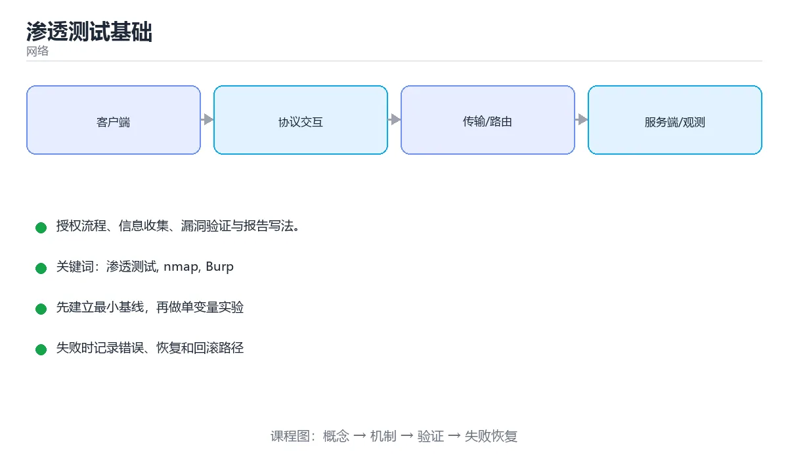

# 渗透测试基础



> 内容更新时间：2026-10-03 · 学习阶段：入门 · 预计用时：15 分钟

## 学习目标

- 能用自己的话解释「渗透测试基础」解决了什么问题，而不是只背术语。
- 能说清 「渗透测试」、「nmap」、「Burp」、「漏洞验证」 之间的关系，并分别举出一个例子。
- 能把本课知识放回「网络」的知识体系，说明它和相邻主题的边界。
- 能完成本课练习，并用验收标准检查自己的结果。

> 一句话摘要：授权流程、信息收集、漏洞验证与报告写法。

## 前置知识

- 先完成上一课《认证与授权》；如果已经掌握，可以直接用本课练习自测。
- 本课阶段：入门。只需要基本计算机操作，不要求编程经验。
- 开始前先复习：渗透测试、nmap、Burp。
- 如果某一步看不懂，先记录具体卡点，完成练习后再回头读一遍。


## 授权与流程

渗透测试的第一步不是技术，而是**书面授权**：明确测试范围（域名/IP/接口）、时间窗口、允许的手段（是否可 DoS、是否可社工）、联系人。未经授权测试他人系统属于违法行为。

标准流程：信息收集 → 漏洞扫描 → 手工验证 → 权限提升/横向移动（若授权）→ 整理报告 → 复测确认修复。每一步都要留存证据（时间戳、请求响应、截图）。

## 信息收集要点

| 目标 | 手段 |
| --- | --- |
| 子域名 | 证书透明度日志、DNS 枚举、被动扫描 |
| 技术栈 | 响应头、错误页、Cookie 名称、JS 中的接口路径 |
| 暴露面 | 端口扫描、目录爆破、GitHub 泄露的密钥 |
| 历史信息 | Wayback、搜索引擎缓存、泄露的数据库样本 |

## 常见漏洞的验证方法

| 漏洞 | 验证方式 | 修复要点 |
| --- | --- | --- |
| SQL 注入 | 在参数中插入 `'` 观察报错与布尔差异 | 参数化查询 |
| XSS | 注入 `<script>` 或属性逃逸载荷，看是否执行 | 输出转义 + CSP |
| 越权 | 用 A 的 Token 访问 B 的资源 ID | 服务端资源级鉴权 |
| SSRF | 传内网地址或云元数据地址观察响应 | 出站白名单 + 禁跳转 |
| 文件上传 | 上传畸形扩展名与图片马 | 类型白名单 + 存储分离 |
| 弱口令 | 在限速范围内尝试常见口令 | 强口令策略 + 多因素 |

## 工具与边界

常用工具：nmap（端口与服务识别）、Burp Suite（代理与改包）、sqlmap（SQL 注入验证）、dirsearch（目录发现）、nuclei（模板化扫描）。工具只是辅助，**真正有价值的是逻辑漏洞与业务缺陷**，那部分必须靠手工分析与业务理解。

## 报告写法

每个漏洞包含：标题、风险等级（CVSS 思路：可利用性 × 影响）、复现步骤（含请求响应）、影响说明（能拿到什么数据/权限）、修复建议、参考链接。**优先级按业务影响排序，而不是按技术炫技程度**。

## 本课小结
渗透测试的核心是**在授权范围内、用可复现的证据证明风险**：先信息收集缩小范围，再逐项验证漏洞，最后给出按业务影响排序的修复建议。


## 阶段速查

| 阶段 | 目标 | 常用手段 |
| --- | --- | --- |
| 授权与范围 | 明确可测范围与时间窗 | 书面授权、测试账户、应急联系人 |
| 信息收集 | 摸清资产与指纹 | DNS 枚举、端口扫描、目录探测 |
| 漏洞发现 | 找到可利用缺陷 | 手工测试、扫描器、代码审计 |
| 漏洞利用 | 验证危害（在允许范围内） | 最小必要利用，避免破坏数据 |
| 提权与横向 | 评估影响面 | 权限提升、凭证复用 |
| 清理与报告 | 复原环境并交付结论 | 删除测试账号与文件、出具报告 |

## 常见漏洞验证速查

| 漏洞 | 验证要点 | 注意 |
| --- | --- | --- |
| SQL 注入 | 布尔盲注、时间盲注、报错回显 | 用测试库，避免大批量数据导出 |
| XSS | 反射、存储、DOM 型 | 用无害弹窗证明，不窃取真实会话 |
| 越权 | 换 ID 访问他人资源 | 用两个测试账号互测 |
| 文件上传 | 后缀绕过、内容检测 | 上传无害文件并立即清理 |
| SSRF | 访问内网与元数据地址 | 只验证可达性，不读取敏感数据 |
| 弱口令 | 小字典 + 限速 | 避免锁定真实账号 |
| 目录遍历 | `../` 变体探测 | 限定深度，不下载业务数据 |
| 反序列化 | 结构探测与回显判断 | 高风险操作需事先批准 |

```python
from dataclasses import dataclass, field

@dataclass
class Finding:
    title: str
    severity: str
    cvss: float
    asset: str
    evidence: str
    impact: str
    remediation: str
    references: list = field(default_factory=list)

    def priority(self) -> int:
        """按 CVSS 与资产重要性给出处置优先级。"""
        weight = {"核心": 1.0, "重要": 0.7, "一般": 0.4}.get(self.asset, 0.4)
        return int(self.cvss * weight * 10)


def summarize(findings: list) -> dict:
    """汇总报告：按严重程度统计并给出排序后的清单。"""
    counts = {}
    for item in findings:
        counts[item.severity] = counts.get(item.severity, 0) + 1
    ordered = sorted(findings, key=lambda f: f.priority(), reverse=True)
    return {
        "counts": counts,
        "top3": [f.title for f in ordered[:3]],
        "total": len(findings),
    }


sample = [
    Finding("订单详情越权", "高", 8.1, "核心", "换 ID 可读他人订单", "用户数据泄漏", "校验资源归属"),
    Finding("登录无限速", "中", 5.3, "重要", "900 次/分钟未拦截", "可暴力破解", "加限速与多因素"),
]
print(summarize(sample))
```

## 常见错误对照表

| 容易踩的做法 | 实际现象 | 原因与正确做法 |
| --- | --- | --- |
| 未获授权就测试 | 法律风险 | 先拿到书面授权与范围 |
| 使用生产数据做验证 | 泄漏与破坏 | 用测试账号与测试数据 |
| 只依赖扫描器 | 漏掉业务逻辑漏洞 | 结合手工测试与代码审计 |
| 不记录复现步骤 | 开发无法修复 | 提供请求、响应与截图 |
| 报告不分优先级 | 关键问题被淹没 | 按危害与资产重要性排序 |
| 利用过程破坏数据 | 影响业务 | 最小必要验证，避免写操作 |
| 测试后不清理 | 遗留后门账号 | 删除测试账号、文件与配置 |
| 只报漏洞不给修复建议 | 修复成本高 | 给出具体可执行方案 |
| 忽略业务逻辑漏洞 | 越权与刷单留存 | 结合业务流程设计用例 |
| 不做复测 | 修复是否有效未知 | 交付后安排复测并出结论 |

## 自测清单

- [ ] 测试前有书面授权与明确范围。
- [ ] 使用测试账号与数据，不触碰真实用户数据。
- [ ] 每个发现都含复现步骤与证据。
- [ ] 报告按危害与资产重要性排序并给出修复建议。
- [ ] 测试结束清理痕迹并安排复测。

## 动手练习


> 本课练习重点：围绕「渗透测试、nmap、Burp」完成复述、实验和交付，每个结果都要能被别人检查。

先抓一次真实请求或画出协议交互，再注入延迟或丢包，最后解释每层变化。

### 练习 1：建立心智模型（10 分钟）

合上教程，用 3～5 句话回答：

1. 「渗透测试基础」解决了什么问题？
2. 如果没有它，会出现什么具体后果？
3. 它和「nmap」是什么关系？

**验收标准**：至少出现一个本课关键词，并写出一个反例、边界条件或失效场景。

### 练习 2：做一次可控实验（20 分钟）

从正文中选一个最小示例，完成以下操作：

1. 先预测修改一个参数、输入或步骤后的结果。
2. 再实际执行或逐步推演，记录真实结果。
3. 如果结果与预测不同，写出差异原因。

**验收标准**：留下「原例 → 改动 → 预测 → 结果 → 原因」五步记录。

### 练习 3：交付一个小结果（30 分钟）

画出一张报文或时序图，标出每一跳的地址、协议、状态和可能失败点。

任务要求：

- 结果必须能被别人检查，不能只写“我已经理解了”。
- 至少覆盖「渗透测试」和「nmap」两个关键词。
- 写出 1 个仍然不确定的问题，以及下一步如何验证。

> 提示：时间有限时优先做练习 1 和练习 2；练习 3 可以拆成两次完成。


## 深入补充：渗透测试基础

前面已经建立了基本概念。这一节换一个角度，把「渗透测试基础」放进真实工程里，
重点回答三件事：它为什么存在、内部如何运转、什么时候会失效。

### 一、核心模型

渗透测试是在授权范围内，用攻击者视角验证系统安全控制是否有效；完整流程包括范围确认、信息收集、漏洞验证、影响证明、风险评级和修复复测。

```text
授权与范围 → 信息收集 → 资产与暴露面 → 漏洞验证 → 影响证明 → 风险报告 → 修复 → 复测关闭
```

### 二、关键机制拆解

1. 授权文件必须写清目标、时间窗口、允许的技术、禁止的操作和紧急联系人。
2. 信息收集包括域名、子域、端口、服务版本、公开仓库、证书和员工信息，但不能越过授权边界。
3. 漏洞验证要最小化影响，优先使用只读证明，避免下载真实数据或破坏生产环境。
4. 风险评级同时考虑利用难度、影响范围、数据敏感度和业务关键性。
5. 报告必须让开发和运维能复现问题、理解影响并完成修复，而不是只丢一个工具截图。
6. 修复后要复测原漏洞，并检查同类问题和其他入口是否仍然存在。
7. 渗透测试不能替代安全开发流程、代码审计和持续监控。

### 三、对照表：抓住容易混淆的边界

| 维度 | 一侧 | 另一侧 |
| --- | --- | --- |
| 漏洞扫描 | 自动化发现已知问题 | 覆盖广但误报和漏报多 |
| 渗透测试 | 人工验证利用链和影响 | 更深入但依赖范围与时间 |
| 红队演练 | 模拟真实攻击者长期对抗 | 目标更偏检测与响应能力 |
| 安全审计 | 检查流程、配置和代码 | 偏合规与系统性改进 |

### 四、工作示例

发现测试环境泄露了云密钥。正确做法是立即停止进一步使用，记录最小证据，通知资产负责人轮换密钥，检查访问日志和影响范围；修复后再验证旧密钥失效且没有其他泄露路径。

### 五、常见误区与失效边界

| 错误做法或假设 | 后果 | 正确做法 |
| --- | --- | --- |
| 没有书面授权就开始测试 | 可能触犯法律并影响业务 | 先确认授权、范围和紧急停止机制 |
| 直接下载或修改真实数据 | 造成隐私泄露或生产事故 | 使用最小证据和只读验证 |
| 只报工具输出的高危 | 误报多且无法修复 | 人工验证利用条件和实际影响 |
| 修复后不做复测 | 同类问题仍然存在 | 复测原漏洞并检查横向入口 |

### 六、场景推演

对一个 Web 系统做授权测试，先确认测试账号和排除目标；发现越权读取接口后，用两个测试账号证明数据隔离失效，但不上传恶意文件；报告中给出请求、响应、影响和最小修复建议，并复测权限校验。

### 七、自测问答

**Q1：渗透测试开始前最重要的东西是什么？**

明确授权和范围，包括目标、时间、禁用操作和紧急联系人。

**Q2：漏洞验证为什么要最小化影响？**

证明风险的同时不能破坏生产、泄露数据或影响用户。

**Q3：风险评级需要考虑什么？**

利用难度、影响范围、数据敏感度、业务重要性和现有控制。

**Q4：为什么渗透测试不能替代 SDL？**

它是一次性验证，持续安全还需要设计、编码、依赖和监控治理。

### 八、小项目：把知识变成可检查的产出

为一个本地靶场写授权测试计划：目标、范围、时间窗口、禁止事项、信息收集清单、三个验证场景、证据格式、风险评级和复测标准。

### 九、适用边界

渗透测试只在授权范围内使用，不能用于未授权系统。它验证的是某个时间点的安全状态，不等于系统永久安全，也不覆盖所有业务逻辑和供应链风险。

### 十、完成检查清单

- [ ] 能写清授权和测试范围
- [ ] 能进行合规的信息收集
- [ ] 能用最小影响证明漏洞
- [ ] 能写出可修复的风险报告
- [ ] 能完成复测和同类问题检查

### 十一、复习顺序

1. 先不看资料复述“核心模型”，确认能说出它解决的三个问题。
2. 再对照表逐行解释容易混淆的概念，每个概念补一个反例。
3. 跟着工作示例做一遍，改变一个条件并预测结果。
4. 用自测问答检查理解，错题回到对应小节重新阅读。
5. 最后完成小项目，把结果、失败记录和复查清单整理成一份可提交产物。

> 复习不是重读一遍，而是离开原文重新产出：复述、改写、验证、复盘。


## 考点精讲：把测验题还原成判断过程

本课有 5 个判断点。先自己作答，再看「判断依据」；如果结论正确但理由不完整，回到正文对应章节补足概念。

### 考点 1：渗透测试开始前最重要的一步是？

- **正确判断**：取得书面授权并明确范围
- **判断依据**：未经授权测试他人系统属于违法行为，范围与手段必须书面确认。其他选项：开始前最重要的一步是取得书面授权并明确范围。端口扫描与子域收集都应在授权之后进行。正确项「取得书面授权并明确范围」抓住了题干的核心条件，是经得起边界检验的表述。错误项「扫描端口」与课程给出的定义相冲突，不能回答题目所问。错误项「收集子域名」只看到了表面现象，没有解释题干真正考查的机制。错误项「尝试弱口令」在边界或失败路径上会得出错误结果。把题干「渗透测试开始前最重要的一步是？」放回《渗透测试基础》的「授权流程、信息收集、漏洞验证与报告写法」语境，逐项对照定义与边界条件，就能排除其余说法。
- **迁移检查**：把题干里的一个条件换成边界值，原来的结论还成立吗？写出判断过程。

### 考点 2：下面哪项验证 SQL 注入最有效？

- **正确判断**：在参数中插入单引号观察报错与布尔差异
- **判断依据**：通过可控载荷观察响应差异，既能验证又不会破坏数据。其他选项：在参数中插入单引号并观察报错或布尔差异是验证注入的有效方式。暴力破解与直接删库都不属于验证手段。正确项「在参数中插入单引号观察报错与布尔差异」正面回答了题目所问，符合课程给出的定义与适用范围。错误项「暴力破解管理员密码（仅部分场景成立）」与课程给出的定义相冲突，不能回答题目所问。错误项「扫描端口」只看到了表面现象，没有解释题干真正考查的机制。把题干「下面哪项验证 SQL 注入最有效？」放回《渗透测试基础》的「授权流程、信息收集、漏洞验证与报告写法」语境，逐项对照定义与边界条件，就能排除其余说法。
- **迁移检查**：把题干里的一个条件换成边界值，原来的结论还成立吗？写出判断过程。

### 考点 3：渗透报告中的优先级应依据什么排序？

- **正确判断**：业务影响与可利用性
- **判断依据**：按风险而非技术难度排序，才能让修复资源投到最该修的地方。其他选项：报告优先级应依据业务影响与可利用性排序，而不是发现时间或技术的炫酷程度。正确项「业务影响与可利用性」完整覆盖了题目要求的关键点，没有遗漏前提。错误项「工具提示顺序」适用于其他场景，但与本题的前提不匹配。错误项「漏洞技术的炫酷程度」把因果关系颠倒了，不能作为正确结论。把题干「渗透报告中的优先级应依据什么排序？」放回《渗透测试基础》的「授权流程、信息收集、漏洞验证与报告写法」语境，逐项对照定义与边界条件，就能排除其余说法。
- **迁移检查**：如果给某个错误选项去掉一个限定词，它会不会变成正确？说明理由。

### 考点 4：黑盒、白盒、灰盒测试的区别是？

- **正确判断**：按测试者掌握的内部信息多少区分：无
- **判断依据**：黑盒模拟真实攻击者，白盒效率最高，灰盒兼顾成本与覆盖率。其他选项：黑盒、白盒、灰盒按测试者掌握的内部信息多少区分（无、完全、部分），与工具类型和语言无关。两者的关键区别是：按测试者掌握的内部信息多少区分：无 直接描述了定义差异。正确项「按测试者掌握的内部信息多少区分：无」抓住了题干的核心条件，是经得起边界检验的表述。错误项「按被测系统的语言区分」把不同概念混在一起，缺少题干限定的前提。错误项「它们完全相同」与课程给出的定义相冲突，不能回答题目所问。错误项「按工具类型区分」在边界或失败路径上会得出错误结果。把题干「黑盒、白盒、灰盒测试的区别是？」放回《渗透测试基础》的「授权流程、信息收集、漏洞验证与报告写法」语境，逐项对照定义与边界条件，就能排除其余说法。
- **迁移检查**：把题干里的一个条件换成边界值，原来的结论还成立吗？写出判断过程。

### 考点 5：CVSS 评分的作用是？

- **正确判断**：用统一维度（可利用性、影响）量化漏洞严重程度，便于排序与沟通
- **判断依据**：评分只是参考，实际优先级还要结合资产重要性与已有防护措施。其他选项：CVSS 用统一维度量化漏洞严重程度以便排序与沟通。它不检测漏洞，也不能替代安全评审或自动修复。正确项「用统一维度（可利用性、影响）量化漏洞严重程度，便于排序与沟通」与题干要求一致，是本课知识点的准确定义。错误项「检测漏洞是否存在（混淆了相邻概念，不能回答本题）」属于相邻主题的说法，范围与本题要求不一致。错误项「自动修复漏洞」与课程给出的定义相冲突，不能回答题目所问。把题干「CVSS 评分的作用是？」放回《渗透测试基础》的「授权流程、信息收集、漏洞验证与报告写法」语境，逐项对照定义与边界条件，就能排除其余说法。
- **迁移检查**：把题干里的一个条件换成边界值，原来的结论还成立吗？写出判断过程。

## 本课复习清单

离开本课前，逐项确认：

- [ ] 不看解析，能说出「渗透测试开始前最重要的一步是？」的判断依据。
- [ ] 不看解析，能说出「下面哪项验证 SQL 注入最有效？」的判断依据。
- [ ] 不看解析，能说出「渗透报告中的优先级应依据什么排序？」的判断依据。
- [ ] 不看解析，能说出「黑盒、白盒、灰盒测试的区别是？」的判断依据。
- [ ] 不看解析，能说出「CVSS 评分的作用是？」的判断依据。
- [ ] 至少运行一次本课示例，记录输入、输出和一个边界情况。
- [ ] 把本课最容易混淆的两个概念写成一句话对照。

| 复盘项 | 记录 |
| --- | --- |
| 已经能独立解释的考点 |  |
| 仍然说不清的概念 |  |
| 下一步验证动作 |  |

## English Overview

**Title:** Penetration Testing

**Summary:** Authorization, recon, validation and reporting.

**Category:** Networking  
**Level:** 入门  
**Key terms:** 渗透测试, nmap, Burp, 漏洞验证, CVSS

> The full tutorial is written in Chinese. This bilingual overview helps English readers identify the topic, scope and key terms before studying the detailed examples.

## 内容元数据

- 内容版本：v2.0
- 最后更新：2026-10-03
- 学习阶段：入门
- 适用环境：TCP/IP、HTTP/2、HTTP/3 与现代网络栈
- 内容来源：内置结构化课程与工程实践整理
- 相关主题：渗透测试、nmap、Burp、漏洞验证、CVSS
- 质量版本：P0 测验标准 + P1 覆盖扩展 + P2 体验补全


## 参考资料与复核

- 最后复核：2026-10-04
- 下次复核：2027-04-04
- 复核范围：版本兼容、API 行为、安全建议与工程实践
- 来源性质：官方文档与标准；本课正文为离线教学重组，不复制原文

| 参考资料 | 本课用途 |
| --- | --- |
| [RFC Editor](https://www.rfc-editor.org/) | 互联网协议标准 |
| [MDN HTTP](https://developer.mozilla.org/docs/Web/HTTP) | HTTP 语义与浏览器行为 |

> 本课主题：授权流程、信息收集、漏洞验证与报告写法。

> App 完全离线展示文字链接，不会自动联网；需要延伸阅读时可复制链接到浏览器。

