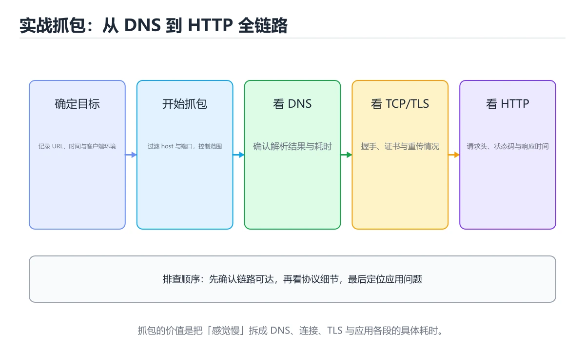
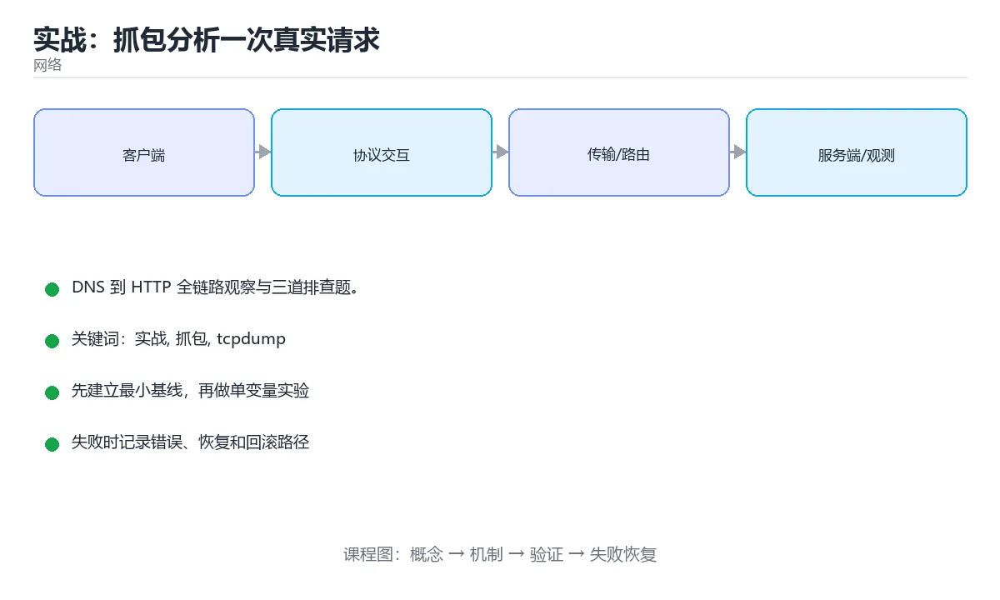

# 实战：抓包分析一次真实请求

> 内容更新时间：2026-10-06 · 学习阶段：进阶 · 预计用时：60 分钟





## 学习目标

- 能用自己的话解释实战：抓包分析一次真实请求解决了什么问题，而不是只背术语。
- 能说清 「实战」、「抓包」、「tcpdump」、「openssl」 之间的关系，并分别举出一个例子。
- 能把 实战 放回「实战：抓包分析一次真实请求」的知识体系，说明它和 抓包 的边界。
- 能完成本课练习，并用验收标准检查自己的结果。

> 一句话摘要：DNS 到 HTTP 全链路观察与三道排查题。

## 前置知识

- 先完成上一课《Web 安全攻防》；如果已经掌握，可以直接用本课练习自测。
- 开始前先复习：实战、抓包、tcpdump。
- 如果 目标 这一步看不懂，先记录具体卡点，再用 time_starttransfer 复现一遍。

## 目标

从输入 URL 到页面返回，用工具把 DNS → TCP → TLS → HTTP 每一层都看清楚，并学会用它排查故障。

## 分步观察

| 阶段 | 工具 | 关键观察 |
| --- | --- | --- |
| DNS | `dig example.com +trace`、`nslookup` | 递归查询过程、A/AAAA 记录、TTL |
| TCP 握手 | `tcpdump -i any port 443 -nn` | SYN / SYN+ACK / ACK 三次握手与端口 |
| TLS 握手 | `openssl s_client -connect example.com:443 -servername example.com` | 证书链、协议版本、密码套件 |
| HTTP 交互 | `curl -vI https://example.com`、浏览器 Network 面板 | 请求头/响应头、状态码、缓存命中、HTTP 版本 |
| 路径质量 | `mtr example.com`、`traceroute` | 每跳延迟与丢包 |

## 三道排查题

1. **网站打不开**：先 `dig` 看解析，再 `curl -v` 看是连接失败、TLS 失败还是 HTTP 错误码；若超时用 `mtr` 定位是本地、出口还是目标侧。
2. **偶发慢**：在服务端用 `tcpdump` 抓包，看是否有重传（同一序号多次发送）与零窗口；重传多说明链路质量差或 MTU 有问题。
3. **只在大文件时失败**：怀疑 MTU/分片，用 `ping -M do -s 1472` 探测路径 MTU，或看是否被中间设备丢弃大包。

## 常见错误与排查

1. 抓包没加 `-s 0` 导致内容被截断；没加 `-nn` 导致解析慢。
2. 在容器里抓不到宿主网卡流量（需 `--net=host` 或抓 `eth0`）。
3. 把 DNS 缓存当成本次解析结果，误判解析耗时。
4. 忽略代理/CDN：拿到的 IP 可能只是边缘节点。
| 容易踩的做法 | 实际现象 | 原因与正确做法 |
| --- | --- | --- |
| 只在一端抓包 | 无法区分是发不出去还是没收到 | 客户端与服务端同时抓包 |
| 抓包无时间戳对照 | 无法对齐日志 | 记录开始时间与请求 ID |
| 抓全量流量 | 文件巨大、分析困难 | 用过滤器限定主机与端口 |
| 只看平均耗时 | 长尾被掩盖 | 结合 P95 与慢请求样本 |
| 直接在生产长时间抓包 | 影响性能与隐私 | 限定时长与大小，注意脱敏 |
| 忽略 DNS 与 TLS 耗时 | 误判为服务端慢 | 用 `curl -w` 分解 |
| 只看 HTTP 不看 TCP | 漏掉重传与 RST | 结合 TCP 分析过滤器 |
| 结论没有证据 | 无法复现与验证 | 附上包序号与时间线 |
| 忽略中间代理 | 认为链路是直连 | 检查代理与网关配置 |
| 排查后不沉淀 | 同类问题重复排查 | 写成 runbook 与自动诊断脚本 |

## 交付物

一份抓包分析报告：含时间线（DNS 耗时、握手耗时、首字节时间）、关键包截图、以及**至少一个真实故障的定位过程**。

## 交付物与评分标准

**交付物**：一份抓包分析报告，含时间线（DNS/握手/首字节各段耗时）、关键包截图、以及至少一个真实故障的定位过程与结论。

**评分标准**：分层清晰 30%（能区分解析/传输/应用层问题）、证据充分 30%（每条结论对应具体包或命令输出）、定位准确 25%（能给出可执行的修复建议）、记录规范 15%（时间戳、命令、环境齐全）。

**常见失败案例**：① 只贴 tcpdump 原始输出不做解读；② 把 DNS 缓存命中的耗时当作真实解析耗时；③ 抓包时未加 `-s 0` 导致内容截断却据此下结论；④ 混淆「连接超时」与「服务拒绝」（前者无响应、后者返回 RST）。

## 本课小结

网络排障的顺序是**自下而上**：解析 → 连通 → 握手 → 应用协议；掌握抓包与分层工具，就能把"打不开""很慢"变成具体结论。

## 抓包分析流程速查

| 步骤 | 动作 | 命令 |
| --- | --- | --- |
| 1 复现 | 记录时间点与请求特征 | 保存请求 ID、URL、用户标识 |
| 2 分层观测 | DNS、TCP、TLS、HTTP 各耗时多少 | `curl -w` 分解耗时 |
| 3 抓包 | 同时抓客户端与服务端 | `tcpdump -i any -w a.pcap` |
| 4 分析 | 看握手、重传、RST、状态码 | Wireshark 过滤器 |
| 5 结论 | 定位到具体环节并给出证据 | 时间线 + 关键包编号 |

```bash
# 一、耗时分解：DNS、连接、TLS、首字节、总时间
curl -o /dev/null -s -w \
  'dns=%{time_namelookup} connect=%{time_connect} tls=%{time_appconnect} ttfb=%{time_starttransfer} total=%{time_total}\n' \
  https://example.com/api/health

# 二、DNS 与路由
dig +stats example.com
mtr -n -c 20 example.com

# 三、抓包（含轮转，避免写满磁盘）
tcpdump -i any -s 0 -w /tmp/cap.pcap -C 100 -W 5 'tcp port 443'

# 四、Wireshark 常用过滤器
# http.request or http.response                   只看 HTTP 请求与响应
# tcp.analysis.retransmission                     只看重传
# tcp.flags.reset == 1                            只看 RST
# tls.handshake.type == 1 or tls.handshake.type == 2   ClientHello / ServerHello
# ip.addr == 10.0.0.5 and tcp.port == 443         指定主机与端口
# frame.time_delta_displayed > 1                  看相邻包间隔超过 1 秒

# 五、统计与提取
tshark -r /tmp/cap.pcap -q -z io,stat,1 | head      # 每秒流量统计
tshark -r /tmp/cap.pcap -Y 'http.response.code >= 500' -T fields -e http.response.code
```

```python
import subprocess
from dataclasses import dataclass

@dataclass
class Timing:
    dns: float
    connect: float
    tls: float
    ttfb: float
    total: float

    def breakdown(self) -> dict:
        """把 curl 的累计耗时换算成各阶段增量。"""
        return {
            "dns": round(self.dns, 4),
            "tcp": round(self.connect - self.dns, 4),
            "tls": round(self.tls - self.connect, 4),
            "server_wait": round(self.ttfb - self.tls, 4),
            "download": round(self.total - self.ttfb, 4),
        }

    def bottleneck(self) -> str:
        parts = self.breakdown()
        return max(parts, key=parts.get)

FORMAT = (
    'dns=%{time_namelookup} connect=%{time_connect} '
    'tls=%{time_appconnect} ttfb=%{time_starttransfer} total=%{time_total}'
)

def measure(url: str) -> Timing:
    result = subprocess.run(
        ["curl", "-o", "/dev/null", "-s", "-w", FORMAT, url],
        capture_output=True, text=True, timeout=30,
    )
    values = dict(item.split("=") for item in result.stdout.split())
    return Timing(**{key: float(value) for key, value in values.items()})

timing = measure("https://example.com")
print(timing.breakdown(), "瓶颈：", timing.bottleneck())
```

## 常见现象与原因速查

| 现象 | 常见原因 | 验证方式 |
| --- | --- | --- |
| 首次慢、后续快 | DNS 或连接未复用 | 对比 `time_namelookup` 与连接复用 |
| 部分地区慢 | 路由绕行或 CDN 未覆盖 | 多地 `mtr` 与 CDN 命中率 |
| 偶发超时 | 丢包重传、连接池耗尽 | 看重传率与连接池指标 |
| 大文件传输中断 | 中间设备空闲超时 | 抓包看 FIN/RST 时间点 |
| TLS 握手慢 | 证书链大、算法协商慢 | 看握手包数量与证书大小 |
| 502 与 504 | 上游崩溃或超时 | 查网关日志与上游耗时 |
| 请求重复 | 客户端或网关重试 | 用请求 ID 去重统计 |
| 内容不一致 | 缓存与回源版本不同 | 看 `X-Cache-Status` 与 Age |

## 复习与自测

- [ ] 会用 `curl -w` 分解 DNS、TCP、TLS、TTFB 耗时。
- [ ] 能同时抓客户端与服务端并做时间线对照。
- [ ] 熟悉 Wireshark 的重传、RST、握手过滤器。
- [ ] 结论有包级证据与复现步骤。
- [ ] 排查过程沉淀为可复用脚本。

## 动手练习

> 本课练习重点：围绕「实战、抓包、tcpdump」完成复述、实验和交付，每个结果都要能被别人检查。

先抓一次真实请求或画出 实战 的协议交互，再注入延迟或丢包并解释变化。

### 练习 1：建立心智模型（10 分钟）

合上教程，用 3～5 句话回答：

1. 实战：抓包分析一次真实请求解决了什么问题？
2. 如果没有它，会出现什么具体后果？
3. 它和「抓包」是什么关系？

验收标准：用自己的话解释 实战，并给出一个它不成立的反例。

### 练习 2：做一次可控实验（20 分钟）

从正文中选一个最小示例，完成以下操作：

1. 先预测修改一个参数、输入或步骤后的结果。
2. 再实际执行或逐步推演，记录真实结果。
3. 如果结果与预测不同，写出差异原因。

**验收标准**：先原样跑通正文里的 `time_starttransfer`，再只改实战相关的输入，按「原例 → 改动 → 预测 → 结果 → 原因」记录；预测必须写在实际运行之前。

### 练习 3：交付一个小结果（30 分钟）

为 time_starttransfer 画出交互时序，标出重传、超时与降级可能发生的位置。

任务要求：

- 结果必须能被别人检查，不能只写“我已经理解了”。
- 至少覆盖「实战」和「抓包」两个关键词。
- 写出 1 个仍然不确定的问题，以及下一步如何验证。

> 提示：时间有限时优先做练习 1 和练习 2；练习 3 可以拆成两次完成。

## 验证命令与预期输出

实战 的交付物要能用固定命令复现；下表是本项目的最低验证集：

| 阶段 | 命令 | 预期输出 |
| --- | --- | --- |
| 安装依赖 | `python -m pip install -r requirements.txt` | 依赖安装完成，没有版本冲突 |
| 语法检查 | `python -m compileall .` | 所有模块编译通过 |
| 运行测试 | `python -m pytest -q` | 测试全部通过，失败用例数为 0 |
| 启动示例 | `python main.py` | 服务启动并输出监听地址 |

### 验收证据

- [ ] 保存依赖安装和启动命令的完整输出。
- [ ] 至少运行 3 条 实战 相关测试，其中一条是非法输入或失败路径。
- [ ] 连续两次触发 抓包，检查数据与计数是否被重复累加。
- [ ] 记录一次失败状态码、错误日志和恢复步骤。
- [ ] 记录 time_starttransfer 的运行环境与复现命令，并补一段回滚说明。

### 回归与回滚

1. 用临时环境验证 time_starttransfer，确认无误后再对真实数据执行。
2. 修改一处逻辑后重跑全部验证命令，确认没有回归。
3. 若失败，回滚到上一个可运行版本并保留失败日志。
4. 定位原因后补一条自动化测试，再重新执行发布流程。
5. 把教训写入项目复盘或本课笔记，形成下一次的检查项。

## 可运行练习

### 任务 1：先跑通，再解释

```python
import subprocess
from dataclasses import dataclass

@dataclass
class Timing:
    dns: float
    connect: float
    tls: float
    ttfb: float
    total: float

    def breakdown(self) -> dict:
        """把 curl 的累计耗时换算成各阶段增量。"""
        return {
            "dns": round(self.dns, 4),
            "tcp": round(self.connect - self.dns, 4),
            "tls": round(self.tls - self.connect, 4),
            "server_wait": round(self.ttfb - self.tls, 4),
            "download": round(self.total - self.ttfb, 4),
        }

    def bottleneck(self) -> str:
        parts = self.breakdown()
        return max(parts, key=parts.get)

FORMAT = (
    'dns=%{time_namelookup} connect=%{time_connect} '
    'tls=%{time_appconnect} ttfb=%{time_starttransfer} total=%{time_total}'
)

def measure(url: str) -> Timing:
    result = subprocess.run(
        ["curl", "-o", "/dev/null", "-s", "-w", FORMAT, url],
        capture_output=True, text=True, timeout=30,
    )
    values = dict(item.split("=") for item in result.stdout.split())
    return Timing(**{key: float(value) for key, value in values.items()})

timing = measure("https://example.com")
print(timing.breakdown(), "瓶颈：", timing.bottleneck())
```

### 任务 2：只改一个条件

把「实战：抓包分析一次真实请求」的最小示例复制一份，只改一个条件再跑一次：

- 改动点：只调整 time_starttransfer 的一个参数，其余条件一律不动。
- 预测：先写下「实战：抓包分析一次真实请求」在改动后的输出或错误信息，再运行。
- 记录：对照改动前后的结果，指出差异出在哪一步。
- 验收：换回原条件能复现原结果，改动只影响实战。

### 任务 3：迁移到自己的数据

把 time_starttransfer 换成你自己的输入，先保持步骤不变，再比较输出差异。

## 故障现场

### 现场 1：只在一端抓包

**症状**：在《实战：抓包分析一次真实请求》的复现场景中，无法区分是发不出去还是没收到。

**根因**：当出现“只在一端抓包”时，执行路径已经绕过了《实战：抓包分析一次真实请求》的关键约束，最终以“无法区分是发不出去还是没收到”暴露出来；修复前必须先确认约束在哪里失效。

**修复**：针对《实战：抓包分析一次真实请求》的问题，客户端与服务端同时抓包。

**验证**：保留《实战：抓包分析一次真实请求》里触发“无法区分是发不出去还是没收到”的输入、版本和日志，按“客户端与服务端同时抓包”完成修改后原样重放；只有失败现象消失且相邻场景仍可解释，才保留改动。

### 现场 2：抓包无时间戳对照

**症状**：在《实战：抓包分析一次真实请求》的复现场景中，无法对齐日志。

**根因**：当出现“抓包无时间戳对照”时，执行路径已经绕过了《实战：抓包分析一次真实请求》的关键约束，最终以“无法对齐日志”暴露出来；修复前必须先确认约束在哪里失效。

**修复**：针对《实战：抓包分析一次真实请求》的问题，记录开始时间与请求 ID。

**验证**：在《实战：抓包分析一次真实请求》中按“记录开始时间与请求 ID”调整后，从“抓包无时间戳对照”的触发条件重放同一条路径，确认“无法对齐日志”不再出现，并补一个相邻边界用例检查没有引入新问题。

### 现场 3：直接在生产长时间抓包

**症状**：在《实战：抓包分析一次真实请求》的复现场景中，影响性能与隐私。

**根因**：触发点是把“直接在生产长时间抓包”当成安全做法。它没有满足《实战：抓包分析一次真实请求》要求的前提，因此先表现为“影响性能与隐私”；排查时先完整复现这一段，再核对输入、配置与依赖。

**修复**：针对《实战：抓包分析一次真实请求》的问题，限定时长与大小，注意脱敏。

**验证**：先在《实战：抓包分析一次真实请求》中记录“直接在生产长时间抓包”留下的失败证据，再执行“限定时长与大小，注意脱敏”并重放；确认错误路径变为明确结果，且修复没有掩盖同类故障。

## 深入补充：实战：抓包分析一次真实请求 的取舍与边界

### 一、把概念放回真实约束

学习实战：抓包分析一次真实请求时，最容易只记住结论而忽略前提。先写出三个约束：数据规模、时间预算、可接受的失败方式；再判断 实战 与 抓包 在这些约束下是否仍然成立。只要约束改变，原来的最优解就可能变成错误解。

| 场景 | 协议或方案 | 延迟与可靠性 | 排障入口 |
| --- | --- | --- | --- |
| 强一致请求 | TCP / HTTP | 可靠但可能队头阻塞 | 连接与重传指标 |
| 实时音视频 | UDP / QUIC | 低延迟但允许丢包 | 抖动与丢包率 |
| 大规模分发 | CDN 与缓存 | 就近命中 | 命中率与回源 |
| 服务间调用 | RPC 或消息队列 | 取决于确认机制 | 超时、重试与幂等 |

### 二、三个容易混淆的边界

1. 澄清输入与目标。先写清「实战：抓包分析一次真实请求」要解决的问题、合法输入范围和成功标准，再进入后续步骤。
2. **把“平均值”当成“全部”**：实战 的指标好看，不代表尾部请求、冷启动或失败重试也好看。
3. **把“当前版本”当成“永久行为”**：抓包 依赖的默认值、API 或性能特征都可能随版本变化，需要固定版本并保留回归用例。

### 三、一个生产场景

假设团队要在真实系统里使用实战：抓包分析一次真实请求：第一周先做小流量验证，记录 实战 的基线与异常；第二周扩大输入规模，观察 抓包 是否成为瓶颈；第三周再做故障演练，主动注入超时、重复请求和依赖不可用，确认系统能降级、能重试、能恢复。每一步都要留下指标、日志和结论，而不是只留下“感觉更快了”。

### 四、自测清单

- 能否用一句话说出实战：抓包分析一次真实请求解决的核心问题与不适用场景？
- 能否画出 实战 的数据流或状态变化，并标出失败路径？
- 能否给出一个反例，证明 实战 的结论在边界条件下不成立？
- 能否写出一条可复现的验证命令，让别人独立得到相同结论？

## 本课复习清单

离开本课前，逐项确认：

- [ ] 不看解析，能说出「追踪 DNS 递归查询过程用？」的判断依据。
- [ ] 不看解析，能说出「检查 TLS 证书链与协议版本用？」的判断依据。
- [ ] 不看解析，能说出「请求偶发变慢，抓包时首先关注？」的判断依据。
- [ ] 不看解析，能说出「curl -w 参数在排查接口耗时时的作用是？」的判断依据。
- [ ] 不看解析，能说出「tcpdump 的 -w 参数作用是？」的判断依据。
- [ ] 至少运行一次 time_starttransfer 的示例，记录输入、输出和 实战 的边界情况。
- [ ] 把本课最容易混淆的两个概念写成一句话对照。

| 复盘项 | 记录 |
| --- | --- |
| 已经能独立解释的考点 |  |
| 仍然说不清的概念 |  |
| 下一步验证动作 |  |

## 术语速查

| 术语 | 一句话说明 |
| --- | --- |
| `实战` | 实战：抓包分析一次真实请求解决了什么问题，而不是只背术语。 |
| `抓包过滤` | 用 host、port、tcp 等表达式只抓关注的流量，避免把磁盘写满。 |
| `时间戳对照` | 把两侧抓包或抓包与应用日志的时间对齐，才能判断延迟发生在哪一段。 |
| `双向抓包` | 同时抓客户端与服务端，用序列号与时间差区分丢包、重传还是应用处理慢。 |

## 考点精讲

### 考点 1：概念判断·实战

- **题目**：追踪 DNS 递归查询过程用？
- **判断依据**：+trace 会依次查询根、顶级域与权威服务器。在「实战：抓包分析一次真实请求」里，其他选项：dig +trace 展示从根服务器开始的迭代查询过程。“递归查询过程用”与「实战：抓包分析一次真实请求」的术语表相呼应，只有符合实战、抓包、tcpdump约束的“dig +trace”才是正文支持的结论。

### 考点 2：概念判断·实战

- **题目**：检查 TLS 证书链与协议版本用？
- **判断依据**：在「实战：抓包分析一次真实请求」里，openssl s_client。sclient 会打印证书链、协议与密码套件。在「实战：抓包分析一次真实请求」里判断这道题，要把实战、抓包、tcpdump的条件、过程与失败路径逐项对齐，换成“检查 TLS 证书链与协议版本用”这个场景，只有满足前提的结论才成立。

### 考点 3：多选辨析·实战

- **题目**：围绕“实战：抓包分析一次真实请求”中的 实战、抓包、tcpdump，下列哪两项是本课强调的实践判断？
- **判断依据**：在「实战：抓包分析一次真实请求」里，学习 实战 时要同时说明输入、输出和失败路径，不能只看正常流程。在实战：抓包分析一次真实请求里，判断 抓包 时要固定版本与边界输入，所以“验证 抓包 时要固定版本并覆盖边界输入，结论才可复现”才可复现。在「实战：抓包分析一次真实请求」里，如果只凭关键词作答，很容易把验证 抓包 时要固定版本并覆盖边界输入，结论才可复现、把 抓包 的单次运行结果当成所有版本和规模都成立与验证 抓包 时要固定版本并覆盖边界输入，结论才可复现。

### 考点 4：代码补全·实战

- **题目**：这段代码是「实战：抓包分析一次真实请求」的示例片段，下面哪一项描述与它一致？
- **判断依据**：题干的正确项是这段代码只做静态声明，没有循环、分支或可观察输出，在「实战：抓包分析一次真实请求」里它只能证明实战相关约束存在，不能替代真实运行证据。这段代码出自「实战：抓包分析一次真实请求」的正文示例，围绕实战、抓包、tcpdump展开；把输入或边界换成空值、极值或失败情况后，结论要以「实战：抓包分析一次真实请求」的实际运行结果为准。这道题的关键在「实战：抓包分析一次真实请求」的实战、抓包、tcpdump：先确认题干“这段代码是实战”问的是哪一步，再排除偷换前提的选项。

### 考点 5：概念判断·实战

- **题目**：tcpdump 的 -w 参数作用是？
- **判断依据**：在「实战：抓包分析一次真实请求」里，把抓到的原始报文写入 pcap 文件。生产环境抓包文件可能含敏感数据，需要控制权限并及时清理。「实战：抓包分析一次真实请求」要求先交代实战、抓包、tcpdump的前提再下结论，所以“把抓到的原始报文写入 pcap 文件”只在题干“tcpdump 的 -w 参数作用是”给定的条件下成立。

### 考点 6：填空·实战

- **题目**：补全代码：「实战：抓包分析一次真实请求」示例中，下面这行代码缺少哪个关键字或函数名？请填入 ____。 `'dns=%{____} connect=%{time_connect} '`
- **判断依据**：空格应填写「time_namelookup」。这道题的关键在「实战：抓包分析一次真实请求」的实战、抓包、tcpdump：先确认题干“补全代码”问的是哪一步，再排除偷换前提的选项。回到实战、抓包、tcpdump本身再看一遍：只有“timenamelookup”与题干“抓包分析一次真实请求示例中”的前提一致，结论才成立。

## English Overview

**Title:** Project: Packet Analysis

**Summary:** DNS to HTTP analysis and troubleshooting drills.

**Category:** Networking
**Level:** 高级
**Key terms:** 实战, 抓包, tcpdump, openssl, mtr

## 内容元数据

- 内容版本：v2.0
- 最后更新：2026-10-06
- 学习阶段：进阶
- 适用环境：TCP/IP、HTTP/2、HTTP/3 与现代网络栈；本课聚焦其中的 实战。
- 内容来源：内置结构化课程与工程实践整理
- 相关主题：实战、抓包、tcpdump、openssl、mtr
- 质量版本：P0 测验标准 + P1 覆盖扩展 + P2 体验补全

## 项目专属规格：实战：抓包分析一次真实请求

### 核心场景

DNS 到 HTTP 全链路观察与三道排查题。 项目目标是把「实战、抓包、tcpdump、openssl、mtr」落实为可运行、可测试、可回滚的交付物。

### 架构与数据流

```text
用户/输入 → 接口或命令 → 领域逻辑 → 存储/外部依赖 → 输出与监控
                         ↘ 失败分类 → 重试/补偿 → 回滚
```

### 最小数据模型

| 对象 | 关键字段 | 约束 |
| --- | --- | --- |
| 输入实体 | 实战、时间、来源 | 必填校验、长度限制、幂等键 |
| 任务实体 | 状态、优先级、创建时间 | 状态迁移合法、不可重复执行 |
| 结果实体 | 输出、错误码、耗时 | 可序列化、错误可解释 |
| 审计记录 | 操作者、动作、结果、时间 | 不可篡改、可查询、脱敏 |

### 验收场景

1. 正常路径：最小输入得到预期输出，并留下日志与指标。
2. 边界路径：抓包 在重复提交与超长输入下不产生额外副作用。
3. 失败路径：依赖超时或不可用时能快速失败、重试或降级。
4. 幂等路径：同一请求执行两次不会产生重复副作用。
5. 回滚路径：撤掉 time_starttransfer 的变更后，数据与资源都回到变更前的状态。

## 项目交付物

### 建议仓库结构

```text
src/
tests/
docs/
README.md
```

### 测试矩阵

| 层级 | 覆盖内容 | 最低数量 | 通过标准 |
| --- | --- | ---: | --- |
| 单元测试 | 领域规则、边界和错误分类 | 8 | 正常、边界、失败路径全部通过 |
| 集成测试 | 数据库、网络、文件或平台边界 | 3 | 使用真实边界且可重复运行 |
| 端到端测试 | 核心用户路径 | 1 | 从输入到输出完整跑通 |
| 手动验收 | 文档中列出的 5 个场景 | 5 | 有命令、输出和结论记录 |

### 验收数据

```json
{
  "project": "network_project",
  "scenario": "实战的正常路径",
  "input": {"case": "normal", "value": "time_starttransfer"},
  "expected": {"ok": true, "checks": ["实战可复现", "抓包有记录"]},
  "failure_case": {"case": "抓包越界或缺失", "error": "validation_error"},
  "idempotency_key": "network_project-001"
}
```

### 复盘模板

| 问题 | 记录 |
| --- | --- |
| 原目标是什么？ | 用一句话描述可验收目标 |
| 实际发生了什么？ | 时间线、指标和关键日志 |
| 哪个假设被推翻？ | 根因与促成因素 |
| 如何回滚？ | 步骤、耗时和数据校验 |
| 下一步做什么？ | 负责人、期限和验证方式 |

> 项目验收围绕「实战、抓包、tcpdump」：至少完成一次正常路径、一次边界输入、一次失败恢复和一次幂等检查。

## 参考资料与复核

- 最后复核：2026-10-04
- 下次复核：2027-06-24
- 复核范围：版本兼容、API 行为、安全建议与工程实践
- 来源性质：官方文档、标准或权威教材；正文为离线教学重组

| 参考资料 | 本课用途 |
| --- | --- |
| [Cloudflare Learning](https://www.cloudflare.com/learning/) | 网络概念与安全解释 |
| [RFC 9112 HTTP/1.1](https://www.rfc-editor.org/rfc/rfc9112) | HTTP/1.1 报文与连接 |
| [RFC 9293 TCP](https://www.rfc-editor.org/rfc/rfc9293) | TCP 连接、重传与拥塞 |

> 「实战：抓包分析一次真实请求」的链接用于离线阅读后的延伸核对；App 不会自动联网。

<!-- p1-project-review:start -->
## 交付评审：评分表、决策记录与证据链

「实战：抓包分析一次真实请求」的验收不能只看功能能不能跑通。下面把正文里的交付物、验证命令和关键设计点整理成一张评审表，按表逐项留下证据即可。

### 一、「实战：抓包分析一次真实请求」的交付物评分表

| 交付物 | 权重 | 合格线 | 需要的证据 |
| --- | ---: | --- | --- |
| 一份抓包分析报告 | 25% | 能在干净环境复现，且失败路径有明确处理 | 命令与输出、对应测试、一次失败与恢复记录 |
| 含时间线（DNS/握手/首字节各段耗时） | 25% | 能在干净环境复现，且失败路径有明确处理 | 命令与输出、对应测试、一次失败与恢复记录 |
| 关键包截图 | 25% | 能在干净环境复现，且失败路径有明确处理 | 命令与输出、对应测试、一次失败与恢复记录 |
| 以及至少一个真实故障的定位过程与结论。 | 25% | 能在干净环境复现，且失败路径有明确处理 | 命令与输出、对应测试、一次失败与恢复记录 |

「实战：抓包分析一次真实请求」的评分先看证据再打分：任意一项只要拿不出可复现的命令或测试，该项按 0 分计，不允许用「基本完成」代替。

### 二、需要写下来的决策（ADR）

| 决策点 | 本课给出的做法 | 备选方案 | 代价与回滚 |
| --- | --- | --- | --- |
| 二、三个容易混淆的边界 | 先写清「实战：抓包分析一次真实请求」要解决的问题、合法输入范围和成功标准，再进入后续步骤。 | 不做「二、三个容易混淆的边界」，沿用最朴素的实现（需要额外补一次对照实验） | 若「二、三个容易混淆的边界」出问题，回到上一版本并按本课验收场景重跑 |
| 架构与数据流 | 用户/输入 → 接口或命令 → 领域逻辑 → 存储/外部依赖 → 输出与监控 | 不做「架构与数据流」，沿用最朴素的实现（需要额外补一次对照实验） | 若「架构与数据流」出问题，回到上一版本并按本课验收场景重跑 |

ADR 不需要长：每个决策三行就够——选了什么、放弃了什么、出问题怎么退。评审时只检查这三行是否和「实战：抓包分析一次真实请求」的实际代码一致。

### 三、「实战：抓包分析一次真实请求」的交付证据链

本课未给出可执行命令，用下面的最小证据集代替：

1. 一条从零开始的环境准备命令。
2. 一条跑通核心链路的命令及其完整输出。
3. 一条触发失败的命令，以及恢复后的验证结果。

把「实战：抓包分析一次真实请求」的上表整理成一个 evidence/ 目录：每条命令一个文件，文件名带日期，内容包含版本、命令与输出。评审时直接按目录核对，不再口头确认。

### 四、「实战：抓包分析一次真实请求」的验收指标

| 指标 | 目标值 | 测量方式 | 不达标时的动作 |
| --- | --- | --- | --- |
| | 只看平均耗时 | 长尾被掩盖 | 结合 P95 与慢请求样本 | | 用本课正文给出的阈值，没有就写实测基线 | 固定环境重复三次取中位数 | 回到对应小节定位，先修原因再重测 |
| | 2 分层观测 | DNS、TCP、TLS、HTTP 各耗时多少 | curl -w 分解耗时 | | 用本课正文给出的阈值，没有就写实测基线 | 固定环境重复三次取中位数 | 回到对应小节定位，先修原因再重测 |
| | 502 与 504 | 上游崩溃或超时 | 查网关日志与上游耗时 | | 用本课正文给出的阈值，没有就写实测基线 | 固定环境重复三次取中位数 | 回到对应小节定位，先修原因再重测 |

指标必须能用一条命令或一次操作测出来；写不出测量方式的指标，在「实战：抓包分析一次真实请求」的评审里一律视为未定义。

### 五、评审记录模板

| 记录项 | 填写要求 |
| --- | --- |
| 项目标识 | `network_project` |
| 本次范围 | 说明这一轮交付了「实战：抓包分析一次真实请求」的哪些部分 |
| 未完成项 | 列出与 实战 相关但本轮未做的内容 |
| 证据位置 | 指向 evidence/ 目录下的具体文件 |
| 风险与回滚 | 写清剩余风险、回滚步骤和验证方式 |
| 结论 | 通过 / 有条件通过 / 不通过，三者选一 |

「实战：抓包分析一次真实请求」评审结束后把这张表填完并归档；下一轮迭代直接读上一次的「未完成项」与「风险与回滚」，避免重复讨论同一个问题。
<!-- p1-project-review:end -->
