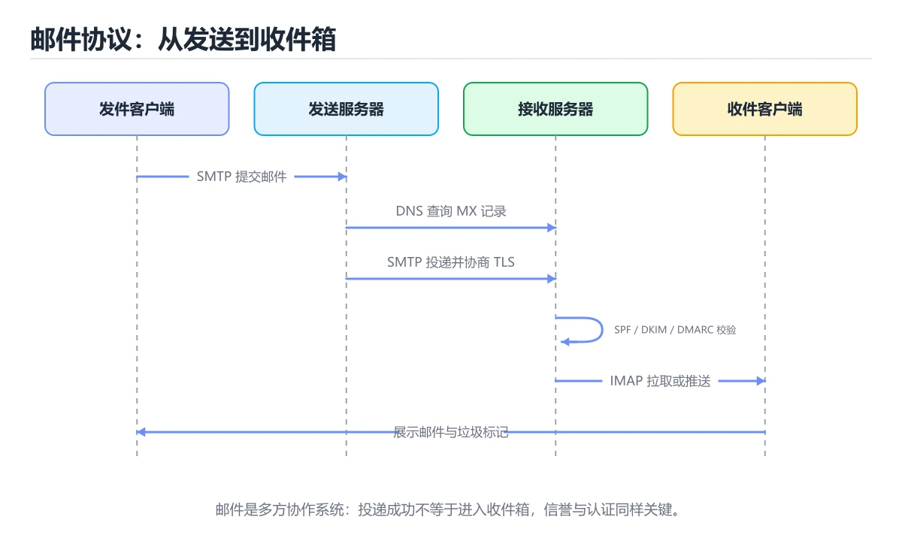
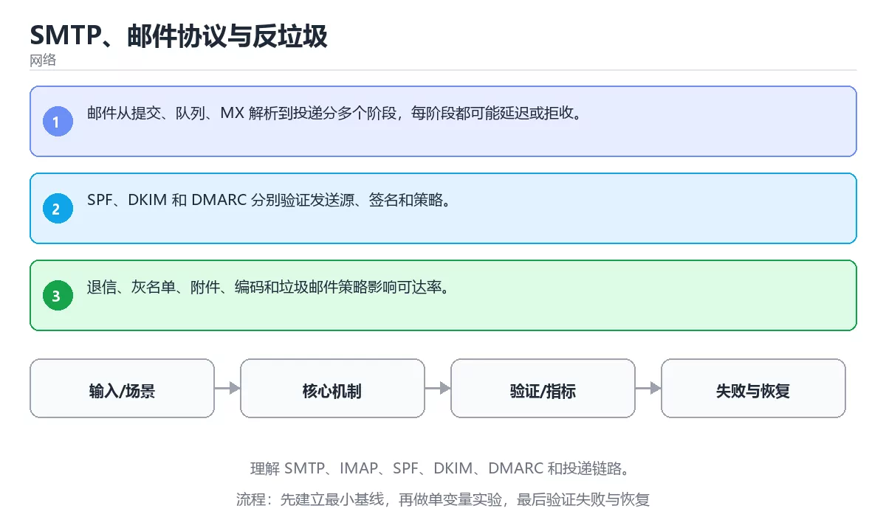

# SMTP、邮件协议与反垃圾

> 内容更新时间：2026-10-06 · 学习阶段：进阶 · 预计用时：35 分钟





## 本节知识框架

**课程定位**：所属分类 `network`（网络），课程主题 `SMTP、邮件协议与反垃圾`，学习阶段 进阶，建议用时 40 分钟。

本课主线：理解 SMTP、IMAP、SPF、DKIM、DMARC 和投递链路。

**学完本课应当能够**
- 说清 `SMTP` 与 `DKIM` 的含义与区别，并各举一个正例和一个反例。
- 用本课示例验证 `SPF` 的行为，记录输入、输出与失败条件。
- 遇到「发信不配置认证与加密」这类问题时，能说出触发条件与修复顺序。

### 从概念到验证的学习链条

1. `SMTP`：先掌握 用于发送和中继电子邮件的协议，再用它解释 `DKIM` 为什么会出现。
2. `DKIM`：先掌握 用域名密钥签名邮件头与正文，帮助接收方验证邮件未被篡改，再用它解释 `SPF` 为什么会出现。
3. `SPF`：先掌握 发信方在 DNS 里声明哪些 IP 有权代表该域名发信，收信方据此识别伪造发件人，再用它解释 `DMARC` 为什么会出现。
4. `DMARC`：先掌握 结合 SPF 与 DKIM 告诉收件方如何处理未通过校验的邮件，并提供报告地址，再用它解释 本课示例的观察结果 为什么会出现。

**先修与衔接**：本课是「网络」分类的第 16 课。相关或后续课程：《BGP 与互联网路由》。

### 完成判据

- **定义关**：不看正文也能说明 `SMTP` 是 用于发送和中继电子邮件的协议，并指出一个反例。
- **机制关**：能按“输入 → 转换 → 输出 → 验证”复述 `SMTP、邮件协议与反垃圾`，而不是只背结论。
- **示例关**：能运行或推演 `SMTP、邮件协议与反垃圾` 的 `text` 示例，并说明一个真实出现的标识符或字面量。
- **证据关**：能指出 `SMTP、邮件协议与反垃圾` 示例里的 调用了 `print()`，并说明它支持或反驳了本课的哪一条结论。
- **排错关**：能复现 发信不配置认证与加密，记录现象并按 配置认证与加密，并确认发信域名与反向解析 修复。
- **迁移关**：能把 `SMTP`、`DKIM`、`SPF`、`DMARC` 放进一个与 `SMTP、邮件协议与反垃圾` 不同的项目场景，并保持输入与验证条件可追踪。
- **复盘关**：学完 `SMTP、邮件协议与反垃圾` 后，用一句话写下仍然不确定的结论，并列出下一次验证需要的输入、环境和成功判据。

### 复习清单

- [ ] 能不看正文复述本课核心术语，并指出一个边界或反例。
- [ ] 能运行或推演本课示例，记录输入、输出与失败现象。
- [ ] 能完成一次自测，并把错题对照错误表定位原因。

## 核心概念定义

| 术语 | 操作性定义 | 常见边界与风险 |
| --- | --- | --- |
| SMTP | 用于发送和中继电子邮件的协议。 | 网络延迟、超时与版本协商会改变行为，只在真实链路或多版本客户端上验证才算数。 |
| DKIM | 用域名密钥签名邮件头与正文，帮助接收方验证邮件未被篡改。 | 权限与密钥策略变化会让结论失效，按最小权限并用真实凭据流程复验。 |
| SPF | 发信方在 DNS 里声明哪些 IP 有权代表该域名发信，收信方据此识别伪造发件人。 | 只在「发信方在 DNS 里声明哪些 IP 有权代表该域名发信，收信方据此识别伪造发件人」这一前提下成立，换输入或换环境要重新验证。 |
| DMARC | 结合 SPF 与 DKIM 告诉收件方如何处理未通过校验的邮件，并提供报告地址。 | 只在「结合 SPF 与 DKIM 告诉收件方如何处理未通过校验的邮件，并提供报告地址」这一前提下成立，换输入或换环境要重新验证。 |

## 原理与运行机制

### 机制总览

**教材衔接：核心知识**

### 1. 邮件从提交、队列、MX 解析到投递分多个阶段，每阶段都可能延迟或拒收。

- 关键做法：基线只保留 DKIM 必需的部分，其余条件一次加一个。
- 验证标准：SMTP 的结果可复现、错误可解释、失败能恢复。

### 2. SPF、DKIM 和 DMARC 分别验证发送源、签名和策略。

把这条结论放回「SMTP、邮件协议与反垃圾」的完整流程里展开：

- 正文依据：能用自己的话解释：SPF、DKIM 和 DMARC 分别验证发送源、签名和策略。
- 落地检查：把「2. SPF、DKIM 和 DMARC 分别验证发送源、签名和策略。」改写成一条可执行的核对项，逐条验证输入、超时与失败路径。

### 3. 退信、灰名单、附件、编码和垃圾邮件策略影响可达率。

把这条结论放回「SMTP、邮件协议与反垃圾」的完整流程里展开：

- 正文依据：本课关键词：SMTP、DKIM、SPF、DMARC。
- 落地检查：把「3. 退信、灰名单、附件、编码和垃圾邮件策略影响可达率。」改写成一条可执行的核对项，逐条验证输入、超时与失败路径。

**教材衔接：关键流程**

**教材衔接：实践路径**

**教材衔接：验证步骤**

### 机制拆解：每一步的输入、动作与输出

#### 1. `SMTP`
- 输入：`SMTP`；本步把 用于发送和中继电子邮件的协议 当作判断规则。
- 动作：围绕 `SMTP` 保留中间状态，并记录它与 `DKIM` 的对应关系。
- 输出：`DKIM`，它可以被下一段代码、测试或记录继续使用。
- `SMTP` 的失败条件：网络延迟、超时与版本协商会改变行为，只在真实链路或多版本客户端上验证才算数。

#### 2. `DKIM`
- 输入：`SMTP`；本步把 用域名密钥签名邮件头与正文，帮助接收方验证邮件未被篡改 当作判断规则。
- 动作：围绕 `DKIM` 保留中间状态，并记录它与 `SPF` 的对应关系。
- 输出：`SPF`，它可以被下一段代码、测试或记录继续使用。
- `DKIM` 的失败条件：权限与密钥策略变化会让结论失效，按最小权限并用真实凭据流程复验。

#### 3. `SPF`
- 输入：`DKIM`；本步把 发信方在 DNS 里声明哪些 IP 有权代表该域名发信，收信方据此识别伪造发件人 当作判断规则。
- 动作：围绕 `SPF` 保留中间状态，并记录它与 `DMARC` 的对应关系。
- 输出：`DMARC`，它可以被下一段代码、测试或记录继续使用。
- `SPF` 的失败条件：只在「发信方在 DNS 里声明哪些 IP 有权代表该域名发信，收信方据此识别伪造发件人」这一前提下成立，换输入或换环境要重新验证。

#### 4. `DMARC`
- 输入：`SPF`；本步把 结合 SPF 与 DKIM 告诉收件方如何处理未通过校验的邮件，并提供报告地址 当作判断规则。
- 动作：围绕 `DMARC` 保留中间状态，并记录它与 `print` 的对应关系。
- 输出：`print`，它可以被下一段代码、测试或记录继续使用。
- `DMARC` 的失败条件：只在「结合 SPF 与 DKIM 告诉收件方如何处理未通过校验的邮件，并提供报告地址」这一前提下成立，换输入或换环境要重新验证。

### 示例中的可观察事实

1. 调用了 `print()`；它对应的课程主题是 `SMTP、邮件协议与反垃圾`。
2. 调用了 `gethostbyname()`；它对应的课程主题是 `SMTP、邮件协议与反垃圾`。
3. 出现字面量 `localhost`；它对应的课程主题是 `SMTP、邮件协议与反垃圾`。

### 复现实验记录

- 环境：`SMTP、邮件协议与反垃圾` 使用 `text` 示例，固定 `SMTP`、`DKIM`、`SPF`、`DMARC` 作为第一组条件。
- 首轮输入：先确认 调用了 `print()`，预测 `SMTP` 会怎样变化。
- 基线观察：记录命令、输入、输出和错误原文，不用截图代替可复制的文本。
- 单变量修改：只改变 `SMTP`，观察 `DMARC` 是否仍满足定义。
- 失败注入：复现 发信不配置认证与加密，确认现象是 被拒收或直接进垃圾箱。
- 记录结论：把“修改前、修改后、预期变化、实际变化”写成四列表，这样复盘 `SMTP、邮件协议与反垃圾` 时才能区分概念错误与实现错误。

## 典型应用场景

**教材衔接：深度拓展与实战**

这一节把「SMTP、邮件协议与反垃圾」正文里的定义、代码和失败模式串成一条可操作的复习路线。

### 机制拆解

- **1. 邮件从提交、队列、MX 解析到投递分多个阶段，每阶段都可能延迟或拒收。**：在「SMTP、邮件协议与反垃圾」里，「1. 邮件从提交、队列、MX 解析到投递分多个阶段，每阶段都可能延迟或拒收。」这一步要先写清输入与预期，再记录实际结果和差异；结果不符时回到对应小节核对前提。
- **2. SPF、DKIM 和 DMARC 分别验证发送源、签名和策略。**：在「SMTP、邮件协议与反垃圾」里，「2. SPF、DKIM 和 DMARC 分别验证发送源、签名和策略。」这一步要先写清输入与预期，再记录实际结果和差异；结果不符时回到对应小节核对前提。
- **3. 退信、灰名单、附件、编码和垃圾邮件策略影响可达率。**：在「SMTP、邮件协议与反垃圾」里，「3. 退信、灰名单、附件、编码和垃圾邮件策略影响可达率。」这一步要先写清输入与预期，再记录实际结果和差异；结果不符时回到对应小节核对前提。
- **一次投递经历的步骤**：邮件客户端把邮件提交给自己的发送服务器（常用 587 端口，带认证与 STARTTLS），
- **信封与头部不是一回事**：真正决定投递与退信的是信封发件人（MAIL FROM），而用户看到的 From 是邮件头，


### 工程检查表

- [ ] 能否用自己的话说明SMTP、邮件协议与反垃圾解决什么问题，以及它不负责什么？
- [ ] 能否用「SMTP、邮件协议与反垃圾」的最小示例复现一次失败并解释原因？
- [ ] 能否解释本课关键词在真实项目中的边界与取舍？
- [ ] 能否说明 DKIM 在新场景下需要补充什么前提？

### 迁移练习

1. 保持正文示例不变，写出它的输入、处理步骤和预期输出。
2. 固定其他输入，只调整 gethostbyname 的一个参数，先写预测再验证。
3. 结合SMTP、DKIM、SPF、DMARC，写出一个真实项目中的使用场景。
4. 写下一个反例，说明它在什么条件下会使朴素做法失效。

- **发信不配置认证与加密**：典型现象是被拒收或直接进垃圾箱；正确做法是配置认证与加密，并确认发信域名与反向解析。
- **不配置发信身份记录**：典型现象是邮件被判为垃圾邮件；正确做法是配置并验证发信授权、签名与策略三类记录。
- **不区分错误类型盲目重试**：典型现象是被对方限流或封禁；正确做法是按错误码区分临时与永久失败，永久失败不再重试。

### 最小验证场景

- 准备：保留 `text` 示例的原始输入，先记录 `SMTP、邮件协议与反垃圾` 的基线输出和完整运行命令。
- 观察：先核对 调用了 `print()`，再改变一个与 `SMTP` 相关的条件。
- 判定：新结果与 `SMTP、邮件协议与反垃圾` 的基线不同不等于错误；只有当差异破坏了 `SMTP` 的定义或错误表中的约束，才判定为失败。

### 选择与边界

- 使用 `SMTP` 时，先满足它的定义：用于发送和中继电子邮件的协议；网络延迟、超时与版本协商会改变行为，只在真实链路或多版本客户端上验证才算数。
- 使用 `DKIM` 时，先满足它的定义：用域名密钥签名邮件头与正文，帮助接收方验证邮件未被篡改；权限与密钥策略变化会让结论失效，按最小权限并用真实凭据流程复验。
- 使用 `SPF` 时，先满足它的定义：发信方在 DNS 里声明哪些 IP 有权代表该域名发信，收信方据此识别伪造发件人；只在「发信方在 DNS 里声明哪些 IP 有权代表该域名发信，收信方据此识别伪造发件人」这一前提下成立，换输入或换环境要重新验证。
- 使用 `DMARC` 时，先满足它的定义：结合 SPF 与 DKIM 告诉收件方如何处理未通过校验的邮件，并提供报告地址；只在「结合 SPF 与 DKIM 告诉收件方如何处理未通过校验的邮件，并提供报告地址」这一前提下成立，换输入或换环境要重新验证。

## 代码/协议/SQL 示例

### 最小可验证示例

**教材衔接：深入理解：SMTP、邮件协议与反垃圾**

### 一次投递经历的步骤

邮件客户端把邮件提交给自己的发送服务器（常用 587 端口，带认证与 STARTTLS），
发送服务器再按收件域查询 MX 记录，与对方服务器用 SMTP 会话投递。会话由命令和
响应组成：EHLO 问候、MAIL FROM 声明信封发件人、RCPT TO 声明收件人、DATA 传输正文。
2xx 表示接受，4xx 是临时失败可重试，5xx 是永久失败应退信。

### 信封与头部不是一回事

真正决定投递与退信的是信封发件人（MAIL FROM），而用户看到的 From 是邮件头，
两者可以不同，这正是转发与邮件列表容易出现 SPF 问题的原因。Reply-To 决定回信地址，
Return-Path 记录退信去处。排查投递问题时先分清这三个字段，再看认证结果。

### 反垃圾的三件套

SPF 用 DNS 声明哪些服务器可以代表该域发信；DKIM 用域名私钥对邮件签名，接收方用
公钥验证内容未被篡改；DMARC 把两者结果与 From 域绑定，并告诉接收方验证失败时
应该隔离还是拒收。三者配合才能防止伪造发件人。自建邮件服务器还要处理反向 DNS、
IP 信誉和退信率，否则很容易被判为垃圾邮件。

「SMTP、邮件协议与反垃圾」的「一次投递经历的步骤」一节补全如下：

- 定位：这一节说明一次投递经历的步骤在「SMTP、邮件协议与反垃圾」知识体系里的位置。
- 要点：发送服务器再按收件域查询 MX 记录，与对方服务器用 SMTP 会话投递。会话由命令和
- 自检：能否用一个最小例子解释一次投递经历的步骤？

「SMTP、邮件协议与反垃圾」的「信封与头部不是一回事」一节补全如下：

- 定位：这一节说明信封与头部不是一回事在「SMTP、邮件协议与反垃圾」知识体系里的位置。
- 要点：两者可以不同，这正是转发与邮件列表容易出现 SPF 问题的原因。Reply-To 决定回信地址，
- 自检：能否用一个最小例子解释信封与头部不是一回事？

「SMTP、邮件协议与反垃圾」的「反垃圾的三件套」一节补全如下：

- 定位：这一节说明反垃圾的三件套在「SMTP、邮件协议与反垃圾」知识体系里的位置。
- 要点：SPF 用 DNS 声明哪些服务器可以代表该域发信；DKIM 用域名私钥对邮件签名，接收方用
- 自检：能否用一个最小例子解释反垃圾的三件套？

**教材衔接：深入补充：SMTP、邮件协议与反垃圾 的取舍与边界**


### 四、自测清单

**教材衔接：最小可运行示例**

下面的示例覆盖「SMTP、邮件协议与反垃圾」中 SMTP 的核心路径。先原样运行，再按注释改一处：

```python
import socket

print(socket.gethostbyname("localhost"))
```

**教材衔接：预期输出**

```text
127.0.0.1
```

### 示例精读：先找证据，再改一个条件

1. 调用了 `print()`；它出现在 `SMTP、邮件协议与反垃圾` 的示例中，阅读时先确认它前后各发生了什么。
2. 调用了 `gethostbyname()`；它出现在 `SMTP、邮件协议与反垃圾` 的示例中，阅读时先确认它前后各发生了什么。
3. 出现字面量 `localhost`；它出现在 `SMTP、邮件协议与反垃圾` 的示例中，阅读时先确认它前后各发生了什么。
- 在 `SMTP、邮件协议与反垃圾` 中与 `SMTP` 对照：示例必须能支持 用于发送和中继电子邮件的协议，否则说明这一段还缺少实现或验证步骤。
- 在 `SMTP、邮件协议与反垃圾` 中与 `DKIM` 对照：示例必须能支持 用域名密钥签名邮件头与正文，帮助接收方验证邮件未被篡改，否则说明这一段还缺少实现或验证步骤。
- 在 `SMTP、邮件协议与反垃圾` 中与 `SPF` 对照：示例必须能支持 发信方在 DNS 里声明哪些 IP 有权代表该域名发信，收信方据此识别伪造发件人，否则说明这一段还缺少实现或验证步骤。
- 在 `SMTP、邮件协议与反垃圾` 中与 `DMARC` 对照：示例必须能支持 结合 SPF 与 DKIM 告诉收件方如何处理未通过校验的邮件，并提供报告地址，否则说明这一段还缺少实现或验证步骤。

## 时间/空间复杂度或性能分析

**性能关注点（SMTP、邮件协议与反垃圾）**：往返延迟与带宽是主要成本：记录 RTT、吞吐与重传率，区分局域网与真实链路。

**本课特有开销（SMTP、邮件协议与反垃圾 · SMTP）**：重试与超时会成倍放大尾延迟，记录 P99 而不是平均值。

**测量方法**：以 `SMTP、邮件协议与反垃圾` 的 `SMTP` 场景为对象，固定输入跑一遍记录基线，再把规模或并发度提高一个数量级复测；两次结果的差值与波动范围才是结论依据。

### 需要控制的变量与记录项

- `SMTP、邮件协议与反垃圾` 的 `SMTP`：固定它的版本、输入范围和资源上限，分别记录速度、内存与失败率的变化。
- `SMTP、邮件协议与反垃圾` 的 `DKIM`：固定它的版本、输入范围和资源上限，分别记录速度、内存与失败率的变化。
- `SMTP、邮件协议与反垃圾` 的 `SPF`：固定它的版本、输入范围和资源上限，分别记录速度、内存与失败率的变化。
- `SMTP、邮件协议与反垃圾` 的 `DMARC`：固定它的版本、输入范围和资源上限，分别记录速度、内存与失败率的变化。
- `SMTP、邮件协议与反垃圾` 中 `SMTP` 的边界：网络延迟、超时与版本协商会改变行为，只在真实链路或多版本客户端上验证才算数。达到边界时不要外推，必须重新测量。
- `SMTP、邮件协议与反垃圾` 中 `DKIM` 的边界：权限与密钥策略变化会让结论失效，按最小权限并用真实凭据流程复验。达到边界时不要外推，必须重新测量。
- `SMTP、邮件协议与反垃圾` 中 `SPF` 的边界：只在「发信方在 DNS 里声明哪些 IP 有权代表该域名发信，收信方据此识别伪造发件人」这一前提下成立，换输入或换环境要重新验证。达到边界时不要外推，必须重新测量。
- `SMTP、邮件协议与反垃圾` 中 `DMARC` 的边界：只在「结合 SPF 与 DKIM 告诉收件方如何处理未通过校验的邮件，并提供报告地址」这一前提下成立，换输入或换环境要重新验证。达到边界时不要外推，必须重新测量。
- `SMTP、邮件协议与反垃圾` 的代码证据：先验证 调用了 `print()`，再记录该路径的输入规模与耗时；只看代码行数不能推出复杂度。

## 常见误区与易错点

| 容易写错的做法 | 实际现象 | 原因与正确做法 |
| --- | --- | --- |
| 发信不配置认证与加密 | 被拒收或直接进垃圾箱。 | 配置认证与加密，并确认发信域名与反向解析。 |
| 不配置发信身份记录 | 邮件被判为垃圾邮件。 | 配置并验证发信授权、签名与策略三类记录。 |
| 不区分错误类型盲目重试 | 被对方限流或封禁。 | 按错误码区分临时与永久失败，永久失败不再重试。 |

### 现场 1：发信不配置认证与加密

**症状**：被拒收或直接进垃圾箱。

**根因与修复**：配置认证与加密，并确认发信域名与反向解析。

**自检**：在本课示例里复现「发信不配置认证与加密」，改成配置认证与加密，并确认发信域名与反向解析后重跑；如果症状消失且失败路径按预期变化，说明定位正确。

### 现场 2：不配置发信身份记录

**症状**：邮件被判为垃圾邮件。

**根因与修复**：配置并验证发信授权、签名与策略三类记录。

**自检**：在本课示例里复现「不配置发信身份记录」，改成配置并验证发信授权、签名与策略三类记录后重跑；如果症状消失且失败路径按预期变化，说明定位正确。

### 现场 3：不区分错误类型盲目重试

**症状**：被对方限流或封禁。

**根因与修复**：按错误码区分临时与永久失败，永久失败不再重试。

**自检**：在本课示例里复现「不区分错误类型盲目重试」，改成按错误码区分临时与永久失败，永久失败不再重试后重跑；如果症状消失且失败路径按预期变化，说明定位正确。

## 与其他知识点的关系

**教材衔接：复习与迁移**

### 概念复述

- 用一句话说明「SMTP、邮件协议与反垃圾」解决什么问题：理解 SMTP、IMAP、SPF、DKIM、DMARC 和投递链路。
- 写出SMTP、DKIM、SPF之间的关系，并各举一个例子。
- 说出本课最容易混淆的两个概念，以及区分它们的判据。

### 正文逐节复核

- **深入理解：SMTP、邮件协议与反垃圾**：发送服务器再按收件域查询 MX 记录，与对方服务器用 SMTP 会话投递。
- **深入补充：SMTP、邮件协议与反垃圾 的取舍与边界**：学习SMTP、邮件协议与反垃圾时，最容易只记住结论而忽略前提。


### 迁移练习

- **相关或后续**：`BGP 与互联网路由`。本课术语会在这些课程里继续使用。
- **术语归属**：`SMTP`、`DKIM`、`SPF` 的定义以本课「核心概念定义」为准，换到其他课程时先确认定义是否被改写。

### 先修与后续术语接口

- `BGP 与互联网路由`：两者通过本分类的学习顺序衔接，阅读时重点比较各自的输入与失败条件。

### 容易混淆的相邻概念

- `SMTP` 与 `DKIM`：前者强调 用于发送和中继电子邮件的协议；后者强调 用域名密钥签名邮件头与正文，帮助接收方验证邮件未被篡改。判断时分别检查两条定义的适用范围，不要只看名称相似就互换。
- `DKIM` 与 `SPF`：前者强调 用域名密钥签名邮件头与正文，帮助接收方验证邮件未被篡改；后者强调 发信方在 DNS 里声明哪些 IP 有权代表该域名发信，收信方据此识别伪造发件人。判断时分别检查两条定义的适用范围，不要只看名称相似就互换。
- `SPF` 与 `DMARC`：前者强调 发信方在 DNS 里声明哪些 IP 有权代表该域名发信，收信方据此识别伪造发件人；后者强调 结合 SPF 与 DKIM 告诉收件方如何处理未通过校验的邮件，并提供报告地址。判断时分别检查两条定义的适用范围，不要只看名称相似就互换。

## 自测题与参考答案

> 先独立作答，再对照参考答案；答案都能在本课正文、术语表或错误表里找到依据。

### 自测 1（概念复述）

不看正文，写出 `SMTP` 的操作性定义，并说明它与 `DKIM` 的区别。

**参考答案**：用于发送和中继电子邮件的协议。

`DKIM` 的定位是：用域名密钥签名邮件头与正文，帮助接收方验证邮件未被篡改；两者的差别要从适用对象与失败模式上说明。

### 自测 2（排错）

本课错误表记录了「发信不配置认证与加密」这类做法。请写出它会出现的现象、根因，以及修复顺序。

**参考答案**：现象是被拒收或直接进垃圾箱；正确做法是配置认证与加密，并确认发信域名与反向解析。修复时先复现现象并保留证据，再改动一处假设重跑，确认现象消失。

### 自测 3（动手验证）

运行本课的 `text` 示例，改动其中一个输入后重新运行，记录输出与错误信息。

**参考答案**：正常输入下 `text` 示例应当复现正文给出的结果；改动输入后，如果结果改变或报错，先核对它是否满足 `SMTP、邮件协议与反垃圾` 中`SMTP` 的适用范围，再检查错误表里是否有同类现象。

### 自测 4（代码阅读）

阅读本课开头的 `text` 示例，说明它体现了`SMTP` 的哪一条性质，并指出改动哪个输入会让这条性质不再成立。

**参考答案**：`SMTP` 的定义是 用于发送和中继电子邮件的协议，示例正是在实现这条定义。改动与 `SMTP` 有关的一个输入后，如果结果不再符合 `SMTP、邮件协议与反垃圾` 的正文描述，就说明该性质只在当前前提成立。

### 自测 5（迁移）

把 `SMTP、邮件协议与反垃圾` 的方法迁移到自己的项目：围绕 `SMTP` 写出一个与错误表同类的风险点，并说明触发条件和检验方式。

**参考答案**：例如「不区分错误类型盲目重试」，它会导致被对方限流或封禁；检验方式是按按错误码区分临时与永久失败，永久失败不再重试改一处再复现，确认现象消失且没有引入新的失败分支。

### 自测 6（对比）

用一个表格对比 `SMTP` 与 `DKIM`：各写一行适用场景、一行失败表现。

**参考答案**：`SMTP` 的定义是用于发送和中继电子邮件的协议；`DKIM` 的定义是用域名密钥签名邮件头与正文，帮助接收方验证邮件未被篡改。两者的失败表现分别对应本课错误表里与本术语相关的行。

### 自测 7（排错顺序）

面对「发信不配置认证与加密」引发的问题，请把“复现 被拒收或直接进垃圾箱 → 保留证据 → 配置认证与加密，并确认发信域名与反向解析 → 回归验证”四步写成可执行的检查清单。

**参考答案**：第一步按被拒收或直接进垃圾箱复现；第二步记录输入、版本与完整报错；第三步按配置认证与加密，并确认发信域名与反向解析只改一处；第四步重跑并确认失败路径也按预期变化。

### 自测 8（边界判断）

针对 `DMARC`，分别写出“可以使用”的条件和“结论不再成立”的条件。

**参考答案**：只在「结合 SPF 与 DKIM 告诉收件方如何处理未通过校验的邮件，并提供报告地址」这一前提下成立，换输入或换环境要重新验证。 同时要把 `DMARC` 的定义 结合 SPF 与 DKIM 告诉收件方如何处理未通过校验的邮件，并提供报告地址 与实际输入逐项对照。

### 自测 9（机制重建）

不看正文，按输入、转换、输出、验证四段重建 `SMTP` → `DKIM` → `SPF` → `DMARC` 的作用链。

**参考答案**：起点是 `SMTP` 的定义 用于发送和中继电子邮件的协议；中间每一步都保留可观察状态；终点由 `DMARC` 检查，失败时回到错误表定位第一个偏离定义的步骤。

### 自测 10（综合排错）

在 `SMTP、邮件协议与反垃圾` 中，现象是 被对方限流或封禁。请围绕 不区分错误类型盲目重试 写出最小复现、关键证据、修复动作和回归验证，并说明为什么不能只凭一次运行下结论。

**参考答案**：先复现 不区分错误类型盲目重试，记录输入与完整错误；再按 按错误码区分临时与永久失败，永久失败不再重试 只改一处。回归时同时跑正常路径和边界路径，只有两次结果都可解释，才把修复视为完成。

### 自测 11（一分钟复述）

用每分钟约 200 字的速度复述 `SMTP、邮件协议与反垃圾`：先给主问题，再按顺序说出 `SMTP`、`DKIM`、`SPF`、`DMARC`，最后给一个失败案例。

**自评标准**：主问题必须对应 理解 SMTP、IMAP、SPF、DKIM、DMARC 和投递链路；每个术语都要能接上一句定义或边界；失败案例必须写成可观察现象，不能用“可能有风险”代替证据。

## 术语速查

| 术语 | 一句话说明 |
| --- | --- |
| `SMTP` | 用于发送和中继电子邮件的协议。 |
| `DKIM` | 用域名密钥签名邮件头与正文，帮助接收方验证邮件未被篡改。 |
| `SPF` | 发信方在 DNS 里声明哪些 IP 有权代表该域名发信，收信方据此识别伪造发件人。 |
| `DMARC` | 结合 SPF 与 DKIM 告诉收件方如何处理未通过校验的邮件，并提供报告地址。 |

**术语关系**：`SMTP`（用于发送和中继电子邮件的协议） → `DKIM`（用域名密钥签名邮件头与正文） → `SPF`（发信方在 DNS 里声明哪些 IP 有权代表该域名发信） → `DMARC`（结合 SPF 与 DKIM 告诉收件方如何处理未通过校验的邮件）。

## 考点精讲

`SMTP、邮件协议与反垃圾` 的题库有 5 道题，下面逐题给出题干、正确项与判断依据：先自己作答，再核对正确项，最后回到正文对应小节复核。

### 考点 1：第 1 题

- **题目**：在 `SMTP、邮件协议与反垃圾` 里，与 `SMTP` 有关的说法中，哪一项最符合理解 SMTP、IMAP、SPF、DKIM、DMARC 和投递链路。？
- **正确项**：邮件从提交、队列、MX 解析到投递分多个阶段，每阶段都可能延迟或拒收。
- **判断依据**：这道题落在术语 `SMTP` 上：用于发送和中继电子邮件的协议。复习时把 `SMTP` 的定义、适用边界和一个反例一起说清楚，再回到「核心概念定义」核对原文。

### 考点 2：第 2 题

- **题目**：在 `SMTP、邮件协议与反垃圾` 里，与 `SMTP` 有关的说法中，哪一项最符合理解 SMTP、IMAP、SPF、DKIM、DMARC 和投递链路。？（SMTP、邮件协议与反垃圾·网络 第 2 题）
- **正确项**：SPF、DKIM 和 DMARC 分别验证发送源、签名和策略。
- **判断依据**：这道题落在术语 `SMTP` 上：用于发送和中继电子邮件的协议。复习时把 `SMTP` 的定义、适用边界和一个反例一起说清楚，再回到「核心概念定义」核对原文。

### 考点 3：第 3 题

- **题目**：阅读 `SMTP、邮件协议与反垃圾` 的 `SMTP` 示例。它服务于理解 SMTP、IMAP、SPF、DKIM、DMARC 和投递链路。代码中实际包含下列哪一项？
- **正确项**：调用了 `gethostbyname()`
- **判断依据**：这道题落在术语 `SMTP` 上：用于发送和中继电子邮件的协议。复习时把 `SMTP` 的定义、适用边界和一个反例一起说清楚，再回到「核心概念定义」核对原文。

### 考点 4：第 4 题

- **题目**：按“SMTP、邮件协议与反垃圾”中 SMTP、DKIM、SPF 的实践顺序，把四个步骤排成从准备到复盘的合理顺序。
- **正确项**：先明确 SMTP 的输入、输出与约束 → 写出最小示例并核对 DKIM 的基线结果 → 只改一个变量，记录边界与失败路径的变化 → 固定版本与证据，把“SMTP、邮件协议与反垃圾”的结论写成可复现记录
- **判断依据**：这道题落在术语 `SMTP` 上：用于发送和中继电子邮件的协议。复习时把 `SMTP` 的定义、适用边界和一个反例一起说清楚，再回到「核心概念定义」核对原文。

### 考点 5：第 5 题

- **题目**：课程 `理解 SMTP、IMAP、SPF、DKIM、DMARC 和投递链路。`。在 `SMTP、邮件协议与反垃圾` 里，`SMTP`、`DKIM` 与下面哪些选项属于同一层概念？（多选）
- **正确项**：SMTP；DKIM
- **判断依据**：这道题落在术语 `SMTP` 上：用于发送和中继电子邮件的协议。复习时把 `SMTP` 的定义、适用边界和一个反例一起说清楚，再回到「核心概念定义」核对原文。

### 考点 6：`SMTP`

- **要点**：用于发送和中继电子邮件的协议。
- **SMTP 的边界**：网络延迟、超时与版本协商会改变行为，只在真实链路或多版本客户端上验证才算数。

### 考点 7：`DKIM`

- **要点**：用域名密钥签名邮件头与正文，帮助接收方验证邮件未被篡改。
- **DKIM 的边界**：权限与密钥策略变化会让结论失效，按最小权限并用真实凭据流程复验。

### 考点 8：`SPF`

- **要点**：发信方在 DNS 里声明哪些 IP 有权代表该域名发信，收信方据此识别伪造发件人。
- **SPF 的边界**：只在「发信方在 DNS 里声明哪些 IP 有权代表该域名发信，收信方据此识别伪造发件人」这一前提下成立，换输入或换环境要重新验证。

### 考点 9：`DMARC`

- **要点**：结合 SPF 与 DKIM 告诉收件方如何处理未通过校验的邮件，并提供报告地址。
- **DMARC 的边界**：只在「结合 SPF 与 DKIM 告诉收件方如何处理未通过校验的邮件，并提供报告地址」这一前提下成立，换输入或换环境要重新验证。

### 考点 10：排错——发信不配置认证与加密

- **现象**：被拒收或直接进垃圾箱。
- **处理**：配置认证与加密，并确认发信域名与反向解析。

### 考点 11：排错——不配置发信身份记录

- **现象**：邮件被判为垃圾邮件。
- **处理**：配置并验证发信授权、签名与策略三类记录。

### 考点 12：综合辨析——`SMTP` 与 `DMARC`

- **辨析点**：`SMTP` 的定义是 用于发送和中继电子邮件的协议；`DMARC` 的定义是 结合 SPF 与 DKIM 告诉收件方如何处理未通过校验的邮件，并提供报告地址。
- **答题要求**：面对 `SMTP、邮件协议与反垃圾` 的题目，先判断描述的是 `SMTP` 还是 `DMARC`，再归到对应定义，最后写出一个会让该定义失效的边界输入。

### 考点 13：排错评分点

- **现象分**：能写出 被拒收或直接进垃圾箱，而不是只写“程序有错”。
- **证据分**：保留触发 发信不配置认证与加密 的输入、版本和错误原文。
- **修复分**：按 配置认证与加密，并确认发信域名与反向解析 只改一处，并同时回归正常路径与边界路径。

## 内容元数据

- 内容版本：v2.0
- 最后更新：2026-10-06
- 学习阶段：进阶
- 适用环境：TCP/IP、HTTP/2、HTTP/3 与现代网络栈；本课聚焦其中的 SMTP。
- 内容来源：内置结构化课程与工程实践整理
- 相关主题：SMTP、DKIM、SPF、DMARC
- 质量版本：P0 测验标准 + P1 覆盖扩展 + P2 体验补全

## 参考资料与复核

- 最后复核：2026-10-04
- 下次复核：2027-06-24
- 复核范围：版本兼容、API 行为、安全建议与工程实践
- 来源性质：官方文档、标准或权威教材；本课核对关键词：SMTP、DKIM、SPF、DMARC。

| 参考资料 | 本课用途 |
| --- | --- |
| [IANA 协议注册表](https://www.iana.org/protocols) | 端口、协议号与参数 |
| [RFC 1035 DNS](https://www.rfc-editor.org/rfc/rfc1035) | DNS 报文与解析 |
| [RFC 9293 TCP](https://www.rfc-editor.org/rfc/rfc9293) | TCP 连接、重传与拥塞 |

| [本课术语索引：SMTP、邮件协议与反垃圾](#核心概念定义) | 按本课输入、术语边界和错误表现逐项核对 |
> 「SMTP、邮件协议与反垃圾」的链接用于离线阅读后的延伸核对；App 不会自动联网。