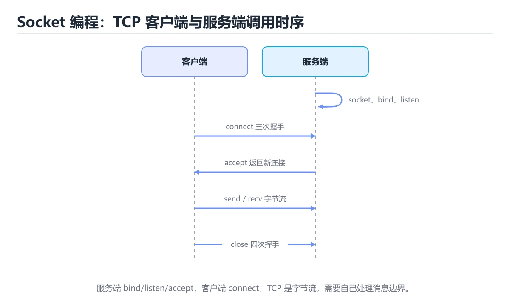
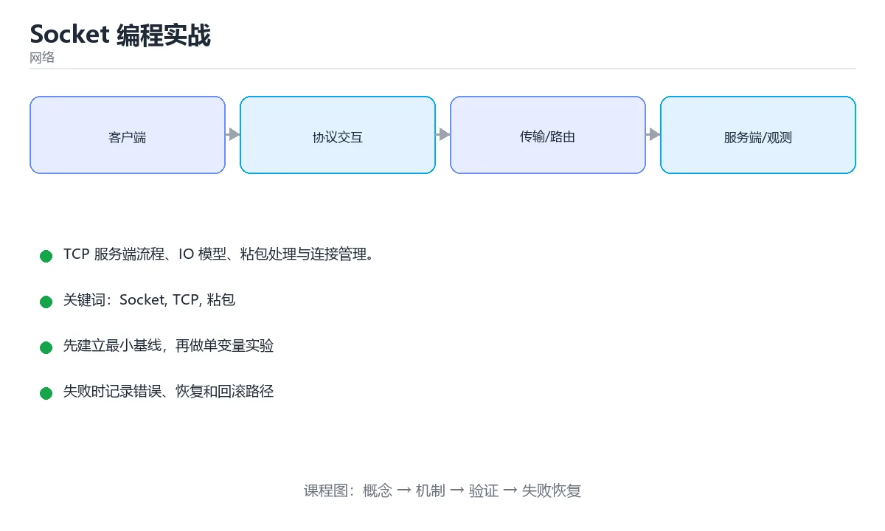

# Socket 编程实战

> 内容更新时间：2026-10-06 · 学习阶段：高级 · 预计用时：60 分钟





## 学习目标

- 能用自己的话解释Socket 编程实战解决了什么问题，而不是只背术语。
- 能说清 「Socket」、「TCP」、「粘包」、「epoll」 之间的关系，并分别举出一个例子。
- 能把 Socket 放回「Socket 编程实战」的知识体系，说明它和 TCP 的边界。
- 能完成本课练习，并用验收标准检查自己的结果。

> 一句话摘要：TCP 服务端流程、IO 模型、粘包处理与连接管理。

## 前置知识

- 先完成上一课《网络攻击与防护》；如果已经掌握，可以直接用本课练习自测。
- 开始前先复习：Socket、TCP、粘包。
- 如果 TCP 服务端的标准流程 这一步看不懂，先记录具体卡点，再用 ConnectionError 复现一遍。

## TCP 服务端的标准流程

```text
socket() → bind() → listen() → accept() → recv()/send() → close()
客户端：socket() → connect() → send()/recv() → close()
```

`listen` 的 backlog 是已完成三次握手但尚未被 accept 的队列上限，过小会在高并发下丢连接；`accept` 返回的是新连接套接字，监听套接字继续接收新连接。

## 阻塞、非阻塞与多路复用

| 模型 | 特点 | 适用 |
| --- | --- | --- |
| 阻塞 IO | 一连接一线程，编程简单 | 低并发 |
| 非阻塞 + 轮询 | 不阻塞但空转浪费 CPU | 少见 |
| IO 多路复用 | epoll/kqueue 统一等待，事件驱动 | 高并发主流 |
| 异步 IO | 内核完成读写后回调 | io_uring 等 |

边缘触发（ET）必须循环读到 EAGAIN，水平触发（LT）可只读一次；ET 性能更好但更容易写错。

## 粘包与拆包

TCP 是字节流，没有消息边界。三种拆包方案：

1. **长度前缀**（最常用）：先读 4 字节长度，再读正文。
2. **分隔符**：如换行分隔，正文需转义。
3. **定长消息**：实现简单但不灵活。

写代码时必须处理「读到的字节数少于期望」的情况，循环读满为止，并设置总超时防止恶意连接拖死线程。

## 常用套接字选项

| 选项 | 作用 |
| --- | --- |
| TCP_NODELAY | 关闭 Nagle 算法，降低小包延迟 |
| SO_REUSEADDR | 快速重启时复用端口 |
| SO_KEEPALIVE | 探测死连接（周期长，通常配合应用层心跳） |
| SO_RCVBUF / SO_SNDBUF | 调整缓冲区大小影响吞吐 |
| SO_LINGER | 控制关闭时是否等待发送完 |

## 连接管理实践

1. 客户端使用**连接池**，避免大量 TIME_WAIT 与握手开销。
2. 应用层心跳 + 超时断连，及时发现半开连接。
3. 设置读写超时，避免线程被慢客户端长期占用。
4. 慢客户端要有背压：发送队列满则断开或降级。
5. 优雅关闭：先停止接收新请求，处理完在途请求再关闭。

## 本课小结

Socket 编程的难点不在 API，而在**边界与生命周期**：消息怎么定界、连接何时超时、异常如何收敛、资源怎样释放。

## 常用选项速查

| 选项 | 作用 |
| --- | --- |
| `SO_REUSEADDR` | 允许复用处于 TIME_WAIT 的端口，便于快速重启 |
| `SO_REUSEPORT` | 多进程监听同一端口做负载均衡（Linux） |
| `SO_KEEPALIVE` | 开启 TCP 保活探测（默认 2 小时，通常需调） |
| `TCP_NODELAY` | 关闭 Nagle 算法，降低小包延迟 |
| `TCP_CORK` | 尽量聚合小包后一次发送（与 NODELAY 相反） |
| `SO_RCVBUF` / `SO_SNDBUF` | 收发缓冲区大小 |
| `TCP_QUICKACK` | 立即确认，降低延迟 |
| `SO_LINGER` | 控制 close 行为（慎用，可能产生 RST） |

## 粘包与半包速查

| 方案 | 说明 | 适用 |
| --- | --- | --- |
| 固定长度 | 每帧长度固定 | 定长协议 |
| 分隔符 | 如换行、`\r\n` | 文本协议 |
| 长度前缀 | 前 4 字节表示长度 | 二进制协议，最通用 |
| 自描述格式 | Protobuf、MessagePack 自带结构 | RPC |

注意：TCP 是字节流，没有消息边界；UDP 有数据报边界但会丢包与乱序。

```python
import socket
import struct
import threading

def send_message(sock: socket.socket, payload: bytes) -> None:
    """长度前缀协议：4 字节大端长度 + 内容。"""
    sock.sendall(struct.pack("!I", len(payload)) + payload)

def recv_exactly(sock: socket.socket, size: int) -> bytes:
    """读取恰好 size 字节，处理半包。"""
    chunks, remaining = [], size
    while remaining > 0:
        chunk = sock.recv(remaining)
        if not chunk:
            raise ConnectionError("连接已关闭")
        chunks.append(chunk)
        remaining -= len(chunk)
    return b"".join(chunks)

def recv_message(sock: socket.socket) -> bytes:
    """按长度前缀读取一条完整消息。"""
    header = recv_exactly(sock, 4)
    (length,) = struct.unpack("!I", header)
    if length > 8 * 1024 * 1024:
        raise ValueError("消息过大，拒绝处理")
    return recv_exactly(sock, length)

def start_echo_server(host="127.0.0.1", port=0, backlog=128):
    """带 backlog 与超时的最小服务端，返回监听端口。"""
    server = socket.socket(socket.AF_INET, socket.SOCK_STREAM)
    server.setsockopt(socket.SOL_SOCKET, socket.SO_REUSEADDR, 1)
    server.bind((host, port))
    server.listen(backlog)
    bound_port = server.getsockname()[1]

    def serve():
        conn, _ = server.accept()
        with conn:
            conn.settimeout(5)
            data = recv_message(conn)
            send_message(conn, data.upper())
        server.close()

    threading.Thread(target=serve, daemon=True).start()
    return bound_port

port = start_echo_server()
client = socket.create_connection(("127.0.0.1", port), timeout=3)
try:
    send_message(client, b"hello socket")
    print(recv_message(client))
finally:
    client.close()
```

## IO 多路复用速查

| 机制 | 复杂度 | 特点 |
| --- | --- | --- |
| `select` | O(n) | 有 FD 数量上限，跨平台 |
| `poll` | O(n) | 无上限，仍要遍历 |
| `epoll`（Linux） | O(1) 事件就绪 | 水平与边缘触发，适合高并发 |
| `kqueue`（BSD/macOS） | O(1) | 功能类似 epoll |
| IOCP（Windows） | 完成通知 | 真正的异步 IO 模型 |

边缘触发（ET）必须一次读到 `EAGAIN`，否则事件不再通知；水平触发（LT）未读完会持续通知，更容易写对。

## 常见错误与排查

| 容易踩的做法 | 实际现象 | 原因与正确做法 |
| --- | --- | --- |
| 认为一次 `recv` 能拿到完整消息 | 偶发解析失败 | TCP 是字节流，必须处理半包 |
| 用 `send` 不检查返回值 | 数据被截断 | 用 `sendall` 或循环发送 |
| 忘记设置超时 | 请求永久挂起 | 设置连接与读写超时 |
| 无长度上限 | 被超大消息打爆内存 | 校验长度并设上限 |
| ET 模式只读一次 | 数据滞留、连接假死 | 循环读到 `EAGAIN` |
| 忘记关闭连接 | 句柄泄漏 | `with` 或 `finally` 关闭 |
| 不做心跳 | 半开连接长期占用 | 应用层心跳 + 超时回收 |
| 多进程监听同一端口用 REUSEADDR | 仍只有一个进程收到连接 | 用 `SO_REUSEPORT` |
| 盲目开启 `SO_LINGER=0` | 直接发 RST，对端丢失数据 | 一般保持默认关闭流程 |
| 忽视字节序 | 跨平台解析错误 | 网络字节序统一用大端 |

## 复习与自测

- [ ] 能实现长度前缀协议并正确处理半包。
- [ ] 所有连接都有超时与大小上限。
- [ ] 知道 `SO_REUSEADDR` 与 `SO_REUSEPORT` 的区别。
- [ ] 理解 ET 与 LT 的差异及 ET 的读法要求。
- [ ] 会用连接池或长连接减少握手开销。

## 动手练习

> 本课练习重点：围绕「Socket、TCP、粘包」完成复述、实验和交付，每个结果都要能被别人检查。

先抓一次真实请求或画出 Socket 的协议交互，再注入延迟或丢包并解释变化。

### 练习 1：建立心智模型（10 分钟）

合上教程，用 3～5 句话回答：

1. Socket 编程实战解决了什么问题？
2. 如果没有它，会出现什么具体后果？
3. 它和「TCP」是什么关系？

验收标准：用自己的话解释 Socket，并给出一个它不成立的反例。

### 练习 2：做一次可控实验（20 分钟）

从正文中选一个最小示例，完成以下操作：

1. 先预测修改一个参数、输入或步骤后的结果。
2. 再实际执行或逐步推演，记录真实结果。
3. 如果结果与预测不同，写出差异原因。

**验收标准**：用 ConnectionError 复现原例后，把TCP改成边界值，五步记录缺一不可，其中「原因」一栏要写明「Socket 编程实战」里哪条规则被触发。

### 练习 3：交付一个小结果（30 分钟）

为 ConnectionError 画出交互时序，标出重传、超时与降级可能发生的位置。

任务要求：

- 结果必须能被别人检查，不能只写“我已经理解了”。
- 至少覆盖「Socket」和「TCP」两个关键词。
- 写出 1 个仍然不确定的问题，以及下一步如何验证。

> 提示：时间有限时优先做练习 1 和练习 2；练习 3 可以拆成两次完成。

## 验证命令与预期输出

先让 ConnectionError 的结果可复现，再谈扩展。下表给出最低验证集：

| 阶段 | 命令 | 预期输出 |
| --- | --- | --- |
| 安装依赖 | `python -m pip install -r requirements.txt` | 依赖安装完成，没有版本冲突 |
| 语法检查 | `python -m compileall .` | 所有模块编译通过 |
| 运行测试 | `python -m pytest -q` | 测试全部通过，失败用例数为 0 |
| 启动示例 | `python main.py` | 服务启动并输出监听地址 |

### 验收证据

- [ ] 保存依赖安装和启动命令的完整输出。
- [ ] 为 ConnectionError 补三条测试：正常、边界、失败各一条。
- [ ] 重复执行 Socket 的操作两次，确认没有重复写入或副作用。
- [ ] 记录一次失败状态码、错误日志和恢复步骤。
- [ ] 记录 ConnectionError 的运行环境与复现命令，并补一段回滚说明。

### 回归与回滚

1. 先在可丢弃的目录或临时库里跑 Socket，避免污染真实数据。
2. 修改一处逻辑后重跑全部验证命令，确认没有回归。
3. 若失败，回滚到上一个可运行版本并保留失败日志。
4. 定位原因后补一条自动化测试，再重新执行发布流程。
5. 把教训写入项目复盘或本课笔记，形成下一次的检查项。

## 可运行练习

### 任务 1：先跑通，再解释

```python
import socket
import struct
import threading

def send_message(sock: socket.socket, payload: bytes) -> None:
    """长度前缀协议：4 字节大端长度 + 内容。"""
    sock.sendall(struct.pack("!I", len(payload)) + payload)

def recv_exactly(sock: socket.socket, size: int) -> bytes:
    """读取恰好 size 字节，处理半包。"""
    chunks, remaining = [], size
    while remaining > 0:
        chunk = sock.recv(remaining)
        if not chunk:
            raise ConnectionError("连接已关闭")
        chunks.append(chunk)
        remaining -= len(chunk)
    return b"".join(chunks)

def recv_message(sock: socket.socket) -> bytes:
    """按长度前缀读取一条完整消息。"""
    header = recv_exactly(sock, 4)
    (length,) = struct.unpack("!I", header)
    if length > 8 * 1024 * 1024:
        raise ValueError("消息过大，拒绝处理")
    return recv_exactly(sock, length)

def start_echo_server(host="127.0.0.1", port=0, backlog=128):
    """带 backlog 与超时的最小服务端，返回监听端口。"""
    server = socket.socket(socket.AF_INET, socket.SOCK_STREAM)
    server.setsockopt(socket.SOL_SOCKET, socket.SO_REUSEADDR, 1)
    server.bind((host, port))
    server.listen(backlog)
    bound_port = server.getsockname()[1]

    def serve():
        conn, _ = server.accept()
        with conn:
            conn.settimeout(5)
            data = recv_message(conn)
            send_message(conn, data.upper())
        server.close()

    threading.Thread(target=serve, daemon=True).start()
    return bound_port

port = start_echo_server()
client = socket.create_connection(("127.0.0.1", port), timeout=3)
try:
    send_message(client, b"hello socket")
    print(recv_message(client))
finally:
    client.close()
```

### 任务 2：只改一个条件

把「Socket 编程实战」的最小示例复制一份，只改一个条件再跑一次：

- 改动点：把 TCP 换成边界值，其他输入保持原样。
- 预测：先写下「Socket 编程实战」在改动后的输出或错误信息，再运行。
- 记录：对照改动前后的结果，指出差异出在哪一步。
- 验收：换回原条件能复现原结果，改动只影响Socket。

### 任务 3：迁移到自己的数据

换一个 TCP 场景重做一次，确认结论不是只对示例数据成立。

## 故障现场

### 现场 1：认为一次 recv 能拿到完整消息

**症状**：在《Socket 编程实战》的复现场景中，偶发解析失败。

**根因**：当出现“认为一次 recv 能拿到完整消息”时，执行路径已经绕过了《Socket 编程实战》的关键约束，最终以“偶发解析失败”暴露出来；修复前必须先确认约束在哪里失效。

**修复**：针对《Socket 编程实战》的问题，TCP 是字节流，必须处理半包。

**验证**：保留《Socket 编程实战》里触发“偶发解析失败”的输入、版本和日志，按“TCP 是字节流，必须处理半包”完成修改后原样重放；只有失败现象消失且相邻场景仍可解释，才保留改动。

### 现场 2：忘记设置超时

**症状**：在《Socket 编程实战》的复现场景中，请求永久挂起。

**根因**：“请求永久挂起”只是表层结果。向上追溯会落到“忘记设置超时”这一步，因为它省略了《Socket 编程实战》的约束，使实现行为和预期模型发生了偏离。

**修复**：针对《Socket 编程实战》的问题，设置连接与读写超时。

**验证**：保留《Socket 编程实战》里触发“请求永久挂起”的输入、版本和日志，按“设置连接与读写超时”完成修改后原样重放；只有失败现象消失且相邻场景仍可解释，才保留改动。

### 现场 3：ET 模式只读一次

**症状**：在《Socket 编程实战》的复现场景中，数据滞留、连接假死。

**根因**：触发点是把“ET 模式只读一次”当成安全做法。它没有满足《Socket 编程实战》要求的前提，因此先表现为“数据滞留、连接假死”；排查时先完整复现这一段，再核对输入、配置与依赖。

**修复**：针对《Socket 编程实战》的问题，循环读到 EAGAIN。

**验证**：先在《Socket 编程实战》中记录“ET 模式只读一次”留下的失败证据，再执行“循环读到 EAGAIN”并重放；确认错误路径变为明确结果，且修复没有掩盖同类故障。

## 深入补充：Socket 编程实战 的取舍与边界

### 一、把概念放回真实约束

学习Socket 编程实战时，最容易只记住结论而忽略前提。先写出三个约束：数据规模、时间预算、可接受的失败方式；再判断 Socket 与 TCP 在这些约束下是否仍然成立。只要约束改变，原来的最优解就可能变成错误解。

| 场景 | 协议或方案 | 延迟与可靠性 | 排障入口 |
| --- | --- | --- | --- |
| 强一致请求 | TCP / HTTP | 可靠但可能队头阻塞 | 连接与重传指标 |
| 实时音视频 | UDP / QUIC | 低延迟但允许丢包 | 抖动与丢包率 |
| 大规模分发 | CDN 与缓存 | 就近命中 | 命中率与回源 |
| 服务间调用 | RPC 或消息队列 | 取决于确认机制 | 超时、重试与幂等 |

### 二、三个容易混淆的边界

1. 澄清输入与目标。先写清「Socket 编程实战」要解决的问题、合法输入范围和成功标准，再进入后续步骤。
2. **把“平均值”当成“全部”**：Socket 的指标好看，不代表尾部请求、冷启动或失败重试也好看。
3. **把“当前版本”当成“永久行为”**：TCP 依赖的默认值、API 或性能特征都可能随版本变化，需要固定版本并保留回归用例。

### 三、一个生产场景

假设团队要在真实系统里使用Socket 编程实战：第一周先做小流量验证，记录 Socket 的基线与异常；第二周扩大输入规模，观察 TCP 是否成为瓶颈；第三周再做故障演练，主动注入超时、重复请求和依赖不可用，确认系统能降级、能重试、能恢复。每一步都要留下指标、日志和结论，而不是只留下“感觉更快了”。

### 四、自测清单

- 能否用一句话说出Socket 编程实战解决的核心问题与不适用场景？
- 能否画出 Socket 的数据流或状态变化，并标出失败路径？
- 把 ConnectionError 的输入推到边界，说明本课哪一条结论会先失效。
- 能否写出一条可复现的验证命令，让别人独立得到相同结论？

## 本课复习清单

离开本课前，逐项确认：

- [ ] 不看解析，能说出「listen 的 backlog 参数表示？」的判断依据。
- [ ] 不看解析，能说出「解决 TCP 粘包最常用的方案是？」的判断依据。
- [ ] 不看解析，能说出「边缘触发（ET）模式下读数据必须？」的判断依据。
- [ ] 不看解析，能说出「TCP_NODELAY 选项的作用是？」的判断依据。
- [ ] 不看解析，能说出「SO_REUSEADDR 的典型用途是？」的判断依据。
- [ ] 跑通「Socket 编程实战」的最小示例，并记录一次失败输入的处理方式。
- [ ] 把本课最容易混淆的两个概念写成一句话对照。

| 复盘项 | 记录 |
| --- | --- |
| 已经能独立解释的考点 |  |
| 仍然说不清的概念 |  |
| 下一步验证动作 |  |

## 术语速查

| 术语 | 一句话说明 |
| --- | --- |
| `listen` | `listen` 的 backlog 是已完成三次握手但尚未被 accept 的队列上限，过小会在高并发下丢连接；`accept` 返回的是新连接套接字，监听套接字继续接收新连接。 |
| `TCP` | TCP 是字节流，没有消息边界。 |
| `粘包` | TCP 是字节流，多次发送可能被合并或拆分，接收方要按长度字段或分隔符切分消息。 |
| `非阻塞 I/O` | 调用立刻返回并靠就绪通知推进，EAGAIN 表示暂时没有数据而不是出错。 |
| `多路复用` | 一条连接上并发交错传输多个请求，省掉重复建连与连接排队 |

## 考点精讲

### 考点 1：概念判断·Socket

- **题目**：listen 的 backlog 参数表示？
- **判断依据**：backlog 过小会在高并发下丢弃已完成握手的连接。在「Socket 编程实战」里，其他选项：backlog 是已完成握手但尚未被 accept 的队列长度。把“已完成握手但尚未被 accept 的队列”代回「Socket 编程实战」里“listen 的 backlog 参数表示”的例子核对，条件一旦改变，结论就要用Socket、TCP、粘包重新推导。

### 考点 2：概念判断·Socket

- **题目**：解决 TCP 粘包最常用的方案是？
- **判断依据**：先读固定长度头拿到消息长度，再读满正文。其他选项：粘包最常用的方案是长度前缀定界（也可用分隔符或固定长度）。这道题的关键在「Socket 编程实战」的Socket、TCP、粘包：先确认题干“解决 TCP 粘包最常用的方案是”问的是哪一步，再排除偷换前提的选项。把“长度前缀定界”代回「Socket 编程实战」里“解决 TCP 粘包最常用的方案是”的例子核对，条件一旦改变，结论就要用Socket、TCP、粘包重新推导。

### 考点 3：概念判断·Socket

- **题目**：边缘触发（ET）模式下读数据必须？
- **判断依据**：ET 只在状态变化时通知，未读干净会丢失事件。在「Socket 编程实战」里，其他选项：ET 模式必须循环读直到返回 EAGAIN，否则事件不再通知。在「Socket 编程实战」里，如果只凭关键词作答，很容易把「使用阻塞套接字，需要额外的验证与维护」、「每次重新注册」与「循环读直到返回 EAGAIN」混在一起；

### 考点 4：概念判断·Socket

- **题目**：「Socket 编程实战」的核心结论是什么？
- **判断依据**：题干的正确项是Socket 编程实战：TCP 服务端流程、IO 模型、粘包处理与连接管理。在「Socket 编程实战」里，把Socket、TCP、粘包放进最小示例验证，换成空值或极值后结论仍要成立。回到「Socket 编程实战」的正文示例，用“Socket 编程实战的核心结论是什”走一遍Socket、TCP、粘包的完整流程，能复现的结论才可以保留。

### 考点 5：多选辨析·Socket

- **题目**：围绕“Socket 编程实战”中的 Socket、TCP、粘包，下列哪两项是本课强调的实践判断？
- **判断依据**：本课把Socket 编程实战拆成概念、示例与故障现场三部分，因此判断 Socket 时必须同时交代输入、输出和失败路径，这使“学习 Socket 时要同时说明输入、输出和失败路径，不能只看正常流程”成立。在Socket 编程实战里，判断 TCP 时要固定版本与边界输入，所以“验证 TCP 时要固定版本并覆盖边界输入，结论才可复现”才可复现。

### 考点 6：填空·"project": "____",

- **题目**：补全代码：「Socket 编程实战」示例中，下面这行代码缺少哪个关键字或函数名？请填入 ____。 `"project": "____",`
- **判断依据**：空格应填写「socket_programming」。这道题的关键在「Socket 编程实战」的Socket、TCP、粘包：先确认题干“补全代码”问的是哪一步，再排除偷换前提的选项。回到Socket、TCP、粘包本身再看一遍：只有“socketprogramming”与题干“Socket”的前提一致，结论才成立。

## English Overview

**Title:** Socket Programming

**Summary:** TCP server flow, IO models, framing and connection management.

**Category:** Networking
**Level:** 高级
**Key terms:** Socket, TCP, 粘包, epoll, 连接池

## 内容元数据

- 内容版本：v2.0
- 最后更新：2026-10-06
- 学习阶段：高级
- 适用环境：TCP/IP、HTTP/2、HTTP/3 与现代网络栈；本课聚焦其中的 Socket。
- 内容来源：内置结构化课程与工程实践整理
- 相关主题：Socket、TCP、粘包、epoll、连接池
- 质量版本：P0 测验标准 + P1 覆盖扩展 + P2 体验补全

## 项目专属规格：Socket 编程实战

### 核心场景

TCP 服务端流程、IO 模型、粘包处理与连接管理。 项目目标是把「Socket、TCP、粘包、epoll、连接池」落实为可运行、可测试、可回滚的交付物。

### 架构与数据流

```text
用户/输入 → 接口或命令 → 领域逻辑 → 存储/外部依赖 → 输出与监控
                         ↘ 失败分类 → 重试/补偿 → 回滚
```

### 最小数据模型

| 对象 | 关键字段 | 约束 |
| --- | --- | --- |
| 输入实体 | Socket、时间、来源 | 必填校验、长度限制、幂等键 |
| 任务实体 | 状态、优先级、创建时间 | 状态迁移合法、不可重复执行 |
| 结果实体 | 输出、错误码、耗时 | 可序列化、错误可解释 |
| 审计记录 | 操作者、动作、结果、时间 | 不可篡改、可查询、脱敏 |

### 验收场景

1. 正常路径：最小输入得到预期输出，并留下日志与指标。
2. 边界路径：Socket 的空值、最大值、重复数据和超长内容都得到明确处理。
3. 失败路径：依赖超时或不可用时能快速失败、重试或降级。
4. 幂等路径：同一请求执行两次不会产生重复副作用。
5. 回滚路径：TCP 的失败能按预案恢复，并记录影响范围。

## 项目交付物

### 建议仓库结构

```text
src/
tests/
docs/
README.md
```

### 测试矩阵

| 层级 | 覆盖内容 | 最低数量 | 通过标准 |
| --- | --- | ---: | --- |
| 单元测试 | 领域规则、边界和错误分类 | 8 | 正常、边界、失败路径全部通过 |
| 集成测试 | 数据库、网络、文件或平台边界 | 3 | 使用真实边界且可重复运行 |
| 端到端测试 | 核心用户路径 | 1 | 从输入到输出完整跑通 |
| 手动验收 | 文档中列出的 5 个场景 | 5 | 有命令、输出和结论记录 |

### 验收数据

```json
{
  "project": "socket_programming",
  "scenario": "Socket的正常路径",
  "input": {"case": "normal", "value": "ConnectionError"},
  "expected": {"ok": true, "checks": ["Socket可复现", "TCP有记录"]},
  "failure_case": {"case": "TCP越界或缺失", "error": "validation_error"},
  "idempotency_key": "socket_programming-001"
}
```

### 复盘模板

| 问题 | 记录 |
| --- | --- |
| 原目标是什么？ | 用一句话描述可验收目标 |
| 实际发生了什么？ | 时间线、指标和关键日志 |
| 哪个假设被推翻？ | 根因与促成因素 |
| 如何回滚？ | 步骤、耗时和数据校验 |
| 下一步做什么？ | 负责人、期限和验证方式 |

> 项目验收围绕「Socket、TCP、粘包」：至少完成一次正常路径、一次边界输入、一次失败恢复和一次幂等检查。

## 参考资料与复核

- 最后复核：2026-10-04
- 下次复核：2027-06-24
- 复核范围：版本兼容、API 行为、安全建议与工程实践
- 来源性质：官方文档、标准或权威教材；正文为离线教学重组

| 参考资料 | 本课用途 |
| --- | --- |
| [RFC 9293 TCP](https://www.rfc-editor.org/rfc/rfc9293) | TCP 连接、重传与拥塞 |
| [RFC 9113 HTTP/2](https://www.rfc-editor.org/rfc/rfc9113) | HTTP/2 多路复用与流 |
| [RFC 1035 DNS](https://www.rfc-editor.org/rfc/rfc1035) | DNS 报文与解析 |

> 「Socket 编程实战」的链接用于离线阅读后的延伸核对；App 不会自动联网。

<!-- p1-project-review:start -->
## 交付评审：评分表、决策记录与证据链

「Socket 编程实战」的验收不能只看功能能不能跑通。下面把正文里的交付物、验证命令和关键设计点整理成一张评审表，按表逐项留下证据即可。

### 一、「Socket 编程实战」的交付物评分表

| 交付物 | 权重 | 合格线 | 需要的证据 |
| --- | ---: | --- | --- |
| 核心链路 | 34% | 能在干净环境复现，且失败路径有明确处理 | 命令与输出、对应测试、一次失败与恢复记录 |
| 测试与验收记录 | 33% | 能在干净环境复现，且失败路径有明确处理 | 命令与输出、对应测试、一次失败与恢复记录 |
| 运行与回滚说明 | 33% | 能在干净环境复现，且失败路径有明确处理 | 命令与输出、对应测试、一次失败与恢复记录 |

「Socket 编程实战」的评分先看证据再打分：任意一项只要拿不出可复现的命令或测试，该项按 0 分计，不允许用「基本完成」代替。

### 二、需要写下来的决策（ADR）

| 决策点 | 本课给出的做法 | 备选方案 | 代价与回滚 |
| --- | --- | --- | --- |
| 二、三个容易混淆的边界 | 先写清「Socket 编程实战」要解决的问题、合法输入范围和成功标准，再进入后续步骤。 | 不做「二、三个容易混淆的边界」，沿用最朴素的实现（需要额外补一次对照实验） | 若「二、三个容易混淆的边界」出问题，回到上一版本并按本课验收场景重跑 |
| 架构与数据流 | 用户/输入 → 接口或命令 → 领域逻辑 → 存储/外部依赖 → 输出与监控 | 不做「架构与数据流」，沿用最朴素的实现（需要额外补一次对照实验） | 若「架构与数据流」出问题，回到上一版本并按本课验收场景重跑 |

ADR 不需要长：每个决策三行就够——选了什么、放弃了什么、出问题怎么退。评审时只检查这三行是否和「Socket 编程实战」的实际代码一致。

### 三、「Socket 编程实战」的交付证据链

本课未给出可执行命令，用下面的最小证据集代替：

1. 一条从零开始的环境准备命令。
2. 一条跑通核心链路的命令及其完整输出。
3. 一条触发失败的命令，以及恢复后的验证结果。

把「Socket 编程实战」的上表整理成一个 evidence/ 目录：每条命令一个文件，文件名带日期，内容包含版本、命令与输出。评审时直接按目录核对，不再口头确认。

### 四、「Socket 编程实战」的验收指标

| 指标 | 目标值 | 测量方式 | 不达标时的动作 |
| --- | --- | --- | --- |
| Socket 的核心路径耗时与失败率 | 用本课正文给出的阈值，没有就写实测基线 | 固定环境重复三次取中位数 | 回到对应小节定位，先修原因再重测 |
| 资源占用峰值与回收情况 | 用本课正文给出的阈值，没有就写实测基线 | 固定环境重复三次取中位数 | 回到对应小节定位，先修原因再重测 |
| 验收场景的通过率 | 用本课正文给出的阈值，没有就写实测基线 | 固定环境重复三次取中位数 | 回到对应小节定位，先修原因再重测 |

指标必须能用一条命令或一次操作测出来；写不出测量方式的指标，在「Socket 编程实战」的评审里一律视为未定义。

### 五、评审记录模板

| 记录项 | 填写要求 |
| --- | --- |
| 项目标识 | `socket_programming` |
| 本次范围 | 说明这一轮交付了「Socket 编程实战」的哪些部分 |
| 未完成项 | 列出与 Socket 相关但本轮未做的内容 |
| 证据位置 | 指向 evidence/ 目录下的具体文件 |
| 风险与回滚 | 写清剩余风险、回滚步骤和验证方式 |
| 结论 | 通过 / 有条件通过 / 不通过，三者选一 |

「Socket 编程实战」评审结束后把这张表填完并归档；下一轮迭代直接读上一次的「未完成项」与「风险与回滚」，避免重复讨论同一个问题。
<!-- p1-project-review:end -->

