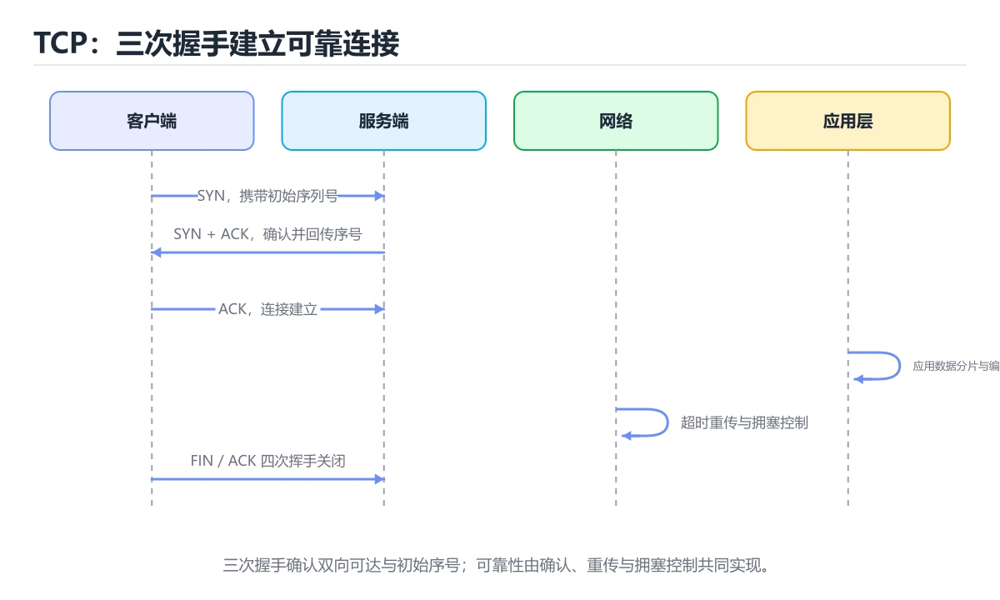

# TCP/IP 协议栈

> 内容更新时间：2026-10-06 · 学习阶段：基础 · 预计用时：45 分钟




## 本节知识框架

**课程定位**：所属分类 `network`（网络），课程主题 `TCP/IP 协议栈`，学习阶段 基础，建议用时 45 分钟。

本课主线：分层模型、三次握手与 TCP/UDP 的取舍。

**学完本课应当能够**
- 说清 `tcpdump` 与 `IP` 的含义与区别，并各举一个正例和一个反例。
- 用本课示例验证 `端口` 的行为，记录输入、输出与失败条件。
- 遇到「连接建立失败、`Connection refused`」这类问题时，能说出触发条件与修复顺序。

### 从概念到验证的学习链条

1. `tcpdump`：先掌握 掌握这两张表，`tcpdump` 的输出就能从"看不懂的字符"变成结论，再用它解释 `IP` 为什么会出现。
2. `IP`：先掌握 一句话概括：IP 负责送到哪台机器，TCP/UDP 负责送到哪个程序，TCP 额外保证可靠，再用它解释 `端口` 为什么会出现。
3. `端口`：先掌握 端口用于区分同一台主机上的不同服务，再用它解释 `三次握手` 为什么会出现。
4. `三次握手`：先掌握 SYN、SYN+ACK、ACK 三步建立连接并交换初始序列号，连接卡住经常就卡在这一步，再用它解释 `TCP` 为什么会出现。
5. `TCP`：先掌握 面向连接的可靠传输协议：握手建连、序号与重传保序，滑动窗口与拥塞控制决定吞吐，再用它解释 `拥塞控制` 为什么会出现。
6. `拥塞控制`：先掌握 TCP 根据网络反馈调整发送速率，避免丢包和排队崩溃，再用它解释 本课示例的观察结果 为什么会出现。

**先修与衔接**：本课是「网络」分类的第 5 课。先修内容：《HTTP 基础》。《HTTP 基础》里的 `状态码`、`Cookie` 是本课的前提。相关或后续课程：《DNS 域名解析》、《图解 TCP 握手、挥手与拥塞控制》。

### 完成判据

- **定义关**：不看正文也能说明 `tcpdump` 是 掌握这两张表，`tcpdump` 的输出就能从"看不懂的字符"变成结论，并指出一个反例。
- **机制关**：能按“输入 → 转换 → 输出 → 验证”复述 `TCP/IP 协议栈`，而不是只背结论。
- **示例关**：能运行或推演 `TCP/IP 协议栈` 的 `text` 示例，并说明一个真实出现的标识符或字面量。
- **证据关**：能从 `TCP/IP 协议栈` 的示例写出一个输入、处理、输出三元组，并说明它支持或反驳了本课的哪一条结论。
- **排错关**：能复现 连接建立失败、`Connection refused`，记录现象并按 `ss -tlnp` 确认监听地址与端口 修复。
- **迁移关**：能把 `TCP`、`UDP`、`IP`、`三次握手` 放进一个与 `TCP/IP 协议栈` 不同的项目场景，并保持输入与验证条件可追踪。
- **复盘关**：学完 `TCP/IP 协议栈` 后，用一句话写下仍然不确定的结论，并列出下一次验证需要的输入、环境和成功判据。

### 复习清单

- [ ] 能不看正文复述本课核心术语，并指出一个边界或反例。
- [ ] 能运行或推演本课示例，记录输入、输出与失败现象。
- [ ] 能完成一次自测，并把错题对照错误表定位原因。

**本课配图**


## 核心概念定义

| 术语 | 操作性定义 | 常见边界与风险 |
| --- | --- | --- |
| tcpdump | 掌握这两张表，tcpdump 的输出就能从"看不懂的字符"变成结论。 | 只在「掌握这两张表，tcpdump 的输出就能从"看不懂的字符"变成结论」这一前提下成立，换输入或换环境要重新验证。 |
| IP | 一句话概括：IP 负责送到哪台机器，TCP/UDP 负责送到哪个程序，TCP 额外保证可靠。 | 网络延迟、超时与版本协商会改变行为，只在真实链路或多版本客户端上验证才算数。 |
| 端口 | 端口用于区分同一台主机上的不同服务。 | 易错：服务未监听或端口不对；正确做法是`ss -tlnp` 确认监听地址与端口。 |
| 三次握手 | SYN、SYN+ACK、ACK 三步建立连接并交换初始序列号，连接卡住经常就卡在这一步。 | 只在「SYN、SYN+ACK、ACK 三步建立连接并交换初始序列号，连接卡住经常就卡在这一步」这一前提下成立，换输入或换环境要重新验证。 |
| TCP | 面向连接的可靠传输协议：握手建连、序号与重传保序，滑动窗口与拥塞控制决定吞吐 | 易错：启用了 Nagle 与小包混合；正确做法是交互场景开启 `TCP_NODELAY`。 |
| 拥塞控制 | TCP 根据网络反馈调整发送速率，避免丢包和排队崩溃 | 网络延迟、超时与版本协商会改变行为，只在真实链路或多版本客户端上验证才算数。 |
| 应用层 | HTTP、DNS、SMTP | 网络延迟、超时与版本协商会改变行为，只在真实链路或多版本客户端上验证才算数。 |
| 传输层 | TCP、UDP | 网络延迟、超时与版本协商会改变行为，只在真实链路或多版本客户端上验证才算数。 |
| 网络层 | IP、ICMP | 只在「IP、ICMP」这一前提下成立，换输入或换环境要重新验证。 |
| 链路层 | Ethernet、Wi-Fi | 只在「Ethernet、Wi-Fi」这一前提下成立，换输入或换环境要重新验证。 |

## 原理与运行机制

### 机制总览

**教材衔接：TCP 与 UDP 对比**

| 特性 | TCP | UDP |
| --- | --- | --- |
| 连接 | 面向连接 | 无连接 |
| 可靠性 | 可靠、有序 | 不保证 |
| 开销 | 较大 | 很小 |
| 典型场景 | 网页、文件传输 | 直播、游戏、DNS |

**教材衔接：抓包字段速查**

| 字段 | 含义 | 异常信号 |
| --- | --- | --- |
| Seq / Ack | 序号与确认号 | 序号重复出现 → 重传 |
| Flags | SYN/ACK/FIN/RST/PSH | RST → 连接被拒绝或强制关闭 |
| Window | 接收窗口大小 | 接近 0（零窗口）→ 接收方处理不过来 |
| MSS | 最大报文段长度 | 握手时协商，影响分段 |
| TTL | 生存时间 | 可用来粗判操作系统与是否被改写 |
| Retransmission | 重传标记 | 比例高说明丢包或链路抖动 |

**教材衔接：拥塞控制的四个阶段**

| 阶段 | 行为 | 触发条件 |
| --- | --- | --- |
| 慢启动 | 拥塞窗口 cwnd 从 1 个 MSS 开始，每 RTT 翻倍（指数增长） | 连接建立或超时重传后 |
| 拥塞避免 | 每 RTT 加 1 个 MSS（线性增长） | cwnd 达到慢启动阈值 ssthresh |
| 快速重传 | 收到 3 个重复 ACK 立即重传丢失报文，不等超时 | 乱序或丢包 |
| 快速恢复 | ssthresh 减半，cwnd 从新阈值开始线性增长 | 快速重传之后 |

超时重传比快速重传代价大得多：**超时会把 cwnd 直接打回 1 重新慢启动**，而快速恢复只把窗口减半。这就是为什么偶发丢包与超时对吞吐的影响差异巨大。

**教材衔接：不同拥塞控制算法**

| 算法 | 思路 | 特点 |
| --- | --- | --- |
| Reno | 丢包即减半 | 经典，高丢包链路吞吐掉得快 |
| CUBIC | 用三次函数增长窗口 | Linux 默认，适合高带宽长距离 |
| BBR | 主动探测带宽与 RTT，不以丢包为信号 | 在有损链路上表现好，需较新内核 |

抓包判读：连续看到同一 Seq 的重复 ACK 说明有丢包触发快速重传；看到 RTO 级别的间隔（数百毫秒以上）则是超时重传；吞吐上不去但延迟稳定，通常是窗口受限（带宽时延积不足）。

**教材衔接：TCP 状态速查**

| 状态 | 出现位置 | 含义 |
| --- | --- | --- |
| `LISTEN` | 服务端 | 等待连接 |
| `SYN_SENT` | 客户端 | 已发 SYN，等 SYN+ACK |
| `SYN_RCVD` | 服务端 | 收到 SYN 并回复，等 ACK |
| `ESTABLISHED` | 双方 | 连接已建立，可传数据 |
| `FIN_WAIT_1` / `FIN_WAIT_2` | 主动关闭方 | 已发 FIN，等待对方确认或关闭 |
| `CLOSE_WAIT` | 被动关闭方 | 收到 FIN，等应用程序调用 `close` |
| `LAST_ACK` | 被动关闭方 | 已发 FIN，等最后 ACK |
| `TIME_WAIT` | 主动关闭方 | 等 2MSL，确保对方收到 ACK、旧报文消散 |
| `CLOSED` | 双方 | 连接完全结束 |

`CLOSE_WAIT` 堆积说明应用忘记关闭连接；`TIME_WAIT` 过多通常来自短连接，可以复用连接或调整内核参数。

**教材衔接：握手挥手速查**

| 阶段 | 报文 | 关键信息 |
| --- | --- | --- |
| 三次握手 1 | SYN | 客户端初始序号 seq=x |
| 三次握手 2 | SYN + ACK | 服务端 seq=y，ack=x+1 |
| 三次握手 3 | ACK | 客户端 ack=y+1，连接建立 |
| 四次挥手 1 | FIN | 主动方不再发送数据 |
| 四次挥手 2 | ACK | 被动方确认收到 |
| 四次挥手 3 | FIN | 被动方数据也发完 |
| 四次挥手 4 | ACK | 主动方确认，进入 TIME_WAIT |

**教材衔接：验证步骤**

### 机制拆解：每一步的输入、动作与输出

#### 1. `tcpdump`
- 输入：`TCP`；本步把 掌握这两张表，`tcpdump` 的输出就能从"看不懂的字符"变成结论 当作判断规则。
- 动作：围绕 `tcpdump` 保留中间状态，并记录它与 `IP` 的对应关系。
- 输出：`IP`，它可以被下一段代码、测试或记录继续使用。
- `tcpdump` 的失败条件：只在「掌握这两张表，`tcpdump` 的输出就能从"看不懂的字符"变成结论」这一前提下成立，换输入或换环境要重新验证。

#### 2. `IP`
- 输入：`tcpdump`；本步把 一句话概括：IP 负责送到哪台机器，TCP/UDP 负责送到哪个程序，TCP 额外保证可靠 当作判断规则。
- 动作：围绕 `IP` 保留中间状态，并记录它与 `端口` 的对应关系。
- 输出：`端口`，它可以被下一段代码、测试或记录继续使用。
- `IP` 的失败条件：网络延迟、超时与版本协商会改变行为，只在真实链路或多版本客户端上验证才算数。

#### 3. `端口`
- 输入：`IP`；本步把 端口用于区分同一台主机上的不同服务 当作判断规则。
- 动作：围绕 `端口` 保留中间状态，并记录它与 `三次握手` 的对应关系。
- 输出：`三次握手`，它可以被下一段代码、测试或记录继续使用。
- `端口` 的失败条件：当连接建立失败、`Connection refused`时，会出现服务未监听或端口不对。

#### 4. `三次握手`
- 输入：`端口`；本步把 SYN、SYN+ACK、ACK 三步建立连接并交换初始序列号，连接卡住经常就卡在这一步 当作判断规则。
- 动作：围绕 `三次握手` 保留中间状态，并记录它与 `TCP` 的对应关系。
- 输出：`TCP`，它可以被下一段代码、测试或记录继续使用。
- `三次握手` 的失败条件：只在「SYN、SYN+ACK、ACK 三步建立连接并交换初始序列号，连接卡住经常就卡在这一步」这一前提下成立，换输入或换环境要重新验证。

#### 5. `TCP`
- 输入：`三次握手`；本步把 面向连接的可靠传输协议：握手建连、序号与重传保序，滑动窗口与拥塞控制决定吞吐 当作判断规则。
- 动作：围绕 `TCP` 保留中间状态，并记录它与 `拥塞控制` 的对应关系。
- 输出：`拥塞控制`，它可以被下一段代码、测试或记录继续使用。
- `TCP` 的失败条件：当延迟忽高忽低时，会出现启用了 Nagle 与小包混合。

#### 6. `拥塞控制`
- 输入：`TCP`；本步把 TCP 根据网络反馈调整发送速率，避免丢包和排队崩溃 当作判断规则。
- 动作：围绕 `拥塞控制` 保留中间状态，并记录它与 `本课示例的最终结果` 的对应关系。
- 输出：`本课示例的最终结果`，它可以被下一段代码、测试或记录继续使用。
- `拥塞控制` 的失败条件：网络延迟、超时与版本协商会改变行为，只在真实链路或多版本客户端上验证才算数。

### 复现实验记录

- 环境：`TCP/IP 协议栈` 使用 `text` 示例，固定 `TCP`、`UDP`、`IP`、`三次握手` 作为第一组条件。
- 首轮输入：从示例中的第一个输入开始，预测 `tcpdump` 会怎样变化。
- 基线观察：记录命令、输入、输出和错误原文，不用截图代替可复制的文本。
- 单变量修改：只改变 `TCP`，观察 `拥塞控制` 是否仍满足定义。
- 失败注入：复现 连接建立失败、`Connection refused`，确认现象是 服务未监听或端口不对。
- 记录结论：把“修改前、修改后、预期变化、实际变化”写成四列表，这样复盘 `TCP/IP 协议栈` 时才能区分概念错误与实现错误。

## 典型应用场景

- **连接建立失败、`Connection refused`**：典型现象是服务未监听或端口不对；正确做法是`ss -tlnp` 确认监听地址与端口。
- **连接一直卡住、`timeout`**：典型现象是防火墙丢包或路由不可达；正确做法是用 `nc` 与 `mtr` 逐段排查。
- **`CLOSE_WAIT` 大量堆积**：典型现象是代码没关闭连接；正确做法是检查 `finally` 中是否 `close`，连接池是否泄漏。
- **`TIME_WAIT` 大量堆积**：典型现象是频繁短连接；正确做法是启用长连接与连接池，必要时调整内核参数。

### 最小验证场景

- 准备：保留 `text` 示例的原始输入，先记录 `TCP/IP 协议栈` 的基线输出和完整运行命令。
- 判定：新结果与 `TCP/IP 协议栈` 的基线不同不等于错误；只有当差异破坏了 `tcpdump` 的定义或错误表中的约束，才判定为失败。

### 选择与边界

- 使用 `tcpdump` 时，先满足它的定义：掌握这两张表，`tcpdump` 的输出就能从"看不懂的字符"变成结论；只在「掌握这两张表，`tcpdump` 的输出就能从"看不懂的字符"变成结论」这一前提下成立，换输入或换环境要重新验证。
- 使用 `IP` 时，先满足它的定义：一句话概括：IP 负责送到哪台机器，TCP/UDP 负责送到哪个程序，TCP 额外保证可靠；网络延迟、超时与版本协商会改变行为，只在真实链路或多版本客户端上验证才算数。
- 使用 `端口` 时，先满足它的定义：端口用于区分同一台主机上的不同服务；易错：服务未监听或端口不对；正确做法是`ss -tlnp` 确认监听地址与端口。
- 使用 `三次握手` 时，先满足它的定义：SYN、SYN+ACK、ACK 三步建立连接并交换初始序列号，连接卡住经常就卡在这一步；只在「SYN、SYN+ACK、ACK 三步建立连接并交换初始序列号，连接卡住经常就卡在这一步」这一前提下成立，换输入或换环境要重新验证。
- 使用 `TCP` 时，先满足它的定义：面向连接的可靠传输协议：握手建连、序号与重传保序，滑动窗口与拥塞控制决定吞吐；易错：启用了 Nagle 与小包混合；正确做法是交互场景开启 `TCP_NODELAY`。

## 代码/协议/SQL 示例

### 最小可验证示例

```text
[以太网头][IP 头][TCP 头][HTTP 数据][以太网尾]
```

**教材衔接：IP：负责寻址**

IP 地址标识一台主机，路由器和交换机根据 IP 头把数据包一跳一跳转发到目的地。IP 协议**不保证可靠**：包可能丢失、乱序、重复。

```text
本机地址示例：192.168.1.10
公网地址示例：203.0.113.7
```

**教材衔接：TCP：负责可靠**

TCP 在不可靠的 IP 之上实现可靠传输，主要机制：

1. **三次握手**建立连接。
2. **序号 + 确认应答**保证不丢、不重、有序。
3. **超时重传**处理丢包。
4. **滑动窗口**做流量控制。
5. **拥塞控制**避免压垮网络。

三次握手：

```text
客户端 --SYN(seq=x)-->        服务器
客户端 <--SYN+ACK(seq=y,ack=x+1)-- 服务器
客户端 --ACK(ack=y+1)-->      服务器
```

四次挥手用于释放连接，因为 TCP 是全双工的，两个方向要分别关闭。

**教材衔接：端口**

端口用于区分同一台主机上的不同服务：

```text
HTTP   80
HTTPS  443
SSH    22
MySQL  3306
```

**教材衔接：排查命令速查**

| 目的 | 命令 | 说明 |
| --- | --- | --- |
| 看连接状态统计 | `ss -s` | 各类 socket 数量总览 |
| 看 TCP 连接列表 | `ss -tanp` | `-p` 显示进程，`-t` 只看 TCP |
| 看监听端口 | `ss -tlnp` | 确认服务是否真的在监听 |
| 统计 TIME_WAIT | `ss -tan \| awk '{print $1}' \| sort \| uniq -c` | 判断短连接是否过多 |
| 看丢包与重传 | `netstat -s \| grep -i retrans` | 重传率高说明网络质量差 |
| 抓包看三次握手 | `tcpdump -i any port 8080 -w a.pcap` | 用 Wireshark 逐包分析 |
| 测连通与延迟 | `ping`、`mtr` | `mtr` 能看每一跳丢包 |
| 测端口可达 | `nc -zv host port` | 快速验证防火墙与监听 |

**教材衔接：深入补充：TCP/IP 协议栈 的取舍与边界**


### 四、自测清单

- 能否用一句话说出TCP/IP 协议栈解决的核心问题与不适用场景？
- 能否画出 TCP 的数据流或状态变化，并标出失败路径？
- 把 HTTPS 的输入推到边界，说明本课哪一条结论会先失效。
- 能否写出一条可复现的验证命令，让别人独立得到相同结论？

**教材衔接：最小可运行示例**

下面示例用于验证 TCP 的最小输入、处理和输出。先原样运行，再只修改一个值：

```python
import socket

print(socket.gethostbyname("localhost"))
```

**教材衔接：预期输出**

```text
127.0.0.1
```

### 示例精读：先找证据，再改一个条件

- 在 `TCP/IP 协议栈` 中与 `tcpdump` 对照：示例必须能支持 掌握这两张表，`tcpdump` 的输出就能从"看不懂的字符"变成结论，否则说明这一段还缺少实现或验证步骤。
- 在 `TCP/IP 协议栈` 中与 `IP` 对照：示例必须能支持 一句话概括：IP 负责送到哪台机器，TCP/UDP 负责送到哪个程序，TCP 额外保证可靠，否则说明这一段还缺少实现或验证步骤。
- 在 `TCP/IP 协议栈` 中与 `端口` 对照：示例必须能支持 端口用于区分同一台主机上的不同服务，否则说明这一段还缺少实现或验证步骤。
- 在 `TCP/IP 协议栈` 中与 `三次握手` 对照：示例必须能支持 SYN、SYN+ACK、ACK 三步建立连接并交换初始序列号，连接卡住经常就卡在这一步，否则说明这一段还缺少实现或验证步骤。
- `TCP/IP 协议栈` 的示例没有抽取到函数调用或字面量；按行记录输入、控制流和输出，避免只背代码外形。

## 时间/空间复杂度或性能分析

**性能关注点（TCP/IP 协议栈）**：往返延迟与带宽是主要成本：记录 RTT、吞吐与重传率，区分局域网与真实链路。

**本课特有开销（TCP/IP 协议栈 · TCP）**：重试与超时会成倍放大尾延迟，记录 P99 而不是平均值。

**测量方法**：以 `TCP/IP 协议栈` 的 `TCP` 场景为对象，固定输入跑一遍记录基线，再把规模或并发度提高一个数量级复测；两次结果的差值与波动范围才是结论依据。

### 需要控制的变量与记录项

- `TCP/IP 协议栈` 的 `TCP`：固定它的版本、输入范围和资源上限，分别记录速度、内存与失败率的变化。
- `TCP/IP 协议栈` 的 `UDP`：固定它的版本、输入范围和资源上限，分别记录速度、内存与失败率的变化。
- `TCP/IP 协议栈` 的 `IP`：固定它的版本、输入范围和资源上限，分别记录速度、内存与失败率的变化。
- `TCP/IP 协议栈` 的 `三次握手`：固定它的版本、输入范围和资源上限，分别记录速度、内存与失败率的变化。
- `TCP/IP 协议栈` 的 `端口`：固定它的版本、输入范围和资源上限，分别记录速度、内存与失败率的变化。
- `TCP/IP 协议栈` 中 `tcpdump` 的边界：只在「掌握这两张表，`tcpdump` 的输出就能从"看不懂的字符"变成结论」这一前提下成立，换输入或换环境要重新验证。达到边界时不要外推，必须重新测量。
- `TCP/IP 协议栈` 中 `IP` 的边界：网络延迟、超时与版本协商会改变行为，只在真实链路或多版本客户端上验证才算数。达到边界时不要外推，必须重新测量。
- `TCP/IP 协议栈` 中 `端口` 的边界：易错：服务未监听或端口不对；正确做法是`ss -tlnp` 确认监听地址与端口。达到边界时不要外推，必须重新测量。
- `TCP/IP 协议栈` 中 `三次握手` 的边界：只在「SYN、SYN+ACK、ACK 三步建立连接并交换初始序列号，连接卡住经常就卡在这一步」这一前提下成立，换输入或换环境要重新验证。达到边界时不要外推，必须重新测量。
- `TCP/IP 协议栈` 中 `TCP` 的边界：易错：启用了 Nagle 与小包混合；正确做法是交互场景开启 `TCP_NODELAY`。达到边界时不要外推，必须重新测量。

## 常见误区与易错点

| 容易写错的做法 | 实际现象 | 原因与正确做法 |
| --- | --- | --- |
| 连接建立失败、`Connection refused` | 服务未监听或端口不对 | `ss -tlnp` 确认监听地址与端口 |
| 连接一直卡住、`timeout` | 防火墙丢包或路由不可达 | 用 `nc` 与 `mtr` 逐段排查 |
| `CLOSE_WAIT` 大量堆积 | 代码没关闭连接 | 检查 `finally` 中是否 `close`，连接池是否泄漏 |
| `TIME_WAIT` 大量堆积 | 频繁短连接 | 启用长连接与连接池，必要时调整内核参数 |
| 请求偶发超时、重传高 | 网络抖动或 MTU 不匹配 | 抓包看重传，检查 MTU 与中间设备 |
| 大量连接时服务端拒绝 | `backlog` 太小 | 调大 `listen` 的 backlog 与 `somaxconn` |
| 延迟忽高忽低 | 启用了 Nagle 与小包混合 | 交互场景开启 `TCP_NODELAY` |
| 上传大文件中途失败 | 中间设备超时断开 | 加心跳、分块重传与断点续传 |
| 连接建立失败、Connection refused | 服务未监听或端口不对。 | ss -tlnp 确认监听地址与端口。 |
| 连接一直卡住、timeout | 防火墙丢包或路由不可达。 | 用 nc 与 mtr 逐段排查。 |
| CLOSE_WAIT 大量堆积 | 代码没关闭连接。 | 检查 finally 中是否 close，连接池是否泄漏。 |

### 现场 1：连接建立失败、`Connection refused`

**症状**：服务未监听或端口不对。

**根因与修复**：`ss -tlnp` 确认监听地址与端口。

**自检**：在本课示例里复现「连接建立失败、`Connection refused`」，改成`ss -tlnp` 确认监听地址与端口后重跑；如果症状消失且失败路径按预期变化，说明定位正确。

### 现场 2：连接一直卡住、`timeout`

**症状**：防火墙丢包或路由不可达。

**根因与修复**：用 `nc` 与 `mtr` 逐段排查。

**自检**：在本课示例里复现「连接一直卡住、`timeout`」，改成用 `nc` 与 `mtr` 逐段排查后重跑；如果症状消失且失败路径按预期变化，说明定位正确。

### 现场 3：`CLOSE_WAIT` 大量堆积

**症状**：代码没关闭连接。

**根因与修复**：检查 `finally` 中是否 `close`，连接池是否泄漏。

**自检**：在本课示例里复现「`CLOSE_WAIT` 大量堆积」，改成检查 `finally` 中是否 `close`，连接池是否泄漏后重跑；如果症状消失且失败路径按预期变化，说明定位正确。

### 现场 4：`TIME_WAIT` 大量堆积

**症状**：频繁短连接。

**根因与修复**：启用长连接与连接池，必要时调整内核参数。

**自检**：在本课示例里复现「`TIME_WAIT` 大量堆积」，改成启用长连接与连接池，必要时调整内核参数后重跑；如果症状消失且失败路径按预期变化，说明定位正确。

### 现场 5：请求偶发超时、重传高

**症状**：网络抖动或 MTU 不匹配。

**根因与修复**：抓包看重传，检查 MTU 与中间设备。

**自检**：在本课示例里复现「请求偶发超时、重传高」，改成抓包看重传，检查 MTU 与中间设备后重跑；如果症状消失且失败路径按预期变化，说明定位正确。

### 现场 6：大量连接时服务端拒绝

**症状**：`backlog` 太小。

**根因与修复**：调大 `listen` 的 backlog 与 `somaxconn`。

**自检**：在本课示例里复现「大量连接时服务端拒绝」，改成调大 `listen` 的 backlog 与 `somaxconn`后重跑；如果症状消失且失败路径按预期变化，说明定位正确。

### 现场 7：延迟忽高忽低

**症状**：启用了 Nagle 与小包混合。

**根因与修复**：交互场景开启 `TCP_NODELAY`。

**自检**：在本课示例里复现「延迟忽高忽低」，改成交互场景开启 `TCP_NODELAY`后重跑；如果症状消失且失败路径按预期变化，说明定位正确。

### 现场 8：上传大文件中途失败

**症状**：中间设备超时断开。

**根因与修复**：加心跳、分块重传与断点续传。

**自检**：在本课示例里复现「上传大文件中途失败」，改成加心跳、分块重传与断点续传后重跑；如果症状消失且失败路径按预期变化，说明定位正确。

### 现场 9：连接建立失败、Connection refused

**症状**：服务未监听或端口不对。

**根因与修复**：ss -tlnp 确认监听地址与端口。

**自检**：在本课示例里复现「连接建立失败、Connection refused」，改成ss -tlnp 确认监听地址与端口后重跑；如果症状消失且失败路径按预期变化，说明定位正确。

## 与其他知识点的关系

- **先修**：`HTTP 基础`。本课默认这些内容已经掌握。
- **相关或后续**：`DNS 域名解析`、`图解 TCP 握手、挥手与拥塞控制`。本课术语会在这些课程里继续使用。
- **术语归属**：`tcpdump`、`IP`、`端口` 的定义以本课「核心概念定义」为准，换到其他课程时先确认定义是否被改写。
- 同一分类的《IP、子网与传输层深入》也涉及 `IP`；两课衔接时先确认这个术语的定义是否一致。
- 同一分类的《Socket 编程实战》也涉及 `TCP`；两课衔接时先确认这个术语的定义是否一致。

### 先修与后续术语接口

- `HTTP 基础`：两者通过本分类的学习顺序衔接，阅读时重点比较各自的输入与失败条件。
- `DNS 域名解析`：两者通过本分类的学习顺序衔接，阅读时重点比较各自的输入与失败条件。
- `图解 TCP 握手、挥手与拥塞控制`：共享术语 `TCP`、`三次握手`、`拥塞控制`，共同关键词 `TCP`、`三次握手`。

### 容易混淆的相邻概念

- `tcpdump` 与 `IP`：前者强调 掌握这两张表，`tcpdump` 的输出就能从"看不懂的字符"变成结论；后者强调 一句话概括：IP 负责送到哪台机器，TCP/UDP 负责送到哪个程序，TCP 额外保证可靠。判断时分别检查两条定义的适用范围，不要只看名称相似就互换。
- `IP` 与 `端口`：前者强调 一句话概括：IP 负责送到哪台机器，TCP/UDP 负责送到哪个程序，TCP 额外保证可靠；后者强调 端口用于区分同一台主机上的不同服务。判断时分别检查两条定义的适用范围，不要只看名称相似就互换。
- `端口` 与 `三次握手`：前者强调 端口用于区分同一台主机上的不同服务；后者强调 SYN、SYN+ACK、ACK 三步建立连接并交换初始序列号，连接卡住经常就卡在这一步。判断时分别检查两条定义的适用范围，不要只看名称相似就互换。
- `三次握手` 与 `TCP`：前者强调 SYN、SYN+ACK、ACK 三步建立连接并交换初始序列号，连接卡住经常就卡在这一步；后者强调 面向连接的可靠传输协议：握手建连、序号与重传保序，滑动窗口与拥塞控制决定吞吐。判断时分别检查两条定义的适用范围，不要只看名称相似就互换。
- `TCP` 与 `拥塞控制`：前者强调 面向连接的可靠传输协议：握手建连、序号与重传保序，滑动窗口与拥塞控制决定吞吐；后者强调 TCP 根据网络反馈调整发送速率，避免丢包和排队崩溃。判断时分别检查两条定义的适用范围，不要只看名称相似就互换。

## 自测题与参考答案

> 先独立作答，再对照参考答案；答案都能在本课正文、术语表或错误表里找到依据。

### 自测 1（概念复述）

不看正文，写出 `tcpdump` 的操作性定义，并说明它与 `IP` 的区别。

**参考答案**：掌握这两张表，`tcpdump` 的输出就能从"看不懂的字符"变成结论。

`IP` 的定位是：一句话概括：IP 负责送到哪台机器，TCP/UDP 负责送到哪个程序，TCP 额外保证可靠；两者的差别要从适用对象与失败模式上说明。

### 自测 2（排错）

本课错误表记录了「连接建立失败、`Connection refused`」这类做法。请写出它会出现的现象、根因，以及修复顺序。

**参考答案**：现象是服务未监听或端口不对；正确做法是`ss -tlnp` 确认监听地址与端口。修复时先复现现象并保留证据，再改动一处假设重跑，确认现象消失。

### 自测 3（动手验证）

运行本课的 `text` 示例，改动其中一个输入后重新运行，记录输出与错误信息。

**参考答案**：正常输入下 `text` 示例应当复现正文给出的结果；改动输入后，如果结果改变或报错，先核对它是否满足 `TCP/IP 协议栈` 中`tcpdump` 的适用范围，再检查错误表里是否有同类现象。

### 自测 4（代码阅读）

阅读本课开头的 `text` 示例，说明它体现了`tcpdump` 的哪一条性质，并指出改动哪个输入会让这条性质不再成立。

**参考答案**：`tcpdump` 的定义是 掌握这两张表，`tcpdump` 的输出就能从"看不懂的字符"变成结论，示例正是在实现这条定义。改动与 `tcpdump` 有关的一个输入后，如果结果不再符合 `TCP/IP 协议栈` 的正文描述，就说明该性质只在当前前提成立。

### 自测 5（迁移）

把 `TCP/IP 协议栈` 的方法迁移到自己的项目：围绕 `tcpdump` 写出一个与错误表同类的风险点，并说明触发条件和检验方式。

**参考答案**：例如「CLOSE_WAIT 大量堆积」，它会导致代码没关闭连接；检验方式是按检查 finally 中是否 close，连接池是否泄漏改一处再复现，确认现象消失且没有引入新的失败分支。

### 自测 6（对比）

用一个表格对比 `tcpdump` 与 `IP`：各写一行适用场景、一行失败表现。

**参考答案**：`tcpdump` 的定义是掌握这两张表，`tcpdump` 的输出就能从"看不懂的字符"变成结论；`IP` 的定义是一句话概括：IP 负责送到哪台机器，TCP/UDP 负责送到哪个程序，TCP 额外保证可靠。两者的失败表现分别对应本课错误表里与本术语相关的行。

### 自测 7（排错顺序）

面对「连接建立失败、`Connection refused`」引发的问题，请把“复现 服务未监听或端口不对 → 保留证据 → `ss -tlnp` 确认监听地址与端口 → 回归验证”四步写成可执行的检查清单。

**参考答案**：第一步按服务未监听或端口不对复现；第二步记录输入、版本与完整报错；第三步按`ss -tlnp` 确认监听地址与端口只改一处；第四步重跑并确认失败路径也按预期变化。

### 自测 8（边界判断）

针对 `拥塞控制`，分别写出“可以使用”的条件和“结论不再成立”的条件。

**参考答案**：网络延迟、超时与版本协商会改变行为，只在真实链路或多版本客户端上验证才算数。 同时要把 `拥塞控制` 的定义 TCP 根据网络反馈调整发送速率，避免丢包和排队崩溃 与实际输入逐项对照。

### 自测 9（机制重建）

不看正文，按输入、转换、输出、验证四段重建 `tcpdump` → `IP` → `端口` → `三次握手` 的作用链。

**参考答案**：起点是 `tcpdump` 的定义 掌握这两张表，`tcpdump` 的输出就能从"看不懂的字符"变成结论；中间每一步都保留可观察状态；终点由 `拥塞控制` 检查，失败时回到错误表定位第一个偏离定义的步骤。

### 自测 10（综合排错）

在 `TCP/IP 协议栈` 中，现象是 代码没关闭连接。请围绕 CLOSE_WAIT 大量堆积 写出最小复现、关键证据、修复动作和回归验证，并说明为什么不能只凭一次运行下结论。

**参考答案**：先复现 CLOSE_WAIT 大量堆积，记录输入与完整错误；再按 检查 finally 中是否 close，连接池是否泄漏 只改一处。回归时同时跑正常路径和边界路径，只有两次结果都可解释，才把修复视为完成。

### 自测 11（一分钟复述）

用每分钟约 200 字的速度复述 `TCP/IP 协议栈`：先给主问题，再按顺序说出 `tcpdump`、`IP`、`端口`、`三次握手`，最后给一个失败案例。

**自评标准**：主问题必须对应 分层模型、三次握手与 TCP/UDP 的取舍；每个术语都要能接上一句定义或边界；失败案例必须写成可观察现象，不能用“可能有风险”代替证据。

## 术语速查

| 术语 | 一句话说明 |
| --- | --- |
| `tcpdump` | 掌握这两张表，`tcpdump` 的输出就能从"看不懂的字符"变成结论。 |
| `IP` | 一句话概括：IP 负责送到哪台机器，TCP/UDP 负责送到哪个程序，TCP 额外保证可靠。 |
| `端口` | 端口用于区分同一台主机上的不同服务。 |
| `三次握手` | SYN、SYN+ACK、ACK 三步建立连接并交换初始序列号，连接卡住经常就卡在这一步。 |
| `TCP` | 面向连接的可靠传输协议：握手建连、序号与重传保序，滑动窗口与拥塞控制决定吞吐。 |
| `拥塞控制` | TCP 根据网络反馈调整发送速率，避免丢包和排队崩溃。 |

**术语关系**：`tcpdump`（掌握这两张表） → `IP`（一句话概括：IP 负责送到哪台机器） → `端口`（端口用于区分同一台主机上的不同服务） → `三次握手`（SYN、SYN+ACK、ACK 三步建立连接并交换初始序列号）。

## 考点精讲

`TCP/IP 协议栈` 的题库有 6 道题，下面逐题给出题干、正确项与判断依据：先自己作答，再核对正确项，最后回到正文对应小节复核。

### 考点 1：第 1 题

- **题目**：下面哪一项不属于 TCP 保证可靠性的机制？
- **正确项**：向所有主机广播
- **判断依据**：这道题落在术语 `TCP` 上：面向连接的可靠传输协议：握手建连、序号与重传保序，滑动窗口与拥塞控制决定吞吐。复习时把 `TCP` 的定义、适用边界和一个反例一起说清楚，再回到「核心概念定义」核对原文。

### 考点 2：第 2 题

- **题目**：TCP 三次握手的第二步，服务器发送什么？
- **正确项**：SYN + ACK
- **判断依据**：这道题落在术语 `三次握手` 上：SYN、SYN+ACK、ACK 三步建立连接并交换初始序列号，连接卡住经常就卡在这一步。复习时把 `三次握手` 的定义、适用边界和一个反例一起说清楚，再回到「核心概念定义」核对原文。

### 考点 3：第 3 题

- **题目**：围绕“TCP/IP 协议栈”中的 TCP、UDP、IP，下列哪两项是本课强调的实践判断？
- **正确项**：学习 TCP 时要同时说明输入、输出和失败路径，不能只看正常流程；验证 UDP 时要固定版本并覆盖边界输入，结论才可复现
- **判断依据**：这道题落在术语 `IP` 上：一句话概括：IP 负责送到哪台机器，TCP/UDP 负责送到哪个程序，TCP 额外保证可靠。复习时把 `IP` 的定义、适用边界和一个反例一起说清楚，再回到「核心概念定义」核对原文。

### 考点 4：第 4 题

- **题目**：这段 `python` 代码对应 `TCP/IP 协议栈` 的 `tcpdump`。课程要解决的是分层模型、三次握手与 TCP/UDP 的取舍。关于代码内容，哪一项说法准确？
- **正确项**：这段示例用于说明本课术语 `IP` 的行为
- **判断依据**：这道题落在术语 `tcpdump` 上：掌握这两张表，`tcpdump` 的输出就能从"看不懂的字符"变成结论。复习时把 `tcpdump` 的定义、适用边界和一个反例一起说清楚，再回到「核心概念定义」核对原文。

### 考点 5：第 5 题

- **题目**：TCP 慢启动阶段拥塞窗口如何变化？
- **正确项**：从较小值开始按指数增长
- **判断依据**：这道题落在术语 `TCP` 上：面向连接的可靠传输协议：握手建连、序号与重传保序，滑动窗口与拥塞控制决定吞吐。复习时把 `TCP` 的定义、适用边界和一个反例一起说清楚，再回到「核心概念定义」核对原文。

### 考点 6：第 6 题

- **题目**：填空：补齐下面这段术语说明中的空缺。课程 `分层模型、三次握手与 TCP/UDP 的取舍。`，这段说明是：`____`：SYN、SYN+ACK、ACK 三步建立连接并交换初始序列号，连接卡住经常就卡在这一步。空缺处应填哪个术语？
- **正确项**：三次握手
- **判断依据**：这道题落在术语 `三次握手` 上：SYN、SYN+ACK、ACK 三步建立连接并交换初始序列号，连接卡住经常就卡在这一步。复习时把 `三次握手` 的定义、适用边界和一个反例一起说清楚，再回到「核心概念定义」核对原文。

### 考点 7：`tcpdump`

- **要点**：掌握这两张表，`tcpdump` 的输出就能从"看不懂的字符"变成结论。
- **tcpdump 的边界**：只在「掌握这两张表，`tcpdump` 的输出就能从"看不懂的字符"变成结论」这一前提下成立，换输入或换环境要重新验证。

### 考点 8：`IP`

- **要点**：一句话概括：IP 负责送到哪台机器，TCP/UDP 负责送到哪个程序，TCP 额外保证可靠。
- **IP 的边界**：网络延迟、超时与版本协商会改变行为，只在真实链路或多版本客户端上验证才算数。

### 考点 9：`端口`

- **要点**：端口用于区分同一台主机上的不同服务。
- **端口 的边界**：易错：服务未监听或端口不对；正确做法是`ss -tlnp` 确认监听地址与端口。

### 考点 10：`三次握手`

- **要点**：SYN、SYN+ACK、ACK 三步建立连接并交换初始序列号，连接卡住经常就卡在这一步。
- **三次握手 的边界**：只在「SYN、SYN+ACK、ACK 三步建立连接并交换初始序列号，连接卡住经常就卡在这一步」这一前提下成立，换输入或换环境要重新验证。

### 考点 11：`TCP`

- **要点**：面向连接的可靠传输协议：握手建连、序号与重传保序，滑动窗口与拥塞控制决定吞吐
- **TCP 的边界**：易错：启用了 Nagle 与小包混合；正确做法是交互场景开启 `TCP_NODELAY`。

### 考点 12：`拥塞控制`

- **要点**：TCP 根据网络反馈调整发送速率，避免丢包和排队崩溃
- **拥塞控制 的边界**：网络延迟、超时与版本协商会改变行为，只在真实链路或多版本客户端上验证才算数。

### 考点 13：排错——连接建立失败、`Connection refused`

- **现象**：服务未监听或端口不对。
- **处理**：`ss -tlnp` 确认监听地址与端口。

### 考点 14：排错——连接一直卡住、`timeout`

- **现象**：防火墙丢包或路由不可达。
- **处理**：用 `nc` 与 `mtr` 逐段排查。

### 考点 15：综合辨析——`tcpdump` 与 `拥塞控制`

- **辨析点**：`tcpdump` 的定义是 掌握这两张表，`tcpdump` 的输出就能从"看不懂的字符"变成结论；`拥塞控制` 的定义是 TCP 根据网络反馈调整发送速率，避免丢包和排队崩溃。
- **答题要求**：面对 `TCP/IP 协议栈` 的题目，先判断描述的是 `tcpdump` 还是 `拥塞控制`，再归到对应定义，最后写出一个会让该定义失效的边界输入。

### 考点 16：排错评分点

- **现象分**：能写出 服务未监听或端口不对，而不是只写“程序有错”。
- **证据分**：保留触发 连接建立失败、`Connection refused` 的输入、版本和错误原文。
- **修复分**：按 `ss -tlnp` 确认监听地址与端口 只改一处，并同时回归正常路径与边界路径。

## 内容元数据

- 内容版本：v2.0
- 最后更新：2026-10-06
- 学习阶段：基础
- 适用环境：TCP/IP、HTTP/2、HTTP/3 与现代网络栈；本课聚焦其中的 TCP。
- 内容来源：内置结构化课程与工程实践整理
- 相关主题：TCP、UDP、IP、三次握手、端口、协议栈
- 质量版本：P0 测验标准 + P1 覆盖扩展 + P2 体验补全

## 参考资料与复核

- 最后复核：2026-10-04
- 下次复核：2027-06-24
- 复核范围：版本兼容、API 行为、安全建议与工程实践
- 来源性质：官方文档、标准或权威教材；本课核对关键词：TCP、UDP、IP、三次握手、端口、协议栈。

| 参考资料 | 本课用途 |
| --- | --- |
| [RFC 9293 TCP](https://www.rfc-editor.org/rfc/rfc9293) | TCP 连接、重传与拥塞 |
| [IANA 协议注册表](https://www.iana.org/protocols) | 端口、协议号与参数 |
| [RFC 9000 QUIC](https://www.rfc-editor.org/rfc/rfc9000) | QUIC 传输与连接迁移 |

| [本课术语索引：TCP/IP 协议栈](#核心概念定义) | 按本课输入、术语边界和错误表现逐项核对 |
> 「TCP/IP 协议栈」的链接用于离线阅读后的延伸核对；App 不会自动联网。