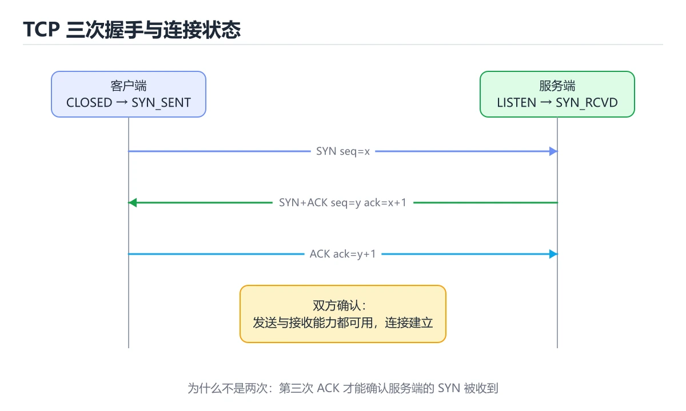
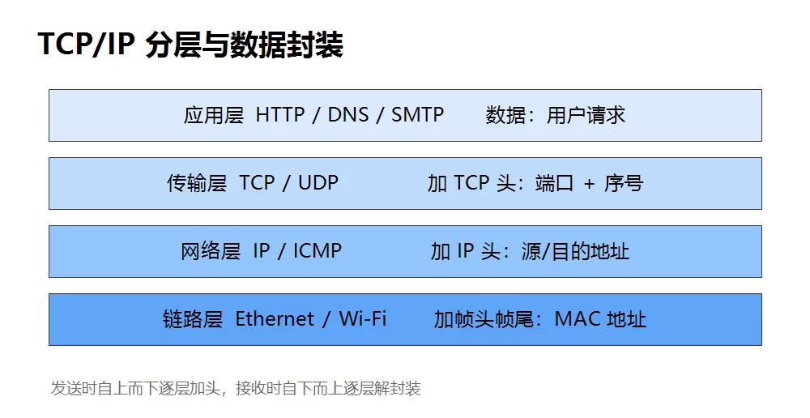

# TCP/IP 协议栈



> 内容更新时间：2026-10-03 · 学习阶段：进阶 · 预计用时：15 分钟

## 学习目标

- 能用自己的话解释「TCP/IP 协议栈」解决了什么问题，而不是只背术语。
- 能说清 「TCP」、「UDP」、「IP」、「三次握手」 之间的关系，并分别举出一个例子。
- 能把本课知识放回「网络」的知识体系，说明它和相邻主题的边界。
- 能完成本课练习，并用验收标准检查自己的结果。

> 一句话摘要：分层模型、三次握手与 TCP/UDP 的取舍。

## 前置知识

- 先完成上一课《HTTP 基础》；如果已经掌握，可以直接用本课练习自测。
- 本课阶段：进阶。建议先掌握同一分类的基础课程，并能独立运行正文中的最小示例。
- 开始前先复习：TCP、UDP、IP。
- 如果某一步看不懂，先记录具体卡点，完成练习后再回头读一遍。




## 分层模型

网络通信被拆成多层，每一层只关心自己的职责：

| 层 | 典型协议 | 解决的问题 |
| --- | --- | --- |
| 应用层 | HTTP、DNS、SMTP | 业务数据格式 |
| 传输层 | TCP、UDP | 端到端传输、端口 |
| 网络层 | IP、ICMP | 寻址与路由 |
| 链路层 | Ethernet、Wi-Fi | 相邻设备间传输 |

发送时数据自上而下逐层封装，接收时自下而上逐层解封装：

```text
[以太网头][IP 头][TCP 头][HTTP 数据][以太网尾]
```

## IP：负责寻址

IP 地址标识一台主机，路由器和交换机根据 IP 头把数据包一跳一跳转发到目的地。IP 协议**不保证可靠**：包可能丢失、乱序、重复。

```text
本机地址示例：192.168.1.10
公网地址示例：203.0.113.7
```

## TCP：负责可靠

TCP 在不可靠的 IP 之上实现可靠传输，主要机制：

1. **三次握手**建立连接。
2. **序号 + 确认应答**保证不丢、不重、有序。
3. **超时重传**处理丢包。
4. **滑动窗口**做流量控制。
5. **拥塞控制**避免压垮网络。

三次握手：

```text
客户端 --SYN(seq=x)-->        服务器
客户端 <--SYN+ACK(seq=y,ack=x+1)-- 服务器
客户端 --ACK(ack=y+1)-->      服务器
```

四次挥手用于释放连接，因为 TCP 是全双工的，两个方向要分别关闭。

## TCP 与 UDP 对比

| 特性 | TCP | UDP |
| --- | --- | --- |
| 连接 | 面向连接 | 无连接 |
| 可靠性 | 可靠、有序 | 不保证 |
| 开销 | 较大 | 很小 |
| 典型场景 | 网页、文件传输 | 直播、游戏、DNS |

## 端口

端口用于区分同一台主机上的不同服务：

```text
HTTP   80
HTTPS  443
SSH    22
MySQL  3306
```

## 抓包字段速查

| 字段 | 含义 | 异常信号 |
| --- | --- | --- |
| Seq / Ack | 序号与确认号 | 序号重复出现 → 重传 |
| Flags | SYN/ACK/FIN/RST/PSH | RST → 连接被拒绝或强制关闭 |
| Window | 接收窗口大小 | 接近 0（零窗口）→ 接收方处理不过来 |
| MSS | 最大报文段长度 | 握手时协商，影响分段 |
| TTL | 生存时间 | 可用来粗判操作系统与是否被改写 |
| Retransmission | 重传标记 | 比例高说明丢包或链路抖动 |

## 常见故障与对应表现

| 现象 | 抓包特征 | 排查方向 |
| --- | --- | --- |
| 连不上（端口未开） | SYN 后收到 RST | 服务未启动、防火墙拒绝 |
| 连接超时 | 多次重发 SYN 无响应 | 网络不通、被安全组丢弃 |
| 传输很慢 | 大量重传 + 零窗口 | 链路质量差、接收端消费慢 |
| 连接被重置 | 传输中突然 RST | 中间设备拦截、应用崩溃、超时踢出 |
| 只在大包失败 | 分片丢失、Path MTU 问题 | 探测路径 MTU，调整 MSS |

掌握这两张表，`tcpdump` 的输出就能从"看不懂的字符"变成结论。

## 拥塞控制的四个阶段

| 阶段 | 行为 | 触发条件 |
| --- | --- | --- |
| 慢启动 | 拥塞窗口 cwnd 从 1 个 MSS 开始，每 RTT 翻倍（指数增长） | 连接建立或超时重传后 |
| 拥塞避免 | 每 RTT 加 1 个 MSS（线性增长） | cwnd 达到慢启动阈值 ssthresh |
| 快速重传 | 收到 3 个重复 ACK 立即重传丢失报文，不等超时 | 乱序或丢包 |
| 快速恢复 | ssthresh 减半，cwnd 从新阈值开始线性增长 | 快速重传之后 |

超时重传比快速重传代价大得多：**超时会把 cwnd 直接打回 1 重新慢启动**，而快速恢复只把窗口减半。这就是为什么偶发丢包与超时对吞吐的影响差异巨大。

## 不同拥塞控制算法

| 算法 | 思路 | 特点 |
| --- | --- | --- |
| Reno | 丢包即减半 | 经典，高丢包链路吞吐掉得快 |
| CUBIC | 用三次函数增长窗口 | Linux 默认，适合高带宽长距离 |
| BBR | 主动探测带宽与 RTT，不以丢包为信号 | 在有损链路上表现好，需较新内核 |

抓包判读：连续看到同一 Seq 的重复 ACK 说明有丢包触发快速重传；看到 RTO 级别的间隔（数百毫秒以上）则是超时重传；吞吐上不去但延迟稳定，通常是窗口受限（带宽时延积不足）。

## 本课小结
一句话概括：**IP 负责送到哪台机器，TCP/UDP 负责送到哪个程序，TCP 额外保证可靠。**


## TCP 状态速查

| 状态 | 出现位置 | 含义 |
| --- | --- | --- |
| `LISTEN` | 服务端 | 等待连接 |
| `SYN_SENT` | 客户端 | 已发 SYN，等 SYN+ACK |
| `SYN_RCVD` | 服务端 | 收到 SYN 并回复，等 ACK |
| `ESTABLISHED` | 双方 | 连接已建立，可传数据 |
| `FIN_WAIT_1` / `FIN_WAIT_2` | 主动关闭方 | 已发 FIN，等待对方确认或关闭 |
| `CLOSE_WAIT` | 被动关闭方 | 收到 FIN，等应用程序调用 `close` |
| `LAST_ACK` | 被动关闭方 | 已发 FIN，等最后 ACK |
| `TIME_WAIT` | 主动关闭方 | 等 2MSL，确保对方收到 ACK、旧报文消散 |
| `CLOSED` | 双方 | 连接完全结束 |

`CLOSE_WAIT` 堆积说明应用忘记关闭连接；`TIME_WAIT` 过多通常来自短连接，可以复用连接或调整内核参数。

## 握手挥手速查

| 阶段 | 报文 | 关键信息 |
| --- | --- | --- |
| 三次握手 1 | SYN | 客户端初始序号 seq=x |
| 三次握手 2 | SYN + ACK | 服务端 seq=y，ack=x+1 |
| 三次握手 3 | ACK | 客户端 ack=y+1，连接建立 |
| 四次挥手 1 | FIN | 主动方不再发送数据 |
| 四次挥手 2 | ACK | 被动方确认收到 |
| 四次挥手 3 | FIN | 被动方数据也发完 |
| 四次挥手 4 | ACK | 主动方确认，进入 TIME_WAIT |

## 排查命令速查

| 目的 | 命令 | 说明 |
| --- | --- | --- |
| 看连接状态统计 | `ss -s` | 各类 socket 数量总览 |
| 看 TCP 连接列表 | `ss -tanp` | `-p` 显示进程，`-t` 只看 TCP |
| 看监听端口 | `ss -tlnp` | 确认服务是否真的在监听 |
| 统计 TIME_WAIT | `ss -tan \| awk '{print $1}' \| sort \| uniq -c` | 判断短连接是否过多 |
| 看丢包与重传 | `netstat -s \| grep -i retrans` | 重传率高说明网络质量差 |
| 抓包看三次握手 | `tcpdump -i any port 8080 -w a.pcap` | 用 Wireshark 逐包分析 |
| 测连通与延迟 | `ping`、`mtr` | `mtr` 能看每一跳丢包 |
| 测端口可达 | `nc -zv host port` | 快速验证防火墙与监听 |

## 常见错误对照表

| 现象 | 常见原因 | 处理方式 |
| --- | --- | --- |
| 连接建立失败、`Connection refused` | 服务未监听或端口不对 | `ss -tlnp` 确认监听地址与端口 |
| 连接一直卡住、`timeout` | 防火墙丢包或路由不可达 | 用 `nc` 与 `mtr` 逐段排查 |
| `CLOSE_WAIT` 大量堆积 | 代码没关闭连接 | 检查 `finally` 中是否 `close`，连接池是否泄漏 |
| `TIME_WAIT` 大量堆积 | 频繁短连接 | 启用长连接与连接池，必要时调整内核参数 |
| 请求偶发超时、重传高 | 网络抖动或 MTU 不匹配 | 抓包看重传，检查 MTU 与中间设备 |
| 大量连接时服务端拒绝 | `backlog` 太小 | 调大 `listen` 的 backlog 与 `somaxconn` |
| 延迟忽高忽低 | 启用了 Nagle 与小包混合 | 交互场景开启 `TCP_NODELAY` |
| 上传大文件中途失败 | 中间设备超时断开 | 加心跳、分块重传与断点续传 |

## 自测清单

- [ ] 能画出三次握手与四次挥手，并说出每步序号变化。
- [ ] 知道 `TIME_WAIT` 存在的原因，以及它与 `CLOSE_WAIT` 的区别。
- [ ] 会用 `ss` 查看监听端口、连接状态与所属进程。
- [ ] 排查连接问题时会先确认「服务是否监听、网络是否可达」。
- [ ] 知道 `TCP_NODELAY` 与 Nagle 算法的取舍。

## 动手练习


> 本课练习重点：围绕「TCP、UDP、IP」完成复述、实验和交付，每个结果都要能被别人检查。

先抓一次真实请求或画出协议交互，再注入延迟或丢包，最后解释每层变化。

### 练习 1：建立心智模型（10 分钟）

合上教程，用 3～5 句话回答：

1. 「TCP/IP 协议栈」解决了什么问题？
2. 如果没有它，会出现什么具体后果？
3. 它和「UDP」是什么关系？

**验收标准**：至少出现一个本课关键词，并写出一个反例、边界条件或失效场景。

### 练习 2：做一次可控实验（20 分钟）

从正文中选一个最小示例，完成以下操作：

1. 先预测修改一个参数、输入或步骤后的结果。
2. 再实际执行或逐步推演，记录真实结果。
3. 如果结果与预测不同，写出差异原因。

**验收标准**：留下「原例 → 改动 → 预测 → 结果 → 原因」五步记录。

### 练习 3：交付一个小结果（30 分钟）

画出一张报文或时序图，标出每一跳的地址、协议、状态和可能失败点。

任务要求：

- 结果必须能被别人检查，不能只写“我已经理解了”。
- 至少覆盖「TCP」和「UDP」两个关键词。
- 写出 1 个仍然不确定的问题，以及下一步如何验证。

> 提示：时间有限时优先做练习 1 和练习 2；练习 3 可以拆成两次完成。


## 考点精讲：把测验题还原成判断过程

本课有 6 个判断点。先自己作答，再看「判断依据」；如果结论正确但理由不完整，回到正文对应章节补足概念。

### 考点 1：下面哪一项不属于 TCP 保证可靠性的机制？

- **正确判断**：向所有主机广播
- **判断依据**：正确答案是「向所有主机广播」，本课在「IP：负责寻址」中说明：IP 协议不保证可靠：包可能丢失、乱序、重复。TCP 是点对点的可靠传输，广播不是它的机制。本课还在「拥塞控制的四个阶段」中说明：超时重传比快速重传代价大得多：超时会把 cwnd 直接打回 1 重新慢启动，而快速恢复只把窗口减半。本课还在「不同拥塞控制算法」中说明：看到 RTO 级别的间隔（数百毫秒以上）则是超时重传。
- **迁移检查**：如果给某个错误选项去掉一个限定词，它会不会变成正确？说明理由。

### 考点 2：TCP 三次握手的第二步，服务器发送什么？

- **正确判断**：SYN + ACK
- **判断依据**：客户端发 SYN，服务器回 SYN+ACK 表示同意连接并同步自己的序号，客户端再回 ACK。其他选项：握手第二步是 SYN + ACK（确认对方 SYN 并发出自己的 SYN）。针对「TCP 三次握手的第二步，服务器发送什么，」，本课在「常见故障与对应表现」中说明：掌握这两张表，tcpdump 的输出就能从"看不懂的字符"变成结论。本课还在「分层模型」中说明：发送时数据自上而下逐层封装，接收时自下而上逐层解封装。
- **迁移检查**：把题干里的一个条件换成边界值，原来的结论还成立吗？写出判断过程。

### 考点 3：直播、实时游戏这类场景更适合使用哪种传输层协议？

- **正确判断**：UDP
- **判断依据**：UDP 无连接、开销小、延迟低，允许少量丢包，更适合实时音视频和游戏。其他选项：实时音视频与游戏更适合 UDP：允许少量丢包以换取低延迟。针对「直播、实时游戏这类场景更适合使用哪种传输层协议，」，本课在「本课小结」中说明：一句话概括：IP 负责送到哪台机器，TCP/UDP 负责送到哪个程序，TCP 额外保证可靠。本课还在「TCP：负责可靠」中说明：TCP 在不可靠的 IP 之上实现可靠传输，主要机制。
- **迁移检查**：把题干里的一个条件换成边界值，原来的结论还成立吗？写出判断过程。

### 考点 4：TCP 断开连接需要四次挥手的主要原因是？

- **正确判断**：TCP 是全双工
- **判断依据**：主动关闭方最后进入 TIMEWAIT，等待 2MSL 以确保对端收到最后的 ACK。其他选项：因为 TCP 是全双工，两个方向需要各自关闭并确认。针对「TCP 断开连接需要四次挥手的主要原因是，」，本课在「TCP：负责可靠」中说明：四次挥手用于释放连接，因为 TCP 是全双工的，两个方向要分别关闭。本课还在「IP：负责寻址」中说明：IP 地址标识一台主机，路由器和交换机根据 IP 头把数据包一跳一跳转发到目的地。
- **迁移检查**：如果给某个错误选项去掉一个限定词，它会不会变成正确？说明理由。

### 考点 5：TCP 慢启动阶段拥塞窗口如何变化？

- **正确判断**：从较小值开始按指数增长
- **判断依据**：正确答案是「从较小值开始按指数增长」，本课在「拥塞控制的四个阶段」中说明：超时重传比快速重传代价大得多：超时会把 cwnd 直接打回 1 重新慢启动，而快速恢复只把窗口减半。慢启动并不慢，而是「从小开始探测」。本课还在「不同拥塞控制算法」中说明：吞吐上不去但延迟稳定，通常是窗口受限（带宽时延积不足）。
- **迁移检查**：如果给某个错误选项去掉一个限定词，它会不会变成正确？说明理由。

### 考点 6：补全代码：「TCP/IP 协议栈」示例中，下面这行代码缺少哪个关键字或函数名？请填入 ____。 `print(____.gethostbyname("localhost"))`

- **正确判断**：socket
- **判断依据**：正确答案是「socket」，本课在「常见故障与对应表现」中说明：掌握这两张表，tcpdump 的输出就能从"看不懂的字符"变成结论。本课示例中还能看到 `import socket` 这样的用法，说明该关键字在本课代码中承担实际功能。课程摘要指出分层模型，三次握手与 TCP/UDP 的取舍，本课要判断的正是补全代码：TCP/IP协议栈示例中，下面这行代码缺少…yname("localhost"))`。
- **迁移检查**：把答案换成另一种等价写法，是否仍然正确？说明依据。

## 本课复习清单

离开本课前，逐项确认：

- [ ] 不看解析，能说出「下面哪一项不属于 TCP 保证可靠性的机制？」的判断依据。
- [ ] 不看解析，能说出「TCP 三次握手的第二步，服务器发送什么？」的判断依据。
- [ ] 不看解析，能说出「直播、实时游戏这类场景更适合使用哪种传输层协议？」的判断依据。
- [ ] 不看解析，能说出「TCP 断开连接需要四次挥手的主要原因是？」的判断依据。
- [ ] 不看解析，能说出「TCP 慢启动阶段拥塞窗口如何变化？」的判断依据。
- [ ] 不看解析，能说出「补全代码：「TCP/IP 协议栈」示例中，下面这行代码缺少哪个关键字或函数名？请…」的判断依据。
- [ ] 至少运行一次本课示例，记录输入、输出和一个边界情况。
- [ ] 把本课最容易混淆的两个概念写成一句话对照。

| 复盘项 | 记录 |
| --- | --- |
| 已经能独立解释的考点 |  |
| 仍然说不清的概念 |  |
| 下一步验证动作 |  |

## 术语速查

把本课反复出现的术语集中放在一起。复习时先遮住右列，尝试用自己的话解释，再回到正文核对。

| 术语 | 本课语境 |
| --- | --- |
| `tcpdump` | 掌握这两张表，`tcpdump` 的输出就能从"看不懂的字符"变成结论。 |
| `LISTEN` | \| `LISTEN` \| 服务端 \| 等待连接 \| |
| `SYN_SENT` | \| `SYN_SENT` \| 客户端 \| 已发 SYN，等 SYN+ACK \| |
| `SYN_RCVD` | \| `SYN_RCVD` \| 服务端 \| 收到 SYN 并回复，等 ACK \| |
| `ESTABLISHED` | \| `ESTABLISHED` \| 双方 \| 连接已建立，可传数据 \| |
| `FIN_WAIT_1` | \| `FIN_WAIT_1` / `FIN_WAIT_2` \| 主动关闭方 \| 已发 FIN，等待对方确认或关闭 \| |
| `FIN_WAIT_2` | \| `FIN_WAIT_1` / `FIN_WAIT_2` \| 主动关闭方 \| 已发 FIN，等待对方确认或关闭 \| |
| `CLOSE_WAIT` | \| `CLOSE_WAIT` \| 被动关闭方 \| 收到 FIN，等应用程序调用 `close` \| |
| `close` | \| `CLOSE_WAIT` \| 被动关闭方 \| 收到 FIN，等应用程序调用 `close` \| |
| `LAST_ACK` | \| `LAST_ACK` \| 被动关闭方 \| 已发 FIN，等最后 ACK \| |
| `TIME_WAIT` | \| `TIME_WAIT` \| 主动关闭方 \| 等 2MSL，确保对方收到 ACK、旧报文消散 \| |
| `CLOSED` | \| `CLOSED` \| 双方 \| 连接完全结束 \| |

## 面试问答与自测

下面把本课考点换成面试追问。先口述自己的答案，
再对照参考回答检查是否遗漏了前提、边界或失败路径。

### 追问 1：下面哪一项不属于 TCP 保证可靠性的机制？

**参考回答**：正确答案是「向所有主机广播」，本课在「IP·负责寻址」中说明：IP 协议不保证可靠：包可能丢失、乱序、重复。TCP 是点对点的可靠传输，广播不是它的机制。本课还在「拥塞控制的四个阶段」中说明：超时重传比快速重传代价大得多：超时会把 cwnd 直接打回 1 重新慢启动，而快速恢复只把窗口减半。本课还在「不同拥塞控制算法」中说明：看到 RTO 级别的间隔（数百毫秒以上）则是超时重传。

### 追问 2：TCP 三次握手的第二步，服务器发送什么？

**参考回答**：客户端发 SYN，服务器回 SYN+ACK 表示同意连接并同步自己的序号，客户端再回 ACK。其他选项：握手第二步是 SYN + ACK（确认对方 SYN 并发出自己的 SYN）。针对「TCP 三次握手的第二步，服务器发送什么，」，本课在「常见故障与对应表现」中说明：掌握这两张表，tcpdump 的输出就能从"看不懂的字符"变成结论。本课还在「分层模型」中说明：发送时数据自上而下逐层封装，接收时自下而上逐层解封装。

### 追问 3：直播、实时游戏这类场景更适合使用哪种传输层协议？

**参考回答**：UDP 无连接、开销小、延迟低，允许少量丢包，更适合实时音视频和游戏。其他选项：实时音视频与游戏更适合 UDP：允许少量丢包以换取低延迟。针对「直播、实时游戏这类场景更适合使用哪种传输层协议，」，本课在「本课小结」中说明：一句话概括：IP 负责送到哪台机器，TCP/UDP 负责送到哪个程序，TCP 额外保证可靠。本课还在「TCP·负责可靠」中说明：TCP 在不可靠的 IP 之上实现可靠传输，主要机制。

### 追问 4：TCP 断开连接需要四次挥手的主要原因是？

**参考回答**：主动关闭方最后进入 TIMEWAIT，等待 2MSL 以确保对端收到最后的 ACK。其他选项：因为 TCP 是全双工，两个方向需要各自关闭并确认。针对「TCP 断开连接需要四次挥手的主要原因是，」，本课在「TCP·负责可靠」中说明：四次挥手用于释放连接，因为 TCP 是全双工的，两个方向要分别关闭。本课还在「IP·负责寻址」中说明：IP 地址标识一台主机，路由器和交换机根据 IP 头把数据包一跳一跳转发到目的地。

### 追问 5：TCP 慢启动阶段拥塞窗口如何变化？

**参考回答**：正确答案是「从较小值开始按指数增长」，本课在「拥塞控制的四个阶段」中说明：超时重传比快速重传代价大得多：超时会把 cwnd 直接打回 1 重新慢启动，而快速恢复只把窗口减半。慢启动并不慢，而是「从小开始探测」。本课还在「不同拥塞控制算法」中说明：吞吐上不去但延迟稳定，通常是窗口受限（带宽时延积不足）。

## English Overview

**Title:** TCP/IP Stack

**Summary:** Layering, three-way handshake, TCP vs UDP.

**Category:** Networking  
**Level:** 进阶  
**Key terms:** TCP, UDP, IP, 三次握手, 端口, 协议栈

> The full tutorial is written in Chinese. This bilingual overview helps English readers identify the topic, scope and key terms before studying the detailed examples.

## 内容元数据

- 内容版本：v2.0
- 最后更新：2026-10-03
- 学习阶段：进阶
- 适用环境：TCP/IP、HTTP/2、HTTP/3 与现代网络栈
- 内容来源：内置结构化课程与工程实践整理
- 相关主题：TCP、UDP、IP、三次握手、端口、协议栈
- 质量版本：P0 测验标准 + P1 覆盖扩展 + P2 体验补全


## 最小可运行示例

下面示例用于验证「TCP/IP 协议栈」的最小输入、处理和输出。先原样运行，再只修改一个值：

```python
import socket

print(socket.gethostbyname("localhost"))
```

## 预期输出

```text
127.0.0.1
```

## 验证步骤

1. 记录运行环境、命令和真实输出。
2. 修改一个输入，先写预测再运行。
3. 制造一次错误输入，记录错误信息与修复方式。
4. 把结论写回本课笔记或测试用例。


## Full English Study Guide

### Overview

**TCP/IP Stack** focuses on Layering, three-way handshake, TCP vs UDP.

### Learning Outcomes

- Explain what **TCP/IP Stack** solves and when it should be used.
- Identify inputs, outputs, state and failure boundaries.
- Build a minimal reproducible example and observe the real result.
- Test normal, boundary and failure paths.
- Measure performance, resource cost or security impact before optimizing.
- Document the decision, rollback path and remaining uncertainty.

### Core Mental Model

1. **Problem first:** define the exact problem before choosing a tool or pattern.
2. **Smallest example:** reduce the system to one input and one observable output.
3. **State and flow:** trace how data, control or responsibility moves through the system.
4. **Boundaries:** identify invalid input, resource limits, timeouts and permission edges.
5. **Evidence:** use tests, logs, metrics or reproductions instead of intuition.
6. **Trade-offs:** compare correctness, latency, cost, complexity and operability.

### Step-by-step Study Plan

1. Read the Chinese lesson once and write down the main problem in one sentence.
2. Run the smallest example and save the exact command and output.
3. Change only one input or parameter and predict the result before running it.
4. Introduce one failure and record how the system detects, reports and recovers.
5. Write one test or checklist item for the normal, boundary and failure paths.
6. Complete the quiz and explain every wrong answer in your own words.

### Practice Tasks

- Rebuild the minimal example from an empty directory.
- Add one boundary test and one failure test.
- Produce a short report containing the baseline, change, result and rollback.

### Common Failure Modes

- Treating a happy-path demo as production readiness.
- Skipping boundary values and invalid inputs.
- Optimizing before establishing a measurable baseline.
- Hiding errors, permissions or resource limits.

### Self-check Questions

1. What is the smallest observable result that proves this lesson works?
2. What input or state is most likely to break it?
3. Which metric or test would reveal a regression?
4. What is the rollback path?
5. What is the cost of using this approach at 10x scale?
6. Which adjacent topic is most often confused with this one?

### Glossary

- Topic: **TCP/IP Stack**
- Related terms: TCP, UDP, IP, 三次握手
- Primary evidence: command output, tests, logs, metrics or reproductions

> This guide is an English study companion for the detailed Chinese lesson. It covers the learning path, mental model and acceptance questions; code examples and engineering details remain in the main tutorial.


## Bilingual Section Outline

| 中文小节 | English section |
| --- | --- |
| 学习目标 | Learning objectives |
| 前置知识 | Prerequisites |
| 分层模型 | 分层Model |
| IP：负责寻址 | IP：负责寻址 |
| TCP：负责可靠 | TCP：负责可靠 |
| TCP 与 UDP 对比 | TCP 与 UDP 对比 |
| 端口 | 端口 |
| 抓包字段速查 | 抓包字段速查 |
| 常见故障与对应表现 | 常见Failure与对应表现 |
| 拥塞控制的四个阶段 | 拥塞控制的四个阶段 |

> 该大纲把每个中文小节映射为英文标题，配合 Full English Study Guide 使用。


## 参考资料与复核

- 最后复核：2026-10-04
- 下次复核：2027-04-04
- 复核范围：版本兼容、API 行为、安全建议与工程实践
- 来源性质：官方文档与标准；本课正文为离线教学重组，不复制原文

| 参考资料 | 本课用途 |
| --- | --- |
| [RFC Editor](https://www.rfc-editor.org/) | 互联网协议标准 |
| [MDN HTTP](https://developer.mozilla.org/docs/Web/HTTP) | HTTP 语义与浏览器行为 |

> 本课主题：分层模型、三次握手与 TCP/UDP 的取舍。

> App 完全离线展示文字链接，不会自动联网；需要延伸阅读时可复制链接到浏览器。
